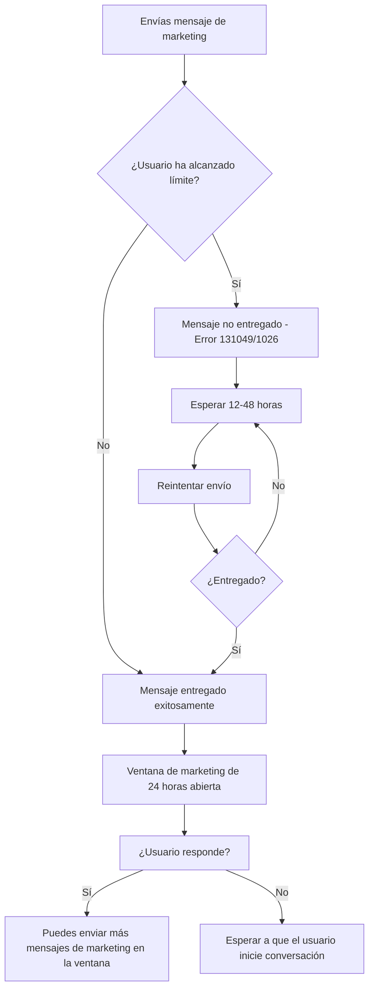

# Cómo Solucionar el Error: Mensaje de WhatsApp No Entregado — Ecosistema Saludable


> **Última actualización:** 30 de marzo de 2026. Este error está directamente relacionado con los **límites de mensajes de marketing por usuario** que WhatsApp implementó para proteger la experiencia de los usuarios y la salud del ecosistema de mensajería.

WhatsApp es una herramienta poderosa para que las empresas se conecten con sus clientes. Sin embargo, algunos usuarios se encuentran con un error frustrante al enviar mensajes de plantilla de marketing a través del chat en vivo o transmisiones masivas:

> **"Este mensaje no fue entregado para mantener un ecosistema de interacción saludable."**

O también:

> **"Para mantener un ecosistema de interacción saludable, no se pudo entregar el mensaje."**

Si te has enfrentado a este problema, es muy probable que se deba a los **Límites de Mensajes de Plantilla de Marketing por Usuario** de WhatsApp. Este sistema está diseñado para mejorar la experiencia del usuario limitando la cantidad de mensajes de marketing que una persona puede recibir en un período determinado.


> En E-SMART360 contamos con herramientas integradas que te permiten monitorear la tasa de entrega de tus mensajes y recibir alertas cuando te estés acercando a los límites por usuario, ayudándote a planificar mejor tus campañas.

---

## Comprendiendo el Mensaje de Error

WhatsApp aplica esta restricción para garantizar que los usuarios no se vean abrumados por mensajes excesivos o irrelevantes. Es parte del compromiso de Meta con la calidad de la comunicación en su plataforma. Cuando ocurre este error, significa que:

1. El destinatario ya ha recibido la cantidad máxima permitida de mensajes de marketing dentro del período definido.
2. WhatsApp ha decidido no entregar tu mensaje para mantener la interacción del usuario y la salud del ecosistema.
3. El sistema ha detectado que el usuario podría estar experimentando fatiga de mensajes, lo que podría llevar a que bloquee tu número o reporte tus mensajes como spam.

El error suele ir acompañado de códigos específicos que debes conocer:

| Código | Tipo de API | Descripción |
|--------|-------------|-------------|
| **131049** | Cloud API | Límite de mensajes de marketing por usuario alcanzado |
| **1026** | On-Premises API | Límite de mensajes de marketing por usuario alcanzado |
| **131042** | Cloud API | Error relacionado con el método de pago (puede confundirse con límite) |
| **131026** | Ambas | Mensaje no entregable (destinatario no tiene WhatsApp o ha bloqueado la cuenta) |


> **Dato clave:** El código 131049 también puede aparecer cuando hay problemas con el método de pago vinculado a tu cuenta de WhatsApp Business. Si ves este código pero no has superado los límites de marketing, verifica tu método de pago en el Administrador de WhatsApp. Para identificar correctamente la causa, revisa el mensaje completo de error en la respuesta del webhook.

### Diferencias entre los códigos de error relacionados

Es importante no confundir este error con otros problemas de entrega similares. Aquí tienes una guía rápida para identificar cada caso:


### Error 131049 vs 131026 vs 131042: ¿Cuál es cuál?

**Error 131049 — "Ecosistema saludable" (Este artículo)**
- **Síntoma:** El mensaje no se entrega pero no hay error del destinatario.
- **Causa:** El usuario ha alcanzado el límite de mensajes de marketing.
- **Solución:** Esperar y espaciar los envíos.

**Error 131026 — "Mensaje no entregable"**
- **Síntoma:** El mensaje no se entrega y el webhook muestra "undeliverable".
- **Causa:** El destinatario no tiene WhatsApp activo, bloqueó la cuenta o el número es inválido.
- **Solución:** Verificar que el número sea válido y esté activo en WhatsApp.

**Error 131042 — "Problema con método de pago"**
- **Síntoma:** Mensajes fallan en lote, no solo para usuarios específicos.
- **Causa:** El método de pago vinculado al WhatsApp Business Account tiene problemas.
- **Solución:** Verificar y corregir el método de pago en el Administrador de WhatsApp de Meta.

---

## ¿Por Qué WhatsApp Tiene Límites de Marketing por Usuario?

El objetivo de estos límites es:

- **Mejorar las tasas de lectura** reduciendo la fatiga de mensajes en los usuarios.
- **Mejorar la percepción del usuario** hacia los mensajes comerciales.
- **Garantizar que los mensajes comerciales sean valiosos y relevantes** para los usuarios.

Los datos de WhatsApp demuestran que menos mensajes, mejor segmentados y en el momento adecuado, generan una mayor interacción y satisfacción entre los usuarios.


> Meta implementa el **frequency capping** (límite de frecuencia) como un enfoque estratégico para proteger a los usuarios de la sobrecarga de mensajes y mantener un entorno de comunicación de alta calidad. Este límite se aplica principalmente a mensajes promocionales y se determina de forma dinámica según el comportamiento del usuario.

---

## Cómo Prevenir Este Error

Si te encuentras con este problema, aquí tienes las estrategias que puedes aplicar. Lo más importante es entender que WhatsApp no busca limitar tu negocio, sino garantizar que los usuarios tengan una experiencia positiva con los mensajes comerciales. Una estrategia bien planificada no solo evitará los errores de entrega, sino que mejorará la percepción de tu marca.

### 1. Espaciar los Mensajes de Marketing

- Evita enviar múltiples mensajes de marketing al mismo usuario en un período corto de tiempo.
- Permite que los usuarios interactúen con el primer mensaje antes de enviar otro.
- WhatsApp considera que si un usuario no ha interactuado con tu mensaje anterior, es probable que no quiera recibir más mensajes similares en el corto plazo.


### Define una frecuencia máxima semanal

Establece un límite interno de, por ejemplo, máximo 2 mensajes de marketing por semana para cada usuario. Esto te ayudará a mantenerte dentro de los límites dinámicos de WhatsApp. Para segmentos con baja interacción, reduce a 1 mensaje cada dos semanas.
  
### Monitorea la actividad del usuario

Revisa cuándo fue la última vez que el usuario abrió o respondió a un mensaje. Si no ha habido interacción reciente, espera antes de enviar el siguiente mensaje de marketing. En E-SMART360 puedes ver el historial de interacción de cada suscriptor en la sección de gestión de contactos.
  
### Utiliza un calendario de envíos

Planifica tus campañas con al menos 48-72 horas de separación entre cada envío al mismo segmento de audiencia. Un calendario de contenidos te ayudará a visualizar la frecuencia y evitar solapamientos.
  

> **Atención:** Incluso si tienes una plantilla de marketing aprobada, el límite por usuario se aplica de forma independiente. La aprobación de la plantilla no es una garantía de entrega ilimitada. WhatsApp evalúa cada envío de forma individual según el contexto actual del usuario.

### 2. Enfocarse en la Interacción

El objetivo principal de los límites de WhatsApp es fomentar conversaciones bidireccionales, no transmisiones unidireccionales. Cuanto más interactúen tus usuarios con tus mensajes, mejor será tu calificación de calidad y más altos serán tus límites.

- Anima a los usuarios a responder a tus mensajes. Cuando un usuario responde, obtienes la capacidad de enviar mensajes de marketing adicionales dentro de la misma ventana de conversación.
- Utiliza contenido interactivo como respuestas rápidas o botones para incitar a la interacción.
- Las preguntas abiertas al final de tus mensajes aumentan significativamente la probabilidad de que el usuario responda.

**Estrategias comprobadas para aumentar la interacción:**

1. **Incluye una pregunta al final del mensaje:** "¿Te gustaría saber más sobre este producto? Solo responde SÍ"
2. **Utiliza botones de llamada a la acción (CTA):** En lugar de decir "compra ahora", usa botones como "Ver catálogo" o "Hablar con un asesor"
3. **Ofrece contenido exclusivo:** "Responde QUIERO para recibir un cupón de descuento exclusivo"
4. **Crea encuestas rápidas:** "¿Qué tipo de contenido prefieres? Responde 1 para ofertas, 2 para consejos"
5. **Personaliza la interacción:** Usa el nombre del usuario y referencia su historial de compras o navegación


### ¿Cómo funciona la ventana de conversación de marketing?

Cuando un usuario inicia una conversación contigo (por ejemplo, haciendo una pregunta) o responde a uno de tus mensajes, se abre una **ventana de conversación de marketing de 24 horas**. Durante ese período, puedes enviar mensajes de marketing adicionales sin que cuenten para el límite de mensajes de plantilla. Esto se conoce como "conversación abierta".

**Ejemplo práctico:**
1. Envías un mensaje de plantilla de marketing ofreciendo un descuento.
2. El usuario responde: "¿En qué productos aplica?"
3. Se abre una ventana de marketing de 24 horas.
4. Durante esas 24 horas, puedes responder y enviar mensajes adicionales sin temor a los límites por usuario.
5. Puedes aprovechar esta ventana para hacer upselling, resolver dudas o guiar al usuario hacia la compra.

Es importante entender que una vez que la ventana de 24 horas expira, cualquier mensaje subsecuente de tipo marketing volverá a estar sujeto a los límites por usuario. Por eso es tan importante aprovechar al máximo cada ventana de conversación abierta.


> **Estrategia recomendada:** Cuando un usuario responde a tu mensaje de marketing, aprovecha la ventana de 24 horas para:
- Enviar hasta 3 mensajes de seguimiento con información adicional
- Ofrecer contenido complementario (vídeos, catálogos, testimonios)
- Cerrar la venta o agendar una llamada
- Todo esto sin consumir tu cuota de mensajes de plantilla de marketing


### 3. Aprovechar las Conversaciones Activas

Las conversaciones activas son tu mejor herramienta para evitar los límites de marketing por usuario. Una conversación activa te permite comunicarte libremente con el usuario sin restricciones.

- Cuando ya tengas una conversación de marketing abierta con un usuario, concéntrate en nutrirla. Puedes enviar seguimientos o mensajes adicionales dentro de la misma ventana de conversación.
- Utiliza esta ventana para profundizar en la relación con el cliente, ofrecer valor añadido y resolver dudas.
- No apresures la conversación: tómate el tiempo necesario para entender las necesidades del usuario y ofrecer soluciones personalizadas.

**¿Cómo identificar una conversación activa?**

En el panel de E-SMART360, las conversaciones activas se muestran con un indicador de estado. Cuando ves que una conversación está "activa", significa que el usuario ha respondido recientemente y tienes una ventana abierta para comunicarte. Aprovecha este momento para:

- **Resolver dudas pendientes** sobre productos o servicios.
- **Ofrecer recomendaciones personalizadas** basadas en el historial del usuario.
- **Compartir contenido relevante** como catálogos, enlaces a productos o vídeos demostrativos.
- **Cerrar la venta** con un enlace de pago o una llamada a la acción clara.
- **Solicitar retroalimentación** sobre la experiencia de compra o atención recibida.


> **Dato importante:** Una conversación activa bien gestionada puede ser el inicio de una relación comercial duradera. Los usuarios que interactúan contigo en WhatsApp tienen 3 veces más probabilidades de realizar una compra que aquellos que solo reciben mensajes de marketing pasivos.

### 4. Evitar el Reenvío Inmediato

Si tu mensaje falla debido al límite, **no lo reenvíes inmediatamente**. Reenviar de forma inmediata y repetida no solo no resolverá el problema, sino que puede empeorar tu calificación de calidad y reducir aún más tus límites de mensajería.

WhatsApp interpreta los reenvíos inmediatos como comportamiento de spam, lo que puede llevar a penalizaciones adicionales. En su lugar, reintenta en intervalos de tiempo crecientes:


### 🕐 Primer reintento

Después de **12 horas**. Esto le da tiempo al usuario para interactuar con otros mensajes o para que el límite dinámico se restablezca.
  
### 🕑 Segundo reintento

Después de **24 horas**. Si el mensaje sigue sin entregarse, espera otro día completo antes de intentarlo de nuevo.
  
### 🕒 Tercer reintento

Después de **48 horas**. Si después de 48 horas el mensaje no se entrega, considera cambiar el enfoque o el contenido del mensaje.
  
### 📊 Monitoreo continuo

Revisa el estado del webhook después de cada reintento. El webhook te mostrará si el mensaje fue entregado exitosamente o si sigue fallando.
  
### 5. Segmentar tu Audiencia

- Prioriza el envío de mensajes a usuarios que hayan mostrado interacción previa.
- Adapta los mensajes a las preferencias del usuario para que sean más relevantes y tengan más probabilidades de ser leídos.
- Utiliza etiquetas y campos personalizados para clasificar a tus suscriptores según su nivel de engagement.

**Categorías de segmentación recomendadas:**

| Segmento | Descripción | Frecuencia recomendada | Tipo de contenido |
|----------|-------------|----------------------|-------------------|
| Alta interacción | Respondieron en los últimos 30 días | 2-3 mensajes/semana | Ofertas, novedades, contenido premium |
| Interacción media | Abrieron mensajes pero no respondieron | 1-2 mensajes/semana | Contenido educativo, encuestas |
| Baja interacción | No han abierto mensajes en 60+ días | 1 mensaje cada 2 semanas | Reactivación, contenido de valor |
| Nuevos suscriptores | Se unieron en los últimos 7 días | 2 mensajes de bienvenida | Onboarding, expectativas |
| Opt-out parcial | Usuarios que pidieron menos mensajes | 1 mensaje/mes | Solo contenido esencial |


> **Consejo de E-SMART360:** Utiliza la funcionalidad de segmentación avanzada para crear grupos de usuarios basados en su comportamiento. Por ejemplo, puedes crear un segmento de "clientes con alta interacción" que hayan respondido al menos una vez en los últimos 30 días, y enfocar tus campañas de marketing principalmente en ellos, reduciendo la frecuencia para los segmentos de menor interacción.

### 6. Utilizar la Estrategia de "Mensajes Escalonados"

En lugar de enviar el mismo mensaje a toda tu lista al mismo tiempo, implementa una estrategia de mensajes escalonados:

1. **Grupo A (10% de la audiencia):** Envía el mensaje el día 1.
2. **Grupo B (20% de la audiencia):** Envía el mensaje el día 2.
3. **Grupo C (30% de la audiencia):** Envía el mensaje el día 3.
4. **Grupo D (40% de la audiencia):** Envía el mensaje el día 4.

Esto permite que WhatsApp vea que tus mensajes se distribuyen en el tiempo y no como un pico masivo, lo que reduce la probabilidad de que los límites por usuario se activen de forma agresiva.

---

## ¿Qué Hacer si Recibes Este Error?

### 1. Verificar el Código de Error

Busca el código de error específico en la respuesta de tu API o webhook. Los códigos **131049** y **1026** indican que se ha aplicado el límite por usuario.


#### Ejemplo de respuesta webhook

```json
{
  "messages": [
    {
      "id": "amid.ERROR_CODE_131049"
    }
  ],
  "error": {
    "code": 131049,
    "title": "Message not delivered to maintain healthy ecosystem engagement",
    "details": "The recipient has reached the marketing message limit"
  }
}
```

### 2. Pausar y Reintentar Más Tarde

Evita enviar spam al destinatario intentando repetidamente la entrega. En su lugar, utiliza una lógica de reintento incremental para respetar los límites del usuario.

### 3. Revisar tu Estrategia de Mensajería

Evalúa la frecuencia y el contenido de tus mensajes. Asegúrate de que estás llegando a la audiencia correcta con información relevante y valiosa.

### 4. Verificar el Método de Pago


### Error 131042: Problemas con el método de pago

A veces, un error similar puede estar relacionado con el método de pago de tu cuenta de WhatsApp Business. Si ves el código 131042, significa:

**Mensaje de error:** *"El mensaje no se pudo enviar porque hubo uno o más errores relacionados con tu método de pago."*

**Causas comunes:**
- El método de pago no está conectado correctamente en el Administrador de WhatsApp de Meta.
- Faltan datos comerciales después de agregar el método de pago.
- El Administrador de Empresas de Facebook no está verificado.
- El Administrador de WhatsApp está suspendido.

**Solución rápida:**
1. Ve a la configuración de pagos en tu Administrador de WhatsApp.
2. Verifica que tengas un método de pago agregado y que los datos fiscales estén completos.
3. Confirma que tu Administrador de Empresas de Facebook esté verificado.

---

## Cómo Funciona la Notificación de Error

- WhatsApp proporciona retroalimentación en tiempo real sobre los mensajes no entregados a través del estado del webhook.
- Cuando ocurre el error, el webhook mostrará el estado del mensaje como **fallido**, con el código de error correspondiente.
- Puedes configurar tu panel de E-SMART360 para recibir alertas automáticas cuando se detecten estos errores, permitiéndote actuar rápidamente.


### Diagrama de flujo del proceso de entrega



> **¿Sabías que...?** El límite de frecuencia (frequency capping) se determina de forma dinámica y no hay un número fijo de mensajes que un usuario pueda recibir. Meta utiliza un algoritmo complejo que considera múltiples factores como la interacción del usuario, la calidad de tu cuenta y el tipo de mensaje. Por eso es tan importante mantener una calificación de calidad alta en tu cuenta de WhatsApp Business.

---

## Mejores Prácticas para Optimizar tu Mensajería

### Usar Personalización

Dirígete a los usuarios por su nombre o haz referencia a interacciones anteriores para crear una sensación de familiaridad. Los mensajes personalizados tienen una tasa de interacción significativamente mayor.


### Ejemplo de mensaje personalizado vs. genérico

**Mensaje genérico (menos efectivo):**
"Hola, tenemos una oferta especial para ti. ¡Aprovecha ahora!"

**Mensaje personalizado (más efectivo):**
"Hola, María. Notamos que la semana pasada viste nuestros zapatos deportivos. ¡Justo hoy tenemos un 20% de descuento en esa categoría! ¿Te gustaría ver los nuevos modelos?"

**Elementos clave de un mensaje personalizado efectivo:**

1. **Nombre del destinatario:** Siempre en la primera línea del mensaje.
2. **Referencia a interacción previa:** "Viste", "preguntaste", "compraste" — conectar con acciones pasadas.
3. **Contexto relevante:** Menciona el producto, servicio o tema que le interesa al usuario.
4. **Propuesta de valor clara:** Explica por qué este mensaje es beneficioso para él/ella.
5. **Llamada a la acción específica:** Un solo botón o instrucción clara, no múltiples opciones confusas.

### Enviar Contenido Basado en Valor

Enfócate en proporcionar valor a tus usuarios, como promociones relevantes, consejos útiles o actualizaciones relacionadas con sus intereses. Evita enviar contenido puramente promocional sin valor añadido. La regla de oro es: **por cada mensaje promocional, envía dos mensajes de valor.**


### Tipos de contenido con alto valor para el usuario

- **Contenido educativo:** Guías, tutoriales, tips relacionados con tu industria. Por ejemplo, una tienda de mascotas puede enviar "5 consejos para el cuidado dental de tu perro".
- **Ofertas exclusivas:** Descuentos por fidelidad, acceso anticipado a nuevos productos, regalos por cumpleaños.
- **Actualizaciones relevantes:** Cambios en políticas, nuevos servicios, horarios especiales en temporada festiva.
- **Contenido interactivo:** Encuestas, preguntas, invitaciones a eventos webinars o lanzamientos.
- **Recordatorios útiles:** Citas próximas, carritos abandonados, renovaciones, cambios de estación.
- **Contenido generado por usuarios:** Testimonios, casos de éxito, reseñas de otros clientes.

> **La proporción 80/20:** El 80% de tus mensajes de marketing deberían ser contenido de valor (educativo, informativo, interactivo) y solo el 20% deberían ser promocionales directos. Esta proporción no solo mejora la experiencia del usuario, sino que también mantiene saludable tu calificación de calidad y reduce significativamente los bloqueos.

### Respetar las Preferencias del Usuario

Permite que los usuarios opten por no recibir mensajes de marketing si lo desean. Esto genera confianza y previene fallos de entrega innecesarios. Una buena práctica es incluir un mensaje de "exclusión voluntaria" claro en cada comunicación.

**Cómo implementar la exclusión voluntaria correctamente:**

1. Incluye una opción clara al final de cada mensaje: "Responde STOP para no recibir más ofertas".
2. Procesa las solicitudes de baja en un máximo de 24 horas.
3. Mantén un registro de usuarios que han optado por no recibir mensajes.
4. No intentes convencer al usuario de que se quede: respeta su decisión.
5. Ofrece opciones graduales: "¿Prefieres recibir menos mensajes? Responde MENOS" en lugar de solo la opción binaria.


> **Importante:** No enviar mensajes a usuarios que hayan optado por no recibirlos puede resultar en penalizaciones en tu calificación de calidad de WhatsApp, lo que afectará negativamente tus límites de mensajería y la capacidad de entrega de tus campañas futuras. Una tasa alta de bloqueos o reportes de spam puede reducir drásticamente tus límites de mensajería.

### Mantener una Tasa de Bloqueos Baja

La tasa de bloqueos (usuarios que bloquean tu número o reportan tus mensajes como spam) es uno de los indicadores más importantes que WhatsApp monitorea. Una tasa de bloqueos superior al 0.5% puede resultar en una degradación inmediata de la calificación de calidad.

**Recomendaciones para mantener una tasa de bloqueos baja:**

1. **Envía solo a usuarios que hayan dado su consentimiento explícito.** No compres listas de contactos ni agregues números sin autorización.
2. **Facilita la opción de darse de baja.** Si un usuario no puede encontrar cómo dejar de recibir mensajes, es más probable que te bloquee.
3. **Monitorea las tasas de bloqueo después de cada campaña.** Identifica qué segmentos o tipos de mensaje generan más bloqueos.
4. **Reduce la frecuencia si notas un aumento en los bloqueos.** Es mejor enviar menos mensajes y mantener la calidad que saturar a los usuarios.
5. **Ofrece contenido relevante y segmentado.** Un mensaje irrelevante es la causa principal de bloqueos.

---

## Estrategias Avanzadas para Mantener un Ecosistema Saludable

### Calidad de la Cuenta y su Impacto en la Entrega

La calificación de calidad de tu cuenta de WhatsApp Business influye directamente en los límites de mensajería. Una cuenta con calificación alta puede enviar más mensajes de marketing y tiene menos probabilidades de experimentar el error de "ecosistema saludable". Aquí te mostramos cómo mantener una buena calificación:


### Monitorea tu calificación de calidad semanalmente

Accede al panel de calidad de tu cuenta en E-SMART360 o en el Administrador de WhatsApp de Meta. Revisa si hay alertas o recomendaciones. La calificación se muestra con tres estados: Verde (alta), Amarillo (media) y Rojo (baja).
  
### Responde a los bloqueos de usuarios

Si los usuarios bloquean tu número o reportan tus mensajes como spam, tu calificación de calidad baja. Revisa las tasas de bloqueo después de cada campaña y ajusta tu estrategia si notas un aumento.
  
### Mantén una tasa de bloqueo inferior al 0.5%

Esta es la referencia recomendada por Meta. Si superas este umbral, tu calificación de calidad podría degradarse y tus límites de mensajería se reducirían drásticamente.
  
### Utiliza mensajes utilitarios cuando sea posible

Los mensajes utilitarios (confirmaciones de pedido, estados de envío, recordatorios de citas, notificaciones de actualización de cuenta) no están sujetos a los mismos límites que los de marketing. Siempre que puedas, utiliza este tipo de plantillas para comunicaciones transaccionales.
  
### Entendiendo los Tipos de Conversación y su Facturación

Para optimizar tu estrategia, es importante entender los diferentes tipos de conversación que existen en WhatsApp Business API, ya que cada uno tiene reglas y costos diferentes:

| Tipo de Conversación | Cómo se inicia | Límite de marketing | Costo por conversación |
|---------------------|----------------|---------------------|----------------------|
| **Marketing** | Empresa envía plantilla de marketing | Sí, aplica límite por usuario | Variable según región |
| **Utilidad** | Empresa envía plantilla de utilidad | No aplica | Generalmente menor que marketing |
| **Servicio** | Usuario envía mensaje primero | No aplica (ventana de 24h) | La más económica |
| **Autenticación** | Empresa envía código de verificación | No aplica | Varía por región |


> **Estrategia de ahorro:** Siempre que un usuario te contacte primero (conversación de servicio), responde dentro de la ventana de 24 horas para evitar costos adicionales de plantilla. Si necesitas enviar información promocional, hazlo dentro de esa ventana de servicio, no como una conversación de marketing independiente.

### Cómo Identificar y Solucionar Problemas de Calidad Antes de que Afecten tus Límites

WhatsApp evalúa tu cuenta basándose en tres factores principales:

1. **Calidad de los mensajes:** Basada en los reportes de spam, bloqueos y quejas de los usuarios.
2. **Tasa de interacción:** Cuántos usuarios abren, leen y responden tus mensajes.
3. **Volumen de mensajes:** La cantidad total de mensajes que envías y la consistencia de tu actividad.


### Pasos para recuperar una calificación de calidad baja

Si tu calificación ha bajado a amarilla o roja, sigue estos pasos:

1. **Pausa todas las campañas de marketing inmediatamente** para evitar más bloqueos.
2. **Revisa las últimas 3 campañas** para identificar qué mensajes generaron más reportes.
3. **Analiza el segmento de audiencia** que recibió esos mensajes. ¿Eran relevantes?
4. **Reduce la frecuencia** a la mitad durante las siguientes 2 semanas.
5. **Envía solo contenido utilitario o de servicio** durante el período de recuperación.
6. **Monitorea diariamente** la calificación hasta que vuelva a verde.
7. **Una vez recuperada, reintroduce las campañas de marketing gradualmente.**

El proceso de recuperación puede tomar de 7 a 30 días, dependiendo de la gravedad de la penalización.

### Entendiendo los Límites de Transmisión (Broadcast)

Además de los límites por usuario, WhatsApp también impone límites generales de transmisión basados en el nivel de tu cuenta:

| Nivel de cuenta | Límite de destinatarios por broadcast | Usuarios elegibles |
|----------------|--------------------------------------|-------------------|
| Inicial | 250 usuarios/día | Cuentas nuevas |
| Mediano | 1,000 - 10,000 usuarios/día | Cuentas verificadas con buena calidad |
| Alto | 10,000 - 100,000+ usuarios/día | Cuentas con calificación alta y verificación empresarial |


> Si necesitas enviar transmisiones a una gran audiencia, escala gradualmente. No intentes enviar 100,000 mensajes en tu primer broadcast. Comienza con lotes pequeños, aumenta progresivamente y monitorea la tasa de entrega y la calificación de calidad.

### Regla de las 24 Horas

Es fundamental entender la regla de las 24 horas de WhatsApp:

- **Ventana de servicio al cliente (24 horas):** Cuando un usuario te envía un mensaje, tienes 24 horas para responder con cualquier tipo de mensaje (incluyendo marketing) sin usar una plantilla. Esto se considera una "conversación de servicio".
- **Ventana de marketing (24 horas):** Cuando inicias una conversación con un mensaje de plantilla de marketing y el usuario responde, se abre una ventana de 24 horas para mensajes adicionales.
- **Fuera de la ventana:** Fuera de estas ventanas, solo puedes enviar mensajes de plantilla aprobados (marketing o utilitarios).


### Ejemplo práctico de la regla de 24 horas

**Escenario:**
- **Día 1, 10:00 AM:** Usuario pregunta "¿Cuándo llega mi pedido?" → Se abre ventana de servicio de 24 horas.
- **Día 1, 10:05 AM:** Respondes "Tu pedido llegará mañana" → Mensaje dentro de la ventana.
- **Día 1, 3:00 PM:** Envías "Aprovecha nuestro descuento del 20%" → También dentro de la ventana de servicio. No cuenta como mensaje de marketing independiente.
- **Día 2, 10:05 AM:** La ventana de 24 horas expira.
- **Día 2, 3:00 PM:** Para enviar otro mensaje de marketing, necesitas usar una plantilla aprobada, y este envío estará sujeto a los límites por usuario.

---

## Monitoreo de Entregas con Webhooks

Una de las herramientas más importantes para gestionar el error de ecosistema saludable es el monitoreo en tiempo real de la entrega de tus mensajes a través de webhooks. WhatsApp envía actualizaciones de estado para cada mensaje, permitiéndote reaccionar de inmediato cuando un mensaje no se entrega.

### Estados de Entrega que Debes Conocer

| Estado | Significado | Acción recomendada |
|--------|-------------|-------------------|
| **sent** | Mensaje enviado al servidor de WhatsApp | Esperar actualización |
| **delivered** | Mensaje entregado al dispositivo del usuario | Sin acción necesaria |
| **read** | Mensaje leído por el usuario | Sin acción necesaria, pero útil para métricas |
| **failed** | Mensaje no entregado (incluye error de ecosistema saludable) | Revisar código de error y aplicar reintento |

### Cómo Interpretar la Respuesta del Webhook

Cuando recibes un estado "failed" en tu webhook, el payload incluirá información detallada sobre la causa del fallo. Aquí tienes un ejemplo de cómo analizar esta información:


### Payload de error 131049

```json
    {
      "statuses": [{
        "id": "amid.ERROR_CODE_131049",
        "status": "failed",
        "timestamp": "1714500000",
        "conversation": {
          "id": "conversation_id",
          "origin": "marketing"
        },
        "errors": [{
          "code": 131049,
          "title": "Message not delivered",
          "details": "Not delivered to maintain healthy ecosystem"
        }]
      }]
    }
    ```
  
### Interpretación

**Código:** 131049 → Límite de mensajes de marketing por usuario
    **Estado:** failed → No se entregó
    **Origen:** marketing → Era un mensaje de marketing
    **Acción:** No reenviar inmediatamente. Esperar 12-48 horas.
  
### Configuración de Alertas Automáticas en E-SMART360

Puedes configurar tu panel de E-SMART360 para recibir notificaciones automáticas cuando se detecten errores de entrega. Esto te permite:

1. **Recibir una alerta instantánea** cuando un mensaje de marketing falla por límite por usuario.
2. **Ver un resumen diario** de las tasas de entrega de cada campaña.
3. **Identificar patrones** de fallo (¿ciertos segmentos fallan más que otros?).
4. **Ajustar tu estrategia** basándote en datos en tiempo real, no en suposiciones.


> **Recomendación:** Configura una alerta cuando la tasa de entrega de una campaña caiga por debajo del 85%. Esto te dará tiempo para ajustar la estrategia antes de que tu calificación de calidad se vea afectada.

---

## Preguntas Frecuentes


### ¿El límite de frecuencia (frequency capping) solo aplica en India?

No. El límite de frecuencia de Meta se aplica globalmente. No es una regulación específica de un país, sino una política de WhatsApp para proteger la experiencia del usuario en todos los mercados. Sin embargo, la implementación puede variar ligeramente según la región y el comportamiento de los usuarios locales. Empresas de todos los países deben cumplir con esta política.

### ¿Cuántos mensajes de marketing puede recibir un usuario exactamente?

No hay un número fijo. Meta determina el límite de forma dinámica basándose en múltiples factores como la interacción del usuario con mensajes anteriores, su historial de bloqueos, la calificación de calidad de tu cuenta y el tipo de mensaje. Lo importante es centrarse en la calidad y relevancia del contenido, no en buscar un número exacto. Lo que funciona para un usuario puede no funcionar para otro.

### ¿Los mensajes de confirmación de opt-in garantizan la entrega?

No necesariamente. Aunque un usuario haya dado su consentimiento para recibir mensajes, el algoritmo de Meta es complejo y puede decidir no entregar un mensaje si determina que el usuario está recibiendo demasiados mensajes promocionales en un período corto. El opt-in es necesario pero no suficiente: la relevancia y la frecuencia adecuada son igual de importantes para garantizar la entrega.

### ¿El límite de frecuencia afecta a todos los tipos de mensajes?

Principalmente impacta a los mensajes promocionales o de marketing. Los mensajes utilitarios (como confirmaciones de pedido, notificaciones de envío, recordatorios de citas y verificación de cuentas) no están sujetos a los mismos límites porque se consideran necesarios para la experiencia del usuario. WhatsApp prioriza la entrega de estos mensajes sobre los promocionales. Aprovecha esta diferencia siempre que sea posible.

### ¿Qué hago si mi mensaje no se entrega y necesito comunicarme con el usuario urgentemente?

Si tu mensaje de marketing no se entrega por límite de frecuencia, considera estas alternativas:
1. **Usa una plantilla utilitaria:** Si tu comunicación es realmente urgente (como una notificación de seguridad o un cambio de última hora), utiliza una plantilla de tipo utilitario en lugar de marketing.
2. **Espera a que el usuario inicie la conversación:** Si el usuario te envía un mensaje, se abrirá una ventana de servicio de 24 horas donde podrás comunicarte libremente.
3. **Utiliza otro canal:** Si la urgencia lo justifica, contacta al usuario por correo electrónico, SMS u otro canal alternativo que tengas disponible.
4. **Programa el reintento:** Configura el mensaje para reintentar automáticamente después de 24-48 horas.

### ¿Puedo apelar la decisión de WhatsApp de no entregar un mensaje?

No existe un proceso formal de apelación para mensajes individuales no entregados. Sin embargo, puedes:
1. **Mejorar tu calificación de calidad:** Sigue las mejores prácticas descritas en esta guía para mejorar la calificación de tu cuenta.
2. **Contactar al soporte de Meta:** Si consideras que hay un error sistémico, puedes contactar al soporte de Meta para WhatsApp Business API a través del centro de ayuda.
3. **Revisar tus plantillas:** Asegúrate de que tus plantillas de marketing estén aprobadas correctamente y no contengan elementos que puedan ser considerados spam.
4. **Analizar el comportamiento del usuario:** Revisa si el usuario ha bloqueado mensajes similares en el pasado para ajustar tu enfoque.

### ¿El error de ecosistema saludable puede desaparecer solo?

Sí, en muchos casos el error es temporal. Los límites de mensajes de marketing por usuario se restablecen después de un período de tiempo. Si detienes el envío de mensajes de marketing a ese usuario por 24-48 horas, es probable que el siguiente intento sea exitoso. Sin embargo, si el problema persiste, puede ser indicativo de que tu estrategia general de mensajería necesita ajustes.

### ¿Cómo afecta el horario de envío a la tasa de entrega?

El horario de envío puede tener un impacto significativo. Enviar mensajes en horarios poco convenientes (muy temprano, muy tarde, los fines de semana) puede resultar en menor interacción y, por lo tanto, mayor probabilidad de que WhatsApp degrade la prioridad de tus mensajes. Se recomienda:
- Enviar mensajes de marketing entre las 9:00 AM y las 6:00 PM en el huso horario del destinatario.
- Evitar los fines de semana para campañas promocionales.
- Analizar cuándo tus usuarios son más receptivos según el historial de interacción.

### ¿Qué relación hay entre la suscripción de WhatsApp Business y los límites de mensajería?

Existen tres niveles de límite de mensajería que determinan cuántos destinatarios pueden recibir tus mensajes en un período de 24 horas:

| Nivel | Límite de destinatarios por día | Requisitos |
|-------|--------------------------------|------------|
| **Trial** | 250 | Cuenta nueva, límites restringidos |
| **Nivel 1** | 1,000 | Verificación de negocio básica |
| **Nivel 2** | 10,000 | Cuenta verificada con buena calificación |
| **Nivel 3** | 100,000 | Cuenta verificada con calificación alta |
| **Nivel 4** | 250,000+ | Negocio establecido con excelente historial |

Para aumentar tu nivel, debes mantener una buena calificación de calidad y solicitar el aumento a través del Administrador de WhatsApp. E-SMART360 te guía en cada paso de este proceso.

---

## Ejemplos Prácticos y Casos de Uso


### 🛒 Caso 1: Tienda de e-commerce con envíos semanales

**Problema:** Una tienda de moda envía 3 mensajes de marketing por semana a todos sus suscriptores: lunes (ofertas), miércoles (novedades) y viernes (descuentos exclusivos). Comienzan a recibir el error de ecosistema saludable.

    **Solución aplicada:**
    1. Redujeron a 1 mensaje de marketing general por semana (los viernes).
    2. El mensaje del lunes lo convirtieron en una plantilla utilitaria de "recordatorio de carrito abandonado" para usuarios específicos.
    3. El mensaje del miércoles lo reemplazaron con contenido interactivo: un botón de "¿Qué te gustaría ver?" que invita al usuario a responder.
    4. Segmentaron su audiencia: clientes frecuentes reciben ofertas especiales; nuevos suscriptores reciben contenido de bienvenida.

    **Resultado:** La tasa de entrega subió del 72% al 94%, y las ventas por WhatsApp aumentaron un 35%.
  
### 🏨 Caso 2: Hotel con campañas de temporada

**Problema:** Un hotel envía campañas masivas de marketing durante temporada alta (diciembre-marzo) a todos sus huéspedes anteriores. En enero, muchos mensajes comenzaron a fallar.

    **Solución aplicada:**
    1. Implementaron un sistema de "interés previo": solo envían ofertas a quienes hicieron clic en "Me interesa" en campañas anteriores.
    2. Espaciaron los envíos: una campaña cada 15 días por usuario, en lugar de semanal.
    3. Crearon contenido de valor: guías de viaje, recomendaciones de restaurantes locales y tips de empacado (como plantillas utilitarias).
    4. Utilizaron mensajes personalizados con el nombre del huésped y referencias a su última visita.

    **Resultado:** Redujeron los errores de entrega en un 80% y aumentaron las reservas recurrentes en un 25%.
  
---

## Conclusión

Los Límites de Mensajes de Plantilla de Marketing por Usuario de WhatsApp no son barreras, sino herramientas para ayudar a las empresas a comunicarse de manera más efectiva. Al comprender las razones detrás de este error e implementar las mejores prácticas descritas anteriormente, puedes garantizar:

- **Mayores tasas de interacción** con tus mensajes.
- **Menos problemas de entrega** en tus campañas.
- **Mejores relaciones con los clientes** basadas en comunicación relevante y respetuosa.


> **Recuerda:** La calidad siempre supera a la cantidad. Enfócate en crear mensajes valiosos, segmentados y oportunos, y WhatsApp recompensará tu estrategia con mejores tasas de entrega y una calificación de calidad más alta.

En E-SMART360, te proporcionamos todas las herramientas necesarias para monitorear, analizar y optimizar tus campañas de WhatsApp. Si necesitas ayuda para manejar estos errores o mejorar tu estrategia de mensajería, no dudes en contactarnos.

---

### Recursos Relacionados

Si estás enfrentando otros problemas de entrega, estos recursos pueden ayudarte:

- **[Error 131026: Mensaje No Entregable - Soluciones](/recursos/error-131026-mensaje-no-entregable)** — Guía para resolver el error cuando un mensaje no se puede entregar porque el destinatario no tiene WhatsApp activo o ha bloqueado la cuenta.
- **[Guía de Límites de Mensajería de WhatsApp](/recursos/limites-mensajeria-whatsapp)** — Explicación completa de los límites de mensajería según el nivel de tu cuenta.
- **[Mejores Prácticas para Plantillas de Mensajes](/recursos/mejores-practicas-plantillas-mensajes)** — Cómo crear plantillas que reduzcan los rechazos y mejoren la entrega.
- **[Verificación de Negocio en WhatsApp](/recursos/verificacion-negocio-whatsapp)** — Guía completa para verificar tu negocio y acceder a límites de mensajería más altos.
