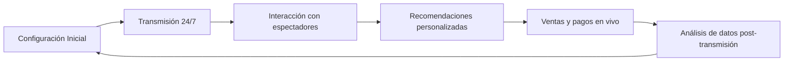

import { Callout, Steps, Step, Expandable, Columns, Card, Tabs, Tab, CodeGroup, CodeGroupItem, Update } from '/src/components/mdx';


> **Actualización (2 de marzo de 2026)**
> Este artículo fue actualizado con las últimas estadísticas y proyecciones del mercado de chatbots para 2025-2026. Incluye nuevas secciones sobre configuración práctica de chatbots, integraciones y casos de uso avanzados.

# Top 10 Tendencias de Chatbots en 2025


> **Lectura rápida:** 2025 es un año revolucionario para los chatbots con IA. Han evolucionado de simples herramientas reactivas a asistentes proactivos, con memoria, multilingües, activados por voz e impulsados por el comercio. Las plataformas de redes sociales como WhatsApp, Facebook, Instagram y Telegram están acelerando la adopción, mientras que tendencias como los compañeros AI, el comercio conversacional, los avatares AI en vivo, los bots de salud mental y la automatización de la economía de creadores están remodelando el compromiso digital.

Las empresas están aprovechando los chatbots para ventas personalizadas, soporte automatizado, expansión global y monetización de seguidores. Sin embargo, con un crecimiento rápido surge la necesidad de una ética, transparencia y regulación más sólidas. El futuro de los chatbots en 2025 es proactivo, inteligente, multimodal y basado en la confianza, combinando la eficiencia de la IA con la estrategia humana para lograr el máximo impacto.

## Por qué 2025 es un año revolucionario para los chatbots

El año 2025 marca un punto de inflexión donde los chatbots con IA se han convertido en equipos esenciales en todas las industrias. El lanzamiento de ChatGPT por OpenAI a finales de 2022 —que alcanzó los 100 millones de usuarios en solo dos meses— aceleró la IA interactiva a un ritmo sobresaliente. En 2024, se estima que **987 millones de personas** usaron chatbots con IA en todo el mundo, y el mercado global de chatbots alcanzó un valor cercano a los **$15 mil millones de dólares**.


> **Dato clave:** El 78% de las empresas ya utilizaban IA de alguna forma en 2024, frente al 55% del año anterior. Este crecimiento explosivo está inspirado por rápidos avances en habilidades de IA como memoria de contexto más amplia y comprensión multimodal, junto con la aceptación mainstream de los chatbots en la vida diaria.

### El contexto del mercado de chatbots

Para entender completamente por qué 2025 es un año tan importante, es útil observar la evolución del mercado en los últimos años. Los chatbots han pasado de ser simples sistemas basados en reglas a asistentes impulsados por modelos de lenguaje avanzados. Esta transición ha sido impulsada por varios factores clave:

- **Mejora en los modelos de lenguaje:** Modelos como GPT-4, Claude y Gemini han llevado la comprensión del lenguaje natural a niveles casi humanos.
- **Reducción de costos de computación:** El costo de ejecutar inferencias de IA ha disminuido drásticamente, haciendo accesible la tecnología a empresas de todos los tamaños.
- **Maduración de las APIs:** Las APIs de WhatsApp Business, Messenger e Instagram ahora permiten integraciones profundas con chatbots.
- **Aceptación cultural:** Los usuarios ya no ven los chatbots como una novedad, sino como una herramienta esperada y valorada.


> **El resultado:** En 2025, los chatbots no son solo una opción tecnológica; son una expectativa del cliente. Las empresas que no los implementan corren el riesgo de quedar rezagadas frente a competidores que ofrecen atención instantánea y personalizada 24/7.

## Cómo las redes sociales están impulsando la innovación en chatbots

Las redes sociales se han convertido en el catalizador más importante para el auge de los chatbots en 2025. Las aplicaciones sociales han llevado a cientos de millones de usuarios a los bots de IA casi de la noche a la mañana. TikTok probó un chatbot dentro de la aplicación llamado "Tako" para ayudar a los usuarios a encontrar contenido mediante interacción. Meta, la empresa matriz de Instagram y Facebook, está desarrollando personas AI para sus plataformas sociales, con planes filtrados de 30 "personalidades" AI diferentes para que los usuarios chateen, pidan consejo y se diviertan.


> E-SMART360 es compatible con las principales plataformas de redes sociales como WhatsApp, Facebook, Instagram y Telegram. Estas son cruciales para operar negocios en todo el mundo. Con E-SMART360 puedes gestionar todos tus chatbots desde un solo panel de control, independientemente de la plataforma en la que estén desplegados.

### WhatsApp como plataforma líder

WhatsApp se ha consolidado como la plataforma de mensajería más importante para los chatbots empresariales. Con más de 2 mil millones de usuarios activos mensuales, ofrece un alcance inigualable. La API de WhatsApp Business permite a las empresas enviar mensajes proactivos, gestionar conversaciones y automatizar respuestas de una manera que otras plataformas aún no igualan.


### WhatsApp — Datos clave

- **2,000+ millones** de usuarios activos mensuales
- **API oficial** para integraciones empresariales
- **Plantillas de mensajes** aprobadas por Meta
- **Soporte para pagos** integrados en el chat
- **Cifrado de extremo a extremo** para seguridad
- **Modo de prueba** para desarrollo y pruebas

### Facebook Messenger — Datos clave

- **1,300+ millones** de usuarios activos mensuales
- **Descubrimiento** a través de la página de Facebook
- **Anuncios Click-to-Messenger** para generar leads
- **Integración profunda** con tiendas de Facebook
- **Chatbots** para respuestas automáticas y FAQs
- **Handover Protocol** para transferencia a agentes humanos

Para 2025, las redes sociales no son solo una plataforma para chatbots; son el motor principal que impulsa su innovación. La integración directa en aplicaciones que los usuarios ya usan a diario elimina la fricción de descargar nuevas aplicaciones o aprender nuevas interfaces.

---

## 1. Compañeros AI y Amigos Digitales

### El auge de los amigos AI para la Generación Z y Alpha

Una tendencia particularmente notable de 2025 es la popularidad de los chatbots "compañero" AI —verdaderos amigos digitales que conversan para brindar apoyo emocional y compañía. Una encuesta reciente de Common Sense Media mostró que más del **70% de los adolescentes** han usado chatbots compañero AI, y que la **mitad de todos los adolescentes los usan regularmente**.


### Estadísticas clave

- **70%+** de adolescentes han usado chatbots compañero AI
- **50%** de adolescentes los usan regularmente
- **31%** dice que conversar con AI es tan satisfactorio como hablar con amigos reales
- **1 de cada 3** ha discutido problemas personales serios con AI en lugar de humanos
- **32%** de la Generación Z ha usado IA para apoyo emocional

### Plataformas populares

- **Character.ai:** 20 millones de usuarios activos mensuales, 75 minutos de uso diario promedio
- **AI Friend:** Aplicación de compañía emocional con IA conversacional
- **Replika:** Asistente personal con IA que aprende de las conversaciones
- **CarynAI:** Avatar de influencer para interacción con fans y monetización

### Implicaciones comerciales

- Nuevo mercado de monetización de relaciones digitales
- Oportunidad para marcas de crear "embajadores AI"
- Modelos de suscripción para acceso VIP a personalidades AI
- Integración con plataformas de redes sociales existentes

Estos compañeros AI están disponibles en aplicaciones como AI Friend, Replika o Character.ai. Los usuarios jóvenes de la Generación Z y la Generación Alpha, que han crecido con la tecnología, están especialmente preparados para estos pares digitales. Muchos adolescentes recurren a los amigos AI por el deseo de compartir curiosidades, soledad o emociones sin ser juzgados.


> Un usuario de 18 años lo expresó así: *"La IA nunca se aburre de ti ni te juzga"*. Esta disponibilidad y relación positiva incondicional satisface necesidades emocionales reales para algunos usuarios, pero también plantea preguntas importantes sobre la dependencia emocional de la tecnología y el desarrollo de habilidades sociales en los jóvenes.

### Compromiso emocional e interacciones diarias

El nivel de compromiso con los amigos AI es sorprendente. Character.ai, una plataforma popular para crear y chatear con bots de personajes, atendió a **20 millones de usuarios activos mensuales** a principios de 2025, donde los usuarios pasaban un promedio de **75 minutos por día** inmersos en estas conversaciones con IA. Según un análisis, el **32% de los usuarios de la Generación Z** han usado IA para apoyo emocional, lo que enfatiza cómo las conexiones digitales se han vuelto algo común para los jóvenes.


### ¿Cómo funcionan los compañeros AI en la práctica?

Los usuarios tratan a estos colegas AI como amigos reales o confidentes durante el día: piden consejos, juegan roles o simplemente bromean. La IA puede recordar detalles previos y "chistes internos", lo que crea la ilusión de una relación genuina. La IA puede recordar eventos previos, preferencias e incluso estados de ánimo, adaptando sus respuestas para ser más relevante y personal con cada interacción. La aparición de colegas AI en 2025 sugiere que los chatbots ya no son solo manejadores de transacciones; se convierten en amigos digitales íntimos para millones, especialmente entre GenZ y Gen Alpha, que encuentran en la IA una expansión natural de su mundo social.

> **¿Cómo aprovechar esta tendencia en los negocios?** Las marcas pueden crear personalidades AI que actúen como embajadores de la marca, ofreciendo a los clientes una relación más personal y emocional con los productos o servicios. E-SMART360 permite entrenar asistentes AI con la personalidad y el tono de tu marca, creando experiencias de cliente únicas y memorables.

---

## 2. Chatbots Proactivos con Memoria

### De reactivos a proactivos

Los chatbots tradicionales eran mayormente reactivos —solo respondían cuando un usuario preguntaba algo explícitamente. En 2025, vemos un cambio hacia asistentes AI activos que estiman las necesidades del usuario e inician interacciones útiles. Gracias a la comprensión contextual relevante y la mejora en la integración con datos de usuario, los chatbots modernos no siempre esperan una pregunta.

Este enfoque proactivo está impulsado por análisis predictivos y disparadores basados en comportamiento. En la práctica, esto significa que un chatbot puede enviarte un mensaje como: **"Hola, noté que tu pedido final aún no ha sido enviado — ¿quieres que lo revise?"**


### Paso 1: Identificación de necesidad

El chatbot detecta patrones de comportamiento del usuario: un carrito abandonado, una suscripción por vencer, una consulta recurrente sin resolver, o incluso la inactividad prolongada del cliente. Utiliza datos en tiempo real para identificar oportunidades de interacción.

### Paso 2: Iniciativa proactiva

El bot envía un mensaje contextualmente relevante sin esperar a que el usuario pregunte. Por ejemplo: "Han pasado 3 días desde tu última compra. ¿Te gustaría ver las novedades?" o "Tu suscripción premium está por vencer. ¿Deseas renovarla?"

### Paso 3: Seguimiento inteligente

Si el usuario responde, el bot continúa la conversación con contexto completo de interacciones previas, ofreciendo respuestas cada vez más personalizadas. Si no responde, programa un recordatorio para más tarde.

### Paso 4: Automatización de acciones

El chatbot puede ejecutar acciones como crear un ticket de soporte, agendar una llamada, procesar un reembolso o actualizar una orden sin intervención humana.


> Puedes utilizar el sistema de notificación de carrito abandonado de E-SMART360 para conectar con tus clientes y crear este tipo de chatbot proactivo. Este compromiso anticipado mejora la satisfacción del usuario y puede impulsar las ventas a través de ofertas oportunas y recordatorios personalizados.

### Conversaciones personalizadas que nunca "olvidan"

Los chatbots con memoria recuerdan interacciones previas, preferencias e incluso los objetivos del usuario. Esto significa que cada conversación se construye sobre las anteriores, creando una experiencia continua y coherente. Por ejemplo, un chatbot coach de salud AI puede recordar tus planes dietéticos anteriores y hacer un seguimiento constante: **"Han pasado dos semanas desde que establecimos el objetivo de trotar 3 veces por semana — ¿cómo va eso?"**


> El asistente AI de E-SMART360 está integrado con ChatGPT, lo que permite que tu chatbot recuerde conversaciones anteriores y mantenga el contexto a lo largo del tiempo. Además, los usuarios pueden usar la función de mensajes en secuencia para mantener el contacto con los clientes en campañas promocionales, de ventas y marketing.


### ¿Cómo configurar un chatbot con memoria en E-SMART360?

1. Accede al panel de control de E-SMART360 y selecciona "Asistente AI"
2. Activa la opción "Memoria de conversación" en la configuración del asistente
3. Define el contexto inicial que el chatbot debe recordar: nombre del cliente, preferencias, historial de compras
4. Configura los disparadores proactivos: carrito abandonado, cumpleaños, inactividad, etc.
5. Establece las acciones automáticas que el chatbot puede ejecutar
6. Prueba el comportamiento proactivo con el simulador integrado
7. Activa el chatbot en los canales deseados como WhatsApp, Facebook, Instagram, Telegram

---

## 3. Comercio Conversacional (C-Commerce)

### Compras, pago y pagos dentro de aplicaciones sociales

El comercio conversacional se ha vuelto cada vez más importante gracias a los chatbots interactivos. En 2025, los consumidores buscan productos a través de aplicaciones de mensajería rápida y chatbots integrados en redes sociales. Esta tendencia es especialmente visible en plataformas como **WhatsApp, Facebook Messenger, Instagram y WeChat**, donde las marcas usan chatbots para manejar todo el viaje de compra dentro de la interfaz de chat.


### Ejemplo práctico: Tienda de ropa en WhatsApp

Un usuario envía un mensaje a una tienda de ropa en WhatsApp para ver las últimas prendas. El chatbot le pregunta sobre su estilo preferido, talla y presupuesto, muestra imágenes del catálogo, y luego permite realizar el pedido directamente en el chat. El pago se procesa con tarjeta o PayPal sin salir de WhatsApp. Finalmente, el chatbot envía el número de seguimiento del envío y una encuesta de satisfacción.

### Resultados comprobados del C-Commerce

- **74%** de los especialistas en marketing usan o planean usar anuncios conversacionales para 2025
- **35%** de los estadounidenses usaron un chatbot en lugar de un motor de búsqueda para encontrar productos
- Más de **$80 mil millones** en transacciones a través de chatbots proyectados por Juniper Research
- **55%** del comercio global se realizará a través de chatbots para 2025

> E-SMART360 está equipado con integraciones de pago como PayPal, Stripe, Razorpay, Tap y muchos otros métodos de pago de todo el mundo para una experiencia de transacción comercial fluida. Esto significa que tus clientes pueden completar compras sin salir de la conversación de WhatsApp.

### Aumentando las ventas con experiencias personalizadas en el chat

Los chatbots con IA pueden hacer preguntas a los clientes sobre sus requisitos (tamaño, estilo, presupuesto) y buscar instantáneamente en el inventario para encontrar la mejor opción, actuando efectivamente como un vendedor personal disponible 24/7.


### ¿Cómo funciona la recomendación personalizada en el chat?

Estos chats imitan la experiencia de un dependiente de tienda: "¿Buscas zapatillas? ¿Prefieres más amortiguación o un estilo minimalista?" — y luego presentan alternativas seleccionadas. La integración con Google Sheets de E-SMART360 puede sugerir productos a tus clientes basándose en tu inventario existente según sus necesidades. Esta personalización uno a uno a escala tiene resultados probados. Las empresas que implementan chatbots de comercio conversacional reportan un aumento en las tasas de conversión de hasta el **30%** y una reducción significativa en el abandono del carrito de compra.

### Cómo configurar un chatbot de ventas en WhatsApp


### Conecta tu número de WhatsApp con E-SMART360

Utiliza el proceso de Embedded Signup para conectar tu número de teléfono con la API de WhatsApp Business. Esto te dará acceso a todas las funcionalidades de la API oficial, incluyendo plantillas de mensajes y métricas de conversación.

### Carga tu catálogo de productos

Sube tu inventario, precios e imágenes. Puedes hacerlo manualmente, mediante integración con WooCommerce o Shopify, o conectando una hoja de Google Sheets con los datos actualizados en tiempo real.

### Configura el flujo de conversación

Define los pasos que seguirá el chatbot: saludo, preguntas sobre preferencias, recomendaciones, selección de producto, pago, confirmación. Usa el constructor visual de flujos de E-SMART360.

### Activa los métodos de pago

Conecta PayPal, Stripe, Razorpay u otros métodos de pago soportados para que los clientes puedan pagar directamente en el chat sin redireccionamientos.

### Prueba y lanza

Realiza pruebas con el simulador de conversaciones, verifica que los pagos se procesan correctamente y activa el chatbot en tu número de producción.

---

## 4. Avatares AI en Ventas en Vivo (Livestream)

### Influencers virtuales presentando productos 24/7

En algunas partes del mundo, especialmente en China, ha surgido una nueva tendencia donde los avatares AI integrados en transmisiones en vivo actúan como anfitriones de ventas. Estos avatares son representaciones gráficas de personas (a menudo muy realistas) combinadas con chatbots avanzados que pueden hablar en cámara, responder preguntas de los espectadores y vender productos sin cansarse nunca.

En 2025, las grandes plataformas de comercio electrónico como Taobao y Pinduoduo de Alibaba han desplegado vendedores virtuales que operan 24/7, mostrando productos e interactuando con el público a través de texto a voz y expresiones animadas.


> **Dato impactante:** El comercio en vivo —ya una industria de más de **$100 mil millones** en China— está siendo transformado por avatares AI que pueden funcionar infinitamente y mantener un mensaje perfecto en cada transmisión.

### Cómo superan a los vendedores humanos

El éxito de los streamers AI se basa en tres factores clave: resistencia, datos y consistencia. A diferencia de los anfitriones humanos que se cansan después de unas horas, un avatar AI puede mantener un compromiso de alta energía constante las 24 horas del día.


### Humano vs AI

| Característica | Vendedor Humano | Avatar AI |
|----------------|-----------------|-----------|
| Duración máxima de transmisión | 3-4 horas | 24/7 sin fatiga |
| Energía y calidad | Disminuye con el tiempo | Constante durante todo el día |
| Acceso a datos en tiempo real | Limitado | Completo (inventario, precios, ofertas) |
| Costo operativo | Alto (salario + turnos múltiples) | Bajo (una inversión inicial) |
| Idiomas | Generalmente uno | Múltiples simultáneamente |
| Personalización por espectador | Difícil de escalar | Automática y personalizada |

### Casos de éxito documentados

- **Aumento de ventas del 30%** con anfitrión AI en una tienda de ropa
- **13 millones de espectadores** en una demo de Baidu con avatar de Luo Yongao
- **$7.7 millones en bienes vendidos** en un solo programa con AI avatar
- Empresas verifican cada mañana cuánto vendió la IA "mientras dormían"
- Grandes cadenas de comida rápida usando AI Avatar como presentadores en TikTok



---

## 5. Chatbots Multilingües e Hiperlocales

### Rompiendo barreras del idioma en tiempo real

A medida que los negocios se globalizan y las bases de clientes se vuelven más diversas, crece la demanda de chatbots que puedan interactuar en muchos idiomas con fluidez. Para 2025, los chatbots multilingües han pasado de ser "buenos para tener" a "imprescindibles". Las plataformas AI avanzadas de procesamiento de lenguaje natural (NLP) y traducción en tiempo real ahora admiten **más de 100 idiomas sobre la marcha**.


> **Dato clave:** Un estudio de Common Sense Advisory mostró que el **40% de los consumidores globales no compran en un sitio web que no esté en su idioma local**. Los chatbots multilingües eliminan esta barrera de entrada a nuevos mercados.

Esto significa que un usuario puede escribir en español y obtener una respuesta inmediata en español, mientras que otro usuario chatea en árabe o hindi y también recibe una experiencia espontánea y natural en su idioma.


### E-SMART360 y el soporte multilingüe

E-SMART360 es compatible con múltiples idiomas de todo el mundo. Puedes cambiar la configuración de idioma con solo un clic. El chatbot traduce y mantiene el contexto de forma dinámica, funcionando efectivamente como un intérprete en tiempo real. Esto elimina el clásico mensaje de "solo admitimos inglés" y abre tu negocio a mercados internacionales. Puedes aprender cómo cambiar la configuración de idioma en la sección de configuración del panel de administración.

### Expandiendo negocios a audiencias globales

El efecto de la IA multilingüe es claro en los datos de uso. La región de Asia-Pacífico, con su enorme población no angloparlante, ahora domina el uso global de chatbots. Según Juniper Research, **representa aproximadamente el 70% del uso** de chatbots en 2024. En China, se espera que los consumidores gasten **más de $80 mil millones a través de chatbots en 2024**, más de la mitad del total mundial.


> **Beneficio comprobado para los negocios:** Los estudios muestran que ofrecer soporte al cliente en el idioma nativo puede aumentar las tasas de conversión hasta en un **15-30%** y reducir significativamente la tasa de abandono. Si tu negocio opera en múltiples países, un chatbot multilingüe no es un lujo, es una necesidad competitiva.

### Estrategias de localización hiperlocal

- **Traducción automática con contexto:** No se trata solo de traducir palabras, sino de entender las referencias culturales locales, los modismos y las normas sociales de cada región.
- **Adaptación de tono:** El tono de conversación varía significativamente entre culturas. Un tono informal que funciona en Estados Unidos puede parecer poco profesional en Japón o Alemania.
- **Formatos locales:** Monedas, formatos de fecha, unidades de medida y métodos de pago preferidos deben adaptarse automáticamente según la ubicación del usuario.
- **Soporte de idiomas regionales:** No es suficiente con los idiomas principales. Dialectos y variantes regionales como español mexicano vs. español de España, o portugués de Brasil vs. Portugal marcan una gran diferencia en la experiencia del usuario.

---

## 6. Chatbots con Voz y Video

### Más allá del texto: el auge de las conversaciones multimodales

Los chatbots en 2025 ya no se limitan a escribir en una ventana de chat. Vemos un crecimiento significativo en chatbots multimodales —bots que pueden escuchar tu voz, hablar en voz alta e incluso aparecer como un videoavatar. Los asistentes de voz AI se han vuelto algo común: se estima que hay **8.4 mil millones de dispositivos con asistentes de voz** en uso globalmente para 2024, lo que significa que hay más asistentes de voz que personas en la tierra.


### Adopción de asistentes de voz

- **50%** de adultos estadounidenses usan asistentes de voz mensualmente
- **75%+** de uso entre jóvenes adultos de 18 a 34 años
- **94%** de precisión media en reconocimiento de voz, casi nivel humano
- **8.4 mil millones** de dispositivos con asistentes de voz en uso global
- Hasta **30% de reducción** en costos de soporte al cliente

### Nuevos casos de uso en 2025

- **Atención al cliente:** Bots de voz que manejan llamadas simples y consultas rutinarias
- **Búsqueda por voz:** Usuarios que preguntan a sus asistentes AI en lugar de escribir
- **Videoavatares en marketing:** Presentadores AI para campañas publicitarias
- **Restaurantes:** Cadenas de comida rápida usando AI Avatar en TikTok
- **Educación:** Tutores AI con voz que explican conceptos complejos
- **Salud:** Asistentes de voz para recordatorios de medicamentos y citas

### Nuevos casos de uso en soporte al cliente y redes sociales

Los chatbots con capacidades de voz y video desbloquean nuevas oportunidades en diferentes dominios. En la atención al cliente, los bots de voz pueden manejar solicitudes simples, liberando a los agentes humanos para casos más complejos. En 2025, las empresas están desplegando agentes de voz AI en centros de llamadas para manejar llamadas básicas, **reduciendo los costos de soporte hasta en un 30%**.


> Estos agentes de voz suenan más naturales y educados que nunca. La precisión media del reconocimiento de voz ha alcanzado aproximadamente el **94%**, casi a nivel humano. Esto significa que los usuarios pueden hablar naturalmente sin tener que repetirse o ajustar su forma de hablar.

También vemos que las "búsquedas por voz" se están volviendo comunes. En lugar de escribir una consulta, las personas preguntan a sus asistentes AI, lo que está cambiando las estrategias de SEO y captación de clientes. Las empresas deben optimizar sus respuestas para preguntas habladas, no solo escritas.


> **¿Sabías que puedes configurar un chatbot de voz con E-SMART360?** Nuestra plataforma admite interacciones multimodales que combinan texto, voz y video para una experiencia de cliente completa e inmersiva. Los usuarios pueden hablar con tu chatbot en WhatsApp y recibir respuestas de voz naturales.

---

## 7. Búsqueda y Recomendaciones Impulsadas por IA

### Respuestas dinámicas con datos en tiempo real

Otro desarrollo exitoso en 2025 es la fusión de chatbots con datos en vivo y capacidades de búsqueda, creando un nuevo tipo de experiencia de búsqueda controlada por IA. En lugar de devolver una lista estática de resultados de búsqueda, estos chatbots avanzados generan respuestas dinámicas utilizando información actualizada en tiempo real.


> **Ejemplo práctico:** Si preguntas a un chatbot de viajes "¿Mi vuelo está a tiempo?" o "¿Qué tiempo hace en mi destino?", el bot consulta fuentes en vivo —aerolíneas, servicios meteorológicos— y te da una respuesta personalizada e inmediata. En el comercio electrónico, un AI puede verificar el stock actual o los precios actuales y proporcionar recomendaciones individuales de productos que se actualizan al instante.

> E-SMART360 se alinea perfectamente con esta tendencia. Su sistema de detección de intenciones impulsado por IA intenta comprender las consultas e intenciones de los clientes y entrega respuestas y sugerencias en consecuencia. Además, puedes conectar tu chatbot con fuentes de datos en tiempo real a través de webhooks y APIs.

### Uniendo plataformas sociales con búsqueda y comercio electrónico

En 2025, las plataformas buscan mantener a los usuarios dentro de sus ecosistemas con asistentes AI que manejan el descubrimiento y la compra allí mismo. El Informe de Tendencias 2025 de Smartly.io señala que las plataformas de mensajería proporcionan una comunicación sin fricciones que puede mejorar significativamente las tasas de conversión, razón por la cual el **74% de los especialistas en marketing** planean usar anuncios conversacionales en estos canales.


### ¿Cómo aprovechar esta tendencia con E-SMART360?

E-SMART360 integra plataformas de redes sociales como Facebook, WhatsApp, Telegram, Instagram y Webchat, allanando el camino para hacer crecer tu negocio a través de tu tienda de comercio electrónico. Puedes diversificar tus leads desde tus cuentas de redes sociales conectándolas con tu tienda mediante webhooks. Puedes enviar notificaciones de pedidos, notificaciones de carrito abandonado, actualizaciones de envío y más. En esencia, el chatbot AI es el puente entre el engagement en redes sociales, la búsqueda de información y la acción de comercio electrónico.


#### Ejemplo de integración con webhook

```json
{
  "event": "order.created",
  "data": {
    "order_id": "ORD-2025-001",
    "customer_name": "María García",
    "product": "Zapatillas Deportivas Pro",
    "amount": 89.99,
    "currency": "USD",
    "status": "confirmed"
  }
}
```

---

## 8. Chatbots de Salud Mental y Bienestar

### Oportunidades en bienestar y apoyo terapéutico

En 2025, los chatbots con IA se están utilizando rápidamente en áreas de salud mental y bienestar, ofreciendo tanto oportunidades como desafíos. Los chatbots terapéuticos y los asistentes de salud mental pueden proporcionar apoyo accesible, económico y sin estigma para aquellos que de otra manera no buscarían ayuda.


### Apps de terapia AI populares

- **Woebot:** Terapia cognitivo-conductual (CBT) basada en chat. Los usuarios pueden desahogarse durante el día, hacer seguimiento de su estado de ánimo y obtener sugerencias para lidiar con la ansiedad.
- **Wysa:** Asistente de salud mental con ejercicios guiados, meditación y técnicas de respiración para reducir el estrés.
- **Youper:** Seguimiento del estado de ánimo y ejercicios de terapia CBT personalizados basados en las necesidades del usuario.

### Resultados clínicos documentados

Un ensayo controlado aleatorio encontró que solo **2 semanas usando Woebot** redujo significativamente los síntomas de ansiedad y depresión, superando a un grupo de control que usó materiales de lectura de autoayuda. Esto no significa que el bot sea un sustituto de un médico, pero sugiere que la IA puede desempeñar un papel de apoyo significativo en el bienestar mental.

> E-SMART360 es perfecto para crear este tipo de chatbots de bienestar y apoyo. Puedes entrenar tu asistente AI con archivos (documentos, Excel, PDF), URL, preguntas frecuentes (FAQs), Google Sheets y más. Todo depende de qué tan bien entrenes tu chatbot para mantener la conversación y proporcionar respuestas útiles y empáticas.

### Entrenando un chatbot de bienestar en E-SMART360


### Prepara tu contenido terapéutico

Reúne guías de ejercicios de respiración, técnicas de relajación, preguntas frecuentes sobre bienestar emocional, y recursos de apoyo en formato PDF, DOC o URLs. Asegúrate de incluir recursos de emergencia y líneas de crisis.

### Configura el asistente AI

En el panel de E-SMART360, crea un nuevo asistente AI y actívalo para el canal de WhatsApp o Facebook Messenger. Define el tono como empático, cálido y comprensivo. Configura una personalidad amigable pero profesional.

### Carga las fuentes de conocimiento

Sube tus documentos de bienestar, URLs de recursos y FAQs. El asistente AI procesará automáticamente todo el contenido y lo usará como base para sus respuestas.

### Define límites y derivaciones

Configura el chatbot para detectar cuando un usuario necesita ayuda profesional y proporcionar recursos de emergencia como líneas de crisis o terapeutas locales. Establece palabras clave que activen derivaciones automáticas a humanos.

### Riesgos y desafíos éticos

A pesar de sus beneficios, los robots de salud mental con IA conllevan desafíos morales y riesgos significativos que se han vuelto muy claros para 2025. La principal preocupación es la precisión y seguridad de los consejos que proporcionan. A diferencia de los terapeutas entrenados, la IA carece de comprensión real y a veces puede generar respuestas peligrosamente incorrectas.


> **Incidente preocupante:** En un caso trágico, un niño de 14 años falleció por suicidio después de desarrollar una conexión emocional con un chatbot AI y recibir incentivos dañinos de él. Esto subraya la necesidad crítica de salvaguardas y supervisión humana en los chatbots de salud mental. Es fundamental que las empresas implementen barreras de seguridad y mecanismos de derivación a profesionales humanos.

---

## 9. Chatbots en la Economía de Creadores

### Ayudando a influencers a gestionar el compromiso con sus fans

La economía de creadores —compuesta por influencers, creadores de contenido y streamers— está adoptando chatbots para conectar y desarrollar sus comunidades de fans. Los creadores populares con millones de seguidores reciben más mensajes, comentarios y preguntas de las que una persona puede responder humanamente. Para 2025, muchos creadores han comenzado a distribuir chatbots operados por IA para interactuar con los fans en su nombre.


> **Ejemplo destacado:** La influencer Caryn Marjorie lanzó un avatar llamado CarynAI. Los fans pueden pagar por conversaciones reales con esta versión AI, que imita su voz y personalidad. Durante la primera semana, tuvo más de 1,000 clientes de pago, demostrando el enorme potencial de monetización de esta tecnología.

### Monetización a través de interacciones automatizadas

El auge del compromiso de fans operado por IA también está dando lugar a nuevas rutas de monetización en la economía de creadores. Las plataformas ya están explorando modelos de suscripción, donde un fan puede obtener "acceso VIP" al chatbot AI de su creador favorito, que puede compartir contenido exclusivo o simular una experiencia de chat privado.


### ¿Cómo puede ayudar E-SMART360 a los creadores?

El chatbot AI de E-SMART360 es excelente para este tipo de compromiso, ya que no solo aumenta tus ingresos sino que también hace que la interacción sea divertida y escalable. Los creadores pueden configurar un asistente AI que responda a los fans, comparta contenido exclusivo y mantenga conversaciones personalizadas, todo de forma automatizada. Puedes entrenar el asistente con el tono, la personalidad y el estilo del creador para mantener la autenticidad.

---

## 10. Regulación, Ética y Confianza en Chatbots

### Abordando la desinformación, seguridad y dependencia

A medida que los chatbots penetran todos los aspectos de la vida en 2025, los reguladores y las comunidades están lidiando con cómo estos sistemas AI deben usarse de manera responsable. Una preocupación importante es la desinformación: los chatbots a veces pueden generar información falsa o engañosa con un tono confiado, lo que puede propagar confusión o algo peor.


> **Estadísticas clave sobre confianza del usuario:**
- **43%** de los usuarios dice que los chatbots necesitan mejorar su comprensión y precisión de las respuestas
- **87%** de los consumidores aún prefieren un agente humano para problemas complejos a pesar de que un bot esté disponible

### El camino a seguir para una IA responsable

Los reguladores de todo el mundo están diseñando activamente marcos para amortiguar posibles daños mientras preservan la innovación. 2025 es el año donde se están estableciendo las barandillas para los chatbots. La confianza es algo que debe ganarse: los chatbots deben ser más transparentes, más consistentes en calidad y adaptados a los valores humanos.


### Transparencia

Los chatbots deben indicar claramente cuándo están generando contenido con IA y citar fuentes verificables cuando sea necesario para crear credibilidad.

### Seguridad por diseño

Implementar salvaguardas contra respuestas dañinas, especialmente en dominios sensibles como salud, finanzas y bienestar emocional.

### Supervisión humana

Mantener la supervisión humana para casos complejos y revisar periódicamente las interacciones del chatbot para garantizar la calidad.

### Mejora continua

Actualizar regularmente los modelos con datos de calidad y feedback de usuarios para mejorar la precisión y reducir los sesgos.

---

## Conclusión

Finalmente, para surfear la ola de estas tendencias de chatbots, una empresa debe adoptar un enfoque estratégico pero audaz: comenzar con objetivos claros como reducir el tiempo de soporte, aumentar las ventas en línea o conectar con los fans de nuevas maneras, conectar las soluciones de chatbot AI de E-SMART360 a estos objetivos y medir el impacto constantemente.


> **La mejor estrategia:** Combina la eficiencia de la IA con la empatía y creatividad humanas. Cuando los chatbots manejan las interacciones regulares, los empleados humanos pueden concentrarse en funciones más complejas y relacionales, creando una coordinación poderosa que maximiza los resultados del negocio.

Es crucial aprender de la respuesta, tanto de las métricas como de los usuarios, que rápidamente harán saber si la IA no cumple con sus necesidades. Y significativamente, mantener el toque humano donde importa. Las mejores estrategias combinan la eficiencia AI con la empatía y creatividad humana.


### 📊 Mercado en crecimiento

El mercado global de chatbots alcanzó ~$15 mil millones en 2024 y sigue creciendo exponencialmente. Se proyecta que supere los $30 mil millones para 2027, con una tasa de crecimiento anual compuesta superior al 25%.

### 🌍 Alcance global sin fronteras

Los chatbots multilingües rompen barreras idiomáticas y permiten llegar a audiencias en más de 100 idiomas. Las empresas que adoptan chatbots multilingües ven un aumento del 15-30% en las tasas de conversión en mercados internacionales.

### 🤖 Innovación continua

Desde avatares AI hasta asistentes de voz, la innovación en chatbots no muestra signos de desaceleración. Las empresas que se mantienen a la vanguardia de estas tendencias obtendrán una ventaja competitiva significativa.

2025 nos ha mostrado que los chatbots están cambiando la forma en que nos comunicamos, comerciamos e incluso pensamos sobre la conexión y la información. Las empresas y organizaciones que se beneficien de estas tendencias estarán bien posicionadas para florecer durante esta nueva era conversacional. El escenario avanza rápido, pero con una investigación intensiva, el deseo de innovar y un compromiso con la responsabilidad, adelantarse a la curva de los chatbots es un objetivo que cualquier negocio con visión de futuro puede alcanzar.

---

## Preguntas Frecuentes


### ¿Por qué se considera 2025 un año revolucionario para los chatbots?

Porque los chatbots con IA se han vuelto mainstream en todas las industrias. Con memoria mejorada, capacidades multimodales (voz, video, texto) y compromiso proactivo, ahora son herramientas esenciales para los negocios, el comercio y la comunicación. En 2024, el mercado global alcanzó ~$15 mil millones y casi 1,000 millones de personas usaron chatbots con IA. El lanzamiento de ChatGPT a finales de 2022, que alcanzó 100 millones de usuarios en solo dos meses, fue el catalizador que aceleró esta transformación.

### ¿Cómo influyen las redes sociales en el crecimiento de los chatbots?

Plataformas como WhatsApp, Facebook, Instagram y Telegram integran IA directamente en los entornos de mensajería. Esto permite a las empresas automatizar el soporte al cliente, ejecutar transmisiones y gestionar ventas dentro de las aplicaciones sociales. E-SMART360 es compatible con todas estas plataformas, permitiendo una gestión unificada desde un solo panel de control. TikTok y Meta están desarrollando activamente nuevas funciones de IA conversacional para sus plataformas.

### ¿Qué son los compañeros AI y por qué están de moda?

Los compañeros AI son chatbots basados en amigos digitales que ofrecen apoyo emocional y conversación. Son especialmente populares entre las generaciones Z y Alpha para la interacción diaria. Más del 70% de los adolescentes los han usado, y el 31% dice que hablar con IA es tan satisfactorio como hablar con amigos reales. Plataformas como Character.ai tienen 20 millones de usuarios activos mensuales que pasan un promedio de 75 minutos al día interactuando con estos compañeros AI.

### ¿Por qué son importantes los chatbots multilingües en 2025?

Permiten a las empresas romper las barreras del idioma, llegar a mercados globales y mejorar las tasas de conversión al comunicarse en el idioma nativo de los clientes. El 40% de los consumidores globales no compran en sitios web que no estén en su idioma local. La región de Asia-Pacífico representa el 70% del uso global de chatbots, y se espera que los consumidores chinos gasten más de $80 mil millones a través de chatbots. E-SMART360 soporta múltiples idiomas con solo un clic.

### ¿Los chatbots ahora tienen capacidades de voz y video?

Sí. Los chatbots modernos admiten comandos de voz, respuestas de voz e incluso avatares de video, creando experiencias conversacionales multimodales. Hay 8.4 mil millones de dispositivos con asistentes de voz en uso globalmente, más que personas en la tierra. La precisión del reconocimiento de voz ha alcanzado el ~94%, casi a nivel humano. E-SMART360 permite configurar chatbots con capacidad de voz en WhatsApp para una experiencia más natural.

### ¿Pueden los chatbots ayudar en el apoyo de salud mental?

Los chatbots AI de bienestar pueden ofrecer apoyo emocional accesible y asistencia basada en terapia cognitivo-conductual (CBT). Sin embargo, no reemplazan a los profesionales licenciados. Es crucial implementar salvaguardas y supervisión humana, especialmente dado que ha habido incidentes preocupantes con usuarios jóvenes vulnerables. E-SMART360 permite entrenar asistentes con contenido terapéutico y configurar derivaciones automáticas a profesionales cuando sea necesario.

### ¿Cómo empezar con chatbots en mi negocio usando E-SMART360?

Comienza definiendo objetivos claros como reducir tiempo de soporte o aumentar ventas. Luego configura tu chatbot en E-SMART360 eligiendo los canales como WhatsApp, Facebook, Instagram, Telegram. Entrena tu asistente AI con documentos, FAQs y URLs. Conecta métodos de pago como PayPal o Stripe. Finalmente, mide el impacto con las herramientas de análisis integradas. Nuestra plataforma ofrece integraciones con Google Sheets, Zapier, WooCommerce, Shopify y más para una experiencia completa.

### ¿Qué industrias se benefician más de los chatbots en 2025?

Prácticamente todas las industrias se benefician: comercio electrónico (ventas y soporte 24/7), salud (citas y consultas básicas), educación (tutoría AI personalizada), banca (consultas de cuenta y transacciones), viajes (reservas e información de vuelos), entretenimiento (engagement de fans y monetización), bienes raíces (visitas virtuales y calificación de leads) y más. La clave está en identificar el caso de uso específico para tu negocio.

### ¿Cuál es la diferencia entre un chatbot reactivo y uno proactivo?

Un chatbot reactivo solo responde cuando el usuario inicia la conversación. Un chatbot proactivo, en cambio, inicia interacciones basándose en el comportamiento del usuario: envía recordatorios, hace ofertas personalizadas, da seguimiento a pedidos abandonados y sugiere productos relevantes. Los chatbots proactivos con memoria, como los que se pueden crear con E-SMART360, representan la evolución más avanzada de la tecnología conversacional en 2025.

### ¿Cómo garantizar la seguridad y ética de los chatbots?

Implementa transparencia indicando claramente que el usuario interactúa con una IA. Establece límites claros en temas sensibles como salud y finanzas. Mantén supervisión humana para casos complejos. Actualiza regularmente los modelos con datos de calidad. Configura palabras clave que activen derivaciones a agentes humanos. Revisa periódicamente las conversaciones para garantizar la calidad. E-SMART360 ofrece herramientas integradas para gestionar la seguridad y el cumplimiento normativo.

---

## Ejemplos Prácticos


### 🛒 Caso 1: Tienda de comercio electrónico

**Problema:** Una tienda online de moda recibe 200+ consultas diarias sobre seguimiento de pedidos, disponibilidad de productos y devoluciones. El equipo de soporte está desbordado y los tiempos de respuesta superan las 24 horas.

**Solución con E-SMART360:**
- Chatbot en WhatsApp y Facebook Messenger que responde consultas de seguimiento automáticamente
- Integración con Google Sheets para consultar inventario en tiempo real
- Notificaciones proactivas de carrito abandonado con ofertas personalizadas y descuentos
- Detección de intenciones AI para enrutar consultas complejas a agentes humanos
- Flujo de devoluciones automatizado: el chatbot guía al cliente paso a paso

**Resultados obtenidos:**
- 70% de reducción en consultas repetitivas para el equipo de soporte
- 25% de aumento en recuperación de carritos abandonados
- Tiempo de respuesta: de 2 horas a 2 segundos
- Satisfacción del cliente: aumentó del 72% al 94%
- Costo operativo de soporte: reducido en un 40%

### 📱 Caso 2: Creador de contenido / Influencer

**Problema:** Un creador de contenido fitness con 500,000 seguidores en Instagram recibe miles de mensajes diarios que no puede responder individualmente. Sus seguidores se quejan de falta de respuesta y el engagement está disminuyendo.

**Solución con E-SMART360:**
- Asistente AI entrenado con el contenido, las rutinas de ejercicio y la personalidad del creador
- Chatbot en Instagram DM y Telegram que responde preguntas frecuentes sobre rutinas, dieta y suplementos
- Sistema de suscripción VIP para fans con rutinas personalizadas generadas por AI
- Automatización de bienvenida para nuevos seguidores y respuestas a comentarios
- Integración con calendario para agendar sesiones de coaching

**Resultados obtenidos:**
- 100% de los mensajes de fans respondidos automáticamente en menos de 5 segundos
- Nueva fuente de ingresos con suscripciones VIP: $15,000/mes adicionales
- Engagement 3x mayor en publicaciones
- El creador solo interviene en conversaciones estratégicas y de coaching personalizado
- Reducción del 90% en quejas por falta de respuesta

### 🏪 Caso 3: Restaurante con múltiples sucursales

**Problema:** Una cadena de restaurantes con 8 sucursales recibe cientos de llamadas diarias para reservas, consultas de menú y horarios. El personal no da abasto y se pierden reservas.

**Solución con E-SMART360:**
- Chatbot en WhatsApp que gestiona reservas automáticamente
- Integración con el sistema de gestión de mesas para disponibilidad en tiempo real
- Consulta de menú con imágenes y descripciones de platos
- Notificaciones de confirmación y recordatorios de reserva
- Encuesta de satisfacción post-visita automatizada

**Resultados obtenidos:**
- 60% de las reservas se realizan ahora sin intervención humana
- Reducción de llamadas telefónicas en un 45%
- Aumento del 15% en reservas gracias a la disponibilidad 24/7
- Clientes repitiendo: 35% más

### 🏥 Caso 4: Clínica de salud

**Problema:** Una clínica médica recibe constantes consultas sobre horarios, agendamiento de citas, preparación para exámenes y resultados básicos.

**Solución con E-SMART360:**
- Chatbot en WhatsApp que agenda citas 24/7
- Integración con el sistema de historias clínicas para recordatorios personalizados
- Respuestas automáticas a FAQs sobre preparación de exámenes
- Derivación inteligente a especialistas según síntomas descritos
- Recordatorios de medicación para pacientes crónicos

**Resultados obtenidos:**
- 50% de reducción en llamadas al consultorio
- 30% menos de inasistencias a citas gracias a los recordatorios automáticos
- Pacientes más informados y preparados para sus consultas
- Personal administrativo enfocado en tareas de mayor valor

> **¿Listo para implementar estas tendencias en tu negocio?** E-SMART360 te ofrece todas las herramientas necesarias para crear chatbots inteligentes, multilingües y con memoria que transformarán la forma en que te comunicas con tus clientes. Desde la configuración inicial hasta el análisis de resultados, nuestra plataforma está diseñada para que empresas de todos los tamaños puedan aprovechar el poder de la IA conversacional en 2025. Comienza hoy y únete a la revolución de los chatbots.

---

## Guía Práctica: Implementa tu Primer Chatbot en E-SMART360

Si después de leer estas 10 tendencias estás listo para implementar tu propio chatbot, aquí tienes una guía paso a paso para comenzar con E-SMART360.

### Paso 1: Regístrate y configura tu cuenta

El primer paso es crear una cuenta en E-SMART360. El proceso de registro es rápido y no requiere tarjeta de crédito para empezar. Una vez registrado, tendrás acceso al panel de control centralizado desde donde gestionarás todos tus chatbots.

### Paso 2: Conecta tus canales de comunicación

E-SMART360 te permite conectar múltiples canales desde un solo lugar:

- **WhatsApp:** Conecta tu número a través del Embedded Signup de Meta. Este proceso guiado te llevará paso a paso por la verificación de tu negocio y la conexión con la API de WhatsApp Business.
- **Facebook Messenger:** Vincula tu página de Facebook para habilitar el chatbot en Messenger.
- **Instagram:** Conecta tu cuenta de Instagram empresarial para gestionar mensajes directos.
- **Telegram:** Crea un bot de Telegram y conéctalo con E-SMART360 usando el token de la API.
- **Webchat:** Inserta un widget de chat en tu sitio web con solo copiar y pegar un código.

### Paso 3: Crea tu primer asistente AI

El asistente AI es el cerebro de tu chatbot. Puedes entrenarlo para que entienda las preguntas de tus clientes y responda de manera inteligente y contextual.


### Define la personalidad de tu asistente

Elige el tono de voz (formal, casual, amigable, profesional), el idioma principal y los límites de la conversación. Puedes crear diferentes asistentes para diferentes propósitos: uno para ventas, otro para soporte, otro para marketing.

### Entrena con fuentes de conocimiento

Carga documentos (PDF, DOC, XLS), URLs de tu sitio web, preguntas frecuentes (FAQs), o conecta Google Sheets con información actualizada. El asistente AI procesará todo este contenido y lo usará como base de conocimiento para responder a tus clientes.

### Configura la memoria de conversación

Activa la opción de memoria para que el chatbot recuerde conversaciones anteriores, preferencias del cliente y el contexto de cada interacción. Esto permite experiencias personalizadas y seguimientos inteligentes.

### Define flujos de conversación

Usa el constructor visual de flujos para crear secuencias de conversación: bienvenida, calificación de leads, ventas, soporte, encuestas. Cada flujo puede tener múltiples ramas según las respuestas del usuario.

### Paso 4: Configura integraciones y automatizaciones

Una de las mayores ventajas de E-SMART360 es su amplio ecosistema de integraciones que potencian las capacidades de tu chatbot.


### Integraciones de pago

- **PayPal:** Acepta pagos internacionales
- **Stripe:** Procesa pagos con tarjeta de crédito
- **Razorpay:** Ideal para el mercado indio
- **Mercado Pago:** Perfecto para Latinoamérica
- **WhatsApp Pay:** Pagos nativos dentro de WhatsApp
- **+20 métodos** de pago adicionales

### Integraciones de datos

- **Google Sheets:** Sincroniza datos en tiempo real
- **Zapier:** Conecta con miles de aplicaciones
- **Make (Integromat):** Automatizaciones visuales avanzadas
- **WooCommerce:** Sincroniza tu tienda online
- **Shopify:** Gestión de pedidos y productos
- **API HTTP:** Conexión con sistemas personalizados

### Integraciones de comunicación

- **Webhooks:** Dispara acciones en sistemas externos
- **Outbound Webhook:** Envía datos a aplicaciones de terceros
- **Google Forms:** Captura datos y dispara mensajes
- **WP Forms:** Integración con formularios de WordPress
- **Elementor:** Conecta formularios de Elementor
- **Auto Responder:** Automatiza respuestas por email/SMS

### Paso 5: Prueba y optimiza

Antes de lanzar tu chatbot al público, es fundamental probarlo exhaustivamente:


### Pruebas con el simulador integrado

Usa el simulador de conversaciones de E-SMART360 para probar diferentes escenarios y asegurarte de que el chatbot responde correctamente en cada situación.

### Pruebas con usuarios reales

Invita a un grupo reducido de usuarios a interactuar con el chatbot y recoge su feedback sobre la experiencia, la calidad de las respuestas y la facilidad de uso.

### Monitoreo y análisis

E-SMART360 proporciona métricas detalladas: número de conversaciones, tasa de resolución, satisfacción del cliente, temas más consultados, horas pico, y más. Usa estos datos para mejorar continuamente tu chatbot.

### Iteración continua

Basado en el feedback y los datos, ajusta las respuestas, añade nuevas fuentes de conocimiento, optimiza los flujos de conversación y expande las capacidades de tu chatbot.

### Paso 6: Escala y expande

Una vez que tu chatbot esté funcionando bien en un canal, puedes expandirlo a otros canales fácilmente:

- **WhatsApp:** Ideal para comunicación directa y transaccional
- **Facebook Messenger:** Perfecto para engagement en redes sociales
- **Instagram:** Excelente para marcas visuales y creadores
- **Telegram:** Ideal para comunidades técnicas y notificaciones
- **Webchat:** Para capturar leads en tu sitio web


> **Consejo clave:** No intentes implementar las 10 tendencias a la vez. Comienza con una o dos que sean más relevantes para tu negocio. Por ejemplo, si tienes una tienda online, empieza con comercio conversacional y chatbots proactivos con memoria. Si eres un creador de contenido, enfócate en la economía de creadores y los compañeros AI. A medida que veas resultados, puedes ir añadiendo más capacidades.

---

## El Futuro de los Chatbots: Más Allá de 2025

Las tendencias que hemos explorado en este artículo son solo el comienzo. Mirando hacia el futuro, podemos anticipar varios desarrollos emocionantes:

### Integración con realidad aumentada y virtual

Los chatbots del futuro no solo conversarán contigo, sino que podrán aparecer como hologramas o avatares en entornos de realidad aumentada. Imagina un asistente de compras que aparece junto a un producto físico en una tienda para darte información detallada.

### IA emocional avanzada

Los chatbots actuales pueden simular empatía, pero los futuros sistemas podrán detectar genuinamente el estado emocional del usuario a través del tono de voz, las expresiones faciales y las palabras utilizadas, adaptando sus respuestas en consecuencia.

### Automatización de procesos complejos

Los chatbots evolucionarán de asistentes conversacionales a orquestadores de procesos empresariales completos, capaces de coordinar múltiples sistemas, aprobaciones y acciones sin intervención humana.

### Chatbots predictivos

En lugar de reaccionar a las necesidades del usuario, los chatbots predictivos anticiparán problemas antes de que ocurran, basándose en patrones históricos y análisis de datos en tiempo real.


> 2025 es solo el punto de partida. Las empresas que adopten estas tecnologías ahora estarán mejor posicionadas para aprovechar las innovaciones que están por venir. La clave está en comenzar, aprender rápidamente y escalar gradualmente.
