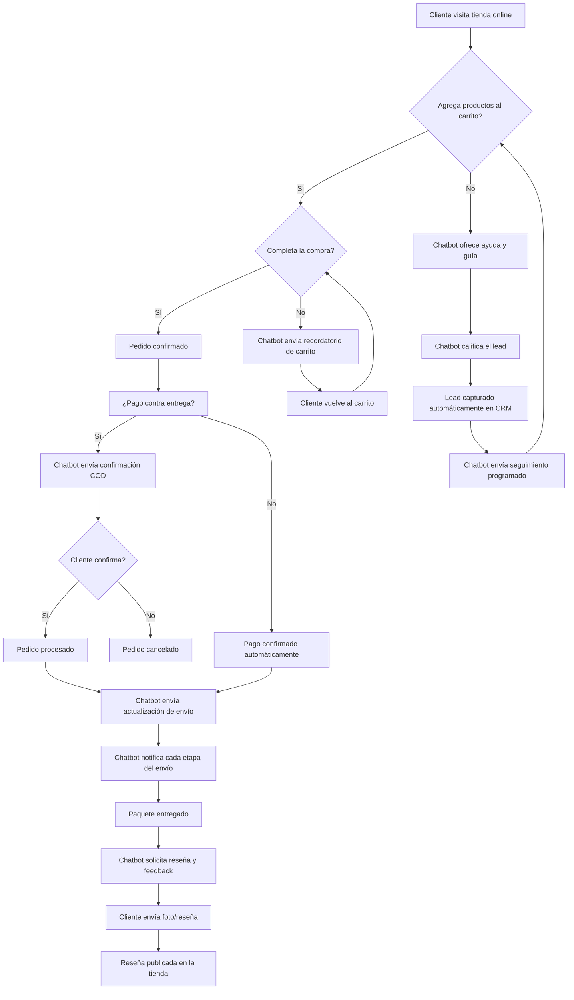

Un chatbot de WhatsApp es un software que puede responder automáticamente a las consultas de los usuarios a través de WhatsApp. Funciona como un asistente virtual que entiende preguntas, procesa información y ofrece respuestas relevantes sin intervención humana. Está diseñado para simular una conversación natural, haciendo que los clientes se sientan atendidos en todo momento.

El chatbot de WhatsApp puede conversar con miles de personas al mismo tiempo sin aburrirse ni cansarse. Mientras un agente humano solo puede atender una conversación a la vez, un chatbot puede gestionar cientos o miles de conversaciones simultáneas sin perder calidad ni velocidad de respuesta. Además, está disponible las 24 horas del día, los 7 días de la semana. Es decir, puede mantener conversaciones con miles de personas mientras tú duermes, descansas o pasas tiempo con tus amigos y familiares. Esto significa que tu negocio nunca cierra y nunca deja de generar oportunidades de venta.

Los chatbots de WhatsApp se utilizan principalmente para responder automáticamente a consultas sobre negocios y productos. También se usan para proporcionar información inicial sobre la empresa, los productos y los servicios. Pero sus capacidades van mucho más allá: pueden calificar leads, procesar pedidos, gestionar pagos, enviar notificaciones proactivas y recopilar feedback de los clientes de forma completamente automatizada.

Existen muchos usos del chatbot de WhatsApp para el ecommerce. En este artículo, hablaremos de los 10 principales usos y cómo implementarlos en tu negocio para obtener resultados inmediatos.

> **¿Sabías que...?** Según estudios de la industria, los mensajes de WhatsApp tienen una tasa de apertura superior al 98%, lo que lo convierte en el canal más efectivo para comunicarte con tus clientes. Un chatbot bien configurado puede aumentar las conversiones hasta en un 40% y reducir los costos de soporte hasta en un 60%.

## Genera leads de ecommerce usando chatbots de WhatsApp

La generación de leads es probablemente la parte más esencial de todo el proceso de ventas. Sin ella, no se puede pensar en el proceso de ventas. Los leads son el combustible que mantiene tu negocio en movimiento. Cuantos más leads calificados tengas, más oportunidades tendrás de cerrar ventas y hacer crecer tu negocio.

Con el chatbot de WhatsApp, puedes recolectar leads de clientes de manera fácil y rápida. En el momento en que un cliente envía un solo mensaje, obtienes el número de teléfono del cliente. Esto ya te da una ventaja enorme sobre el email marketing, donde la tasa de captura es mucho menor y los datos suelen ser menos fiables.

Además, el chatbot de WhatsApp tiene una función para recolectar cualquier tipo de datos de los clientes. Recoge sus datos de forma conversacional. Por lo tanto, los clientes proporcionan sus datos sin sentirse molestos. El usuario proporciona los datos escribiéndolos con su propia mano. Por lo tanto, los datos que proporcionan son en tiempo real y auténticos. No hay campos de formulario aburridos ni procesos tediosos: todo fluye de manera natural dentro de la conversación.

> **Consejo práctico:** Configura tu chatbot con preguntas progresivas. Empieza con preguntas simples (nombre, correo) y luego avanza a preguntas más específicas (intereses, presupuesto). Esto aumenta la tasa de finalización del formulario en un 40% comparado con formularios tradicionales.

### Estrategias avanzadas de captura de leads

Más allá de la recolección básica de datos, puedes implementar estrategias más sofisticadas para maximizar la captura de leads:

- **Lead magnets conversacionales**: Ofrece un descuento o guía gratuita a cambio de información del cliente. Por ejemplo: "Responde estas 3 preguntas y recibe un cupón del 15% de descuento".
- **Segmentación automática**: Basado en las respuestas del cliente, el chatbot puede etiquetar y segmentar leads automáticamente en diferentes categorías (cliente caliente, frío, interesado en producto X, etc.).
- **Seguimiento automatizado**: Si un lead no completa el proceso, el chatbot puede enviar recordatorios programados para retomar la conversación en el momento óptimo.

### Ejemplo de flujo de captura de leads paso a paso

**Flujo recomendado para captura de leads:**

1. **Saludo inicial**: "¡Hola! 👋 ¿En qué podemos ayudarte hoy?"
2. **Pregunta de calificación**: "¿Estás buscando información sobre algún producto en particular?"
3. **Captura de datos**: "Perfecto, ¿podrías decirnos tu nombre y correo electrónico para enviarte más información?"
4. **Confirmación**: "Gracias, [nombre]. Te hemos registrado en nuestra lista. Recibirás un email con los detalles."
5. **Oferta adicional**: "Mientras tanto, ¿te gustaría ver nuestro catálogo de productos?"
6. **Etiquetado automático**: El sistema etiqueta al lead según el producto de interés y lo agrega a la campaña de seguimiento correspondiente.

## Recupera carritos abandonados con automatización de chatbot de WhatsApp

El chatbot de WhatsApp para ecommerce puede enviar notificaciones de recuperación de carritos abandonados a los clientes. A veces, los clientes entran a tu tienda online, eligen productos, los agregan al carrito y luego salen de la tienda y olvidan volver para finalizar la compra. Este fenómeno es extremadamente común: se estima que la tasa promedio de abandono de carritos en ecommerce es del 70-80%.

El chatbot de WhatsApp puede enviar recordatorios de recuperación de carritos abandonados a los clientes que han olvidado finalizar su compra. Al recibir el recordatorio de recuperación de carrito, los clientes pueden volver a la tienda y completar el pago.

De esta manera, el chatbot de WhatsApp puede mejorar la conversión. Cada carrito recuperado representa una venta que de otro modo se habría perdido para siempre.

### ¿Cómo configurar la recuperación de carritos abandonados en Shopify?

Para configurar la recuperación de carritos abandonados en tu tienda Shopify:

1. **Integra tu tienda**: Conecta tu tienda Shopify con E-SMART360 desde el panel de integraciones. Ve a la sección de integraciones y selecciona Shopify. Sigue los pasos de autenticación para conectar tu tienda.

2. **Crea una plantilla de mensaje**: Diseña un mensaje atractivo que incluya los productos abandonados y un enlace directo al carrito. Usa variables dinámicas para personalizar el mensaje con el nombre del cliente, los productos y el precio total.

3. **Configura la automatización**: Ve a Automatización > Crear campaña. Selecciona "Carrito abandonado" como acción. Elige tu tienda Shopify como fuente.

4. **Define el tiempo de espera**: Establece un retraso antes de enviar el recordatorio. El valor predeterminado recomendado es de 30 minutos, pero puedes ajustarlo según tu estrategia. Algunos negocios prefieren esperar 1 hora, otros envían el primer recordatorio a los 15 minutos.

5. **Selecciona la plantilla**: Elige la plantilla de mensaje que creaste en el paso 2. Asegúrate de que la plantilla esté aprobada por WhatsApp antes de activar la campaña.

6. **Activa la campaña**: Guarda y activa. El sistema enviará automáticamente el recordatorio por WhatsApp cuando un cliente abandone su carrito.

Asegúrate de que tu tienda Shopify solicite el número de teléfono en la dirección de facturación para que la automatización funcione correctamente. Sin el número de teléfono, el sistema no podrá enviar el mensaje de WhatsApp.

### Estrategias avanzadas de recuperación de carritos

Para maximizar la tasa de recuperación, considera estas estrategias complementarias:

**Secuencia de múltiples recordatorios:**
- **Recordatorio 1 (30 min)**: Mensaje amable recordando los productos abandonados.
- **Recordatorio 2 (2 horas)**: Incluye un incentivo como envío gratuito.
- **Recordatorio 3 (24 horas)**: Ofrece un descuento por tiempo limitado.

**Personalización del mensaje:**
- Muestra los nombres y cantidades de los productos abandonados.
- Incluye el valor total del carrito.
- Agrega un enlace directo al carrito con un solo clic.
- Usa el nombre del cliente para personalizar el saludo.

**Segmentación por valor:**
- Para carritos de alto valor, considera una llamada telefónica de seguimiento además del mensaje de WhatsApp.
- Para carritos de bajo valor, automatiza completamente con el chatbot.

## Reduce pedidos falsos de pago contra entrega con chatbots de WhatsApp

Los pedidos falsos en la modalidad de pago contra entrega (COD) son un problema grave para las tiendas online. Cuando un cliente hace un pedido falso, el negocio incurre en costos de preparación, embalaje y logística que no se recuperan. En algunos sectores, los pedidos falsos pueden representar hasta el 30% del total de pedidos COD.

Con el chatbot de WhatsApp, puedes reducir fácilmente los pedidos falsos en la modalidad de pago contra entrega. El chatbot de WhatsApp puede enviar mensajes con botones de Confirmar y Cancelar a los clientes cuando un cliente realiza un pedido en WooCommerce y Shopify. Si el pedido es real, el cliente presionará el botón de confirmar pedido. Por otro lado, si el pedido es falso, el cliente presionará el botón de cancelar pedido.

Al recibir el mensaje, si el cliente presiona el botón de confirmar pedido, el pedido se confirmará. Por el contrario, si el cliente presiona el botón de cancelar, el pedido se cancelará.

De esta manera, puedes detectar fácilmente los pedidos falsos.

### Configuración completa del sistema de confirmación COD

Sigue estos pasos para implementar la confirmación de pedidos contra entrega en tu tienda:

### Crea una plantilla de mensaje con botones

Ve al panel de E-SMART360 > Gestor de Bots > Plantillas de mensaje. Crea dos variables: **Lista de productos** y **Precio total**. Escribe el cuerpo del mensaje usando las dos variables. Por ejemplo: "Hola {{nombre}}, has realizado un pedido por {{precio_total}}. Los productos son: {{lista_productos}}. ¿Confirmas este pedido?" Agrega botones de respuesta rápida: **"✅ Confirmar pedido"** y **"❌ Cancelar pedido"**.

### Configura los postbacks para las respuestas

Crea postbacks para las respuestas rápidas. Configura el componente "Iniciar flujo del bot" en el panel de flujos. Añade un elemento de texto para cada respuesta:
- Para "Confirmar": "¡Gracias! Tu pedido ha sido confirmado. Lo procesaremos en las próximas 24 horas."
- Para "Cancelar": "Tu pedido ha sido cancelado. Si cambias de opinión, puedes realizar un nuevo pedido en cualquier momento."

### Crea un flujo de trabajo webhook

Ve a Flujo de trabajo webhook y crea un nuevo workflow. Copia la URL de callback que se genera. En tu panel de WooCommerce, ve a Ajustes > Avanzado > Webhooks. Añade un nuevo webhook:
- **Nombre**: Confirmación COD WhatsApp
- **Estado**: Activo
- **Tema**: Pedido creado
- **URL de entrega**: Pega la URL de callback que copiaste
Guarda el webhook.

### Configura el mapeo de respuesta y formateo de datos

Captura la respuesta del webhook haciendo clic en "Capturar respuesta del webhook". Aparecerá la página de Mapeo de respuesta del webhook con los datos en bruto. Mapea los campos relevantes: nombre del cliente, productos, precio total, método de pago. Usa un formateador para la lista de productos si hay múltiples ítems en el pedido. Esto es necesario porque WooCommerce envía los productos como un array que necesita ser formateado correctamente para mostrarse en el mensaje de WhatsApp.

### Configura reglas para filtrar solo pedidos COD

En el flujo de trabajo, añade una regla que verifique que el método de pago sea "Contra entrega" o "COD". No necesitas usar una opción de retardo porque el mensaje debe enviarse inmediatamente después de crear el pedido. La regla asegurará que el mensaje solo se envíe a los pedidos que realmente necesitan confirmación.

### Configura las APIs de callback para confirmación y cancelación

Configura las APIs de callback que se ejecutarán cuando el cliente presione los botones:
- **API de confirmación**: Actualiza el estado del pedido en WooCommerce a "Procesando" o "Confirmado".
- **API de cancelación**: Actualiza el estado del pedido en WooCommerce a "Cancelado".
Esto asegura que la acción del cliente se refleje automáticamente en tu tienda sin intervención manual.

### Prueba el sistema completo

Realiza un pedido de prueba con pago contra entrega. Verifica que recibes el mensaje de WhatsApp con los botones de confirmar y cancelar. Prueba ambas opciones:
- Presiona "Confirmar" y verifica que el pedido se confirma en tu tienda.
- Presiona "Cancelar" y verifica que el pedido se cancela.
Revisa el reporte del flujo de trabajo para asegurarte de que todo funciona correctamente.

> **Resultado:** Con esta configuración, podrás reducir drásticamente los pedidos falsos, ahorrando costos de logística y mejorando la eficiencia de tu operación. Negocios que han implementado este sistema reportan reducciones de hasta un 80% en pedidos falsos COD.

### Consejos para maximizar la efectividad de la confirmación COD

- **Mensajes claros**: Asegúrate de que el mensaje incluya información suficiente para que el cliente reconozca su pedido (productos, precio, fecha).
- **Tiempo de respuesta**: Idealmente, el mensaje debe llegar segundos después de que el cliente realiza el pedido.
- **Múltiples intentos**: Si el cliente no responde en 24 horas, puedes enviar un segundo recordatorio o cancelar automáticamente el pedido.
- **Monitoreo de resultados**: Revisa periódicamente el reporte del workflow para ver cuántos pedidos se confirman vs. cuántos se cancelan. Esto te dará una visión clara del impacto de tu sistema de verificación.

## Envía actualizaciones de pedidos en tiempo real usando chatbots de WhatsApp

Normalmente, tus clientes quieren conocer las actualizaciones de sus pedidos y otras consultas sobre la entrega. Para conocer las actualizaciones de los pedidos, los clientes tienen que pasar por diferentes plataformas, como el correo electrónico, el panel de seguimiento en tu web, o aplicaciones de mensajería. Y es una tarea que consume tiempo y genera frustración.

El chatbot de WhatsApp te permite enviar notificaciones de actualización de pedidos en el momento en que el paquete cambia de ubicación. Puedes configurar el sistema para que envíe mensajes automatizados en cada etapa clave del proceso de entrega:

1. **Pedido confirmado**: Mensaje inmediato después de la compra con los detalles del pedido y el tiempo estimado de entrega.
2. **Pedido en preparación**: Notificación cuando el equipo comienza a preparar el paquete.
3. **Pedido enviado**: Mensaje con el número de seguimiento y el enlace para rastrear el paquete.
4. **En tránsito**: Actualizaciones cuando el paquete cambia de ubicación o pasa por centros de distribución.
5. **Fuera para entrega**: Notificación cuando el repartidor tiene el paquete y está en ruta.
6. **Entregado**: Confirmación de entrega exitosa con opción de calificar la experiencia.
7. **Retrasos**: Notificaciones proactivas si hay algún retraso en la entrega, explicando el motivo y la nueva fecha estimada.

Además, puede enviar notificaciones en cualquier caso de retraso. Por lo tanto, los clientes no tienen que revisar el sitio web o la aplicación una y otra vez para conocer las actualizaciones. Toda la información llega directamente a su WhatsApp de forma proactiva.

> **Dato clave:** Las notificaciones proactivas de estado de pedido reducen hasta un 30% las consultas de soporte relacionadas con "¿dónde está mi pedido?" y mejoran la satisfacción del cliente en un 25%.

## Permite compras directas de productos a través de chatbots de WhatsApp

A través del chatbot de WhatsApp, un cliente puede navegar por los productos y realizar pedidos en tu tienda online. Todo el proceso de compra ocurre dentro de la conversación de WhatsApp, sin necesidad de abrir el navegador, buscar productos en la web, agregarlos al carrito y pasar por el proceso de pago tradicional.

Por lo tanto, los clientes no necesitan usar diferentes plataformas: los clientes pueden comprarte cosas con menos esfuerzo. En resumen, el chatbot de WhatsApp es un canal único para que los clientes completen todo el proceso de compra, desde el descubrimiento del producto hasta el pago y la confirmación del pedido.

Como resultado, la posibilidad de venta aumentará significativamente. Cuantos menos pasos tenga que dar el cliente para comprar, más probabilidades hay de que complete la transacción.

### ¿Cómo mostrar tu catálogo de productos en WhatsApp?

WhatsApp te permite mostrar tus productos directamente dentro del chat usando la función de Catálogo de WhatsApp. En lugar de enviar descripciones largas, puedes mostrar artículos con imágenes, nombres, precios y detalles, facilitando que los clientes elijan lo que quieren comprar.

**Pasos para configurar tu catálogo:**

1. **Configura tu catálogo en el administrador de negocio de Meta**: Ve a Business Manager de Meta, selecciona tu negocio y configura el catálogo de productos. Añade todos los productos con imágenes de alta calidad, descripciones detalladas y precios actualizados.

2. **Conéctalo con E-SMART360**: Desde el panel de integraciones, selecciona "Catálogo de WhatsApp" y sigue los pasos para vincular tu catálogo de Meta.

3. **Crea un flujo de chatbot**: Diseña un flujo conversacional que:
   - Salude al cliente y pregunte qué está buscando
   - Muestre categorías de productos
   - Muestre productos específicos con imágenes y precios usando el catálogo
   - Acepte la selección del cliente y proceda al proceso de pago
   - Confirme el pedido y proporcione el número de seguimiento

4. **Activa el flujo**: Guarda y activa el flujo del chatbot en el Flow Builder. Una vez activo, el chatbot manejará automáticamente las consultas de los clientes, sugerirá productos y los guiará a través del proceso de compra.

5. **Prueba la experiencia**: Haz una prueba completa navegando por el catálogo, seleccionando productos y completando un pedido para asegurarte de que todo funciona correctamente.

## Gestión de consultas relacionadas con pagos

Si una empresa de ecommerce gestiona diariamente un gran volumen de ventas, ocuparse de los pagos se convierte en una tarea enorme. Las consultas sobre pagos son variadas y frecuentes: métodos de pago disponibles, problemas con transacciones, reembolsos, facturación, etc. Cada consulta necesita una respuesta precisa y rápida para mantener la confianza del cliente.

Debido a una mala experiencia de pago, puedes perder ventas y clientes instantáneamente. Los estudios muestran que el 60% de los clientes abandonan una compra si tienen problemas con el proceso de pago.

Usando chatbots de WhatsApp, puedes garantizar un manejo de pagos de alto nivel. El chatbot puede:

- **Responder preguntas frecuentes sobre pagos**: ¿Qué métodos de pago aceptan? ¿Es seguro pagar por WhatsApp? ¿Puedo pagar en cuotas?
- **Proporcionar instrucciones de pago**: Guiar al cliente paso a paso para completar el pago.
- **Confirmar pagos recibidos**: Enviar automáticamente un comprobante de pago cuando se recibe una transferencia.
- **Resolver problemas comunes**: Ayudar con pagos rechazados, errores de tarjeta o problemas de procesamiento.
- **Derivar a agentes especializados**: Si la consulta es compleja, el chatbot puede transferir la conversación al equipo de finanzas con todo el contexto necesario.

El chatbot de WhatsApp puede derivar a los clientes a sus respectivos agentes de servicio al cliente después de haber automatizado las consultas básicas y repetitivas. Esto asegura que los agentes humanos solo se ocupen de los casos que realmente requieren intervención manual, optimizando los recursos del equipo.

### Automatización de pagos recurrentes y suscripciones

Para negocios con modelos de suscripción o pagos recurrentes, el chatbot puede:

1. **Recordar pagos próximos**: Enviar un mensaje 3 días antes del vencimiento.
2. **Procesar pagos**: Integrar con pasarelas de pago para procesar el cobro automáticamente.
3. **Notificar pagos exitosos**: Confirmar que el pago se ha procesado correctamente.
4. **Gestionar fallos**: Si el pago falla, el chatbot puede solicitar un nuevo método de pago y reintentar el cobro.
5. **Actualizar métodos de pago**: Permitir que los clientes actualicen su tarjeta o método de pago directamente desde el chat.

Esta automatización reduce significativamente la tasa de cancelación por falta de pago y mejora la retención de clientes.

## Responde preguntas frecuentes usando chatbots de WhatsApp

Si tienes una empresa de ecommerce, quieres que tu cliente tenga un viaje cómodo desde la primera vez que visita tu sitio web hasta que finaliza la compra. Durante todo el proceso, naturalmente, los clientes hacen preguntas frecuentes para conocer tus productos y tu negocio. Y tienes que responder a las preguntas frecuentes para ayudarles a tomar su decisión de compra más fácilmente.

Las preguntas más comunes en ecommerce incluyen:
- ¿Cuánto tarda la entrega?
- ¿Cuáles son los costos de envío?
- ¿Aceptan devoluciones?
- ¿Tienen este producto en mi talla o color?
- ¿Cómo puedo rastrear mi pedido?
- ¿Qué métodos de pago aceptan?
- ¿El producto tiene garantía?
- ¿Puedo modificar mi pedido después de realizarlo?

Si respondes las preguntas frecuentes de manera adecuada, las posibilidades de que los clientes permanezcan en la etapa son altas. Cada respuesta correcta es un paso más hacia la conversión. Por el contrario, si el cliente no obtiene respuesta rápidamente, es muy probable que abandone tu tienda y busque en la competencia.

Gracias a los chatbots de WhatsApp para ecommerce, te será fácil abordar las preguntas frecuentes, ya que te permite responder rápidamente a todas las consultas de decisión de compra de los clientes. El chatbot puede tener una base de conocimientos con cientos de preguntas y respuestas, y puede encontrar la respuesta correcta en milisegundos.

Como resultado, puedes aumentar tu tasa de conversión y reducir el volumen de tickets de soporte porque puedes proporcionar soluciones instantáneas en lugar de esperar a que alguien responda después de un tiempo. Esto no solo mejora la experiencia del cliente, sino que también reduce la carga de trabajo de tu equipo de soporte.

> **Configuración recomendada:** Identifica las 20 preguntas más frecuentes de tus clientes y configúralas como respuestas automáticas en tu chatbot. Revisa los registros de chat semanalmente para identificar nuevas preguntas recurrentes y actualizar la base de conocimientos. Incluye preguntas sobre: disponibilidad de productos, tiempos de entrega, opciones de pago, políticas de devolución y seguimiento de pedidos. También puedes usar los reportes de analytics para ver qué preguntas no está respondiendo bien el chatbot y mejorarlas.

### Cómo entrenar tu chatbot para responder FAQs eficientemente

Para asegurarte de que tu chatbot responda correctamente las preguntas frecuentes:

1. **Compila una lista de preguntas reales**: Revisa los tickets de soporte de los últimos 3 meses y extrae las preguntas más repetidas.
2. **Escribe respuestas claras y concisas**: Cada respuesta debe ser directa y proporcionar la información que el cliente necesita.
3. **Agrupa por categorías**: Organiza las preguntas en categorías como envíos, pagos, productos, devoluciones, etc.
4. **Configura el chatbot**: En el panel de E-SMART360, ve a Inteligencia Artificial > Entrenar agente. Añade las preguntas y respuestas en el sistema.
5. **Usa URLs para documentación**: Puedes proporcionar enlaces a páginas específicas de tu web para respuestas más completas.
6. **Prueba y ajusta**: Haz pruebas con preguntas reales y ajusta las respuestas que no sean satisfactorias.
7. **Monitoreo continuo**: Revisa semanalmente las conversaciones donde el chatbot no pudo responder y añade esas preguntas a la base de conocimientos.

## Reorienta clientes de ecommerce con marketing de chatbot de WhatsApp

Con el chatbot de WhatsApp, puedes reorientar clientes. El remarketing es una estrategia poderosa que consiste en volver a conectar con personas que ya han mostrado interés en tus productos pero que aún no han comprado. WhatsApp es el canal perfecto para esto porque la relación ya está establecida y la tasa de apertura es casi del 100%.

Cuando un nuevo producto llega a tu tienda, puedes enviar un mensaje sobre el producto a tus clientes actuales. Al recibir el mensaje, el cliente conocerá el producto. Y cuando un cliente conoce un producto, puede interesarse en él. Las estrategias de reorientación más efectivas incluyen:

**Campañas de nuevos lanzamientos**: Informa a tus clientes cuando llegue nueva mercancía. Segmenta por categorías de productos que hayan comprado antes para enviarles solo lo que realmente les interesa.

**Ofertas exclusivas para clientes recurrentes**: Envía descuentos especiales a clientes que no han comprado en los últimos 30, 60 o 90 días. Un simple "Te extrañamos, aquí tienes un 20% de descuento" puede reactivar a clientes inactivos.

**Recomendaciones basadas en compras anteriores**: Usa el historial de compras para recomendar productos complementarios. Por ejemplo, si un cliente compró una cámara, puedes recomendarle accesorios como trípodes, lentes o estuches.

**Campañas estacionales**: Envía mensajes promocionales durante temporadas clave como Black Friday, Navidad, San Valentín o el Cyber Monday. WhatsApp tiene la tasa de apertura más alta, por lo que tus promociones serán vistas.

> **Importante:** Asegúrate de cumplir con las políticas de WhatsApp para mensajes de marketing. Los mensajes promocionales requieren plantillas aprobadas y solo pueden enviarse a clientes que hayan dado su consentimiento. Revisa las políticas de mensajería de WhatsApp para evitar restricciones en tu cuenta.

## Proporciona atención al cliente 24/7 con chatbots de WhatsApp

Con el chatbot de WhatsApp, puedes construir un sistema de soporte completo y efectivo. Este sistema de soporte puede manejar consultas básicas y repetitivas al instante. Puede proporcionar soporte a miles de clientes al mismo tiempo. Además, el sistema de soporte está disponible las 24 horas del día, los 7 días de la semana, los 365 días del año.

La atención al cliente es uno de los pilares fundamentales del ecommerce. Un cliente satisfecho no solo vuelve a comprar, sino que también recomienda tu tienda a otros. Un cliente insatisfecho, por el contrario, puede compartir su mala experiencia con decenas de personas.

Y si un cliente quiere hablar con un representante humano, puede saltarse fácilmente el chatbot y contactar a un representante humano. La transición del chatbot al agente humano es fluida: todo el historial de la conversación se transfiere al agente, por lo que el cliente no tiene que repetir su problema.

### 🤖 Atención automatizada con el chatbot

El chatbot maneja consultas repetitivas como horarios, precios, disponibilidad y seguimiento de pedidos. Responde al instante, sin tiempos de espera, disponible 24/7. Puede gestionar conversaciones en múltiples idiomas y mantener un tono consistente con la personalidad de tu marca. Además, recolecta datos valiosos sobre las necesidades y preferencias de los clientes.

### 👤 Atención humana especializada

Cuando el cliente necesita asistencia personalizada o tiene un problema complejo, puede solicitar hablar con un agente. El chatbot deriva la conversación al equipo de soporte con todo el contexto de la conversación, incluyendo productos mencionados, historial de compras y cualquier otra información relevante. Esto permite al agente resolver el problema más rápidamente.

### Beneficios de la atención 24/7 con chatbot

- **Disponibilidad total**: Tu negocio nunca cierra. Los clientes pueden hacer consultas a cualquier hora, incluso en días festivos.
- **Respuestas instantáneas**: Sin tiempos de espera. El chatbot responde en milisegundos.
- **Escalabilidad**: Puedes atender a 10 o 10,000 clientes simultáneamente sin aumentar costos.
- **Consistencia**: Todas las respuestas siguen los mismos criterios y políticas de la empresa.
- **Reducción de costos**: Automatiza entre el 60-80% de las consultas de soporte, reduciendo significativamente los costos operativos.

## Recopila reseñas y comentarios de clientes a través de chatbots de WhatsApp

Recopilar comentarios y reseñas de los clientes es una tarea complicada, no fácil. La mayoría de los clientes no dejan reseñas a menos que tengan una experiencia extremadamente buena o extremadamente mala. Y conseguir reseñas positivas es fundamental para construir la confianza de nuevos compradores.

Gracias a la función de cámara integrada en WhatsApp, puedes convencer fácilmente a los clientes para que tomen fotos o graben un video de los productos y te lo envíen. Esto es especialmente valioso para productos físicos como ropa, accesorios, electrónica, muebles, etc. Las reseñas con fotos y videos generan mucha más confianza que las reseñas de solo texto.

Como resultado, puedes recopilar fácilmente comentarios y reseñas a través del chatbot de WhatsApp. Puede acercarse al cliente en el momento adecuado para obtener comentarios en foto o video sobre el producto. Por ejemplo, 3-5 días después de la entrega, el chatbot puede enviar un mensaje preguntando al cliente cómo le fue con el producto y si estaría dispuesto a compartir una foto o reseña.

Y puedes publicar comentarios y reseñas positivas en la página del producto y en las redes sociales para atraer a más clientes y generar más leads. Las reseñas con contenido visual generado por usuarios son uno de los tipos de contenido más efectivos para marketing en redes sociales.

### WooCommerce

**Pasos para integrar WooCommerce con E-SMART360:**

1. Instala el plugin de E-SMART360 en tu WooCommerce desde el repositorio de plugins de WordPress.
2. Configura el webhook para conectar tu tienda con el chatbot. Ve a WooCommerce > Ajustes > Avanzado > Webhooks.
3. Añade un nuevo webhook con los siguientes datos:
   - **Nombre**: Conexión E-SMART360
   - **Estado**: Activo
   - **Tema**: Selecciona el tipo de evento (Pedido creado, Pedido actualizado, etc.)
   - **URL de entrega**: Pega la URL de callback proporcionada por E-SMART360
4. Guarda el webhook y verifica la conexión enviando un pedido de prueba.
5. Activa las automatizaciones de pedidos, carritos abandonados y confirmación de pago contra entrega desde el panel de E-SMART360.

**Ventajas de WooCommerce:**
- Plugin gratuito y de código abierto
- Control total sobre los datos
- Amplia variedad de extensiones y temas
- Integración nativa con WordPress

### Shopify

**Pasos para integrar Shopify con E-SMART360:**

1. Desde el panel de E-SMART360, ve a la sección de integraciones y selecciona Shopify.
2. Haz clic en "Conectar tienda Shopify" y serás redirigido a la página de autenticación de Shopify.
3. Inicia sesión en tu cuenta de Shopify y autoriza la conexión.
4. Una vez conectada, selecciona tu tienda API de Shopify en el panel de E-SMART360.
5. Verifica que los datos de productos y pedidos se estén sincronizando correctamente.
6. Configura las automatizaciones: recuperación de carritos abandonados, actualizaciones de pedidos, notificaciones de envío y confirmación de pedidos.

**Ventajas de Shopify:**
- Configuración más rápida y simplificada
- Infraestructura gestionada y segura
- Aplicaciones y temas integrados
- Soporte técnico dedicado

> **Novedad: Integración mejorada con plataformas ecommerce (2026-03-10)**
> Ahora E-SMART360 ofrece conectores nativos mejorados para WooCommerce y Shopify, permitiendo sincronización bidireccional de productos, pedidosy clientes en tiempo real. La configuración de automatizaciones es más rápida y no requiere conocimientos técnicos avanzados. Además, se ha añadido soporte para catálogos de productos avanzados con imágenes de alta resolución y precios dinámicos.

---

## Preguntas frecuentes

### ¿Cómo ayuda un chatbot de WhatsApp a las empresas de ecommerce a aumentar el ROI?

Un chatbot de WhatsApp para ecommerce ayuda a las empresas a responder a los clientes al instante, capturar leads y automatizar conversaciones de ventas. Esto reduce los costos de soporte mientras aumenta las conversiones, lo que lo convierte en una herramienta altamente efectiva para mejorar el ROI de marketing y servicio al cliente. Al reducir la necesidad de agentes humanos para consultas básicas, el costo por conversación disminuye drásticamente mientras la capacidad de atención se multiplica.

### ¿Un chatbot de generación de leads realmente puede mejorar las ventas de ecommerce?

Sí. Un chatbot de generación de leads recopila información del cliente, califica prospectos y los nutre automáticamente. Esto ayuda a las empresas a capturar compradores potenciales temprano y guiarlos hacia una compra, lo que aumenta las oportunidades de venta. Además, los leads capturados a través de WhatsApp tienden a tener una tasa de conversión más alta porque el cliente ya ha mostrado un interés activo al iniciar la conversación.

### ¿Cómo funciona la recuperación de carritos abandonados basada en chatbot?

Con la recuperación de carritos abandonados, un chatbot envía automáticamente recordatorios cuando un cliente deja productos en su carrito sin completar la compra. Estos recordatorios pueden incluir detalles del producto, descuentos o enlaces de pago rápido para traer de vuelta a los clientes y recuperar ingresos perdidos. Las tasas de recuperación típicas oscilan entre el 10% y el 30% dependiendo de la estrategia y los incentivos ofrecidos.

### ¿Qué es el marketing de chatbot de WhatsApp y cómo ayuda a las empresas?

El marketing de chatbot de WhatsApp permite a las empresas enviar promociones personalizadas, actualizaciones de productos y mensajes de campaña directamente a los clientes. Debido a que WhatsApp tiene tasas de apertura muy altas (superiores al 98%), ayuda a las empresas a aumentar el compromiso y generar más conversiones. Las campañas de marketing por WhatsApp suelen tener tasas de clics 5-10 veces superiores a las del email marketing.

### ¿Cómo puede un chatbot de automatización de FAQ mejorar el soporte al cliente?

Un chatbot de automatización de FAQ responde preguntas comunes al instante, como disponibilidad de productos, tiempos de entrega y opciones de pago. Esto reduce la carga de trabajo de los equipos de soporte mientras garantiza que los clientes obtengan respuestas rápidas las 24 horas del día. Las empresas que implementan chatbots de FAQ reportan una reducción del 50-70% en tickets de soporte básicos.

### ¿Qué deben buscar las empresas en el mejor chatbot de IA para ecommerce?

El mejor chatbot de IA para ecommerce debe soportar automatización, captura de leads, campañas de marketing, actualizaciones de pedidos y atención al cliente. También debe integrarse fácilmente con tu sitio web de ecommerce para que puedas gestionar conversaciones, ventas y datos de clientes en un solo lugar. Otras características importantes incluyen: soporte multilingüe, análisis de sentimiento, integración con CRM y capacidad de escalar a medida que crece tu negocio.

### ¿Cómo configuro la confirmación de pedidos contra entrega en WooCommerce?

Primero, crea una plantilla de mensaje con botones de "Confirmar" y "Cancelar". Luego, configura los postbacks para cada respuesta. Crea un webhook en WooCommerce con tema "Pedido creado" y conéctalo con E-SMART360. Finalmente, añade reglas para que solo se envíe a pedidos con pago contra entrega. El sistema enviará automáticamente un mensaje de WhatsApp para que el cliente confirme o cancele su pedido.

### ¿Cuánto tiempo lleva implementar un chatbot de WhatsApp para ecommerce?

La implementación básica puede completarse en cuestión de horas si ya tienes una cuenta de WhatsApp Business API configurada. La configuración completa con todas las automatizaciones (carritos abandonados, confirmación COD, actualizaciones de pedidos, FAQ) puede tomar de 2 a 5 días hábiles. E-SMART360 simplifica este proceso con su interfaz intuitiva y conectores preconfigurados.

### ¿Es seguro usar chatbots de WhatsApp para gestionar pagos y datos de clientes?

Sí. WhatsApp Business API utiliza cifrado de extremo a extremo para todas las comunicaciones. Además, E-SMART360 cumple con los estándares de seguridad de Meta y las regulaciones de protección de datos como GDPR. Los datos de los clientes se almacenan de forma segura y solo se utilizan para los fines autorizados por el cliente.

---

## Ejemplos prácticos de implementación

### 🛍️ Tienda de ropa online

Una tienda de moda implementó un chatbot de WhatsApp que envía recomendaciones personalizadas basadas en el historial de navegación. El chatbot también gestiona consultas sobre tallas y disponibilidad. Resultado: 35% más de conversiones, 50% menos de tickets de soporte y un aumento del 20% en el valor promedio del pedido.

### 📱 Electrónica y gadgets

Un negocio de electrónica usa el chatbot para enviar actualizaciones de envío en tiempo real y confirmar pedidos contra entrega. También configuraron un sistema de FAQ automático para consultas sobre especificaciones técnicas y compatibilidad de productos. Redujeron los pedidos falsos en un 70% y mejoraron la satisfacción del cliente en un 40%.

### 🥤 Suscripciones mensuales

Una empresa de suscripciones recupera el 25% de los carritos abandonados con recordatorios automáticos por WhatsApp que incluyen un código de descuento del 10% válido por 24 horas. Además, usan el chatbot para gestionar cambios en las suscripciones y recordar pagos próximos, reduciendo la tasa de cancelación en un 15%.

---

## Diagrama del flujo completo de atención al cliente con chatbot

---

## Conclusión

Los chatbots de WhatsApp para ecommerce no son solo una herramienta de moda, sino una necesidad competitiva en el mercado actual. Las empresas que implementan estas soluciones ven mejoras significativas en múltiples áreas de su negocio: más leads, mayores tasas de conversión, menos pedidos falsos, mejor atención al cliente y más reseñas positivas.

La clave del éxito está en una implementación estratégica: no se trata solo de automatizar, sino de hacerlo de manera inteligente, personalizada y centrada en el cliente. Con E-SMART360, tienes todas las herramientas necesarias para transformar tu negocio de ecommerce y llevar tu estrategia de marketing y ventas al siguiente nivel.

> **¿Listo para empezar?** Con E-SMART360 puedes configurar tu chatbot de WhatsApp para ecommerce en minutos. Nuestros conectores nativos con WooCommerce y Shopify hacen que la integración sea rápida y sencilla. Regístrate hoy y comienza a transformar tu negocio.

---

## Bonus: Envío de mensajes masivos por WhatsApp para promociones y campañas

Además de los 10 usos principales, una funcionalidad adicional muy potente es el envío de mensajes masivos o broadcasting. Con E-SMART360 puedes enviar campañas de mensajes a miles de clientes segmentados, siempre cumpliendo con las políticas de mensajería de WhatsApp.

### Tipos de campañas de broadcasting

**Campañas promocionales**: Anuncia descuentos, ofertas especiales y nuevos productos a toda tu base de clientes. Por ejemplo: "🎉 ¡Oferta flash! 30% de descuento en toda la tienda solo por hoy. Usa el código FLASH30."

**Campañas estacionales**: Aprovecha fechas clave como Navidad, Black Friday, Cyber Monday, Día de la Madre, regreso a clases, etc. Segmenta tus envíos según el historial de compras de cada cliente.

**Campañas de reactivación**: Recupera clientes inactivos con ofertas personalizadas. Por ejemplo: "Hola [nombre], han pasado 60 días desde tu última compra. Aquí tienes un 20% de descuento para que vuelvas."

**Campañas de lanzamiento**: Cuando lances un nuevo producto o colección, informa primero a tus clientes más fieles. Esto los hace sentir especiales y aumenta las probabilidades de compra temprana.

### Buenas prácticas para broadcasting

1. **Segmenta tu audiencia**: No envíes el mismo mensaje a todos. Segmenta por comportamiento de compra, intereses, ubicación geográfica, etc.
2. **Personaliza los mensajes**: Usa el nombre del cliente y referencias a sus compras anteriores.
3. **Incluye llamadas a la acción claras**: Botones como "Comprar ahora", "Ver oferta", "Más información".
4. **Respeta los horarios**: Evita enviar mensajes fuera del horario laboral (después de las 8 PM o antes de las 9 AM).
5. **Monitorea los resultados**: Revisa tasas de apertura, clics y conversiones de cada campaña.
6. **Mantén una frecuencia adecuada**: No más de 2-4 campañas por mes para evitar fatiga del cliente.

> **Políticas de mensajería masiva:** Recuerda que los mensajes de marketing en WhatsApp requieren plantillas de mensaje previamente aprobadas. Además, solo puedes enviar mensajes a clientes que hayan optado por recibir comunicaciones de tu negocio. Revisa las políticas actualizadas de WhatsApp Business API para asegurarte de cumplir con todas las regulaciones.

## Integración con plataformas de automatización y CRM

E-SMART360 se integra con las principales plataformas de automatización y CRM para que puedas sincronizar tus datos de clientes y leads en tiempo real. Esto te permite mantener un registro actualizado de todas las interacciones con tus clientes y automatizar flujos de trabajo complejos.

### Integraciones disponibles

**Zapier**: Conecta E-SMART360 con más de 5000 aplicaciones a través de Zapier. Puedes automatizar flujos como: cuando se capture un lead en WhatsApp, créalo automáticamente en tu CRM y añádelo a tu lista de email marketing.

**Make (antes Integromat)**: Crea workflows visuales sofisticados con Make. Por ejemplo: cuando un cliente confirme un pedido contra entrega en WhatsApp, actualiza el inventario en tu ERP y envía una notificación al equipo de logística.

**N8N**: Para equipos técnicos que prefieren soluciones auto-gestionadas, N8N ofrece un control total sobre los flujos de automatización con capacidades de programación avanzadas.

### Ventajas de la integración

- **Datos centralizados**: Toda la información de tus clientes en un solo lugar.
- **Automatización extremo a extremo**: Desde la captura del lead hasta la postventa.
- **Ahorro de tiempo**: Elimina la entrada manual de datos entre sistemas.
- **Mayor precisión**: Reduce errores humanos en la transferencia de datos.

---

## Caso de estudio: Implementación completa en una tienda online

### Escenario

Una tienda online de productos de belleza y cuidado personal con:
- 500 pedidos mensuales promedio
- Tasa de abandono de carritos del 75%
- 15% de pedidos falsos en pagos contra entrega
- Equipo de soporte de 3 personas
- Ventas mensuales de $50,000

### Implementación

**Fase 1 - FAQ automático (Semana 1):**
Se configuraron las 25 preguntas más frecuentes sobre productos, envíos y devoluciones. Resultado: reducción del 40% en tickets de soporte.

**Fase 2 - Recuperación de carritos (Semana 2):**
Se implementó una secuencia de 3 recordatorios (30 min, 2h, 24h) con incentivos escalonados. Resultado: recuperación del 22% de carritos abandonados.

**Fase 3 - Confirmación COD (Semana 3):**
Se configuró el sistema de confirmación de pedidos contra entrega con botones de confirmar/cancelar. Resultado: reducción del 80% en pedidos falsos.

**Fase 4 - Actualizaciones de envío y reseñas (Semana 4):**
Se automatizaron las notificaciones de estado de pedido y la solicitud de reseñas post-entrega. Resultado: aumento del 35% en reseñas con fotos.

### Resultados después de 3 meses

| Métrica | Antes | Después | Mejora |
|---------|-------|---------|--------|
| Ventas mensuales | $50,000 | $68,000 | +36% |
| Tasa de abandono de carritos | 75% | 58% | -17pp |
| Pedidos falsos COD | 15% | 3% | -12pp |
| Tickets de soporte | 600/mes | 250/mes | -58% |
| Reseñas con fotos | 10/mes | 45/mes | +350% |
| Satisfacción del cliente | 3.8/5 | 4.6/5 | +21% |

---

## Preguntas frecuentes adicionales

### ¿Puedo usar un chatbot de WhatsApp sin conocimientos de programación?

Sí, absolutamente. E-SMART360 ofrece un constructor de chatbots visual e intuitivo que no requiere conocimientos de programación. Puedes crear flujos conversacionales complejos usando una interfaz de arrastrar y soltar. Además, las plantillas preconfiguradas te permiten empezar rápidamente con casos de uso comunes como FAQ, captura de leads y recuperación de carritos.

### ¿Qué costo tiene implementar un chatbot de WhatsApp para ecommerce?

El costo depende del volumen de conversaciones y las funcionalidades que necesites. E-SMART360 ofrece planes flexibles que se adaptan a negocios de todos los tamaños. El plan básico incluye las funcionalidades esenciales para empezar, y puedes escalar a medida que tu negocio crece. Comparado con contratar personal adicional de soporte, el ROI de un chatbot suele ser positivo desde el primer mes.

### ¿Cómo gestiono los mensajes cuando el chatbot no puede responder?

E-SMART360 incluye un sistema de handover (transferencia) que deriva automáticamente las conversaciones complejas a agentes humanos. Cuando el chatbot detecta que no puede resolver una consulta, o cuando el cliente solicita explícitamente hablar con un humano, la conversación se transfiere con todo el contexto al equipo de soporte. Esto asegura que ningún cliente se quede sin atención.

### ¿Puedo tener chatbots diferentes para distintas líneas de productos?

Sí. Puedes crear múltiples chatbots o flujos conversacionales para diferentes productos, categorías o campañas. Cada chatbot puede tener su propia personalidad, base de conocimientos y respuestas. Esto es especialmente útil si vendes productos muy diferentes que requieren información especializada.

### ¿Cómo mido el rendimiento de mi chatbot de WhatsApp?

E-SMART360 proporciona analytics detallados sobre el rendimiento de tu chatbot, incluyendo: número de conversaciones, tasa de resolución automática, tiempo promedio de respuesta, satisfacción del cliente, leads capturados, ventas generadas a través del chatbot y mucho más. Estos datos te permiten optimizar continuamente tu chatbot para mejorar los resultados.

---

## Tabla comparativa: WhatsApp vs otros canales de comunicación

| Característica | WhatsApp | Email | Chat web | Redes sociales |
|----------------|----------|-------|----------|----------------|
| Tasa de apertura | 98%+ | 20-25% | N/A | 10-30% |
| Tiempo de respuesta esperado | Segundos | Horas-días | Segundos-minutos | Minutos-horas |
| Personalización | Alta | Media | Media | Baja |
| Automatización con chatbot | Excelente | Buena | Buena | Limitada |
| Alcance global | 2000M+ usuarios | Universal | Solo web | Variable |
| Costo por mensaje | Bajo | Bajo | Medio | Variable |
| Capacidad multimedia | Alta | Media | Media | Alta |
| Cifrado de extremo a extremo | Sí | No | Variable | Variable |

> Como muestra la tabla, WhatsApp es el canal con la mayor tasa de apertura y el tiempo de respuesta más rápido. Combinado con las capacidades de automatización de E-SMART360, se convierte en el canal más efectivo para la comunicación con clientes de ecommerce.

---

## Resumen ejecutivo

Un chatbot de WhatsApp bien implementado puede transformar completamente tu negocio de ecommerce. Los 10 usos que hemos cubierto en este artículo representan las oportunidades más impactantes:

1. **Generación de leads** - Captura datos de clientes de forma conversacional
2. **Recuperación de carritos** - Recupera ventas perdidas con recordatorios automáticos
3. **Reducción de pedidos falsos COD** - Verifica pedidos contra entrega automáticamente
4. **Actualizaciones en tiempo real** - Mantén a tus clientes informados en cada etapa
5. **Compras directas** - Vende productos directamente desde el chat
6. **Gestión de pagos** - Automatiza consultas y procesos de pago
7. **FAQ automatizado** - Responde preguntas frecuentes al instante
8. **Remarketing** - Reorienta clientes con campañas personalizadas
9. **Atención 24/7** - Proporciona soporte continuo sin aumentar costos
10. **Recopilación de reseñas** - Obtén feedback visual de tus clientes

Cada uno de estos usos contribuye a un objetivo común: mejorar la experiencia del cliente, aumentar las ventas y optimizar los costos operativos. Con E-SMART360, implementar estas soluciones es más fácil que nunca.

> **Da el primer paso hoy:** Regístrate en E-SMART360 y configura tu primer chatbot de WhatsApp para ecommerce en minutos. Nuestro equipo de soporte te guiará en cada paso del proceso para asegurar que obtengas los mejores resultados desde el primer día.
