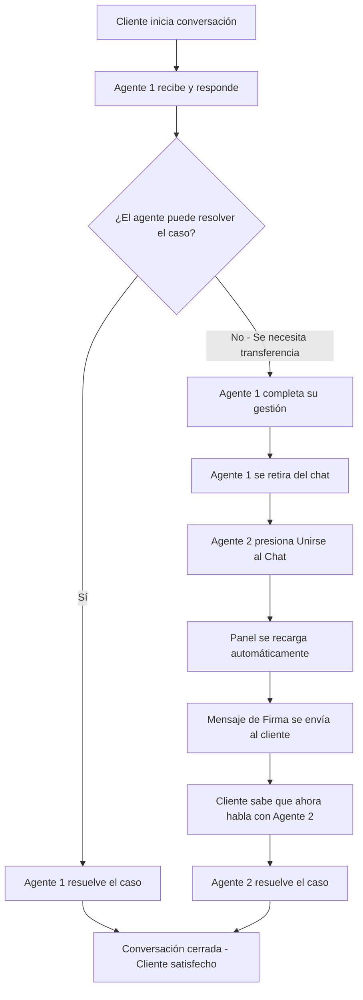

> Las funciones **Unirse al Chat** (Join Chat) y **Mensaje de Firma** (Signature Message) son dos herramientas diseñadas para optimizar el trabajo en equipo dentro de la bandeja compartida de E-SMART360. Estas funcionalidades agilizan la resolución de problemas, aportan transparencia y responsabilidad entre los miembros del equipo, y ofrecen un registro claro de cuándo los agentes se unen o abandonan una conversación. En esta guía encontrarás todo lo que necesitas saber para implementarlas correctamente.

## ¿Qué es la Bandeja Compartida de E-SMART360?

La bandeja compartida (Live Chat) de E-SMART360 es un panel de mensajería unificada omnicanal para Chat Web, WhatsApp, Facebook, Instagram y Telegram. Desde este mismo panel, los miembros del equipo pueden enviar y recibir mensajes, asignar etiquetas a clientes específicos, gestionar conversaciones y mucho más.

### WhatsApp

Atención completa usando la API oficial de WhatsApp Cloud. Responde mensajes en tiempo real, envía notificaciones, comparte catálogos de productos y gestiona conversaciones con plantillas aprobadas.
  
### Facebook Messenger

Responde mensajes directos de tu página de Facebook directamente desde la bandeja compartida. Tus agentes pueden gestionar múltiples conversaciones sin salir del panel central.
  
### Instagram DM

Gestiona los mensajes directos de Instagram desde la misma interfaz. Perfecto para marcas que reciben consultas a través de esta red social.
  
### Telegram

Conversaciones desde tu bot de Telegram. Todas las interacciones con tus clientes en Telegram llegan directamente a la bandeja compartida.
  
### Chat Web

Widget de chat integrado en tu sitio web. Los visitantes pueden contactarte directamente y las conversaciones se gestionan junto con el resto de canales.
  
> **Beneficio clave:** Centraliza TODAS las conversaciones de tus clientes sin importar el canal por el que te contacten. Tu equipo puede atender a un cliente que llega por WhatsApp y cambiar a otro que llega por Facebook Messenger, todo desde una misma interfaz y con el mismo historial de conversación.

## ¿Cómo funciona la función "Unirse al Chat"?

La función **Unirse al Chat** es un botón que todo agente debe presionar antes de poder enviar un mensaje al cliente. Este mecanismo asegura que solo agentes que han aceptado explícitamente participar en la conversación puedan responder, evitando confusiones y respuestas duplicadas.

### Accede a la Conversación

Desde la bandeja compartida, selecciona la conversación que deseas atender. Verás los mensajes previos del cliente y del agente anterior, así como el historial completo de la conversación.
  
### Presiona el Botón Unirse al Chat

Haz clic en el botón **Unirse al Chat**. Esta acción te notifica a ti y al resto del equipo que has tomado la conversación. El botón aparece visible en la parte superior del panel de chat.
  
### La Bandeja se Recarga Automáticamente

Una vez presionado el botón, la bandeja de chat se recargará automáticamente y quedarás habilitado para enviar mensajes al cliente. Todos los miembros del equipo podrán ver que ahora tú estás a cargo de esa conversación.
  
### Envía tu Primer Mensaje

Ahora puedes responder al cliente. Si tienes configurado un Mensaje de Firma, se enviará automáticamente para notificar la transición de manera profesional.
  

> Sin presionar el botón **Unirse al Chat**, los agentes pueden VER la conversación pero **NO pueden responder directamente**. Esto garantiza que siempre haya claridad sobre quién está atendiendo al cliente en cada momento. Especialmente importante en equipos grandes donde múltiples agentes podrían estar tentados a responder al mismo cliente.

> **Última Actualización (3 de Febrero de 2026)**
> La función Join Chat ahora incluye una recarga automática mejorada del panel y notificaciones en tiempo real para todos los miembros del equipo cuando un agente se une o abandona una conversación.

## Casos de Uso para Join Chat

### 😤 Cliente Molesto

Cuando un cliente está frustrado o enojado y el agente actual no está logrando calmarlo, la transferencia permite que un nuevo agente retome la conversación con una perspectiva fresca y un tono renovado.
  
### 🔧 Escalamiento Técnico

El agente actual se encuentra con una consulta técnica compleja fuera de su especialidad. Usa Join Chat para transferir la conversación a un especialista que pueda resolver el problema.
  
### 🔄 Cambio de Turno

Al finalizar el turno de un agente, otro compañero puede continuar la conversación sin perder el contexto. Ideal para equipos con soporte 24/7 o con diferentes husos horarios.
  
### 🙋‍♂️ Solicitud del Cliente

A veces los clientes piden explícitamente hablar con otra persona del equipo. Join Chat permite que un supervisor, gerente o agente específico tome la conversación inmediatamente.
  
### 🤝 Colaboración Interna

Un agente necesita ayuda puntual de un compañero para resolver un caso. Ambos pueden estar en la conversación, pero solo el agente que presionó Join Chat puede responder. El otro puede observar y dar sugerencias.
  
> **Dato importante:** En equipos de 5 o más agentes, el uso de Join Chat reduce hasta un 40 % los tiempos de resolución al eliminar la duplicidad de respuestas y la confusión de roles. Los clientes reciben respuestas más rápidas y coherentes.

## ¿Qué es un Mensaje de Firma?

Un **Mensaje de Firma (Signature Message)** es un mensaje corto predefinido que se envía automáticamente cuando un nuevo agente se une a la conversación. Este mensaje notifica al cliente que ahora está siendo atendido por otra persona, lo que aporta transparencia, profesionalismo y un toque humano a la transición.

> El Mensaje de Firma puede personalizarse para incluir el nombre del agente usando la variable correspondiente. Por ejemplo: *"Hola, soy Juan Pérez, ejecutivo de atención al cliente de E-SMART360. ¿En qué puedo ayudarte?"*

### Beneficios del Mensaje de Firma

- **Transparencia:** El cliente sabe exactamente quién lo está atendiendo en cada momento.
- **Profesionalismo:** Las transiciones se realizan de forma ordenada y profesional.
- **Personalización:** Cada agente puede tener su propia firma con nombre, cargo y tono personal.
- **Trazabilidad:** El cliente y el equipo tienen un registro claro de quién ha intervenido.
- **Consistencia de marca:** Todas las transiciones mantienen el mismo formato y estilo corporativo.
- **Reducción de fricción:** El cliente no se siente "abandonado" porque recibe un mensaje de bienvenida del nuevo agente.

### Canales Soportados para Mensajes de Firma

| Canal | Descripción |
|-------|-------------|
| **WhatsApp** | Comunicación personalizada en la plataforma de mensajería más usada del mundo |
| **Facebook Messenger** | Firmas profesionales en respuestas a través de Facebook |
| **Instagram DM** | Consistencia de marca en mensajes directos de Instagram |
| **Telegram** | Interacciones mejoradas con firmas personalizadas en Telegram |
| **Chat Web** | Toque profesional en el soporte en tiempo real de tu sitio web |

## Cómo Configurar un Mensaje de Firma

Configurar un Mensaje de Firma en E-SMART360 es un proceso sencillo que asegura una comunicación consistente, profesional y personalizada. Una firma bien configurada refuerza la identidad de tu marca y añade un toque humano a las interacciones con los clientes. En una bandeja compartida donde múltiples agentes colaboran para atender conversaciones, los Mensajes de Firma juegan un papel crucial para mantener la profesionalidad y la consistencia.

### Inicia sesión y accede al Bot Manager

Ingresa a tu cuenta de E-SMART360 y navega hasta la sección **Bot Manager** desde el panel principal. Busca la opción en el menú lateral izquierdo.
  
### Ve a la Configuración

Dentro del Bot Manager, selecciona la pestaña **Configuración** (Configuration). Aquí encontrarás todas las opciones de personalización para tu bot y bandeja compartida.
  
### Encuentra la Sección de Mensaje de Firma

Localiza la sección **Configuración de Mensaje de Firma** (Signature Message Configuration) dentro del panel de configuración.
  
### Activa la Función

Activa el interruptor **Habilitar Mensaje de Firma** (Enable Signature Message). Al activarlo, también se habilitará automáticamente la opción **Unirse al Chat**.
  
### Redacta tu Mensaje Predeterminado

En el campo **Mensaje de Firma Predeterminado** (Default Signature Message), escribe el mensaje que deseas. Ejemplos:
    - *"Hola, soy [Nombre], agente de soporte de E-SMART360. ¿Cómo puedo ayudarte?"*
    - *"Has sido transferido a [Nombre] de nuestro equipo de atención. Estamos aquí para resolver tu consulta."*
  
### Usa Variables Dinámicas

Utiliza la variable `[Nombre]` para que el nombre del agente se auto-complete automáticamente en cada mensaje. Esto evita que los agentes tengan que escribir su nombre manualmente.
  
### Personalización por Agente (Opcional)

Cada agente puede personalizar su propia firma desde **Configuración de Miembro** (Member Settings). Haz clic en el ícono de usuario en la esquina superior derecha, selecciona **Mi Cuenta** (Account) y edita el campo de firma para incluir su nombre, cargo o saludo personalizado.
  
### Activa el Indicador de Escritura

Puedes activar el **Indicador de Escritura** (Typing on Indicator) en los ajustes del Mensaje de Firma. Esto mostrará automáticamente "escribiendo..." en WhatsApp cuando un agente comience a redactar, haciendo la experiencia del cliente más receptiva.
  
### Guarda los Cambios

Después de configurar todo, haz clic en el botón **Guardar Cambios** (Save Changes) para que la configuración tenga efecto inmediato.
  

> **Importante:** Activar el Mensaje de Firma también activa automáticamente la opción **Unirse al Chat**. Sin unirse al chat, los agentes pueden ver las conversaciones pero no pueden responder. Esto garantiza responsabilidad y comunicación organizada.

## Indicador de Escritura (Typing Indicator)

El Indicador de Escritura es una funcionalidad que muestra automáticamente el estado "escribiendo..." en WhatsApp en las siguientes situaciones:

### ✍️ Agente escribe

Cuando un agente comienza a redactar una respuesta en el panel de chat.
  
### 👆 Agente hace clic

Cuando un agente hace clic en la bandeja de chat, incluso antes de empezar a escribir. Esto indica que el agente ya está presente.
  
### 🤖 Bot prepara respuesta

Cuando el bot automatizado está preparando una respuesta para el cliente, señalando que la solicitud está siendo procesada.
  
> Este indicador es especialmente útil durante las transferencias de chat, ya que comunica proactivamente al cliente que un agente está comprometido con su consulta. Incluso si hay una breve pausa antes de la respuesta, el cliente sabe que alguien está trabajando en su caso.

## Opciones Avanzadas de Personalización

### Campos Dinámicos

E-SMART360 permite el uso de campos dinámicos como `[Nombre]` para auto-poblar automáticamente los detalles de la firma. Esto asegura que cada agente se presente con su nombre sin necesidad de escribirlo manualmente en cada interacción.

### Control de Respuestas del Bot

Puedes deshabilitar las respuestas automáticas del bot cuando los Mensajes de Firma están activados. Esto asegura que durante una transferencia, las interacciones sean exclusivamente humanas, evitando que el bot envíe respuestas automáticas que puedan confundir al cliente.

### Temporizador de Reactivación Automática

Configura el tiempo de reactivación automática del bot para asegurar seguimientos oportunos con los clientes. Por ejemplo:
- Si un agente finaliza su turno y nadie más ha tomado la conversación
- Si el cliente deja de responder después de la transferencia
- Si el caso queda en estado "pendiente" por más tiempo del configurado

### Opción para Abandonar el Chat

Los agentes también tienen la opción de **abandonar el chat** (Leave Chat) cuando sus tareas están completadas. Esto permite que otros agentes tomen el control si es necesario, manteniendo la conversación ordenada y libre de agentes inactivos.

### Ver más detalles sobre Abandonar Chat

Cuando un agente abandona el chat:
  - La conversación queda disponible para que otro agente la tome
  - El administrador puede ver qué agente abandonó y en qué momento
  - El cliente no recibe ninguna notificación del abandono
  - El bot puede reactivarse automáticamente si está configurado
  
  Esta funcionalidad es crucial para equipos con múltiples turnos o donde los agentes manejan diferentes especialidades.

## Cómo Probar tu Mensaje de Firma

Antes de ponerlo en producción, es crucial probar la configuración de la firma para asegurarte de que funciona correctamente.

### Únete a un Chat de Prueba

Como agente, selecciona una conversación de prueba y presiona **Unirse al Chat** para iniciar la simulación.
  
### Envía un Mensaje de Prueba

Redacta y envía un mensaje de prueba al cliente. Verifica que el Mensaje de Firma se agregue automáticamente al final del mensaje.
  
### Verifica desde la Perspectiva del Cliente

Idealmente, revisa cómo se ve el mensaje desde el lado del cliente. Puedes usar un dispositivo diferente o pedir a un compañero que verifique. Confirma que:
    - El nombre del agente aparece correctamente
    - El formato se ve profesional
    - No hay errores de tipeo o formato
  
### Ajusta si es Necesario

Si algo no se ve bien, regresa a la Configuración del Bot Manager y realiza los ajustes necesarios. Guarda los cambios y prueba de nuevo hasta que todo funcione perfectamente.
  
## Flujo Completo de Transferencia de Chat

Entender cómo funciona una transferencia de chat completa ayuda a visualizar el valor de estas herramientas. Veamos un escenario típico paso a paso:

> El administrador puede monitorear todo el proceso: quién entró, quién se fue, qué agente está ahora conectado con el cliente, y en qué momento ocurrió cada acción. Esta transparencia asegura responsabilidad y una gestión de equipo efectiva.

## Gestión de Conversaciones desde el Panel de Chat en Vivo

La bandeja compartida no solo permite transferencias, sino que ofrece un conjunto completo de herramientas para gestionar cada interacción con los clientes de manera eficiente.

### Funcionalidades Principales del Panel

### 👁️ Visualización de Conversaciones Activas

Todas las conversaciones aparecen ordenadas por canal y relevancia. Puedes ver el último mensaje, la hora de la última interacción, el agente asignado y el estado de la conversación.
  
### 🏷️ Etiquetas y Filtros

Asigna etiquetas personalizadas a los clientes (VIP, Soporte Técnico, Ventas, Reclamo, Pendiente de Pago, etc.) y filtra por estado (pendiente, en curso, resuelto) o por canal.
  
### 📋 Historial de Mensajes

Accede al historial completo de cada cliente, sin importar el canal. Cada interacción queda registrada: fecha, hora, agente que respondió y contenido del mensaje.
  
### 👤 Asignación Manual

Asigna conversaciones específicas a agentes particulares cuando sea necesario. El agente asignado recibirá una notificación automática.
  
### 📝 Notas Internas

Los agentes pueden dejar notas visibles solo para el equipo, sin que el cliente las vea. Ejemplo: "Cliente llamó por teléfono, acordamos continuar mañana a las 10 AM."
  
### 🔔 Notificaciones en Tiempo Real

Recibe notificaciones instantáneas cuando un nuevo mensaje llega, cuando un agente se une al chat, o cuando una conversación cambia de estado.
  
### Consejos para una Gestión Eficiente

### 1. Establece Horarios de Atención y Mensajes Automáticos Fuera de Horario

Configura mensajes automáticos fuera del horario laboral. E-SMART360 puede enviar un mensaje como:
  *"Gracias por contactarnos. Nuestro horario de atención es de lunes a viernes de 9:00 a 18:00 hrs. Te responderemos en cuanto abramos. Si tu consulta es urgente, déjanos tu mensaje y te contactaremos a primera hora."*

### 2. Usa Respuestas Rápidas y Plantillas

Crea respuestas predefinidas para preguntas frecuentes. Esto acelera la resolución y asegura consistencia en la información que entregas. Puedes crear plantillas para:
  - Saludos iniciales
  - Preguntas sobre envíos
  - Información de garantía
  - Despedidas y cierres
  - Políticas de devolución

### 3. Prioriza por Urgencia y Tipo de Consulta

Enseña a tu equipo a identificar conversaciones urgentes y priorizarlas. Usa las etiquetas para marcar el nivel de urgencia (Alta, Media, Baja) y el tipo de consulta (Ventas, Soporte, Reclamo, Consulta General).

### 4. Capacita a tu Equipo en el Protocolo de Transferencias

Establece un protocolo claro para las transferencias de chat:
  - ¿Cuándo transferir? (problemas técnicos complejos, solicitud del cliente, cambio de turno)
  - ¿A quién transferir? (especialista, supervisor, agente del siguiente turno)
  - ¿Cómo redactar el mensaje de firma adecuado? (tono profesional, informar al cliente)
  - ¿Qué información incluir en las notas internas? (historial, acciones tomadas, próximos pasos)

### 5. Monitorea las Métricas de Desempeño

E-SMART360 proporciona métricas útiles para evaluar el rendimiento de tu equipo:
  - Tiempo promedio de respuesta por agente
  - Número de conversaciones atendidas por día
  - Tasa de resolución en primera interacción
  - Número de transferencias realizadas
  - Satisfacción del cliente post-atención

## Ejemplos Prácticos de Transferencias Exitosas

### Ejemplo 1: Soporte Técnico para una Tienda en Línea

**Escenario:** Una cliente llamada María contacta por WhatsApp porque su pedido #10453 no ha llegado. El agente Juan revisa el sistema y ve que el paquete está retenido en aduanas, un tema que debe manejar el equipo de logística.

**Flujo de transferencia:**
1. Juan informa a María: "Déjame transferirte con nuestro equipo de logística para resolver esto rápidamente. No te preocupes, ellos tienen acceso directo a la información de aduanas."
2. Juan escribe una nota interna: "Pedido #10453 retenido en aduanas por documentación incompleta. Cliente contactó por primera vez."
3. Juan se retira del chat presionando el botón **Abandonar Chat**.
4. Laura del equipo de logística presiona **Unirse al Chat** y el panel se recarga.
5. Automáticamente se envía el mensaje de firma: *"Hola María, soy Laura, del equipo de logística de E-SMART360. Estoy al tanto de tu caso y voy a gestionar la liberación de tu paquete con la aduana."*
6. Laura gestiona la liberación del paquete y notifica a María con el nuevo número de seguimiento y la fecha estimada de entrega.

**Resultado:** María queda satisfecha porque la transición fue fluida, no tuvo que repetir su problema, y recibió una solución concreta.

### Ejemplo 2: Escalamiento por Cliente Molesto

**Escenario:** Pedro contacta furioso porque recibió un producto dañado en su pedido. El agente Carlos intenta calmarlo pero la conversación se torna difícil. El supervisor decide intervenir personalmente.

**Flujo de transferencia:**
1. Carlos escribe en la nota interna: "Cliente muy molesto por producto dañado en pedido #20987. Producto: Lámpara LED modelo X200. Solicito intervención del supervisor para gestionar reemplazo exprés."
2. Carlos se retira del chat.
3. La supervisora Ana es notificada y presiona **Unirse al Chat**.
4. Mensaje de firma: *"Hola Pedro, soy Ana, supervisora de atención al cliente de E-SMART360. Lamento profundamente lo sucedido con tu producto. He revisado tu caso y voy a gestionar personalmente el reemplazo de tu lámpara."*
5. Ana procesa el reemplazo con envío prioritario sin costo adicional y ofrece un cupón de descuento del 15 % para la próxima compra como disculpa.
6. Ana envía el número de seguimiento del nuevo envío y confirma que el producto dañado será recogido por la mensajería.

**Resultado:** Pedro se siente escuchado, la situación se resuelve satisfactoriamente, y la empresa retiene a un cliente valioso. Además, se genera un informe del incidente para mejorar el control de calidad.

### Ejemplo 3: Cambio de Turno en Soporte Continuo

**Escenario:** Una empresa de servicios financieros ofrece soporte de 7:00 a 22:00 hrs en tres turnos. Son las 18:45 y el agente Roberto está atendiendo a un cliente que está realizando una transferencia internacional importante.

**Flujo de transferencia:**
1. Roberto informa al cliente: "Para asegurarnos de que tu transferencia se complete sin problemas, te voy a transferir con Daniel, nuestro especialista en transferencias internacionales del turno nocturno."
2. Roberto deja notas internas detalladas con los datos de la transferencia.
3. Roberto se retira del chat.
4. Daniel presiona **Unirse al Chat** y se activa el mensaje de firma.
5. Daniel continúa la gestión sin que el cliente tenga que repetir ningún dato.

**Resultado:** El cliente recibe atención continua sin interrupciones, los datos de su operación están seguros, y el cambio de turno no afecta la calidad del servicio.

## Preguntas Frecuentes

### ¿Por qué es importante la transferencia de conversaciones?

La transferencia de conversaciones puede hacer que la comunicación y la resolución de problemas sean rápidas y eficientes. Cuando un miembro del equipo se encuentra con una consulta técnica o compleja que no puede manejar, pasar la conversación a un compañero más calificado mejora la satisfacción del cliente y ahorra tiempo valioso. Reduce la frustración tanto del cliente como del agente, y asegura que cada consulta sea atendida por la persona más adecuada.

### ¿Qué es la Bandeja Compartida de E-SMART360?

La Bandeja Compartida (Live Chat) de E-SMART360 es un panel de mensajería en tiempo real para Chat Web, WhatsApp, Facebook Messenger, Instagram y Telegram. Desde este mismo lugar, los miembros del equipo pueden chatear directamente con los clientes, brindar soporte instantáneo, asignar etiquetas, gestionar transferencias, y mantener un historial completo de todas las interacciones en un solo lugar. Es la herramienta central para la atención al cliente omnicanal.

### ¿Cómo ayuda la función 'Unirse al Chat' en la colaboración del equipo?

La función **Unirse al Chat** permite que los miembros del equipo colaboren de manera eficiente al permitir que un agente tome el control de una conversación en curso. Esto asegura que siempre haya un responsable claro de la conversación, evita respuestas duplicadas, y proporciona un registro de quién atendió cada parte de la conversación. Es especialmente útil en equipos grandes o con múltiples especialidades.

### ¿Puede el administrador rastrear las transferencias de conversaciones?

Sí. El administrador puede ver todas las transferencias de conversaciones: qué agente transfirió la conversación, qué agente se unió al chat, y el momento exacto de estas acciones. Esta transparencia garantiza responsabilidad y permite una gestión de equipo efectiva. Los reportes están disponibles en el panel de administración.

### ¿Cuáles son los beneficios de usar el Mensaje de Firma?

El Mensaje de Firma ofrece múltiples beneficios: informa al cliente sobre la transferencia de agente de manera clara, añade un toque personal al incluir el nombre del nuevo agente, asegura una transición profesional y ordenada, contribuye a la imagen de marca del negocio, y reduce la incertidumbre del cliente durante el cambio de agente.

### ¿Qué sucede cuando se presiona el botón 'Unirse al Chat'?

Cuando el nuevo agente presiona el botón **Unirse al Chat**, el panel de chat en vivo se recarga automáticamente. A partir de ese momento, el nuevo agente puede comenzar a enviar mensajes al cliente de inmediato. Todos los miembros del equipo ven actualizado el estado de la conversación con el nombre del nuevo agente responsable.

### ¿Puedo desactivar la función de Mensaje de Firma?

Sí. Desde la configuración del Bot Manager, puedes deshabilitar el Mensaje de Firma en cualquier momento. Simplemente desactiva el interruptor **Habilitar Mensaje de Firma** y guarda los cambios. Ten en cuenta que al desactivarlo, también se desactivará la notificación automática al cliente durante las transferencias.

### ¿Puedo personalizar el Mensaje de Firma para cada agente?

Sí, cada agente puede configurar su propia firma personalizada desde la sección **Configuración de Miembro** > **Mi Cuenta**. Pueden incluir su nombre, cargo, número de extensión, o cualquier otra información relevante. La firma personalizada del agente reemplazará al mensaje predeterminado cuando ese agente responda.

### ¿El Mensaje de Firma funciona en todos los canales de comunicación?

Sí, los Mensajes de Firma funcionan perfectamente en todos los canales soportados por E-SMART360: WhatsApp, Facebook Messenger, Instagram DM, Telegram y Chat Web. Esto asegura una comunicación consistente y profesional en todas las plataformas donde interactúas con tus clientes.

### ¿Qué es un Mensaje de Firma (Signature Message)?

Es una notificación personalizada que se envía automáticamente al cliente cuando un nuevo agente se une a la conversación, confirmando el cambio de agente. Su objetivo es asegurar una transición fluida, transparente y profesional. El mensaje puede incluir el nombre del agente y cualquier otra información relevante para el cliente.

### ¿Puedo usar diferentes firmas para diferentes agentes?

Sí, cada agente puede tener su propia firma personalizada configurada en su perfil de Miembro. Cuando el agente se une a una conversación, su firma personal se envía automáticamente. Si no hay una firma personal configurada, se usará la firma predeterminada de la organización.

### ¿Se puede actualizar la firma después de configurarla?

Absolutamente. Puedes modificar el Mensaje de Firma en cualquier momento desde la Configuración del Bot Manager o desde el panel de Configuración de Miembro para firmas personalizadas. Los cambios se aplican inmediatamente después de guardar.

### ¿Qué sucede cuando el Mensaje de Firma está habilitado y un bot intenta responder?

Cuando el Mensaje de Firma está activado, puedes configurar que las respuestas automáticas del bot se deshabiliten durante la interacción humana. Esto asegura que durante una transferencia o atención por un agente, no haya interferencia de respuestas automáticas que puedan confundir al cliente.

### ¿Puede un agente abandonar el chat si ya no es necesario?

Sí, los agentes pueden abandonar el chat una vez que su parte en la conversación está completa. Esto mantiene la conversación ordenada y permite que otros agentes tomen el control si es necesario. El administrador puede ver qué agente abandonó y en qué momento.

## Configuración Recomendada para Nuevos Equipos

Si estás configurando la bandeja compartida y las funciones de transferencia por primera vez, te recomendamos seguir estos pasos en orden:

### Activa Join Chat desde el Día 1

No esperes a tener problemas de comunicación. Activa Unirse al Chat desde el primer momento para que todos los agentes se acostumbren al flujo de trabajo.
  
### Configura un Mensaje de Firma General

Crea un mensaje de firma predeterminado para toda la organización. Algo como: *"Hola, soy [Nombre] del equipo de E-SMART360. Estoy aquí para ayudarte."*
  
### Cada Agente Personaliza su Firma

Pide a cada agente que personalice su firma individual después de la configuración general. Esto le da un toque personal a cada interacción.
  
### Activa el Indicador de Escritura

Activa el indicador de escritura para que los clientes sepan que hay un agente presente, incluso durante las transferencias.
  
### Programa una Capacitación de 15 Minutos

Organiza una sesión corta de capacitación con tu equipo para explicar el flujo de trabajo: cómo unirse al chat, cómo enviar la firma, y cómo abandonar la conversación.
  
### Monitorea y Ajusta

Durante la primera semana, monitorea cómo está funcionando el flujo de transferencias. Ajusta los mensajes de firma según los comentarios del equipo y los clientes.
  
## Métricas de Éxito

Equipos que implementan Join Chat y Mensaje de Firma reportan mejoras significativas en sus indicadores de atención al cliente:

| Métrica | Mejora Promedio |
|---------|-----------------|
| Tiempo de resolución de tickets | **32 % más rápido** |
| Tiempo de respuesta inicial | **52 % de mejora** |
| Respuestas duplicadas | **Reducción del 40 %** |
| Satisfacción del cliente | **Incremento significativo** en encuestas post-atención |
| Claridad en las transiciones | **95 %** de clientes reportan transiciones claras y profesionales |

## Navegación y Gestión de Conversaciones desde el Panel de Chat

El panel de chat en vivo de E-SMART360 está dividido en tres secciones principales que facilitan la gestión completa de las conversaciones:

### 1. Lista de Suscriptores (Subscriber List)

Esta sección muestra todos tus contactos y conversaciones activas. Aquí puedes:

- **Buscar un suscriptor:** Usa la barra de búsqueda en la parte superior para encontrar rápidamente un contacto por su nombre.
- **Búsqueda avanzada con filtros:** Haz clic en la opción de filtros para ordenar los suscriptores por:
  - **Etiquetas:** Filtra los contactos que pertenecen a una etiqueta específica.
  - **Secuencias:** Filtra por secuencias automatizadas de mensajes.
  - **Ordenar por:** Opciones como "Respuesta reciente del suscriptor" o "Comunicación reciente".

#### Gestión de Conversaciones

| Opción | Descripción |
|--------|-------------|
| **Mis Conversaciones** | Muestra solo las conversaciones asignadas al agente actual. La función de colaboración en equipo permite asignar agentes específicos para atender clientes particulares. |
| **Todas las Conversaciones** | Lista completa de todas las conversaciones con clientes. |
| **No Leídas** | Mensajes que aún no han sido leídos por ningún agente. |
| **Archivadas** | Conversaciones antiguas guardadas para referencia futura. |
| **Bloqueadas** | Mensajes de spam o abusivos que han sido bloqueados. |
| **Resueltas** | Conversaciones que han sido marcadas como solucionadas. |

### 2. Ventana de Chat (Chat Window)

Esta es el área principal donde los agentes conversan con los clientes. Ofrece las siguientes funcionalidades:

### 📌 Marcar Conversación

Puedes marcar cualquier conversación como **No Leída** o **Archivada** para mantener tu bandeja organizada y dar seguimiento a los mensajes que requieren atención.
  
### ⏰ Recordatorio de Seguimiento

La función de **Recordatorio de Seguimiento** te permite programar una hora para responder a un cliente cuando no puedes hacerlo de inmediato. Simplemente elige una hora o personaliza la fecha.
  
### 🌐 Traducir Mensaje

Haz clic en el botón de traducir debajo de un mensaje para traducirlo al idioma que prefieras. Ideal para equipos internacionales y clientes que hablan diferentes idiomas.
  
### 🤖 Reescribir con IA

Escribe un mensaje y haz clic en **Reescribir con IA** para corregir la gramática o mejorar el texto. Esta función ayuda a mantener un tono profesional en todas las comunicaciones.
  
### 📋 Enviar Plantillas

Envía flujos o plantillas de mensajes predefinidos directamente en la conversación. Selecciona una plantilla preescrita, completa los detalles y envíala.
  
### 💬 Respuestas Rápidas

Las respuestas rápidas (Canned Responses) son mensajes preescritos que puedes insertar rápidamente en una conversación. Perfectas para preguntas frecuentes o escenarios comunes.
  
### 📎 Compartir Archivos Adjuntos

Puedes seleccionar y enviar múltiples archivos (imágenes, documentos, etc.) simultáneamente usando la función de arrastrar y soltar. Selecciona varios archivos manteniendo presionada la tecla CTRL, arrástralos al navegador y suéltalos en la ventana de chat. También puedes usar el botón de adjuntar.
  
### 🎵 Audio y Video Incrustados

Los archivos de audio y video se pueden reproducir directamente en la ventana de chat, sin necesidad de descargarlos. Esto facilita la revisión de mensajes multimedia.
  
### 3. Sección de Acciones del Chat (Chat Actions)

Esta sección ayuda a gestionar las conversaciones y colaborar con el equipo:

#### Botón de Acciones

Desde el botón de acciones puedes:

- **Suscribir / Dar de Baja:** Suscribe o da de baja a un cliente según sea necesario.
- **Reanudar / Pausar Respuesta del Bot:** Toma el control de la conversación. Simplemente pausa la respuesta del bot, brinda atención personalizada y reanuda cuando sea necesario.
- **Restablecer Flujo de Entrada:** Restablece todos los flujos de entrada del usuario con un solo clic.
- **Borrar Historial:** Borra el historial de chat de tu panel. El cliente conserva el historial completo en su WhatsApp.
- **Abandonar Chat:** Cuando termines de atender a un cliente, puedes abandonar la conversación.

#### Asignar un Agente

Puedes asignar un agente específico a un suscriptor. El agente recibirá una notificación inmediata de que ha sido asignado a ese cliente.

#### Agregar Etiquetas

Las etiquetas funcionan como categorías para asignar un cliente a un grupo específico. Puedes agregar múltiples etiquetas a un mismo cliente.

#### Usar Campos Personalizados

Los campos personalizados te permiten recolectar datos esenciales del cliente para brindar una atención más personalizada. Por ejemplo, puedes crear un campo "Dirección" y registrar los datos del cliente.

#### Agregar Notas

Haz clic en **Agregar Nota** para guardar información importante sobre el cliente. Estas notas son visibles solo para el equipo.

#### Verificar la Ventana de 24 Horas

Este es un temporizador de cuenta regresiva que muestra cuánto tiempo tienes para responder antes de que el chat se cierre (según la regla de WhatsApp de 24 horas para conversaciones abiertas por el negocio).

> La ventana de 24 horas es una regla de WhatsApp que establece que las empresas pueden enviar mensajes gratuitos a un cliente dentro de las 24 horas posteriores al último mensaje del cliente. Después de ese período, solo se pueden enviar mensajes utilizando plantillas de mensajes aprobadas.

## Integraciones y Automatización

La bandeja compartida de E-SMART360 se integra con múltiples herramientas para potenciar la productividad de tu equipo:

### 🔗 Integración con Google Sheets

Sincroniza datos de clientes entre tu bandeja compartida y Google Sheets. Importa contactos, actualiza información y mantén todo sincronizado automáticamente.
  
### ⚡ Integración con Webhooks

Conecta E-SMART360 con otras aplicaciones mediante webhooks para automatizar flujos de trabajo. Por ejemplo, enviar notificaciones de pedidos de Shopify directamente a WhatsApp.
  
### 🤖 Automatización con Bots

Configura bots automatizados que manejen preguntas frecuentes y deriven conversaciones complejas a agentes humanos mediante Join Chat.
  
### 📊 Reportes y Analytics

Accede a reportes detallados sobre el rendimiento de tu equipo: tiempo de respuesta, volumen de conversaciones, satisfacción del cliente y más.
  
## Solución de Problemas Comunes

### ¿Qué hacer si los mensajes no se envían?

Si los mensajes no se envían correctamente, verifica:
  - Tu conexión a internet
  - Que el cliente esté dentro de la ventana de 24 horas
  - Que el número de teléfono del cliente sea válido
  - Que el cliente no haya bloqueado el número de tu empresa
  - Que no hayas excedido los límites de mensajería de WhatsApp

### ¿Puedo reasignar conversaciones a diferentes agentes?

Sí, usa la opción **Asignar Agente** en la sección de Acciones del Chat. Selecciona el agente de la lista desplegable y guarda los cambios. El agente recibirá una notificación inmediata.

### ¿Cómo recuperar una conversación archivada?

Las conversaciones archivadas están disponibles en la sección **Archivadas** de la lista de suscriptores. Simplemente selecciona la conversación y estará disponible nuevamente.

### ¿Cómo gestionar mensajes de spam?

Puedes bloquear remitentes de spam usando la opción **Bloquear** en la sección de Acciones del Chat. Los chats bloqueados aparecen en la sección **Bloqueadas**.

## Buenas Prácticas Recomendadas

### ✅ Organización Diaria

- Revisa las conversaciones No Leídas primero
    - Asigna etiquetas desde el primer contacto
    - Usa notas internas para contexto del equipo
    - Programa recordatorios de seguimiento
    - Archiva conversaciones resueltas al final del día
  
### 🎯 Optimización del Equipo

- Define un protocolo claro de transferencias
    - Capacita a los agentes en el uso de Join Chat
    - Revisa semanalmente las métricas de desempeño
    - Actualiza las respuestas rápidas periódicamente
    - Solicita feedback del equipo sobre el flujo de trabajo
  
> Implementar estas buenas prácticas te ayudará a maximizar el rendimiento de tu equipo y a ofrecer una experiencia excepcional a tus clientes. La clave está en la consistencia, la comunicación interna y la capacitación continua del equipo.

##
