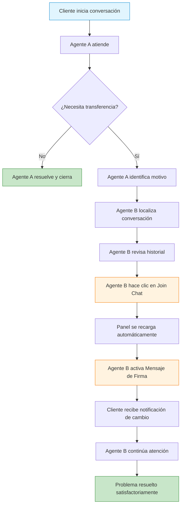
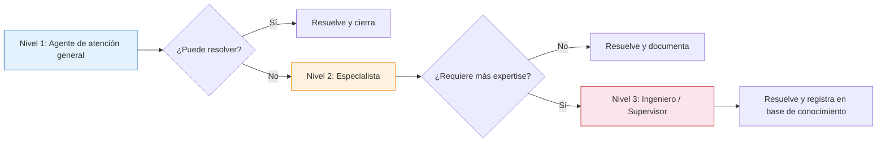

# Transferencia de Chat mediante Join Chat y Mensaje de Firma

**Última actualización: 6 de mayo de 2026**


> **¿Sabías que?** Las funciones **Join Chat** y **Mensaje de Firma** están disponibles en la bandeja de entrada compartida de E-SMART360. Estas herramientas permiten que los equipos de atención al cliente trabajen de forma colaborativa, realicen transferencias fluidas entre agentes y mantengan al cliente siempre informado sobre quién lo está atendiendo. En esta guía completa exploraremos cada detalle de estas funciones, sus casos de uso, configuraciones y mejores prácticas para que puedas implementarlas de inmediato en tu equipo.

---

## ¿Qué es la Bandeja de Entrada Compartida de E-SMART360?

La bandeja de entrada compartida de E-SMART360 es un centro de comunicación unificado (omnichannel) que integra en un solo lugar los siguientes canales:

- **Chat web**: conversaciones en tiempo real desde tu sitio web
- **WhatsApp**: mensajes de clientes a través de WhatsApp Business API
- **Facebook Messenger**: interacciones desde tu página de Facebook
- **Instagram DM**: mensajes directos de Instagram
- **Telegram**: conversaciones desde tu bot de Telegram

Desde esta bandeja, los miembros de tu equipo pueden realizar múltiples acciones:

- Enviar y recibir mensajes en todos los canales desde una sola interfaz
- Agregar etiquetas a clientes específicos para organizar mejor las conversaciones
- Tomar conversaciones asignadas por otros agentes mediante Join Chat
- Transferir chats entre agentes de forma estructurada
- Revisar el historial completo de cada conversación
- Asignar prioridades y estados a los tickets de soporte
- Ver indicadores de escritura en tiempo real para saber cuándo el cliente está redactando un mensaje


> **Beneficio clave:** Al centralizar todos los canales en una sola interfaz, tu equipo elimina la necesidad de cambiar entre aplicaciones, reduciendo los tiempos de respuesta y mejorando la experiencia del cliente. Los agentes pueden ver todas las conversaciones activas en un solo vistazo y priorizar aquellas que requieren atención inmediata.

### Características principales de la bandeja compartida

| Característica | Descripción | Beneficio |
|---|---|---|
| Bandeja unificada | Todos los canales en una sola vista | Reduce el cambio de contexto |
| Etiquetado de clientes | Categoriza contactos por tipo, etapa o prioridad | Organización y filtrado rápido |
| Historial de conversaciones | Registro completo de cada interacción | Trazabilidad total |
| Join Chat | Transferencia de chat entre agentes | Colaboración fluida |
| Mensaje de Firma | Notificación automática al cliente | Transparencia y profesionalismo |
| Indicadores de escritura | Saber cuándo el cliente está escribiendo | Mejor sincronización |
| Asignación de tickets | Distribución de carga de trabajo | Balanceo del equipo |

---

## ¿Cómo funciona la función "Join Chat"?

La función **Join Chat** (Unirse al Chat) es un botón que aparece disponible para cualquier agente del equipo cuando una conversación está siendo atendida por otro miembro. Al hacer clic en este botón, el agente puede tomar el control de la conversación en curso. Esta función está diseñada para que las transferencias sean limpias, rápidas y sin fricción tanto para el agente como para el cliente.

### El flujo completo de Join Chat explicado

El proceso de Join Chat sigue un flujo bien definido que garantiza que la transferencia sea exitosa:

1. **Estado inicial**: Un agente (Agente A) está atendiendo a un cliente en una conversación activa.
2. **Detección de necesidad**: El Agente A identifica que la conversación necesita ser transferida (por escalamiento técnico, cambio de turno o solicitud del cliente).
3. **Comunicación interna**: El Agente A puede dejar una nota interna para el Agente B sobre el contexto de la conversación.
4. **Activación de Join Chat**: El Agente B localiza la conversación y hace clic en el botón "Join Chat".
5. **Recarga automática**: El panel de chat se recarga automáticamente, preparando la interfaz para el nuevo agente.
6. **Envío del Mensaje de Firma** (opcional): Si está configurado, el sistema envía automáticamente un mensaje de presentación al cliente.
7. **Continuación de la atención**: El Agente B toma el control y continúa la conversación desde donde quedó.

### Paso a paso detallado: Cómo usar Join Chat


### Accede a la bandeja de entrada compartida

Inicia sesión en tu panel de E-SMART360 y dirígete a la sección de la bandeja de entrada compartida. Aquí verás todas las conversaciones activas organizadas por canal, con indicadores visuales de estado, agente asignado y última actividad.

### Identifica la conversación a tomar

Desde la bandeja de entrada, revisa las conversaciones activas indicadas. Puedes filtrar por canal (WhatsApp, Facebook, Instagram, Telegram o chat web) para encontrar más rápidamente la conversación que deseas tomar. Si un cliente necesita atención especializada o ha solicitado hablar con otro miembro del equipo, localiza el chat correspondiente.

### Revisa el contexto de la conversación

Antes de hacer clic en Join Chat, es altamente recomendable leer los mensajes anteriores para familiarizarte con el contexto del cliente. De esta forma, cuando comiences a atenderlo, no tendrás que pedirle que repita información que ya ha proporcionado, lo que mejora significativamente su experiencia.

### Haz clic en el botón Join Chat

Una vez que hayas identificado la conversación que deseas tomar y hayas revisado el contexto, haz clic en el botón **"Join Chat"**. Este botón está ubicado estratégicamente dentro del panel de la conversación activa. El botón solo es visible para agentes que no están actualmente asignados a esa conversación.

### Espera la recarga automática del panel

Después de hacer clic en "Join Chat", el panel de chat se recargará automáticamente. Este proceso es prácticamente instantáneo y prepara la interfaz para que el nuevo agente pueda comenzar a enviar mensajes. Durante esta recarga, el sistema actualiza los permisos de escritura y asigna oficialmente la conversación al nuevo agente.

### Selecciona el envío del Mensaje de Firma (recomendado)

Antes de comenzar a escribir, marca la opción "Enviar mensaje de firma al suscriptor" si está disponible. Esto enviará automáticamente un mensaje personalizado al cliente informándole que ahora está siendo atendido por un nuevo agente. Este paso es clave para mantener la transparencia y la confianza del cliente.

### Comienza a atender al cliente

Una vez que el panel se ha recargado y has enviado el mensaje de presentación, el nuevo agente ya puede enviar mensajes al cliente. El sistema registra automáticamente quién tomó la conversación y en qué momento, quedando todo documentado en el historial de la conversación.


> **Consejo:** Antes de tomar una conversación, revisa brevemente el historial de mensajes para ponerte al contexto. Esto te permitirá ofrecer una atención más fluida y evitar que el cliente tenga que repetir información. Una buena práctica es tomar nota rápida de los puntos clave: nombre del cliente, producto o servicio consultado, estado actual de la gestión y cualquier promesa de seguimiento que haya hecho el agente anterior.

### Casos de uso detallados de Join Chat


### Solicitud del cliente de hablar con otra persona

El cliente pide explícitamente hablar con otra persona, como un supervisor, un gerente o un especialista técnico. Esto puede ocurrir por diversas razones:
- El cliente no está satisfecho con la respuesta recibida
- Necesita una autorización que solo un superior puede otorgar
- Prefiere tratar un tema delicado con alguien de mayor jerarquía

En estos casos, el agente actual debe manejar la situación con tacto, explicar al cliente que será transferido y luego usar Join Chat para que el nuevo agente tome el control. El Mensaje de Firma debe incluir el cargo del nuevo agente para dar mayor seguridad al cliente.

### Manejo de situaciones delicadas o clientes frustrados

Un cliente está frustrado o enojado, y el agente actual no logra resolver el problema o la relación se ha vuelto tensa. Cambiar de interlocutor puede calmar la situación y ofrecer una nueva perspectiva. El nuevo agente, al no estar involucrado en la conversación previa, puede abordar el problema con una mente fresca y una actitud positiva. El Mensaje de Firma es especialmente útil aquí, ya que el nuevo agente puede presentarse de forma amable y profesional, estableciendo un nuevo tono para la conversación.

### Escalamiento de problemas complejos o técnicos

El agente actual no tiene los conocimientos necesarios para resolver una consulta técnica o especializada. En lugar de dar una respuesta incorrecta o incompleta, el agente puede transferir la conversación a un especialista. Esto asegura que el cliente reciba información precisa y útil, mejorando significativamente la calidad del servicio. Ejemplos comunes incluyen:
- Problemas de integración técnica con APIs
- Consultas sobre facturación avanzada
- Temas legales o regulatorios
- Configuraciones complejas de productos

### Cobertura por cambios de turno

Cuando termina el turno de un agente y otro debe continuar la conversación sin perder el contexto, Join Chat permite una transición suave y sin interrupciones. Esto es especialmente importante en equipos que operan 24/7 o en diferentes husos horarios. El agente entrante puede revisar el historial de la conversación antes de tomar el control y enviar un Mensaje de Firma informando al cliente del cambio, lo que evita que el cliente sienta que está siendo pasado de mano en mano sin cuidado.


### 🤝 Ejemplo: Escalamiento a soporte técnico

<strong>Escenario:</strong> Un cliente de comercio electrónico escribe por WhatsApp sobre un problema con un pedido que no se refleja en el sistema de envíos. El agente de atención al cliente (Juan) revisa el caso y determina que se trata de un problema de sincronización entre Shopify y el sistema de logística. Juan no tiene acceso al backend de integraciones, por lo que usa Join Chat para transferir la conversación a María, agente de soporte técnico.
    <br /><br />
    <strong>Desarrollo:</strong> María recibe la conversación, revisa el historial y entiende el contexto. Antes de escribir, activa el Mensaje de Firma personalizado: "Hola, soy María del equipo de soporte técnico de E-SMART360. Juan me ha transferido tu caso para ayudarte con la sincronización del envío. ¿Me confirmas el número de pedido?".
    <br /><br />
    <strong>Resultado:</strong> María revisa la integración en el backend, identifica un error de conexión y lo resuelve en 5 minutos. El cliente recibe la notificación de que su pedido ya está en proceso de envío. Todo el proceso tomó menos de 10 minutos desde que el cliente escribió por primera vez.
  
### 💼 Ejemplo: Transferencia por cambio de turno

<strong>Escenario:</strong> Son las 5:00 p. m. y el agente del turno de la mañana, Carlos, termina su jornada laboral. Hay una conversación activa con un cliente que está a punto de confirmar una compra importante. En lugar de cerrar la conversación abruptamente o pedir al cliente que espere al día siguiente, Carlos utiliza Join Chat para transferir la conversación a Laura, del turno de la tarde.
    <br /><br />
    <strong>Desarrollo:</strong> Antes de irse, Carlos deja una nota interna clara: "Cliente interesado en el plan Premium. Ya le expliqué las características principales y está evaluando si le conviene. Preguntó específicamente por el soporte técnico incluido. Dejo toda la información de contacto y cotización en el historial." Laura toma la conversación, activa el Mensaje de Firma y retoma justo donde lo dejó Carlos.
    <br /><br />
    <strong>Resultado:</strong> El cliente no percibe ninguna interrupción. Laura responde su pregunta sobre el soporte técnico, resuelve sus dudas finales y cierra la venta. El cliente nunca supo que hubo un cambio de turno y quedó satisfecho con la atención continua.
  
### Diagrama de flujo de una transferencia exitosa



---

## ¿Qué es el Mensaje de Firma (Signature Message)?

El **Mensaje de Firma** es un mensaje corto y automatizado que se envía al cliente cuando un nuevo agente se une a la conversación mediante Join Chat. Este mensaje tiene dos propósitos fundamentales:

1. **Informar al cliente** sobre el cambio de agente, generando transparencia y confianza en el proceso de atención.
2. **Presentar al nuevo agente**, incluyendo su nombre y cargo, para dar un toque personal y profesional a la transición.

El Mensaje de Firma actúa como un puente comunicacional entre el agente anterior, el nuevo agente y el cliente. Sin este mensaje, el cliente podría sentirse confundido al ver que de repente está hablando con otra persona sin explicación alguna. Con el mensaje, la transición es clara, educada y profesional.


> **Cómo funciona:** Cuando un nuevo agente activa la opción "Enviar mensaje de firma al suscriptor" antes de hacer clic en "Join Chat", el sistema envía automáticamente el mensaje personalizado al cliente. El cliente recibe una notificación como: *"Hola, soy María, ejecutiva de atención de E-SMART360. A partir de ahora estaré ayudándote con tu consulta."* Este mensaje se entrega como un mensaje normal en el canal que se esté utilizando (WhatsApp, Messenger, etc.).

### Características del Mensaje de Firma

- **Configurable**: Puedes personalizar completamente el texto del mensaje
- **Dinámico**: Soporta la variable `#User-Name#` para insertar automáticamente el nombre del agente
- **Opcional**: El agente puede decidir si enviarlo o no en cada transferencia
- **Inmediato**: Se envía en el momento exacto en que el nuevo agente toma la conversación
- **Multicanal**: Funciona en todos los canales integrados (WhatsApp, Facebook, Instagram, Telegram y chat web)
- **Profesional**: Evita transiciones abruptas y mejora la percepción del servicio

### Cómo personalizar el Mensaje de Firma

La personalización del Mensaje de Firma se realiza desde la configuración del gestor de bots (Bot Manager Settings). Sigue estos pasos para configurarlo:


### Accede a la configuración del Bot Manager

Inicia sesión en tu panel de E-SMART360 y dirígete a la sección **Bot Manager Settings** > **Configuración**. Esta sección contiene todos los ajustes relacionados con el comportamiento del bot y las funciones de la bandeja de entrada.

### Localiza la opción del Mensaje de Firma

Dentro de la configuración, busca la sección dedicada al **Mensaje de Firma** o **Signature Message**. Dependiendo de la versión de la interfaz, puede estar etiquetado como "Mensaje de presentación", "Mensaje de bienvenida al nuevo agente" o "Signature Message". Aquí podrás escribir el texto que deseas que se envíe automáticamente cuando un agente se une a una conversación.

### Redacta el mensaje usando la variable de nombre

Puedes incluir el nombre del agente usando la variable **`#User-Name#`**. Esta variable será reemplazada automáticamente por el nombre real del agente que se une a la conversación. Aquí tienes algunos ejemplos de mensajes efectivos:
- *"Hola, soy #User-Name# y soy parte del equipo de soporte de E-SMART360. Estoy aquí para ayudarte."*
- *"Buen día, me presento: soy #User-Name#, ejecutivo de atención al cliente. ¿En qué puedo ayudarte?"*
- *"Saludos, soy #User-Name# del equipo de E-SMART360. He tomado tu conversación para brindarte una atención más especializada. Cuéntame, ¿cómo puedo ayudarte hoy?"*

### Define el tono y estilo del mensaje

El mensaje debe reflejar la personalidad de tu marca. Considera los siguientes aspectos:
- **Formal vs. casual**: ¿Tu marca usa un tono formal o más cercano? Ajusta el lenguaje en consecuencia.
- **Longitud**: Un mensaje demasiado largo puede ser ignorado; uno demasiado corto puede sonar frío. Busca un equilibrio de 2-3 oraciones.
- **Inclusión del nombre del agente**: Siempre es recomendable incluir `#User-Name#` para personalizar la experiencia.
- **Información adicional**: Puedes incluir el área o departamento del agente si es relevante.

### Guarda los cambios y prueba la configuración

Una vez que hayas redactado el mensaje a tu gusto, haz clic en **Guardar** para que los cambios surtan efecto. A partir de ese momento, todos los nuevos agentes que se unan a una conversación mediante Join Chat podrán enviar este mensaje personalizado. Te recomendamos hacer una prueba rápida para verificar que el mensaje se vea correctamente en el canal del cliente.


> **Importante:** Si en el Mensaje de Firma no se incluye la variable `#User-Name#`, el mensaje se enviará sin el nombre del agente. El mensaje seguirá siendo útil para informar sobre el cambio, pero perderá el toque personal que aporta el nombre del agente. Asegúrate de incluir la variable si deseas que el cliente sepa con quién está hablando.

### Ejemplos de Mensajes de Firma personalizados por departamento


### Atención al cliente

```
Hola, soy #User-Name# del equipo de atención al cliente de E-SMART360. 
A partir de este momento estaré encargándome de tu consulta. 
He revisado el historial de nuestra conversación y tengo todo 
el contexto para ayudarte. ¿Me puedes confirmar en qué más 
podría asistirte?
```

### Ventas

```
¡Hola! Soy #User-Name#, ejecutivo de ventas de E-SMART360. 
El equipo me ha transferido tu conversación para ayudarte 
con la información que necesitas sobre nuestros planes y 
precios. ¿Te parece bien si retomamos desde donde íbamos?
```

### Soporte técnico

```
Buen día, soy #User-Name# del área de soporte técnico de 
E-SMART360. He tomado tu caso para brindarte una solución 
especializada. Por favor, ¿puedes confirmarme tu consulta 
específica para agilizar el proceso de resolución?
```

### Facturación

```
Hola, soy #User-Name# del departamento de facturación de 
E-SMART360. Me han transferido tu conversación para ayudarte 
con los temas relacionados con pagos, facturas o planes. 
¿En qué puedo ayudarte exactamente?
```

### Gerencia / Supervisión

```
Saludos, soy #User-Name#, supervisor del equipo de atención 
al cliente de E-SMART360. He sido informado sobre tu caso 
y estoy aquí personalmente para asegurarme de que recibas 
una solución satisfactoria. ¿Me permites revisar los detalles 
de tu situación?
```

---

## Beneficios de usar Join Chat y Mensaje de Firma en equipo

La combinación de ambas funciones ofrece ventajas significativas para equipos de atención al cliente de cualquier tamaño. A continuación, detallamos los principales beneficios:


### ⚡ Mayor velocidad de resolución

Los agentes pueden transferir conversaciones al miembro más capacitado para resolver un problema específico, eliminando tiempos muertos y evitando respuestas genéricas. Esto reduce el tiempo promedio de resolución (TTR) y aumenta la eficiencia operativa del equipo.
  
### 🔍 Transparencia total con el cliente

El Mensaje de Firma informa al cliente exactamente quién lo está atendiendo en cada momento. Esto genera confianza y evita la frustración de sentir que está siendo ignorado o transferido sin explicación. La transparencia es un pilar fundamental de un buen servicio al cliente.
  
### 📊 Trazabilidad y rendición de cuentas

El administrador puede monitorear qué agente tomó cada conversación, en qué momento y quién la transfirió. Esto permite evaluar el desempeño del equipo, detectar cuellos de botella, identificar agentes que necesitan capacitación adicional y optimizar los procesos de atención.
  
### Más beneficios detallados para tu equipo


### Colaboración fluida entre agentes

Los agentes pueden apoyarse entre sí sin interrumpir la experiencia del cliente. Si un agente tiene dudas sobre cómo responder a una consulta, puede consultar internamente con un compañero y, si es necesario, transferir la conversación mediante Join Chat para que el compañero más experimentado tome el control. Esta dinámica fomenta un ambiente de trabajo colaborativo donde los agentes se sienten respaldados y no temen pedir ayuda cuando la necesitan.

### Profesionalismo en cada interacción

Las transferencias se realizan de forma estructurada y con mensajes personalizados, en lugar de transiciones abruptas donde el cliente se queda preguntándose qué pasó. El proceso completo —desde que el agente A identifica la necesidad de transferencia hasta que el agente B envía el Mensaje de Firma— está diseñado para que el cliente perciba una atención perfectamente coordinada.

### Reducción del estrés y la presión del agente

Cuando un agente se siente abrumado, no tiene la respuesta adecuada o la conversación se ha vuelto tensa, puede transferir la conversación a un compañero sin que el cliente perciba falta de control o incompetencia. Esto reduce significativamente el estrés laboral y mejora la satisfacción del equipo, lo que a su vez se traduce en una mejor atención al cliente.

### Personalización a escala para cada equipo

Cada departamento o área puede tener su propio estilo de presentación, manteniendo la coherencia de la marca pero adaptándose al contexto específico de cada tipo de conversación. El equipo de ventas puede usar un tono más entusiasta, mientras que el equipo de soporte técnico puede optar por un enfoque más formal y detallado. Todo esto se configura desde un solo lugar.

### Mejora en los indicadores clave de servicio (KPIs)

La implementación efectiva de Join Chat y el Mensaje de Firma tiene un impacto directo en métricas como:
- **Tiempo promedio de resolución**: se reduce al escalar al agente correcto más rápido
- **Satisfacción del cliente (CSAT)**: mejora al sentir que reciben atención especializada
- **Tasa de resolución en primer contacto**: aumenta porque los agentes pueden escalar cuando es necesario en lugar de intentar resolver sin las herramientas adecuadas
- **Tasa de abandono**: disminuye porque los clientes no se sienten ignorados o mal atendidos

---

## Preguntas Frecuentes


### ¿Por qué es importante la transferencia de conversaciones en la atención al cliente?

La transferencia de conversaciones (también conocida como handover o escalamiento) permite que los equipos resuelvan incidencias de forma más rápida y eficiente. Cuando un agente se encuentra con una consulta técnica o compleja que no puede manejar adecuadamente, pasar la conversación a un compañero más calificado mejora la satisfacción del cliente y ahorra tiempo valioso. Reduce la frustración tanto del cliente como del agente, y asegura que el problema se resuelva con la persona adecuada desde el principio. Sin un sistema de transferencia estructurado, los agentes se ven forzados a dar respuestas incompletas o incorrectas, lo que daña la reputación de la marca.

### ¿El administrador puede rastrear quién realizó una transferencia?

Sí. El administrador tiene acceso al historial completo de cada conversación, incluyendo metadatos detallados como: qué agente transfirió el chat, qué agente se unió mediante Join Chat, la hora exacta de cada acción, cuánto tiempo estuvo cada agente asignado a la conversación y cuál fue el resultado final. Esta transparencia garantiza la rendición de cuentas y facilita la gestión del equipo, permitiendo identificar patrones de comportamiento, agentes que necesitan capacitación y oportunidades de mejora en los procesos.

### ¿Se puede desactivar el Mensaje de Firma si no es necesario?

Sí. Desde la configuración del Bot Manager, los administradores pueden desactivar completamente la opción de "Enviar mensaje de firma al suscriptor". También es posible desactivarla solo para ciertos canales o tipos de conversación. Sin embargo, recomendamos mantenerlo activo en la mayoría de los casos, ya que asegura una experiencia profesional y transparente con el cliente. La única excepción sería en conversaciones internas o de prueba donde la notificación al cliente no sea relevante.

### ¿El Mensaje de Firma se envía automáticamente o el agente debe activarlo manualmente?

El agente debe seleccionar manualmente la opción "Enviar mensaje de firma al suscriptor" antes de hacer clic en "Join Chat". El mensaje no se envía automáticamente a menos que el agente active esta opción expresamente. Esto le da al agente el control para decidir cuándo es apropiado enviar el mensaje de presentación. Por ejemplo, si la transferencia se realiza durante una conversación muy técnica donde el cliente ya está en pleno proceso de resolución, el agente puede optar por no interrumpir con un mensaje de presentación y continuar directamente donde lo dejó el agente anterior.

### ¿Join Chat funciona en todos los canales de la bandeja compartida?

Sí. La función Join Chat está disponible para conversaciones provenientes de todos los canales integrados en la bandeja de entrada compartida: WhatsApp, Facebook Messenger, Instagram DM, Telegram y chat web. La experiencia de uso es consistente sin importar el canal del que provenga la conversación. Esto significa que tu equipo puede aplicar las mismas políticas y procedimientos de transferencia independientemente de dónde se haya iniciado la conversación, simplificando la capacitación y la operación diaria.

### ¿Qué sucede si dos agentes intentan tomar la misma conversación al mismo tiempo?

El sistema maneja este escenario de forma segura y controlada. Solo un agente puede tomar exitosamente la conversación mediante Join Chat. El segundo agente que intente tomar la misma conversación recibirá una notificación indicando que la conversación ya fue tomada por otro agente y deberá esperar a que esté disponible nuevamente. Este mecanismo evita conflictos de asignación, duplicidad en la atención y mensajes cruzados que podrían confundir al cliente. El sistema prioriza la integridad de la experiencia del cliente por encima de todo.

### ¿Se puede incluir más de una variable en el Mensaje de Firma?

Actualmente, la variable disponible para personalizar el Mensaje de Firma es `#User-Name#`, que inserta automáticamente el nombre real del agente que se une a la conversación. Puedes combinar esta variable con texto fijo adicional para crear mensajes más elaborados y alineados con el tono de tu marca. Por ejemplo: "Hola, soy #User-Name# del equipo de [nombre de tu empresa]. Estoy aquí para continuar con tu atención." En versiones futuras, es posible que se agreguen más variables como el nombre del departamento, el cargo del agente o el tiempo estimado de resolución.

### ¿Join Chat funciona también para chats grupales o solo conversaciones uno a uno?

Join Chat está diseñado principalmente para conversaciones uno a uno entre un agente y un cliente. En el caso de chats grupales (como grupos de Telegram), la dinámica es diferente y la función Join Chat se comporta de manera distinta. Para chats grupales, todos los agentes asignados al grupo pueden ver y responder mensajes sin necesidad de Join Chat. Si necesitas gestionar grupos grandes, te recomendamos consultar la guía específica de gestión de grupos en E-SMART360.

### ¿Existe un límite de cuántas veces se puede transferir una misma conversación?

No existe un límite técnico predefinido para la cantidad de veces que una conversación puede ser transferida entre agentes mediante Join Chat. Sin embargo, desde una perspectiva operativa, recomendamos no transferir una conversación más de 2-3 veces, ya que cada transferencia implica un riesgo de que el cliente sienta que no se le está dando una atención consistente. Si una conversación requiere múltiples transferencias, puede ser señal de que el proceso de asignación inicial no está funcionando correctamente o que se necesita revisar los protocolos de escalamiento.

### ¿Puedo usar Join Chat sin tener activo el Mensaje de Firma?

Sí, ambas funciones son independientes. Puedes usar Join Chat para transferir conversaciones sin necesidad de tener configurado un Mensaje de Firma. Del mismo modo, puedes tener un Mensaje de Firma configurado pero los agentes pueden optar por no enviarlo al tomar una conversación. La recomendación es usar ambas funciones de forma combinada para obtener la mejor experiencia tanto para los agentes como para los clientes, pero cada una funciona perfectamente por sí sola.

---

## Casos de uso prácticos adicionales


### 🏢 Agencia de marketing digital con múltiples clientes

<strong>Escenario:</strong> Una agencia de marketing digital maneja campañas de WhatsApp para múltiples clientes de diferentes industrias. Cada cliente tiene un equipo de atención dedicado. Cuando un usuario final escribe preguntando por resultados de una campaña específica, el agente de primer contacto recibe el mensaje pero no tiene acceso a los analytics detallados de esa campaña en particular.
    <br /><br />
    <strong>Desarrollo:</strong> El agente de primer contacto identifica la consulta y usa Join Chat para transferir la conversación al especialista en analytics correspondiente. El especialista revisa la campaña, prepara una respuesta con datos concretos (tasa de apertura, clics, conversiones) y envía el informe al cliente mediante un mensaje informativo.
    <br /><br />
    <strong>Resultado:</strong> Respuesta especializada en cuestión de minutos, el cliente recibe información de valor sin tener que esperar ni repetir su consulta. El equipo trabaja de forma coordinada y cada miembro se enfoca en lo que mejor sabe hacer.
  
### 🏪 Tienda de comercio electrónico con carritos abandonados

<strong>Escenario:</strong> Un cliente agrega productos al carrito de compras en una tienda WooCommerce pero abandona la compra antes de finalizar. Horas después, escribe por WhatsApp preguntando por el estado de su pedido, confundido porque no recibió confirmación.
    <br /><br />
    <strong>Desarrollo:</strong> El agente de ventas detecta que el carrito fue abandonado y que el cliente está interesado pero tuvo dudas en el proceso de pago. En lugar de intentar resolver la confusión solo, transfiere la conversación al agente de recuperación de carritos mediante Join Chat. El nuevo agente se presenta con un Mensaje de Firma personalizado: "Hola, soy Laura, especialista en recuperación de compras. Veo que tienes un carrito con productos esperando. ¿Te ayudo a finalizar tu pedido? Tengo un código de descuento especial para ti."
    <br /><br />
    <strong>Resultado:</strong> El cliente se siente valorado al recibir atención personalizada con un descuento exclusivo. La compra se completa en menos de 15 minutos y la tasa de recuperación del equipo aumenta significativamente.
  
### 🌐 Soporte multicanal para empresa de SaaS

<strong>Escenario:</strong> Una empresa de software como servicio (SaaS) recibe consultas simultáneas de clientes en diferentes canales: algunos escriben por Facebook Messenger, otros por Instagram DM y otros por el chat web integrado en su plataforma. Un cliente reporta un error crítico que impide el uso del sistema.
    <br /><br />
    <strong>Desarrollo:</strong> El agente de primer nivel que recibe el mensaje en Facebook identifica que se trata de un error técnico que requiere acceso al backend del sistema. En lugar de perder tiempo intentando diagnosticar, usa Join Chat para transferir la conversación al ingeniero de soporte técnico de turno. El ingeniero toma el chat, revisa el problema y aplica una corrección en caliente.
    <br /><br />
    <strong>Resultado:</strong> El error se resuelve en menos de 30 minutos. El cliente recibe un mensaje de seguimiento automatizado y queda satisfecho con la rapidez de la respuesta. El equipo de soporte registra la incidencia en su sistema de ticketing.
  
### 🏨 Cadena hotelera con múltiples propiedades

<strong>Escenario:</strong> Una cadena hotelera maneja reservas y consultas de huéspedes a través de WhatsApp Business API. Un huésped escribe al número central preguntando por servicios específicos del hotel en el que está alojado (horarios de restaurante, servicios de spa, etc.).
    <br /><br />
    <strong>Desarrollo:</strong> El agente del call center central recibe la consulta pero no tiene información detallada sobre ese hotel en particular. Transfiere la conversación mediante Join Chat al agente asignado específicamente a esa propiedad. El agente del hotel conoce todos los servicios y puede responder de inmediato.
    <br /><br />
    <strong>Resultado:</strong> El huésped recibe información precisa y actualizada sobre los servicios del hotel en el que se encuentra. La experiencia del huésped mejora notablemente y el hotel recibe una calificación positiva en el servicio de atención al cliente.
  
---

## Integración con el flujo de trabajo del equipo

### Cómo integrar Join Chat en tu operación diaria

Para aprovechar al máximo las funciones Join Chat y Mensaje de Firma, es recomendable integrarlas en los procesos operativos del equipo de atención al cliente. Aquí te presentamos algunas estrategias de implementación:

#### Estrategia 1: Protocolo de escalamiento por niveles

Implementa un sistema de escalamiento estructurado donde cada nivel de soporte tenga responsabilidades claras:




### Descripción del protocolo de escalamiento por niveles

**Nivel 1 - Atención al cliente general:** Es el primer punto de contacto. Los agentes de este nivel manejan consultas comunes, preguntas frecuentes, información general sobre productos y servicios. Si la consulta excede su conocimiento o autoridad, escalan al nivel 2 usando Join Chat.

**Nivel 2 - Especialistas por área:** Incluye agentes especializados en áreas como soporte técnico, facturación, ventas o postventa. Reciben las conversaciones transferidas desde el nivel 1. Resuelven la mayoría de los casos y solo escalan al nivel 3 cuando se trata de problemas excepcionales.

**Nivel 3 - Ingenieros y supervisores:** El nivel más alto de escalamiento. Manejan incidentes críticos, problemas técnicos complejos, quejas de alta gravedad o autorizaciones especiales. Documentan cada caso resuelto para alimentar la base de conocimiento del equipo.

#### Estrategia 2: Transferencia programada por horarios

Para equipos que operan en múltiples turnos o zonas horarias, establece un proceso de transferencia al final de cada turno:

1. **15 minutos antes del cambio de turno**: El agente saliente revisa sus conversaciones activas
2. **Identifica conversaciones activas**: Señala aquellas que requieren seguimiento
3. **Deja notas internas detalladas**: Incluye contexto, acciones realizadas y próximos pasos
4. **Transfiere mediante Join Chat**: El agente entrante toma cada conversación
5. **Envía Mensaje de Firma**: Informa al cliente sobre el cambio de agente
6. **Reunión breve de handover**: El equipo discute los casos más complejos


> **Automatización recomendada:** Puedes configurar recordatorios automáticos en tu sistema de gestión de equipos para que los agentes reciban una notificación cuando se acerque el final de su turno, recordándoles que deben preparar sus conversaciones para transferencia. Esto reduce el riesgo de que conversaciones importantes queden sin atención durante el cambio de turno.

### Mejores prácticas para equipos de atención al cliente


### 📝 Documentación de contexto

Siempre que sea posible, el agente que transfiere debe dejar notas claras sobre el estado de la conversación. Incluye el problema del cliente, lo que ya se ha intentado y el siguiente paso sugerido. Esto evita que el nuevo agente tenga que hacer preguntas redundantes al cliente.
  
### 🎯 Capacitación del equipo

Todos los miembros del equipo deben conocer el flujo de Join Chat y cómo personalizar el Mensaje de Firma. Realiza sesiones de capacitación periódicas y simulacros de transferencia para que el proceso sea natural y eficiente.
  
### 📊 Monitoreo de calidad

Los supervisores deben revisar aleatoriamente las transferencias realizadas para asegurarse de que se sigan los protocolos. Evalúa la calidad de las notas internas, la adecuación del Mensaje de Firma y la satisfacción del cliente después de la transferencia.
  
---

## Configuración avanzada del Mensaje de Firma

### Variables disponibles y ejemplos de uso

La variable `#User-Name#` es la principal herramienta de personalización del Mensaje de Firma. Sin embargo, puedes combinarla con texto personalizado para crear mensajes más elaborados. Aquí tienes algunas variaciones avanzadas:


### Mensaje con nombre y cargo

```
Hola, soy #User-Name#, [cargo del agente] de E-SMART360.
Estoy aquí para ayudarte con tu consulta.
¿Cómo puedo asistirte hoy?
```

### Mensaje con agradecimiento al agente anterior

```
¡Hola! Soy #User-Name# de E-SMART360.
[Mencionar nombre del agente anterior] me ha puesto al tanto
de tu consulta y estoy listo para continuar ayudándote.
Cuéntame, ¿en qué punto nos quedamos?
```

### Mensaje con disculpa y compromiso

```
Hola, soy #User-Name#, [cargo] de E-SMART360.
Lamento los inconvenientes que hayas podido tener.
He revisado tu caso personalmente y me aseguraré de
que recibas una solución rápida y efectiva.
```

### Mensaje breve y directo

```
Hola, soy #User-Name# de E-SMART360.
A partir de ahora estaré al tanto de tu consulta.
¿En qué puedo ayudarte?
```

> **¿Sabías que?** Algunos equipos combinan el Mensaje de Firma con emojis para dar un tono más amigable a la transición. Por ejemplo: "👋 ¡Hola! Soy #User-Name# del equipo de E-SMART360. Estoy aquí para ayudarte." Los emojis pueden ayudar a humanizar la conversación y reducir la tensión en situaciones de reclamo.

### Configuración de respuestas automáticas posteriores a la transferencia

Después de que se realiza una transferencia mediante Join Chat, puedes configurar respuestas automáticas adicionales para mejorar la experiencia del cliente. Estas son algunas ideas:

- **Encuesta de satisfacción**: Envía automáticamente una breve encuesta después de la transferencia para evaluar cómo se sintió el cliente con el cambio de agente.
- **Confirmación de recepción**: Un mensaje que confirme que el nuevo agente ha tomado el control y está revisando el caso.
- **Tiempo estimado de respuesta**: Informa al cliente cuánto tiempo aproximadamente tomará resolver su consulta.

---

## Análisis de métricas y rendimiento

La implementación de Join Chat y Mensaje de Firma genera datos valiosos que puedes analizar para mejorar continuamente la calidad del servicio. Algunas métricas clave para monitorear:

| Métrica | Descripción | Cómo mejorarla |
|---|---|---|
| Tiempo promedio hasta la transferencia | Tiempo que transcurre desde que se inicia la conversación hasta que se transfiere | Capacitar a los agentes para identificar más rápido cuándo escalar |
| Tasa de transferencias por agente | Porcentaje de conversaciones que cada agente transfiere | Identificar agentes que transfieren en exceso vs. los que nunca transfieren |
| Satisfacción post-transferencia | NPS o CSAT del cliente después de una transferencia | Revisar la calidad del Mensaje de Firma y la fluidez de la transición |
| Tasa de resolución por nivel de escalamiento | Porcentaje de casos resueltos en cada nivel | Ajustar los criterios de escalamiento y la capacitación por nivel |
| Tiempo de respuesta del nuevo agente | Cuánto tarda el nuevo agente en enviar el primer mensaje | Establecer SLA para la primera respuesta después de Join Chat |


> **Recomendación:** Programa revisiones mensuales de estas métricas con tu equipo. Analiza las tendencias, identifica áreas de mejora y celebra los logros. La mejora continua basada en datos es la clave para un equipo de atención al cliente de alto rendimiento.

---

## Solución de problemas comunes


### El botón Join Chat no aparece para algunos agentes

Verifica que el agente tenga los permisos adecuados en la configuración del equipo. Solo los agentes con permisos de "Acceso a la bandeja compartida" pueden ver y usar el botón Join Chat. Revisa la configuración de roles y permisos en el panel de administración de E-SMART360 y asegúrate de que el agente esté asignado al equipo correcto.

### El Mensaje de Firma no se envía aunque seleccioné la opción

Esto puede ocurrir si el Mensaje de Firma no está configurado en Bot Manager Settings > Configuration. Ve a la configuración, asegúrate de haber guardado un texto en el campo correspondiente y verifica que la variable #User-Name# esté correctamente escrita (con las mayúsculas exactas). También verifica que el agente que toma la conversación tenga un nombre configurado en su perfil de usuario.

### La recarga del panel tarda más de lo normal

La recarga del panel después de hacer clic en Join Chat debería ser prácticamente instantánea. Si experimentas demoras, verifica tu conexión a internet y cierra otras pestañas o aplicaciones que puedan estar consumiendo recursos. Si el problema persiste, contacta al equipo de soporte de E-SMART360 para revisar el estado del servicio.

### El agente anterior sigue viendo la conversación como activa

Después de que un agente toma una conversación mediante Join Chat, el agente anterior debería ver la conversación como "Transferida" o "En atención por otro agente". Si esto no ocurre, puede ser un problema de sincronización. Intenta recargar la página de la bandeja de entrada. Si el problema persiste, verifica que la función Join Chat esté correctamente habilitada en la configuración del sistema.

### El cliente no recibe el mensaje de presentación en el canal esperado

El Mensaje de Firma se envía siempre en el mismo canal donde se está desarrollando la conversación. Si el cliente no lo recibe, verifica que el canal (WhatsApp, Facebook Messenger, etc.) esté funcionando correctamente. Revisa también que el mensaje configurado no contenga caracteres o formatos no soportados por el canal específico. En WhatsApp, por ejemplo, los mensajes de más de 4096 caracteres se truncan automáticamente.

---

## Conclusión

Las funciones **Join Chat** y **Mensaje de Firma** de E-SMART360 transforman la forma en que los equipos de atención al cliente manejan las transferencias de conversaciones. Al implementar estas herramientas, tu equipo logrará:

- **Transferencias más fluidas** entre agentes, sin pérdida de contexto
- **Mayor satisfacción del cliente** al sentirse informado y atendido por el agente adecuado
- **Mejor colaboración interna** con un equipo que trabaja de forma coordinada
- **Profesionalismo en cada interacción** con mensajes personalizados que reflejan la calidad de tu marca

La combinación de Join Chat para la transferencia técnica y el Mensaje de Firma para la comunicación con el cliente crea un ecosistema de atención al cliente donde todos ganan: los agentes trabajan mejor, los clientes están más satisfechos y la empresa ofrece un servicio de mayor calidad.


> **Comienza hoy:** Si aún no has implementado Join Chat y Mensaje de Firma en tu equipo de atención al cliente, te invitamos a hacerlo. Configura el Mensaje de Firma desde Bot Manager Settings > Configuration, capacita a tu equipo en el flujo de transferencia y comienza a disfrutar de los beneficios de una atención al cliente más profesional y eficiente.

---


> **Actualizaciones del artículo (6 de mayo de 2026)**
> - **6 de mayo de 2026**: Versión inicial del artículo. Se cubren todas las funcionalidades de Join Chat y Mensaje de Firma en la bandeja de entrada compartida de E-SMART360.

---

## Recursos adicionales

Para profundizar en temas relacionados, consulta estos recursos:

- [Guía completa de la bandeja de entrada compartida]()
- [Cómo gestionar conversaciones de WhatsApp en el panel de chat]()
- [Configuración de etiquetas y filtros para organizar clientes]()
- [Guía de permisos y roles de usuario en E-SMART360]()
- [Estrategias de escalamiento para equipos de soporte]()


---

## Apéndice: Glosario de términos


### Términos clave de la transferencia de chat

| Término | Definición |
|---|---|
| **Join Chat (Unirse al Chat)** | Función que permite a un agente tomar el control de una conversación activa atendida por otro miembro del equipo. |
| **Mensaje de Firma (Signature Message)** | Mensaje automatizado que se envía al cliente cuando un nuevo agente se une a una conversación, informándole del cambio. |
| **Handover / Transferencia** | Proceso de pasar una conversación de un agente a otro dentro del mismo equipo. |
| **Escalamiento** | Transferencia de una conversación a un nivel superior de soporte o a un especialista. |
| **Bandeja de entrada compartida** | Interfaz unificada donde todos los agentes del equipo pueden ver y gestionar conversaciones de múltiples canales. |
| **Variable #User-Name#** | Variable dinámica que inserta automáticamente el nombre del agente en el Mensaje de Firma. |
| **Nota interna** | Mensaje visible solo para los miembros del equipo, no para el cliente, que sirve para compartir contexto entre agentes. |
| **SLA (Service Level Agreement)** | Acuerdo de nivel de servicio que define los tiempos máximos de respuesta y resolución. |
| **CSAT (Customer Satisfaction)** | Métrica que mide el nivel de satisfacción del cliente con el servicio recibido. |
| **TTR (Time to Resolution)** | Tiempo total que toma resolver una consulta o incidencia desde que se reporta. |

---

## Checklist de implementación para tu equipo

Usa esta lista de verificación para asegurarte de que tu equipo está listo para usar Join Chat y Mensaje de Firma:

- [ ] Configurar el Mensaje de Firma en Bot Manager Settings > Configuration
- [ ] Personalizar el mensaje con la variable #User-Name#
- [ ] Verificar que todos los agentes tengan nombre en su perfil de usuario
- [ ] Capacitar al equipo en el flujo de Join Chat
- [ ] Establecer un protocolo de escalamiento por niveles
- [ ] Crear plantillas de notas internas para transferencias
- [ ] Definir criterios claros para cuándo transferir una conversación
- [ ] Configurar los permisos de acceso a la bandeja compartida
- [ ] Realizar simulacros de transferencia con el equipo
- [ ] Monitorear las métricas de transferencia durante la primera semana
- [ ] Solicitar feedback al equipo sobre el proceso
- [ ] Ajustar el Mensaje de Firma según los resultados obtenidos
