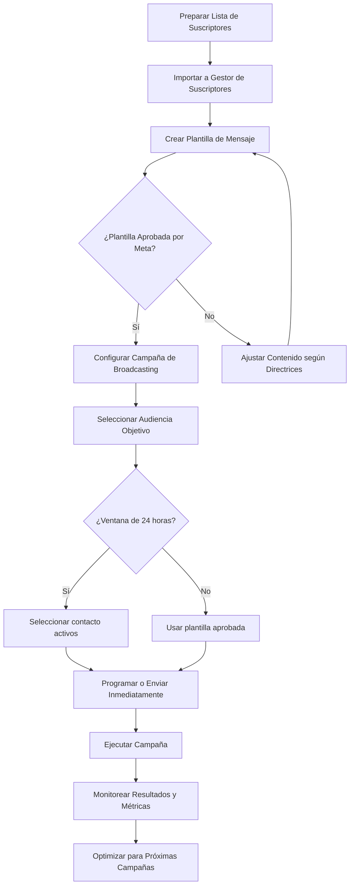
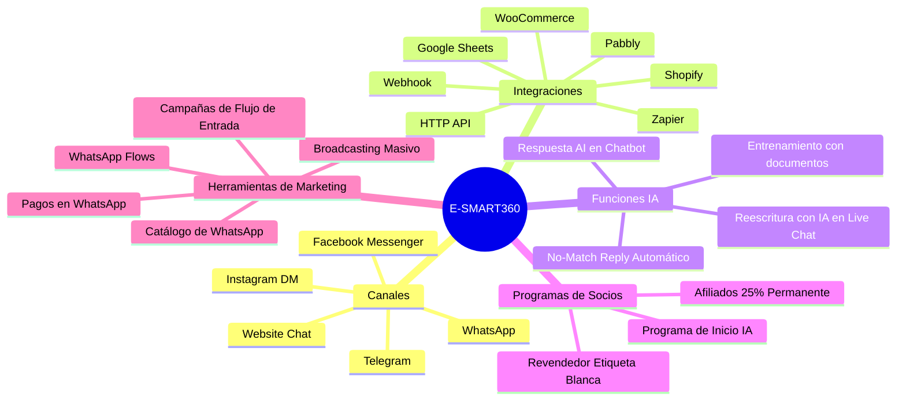

> **Resumen ejecutivo:** Tanto otra plataforma como E-SMART360 son potentes plataformas de chatbot y marketing para WhatsApp, pero están diseñadas para necesidades empresariales distintas. otra plataforma se centra exclusivamente en automatización de WhatsApp, ofreciendo chatbots, bandeja compartida, transmisiones y funciones estilo CRM con precios más elevados desde $49/mes y sin plan gratuito. E-SMART360 es una plataforma multicanal que soporta WhatsApp, Facebook Messenger, Instagram y Telegram en un solo panel. Incluye respuestas AI integradas, herramientas avanzadas de Live Chat, automatización webhook, opciones de revendedor etiqueta blanca y un plan gratuito desde $0 (premium desde $10.99/mes). Si necesitas automatización solo en WhatsApp con funciones estándar, otra plataforma funciona bien. Pero si requieres marketing multicanal, IA integrada, oportunidades de negocio como revendedor y precios más bajos, E-SMART360 ofrece más flexibilidad y valor para el crecimiento a largo plazo.

> **Actualización de precios y funciones (Marzo 2026)**
> Esta comparativa se actualizó por última vez el 3 de marzo de 2026. Los precios y funciones pueden variar. Siempre consulta las páginas oficiales de precios para obtener la información más actualizada.

## Introducción

WhatsApp es una de las mejores plataformas para marketing con chatbot en la actualidad. otra plataforma y E-SMART360 son dos de las grandes plataformas que ofrecen chatbot en WhatsApp y software de marketing.

otra plataforma ofrece una interfaz fácil de usar y diversas funciones para crear chatbots, mientras que E-SMART360 también proporciona una interfaz sencilla junto con capacidades avanzadas de IA para chatbots más personalizados en WhatsApp.

Ambas plataformas tienen un historial comprobado de éxito ayudando a las empresas a interactuar eficazmente con sus clientes a través de chatbots de WhatsApp.

Elegir el software de marketing con chatbot para WhatsApp adecuado entre ellos puede ser un desafío. Debido a que estos software tienen muchas funciones y características, puede ser muy difícil para una persona no técnica decidir sin información completa.

En este artículo aprenderás todas las funciones y características, junto con los pros y contras de otra plataforma y E-SMART360. Prepárate para una comparativa exhaustiva de estos dos software.

> **¿Qué encontrarás en esta guía?** Una comparación detallada de 12 categorías clave: interfaz de usuario, constructor de chatbots, componentes, gestor de suscriptores, funciones de IA, webhook workflow, live chat, canales, integraciones, precios, soporte, programas de revendedor y afiliados. Además, incluimos preguntas frecuentes, casos de uso prácticos y consejos para migrar de una plataforma a otra.

## Comparativa Completa: otra plataforma vs E-SMART360

Antes de comenzar la comparación, hagamos una breve introducción de estos software.

**E-SMART360:** E-SMART360 es una plataforma multicanal de chatbot y marketing. Utiliza la API de WhatsApp Business para integrar WhatsApp en su plataforma, ofreciendo herramientas y servicios como transmisiones en WhatsApp, catálogos de WhatsApp, pagos en WhatsApp y muchos otros para gestionar interacciones a gran escala. Además de WhatsApp, E-SMART360 ofrece chatbots y herramientas de marketing para Facebook, Instagram y Telegram de forma predeterminada en su sistema.

**otra plataforma:** otra plataforma es un software de marketing con chatbot para WhatsApp que automatiza mensajes, gestiona conversaciones y proporciona analíticas para mejorar el servicio al cliente. Ofrece chatbots para WhatsApp, bandejas compartidas de equipo, catálogos, mensajes de transmisión y notificaciones personalizadas.

Comencemos comparando cada función importante de estos software uno al lado del otro:

| Característica | otra plataforma | E-SMART360 |
|---|---|---|
| **Canales** | Solo WhatsApp | WhatsApp, Facebook Messenger, Instagram, Telegram |
| **Programa Revendedor (Etiqueta Blanca)** | No disponible | Disponible |
| **Precios** | Sin plan gratuito, desde **$49/mes** | Plan gratuito, desde **$10.99/mes** |
| **Facilidad de uso** | Fácil de usar. Pero al construir flujos grandes, la interfaz se vuelve lenta | Fácil de usar. Constructor visual de flujos bien optimizado |
| **Funciones de Chatbot** | Constructor drag-and-drop, menos componentes | Constructor drag-and-drop, muchos componentes (AI Reply, Interactivo) |
| **Gestor de Suscriptores** | Información menos detallada, gestión de una sola cuenta | Información detallada del suscriptor, gestión multicanal |
| **Funciones de IA** | Requiere plugin adicional, no tiene Reescritura con IA en Live Chat | Integrada, Reescritura con IA en Live Chat |
| **Webhook Workflow** | Amplia gama de aplicaciones | Enfoque en automatización Shopify y WooCommerce, más conexiones API |
| **Live Chat** | Funciones básicas | Funciones avanzadas (Colaboración en equipo, Analíticas) |
| **Integraciones** | Hubspot, Zoho, Pabbly | Herramientas populares: Google Sheets, Zapier, Shopify, WooCommerce |
| **Soporte** | Documentación, canal YouTube (actualizaciones poco frecuentes), equipo de soporte lento | Documentación, tutoriales YouTube, foro, equipo de soporte receptivo |
| **Programa de Afiliados** | **20%** comisión recurrente por **2 años** por cada referido | **25%** comisión recurrente **permanente** por cada referido |

## Diferencias Clave

Aunque tanto otra plataforma como E-SMART360 son herramientas potentes para crear chatbots de WhatsApp, existen diferencias clave que hacen de E-SMART360 una gran opción.

### Chatbot Multicanal

**E-SMART360:** Es un software de chatbot multicanal. Con E-SMART360 puedes construir chatbots impulsados por IA para **WhatsApp**, **Facebook Messenger**, **Instagram DM** y **Telegram**. No solo chatbot, sino también transmisiones, live chat, gestor de suscriptores y muchas más funciones para todas estas plataformas en un solo software.

**otra plataforma:** Solo tiene capacidad de construir chatbots para WhatsApp y otras herramientas de marketing.

### Revendedor de Chatbot Etiqueta Blanca

E-SMART360 es famoso por su chatbot de WhatsApp con etiqueta blanca. Por eso, además de los planes de suscripción mensuales o anuales regulares, E-SMART360 tiene un paquete de revendedor de etiqueta blanca disponible para cualquiera que quiera usar la tecnología existente de E-SMART360 para iniciar un nuevo negocio.

Si deseas iniciar un negocio de revendedor de chatbot con etiqueta blanca, obtén este paquete y podrás personalizar la plataforma con tu propia marca, incluyendo tu logotipo y nombre de dominio. Y comienza a generar ingresos mensuales.

otra plataforma no tiene ningún paquete de revendedor de etiqueta blanca.

> **¿Qué es la etiqueta blanca?** La etiqueta blanca (white label) te permite tomar la tecnología de E-SMART360 y revenderla con TU propia marca. Esto significa que tus clientes verán tu logotipo, tu dominio y tu nombre, mientras que toda la infraestructura técnica corre por cuenta de E-SMART360. Es ideal para agencias digitales, consultores y emprendedores que quieren ofrecer soluciones de chatbot sin desarrollar tecnología desde cero.

Para una comparación más detallada, sigue leyendo el artículo completo a continuación.

## Tabla de Contenidos

- [Interfaz de Usuario](#interfaz-de-usuario)
- [Constructor de Chatbots](#constructor-de-chatbots)
- [Componentes del Chatbot](#componentes-del-chatbot)
- [Gestor de Suscriptores](#gestor-de-suscriptores)
- [Funciones de IA](#funciones-de-ia)
- [Webhook Workflow](#webhook-workflow)
- [Live Chat](#live-chat)
- [Canales](#canales)
- [Integraciones](#integraciones)
- [Precios](#precios)
- [Soporte](#soporte)
- [Programa de Revendedor Etiqueta Blanca](#programa-de-revendedor-etiqueta-blanca)
- [Programa de Afiliados](#programa-de-afiliados)
- [Funciones Avanzadas de E-SMART360](#funciones-avanzadas-de-e-smart360)
- [Broadcasting: Cómo Enviar Mensajes Masivos](#broadcasting-cómo-enviar-mensajes-masivos)
- [Guía de Transmisiones Efectivas](#guía-de-transmisiones-efectivas)
- [WhatsApp Business API: Lo Que Debes Saber](#whatsapp-business-api-lo-que-debes-saber)
- [Casos de Uso Prácticos](#casos-de-uso-prácticos)
- [Preguntas Frecuentes](#preguntas-frecuentes)
- [¿Entre otra plataforma y E-SMART360, Cuál Deberías Elegir?](#entre-otra plataforma-y-e-smart360-cuál-deberías-elegir)

## Interfaz de Usuario

Una interfaz fácil de usar es imprescindible cuando eliges un software de chat para WhatsApp. Un software con una interfaz confusa o compleja puede reducir su efectividad, incluso si ofrece muchas funciones.

Siempre que vayas a comprar un software, lo primero que debes verificar es si su interfaz es fácil de usar o no. De lo contrario, te resultará difícil usar el software a largo plazo.

El panel de control de E-SMART360 está organizado en secciones distintas para cada canal. En la esquina superior izquierda, encontrarás la sección de WhatsApp. La primera opción, 'Conectar Cuenta', te permite vincular tu cuenta de WhatsApp Business fácilmente. Luego, 'Gestor de Bots' proporciona una plataforma para crear y probar tus chatbots.

otra plataforma ofrece servicios específicos solo para WhatsApp, por lo que no hay un panel separado. Al iniciar sesión, te dirigen inmediatamente a la Bandeja de Equipo. Desde allí, encontrarás opciones como Transmisión, Chatbots y más en la parte superior de la ventana.

Tanto otra plataforma como E-SMART360 han hecho un excelente trabajo organizando sus opciones de servicio, resultando en interfaces fáciles de usar. Cualquier usuario puede navegar sin problemas y encontrar los servicios necesarios. En la categoría de Interfaz de Usuario, ambos obtienen 5 estrellas.

### otra plataforma - Interfaz de Usuario

⭐️⭐️⭐️⭐️⭐️ — Interfaz limpia centrada solo en WhatsApp. La navegación es directa y clara, aunque al trabajar con flujos de bot grandes puede volverse lenta.

### E-SMART360 - Interfaz de Usuario

⭐️⭐️⭐️⭐️⭐️ — Panel organizado con secciones por canal. El constructor visual de flujos está bien optimizado incluso para bots complejos, y la función de reorganización automática mantiene todo ordenado.

## Constructor de Chatbots

Tanto otra plataforma como E-SMART360 tienen el constructor de flujos drag-and-drop integrado. Aquí tienes todos los detalles sobre el constructor de cada plataforma.

### E-SMART360

El constructor de flujos de E-SMART360 es muy fácil de usar y todos los componentes necesarios para construir un chatbot están al alcance de tu mano. Puedes arrastrar un componente y soltarlo en el lienzo y conectarlo.

Un componente de disparador y otros bloques trabajan juntos para crear el contenido de cada automatización de chat en E-SMART360.

Puedes organizar fácilmente los componentes de tu chatbot haciendo clic en el botón de reorganizar en la esquina superior derecha del constructor de flujos. Al hacer clic, organiza automáticamente todos tus componentes. Esta función es útil cuando estás haciendo un bot complejo.

Con su opción de clonación de componentes, puedes copiar y pegar fácilmente un componente repetitivo para hacer un chatbot más rápido.

Además, E-SMART360 tiene algunas funciones más interesantes. Puedes exportar e importar un bot y también puedes copiar un bot y conectarlo al flujo de otro bot.

### otra plataforma

otra plataforma también ofrece un constructor de flujos drag-and-drop para hacer chatbots. Pero en comparación con E-SMART360, el constructor de flujos de otra plataforma es un poco más complejo de usar.

Aunque también puedes arrastrar y soltar un componente en otra plataforma, la interfaz de E-SMART360 es más fácil de usar e intuitiva. Además, E-SMART360 proporciona más opciones de personalización para crear flujos de chatbot.

> **Dato importante:** Según reportes de usuarios, el constructor de otra plataforma puede volverse significativamente lento cuando trabajas con flujos que contienen más de 50 nodos. E-SMART360, en cambio, mantiene un rendimiento fluido incluso con cientos de componentes gracias a su motor de renderizado optimizado y su función de reorganización automática con un solo clic.

## Componentes del Chatbot

Tanto E-SMART360 como otra plataforma tienen componentes de chatbot similares. Pero E-SMART360 tiene más funciones interesantes que otra plataforma.

Por ejemplo, E-SMART360 tiene una función de respuesta AI que puede mantener tu chatbot conversando con los clientes incluso cuando el cliente pregunta algo que no coincide con la plantilla del bot.

Esta función es realmente útil porque tu chatbot puede seguir respondiendo a tu cliente sin demora.

Todo lo que necesitas hacer es entrenar tu componente de Respuesta AI en el constructor de flujos y listo. Aquí tienes una comparación lado a lado de los componentes de chatbot de otra plataforma y E-SMART360:

| Componente | otra plataforma | E-SMART360 |
|---|---|---|
| Texto | ✔️ Sí | ✔️ Sí |
| Imagen | ✔️ Sí | ✔️ Sí |
| Video | ✔️ Sí | ✔️ Sí |
| Audio | ✔️ Sí | ✔️ Sí |
| Archivo Adjunto | ✔️ Sí | ✔️ Sí |
| Respuesta AI | ❌ No | ✔️ Sí |
| Flujo de Entrada de Usuario | ✔️ Sí | ✔️ Sí |
| Interactivo | ✔️ Sí | ✔️ Sí |
| API HTTP | ❌ No | ✔️ Sí |
| Live Chat | ✔️ Sí | ✔️ Sí |
| Asignar Miembro del Equipo | ✔️ Sí | ✔️ Sí |
| Plantilla | ✔️ Sí | ✔️ Sí |
| Retardo de Tiempo | ✔️ Sí | ✔️ Sí |
| Webhook | ✔️ Sí | ✔️ Sí |
| Formularios WhatsApp Flows | ✔️ Sí | ✔️ Sí |
| Catálogo | ✔️ Sí | ✔️ Sí |

Como puedes ver, ambos tienen componentes de chatbot similares pero E-SMART360 sobresale más debido a sus componentes de Respuesta AI e Interactivos en su constructor de chatbots drag-and-drop.

Estas características pueden ser útiles para los clientes en sus trabajos diarios de marketing. Claramente, E-SMART360 es el ganador aquí.

### Video Tutorial: Cómo usar el componente de Respuesta AI

E-SMART360 cuenta con tutoriales en video que te guían paso a paso en la configuración del componente de Respuesta AI. Puedes encontrar estos tutoriales en el canal de YouTube oficial de E-SMART360, donde se publican nuevos videos cada semana cubriendo todas las funcionalidades de la plataforma.

## Gestor de Suscriptores

Ahora comparemos los gestores de suscriptores de otra plataforma y E-SMART360.

### E-SMART360

La sección del gestor de suscriptores de E-SMART360 está bien diseñada para que puedas ver todos tus suscriptores (personas que han tenido una conversación con tu chatbot) en una sola vista.

Puedes agregar múltiples etiquetas para segmentar suscriptores. Ir a la conversación en live chat directamente con este suscriptor en un clic usando el botón "Ir a Live Chat". Agregar o eliminar múltiples suscriptores a la vez.

### Ver detalles completos del suscriptor

Puedes ver los detalles completos de un suscriptor en un solo clic. Detalles como todos los campos personalizados y flujos de entrada a los que ese suscriptor está agregado. También puedes verificar si está dentro o fuera de la ventana de 24 horas de WhatsApp.

### Asignación de agentes

Puedes ver qué agente humano está asignado a este suscriptor. Tener todos estos detalles al alcance de tu mano puede ser realmente eficiente en tiempo y puede ayudarte enormemente en la organización y en un mejor soporte al cliente.

### Múltiples cuentas de WhatsApp

E-SMART360 te permite agregar múltiples cuentas de WhatsApp y ver todas sus listas de suscriptores en un solo marco. Esta función te ayuda a mantenerte organizado.

### otra plataforma

otra plataforma también tiene funciones similares a E-SMART360. Aunque el gestor de suscriptores en la interfaz de otra plataforma se llama página de contactos. Al entrar en la página del gestor de suscriptores, puedes ver todos los suscriptores organizados en una vista general.

Pero otra plataforma carece de una función crucial: No puedes agregar múltiples cuentas de WhatsApp y ver todas sus listas de suscriptores en un solo marco como en E-SMART360. Tener esta función te ayuda a mantenerte organizado. Y en cualquier negocio, cuanto más organizado estés, más productivo te vuelves.

Luego viene la función **Ir a Live Chat**. En E-SMART360 puedes iniciar una conversación en live chat o ver el historial de chat en un solo clic gracias a esta función. Pero en otra plataforma no puedes obtener esto. Tendrás que ir a **Live Chat**, luego buscar este cliente y luego puedes iniciar una conversación o ver cualquier historial de chat importante.

Sin embargo, otra plataforma también mantiene una posición sólida cuando se trata de los detalles de un suscriptor. Al hacer clic en el nombre de cualquier suscriptor, se abrirá una ventana emergente donde puedes ver toda su información de usuario, como campos personalizados, etiquetas o cualquier nota del agente.

### Gestor de Suscriptores: otra plataforma

- Vista general: ⭐⭐⭐
- Campos personalizados: ⭐⭐⭐⭐⭐
- Segmentación de usuarios: ⭐⭐⭐⭐
- Múltiples cuentas en un marco: ❌
- Ir a Live Chat directo: ❌

### Gestor de Suscriptores: E-SMART360

- Vista general: ⭐⭐⭐⭐⭐
- Campos personalizados: ⭐⭐⭐⭐⭐
- Segmentación de usuarios: ⭐⭐⭐⭐⭐
- Múltiples cuentas en un marco: ✔️
- Ir a Live Chat directo: ✔️

## Funciones de IA

Tanto los chatbots de E-SMART360 como los de otra plataforma tienen capacidades de IA. En esta parte conocerás cómo funcionan en cada plataforma.

### E-SMART360

Las capacidades de IA de E-SMART360 se extienden desde el chatbot hasta el live chat. Los chatbots regulares se activan por palabras clave específicas en E-SMART360. Esto significa que cuando las respuestas de los usuarios no coinciden con la plantilla del bot, el bot deja de funcionar. Pero al agregar un componente de IA en un chatbot regular, puedes hacer que cualquier chatbot sea completamente automatizado. Incluso si la respuesta de tu cliente no coincide con la plantilla del bot, la IA tomará el control y responderá a la consulta de tu cliente según sea necesario.

> **Beneficio clave de la IA integrada:** No necesitas instalar plugins adicionales ni pagar por separado. La IA de E-SMART360 funciona directamente dentro de la plataforma, tanto en los chatbots como en el live chat. Esto significa que puedes entrenar a tu asistente con preguntas frecuentes, URLs y archivos, y el sistema aprenderá automáticamente a responder preguntas de tus clientes sin intervención manual.

El live chat de E-SMART360 también tiene capacidades de IA. Con la función **Reescritura con IA** en Live Chat, puedes corregir tus errores gramaticales en un solo clic mientras brindas soporte al cliente.

E-SMART360 también cuenta con un programa especial de inicio de IA para sus usuarios. En E-SMART360, creemos que el futuro de la automatización de chat está en las conversaciones impulsadas por IA. Para ayudar a nuestros usuarios a experimentar todo el potencial de la IA, ofrecemos tokens de IA gratuitos para nuestra comunidad de revendedores y usuarios premium. Desbloquea la automatización de chatbots, herramientas de marketing y soluciones impulsadas por IA para hacer crecer tu negocio.

### otra plataforma

Similar a E-SMART360, otra plataforma también proporciona capacidades de IA a su chatbot. Pero no viene integrada como en E-SMART360. Necesitas instalar un plugin adicional para la función de IA de otra plataforma. Además, no proporcionan ninguna función de reescritura con IA en live chat.

Como podemos ver, E-SMART360 ofrece una mejor función de IA para sus usuarios que otra plataforma.

### Comparativa de IA

| Aspecto | otra plataforma | E-SMART360 |
|---|---|---|
| IA Integrada | ❌ (Plugin requerido) | ✔️ (Nativa) |
| Reescritura con IA en Live Chat | ❌ | ✔️ |

### Video Tutorial: Cómo crear un chatbot con IA integrada en Whatsapp

E-SMART360 tiene un tutorial completo en video que muestra cómo crear una Respuesta AI integrada para mensajes que no coinciden con la plantilla del bot en WhatsApp. Puedes encontrar este video en el canal de YouTube oficial de E-SMART360.

## Webhook Workflow

Tanto E-SMART360 como otra plataforma tienen potentes funciones de Webhook Workflow. Sin embargo, cada plataforma tiene diferentes fortalezas y áreas de enfoque.

### E-SMART360

Webhook Workflow integra E-SMART360 con software de terceros en tiempo real para automatizar varias operaciones en WhatsApp.

Esta funcionalidad funciona excepcionalmente bien automatizando actualizaciones de pedidos, notificaciones de envío y otros mensajes transaccionales en negocios de comercio electrónico.

También se puede utilizar para automatizar cualquier otra aplicación si el webhook del software de terceros lo soporta.

Características clave:

- **Integraciones de comercio electrónico:** Puedes integrar fácilmente E-SMART360 con plataformas como Shopify y WooCommerce para automatizar actualizaciones de pedidos y otras notificaciones en WhatsApp.
- **Plantillas personalizables:** Puedes crear plantillas de mensajes personalizadas para varias actualizaciones de pedidos como desees.
- **Actualizaciones en tiempo real:** Enviar notificaciones de pedidos inmediatamente después de que ocurran los eventos. Esto genera mayor confianza y fiabilidad por parte de tus clientes.
- **Flujos de trabajo avanzados:** Construye flujos de trabajo complejos para manejar escenarios específicos.
- **Analíticas de flujo de trabajo:** Analiza cada campaña de flujo de trabajo en profundidad usando la opción de informe avanzado de flujo de trabajo.
- **Acceso API:** Acceso extenso a API para personalización e integración avanzada.

### Cómo enviar notificaciones de pedidos de Shopify a WhatsApp con E-SMART360

1. Conecta tu tienda Shopify en la sección de integraciones de E-SMART360
2. Ve a Webhook Workflow y selecciona "Nuevo Workflow"
3. Elige el tipo de evento (nuevo pedido, actualización de envío, carrito abandonado)
4. Personaliza la plantilla del mensaje que se enviará al cliente
5. Activa el workflow y comienza a recibir notificaciones en tiempo real

Puedes leer la guía completa en la sección de recursos de E-SMART360.

### Cómo enviar notificaciones de pedidos de WooCommerce a WhatsApp con E-SMART360

1. Instala el plugin de Webhook de WooCommerce en tu sitio WordPress
2. Conecta tu tienda WooCommerce con E-SMART360
3. Configura los disparadores de eventos (nuevo pedido, cambio de estado)
4. Personaliza las plantillas de mensajes con datos del pedido
5. Activa la automatización y tus clientes recibirán actualizaciones automáticas

Para más detalles, consulta la guía completa en la documentación de E-SMART360.

### otra plataforma

Similar a E-SMART360, otra plataforma también tiene funciones de Webhook muy capaces y versátiles que se pueden usar para una amplia gama de aplicaciones.

Características clave:

- **Disparadores de mensajes:** Recibir notificaciones para varios eventos como mensajes entrantes, entrega de mensajes y fallos de plantillas de mensajes.
- **Automatización de flujos de trabajo:** Activar acciones basadas en eventos específicos, como enviar respuestas automáticas o escalar problemas.
- **Acceso API:** Acceso extenso a API para personalización e integración avanzada.

### ¿Cómo configurar un Webhook Workflow en E-SMART360?

1. Ve a la sección de **Webhook Workflow** en tu panel de E-SMART360.
2. Haz clic en **Crear Nuevo Workflow**.
3. Selecciona el tipo de evento que quieres monitorear (nuevo pedido, carrito abandonado, etc.).
4. Configura la plantilla del mensaje que se enviará automáticamente.
5. Conecta la fuente de datos (Shopify, WooCommerce, API personalizada).
6. Guarda y activa tu workflow.

El sistema comenzará a monitorear eventos en tiempo real y enviará notificaciones automáticas a tus clientes por WhatsApp.

## Live Chat

### E-SMART360

El Live Chat de E-SMART360 es una herramienta de chat en tiempo real que te permite interactuar directamente con los suscriptores de tu chatbot de WhatsApp. Puedes ver y tomar el control de cualquier conversación que tu chatbot haya tenido con tu cliente. Esta función te permite monitorear conversaciones, intervenir cuando sea necesario y gestionar tu lista de suscriptores todo dentro de una sola interfaz.

El Live Chat de E-SMART360 es muy avanzado en comparación con el de otra plataforma. Estas son las características clave:

- **Colaboración en equipo:** Permite que múltiples agentes colaboren en consultas de clientes, mejorando la eficiencia.
- **Analíticas e informes:** Proporcionan información detallada sobre tus interacciones con clientes y el rendimiento del equipo.
- **Lista de suscriptores:** Vista general de todos tus suscriptores de WhatsApp, permitiendo una fácil gestión y organización en un solo marco.
- **Recordatorio de seguimiento:** Programa recordatorios para hacer seguimiento con clientes más tarde.
- **Traducción de mensajes:** Traduce mensajes entre idiomas para una mejor comprensión.
- **Reescritura con IA:** Genera automáticamente respuestas apropiadas.
- **Enviar Flows o Plantillas de mensajes:** Usa secuencias de mensajes predefinidas.
- **Respuestas guardadas:** Inserta rápidamente mensajes predefinidos.
- **Asignar agente:** Asigna agentes específicos para manejar clientes particulares.
- **Añadir etiquetas:** Categoriza clientes para varios servicios.
- **Añadir notas:** Añadir notas a las conversaciones de clientes puede ser muy útil para que otro agente se ponga al día en poco tiempo.
- **Ventana de 24 horas:** Según la ley de WhatsApp, solo puedes enviar mensajes a un cliente que te haya escrito en las últimas 24 horas. Puedes rastrear esta ventana usando esta función.

### Más información sobre Live Chat con Reescritura con IA

E-SMART360 ha publicado un artículo detallado sobre cómo la función de Reescritura con IA en Live Chat puede mejorar la calidad del soporte al cliente, permitiendo a los agentes corregir errores gramaticales y generar respuestas profesionales en un solo clic. Esta función es especialmente útil para equipos de soporte que manejan múltiples conversaciones simultáneamente.

### otra plataforma

otra plataforma llama a su opción de Live Chat como Bandeja de Equipo. La Bandeja de Equipo de otra plataforma también ofrece una gama de funciones para simplificar la comunicación entre empresas y clientes:

- **Centro de comunicación centralizado:** Una plataforma única para que todos los miembros del equipo accedan y respondan a los mensajes de los clientes.
- **Notas internas:** Añade notas privadas a los mensajes para referencia interna y colaboración.
- **Actualizaciones de estado:** Establece actualizaciones de estado para indicar disponibilidad y carga de trabajo.
- **Compartición de archivos:** Comparte archivos directamente dentro del chat para una comunicación fluida.

### Live Chat: otra plataforma

- Live Chat predeterminado: ✔️ Sí
- Funciones de IA: ❌ No
- Asignación de miembros del equipo: ✔️ Sí
- Traducción de mensajes: ❌ No
- Recordatorios: ❌ No

### Live Chat: E-SMART360

- Live Chat predeterminado: ✔️ Sí
- Funciones de IA: ✔️ Sí (Reescritura con IA)
- Asignación de miembros del equipo: ✔️ Sí
- Traducción de mensajes: ✔️ Sí
- Recordatorios de seguimiento: ✔️ Sí
- Analíticas: ✔️ Sí

## Canales

### E-SMART360

Con E-SMART360 puedes crear chatbots para WhatsApp, Facebook Messenger, Instagram y Telegram desde una sola interfaz.

Incluso si solo te enfocas en marketing de WhatsApp, el soporte multicanal de E-SMART360 puede ayudarte a hacer crecer tu negocio en otros canales también.

> **¿Por qué es importante el soporte multicanal?** Tus clientes no están todos en un solo lugar. Algunos prefieren Instagram, otros usan Facebook Messenger o Telegram. Con E-SMART360 gestionas todos estos canales desde un solo panel, lo que significa que puedes crear una experiencia de cliente consistente sin importar desde dónde te contacten. Además, segmentar audiencias por canal te permite adaptar tus campañas al comportamiento específico de cada plataforma.

### otra plataforma

otra plataforma solo tiene un canal, que es únicamente WhatsApp. A diferencia de E-SMART360, solo proporcionan funciones para chatbots de WhatsApp.

### Canales: otra plataforma

- WhatsApp: ✔️ Sí
- Facebook Messenger: ❌ No
- Instagram: ❌ No
- Telegram: ❌ No
- Website Chat: ❌ No

### Canales: E-SMART360

- WhatsApp: ✔️ Sí
- Facebook Messenger: ✔️ Sí
- Instagram: ✔️ Sí
- Telegram: ✔️ Sí
- Website Chat: ✔️ Sí

## Integraciones

En cuanto a integraciones, tanto otra plataforma como E-SMART360 son igualmente excelentes.

### E-SMART360

E-SMART360 ofrece una gama de integraciones potentes para mejorar las capacidades de tu chatbot. Puedes conectar con herramientas populares como **Google Sheets** para gestión de datos simple y accesible, **Zapier** para automatizar flujos de trabajo, y **APIs HTTP** para acceder a fuentes de datos externas. **Shopify** y **WooCommerce** para enviar actualizaciones de pedidos directamente en WhatsApp de los clientes, y muchas más.

Mediante el uso de estas integraciones, puedes crear chatbots más avanzados y eficientes que ofrezcan experiencias excepcionales al cliente e impulsen el crecimiento del negocio.

### Enviar mensajes automatizados de WhatsApp desde Google Sheets con E-SMART360

1. Conecta tu cuenta de Google Sheets en el panel de integraciones de E-SMART360
2. Selecciona la hoja de cálculo que contiene los datos de tus contactos
3. Mapea las columnas de tu hoja con los campos personalizados de E-SMART360
4. Configura el mensaje que se enviará automáticamente cuando se añada una nueva fila
5. Activa la sincronización y cada nuevo contacto recibirá un mensaje de WhatsApp automatizado

Esta integración es perfecta para equipos de ventas que gestionan leads en Google Sheets y quieren automatizar el primer contacto por WhatsApp.

### otra plataforma

otra plataforma también tiene una integración robusta que mejora significativamente la funcionalidad de sus chatbots y agiliza las operaciones comerciales. Al integrarse con varias herramientas y plataformas como Zoho, HubSpot y otras, otra plataforma permite a las empresas automatizar flujos de trabajo, centralizar interacciones con clientes y aumentar la eficiencia.

## Precios

En términos de precios, E-SMART360 es el claro ganador.

### E-SMART360

E-SMART360 ofrece tres planes de precios básicos para satisfacer diferentes necesidades empresariales.

Hay un **Plan Básico Gratuito** para empresas que están comenzando. El plan básico viene con construcción ilimitada de bots, acceso ilimitado a live chat y puedes agregar hasta mil suscriptores.

Luego está el **Plan Premium** desde solo **$10.99**. El plan premium viene con funciones y capacidad crecientes, proporcionando acceso a funciones avanzadas como Respuesta AI de Bot, Traductor de Live Chat, Campañas de Flujo de Entrada, y muchas más.

Después de eso, también ofrecen un **Plan de Revendedor** con una tarifa mensual de **$70.99** con un límite alto de cuentas de usuario y créditos de mensajes. Incluye funciones avanzadas como integraciones de WhatsApp y acceso API. También están disponibles opciones de etiqueta blanca y personalización.

E-SMART360 también ofrece un paquete especial
llamado **"Pago por uso"** solo para revendedores de etiqueta blanca, donde pueden comprar el plan con un pago único de **$499**. E-SMART360 también ofrece ocasionalmente un 50% de descuento, quedando en **$249.50**. Este paquete incluye etiqueta blanca ilimitada, cuentas de usuario ilimitadas, suscriptores ilimitados y un paquete gratuito de créditos de mensajes de un millón. Después de eso, puedes comprar créditos de mensajes según los necesites.

E-SMART360 también tiene tres paquetes adicionales que puedes comprar para mejorar tus chatbots. Estos addons incluyen tokens de IA adicionales, créditos de mensajes extra y funcionalidades avanzadas específicas para casos de uso particulares.

### Ver detalles completos de los planes de E-SMART360

Puedes consultar todos los planes de precios de E-SMART360, incluyendo el plan Pago por Uso y los addons disponibles, en la página oficial de precios de E-SMART360 en la sección de recursos.

### otra plataforma

otra plataforma ofrece tres planes de precios como E-SMART360: Growth, Pro y Business.

**El plan Growth** es ideal para pequeñas empresas, ofreciendo funciones básicas como mensajes de transmisión, chatbots y analíticas. Comienza en **$49** al mes.

**El plan Pro** proporciona funciones avanzadas como transmisiones inteligentes, plantillas de carrusel y WhatsApp flows. Comienza en **$99** al mes.

**El plan Business** está diseñado para grandes empresas, ofreciendo soporte dedicado, automatización avanzada y acceso extenso a API. Comienza en **$299** al mes.

Todos los planes incluyen un cierto número de sesiones gratuitas de chatbot y AI KnowBot, con sesiones adicionales disponibles para compra. Pueden aplicarse cargos adicionales por conversaciones, dependiendo del tipo de mensaje y servicio.

> **Comparativa de precios:**

| Aspecto | otra plataforma | E-SMART360 |
|---|---|---|
| Plan gratuito | ❌ No | ✔️ Sí |
| Suscripción mensual desde | **$49** | **$10.99** |
| Pago por uso | ❌ No | ✔️ Sí |
| Plan revendedor | ❌ No | ✔️ Desde $70.99/mes |

Como se mencionó anteriormente, en términos de precios, E-SMART360 es el claro ganador. Gracias a su modelo de precios económico y un plan básico gratuito que cualquier negocio nuevo puede usar para empezar. Además, E-SMART360 ofrece muchos más servicios que otra plataforma a un precio mucho más bajo.

## Soporte

### E-SMART360

E-SMART360 ofrece documentación completa de su software. No solo documentación, sino que también tiene su canal de YouTube donde suben tutoriales regulares y artículos sobre varias funciones para que los clientes nunca se sientan perdidos.

Además, cuentan con un equipo de soporte al cliente dedicado que siempre está en espera para ayudar a cada cliente. También tienen un sistema de tickets que los clientes usan para abrir un ticket y resolver sus problemas en el mismo día.

E-SMART360 no solo tiene una gran comunidad de usuarios en Facebook donde los nuevos clientes pueden obtener toda la ayuda que necesitan, sino que también hay una sección de discusión en el foro en el sitio web donde los clientes pueden solicitar nuevas funciones o reportar cualquier error que hayan encontrado.

Los recursos de soporte de E-SMART360 incluyen:
- **Base de conocimientos:** Documentación organizada por categorías con guías detalladas para cada función
- **Tutoriales en video:** Canal de YouTube con actualizaciones frecuentes y nuevos videos cada semana
- **Foro comunitario:** Espacio para que los usuarios compartan experiencias, trucos y soluciones
- **Soporte por tickets:** Sistema de tickets con respuesta garantizada en menos de 24 horas
- **Soporte por WhatsApp:** Atención directa para consultas urgentes
- **Reporte de errores:** Sección dedicada para reportar problemas y ayudar a mejorar la plataforma
- **Solicitud de funciones:** Espacio donde los usuarios pueden proponer nuevas características

### otra plataforma

otra plataforma también tiene su documentación y canal de YouTube donde suben principalmente videos de nuevas funciones, pero a diferencia de E-SMART360, no proporcionan constantemente videos tutoriales para los clientes.

Aunque otra plataforma proporciona suficiente material para ayudar a sus clientes a aprender sobre su software, su equipo de soporte al cliente responde muy tarde y cuando se comunican contigo, en lugar de resolver tu problema, se enfocan más en venderte su producto.

### Soporte: otra plataforma

- Documentación: ✔️ Sí
- Videos tutoriales: ❌ Poco frecuentes
- Foro comunitario: ❌ No
- Satisfacción del cliente: ⭐⭐⭐

### Soporte: E-SMART360

- Documentación: ✔️ Sí
- Videos tutoriales: ✔️ Frecuentes
- Foro comunitario: ✔️ Sí
- Satisfacción del cliente: ⭐⭐⭐⭐⭐
- Reporte de errores: ✔️ Sí
- Solicitud de funciones: ✔️ Sí

## Programa de Revendedor (Etiqueta Blanca)

### E-SMART360

El Programa de Revendedor de Etiqueta Blanca de E-SMART360 te permite vender software de chatbot con IA bajo tu propia marca.

Este programa da acceso a la tecnología e infraestructura de vanguardia de E-SMART360, permitiéndote enfocarte en marketing y soporte al cliente.

Puedes lanzar rápidamente tus propias soluciones de chatbot con marca, hacer crecer tu negocio y crear fuentes de ingresos recurrentes.

Sin necesidad de conocimientos de codificación, este programa ofrece una manera fácil de ingresar al mercado de chatbots y ofrecer soluciones de alta calidad a los clientes.

### ¿Cómo funciona el programa de Revendedor Etiqueta Blanca?

1. **Regístrate** en el plan de Revendedor de E-SMART360.
2. **Personaliza** la plataforma con tu logotipo, colores y nombre de dominio.
3. **Define tus precios** — tú decides cuánto cobrar a tus clientes.
4. **Vende** tus servicios de chatbot a tus clientes.
5. **E-SMART360** maneja toda la infraestructura técnica, actualizaciones y mantenimiento.
6. **Tú ganas** ingresos recurrentes cada mes mientras tus clientes usan el servicio.

Es como tener tu propio SaaS de chatbot sin escribir una sola línea de código.

### ¿Cómo convertirte en un Revendedor Etiqueta Blanca?

1. Visita la página de Revendedor de E-SMART360
2. Selecciona el plan de Revendedor que mejor se adapte a tus necesidades
3. Completa el registro y el proceso de pago
4. Accede al panel de personalización donde podrás subir tu logotipo, elegir colores y configurar tu dominio personalizado
5. Comienza a vender servicios de chatbot con tu propia marca

Puedes encontrar la guía completa en la documentación de E-SMART360.

### otra plataforma

Desafortunadamente, otra plataforma no proporciona ningún programa de revendedor.

## Programa de Afiliados

### E-SMART360

Con el Programa de Afiliados de E-SMART360 obtienes una oportunidad única de ganar comisiones recurrentes promocionando su plataforma de marketing con chatbot. Como afiliado, puedes usar tu red, blog o canales de redes sociales para compartir contenido que muestre los beneficios de E-SMART360 a tu audiencia.

Cuando tus referidos se registren en un plan premium o de revendedor, recibirás una generosa comisión del **25%** sobre sus tarifas de suscripción mensuales. E-SMART360 proporciona todos los elementos necesarios para que puedas comenzar.

### Más información sobre el Programa de Afiliados de E-SMART360

El programa de afiliados de E-SMART360 está diseñado para maximizar tus ingresos pasivos. Con una comisión recurrente del 25% de forma permanente, cada cliente que refieras te seguirá generando ingresos mientras mantenga su suscripción activa. E-SMART360 proporciona materiales promocionales, enlaces de afiliado personalizados y seguimiento en tiempo real de tus comisiones.

### otra plataforma

El programa de afiliados de otra plataforma ofrece una forma directa de ganar comisiones promocionando su plataforma. Como afiliado, mientras que E-SMART360 te da el 25% de comisión cada mes de forma permanente, tú solo recibirás una comisión recurrente del **20% durante dos años** por cada referido exitoso que se registre y realice una compra.

El programa es fácil de unir y no requiere experiencia técnica. Simplemente comparte tu enlace de afiliado único a través de blogs, redes sociales u otros canales, y ganarás una comisión por cada referido que se convierta.

### Comparativa de Programas de Afiliados

| Aspecto | otra plataforma | E-SMART360 |
|---|---|---|
| Comisión recurrente | **20%** | **25%** |
| Duración comisión recurrente | 2 años | **Permanente** |
| Material de afiliados incluido | ✔️ | ✔️ |

## Funciones Avanzadas de E-SMART360 que otra plataforma No Ofrece

### Respuesta IA para No-Coincidencia (No-Match Reply)

Una de las funciones más potentes de E-SMART360 es la capacidad de manejar mensajes que no coinciden con ninguna plantilla predefinida del bot. Mientras que en otra plataforma, si un cliente escribe algo que no está en el flujo, el bot simplemente se detiene, en E-SMART360 puedes configurar una **Respuesta IA** que tomará el control.

**Cómo funciona:**

1. En el constructor de flujos, agrega un componente de **Respuesta IA** al final de tu flujo.
2. Entrena el modelo con tus documentos, preguntas frecuentes, URLs o archivos.
3. Cuando un cliente envía un mensaje que no coincide con ninguna plantilla, la IA genera una respuesta relevante basada en tu contenido de entrenamiento.
4. El cliente recibe una respuesta natural y útil, sin saber que está hablando con IA.

### Catálogo de WhatsApp Integrado

E-SMART360 te permite mostrar tu catálogo de productos directamente dentro de WhatsApp. Los clientes pueden navegar, ver precios y descripciones sin salir de la aplicación de chat.

**Beneficios:**
- Los clientes ven tus productos en el momento exacto de la conversación
- Puedes compartir productos específicos según las necesidades del cliente
- Integración directa con el catálogo de Facebook/Meta
- Los pedidos se pueden gestionar dentro del mismo flujo de chat

### Programación Avanzada de Campañas

E-SMART360 ofrece herramientas de programación que permiten lanzar campañas en el momento óptimo:

| Función | otra plataforma | E-SMART360 |
|---|---|---|
| Programación por hora | ✔️ | ✔️ |
| Programación por zona horaria | ✔️ | ✔️ |
| Segmentación por etiquetas | ✔️ | ✔️ Avanzada |
| Segmentación por comportamiento | ❌ | ✔️ |
| A/B testing de mensajes | ❌ | ✔️ |
| Informes detallados post-campaña | Básicos | Avanzados |
| Personalización de variables | ✔️ | ✔️ (campos ilimitados) |

### Envío de Mensajes con Imagen o Video

Con E-SMART360, puedes enriquecer tus campañas de transmisión con contenido multimedia:

### Prepara tu contenido multimedia

Asegúrate de que tus imágenes y videos cumplan con los requisitos de formato de WhatsApp (imágenes: JPG/PNG, videos: MP4, máximo 16MB).

### Crea la plantilla multimedia

En el Gestor de Plantillas, selecciona el tipo de plantilla con cabecera multimedia e incluye tu imagen o video.

### Personaliza el mensaje

Agrega texto, botones CTA y variables personalizadas como el nombre del cliente.

### Programa y envía

Selecciona tu audiencia segmentada y programa el envío para la hora óptima.

Las plantillas multimedia tienen tasas de apertura hasta 3 veces mayores que las de solo texto, lo que las convierte en una herramienta poderosa para campañas de marketing.

### Gestión de la Ventana de 24 Horas

Tanto otra plataforma como E-SMART360 operan bajo las reglas de WhatsApp Business API, que incluye la famosa "regla de las 24 horas". Sin embargo, E-SMART360 ofrece herramientas más avanzadas para gestionar esta restricción:

**En E-SMART360 puedes:**
- Ver en tiempo real qué contactos están dentro de la ventana de 24 horas
- Enviar mensajes gratuitos (sin costo) a contactos activos
- Configurar plantillas de reinicio para contactos fuera de la ventana
- Automatizar mensajes de seguimiento justo antes de que expire la ventana
- Recibir alertas cuando un contacto importante esté por salir de la ventana

> **Importante:** Enviar mensajes fuera de la ventana de 24 horas sin usar plantillas aprobadas puede resultar en el bloqueo de tu número de WhatsApp. E-SMART360 te protege contra esto con alertas automáticas y validación de mensajes.

### Colaboración en Equipo Avanzada

Mientras que otra plataforma ofrece funciones básicas de bandeja compartida, E-SMART360 lleva la colaboración en equipo al siguiente nivel:

- **Roles y permisos:** Define qué puede hacer cada miembro del equipo (agente, supervisor, administrador)
- **Asignación inteligente:** Asigna conversaciones automáticamente según la carga de trabajo de cada agente
- **Historial completo:** Cada conversación guarda el historial completo de interacciones, incluyendo notas de agentes
- **Respuestas guardadas (canned responses):** Crea bibliotecas de respuestas predefinidas para preguntas frecuentes
- **Traducción en vivo:** Traduce mensajes de clientes en tiempo real sin salir del chat
- **Analíticas de rendimiento:** Mide tiempos de respuesta, satisfacción del cliente y productividad del equipo

### Integración con Google Sheets

E-SMART360 permite una integración bidireccional con Google Sheets que va más allá de la simple importación de contactos:

1. **Sincronización automática:** Los datos de tus suscriptores se sincronizan en tiempo real con tu hoja de cálculo
2. **Campos personalizados:** Puedes mapear cualquier columna de tu Google Sheet como campo personalizado del suscriptor
3. **Disparadores automáticos:** Cuando añades un nuevo contacto a tu Google Sheet, E-SMART360 puede enviarle automáticamente un mensaje de bienvenida
4. **Enriquecimiento de datos:** Los datos recopilados por el chatbot se escriben automáticamente en tu Google Sheet

### Automatización con Zapier

Con la integración de Zapier, E-SMART360 se conecta con más de 5,000 aplicaciones:

| Acción | Descripción |
|---|---|
| Nuevo contacto en CRM | Envía un mensaje de bienvenida automático por WhatsApp |
| Nuevo pedido en Shopify | Notifica al cliente el estado de su pedido |
| Nuevo lead en Facebook Ads | Inicia una conversación de seguimiento personalizada |
| Formulario completado | Envía confirmación y siguiente paso |
| Evento de calendario | Envía recordatorio de cita por WhatsApp |
| Correo recibido | Responde automáticamente por WhatsApp |

## Broadcasting: Cómo Enviar Mensajes Masivos en WhatsApp

Una de las funcionalidades más importantes de cualquier plataforma de marketing en WhatsApp es la capacidad de enviar mensajes masivos o broadcasting. Aquí te explicamos cómo hacerlo correctamente en E-SMART360 para evitar bloqueos y maximizar resultados.

### Prerrequisitos

Antes de comenzar una campaña de broadcasting, asegúrate de tener:
1. Una cuenta de WhatsApp Business API conectada a E-SMART360
2. Plantillas de mensajes aprobadas por Meta (para envíos fuera de la ventana de 24 horas)
3. Una lista de suscriptores segmentada

### Paso 1: Preparar la Lista de Suscriptores

Prepara tu lista de contactos en formato CSV con los siguientes campos:
- Número de teléfono (con código de país, sin espacios ni caracteres especiales)
- Nombre del contacto (para personalización)
- Campos adicionales (opcional): etiquetas, notas, datos personalizados

Alternativamente, puedes importar directamente desde tu Google Sheet conectando tu cuenta.

### Paso 2: Importar Suscriptores

1. Ve a la sección **Gestor de Suscriptores** en tu panel de E-SMART360
2. Haz clic en **Importar Suscriptores**
3. Selecciona tu archivo CSV o conecta tu Google Sheet
4. Mapea los campos según corresponda
5. Revisa y confirma la importación

### Paso 3: Tipos de Plantillas de Mensajes

Existen dos tipos principales de plantillas de mensajes en WhatsApp Business API:

- **Plantillas transaccionales (Utilidad, Auth/OTP):** Se usan para enviar mensajes relacionados con transacciones específicas, como confirmaciones de envío o recibos de pago.
- **Plantillas de marketing:** Se usan para enviar mensajes promocionales sobre tus productos o servicios.

Ambos tipos requieren aprobación de Meta antes de poder ser utilizados.

### Paso 4: Cómo Crear una Plantilla de Mensaje

1. Ve a la sección **Gestor de Plantillas** en E-SMART360
2. Haz clic en **Crear Nueva Plantilla**
3. Selecciona el tipo de plantilla (marketing, utilidad, OTP)
4. Completa los detalles requeridos:
   - **Contenido del mensaje:** Crea el texto del mensaje, incluyendo personalización con campos personalizados y botones de llamada a la acción (CTA) opcionales
   - **Nombre de la plantilla:** Usa minúsculas y reemplaza espacios con guiones bajos
5. Guarda y envía la plantilla a Meta para aprobación (la aprobación puede tomar desde unos minutos hasta varios días)

### Paso 5: Configurar una Campaña de Broadcasting

1. Ve a la sección **Broadcasting** en tu panel de E-SMART360
2. Haz clic en **Crear Nueva Campaña**
3. Nombra tu campaña (ej: "Campaña de Marketing Marzo 2026")
4. Selecciona la plantilla de mensaje aprobada que usarás

### Paso 6: Seleccionar Audiencias Objetivo (Usando Segmentos o Etiquetas)

1. Elige entre dos opciones de audiencia:
   - **Ventana de 24 horas:** Envía mensajes gratuitos a usuarios que interactuaron contigo en las últimas 24 horas
   - **En cualquier momento:** Usa una plantilla aprobada para llegar a todos los suscriptores

2. Filtra tu audiencia usando etiquetas:
   - Incluye o excluye etiquetas específicas (ej: "Nuevo Lead", "Interesado en Demo", "Prueba Gratuita")
   - Usa el filtro "Suscriptores Agregados Recientemente" para segmentar por rango de fechas

### Paso 7: Programar o Enviar la Campaña

1. Elige enviar la campaña inmediatamente o programarla para una fecha posterior
2. Ajusta la zona horaria para una entrega óptima
3. Guarda y ejecuta tu campaña
4. Nombra tu flujo de bot y guarda la configuración
5. Una vez guardada, tu campaña se ejecutará y su estado se actualizará en el panel de control

### Preguntas Frecuentes sobre Broadcasting

**¿Qué pasa si mi plantilla es rechazada?**
Revisa el contenido para asegurarte de que cumple con las directrices de Meta y vuelve a enviarla.

**¿Puedo enviar mensajes sin una plantilla?**
Solo dentro de la ventana de 24 horas posteriores a la interacción del usuario.

**¿Cuánto tarda la aprobación de una plantilla?**
La aprobación puede tomar desde unos minutos hasta varios días, dependiendo de la carga de Meta y la complejidad de tu plantilla.

## Guía de Transmisiones Efectivas

Para maximizar el éxito de tus campañas de transmisión en WhatsApp, sigue estas mejores prácticas:

### Reglas de Transmisión en WhatsApp

1. **Obtén consentimiento:** Solo envía mensajes a usuarios que hayan dado su consentimiento explícito para recibir comunicaciones
2. **Respeta la ventana de 24 horas:** Los mensajes gratuitos solo se pueden enviar dentro de las 24 horas posteriores a la última interacción del usuario
3. **Usa plantillas aprobadas:** Para mensajes fuera de la ventana de 24 horas, siempre usa plantillas aprobadas por Meta
4. **Segmenta tu audiencia:** No envíes el mismo mensaje a todos. Segmenta por intereses, comportamiento o etapa del ciclo de vida
5. **Personaliza los mensajes:** Usa variables como el nombre del cliente para aumentar las tasas de apertura y respuesta
6. **Monitorea las métricas:** Revisa las tasas de entrega, apertura y respuesta para optimizar campañas futuras
7. **Mantén una alta calificación de calidad:** WhatsApp penaliza los números con bajas calificaciones de calidad, lo que reduce el límite de transmisión diario

### Límites de Transmisión en WhatsApp

WhatsApp clasifica los números en diferentes niveles de transmisión según su calidad y antigüedad:

### Niveles de límite de transmisión

- **Nivel 1:** Hasta 1,000 conversaciones por día (números nuevos, generalmente los primeros 7 días)
- **Nivel 2:** Hasta 10,000 conversaciones por día
- **Nivel 3:** Hasta 100,000 conversaciones por día
- **Nivel 4:** Sin límite (solo para negocios verificados con alta calificación)

E-SMART360 te muestra tu nivel actual y te ayuda a subir de nivel manteniendo una alta calificación de calidad.

### Transmisiones con Datos Variables Personalizados

E-SMART360 te permite personalizar tus transmisiones usando variables:

1. Crea una plantilla con marcadores de posición como {{1}}, {{2}}, etc.
2. En tu archivo CSV o Google Sheet, incluye columnas con los valores correspondientes
3. Al importar o sincronizar tus contactos, mapea las columnas a los marcadores de posición
4. Cuando se envíe la transmisión, cada suscriptor recibirá el mensaje con sus datos personalizados

Ejemplo de plantilla personalizada:
"Hola {{1}}, tenemos una oferta especial para ti. Como cliente {{2}}, obtén un {{3}} de descuento en tu próxima compra."

Donde {{1}} = Nombre, {{2}} = Tipo de cliente, {{3}} = Porcentaje de descuento

## WhatsApp Business API: Lo Que Debes Saber

Para usar cualquiera de estas plataformas, necesitas la API de WhatsApp Business, que es la versión oficial de Meta para empresas que necesitan gestionar alto volumen de mensajes.

### Comparativa de Versiones de WhatsApp

| Plataforma | Ideal para | Funciones | Limitaciones |
|---|---|---|---|
| WhatsApp Messenger | Uso personal | Chats simples, gratis | Sin herramientas de negocio |
| WhatsApp Business App | Pequeños negocios locales | Perfil de negocio, respuestas automáticas, etiquetas | Un solo teléfono, funciones limitadas, sin automatización avanzada |
| WhatsApp Business API | Negocios en crecimiento y grandes empresas | Chat en equipo, automatización, integración CRM, analíticas, broadcasting | Requiere configuración y aprobación de Meta |

### WhatsApp Messenger

WhatsApp Messenger es la aplicación estándar que todos conocemos para comunicaciones personales. Es gratuita y ofrece funciones básicas de chat. Sin embargo, no está diseñada para uso empresarial: no tiene herramientas de automatización, no permite gestión en equipo y no ofrece analíticas.

### WhatsApp Business App

WhatsApp Business App es una versión gratuita diseñada para pequeños negocios. Incluye:
- Perfil de negocio con información de la empresa
- Respuestas automáticas (mensaje de ausencia, bienvenida)
- Etiquetas para organizar conversaciones
- Estadísticas básicas de mensajes

Sin embargo, está limitada a un solo teléfono y no ofrece las funciones avanzadas que las empresas en crecimiento necesitan.

### WhatsApp Business API

WhatsApp Business API es la solución oficial de Meta para empresas que necesitan gestionar alto volumen de mensajes. Esta es la versión que utilizan tanto otra plataforma como E-SMART360.

**Ventajas de usar WhatsApp Business API a través de E-SMART360:**
- **Chat en equipo:** Múltiples agentes pueden gestionar conversaciones simultáneamente
- **Automatización avanzada:** Chatbots con IA, flujos condicionales, webhooks
- **Integración con CRM:** Sincronización bidireccional con tus herramientas de negocio
- **Analíticas detalladas:** Métricas de conversación, rendimiento del equipo, tasas de respuesta
- **Broadcasting:** Envío masivo de mensajes con plantillas aprobadas
- **Múltiples números:** Gestiona varios números de WhatsApp desde un solo panel
- **API oficial:** Cumplimiento total de las políticas de Meta

> **¿Necesito configurar algo especial para usar WhatsApp Business API con E-SMART360?**
No. E-SMART360 simplifica todo el proceso. Solo necesitas:
1. Un número de teléfono válido (que no esté registrado en WhatsApp)
2. Una cuenta de negocio en Facebook (gratuita)
3. Seguir el asistente de conexión integrado en E-SMART360

El sistema maneja todo el proceso de verificación y configuración de la API automáticamente.

### Migración desde otra plataforma (u Otra Plataforma)

Si ya estás usando otra plataforma y quieres migrar a E-SMART360, el proceso es sencillo:

### Exporta tus contactos

Desde otra plataforma, exporta tu lista de suscriptores en formato CSV o Google Sheets.

### Importa a E-SMART360

Ve a Gestor de Suscriptores en E-SMART360 y sube tu archivo CSV o conecta tu Google Sheet.

### Recrea tus plantillas de mensajes

Crea las mismas plantillas de mensajes que usabas antes directamente en el Gestor de Plantillas de E-SMART360 y envíalas a aprobación de Meta.

### Configura tus flujos de chatbot

Reconstruye tus flujos de chatbot usando el constructor drag-and-drop de E-SMART360, ahora con componentes adicionales como Respuesta AI, HTTP API y más.

### Conecta tu número de WhatsApp

Usa el asistente de conexión integrado para vincular tu número de WhatsApp Business API.

### Activa y prueba

Activa tus flujos y realiza pruebas para asegurarte de que todo funciona correctamente.

## Casos de Uso Prácticos

### Tienda de E-Commerce

**Escenario:** Una tienda online con Shopify quiere automatizar notificaciones de pedidos y atención al cliente.

**Con E-SMART360:**
1. Conecta tu tienda Shopify mediante Webhook Workflow
2. Configura plantillas para: confirmación de pedido, actualización de envío, carrito abandonado
3. El chatbot con IA responde preguntas sobre productos, tallas y disponibilidad 24/7
4. Los agentes humanos solo intervienen en casos complejos usando Live Chat
5. Gestiona también clientes de Instagram y Facebook en el mismo panel

**Resultado:** Reducción del 60% en tickets de soporte y aumento del 25% en recuperación de carritos abandonados.

### Agencia de Marketing Digital

**Escenario:** Una agencia quiere ofrecer servicios de chatbot a sus clientes sin desarrollar tecnología.

**Con E-SMART360 (Programa Revendedor):**
1. Regístrate en el plan de Revendedor Etiqueta Blanca
2. Personaliza la plataforma con la marca de tu agencia
3. Ofrece chatbots multicanal a tus clientes (WhatsApp + Instagram + Facebook)
4. Tú pones el precio, E-SMART360 maneja la infraestructura
5. Ganas ingresos recurrentes cada mes

**Resultado:** Nueva línea de negocio con márgenes del 40-60% sin inversión en desarrollo.

### Restaurante Local

**Escenario:** Un restaurante quiere recibir pedidos y reservas por WhatsApp.

**Con E-SMART360 (Plan Gratuito):**
1. Crea un chatbot con menú interactivo y botones CTA
2. Configura respuestas automáticas para horarios, ubicación y preguntas frecuentes
3. Los clientes pueden ver el catálogo de productos directamente en WhatsApp
4. Recibe notificaciones de nuevos pedidos en tiempo real
5. Programa recordatorios de reservas y promociones semanales

**Resultado:** Automatización del 80% de las consultas recurrentes, ahorrando horas de trabajo manual cada semana.

## Consideraciones Técnicas Adicionales

### Capacidad de Procesamiento de Mensajes

| Métrica | otra plataforma | E-SMART360 |
|---|---|---|
| Mensajes por segundo | Limitado | Alto rendimiento |
| Suscriptores máximos (plan básico) | Depende del plan | 1,000 (gratis), Ilimitado (premium) |
| Canales simultáneos | 1 (solo WhatsApp) | 4+ (WhatsApp, FB, IG, Telegram) |
| Workflows paralelos | Limitados | Ilimitados |
| API calls por minuto | Limitado | Alto |

### Diferencias en la Gestión de Suscriptores (Análisis Profundo)

**Segmentación Avanzada en E-SMART360:**
- **Por canal de origen:** Separa contactos que llegaron por WhatsApp vs Instagram vs Facebook
- **Por comportamiento:** Agrupa contactos según las acciones que realizaron en tu chatbot
- **Por puntuación de lead:** Identifica clientes potenciales calificados basados en su interacción
- **Por ubicación geográfica:** Segmenta por país o región (si recopilas esta información)
- **Por historial de compras:** Crea segmentos basados en productos comprados o valor del pedido

**Etiquetas y Campos Personalizados:**

E-SMART360:
- Etiquetas ilimitadas por suscriptor
- Campos personalizados ilimitados
- Sincronización bidireccional con Google Sheets
- Importación masiva desde CSV
- Filtros combinados (AND/OR) para segmentación precisa

otra plataforma:
- Etiquetas disponibles
- Campos personalizados limitados
- Importación básica de contactos
- Filtros simples

## Preguntas Frecuentes

### ¿Cuál es la principal diferencia entre otra plataforma y E-SMART360?

otra plataforma solo es compatible con WhatsApp, mientras que E-SMART360 es compatible con WhatsApp, Facebook Messenger, Instagram y Telegram en una sola plataforma. Además, E-SMART360 ofrece IA integrada, programa de revendedor etiqueta blanca y un plan gratuito.

### ¿otra plataforma ofrece un plan gratuito?

No. otra plataforma comienza en $49/mes. E-SMART360 ofrece un plan básico gratuito con construcción ilimitada de bots, live chat ilimitado y hasta 1,000 suscriptores.

### ¿Qué plataforma tiene mejores funciones de IA?

E-SMART360 tiene Respuesta AI integrada y la función "Reescribir con IA" en Live Chat. otra plataforma requiere un plugin adicional para IA y no ofrece reescritura con IA en live chat. Con E-SMART360 puedes entrenar tu asistente IA con preguntas frecuentes, URLs y archivos para que aprenda automáticamente a responder a tus clientes.

### ¿Puedo construir chatbots con drag-and-drop en ambas plataformas?

Sí. Ambas ofrecen constructores de flujos drag-and-drop. Sin embargo, E-SMART360 proporciona más componentes como Respuesta AI, API HTTP y una función de reorganización automática que mantiene ordenados los flujos complejos.

### ¿Qué plataforma es mejor para marketing multicanal?

E-SMART360 es mejor porque soporta múltiples canales desde un solo panel de control. Puedes gestionar WhatsApp, Facebook Messenger, Instagram y Telegram sin cambiar de plataforma.

### ¿otra plataforma ofrece un programa de revendedor etiqueta blanca?

No. Solo E-SMART360 ofrece un paquete completo de revendedor etiqueta blanca, permitiéndote personalizar la plataforma con tu propia marca, logotipo y dominio.

### ¿Qué plataforma es más económica?

E-SMART360 es más asequible, comenzando en $10.99/mes con una opción de plan gratuito. otra plataforma comienza en $49/mes sin plan gratuito. Además, E-SMART360 ofrece un plan de pago por uso para revendedores desde $499 (un solo pago).

### ¿Qué programa de afiliados es mejor?

E-SMART360 ofrece 25% de comisión recurrente de forma permanente. otra plataforma ofrece 20% de comisión recurrente durante 2 años. Con E-SMART360, mientras más tiempo mantengas a tus referidos, más ingresos acumulas sin límite de tiempo.

### ¿Qué plataforma tiene mejores funciones de Live Chat?

E-SMART360 proporciona herramientas avanzadas como reescritura con IA, traducción de mensajes, recordatorios de seguimiento, analíticas detalladas, colaboración en equipo, respuestas guardadas y asignación de agentes.

### ¿Qué es la API de WhatsApp Business y por qué la necesito?

La API de WhatsApp Business es la versión oficial de Meta para empresas. Te permite gestionar alto volumen de mensajes, usar chatbots, trabajar en equipo, enviar broadcasting y acceder a analíticas. Tanto otra plataforma como E-SMART360 la utilizan. E-SMART360 simplifica su configuración con un asistente integrado.

### ¿Puedo migrar desde otra plataforma a E-SMART360 fácilmente?

Sí. Exporta tus contactos desde otra plataforma en formato CSV, impórtalos en el Gestor de Suscriptores de E-SMART360, recrea tus plantillas de mensajes, reconfigura tus flujos de chatbot (ahora con más componentes como Respuesta AI y HTTP API), conecta tu número de WhatsApp y activa todo. El proceso completo puede completarse en pocas horas.

### ¿E-SMART360 ofrece soporte para múltiples números de WhatsApp?

Sí. E-SMART360 te permite agregar múltiples cuentas de WhatsApp y gestionar todas sus listas de suscriptores y conversaciones desde un solo panel de control. Esta función es ideal para agencias que gestionan las comunicaciones de varios clientes.

## Conclusión Final

Elegir entre otra plataforma y E-SMART360 depende de las necesidades específicas de tu negocio:

**Elige otra plataforma si:**
- Solo necesitas automatización en WhatsApp
- Tu presupuesto permite pagar desde $49/mes
- No necesitas funciones multicanal
- No te interesa revender la plataforma

**Elige E-SMART360 si:**
- Quieres gestionar WhatsApp, Instagram, Facebook Messenger y Telegram desde un solo lugar
- Necesitas IA integrada sin plugins adicionales
- Buscas un plan gratuito para empezar sin riesgo
- Quieres opciones de revendedor etiqueta blanca para crear tu propio negocio SaaS
- Te interesa un programa de afiliados con comisiones del 25% permanentes
- Valoras el soporte al cliente rápido y los tutoriales frecuentes

Con su combinación de precio asequible, funcionalidad multicanal, IA integrada y opciones de crecimiento como el programa de revendedor, E-SMART360 se posiciona como la alternativa más completa y escalable para negocios que buscan crecer en 2025 y más allá.

> **¿Listo para empezar?** Regístrate en el plan gratuito de E-SMART360 hoy mismo y descubre por qué miles de empresas confían en E-SMART360 para sus estrategias de marketing en WhatsApp. Sin compromisos, sin tarjeta de crédito. Comienza a construir tu primer chatbot en minutos.

## Proceso de Broadcasting en E-SMART360: Diagrama de Flujo

## Integraciones de E-SMART360: Mapa Conceptual

## Tipos de Plantillas de Mensaje en WhatsApp Business API

| Tipo de Plantilla | Descripción | Casos de Uso | Requisitos de Aprobación |
|---|---|---|---|
| **Marketing** | Mensajes promocionales | Ofertas, nuevos productos, newsletters | Alto escrutinio, requiere contenido no engañoso |
| **Utilidad** | Mensajes transaccionales | Confirmaciones de pedido, actualizaciones de envío, recordatorios de citas | Moderado, debe ser relevante para la transacción |
| **Autenticación (OTP)** | Códigos de verificación | Inicio de sesión, verificación de cuenta, confirmación de pago | Bajo, solo para códigos de acceso único |

> **Consejo para aprobación de plantillas:** Para aumentar las posibilidades de que Meta apruebe tus plantillas de marketing:
1. Sé claro y directo en el contenido del mensaje
2. No uses lenguaje engañoso o promesas falsas
3. Incluye siempre una opción para darse de baja
4. Usa mayúsculas con moderación
5. Evita emojis excesivos
6. Asegúrate de que el remitente esté claramente identificado

## Razones Comunes por las que las Plantillas Son Rechazadas

1. **Contenido engañoso:** Promesas falsas o lenguaje exagerado
2. **Falta de identificación del remitente:** El usuario no sabe claramente quién envía el mensaje
3. **Caracteres especiales excesivos:** Demasiados emojis, signos de exclamación o mayúsculas
4. **Enlaces sospechosos:** URLs acortadas o dominios no verificados
5. **Solicitud de información sensible:** Pedir contraseñas, números de tarjetas de crédito u otros datos sensibles
6. **Violación de derechos de autor:** Uso de marcas registradas sin permiso

## Cómo Solucionar Plantillas Rechazadas

### Identifica el motivo del rechazo

Meta proporciona una razón específica cuando rechaza una plantilla. Revisa el mensaje de error en el Gestor de Plantillas de E-SMART360.

### Corrige el contenido

Ajusta el contenido según las directrices de Meta. Elimina cualquier elemento que pueda considerarse engañoso o inapropiado.

### Reenvía para aprobación

Una vez corregida, reenvía la plantilla desde el Gestor de Plantillas. El proceso de aprobación generalmente es más rápido la segunda vez.

### Prueba la plantilla aprobada

Cuando la plantilla sea aprobada, realiza una prueba enviándola a un número de prueba para verificar que se vea correctamente.

## Comparativa de Rendimiento según Tipo de Negocio

| Tipo de Negocio | otra plataforma | E-SMART360 | Recomendación |
|---|---|---|---|
| Tienda online pequeña | $49/mes - Adecuado | $0/mes (Gratis) | E-SMART360 |
| E-commerce en crecimiento | $99/mes - Pro | $10.99/mes - Premium | E-SMART360 |
| Agencia digital | No hay opción revendedor | $70.99/mes - Revendedor | E-SMART360 |
| Gran empresa | $299/mes - Business | $70.99/mes - Revendedor | E-SMART360 |
| Startup tecnológica | $49/mes - Growth | $0/mes (Gratis) | E-SMART360 |
| Restaurante/negocio local | $49/mes - Growth | $0/mes (Gratis) | E-SMART360 |

## Recursos Adicionales de E-SMART360

E-SMART360 pone a tu disposición múltiples recursos para que aproveches al máximo la plataforma:

- **Base de conocimientos:** Documentación organizada por categorías con guías detalladas para cada función de la plataforma
- **Documentación API:** Guía completa de las APIs de E-SMART360 para desarrolladores que quieran integraciones personalizadas
- **Blog:** Artículos regulares sobre mejores prácticas, novedades y casos de éxito
- **Foro:** Espacio de discusión donde los usuarios pueden solicitar nuevas funciones, reportar errores y compartir experiencias
- **Tutoriales en video:** Videos paso a paso en YouTube para aprender cada función rápidamente
- **Reporte de errores:** Canal dedicado para reportar problemas técnicos
- **Solicitud de funciones:** Espacio donde la comunidad puede proponer y votar nuevas características

## Consideraciones Finales para Elegir tu Plataforma

Al evaluar entre otra plataforma y E-SMART360, ten en cuenta estos factores adicionales:

### Escalabilidad

E-SMART360 está diseñado para crecer contigo. Puedes empezar con el plan gratuito y, a medida que tu negocio crece, migrar sin problemas al plan premium o incluso al plan de revendedor. otra plataforma requiere una inversión inicial más alta desde el principio.

### Flexibilidad Multicanal

Si hoy solo usas WhatsApp pero mañana quieres expandirte a Instagram o Facebook Messenger, con E-SMART360 no necesitas cambiar de plataforma. Ya tienes todo en un solo panel.

### Oportunidad de Negocio

El programa de revendedor de E-SMART360 es único en el mercado. Te permite crear tu propio negocio SaaS sin inversión en desarrollo. Esta es una oportunidad que otra plataforma simplemente no ofrece.

### Soporte y Comunidad

La comunidad activa de E-SMART360, el soporte receptivo y los tutoriales frecuentes marcan una gran diferencia, especialmente cuando estás comenzando o enfrentas un problema técnico.

> **Nota final (Marzo 2026)**
> Esta guía comparativa se basa en información disponible hasta marzo de 2026. Las funciones, precios y políticas pueden cambiar. Te recomendamos visitar los sitios oficiales para obtener la información más actualizada antes de tomar una decisión.
