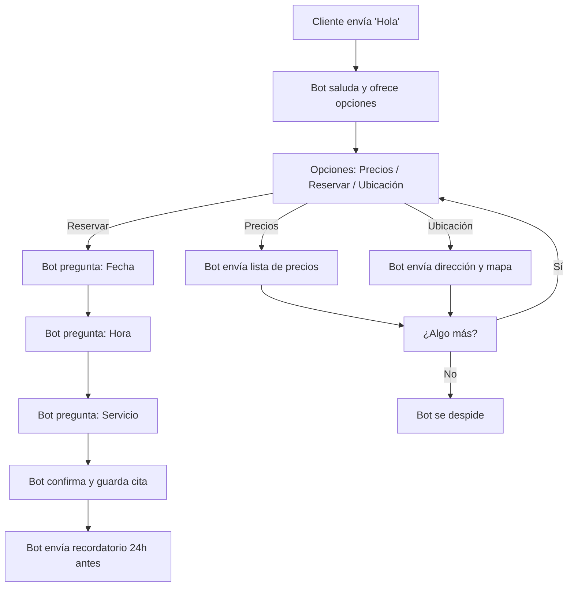

> **TL;DR:** Construye un chatbot de WhatsApp en minutos — sin código, sin complicaciones. Usa una cuenta verificada de WhatsApp Business y el constructor visual sin código de E-SMART360 para automatizar conversaciones, impulsar ventas y brindar soporte instantáneo. Estos chatbots logran una **tasa de apertura de mensajes del 98%** y un **aumento verificable del 156% en tasas de conversión** frente a los canales tradicionales. Así es como las marcas modernas convierten chats en ingresos.

<Update title="Actualización" date="Febrero 2026" />

Desde una consulta simple hasta la compra del producto deseado — para un cliente, todo ese proceso es todo un recorrido, ¿verdad?

Cuando esto ocurre físicamente en una tienda, piensa en todos los pasos: recibirlos, responder sus diversas preguntas, mostrarles diferentes productos que coincidan con sus preferencias y, finalmente, cerrar el trato. Sin embargo, replicar todos esos pasos de forma confiable en línea es un gran desafío, especialmente cuando manejas un alto volumen de clientes. Pero en esta era tecnológica, lograr ese mismo éxito es fácil — solo con mantenerte un poco actualizado.

¿Te preguntas cómo? La respuesta es: un **Chatbot** — ¡un simple Chatbot de WhatsApp!

> **Dato clave:** El 67% de los usuarios se sienten más seguros comprando en negocios a los que pueden contactar por WhatsApp, y las tasas de conversión en WhatsApp son típicamente **3 veces más altas** que las campañas de email.

---

## Chatbot de WhatsApp — ¿Qué es y por qué usarlo?

Un chatbot de WhatsApp es simplemente una tecnología para «chatear» automáticamente con los clientes. Aunque tú eres quien decide _qué, cuándo, por qué y cuánto_ dirá. En otras palabras, es una herramienta de automatización empresarial.

Por esta razón, gigantes corporativos como Nivea, Unilever y Flamingo han adoptado los chatbots de WhatsApp desde hace bastante tiempo. Los números lo demuestran: las tasas de conversión en WhatsApp son típicamente **3 veces más altas** que las campañas de email.

> **Beneficios clave de un chatbot de WhatsApp:**
- Atención al cliente 24/7 sin intervención manual
- Respuestas instantáneas a preguntas frecuentes
- Calificación y segmentación automática de leads
- Aumento de ventas mediante seguimientos automatizados
- Reducción de costos operativos en atención al cliente

---

## Construye tu Primer Chatbot de WhatsApp en Menos de 10 Minutos

Ahora entremos en materia — qué tan rápido puedes construir un chatbot incluso si no eres un experto en tecnología. Principalmente, necesitarás dos cosas:

1. **Una Cuenta de WhatsApp Business verificada (WABA)**
2. **Un Proveedor de Servicios Empresariales (BSP) sin código**

### Prepara tu cuenta de WhatsApp Business

Asumiendo que tu WABA verificada ya está configurada. Si no es así, puedes instalar WhatsApp Business fácilmente y verificarlo con tu número móvil. ¡No es ciencia espacial!

Antes de continuar, asegúrate de tener lo siguiente en orden:
- Una cuenta de Meta Business Suite con acceso de administrador
- WABA vinculada a tu cuenta de Meta Business Suite o Página de Perfil

Si necesitas ayuda para crear tu cuenta de Meta Business, consulta la guía sobre [cómo crear una cuenta de Facebook Business Manager](/recursos/facebook-business-manager).

### Conecta tu cuenta de WhatsApp con E-SMART360

Ahora, abre tu cuenta de E-SMART360 en el navegador y desde el menú de la barra lateral izquierda:

1. Selecciona **Conectar Cuenta → Conectar WhatsApp**
2. Verás dos opciones. Selecciona la opción marcada para **integración en un solo clic**

La segunda opción requiere más tiempo, así que mantenla como respaldo.

> La integración en un solo clic es la forma más rápida: te redirigirá a una página de inicio de sesión de Facebook. Usa la cuenta que tenga acceso de administrador a tu Meta Business Suite.

### Verifica la conexión

Sigue las instrucciones adicionales en pantalla y haz clic en **Guardar**.

Una vez verificado, E-SMART360 finalizará el enlace. Después de eso, revisa tu **Panel de Control de E-SMART360** para confirmar que tu cuenta de WhatsApp está vinculada. ¡Y entonces estarás listo para volar!

### Accede al Gestor de Bots

Ahora viene la parte interesante — diseñarás exactamente cómo el chatbot interactuará con tus clientes sin escribir una sola línea de código. Es hora de darle la bienvenida a tu **Gestor de Bots**.

Desde el **Panel de Control**:
1. Haz clic en el **Gestor de Chatbots** → Navega al menú **Bot de WhatsApp**
2. Haz clic en la sección **Respuesta del Bot** → **Crear**

Se abrirá un lienzo de construcción visual de flujo de bot, similar a un editor de arrastrar y soltar. La zona marcada muestra los diversos componentes que puedes usar para configurar la acción de tu chatbot.

### Crea tu primer flujo de bienvenida

Para ser honesto, una vez que te sientas cómodo con esta interfaz de **arrastrar y soltar**, ¡serás imparable! No hay nada que tu bot no pueda manejar, desde preguntas frecuentes y soporte al cliente hasta ejecutar una campaña de ventas completa.

Comencemos con un mensaje de bienvenida simple:

1. Arrastra un componente **Inicio** al lienzo
2. Conéctalo a un componente **Mensaje de Texto**
3. Escribe tu mensaje de bienvenida, por ejemplo: *"¡Hola! 👋 Bienvenido a [Tu Empresa]. Soy tu asistente virtual. ¿En qué puedo ayudarte hoy?"*
4. Guarda el flujo

> **¿Qué tipo de mensaje de bienvenida funciona mejor?** Los mensajes cortos, amigables y con un toque de personalidad (como emojis) suelen tener las tasas de respuesta más altas. Incluir opciones claras desde el principio ayuda a guiar al usuario.

### Prueba tu chatbot

Ahora, guarda el flujo y prueba el chatbot para ver si funciona correctamente.

1. Abre WhatsApp en tu teléfono
2. Envía un mensaje a tu número de WhatsApp Business
3. Observa la respuesta automática

¡Excelente! Está funcionando. Acabas de construir un chatbot de WhatsApp simple. Pero esto es solo el comienzo.

> ¡Felicidades! Has creado tu primer chatbot de WhatsApp en menos de 10 minutos y sin escribir código. Gradualmente dominarás muchas funciones más poderosas, como la gestión de flujos de entrada de usuarios, la configuración de mensajes en secuencia, la integración de tu catálogo y datos de Google Sheets. Esencialmente, podrás automatizar completamente tu **estrategia de marketing de WhatsApp**. ¡Y sí! Incluso entonces no necesitarás ningún conocimiento de programación.

---

## Configuración Avanzada: Chatbots Basados en Palabras Clave

Una vez que domines el flujo básico, puedes crear chatbots más inteligentes usando palabras clave como disparadores. Esta funcionalidad te permite responder automáticamente a mensajes específicos que contengan ciertas palabras.

### Accede al Gestor de Bots

Ve al menú **Gestor de Bots** en tu panel de E-SMART360. Selecciona la cuenta de bot que deseas configurar y haz clic en **Respuesta del Bot** para continuar.

### Crea un nuevo chatbot

Haz clic en el botón **Crear** en la configuración de Respuesta del Bot. Aparecerá el lienzo del **Constructor Visual de Flujo de Bot**.

### Nombra tu chatbot

Localiza el componente **Iniciar Flujo de Bot**. Haz doble clic para abrir el modal de **Configurar Referencia**. Ingresa un nombre en el campo Título. Opcionalmente, elige una etiqueta y selecciona una secuencia.

### Configura un disparador por palabra clave

En el modal **Configurar Referencia**, ingresa una palabra clave para activar el bot (por ejemplo, "Hola", "Hola", "Inicio").

- Si seleccionas **Coincidencia Exacta de Palabra Clave**, el bot solo se activará para esa palabra clave específica.
- Si seleccionas **Coincidencia de Cadena**, el bot se activará para cualquier cadena de palabras, frases u oraciones que contengan esa palabra clave.

> **Ejemplo de coincidencia de cadena:** Si la palabra clave es "Hola" y el usuario escribe "Hola, necesito ayuda", el bot se activará igualmente.

Guarda la configuración.

### Configura un mensaje de respuesta

Arrastra una conexión desde el conector de **Siguiente** del Iniciar Flujo de Bot. Suéltala en el lienzo para revelar diferentes opciones de componentes. Selecciona el **Componente Interactivo**.

Haz doble clic para abrir el modal **Configurar Mensaje de Texto**. Completa:
- **Encabezado del mensaje** (opcional)
- **Cuerpo del mensaje** (obligatorio)
- **Pie del mensaje** (opcional)

Establece un tiempo de retardo si es necesario y haz clic en **Aceptar**.

### Agrega botones interactivos

Arrastra un conector desde el conector de botón del **Componente Interactivo** hacia el lienzo. Aparecerá un **Componente de Botón en Línea**. Haz doble clic e ingresa un **Texto del Botón**. Selecciona una **Acción del Botón** para cuando se haga clic (por ejemplo, Enviar un Mensaje, Iniciar un Flujo, Acción por Defecto del Sistema, etc.).

Repite el proceso para agregar más botones.

### Guarda y prueba

Selecciona el **Componente de Texto** para el mensaje final. Haz doble clic, configura el mensaje y haz clic en **Aceptar** para guardar. Haz clic en el botón **Guardar** (esquina superior derecha del lienzo) para guardar toda la configuración del bot.

Abre WhatsApp, escribe la palabra clave que configuraste y envíala. Observa la respuesta del chatbot para confirmar que funciona correctamente.

> **Solución de problemas comunes:**
- **¿La palabra clave no activa respuestas?** Verifica que esté correctamente configurada en el Componente de Disparador.
- **¿Los botones no aparecen?** Asegúrate de que estén vinculados correctamente a un componente interactivo.
- **¿Sin mensaje final?** Revisa que el Componente de Texto esté agregado y guardado.
- **¿Los cambios no se guardan?** Siempre haz clic en el botón **Guardar** antes de salir del constructor visual de bots.

---

#---

## Mensajes de Secuencia: Automatización Avanzada de Embudos

Los mensajes de secuencia son una funcionalidad poderosa que permite enviar una serie de mensajes programados automáticamente, basados en las acciones del usuario o en intervalos de tiempo predefinidos. Esto es ideal para nutrir leads, realizar onboarding de clientes y ejecutar campañas de marketing automatizadas.

### ¿Qué es un Mensaje de Secuencia?

Un mensaje de secuencia es un conjunto de mensajes programados que se envían en un orden específico, con intervalos de tiempo definidos. Por ejemplo, cuando un nuevo cliente se suscribe, puede recibir:

- **Día 1:** Mensaje de bienvenida con un código de descuento
- **Día 3:** Consejos sobre cómo usar el producto
- **Día 7:** Testimonio de clientes satisfechos
- **Día 14:** Oferta especial por tiempo limitado

### Ideas para Mensajes de Secuencia

| Tipo de Secuencia | Ejemplo de Uso |
|---|---|
| **Onboarding** | Dar la bienvenida a nuevos suscriptores y guiarlos a través de las características |
| **Lead Nurturing** | Educar a los clientes potenciales con contenido relevante |
| **Carrito Abandonado** | Recordar a los usuarios sobre productos que dejaron en su carrito |
| **Post-Compra** | Enviar consejos de uso, seguimiento de envío y solicitar reseñas |
| **Re-engagement** | Reconectar con clientes inactivos |
| **Ventas Cruzadas** | Ofrecer productos complementarios basados en compras anteriores |

### Beneficios de Usar Mensajes de Secuencia

- **Mejora la Experiencia del Cliente:** Las respuestas automatizadas garantizan un compromiso instantáneo.
- **Aumenta la Eficiencia:** Reduce la carga de trabajo manual al automatizar tareas repetitivas.
- **Mejores Conversiones:** Nutre leads y mejora las tasas de conversión de ventas.
- **Mayor Compromiso:** Mantiene a los usuarios interesados con seguimientos oportunos.
- **Optimización Basada en Datos:** Realiza un seguimiento del rendimiento y refina las secuencias según los análisis.

### Cómo Configurar una Campaña de Mensajes en Secuencia

### Crea una nueva secuencia

Navega al **Constructor de Flujos** en el Gestor de Bots y selecciona **'Nueva Secuencia'**.

### Configura el nombre y la temporización

Establece el nombre de la secuencia y configura los intervalos de tiempo entre mensajes. Puedes definir retrasos específicos (minutos, horas o días) entre cada mensaje.

### Estructura tus mensajes

Cada mensaje puede incluir:
- **Texto:** Mensajes personalizados con variables dinámicas
- **Multimedia:** Imágenes, videos o documentos
- **Botones CTA:** Llamadas a la acción como "Comprar Ahora" o "Más Información"
- **Enlaces:** URLs de seguimiento

### Activa la secuencia

Finaliza la configuración y activa la secuencia. Las secuencias pueden activarse mediante:
- Interacciones del usuario (por ejemplo, hacer clic en un botón)
- Palabras clave específicas
- Condiciones predefinidas basadas en etiquetas o campos personalizados
- Programación por tiempo

### Monitorea el rendimiento

E-SMART360 proporciona análisis para rastrear el compromiso, las tasas de respuesta y la efectividad de la campaña. Revisa estas métricas regularmente para optimizar tus secuencias.

> **Mejores prácticas para secuencias:**
- Mantén los mensajes concisos y relevantes
- Personaliza las interacciones usando datos del usuario (nombre, historial de compras)
- Programa los mensajes estratégicamente para mantener el compromiso
- Usa plantillas de mensajes pre-aprobadas para secuencias de WhatsApp
- Analiza continuamente y refina las secuencias según los datos de rendimiento
- Para mensajes fuera de la ventana de 24 horas, se requieren plantillas pre-aprobadas por Meta

---

## Integración de Botones CTA en tu Chatbot

Los botones con llamada a la acción (CTA) son elementos interactivos que permiten a los usuarios realizar acciones específicas directamente desde el chat de WhatsApp. Estos botones son fundamentales para aumentar las conversiones.

### Tipos de Botones CTA Disponibles

### Botón de Llamada Telefónica

Permite al usuario llamar a un número específico con un solo toque. Ideal para:
- Contactar a soporte
- Hablar con ventas
- Agendar consultas

**Configuración:** Establece el texto del botón y el número telefónico de destino.

### Botón de Visitar Sitio Web

Redirige al usuario a una URL específica. Perfecto para:
- Enlazar a páginas de producto
- Dirigir a formularios de registro
- Promocionar contenido o descuentos

**Configuración:** Define el texto del botón y la URL de destino.

### Botón de Enviar Mensaje

Configura respuestas predefinidas cuando el usuario hace clic. Útil para:
- Confirmar acciones
- Activar flujos específicos
- Capturar intenciones de compra

**Configuración:** Selecciona la acción del botón como "Enviar un Mensaje" y define el contenido.

### Botón de Iniciar Flujo

Activa otro flujo de bot cuando se hace clic. Ideal para:
- Navegar entre secciones del chatbot
- Iniciar procesos complejos (pagos, reservas)
- Ofrecer opciones avanzadas

**Configuración:** Selecciona la acción "Iniciar un Flujo" y elige el flujo de destino.

### Cómo Agregar Botones CTA a tu Chatbot

### Agrega un componente interactivo

En el constructor visual de flujo, arrastra un **Componente Interactivo** al lienzo. Conéctalo desde un componente de inicio o mensaje.

### Configura el mensaje principal

Haz doble clic en el componente interactivo. Completa:
- **Encabezado:** Título atractivo
- **Cuerpo:** Descripción clara de la oferta o mensaje
- **Pie:** Información adicional (opcional)

### Agrega botones al componente

Arrastra un conector desde el conector de botón del Componente Interactivo. Se creará automáticamente un **Componente de Botón en Línea**. Haz doble clic para:
1. Ingresar el texto del botón (máximo 20 caracteres)
2. Seleccionar el tipo de acción (visitar web, llamar, enviar mensaje, etc.)
3. Configurar los parámetros según la acción elegida

### Agrega múltiples botones

Puedes agregar hasta **3 botones** por mensaje interactivo en WhatsApp. Repite el proceso para cada botón adicional.

### Configura las rutas de los botones

Conecta cada botón a su respectivo flujo de continuación. Por ejemplo:
- Botón "Ver Productos" → Flujo que muestra el catálogo
- Botón "Hablar con Ventas" → Flujo que deriva a un agente
- Botón "Más Información" → Flujo con detalles del producto

### Prueba la funcionalidad

Guarda el flujo y envía un mensaje a tu chatbot desde WhatsApp para verificar que los botones aparecen correctamente y redirigen a las acciones configuradas.

---

## Automatización de Seguimientos con Chatbots Inteligentes

Los chatbots de seguimiento automático te permiten mantener el compromiso con usuarios que han mostrado interés pero no han completado una acción deseada, como realizar una compra. Con seguimientos automatizados, puedes aumentar las conversiones sin intervención manual.

> **¿Qué es un chatbot de seguimiento?** Es un sistema automatizado que envía mensajes de recordatorio a usuarios que han interactuado con tu chatbot pero no han completado una acción. Ayuda a las empresas a mantenerse comprometidas con clientes potenciales y mejora las tasas de conversión.

### ¿Por qué usar un sistema de seguimiento automatizado?

- **Ahorra tiempo** automatizando recordatorios.
- **Aumenta las ventas y conversiones** al mantener tu oferta presente.
- **Asegura que los usuarios no olviden tu oferta.**
- **Funciona 24/7** sin esfuerzo manual.

### Cómo construir tu chatbot de seguimiento

### Crea el flujo del chatbot de seguimiento

Ve a tu Panel de E-SMART360 → **Gestor de Bots** → **Respuesta del Bot** → **Crear**. Nombra el chatbot de forma reconocible, como "Bot de Seguimiento".

### Configura mensajes interactivos

Agrega un bloque interactivo a tu chatbot. Crea un mensaje como: *"Oye, ¿te interesaría nuestro producto?"* con botones de **Sí** y **No**.

- Si el usuario selecciona **Sí**, proporciónale un enlace de pago.
- Si el usuario selecciona **No**, finaliza la conversación u ofrece asistencia adicional.

### Usa etiquetas para rastrear acciones

Cuando un usuario haga clic en "Comprar Ahora", aplica una etiqueta llamada **Comprar Ahora**. Si el usuario no hace clic en el botón, no recibe esta etiqueta. Usa esta etiqueta para determinar quién necesita un recordatorio de seguimiento.

### Configura la secuencia de seguimiento

Arrastra y suelta el conector desde la opción **Suscribirse a Secuencia** del botón "Comprar Ahora" para iniciar una nueva secuencia de seguimiento. Esto enviará un mensaje de recordatorio si el usuario no compra dentro de 30 minutos (o el tiempo que elijas).

Agrega una condición para hacer seguimiento basado en si seleccionaron el botón 'Comprar Ahora' o no. Si es **Falso**, envía el mensaje de seguimiento.

### Repite para múltiples seguimientos

Puedes repetir el proceso para enviar otro recordatorio si el usuario todavía no ha comprado. Programa tus recordatorios estratégicamente para evitar saturar a los usuarios.

> **Sobre los límites de tiempo en WhatsApp:**
- WhatsApp permite enviar mensajes de seguimiento ilimitados **dentro de las 24 horas**.
- Después de 24 horas, solo se pueden enviar mensajes de plantilla **pre-aprobados**.
- Programa tus recordatorios estratégicamente para maximizar el compromiso sin molestar a los usuarios.

Consulta la guía sobre la [regla de 24 horas de WhatsApp](/recursos/regla-24-horas-whatsapp) para más detalles.

---

## Impacto de los Chatbots de WhatsApp en el Mundo Real

El mundo empresarial del siglo XXI se mueve a una velocidad aterradora. Si un cliente dice "hola" y no recibe atención inmediata, ese cliente se pierde en un instante. Aquí es donde brilla la ventaja de la tecnología.

Los datos confirman que, aunque existen varias plataformas de comunicación, **WhatsApp es actualmente la más popular y la más efectiva**. Por eso las grandes industrias ya tratan a WhatsApp como su principal central de marketing. Y en la era de la automatización, la IA ha llevado esto a un nivel completamente nuevo.

### El Caso de Nivea: 207% del Objetivo Alcanzado

Nivea enfrentó un desafío familiar para toda gran marca: el **compromiso masivo orgánico** para un nuevo producto. La solución no fue otra campaña publicitaria; fue una inversión estratégica en automatización. Lanzaron la **Campaña Cocoa Shades**, anclada completamente por un **Chatbot de WhatsApp**.

El gancho era simple y poderoso. Los usuarios enviaban al bot una foto y al instante recibían una versión única y estilizada de sí mismos, perfectamente combinada con su tono de piel. Esto encendió inmediatamente la campaña y Nivea obtuvo la exposición deseada. Como resultado, un simple chatbot de WhatsApp logró un **asombroso 207% del objetivo de alcance**.

### El Caso de Unilever: 14 Veces Más Ventas

Unilever necesitaba **obtener una presencia de marca de alto impacto** para su nueva línea de productos. Optaron por la misma estrategia que Nivea y crearon **MadameBot**, su propio chatbot de WhatsApp.

Para despertar la curiosidad inicial, cubrieron São Paulo con 1000 carteles que mostraban el número de WhatsApp. Cuando los consumidores interesados contactaban, MadameBot tomaba el control. Ofrecía consejos personalizados de cuidado de productos e introducía los nuevos productos. Los clientes que progresaban en la interacción eran recompensados con descuentos y envío gratis. Muy pronto, este simple chatbot conversacional impulsó ventas **14 veces más altas**.

### Nivea

- **Campaña:** Cocoa Shades
- **Estrategia:** Los usuarios enviaban una foto y recibían una versión estilizada
- **Resultado:** 207% del objetivo de alcance
- **Lección:** La interacción creativa + automatización = exposición masiva

### Unilever

- **Campaña:** MadameBot
- **Estrategia:** Carteles físicos + chatbot con consejos personalizados y descuentos
- **Resultado:** 14x más ventas
- **Lección:** La personalización + incentivos = conversiones exponenciales

### Para Marketing y Ventas

- Califica leads automáticamente según las respuestas
- Envía ofertas personalizadas basadas en el comportamiento del usuario
- Realiza campañas de broadcast segmentadas
- Recupera carritos abandonados de e-commerce
- Programa recordatorios de eventos y promociones

### Para Soporte al Cliente

- Responde preguntas frecuentes al instante 24/7
- Deriva conversaciones complejas a agentes humanos cuando sea necesario
- Proporciona actualizaciones de estado de pedidos automáticas
- Gestiona reservas y citas directamente desde el chat
- Ofrece asistencia multilingüe sin intervención manual

---

## Configuración de Respuesta por Defecto y Frecuencia

Una parte importante de cualquier chatbot es manejar los mensajes que no coinciden con ninguna palabra clave o flujo configurado. E-SMART360 te permite configurar una **respuesta por defecto** para estos casos.

### Accede a la configuración de Respuesta por Defecto

Ve al **Gestor de Bots** → **Respuesta del Bot** → **Respuesta para No Coincidencia**. Aquí puedes definir qué sucede cuando un usuario envía un mensaje que no coincide con ningún disparador configurado.

### Configura la respuesta por defecto

Puedes elegir entre:
- **Enviar un mensaje genérico:** "Lo siento, no entendí tu mensaje. Por favor, escribe 'Ayuda' para ver las opciones disponibles."
- **Derivar a un agente humano:** Redirigir la conversación al panel de chat en vivo.
- **No hacer nada:** Ignorar el mensaje (no recomendado).

### Establece límites de frecuencia

Para evitar enviar demasiados mensajes a un usuario en un período corto, puedes configurar:
- **Tiempo mínimo entre respuestas:** Evita que el bot responda múltiples veces en pocos segundos.
- **Límite de mensajes por hora:** Controla cuántos mensajes automáticos puede recibir un usuario.
- **Período de enfriamiento:** Si un usuario ignora varios mensajes, el bot puede dejar de enviar seguimientos automáticos.

> **Importante:** Configurar correctamente la respuesta por defecto y los límites de frecuencia es crucial para mantener una buena **calificación de calidad** en WhatsApp. Las respuestas excesivas o irrelevantes pueden resultar en restricciones de tu cuenta.

---

## Integración con Otras Herramientas

Una de las ventajas más poderosas de E-SMART360 es la capacidad de integrar tu chatbot con otras herramientas que ya utilizas.

### Google Sheets

Puedes conectar tu chatbot con Google Sheets para:
- Almacenar respuestas de clientes automáticamente
- Sincronizar datos de clientes entre plataformas
- Enviar mensajes personalizados usando datos de hojas de cálculo
- Crear informes automáticos de interacciones

Consulta la guía de [integración con Google Sheets](/recursos/integracion-google-sheets-whatsapp).

### Zapier

Conecta E-SMART360 con más de 2000 aplicaciones mediante Zapier:
- Automatiza flujos de trabajo completos
- Envía datos de chatbot a CRM, email marketing, etc.
- Crea leads en tu sistema desde conversaciones de WhatsApp
- Dispara campañas de email basadas en interacciones

Más información en [cómo conectar Zapier](/recursos/conectar-zapier-whatsapp).

---

## Consejos Avanzados para tu Chatbot

### ¿Cómo usar Google Sheets para personalizar respuestas?

Puedes usar datos de Google Sheets para personalizar las respuestas de tu chatbot. Por ejemplo:
1. Conecta tu hoja de cálculo con la información de tus clientes
2. Configura el chatbot para buscar datos específicos usando el nombre o ID del cliente
3. El bot responderá con información personalizada: "Hola [Nombre], tu pedido #[ID] está en camino"

Esto transforma respuestas genéricas en interacciones altamente personalizadas.

### ¿Cómo recolectar datos de usuarios sin formularios?

E-SMART360 permite recolectar información de clientes directamente desde la conversación:
- Usa preguntas secuenciales para obtener nombre, email, teléfono
- Almacena las respuestas en campos personalizados
- Crea perfiles de clientes enriquecidos sin que ellos llenen un solo formulario
- Ideal para generación de leads en campañas de marketing

### ¿Qué son los mensajes de plantilla y cuándo usarlos?

Los mensajes de plantilla son mensajes pre-aprobados por Meta que puedes enviar fuera de la ventana de 24 horas. Se usan para:
- Notificaciones de pedidos y envíos
- Recordatorios de citas
- Mensajes de marketing promocional
- Alertas de servicio

Cada plantilla debe ser revisada y aprobada por Meta antes de su uso. Sigue las [guías de creación de plantillas](/recursos/plantillas-mensajes-whatsapp).

### ¿Cómo manejar conversaciones complejas con flujos de entrada?

Para manejar conversaciones que requieren múltiples pasos:
1. Usa el **Componente de Entrada de Usuario** para capturar respuestas
2. Configura **condiciones** para dirigir el flujo según las respuestas
3. Combina con **listas dinámicas** para ofrecer opciones estructuradas
4. Implementa **flujos de WhatsApp** para formularios nativos dentro del chat

Esto permite crear experiencias como: "Selecciona tu producto → Elige talla → Ingresa dirección → Confirma pago"

### ¿Puedo integrar mi catálogo de productos?

Sí, E-SMART360 permite integrar tu catálogo de productos directamente en el chatbot:
- Muestra productos con imágenes, precios y descripciones
- Permite a los clientes navegar y seleccionar productos desde el chat
- Enlaza directamente al proceso de pago
- Ideal para tiendas WooCommerce, Shopify y otras plataformas

Configura tu [catálogo de WhatsApp](/recursos/catalogo-whatsapp-integracion) para empezar a vender por chat.

---

## Preguntas Frecuentes

### ¿Qué necesito para construir un chatbot de WhatsApp?

Necesitas una cuenta de WhatsApp Business verificada, una cuenta de Meta Business Manager con acceso de administrador y una cuenta en E-SMART360. No se requieren conocimientos de programación.

### ¿Cuánto tiempo toma configurar un chatbot de WhatsApp?

Normalmente toma entre 10 y 15 minutos configurar un chatbot de WhatsApp básico. Los flujos más complejos con múltiples ramificaciones pueden tomar más tiempo, pero todo se hace visualmente sin código.

### ¿El chatbot de E-SMART360 es gratuito?

E-SMART360 ofrece un modelo freemium que incluye registro gratuito y periodo de prueba, junto con varios planes de pago según tu uso y necesidades. Puedes empezar sin costo y escalar cuando lo necesites.

### ¿El chatbot puede enviar mensajes masivos a todos mis clientes?

Sí, el chatbot puede enviar mensajes masivos a todos tus clientes usando la función de Broadcasting de WhatsApp. Sin embargo, debes cumplir con las políticas de mensajería de Meta, incluyendo la regla de 24 horas y los límites de broadcasting. Consulta la [guía de broadcasting](/recursos/broadcasting-whatsapp) para más detalles.

### ¿Puedo integrar mi catálogo de productos o Google Sheets con el chatbot?

Sí, los chatbots modernos como E-SMART360 permiten la integración de catálogos de productos y Google Sheets. Necesitarás aprender a configurarlo, pero no se requieren conocimientos de programación. La plataforma ofrece conectores visuales para ambas integraciones.

### ¿Es WhatsApp mejor que Messenger o Email para automatización?

Sí, WhatsApp cuenta con una tasa de conversión 3 veces mayor que el email y Messenger para automatización. Por eso la adopción de chatbots de WhatsApp está creciendo rápidamente. Además, la tasa de apertura del 98% en WhatsApp supera ampliamente al email (promedio del 20-25%).

### ¿Qué sucede si mi plantilla de mensaje es rechazada?

Si tu plantilla es rechazada por Meta, recibirás una notificación con el motivo del rechazo. Las razones más comunes incluyen: formato incorrecto, contenido engañoso, falta de claridad en el propósito, o incumplimiento de las políticas de Meta. Revisa la [guía de razones de rechazo](/recursos/razones-rechazo-plantillas-whatsapp) para entender cómo corregirlo y volver a enviarla.

---

## Conclusión

En ventas y marketing, un Chatbot de WhatsApp no es solo una puerta de entrada — es la apertura colosal que automatiza el mero potencial empresarial en ganancias tangibles. Una vez que cruces ese umbral, te sorprenderá la escala de posibilidades que este chatbot desbloquea.

Como dice el refrán: **"De grandes bellotas crecen grandes robles."** Este chatbot tiene exactamente ese poder. Puede **transformar fundamentalmente la trayectoria de tu negocio**. Los principales actores ya lo están demostrando. Por lo tanto, dudar en adoptar esta tecnología de nueva generación simplemente significa elegir dejar atrás una ventaja competitiva masiva. Pero si estás listo para avanzar, **E-SMART360 está absolutamente listo para ser tu socio**.

> **Próximos pasos recomendados:**
1. [Guía completa de Broadcasting en WhatsApp](/recursos/broadcasting-whatsapp) — Envía mensajes masivos usando Google Sheets
2. [La regla de 24 horas](/recursos/regla-24-horas-whatsapp) — Cómo cumplir efectivamente para mensajería de WhatsApp y Facebook
3. [Anuncios de WhatsApp](/recursos/anuncios-click-to-whatsapp) — Haz que cada clic cuente
4. [Chatbots de secuencia de ventas](/recursos/chatbot-secuencia-ventas) — Automatiza todo tu embudo de ventas

### 📊 Ejemplo práctico: Tienda de e-commerce

**Problema:** Una tienda online recibe 200 consultas diarias sobre horarios, disponibilidad y envíos.

**Solución con chatbot:**
1. Configura un chatbot con palabras clave como "horario", "envío", "disponible"
2. El bot responde al instante con la información solicitada
3. Si el cliente quiere comprar, el bot muestra productos del catálogo
4. Si la consulta es compleja, deriva a un agente humano

**Resultado:** 80% de las consultas resueltas automáticamente. El equipo humano solo maneja el 20% más complejo. Tiempo de respuesta promedio: 3 segundos.

### 🏪 Ejemplo práctico: Restaurante

**Problema:** Un restaurante recibe llamadas constantes para reservas y consultas del menú.

**Solución con chatbot:**
1. Cliente escribe "Quiero reservar" en WhatsApp
2. El chatbot pregunta fecha, hora y número de personas
3. Usa un flujo de entrada para capturar los datos
4. Confirma la reserva y envía un recordatorio automático 2 horas antes
5. Si el cliente escribe "menú", el bot envía el menú del día con imágenes

**Resultado:** Sin llamadas perdidas. Las reservas aumentan un 35%. Los clientes reciben confirmación instantánea 24/7.

## Consideraciones de Calidad y Límites de Mensajería

Para garantizar que tu chatbot funcione de manera óptima y cumpla con las políticas de Meta, es importante entender los conceptos de calidad y límites de mensajería.

### Calificación de Calidad de WhatsApp

WhatsApp asigna una calificación de calidad a cada número de teléfono empresarial, que puede ser:

- **Verde (Alta):** El número cumple con todas las políticas y tiene bajas tasas de bloqueo
- **Amarilla (Media):** Se han detectado problemas potenciales; se recomienda revisar las prácticas
- **Roja (Baja):** El número tiene altas tasas de bloqueo o quejas; puede enfrentar restricciones

> **Consejos para mantener una buena calificación:**
- Envía mensajes relevantes y esperados por el usuario
- Respeta los límites de frecuencia y no satures a los contactos
- Maneja adecuadamente las respuestas "No coincidencia"
- Revisa regularmente los reportes de calidad en tu panel
- Evita enviar mensajes promocionales a usuarios que no han optado por recibirlos

### Niveles de Mensajería

WhatsApp establece límites de mensajería según el nivel de tu cuenta:

| Nivel | Límite de Contactos | Límite Diario |
|---|---|---|
| **Nivel 1** | Hasta 1K | 1,000 mensajes |
| **Nivel 2** | Hasta 10K | 10,000 mensajes |
| **Nivel 3** | Hasta 100K | 100,000 mensajes |
| **Nivel 4** | Ilimitado | Según aprobación |

Para aumentar tu nivel, necesitas mantener una alta calificación de calidad y aumentar el volumen de conversaciones exitosas.

> Consulta la guía completa sobre [niveles de mensajería de WhatsApp](/recursos/niveles-mensajeria-whatsapp) para entender cómo hacer crecer tu cuenta.

### Tipos de Conversaciones

En WhatsApp Cloud API, existen tres tipos de conversaciones:

1. **Conversaciones Iniciadas por el Usuario:** El cliente envía el primer mensaje. Tienes 24 horas para responder sin costo adicional.
2. **Conversaciones Iniciadas por la Empresa:** Tu negocio envía el primer mensaje usando una plantilla aprobada.
3. **Conversaciones de Servicio:** Relacionadas con el servicio al cliente, facturación o seguimiento de pedidos.

Cada tipo tiene diferentes costos y reglas. Es importante conocer estas diferencias para optimizar tu presupuesto de mensajería.

---

## Ejemplo de Flujo Completo: Chatbot para Reserva de Citas

Veamos un ejemplo completo de cómo configurar un chatbot para reservar citas en una peluquería:

### 📱 Mensajes que envía el bot

**Saludo inicial:**
"¡Hola! Bienvenido a Peluquería Estilo. Soy tu asistente virtual. ¿En qué puedo ayudarte?
1️⃣ Ver precios
2️⃣ Reservar cita
3️⃣ Conocer ubicación"

**Confirmación de cita:**
"¡Perfecto! Tu cita ha sido reservada:
📅 Fecha: 15 de mayo
⏰ Hora: 4:00 PM
💇 Servicio: Corte y peinado
💰 Total: $35

Te enviaremos un recordatorio 24 horas antes. ¡Gracias por elegirnos!"

### ⚙️ Configuración técnica

**Componentes usados:**
1. Iniciar Flujo (disparador: "Hola")
2. Componente Interactivo (mensaje con botones)
3. Componente de Entrada de Usuario (capturar fecha)
4. Componente de Entrada de Usuario (capturar hora)
5. Componente de Texto (confirmación)
6. Secuencia programada (recordatorio 24h)
7. Componente de Texto (despedida)

**Condiciones:**
- Si el usuario elige "Precios" → mostrar lista
- Si el usuario elige "Reservar" → iniciar flujo de captura
- Si el usuario elige "Ubicación" → enviar dirección

---

## Exportación y Respaldo de Flujos de Chatbot

Una funcionalidad importante que ofrece E-SMART360 es la capacidad de exportar tus flujos de chatbot. Esto te permite:

- **Hacer respaldo** de tus configuraciones
- **Compartir flujos** con otros miembros del equipo
- **Reutilizar flujos** en diferentes cuentas o proyectos
- **Documentar** la estructura de tu chatbot

### Cómo Exportar tu Flujo

### Abre el flujo que deseas exportar

Ve al **Gestor de Bots** → **Respuesta del Bot** → selecciona el bot que deseas exportar.

### Busca la opción de exportación

En la esquina superior derecha del lienzo del constructor visual, encontrarás un botón o menú con opciones de exportación.

### Descarga el archivo

Haz clic en **Exportar** y el sistema descargará un archivo con la configuración completa de tu flujo.

### Importa cuando sea necesario

Para restaurar o replicar un flujo, usa la opción **Importar** en el mismo menú y selecciona el archivo exportado.

---

## Preguntas Frecuentes Adicionales

### ¿Puedo tener múltiples chatbots para diferentes propósitos?

Sí, E-SMART360 permite crear múltiples chatbots para diferentes casos de uso. Puedes tener un bot para ventas, otro para soporte y otro para reservas, todos funcionando desde la misma cuenta de WhatsApp. Cada bot puede tener sus propias palabras clave, flujos y configuraciones.

### ¿Cómo manejo el horario no laboral en mi chatbot?

Puedes configurar mensajes específicos para fuera del horario laboral. Cuando un cliente escribe fuera de tu horario configurado, el chatbot puede responder automáticamente con un mensaje como: "Gracias por contactarnos. Nuestro horario es de lunes a viernes de 9:00 a 18:00. Te responderemos en cuanto estemos disponibles." También puedes usar plantillas específicas para reanudar conversaciones después del horario no laboral.

### ¿Puedo integrar pagos en mi chatbot de WhatsApp?

Sí, E-SMART360 admite más de 20 métodos de pago, incluyendo PayPal, Stripe y pagos nativos de WhatsApp. Puedes configurar flujos de pago directamente dentro del chatbot, permitiendo a los clientes completar transacciones sin salir de WhatsApp. Para pagos, asegúrate de configurar correctamente la pasarela de pago en el panel de integraciones.

### ¿Qué es el límite de broadcasting y cómo funciona?

El límite de broadcasting se refiere a la cantidad de mensajes que puedes enviar en una campaña masiva. Este límite está determinado por tu nivel de mensajería. E-SMART360 respeta los límites de WhatsApp y proporciona herramientas para gestionar tus campañas de broadcasting de manera eficiente. Puedes consultar la [guía de límites de broadcasting](/recursos/limites-broadcasting-whatsapp) para más detalles.

### ¿Mi chatbot puede hablar otros idiomas?

Sí, puedes configurar chatbots en cualquier idioma. El contenido del chatbot depende de ti: defines los mensajes, palabras clave y flujos en el idioma que prefieras. Incluso puedes crear chatbots multilingües detectando el idioma del usuario o preguntándole qué idioma prefiere al inicio de la conversación.

### ¿Qué sucede si alcanzo el límite de mensajes de mi plan?

E-SMART360 te notificará cuando te acerques a los límites de tu plan. Puedes actualizar tu plan en cualquier momento o adquirir complementos (addons) para aumentar tu capacidad. También ofrecemos un modelo de pago por uso (Pay As You Go) para mayor flexibilidad.

---

¿Qué estás pensando? **¿No vale la pena intentar un avance ahora?** Y recuerda, siempre puedes elegir comenzar el viaje aquí mismo, **con E-SMART360**.
