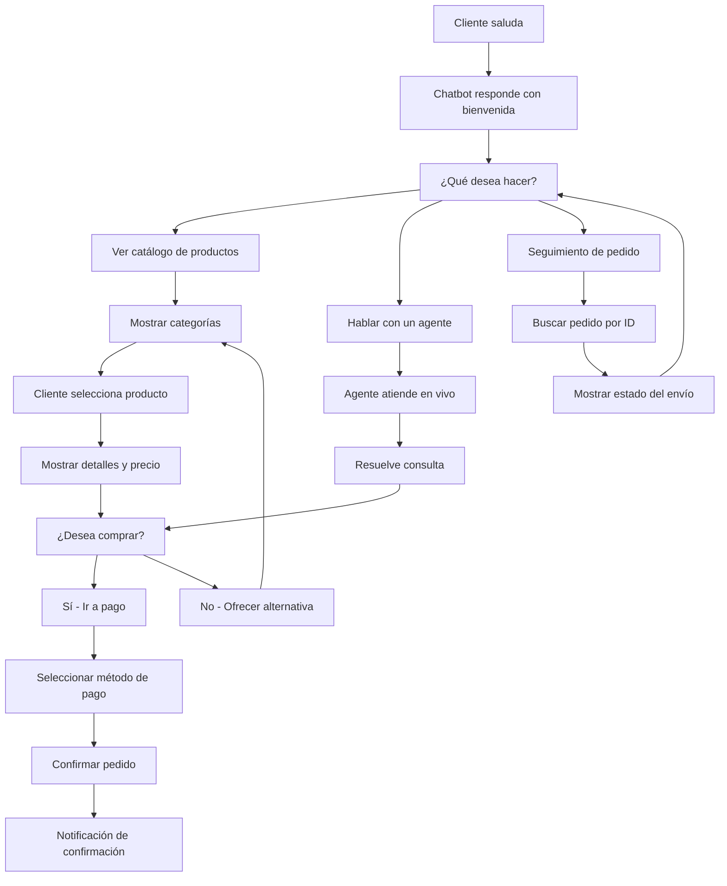

# Aumenta tus Ventas con el Catálogo de WhatsApp para E-commerce


> **De los estantes de la tienda a las pantallas de WhatsApp: tu puerta de entrada al comercio moderno.** Convierte cada conversación en una oportunidad de venta utilizando el Catálogo de productos de WhatsApp integrado con E-SMART360.

La enorme popularidad de WhatsApp permite a las empresas conectarse directamente con sus clientes y maximizar la experiencia de usuario. Más de 2 mil millones de usuarios activos mensuales convierten a WhatsApp en el canal ideal para el comercio conversacional. Ahí es donde entra el **Catálogo de WhatsApp de E-SMART360** — una funcionalidad innovadora que llevará tu negocio a nuevas alturas.

E-SMART360 ofrece un Catálogo de WhatsApp que permite a las empresas presentar sus productos y servicios de forma estéticamente atractiva y organizada. Las empresas pueden mostrar sus productos en el Catálogo de WhatsApp con descripciones detalladas e imágenes de alta calidad, creando una experiencia de compra más envolvente para los clientes. Esto no solo diferencia a las empresas de sus competidores, sino que también aumenta las ventas y la satisfacción del cliente.

Veamos cómo puedes modificar tu colección de WhatsApp y qué alternativas tienes para presentar tus productos.

## ¿Qué es el Catálogo de WhatsApp?

El Catálogo de WhatsApp es una herramienta que permite a las empresas mostrar sus productos directamente dentro de un chat de WhatsApp. En lugar de enviar descripciones largas en texto, puedes exhibir tus artículos con imágenes, nombres y detalles, facilitando que los clientes elijan lo que desean comprar.

**Características principales del Catálogo de WhatsApp:**

- Visualización optimizada de productos dentro del chat
- Navegación sencilla por categorías y variantes
- Integración directa con pasarelas de pago
- Compartible al instante con cualquier cliente
- Sincronización automática con plataformas de e-commerce

## Personaliza el Precio y las Variaciones de Producto Según tus Preferencias


### Agrega tus productos de dos formas

Puedes añadir tus productos de dos maneras: la primera es **subiendo manualmente** tus fotos de producto de alta calidad o mediante **data feed** (recomendado si gestionas tu inventario en Excel o Google Sheets). La segunda es **conectándote a una plataforma asociada**, como Shopify o BigCommerce, para subir productos automáticamente a tu sitio web, o simplemente seleccionando tu píxel de Facebook para añadir artículos automáticamente.

### Configura precios y estado

Ofrece el precio real o un precio de oferta si es necesario. También puedes indicar la condición del producto (nuevo, reacondicionado o usado), su disponibilidad, nombre de marca y estado del producto (activo o inactivo). Todos estos campos ayudan a generar confianza en el comprador antes de realizar la compra.

### Publica tu producto

Una vez completados todos los campos, envía tu producto. ¿No es todo lo que necesitas para una tienda totalmente funcional? Puedes repetir este proceso tantas veces como necesites para construir tu inventario completo.

### Detalles adicionales sobre la gestión de productos

Cuando agregas productos a tu catálogo, tienes control total sobre los siguientes campos:

- **Nombre del producto**: máximo 100 caracteres, debe ser descriptivo
- **Descripción**: hasta 500 caracteres, ideal para destacar beneficios clave
- **Precio**: puedes establecer precio regular y precio de oferta
- **Enlace del producto**: URL directa a la página del producto
- **Código**: SKU o código interno para identificar el producto
- **Marca**: nombre de la marca fabricante
- **Condición**: nuevo, usado o reacondicionado
- **Disponibilidad**: en stock, agotado, próximo lanzamiento
- **Imágenes**: hasta 10 imágenes por producto en alta resolución


> Para maximizar el impacto visual, utiliza imágenes de producto con fondo blanco o neutro, en formato JPEG o PNG, con un tamaño mínimo recomendado de 500x500 píxeles. Las imágenes de calidad aumentan la tasa de clics y conversión.

## Integración Completa: Conecta tu Catálogo con E-SMART360

Para empezar a vender a través del Catálogo de WhatsApp, debes crearlo en Meta Business Manager y luego sincronizarlo con E-SMART360. Sigue estos pasos detalladamente:

### Creación del Catálogo en Meta Business Manager


### Accede a Commerce Manager

Ve a [business.facebook.com](https://business.facebook.com/) y selecciona **Commerce** en el menú de Herramientas. Haz clic en tu cuenta de negocio en la esquina superior derecha y presiona **Comenzar**. Si no tienes una cuenta de negocio de Meta, deberás crearla primero.

### Configura tu tienda

Elige **Ecommerce**, decide si tu negocio es online o local, y continúa con el proceso de configuración. Para negocios online, selecciona las regiones donde realizas envíos.

### Agrega productos

Añade tus productos manualmente o conéctate con plataformas como Shopify para una sincronización automática. Una vez creado el catálogo, visualízalo y agrega artículos con imágenes, nombres y descripciones detalladas. Puedes añadir productos de forma individual o en lotes mediante archivos CSV.

### Conecta con WhatsApp

Vincula tu catálogo a WhatsApp a través de **WhatsApp Manager**. Selecciona **Catálogo** y haz clic en **Conectar**. Una vez conectado, el catálogo estará listo para usarse con E-SMART360. Este proceso es único y no requiere repetirse a menos que crees un catálogo nuevo.

### Sincronización en E-SMART360


### Conecta tu cuenta de WhatsApp

Dentro de E-SMART360, ve a la sección de WhatsApp y haz clic en **Conectar cuenta**. Presiona el botón **Sincronizar** para enlazar tu número de WhatsApp. Asegúrate de que tu número esté verificado y activo en WhatsApp Business API.

### Accede al Catálogo

Ve al menú de **Catálogo de E-commerce** para encontrar tu catálogo ya sincronizado y listo para usar. Desde aquí puedes gestionar todos los productos, actualizar precios y monitorear el rendimiento de cada artículo.

### Video Tutorial

Si prefieres una guía visual, mira el tutorial completo:  
[Cómo configurar un Catálogo de Productos en WhatsApp usando E-SMART360](https://youtu.be/HfLgsIf0bv8?si=U0HttCPGWkSPCh0Y)

## Agrega Pasarelas de Pago


> Puedes añadir múltiples opciones de pago para tus compradores, como PayPal, Stripe, YooMoney, Razorpay, Paystack y muchas más. Introduce el tipo de moneda y las APIs de pago correspondientes.

### Opciones de pago disponibles

E-SMART360 es compatible con más de 20 métodos de pago a nivel global. Aquí están los más utilizados:

| Método de Pago | Región | Ideal para |
|---|---|---|
| **PayPal** | Global | Clientes internacionales que prefieren pagar con saldo PayPal |
| **Stripe** | Global | Compatible con múltiples monedas y tarjetas de crédito |
| **Razorpay** | India, Asia | Mercados emergentes con alta adopción digital |
| **Paystack** | África | Pagos locales en moneda africana |
| **YooMoney** | CEI, Europa del Este | Usuarios de Rusia y países vecinos |
| **WhatsApp Pay** | India, Brasil | Pago nativo dentro de la conversación de WhatsApp |
| **Mercado Pago** | Latinoamérica | Clientes en Argentina, Brasil, México, Colombia y Chile |

También existen opciones de carrito donde puedes agregar impuestos o cargos de envío si aplican a tu producto o tipo de empresa. Es increíble que cualquier usuario pueda entrar, comprar algo y finalizar la compra con tanta facilidad.

### Configuración de impuestos y gastos de envío

Cuando configures tu método de pago, puedes definir:

- **Impuestos**: Porcentaje fijo o variable según el producto o la ubicación del cliente
- **Gastos de envío**: Tarifa plana, envío gratuito o cálculo basado en el peso/destino
- **Descuentos**: Códigos promocionales que se aplican automáticamente en el carrito
- **Múltiples monedas**: Configura diferentes monedas según la región del cliente


> **Nueva función: Pagos con criptomonedas (2025-06-15)**
> E-SMART360 ahora soporta integración con pasarelas de criptomonedas como Coinbase Commerce y BitPay, permitiendo a tus clientes pagar con Bitcoin, Ethereum y USDT directamente desde el chat de WhatsApp.

### Cómo agregar un método de pago en Meta Business Manager


### Accede a la configuración de Meta Business

Abre la página de [Configuración de Meta Business](https://business.facebook.com/settings/). Selecciona la cuenta de negocio que configuraste para las APIs de WhatsApp Cloud. Si tienes varias cuentas, asegúrate de elegir la correcta.

### Navega a Cuentas de WhatsApp

Desde la barra lateral izquierda, ve a **Cuentas > Cuentas de WhatsApp**. Esta sección lista todas las cuentas de WhatsApp asociadas a tu negocio. Selecciona tu cuenta de WhatsApp de la lista para acceder a su configuración.

### Abre la configuración de pago

Haz clic en la pestaña **Configuración** y luego en el botón **Configuración de pago**. Este botón te redirigirá a la página de pagos de Meta, donde podrás gestionar toda la facturación de la API de WhatsApp.

### Agrega el método de pago

En la página de Configuración de pago, haz clic en **Agregar método de pago**. Selecciona tu país, moneda preferida y el método de pago (tarjeta de crédito, débito o PayPal). Ingresa los detalles de tu tarjeta y haz clic en **Guardar**. Verás una pantalla de confirmación cuando el método se haya añadido exitosamente.

### Completa la información comercial faltante

Después de agregar tu método de pago, es posible que WhatsApp te solicite información comercial adicional. Si ves un banner o alerta en la parte superior de la página solicitando información faltante, haz clic en él. Proporciona tu **Nombre legal de la empresa**, **Dirección**, **Teléfono** y **Sitio web**, y haz clic en **Guardar** para completar el proceso.


> La API de WhatsApp es de pago, y Meta cobra una tarifa por conversación. Asegúrate de tener un método de pago configurado para evitar interrupciones en el servicio. Sin un método de pago válido, tus mensajes no se entregarán y podrías perder oportunidades de venta.

## Ofrece Atención al Cliente 24/7 con Chat en Vivo

La disponibilidad de chat en vivo de E-SMART360 lo diferencia de otras plataformas de comercio electrónico. Su función de chat en vivo permite que los clientes hagan preguntas y reciban soporte rápido las 24 horas del día, los 7 días de la semana.

Este servicio al cliente personalizado y conveniente mejora su experiencia de compra y aumenta su confianza en el negocio. Además, las empresas pueden usar la funcionalidad de chatbot para automatizar respuestas y ofrecer soluciones rápidas a preguntas frecuentes, ahorrando tiempo tanto a los clientes como a la empresa.


### Atención en Vivo 24/7

Los agentes de soporte pueden atender consultas complejas en tiempo real, resolviendo dudas sobre productos, envíos y devoluciones al instante. El chat en vivo permite usar respuestas rápidas predefinidas, transferir conversaciones entre agentes y ver el historial completo del cliente. Todo esto aumenta la tasa de conversión significativamente.

### Chatbot Automatizado

Para preguntas repetitivas, el chatbot responde automáticamente con información de productos, horarios y políticas. Puedes configurar respuestas basadas en palabras clave, menús interactivos con botones y flujos de conversación secuenciales. Esto libera a tu equipo para tareas más estratégicas como seguimiento de leads y cierre de ventas.

### Configuración del chatbot para ventas

Para maximizar el potencial de tu catálogo, configura un chatbot de ventas con los siguientes elementos:

1. **Mensaje de bienvenida**: Saluda al cliente y preséntale las opciones principales (ver catálogo, hablar con agente, rastrear pedido)
2. **Navegación por categorías**: Muestra botones con las categorías de tu tienda para que el cliente explore productos
3. **Recomendaciones inteligentes**: Usa reglas condicionales para sugerir productos complementarios
4. **Proceso de compra guiado**: Conduce al cliente desde la selección hasta el pago paso a paso
5. **Seguimiento post-venta**: Pregunta por la satisfacción y ofrece soporte adicional

## Usando los Catálogos de WhatsApp para Reactivar Ventas y el Compromiso del Cliente en el E-commerce


> **El poder de los datos:** Según estudios del sector, WhatsApp Business ha mostrado un aumento del 35% respecto al año anterior. Para 2022, la aplicación había sido descargada por aproximadamente 283.5 millones de personas en todo el mundo, reflejando una tendencia imparable hacia el comercio conversacional.

El negocio del comercio electrónico ha experimentado un cambio enorme en el panorama digital actual, y gran parte de este crecimiento se debe a la incorporación de nuevas tecnologías como los Catálogos de WhatsApp. Estas innovaciones no solo han aumentado los ingresos, sino que también han provocado un cambio sustancial en el compromiso del cliente y las tasas de conversión.

Según investigaciones del sector, las regiones de Asia-Pacífico y América Latina representan la mayor cuota de ingresos de WhatsApp Business. Esto demuestra que el comercio conversacional está transformando la forma de vender en mercados emergentes y desarrollados por igual.

### Estadísticas clave que respaldan esta transformación

- **35% de crecimiento interanual** en descargas de WhatsApp Business desde su lanzamiento en 2018
- **83% de los clientes** están dispuestos a interactuar con catálogos de productos
- **75% de esos clientes** proceden a realizar una compra, convirtiéndose en leads calientes
- **1.2 mil millones de dólares** en ingresos generados por WhatsApp Business a nivel mundial en 2021
- **0.24 dólares** de ingreso promedio por usuario (ARPU) a nivel mundial
- **60% de los usuarios** afirman que han contactado a una empresa por WhatsApp para realizar una compra
- **4 de cada 5 clientes** prefieren recibir atención al cliente por mensajería instantánea


> El 75% de los consumidores prefieren comprar después de haber visto catálogos en WhatsApp. Integrar tu catálogo no es solo una opción, es una necesidad competitiva en el mercado actual. Los negocios que ya lo han implementado reportan un incremento promedio del 30% en sus tasas de conversión.

### El impacto en la experiencia del cliente

La integración del catálogo directamente en WhatsApp transforma la experiencia de compra de varias formas:

- **Reducción de fricción**: El cliente no necesita salir de WhatsApp para ver productos, preguntar detalles y comprar
- **Contexto visual**: Las imágenes de producto dentro del chat mantienen el interés del comprador
- **Personalización**: Cada recomendación puede adaptarse al perfil y preferencias del usuario
- **Inmediatez**: Las respuestas automáticas eliminan los tiempos de espera
- **Confianza**: Ver productos con imágenes reales y descripciones detalladas genera seguridad en la compra

Finalmente, la integración de los Catálogos de WhatsApp en las empresas de comercio electrónico no solo ha señalado una transición, sino que ha establecido un nuevo estándar en la industria. Las estadísticas muestran que las empresas que utilizan esta tecnología se benefician de mayores ingresos, mejor compromiso del cliente, tasas de conversión más altas y una mayor satisfacción del cliente.

## Beneficios de Vender con el Catálogo de WhatsApp


### Compromiso sin Esfuerzo

Automatiza respuestas instantáneas a las consultas de los clientes. Cada interacción se convierte en una oportunidad de venta sin necesidad de intervención manual constante. El chatbot puede manejar cientos de conversaciones simultáneas.

### Recomendaciones Personalizadas

Sugiere productos basados en las preferencias del usuario. El chatbot puede analizar el historial de compras y navegación para ofrecer los artículos más relevantes para cada cliente, aumentando el valor del carrito promedio.

### Disponibilidad 24/7

El chatbot está siempre listo para ayudar. Tus clientes pueden comprar a cualquier hora del día, sin importar horarios laborales ni fines de semana. Esto es especialmente valioso para negocios con clientes en diferentes husos horarios.

### Mayores Conversiones

Las conversaciones optimizadas llevan a más ventas. Un cliente que recibe atención inmediata y personalizada tiene muchas más probabilidades de completar la compra. Los negocios reportan incrementos de hasta un 40% en tasa de conversión.

### Escalabilidad Total

Maneja múltiples clientes simultáneamente. Tu equipo de ventas nunca estará limitado por la cantidad de conversaciones que puede atender al mismo tiempo. El chatbot escala automáticamente sin costos adicionales de personal.

### Experiencia de Compra Unificada

Todo en un solo lugar: catálogo, pago, atención y seguimiento. El cliente nunca necesita salir de WhatsApp para completar su compra. Esta fluidez reduce el abandono de carrito drásticamente.

## Automatizando Conversaciones de Ventas

Una vez que tu chatbot esté activo, automáticamente manejará las consultas de los clientes, sugerirá productos y los guiará a través del proceso de compra. Puedes guardar tu flujo de chatbot y activarlo en el **Constructor de Flujos** para comenzar a interactuar con los clientes de inmediato.


> **Importante:** Revisa y actualiza periódicamente tu chatbot. A medida que tu catálogo de productos crece, asegúrate de que el flujo de conversación incluya todos los artículos y categorías nuevos. Programa una revisión mensual de tu flujo de chatbot para mantenerlo optimizado.

### Flujo de ventas recomendado



### Estrategias avanzadas de automatización

Además del flujo básico, puedes implementar estas estrategias para maximizar las ventas:


### Venta cruzada y upsell automatizado

Configura tu chatbot para que después de que un cliente confirme la compra de un producto, automáticamente le sugiera productos complementarios. Por ejemplo, si compra un teléfono, sugiérele una funda protectora o auriculares. Esta técnica puede aumentar el valor promedio del pedido entre un 20% y un 30%.

### Recuperación de carritos abandonados

Si un cliente muestra interés en un producto pero no completa la compra, programa un mensaje de seguimiento automático después de 1 hora, 24 horas y 48 horas. Ofrece un pequeño descuento o envío gratis como incentivo para finalizar la compra. Esta estrategia puede recuperar hasta un 15% de los carritos abandonados.

### Notificaciones de reposición de stock

Cuando un producto agotado vuelva a estar disponible, el chatbot puede notificar automáticamente a los clientes que preguntaron por él. Crea una lista de espera automática y envía mensajes personalizados cuando el stock se renueve.

### Segmentación de clientes para ofertas especiales

Usa los datos de compra y comportamiento para segmentar a tus clientes. Por ejemplo, envía ofertas exclusivas de ropa deportiva a clientes que compraron artículos de fitness, o descuentos en accesorios a quienes compraron dispositivos electrónicos. La segmentación aumenta la relevancia y la tasa de respuesta.

## Casos de Uso Prácticos

### Caso 1: Tienda de Ropa Online — "ModaExpress"

Una tienda de ropa implementó el Catálogo de WhatsApp con E-SMART360 para mostrar sus colecciones de temporada. Los clientes podían navegar por categorías (vestidos, camisas, accesorios, calzado) directamente desde el chat. El chatbot fue configurado con un flujo de preguntas para conocer el estilo y preferencias del cliente antes de recomendar productos.

**Configuración implementada:**
- Catálogo con 150 productos organizados en 6 categorías
- Chatbot con flujo de recomendación por estilo y talla
- Integración con Stripe para pagos con tarjeta
- Notificaciones automáticas de confirmación de pedido

**Resultados en 3 meses:**
- **40% más de interacción** con los productos del catálogo
- **25% de aumento** en ventas en los primeros 3 meses
- **Reducción del 60%** en consultas repetitivas gracias al chatbot
- **Tiempo promedio de compra reducido** de 15 minutos a 4 minutos


> **Clave del éxito:** La tienda configuró el chatbot para recomendar productos según el clima y la temporada, usando variables dinámicas que hacían cada recomendación única para cada cliente. Además, implementaron un sistema de valoración post-compra que les permitió mejorar continuamente las recomendaciones.

### Caso 2: Electrónica con Pasarela de Pago — "TechWorld"

Un negocio de venta de electrónicos integró Stripe y PayPal en su catálogo de WhatsApp. Los clientes podían ver productos, consultar disponibilidad y pagar sin salir de la aplicación. El catálogo incluía smartphones, laptops, accesorios y equipos de audio.

**Configuración implementada:**
- Catálogo con 300 productos con especificaciones técnicas detalladas
- Chatbot con flujo de asistencia técnica previa a la compra
- Múltiples métodos de pago: Stripe, PayPal y Mercado Pago
- Integración con Shopify para sincronización de inventario

**Resultados en 6 meses:**
- **35% de los pedidos** se completaron fuera del horario laboral (noche y fines de semana)
- **Tasa de abandono de carrito reducida al 8%** (frente al 70% típico del e-commerce tradicional)
- **Valor promedio del pedido** incrementó en un 15%
- **NPS (Net Promoter Score)** de 92, considerado excelente en la industria


### ¿Puedo tener varios catálogos de productos en una misma cuenta de WhatsApp?

Sí. WhatsApp Business API permite tener múltiples catálogos asociados a una misma cuenta de negocio. Puedes segmentar tus productos por categorías, temporadas o tipo de cliente. En E-SMART360 puedes gestionar todos desde un solo panel de control, cambiando entre catálogos con un solo clic. Por ejemplo, podrías tener un catálogo para ropa de invierno y otro para verano, activándolos según la temporada.

### ¿Qué tipos de pago puedo integrar en el catálogo de WhatsApp?

E-SMART360 es compatible con más de 20 métodos de pago, incluyendo PayPal, Stripe, Razorpay, Paystack, YooMoney, Mercado Pago y WhatsApp Pay. Puedes configurar varios métodos simultáneamente y permitir que el cliente elija su preferido durante el proceso de compra. La plataforma también soporta pagos recurrentes o por suscripción para modelos de negocio basados en membresías.

### ¿Cómo manejo el inventario si vendo por WhatsApp y también en mi tienda web?

Puedes sincronizar automáticamente tu inventario conectando tu tienda (Shopify, WooCommerce, BigCommerce) con E-SMART360. De esta forma, cuando un producto se vende por WhatsApp, el stock se actualiza en tiempo real en tu web y viceversa, evitando sobreventas. La sincronización es bidireccional y se actualiza cada pocos minutos, garantizando que la información sea siempre precisa en todos los canales de venta.

### ¿Es necesario tener conocimientos técnicos para configurar el catálogo?

No. E-SMART360 está diseñado para ser usado sin necesidad de codificación. El proceso de configuración es guiado paso a paso: crea tu catálogo en Meta Business Manager, conéctalo con WhatsApp y sincronízalo con E-SMART360 con unos pocos clics. Para la personalización avanzada, hay guías detalladas y soporte técnico disponibles. Incluso puedes solicitar una sesión de onboarding gratuita con nuestro equipo de soporte.

### ¿Puedo ofrecer descuentos o promociones exclusivas a través del catálogo?

Sí. Puedes crear precios de oferta en los productos de tu catálogo y programar chatbots que envíen códigos de descuento personalizados a clientes específicos. Además, puedes usar broadcasting segmentado para informar a tus suscriptores sobre promociones activas directamente desde el catálogo. Las promociones pueden tener fecha de caducidad automática y límites de uso por cliente.

### ¿Cómo gestiono las devoluciones y cambios a través del catálogo?

Puedes configurar un flujo específico en el chatbot para gestionar devoluciones. El cliente selecciona la opción "Solicitar devolución", el chatbot le pide el número de pedido y el motivo, y automaticamente genera un ticket de soporte. Luego, un agente revisa la solicitud y responde con las instrucciones para la devolución. Todo el proceso queda registrado en el historial del cliente.

### ¿El catálogo de WhatsApp funciona en todos los países?

El Catálogo de WhatsApp está disponible en la mayoría de países donde WhatsApp Business API tiene cobertura. Sin embargo, la funcionalidad de pago nativo (WhatsApp Pay) está limitada a países como India, Brasil y algunos otros. Para el resto, puedes usar pasarelas de pago alternativas como Stripe o PayPal sin restricciones geográficas.

## Tabla comparativa: Venta por Catálogo WhatsApp vs E-commerce Tradicional

| Aspecto | Catálogo WhatsApp | E-commerce Tradicional |
|---|---|---|
| **Tiempo de compra** | 3-5 minutos promedio | 10-15 minutos promedio |
| **Tasa de abandono de carrito** | 8-15% | 60-75% |
| **Interacción con el cliente** | Conversacional y personalizada | Unidireccional y fría |
| **Atención al cliente** | Integrada en el proceso de compra | Canales separados |
| **Notificaciones** | Automáticas en tiempo real | Por email (menor tasa de apertura) |
| **Barrera de entrada** | Baja (solo tener WhatsApp) | Requiere registro y navegador |
| **Tasa de conversión promedio** | 15-25% | 2-5% |
| **Costo de adquisición de cliente** | Bajo (sin inversión en ads necesariamente) | Alto (requiere campañas de tráfico) |
| **Fidelización post-venta** | Alta (mensajes directos y personalizados) | Media (emails que a menudo se pierden) |
| **Atención al cliente integrada** | Nativa dentro del mismo chat | Canales separados (chat, email, teléfono) |

## Solución de problemas comunes


### Mi catálogo no aparece sincronizado en E-SMART360

Verifica que hayas completado todos los pasos de conexión en Meta Business Manager. Asegúrate de que el catálogo esté correctamente vinculado a tu número de WhatsApp en WhatsApp Manager. Si el problema persiste, desconecta y vuelve a conectar tu cuenta de WhatsApp en E-SMART360 usando el botón **Sincronizar**. También comprueba que tu catálogo tenga al menos un producto publicado y activo.

### Los pagos no se procesan correctamente

Revisa que tu método de pago en Meta Business Settings esté activo y con fondos suficientes. Verifica que las credenciales de tu pasarela de pago (API keys) estén correctamente ingresadas en E-SMART360. Si usas Stripe o PayPal, asegúrate de que tu cuenta esté verificada y en estado activo. Contacta a soporte si el error persiste.

### Mis clientes no ven el catálogo en el chat

Asegúrate de que el catálogo esté correctamente vinculado a tu número de WhatsApp Business. Verifica en WhatsApp Manager que la opción "Mostrar catálogo" esté activada. También comprueba que los productos tengan imágenes y precios visibles, ya que los productos sin imagen no se muestran en el catálogo de WhatsApp.

## Cómo Integrar el Catálogo con tu Chatbot de Ventas

Una de las funcionalidades más poderosas de E-SMART360 es la capacidad de integrar tu catálogo de productos directamente con tu chatbot de ventas. Esto permite crear una experiencia de compra completamente automatizada.

### Paso 1: Configurar el flujo de bienvenida

Crea un mensaje de bienvenida que presente las opciones principales a tus clientes:


#### Flujo de bienvenida

```
Bienvenido a [Nombre de tu tienda] 🛍️

¿En qué puedo ayudarte hoy?

1️⃣ Ver nuestro catálogo de productos
2️⃣ Hablar con un asesor
3️⃣ Rastrear mi pedido
4️⃣ Promociones vigentes

Responde con el número de tu opción.
```

### Paso 2: Vincular respuestas con el catálogo

Configura tu chatbot para que cuando el cliente seleccione "Ver catálogo", el sistema muestre las categorías disponibles y permita navegar por los productos. E-SMART360 permite enlazar cada respuesta del chatbot con productos específicos de tu catálogo.

### Paso 3: Configurar el proceso de compra

Define el flujo completo desde que el cliente selecciona un producto hasta que completa el pago:


### Selección de producto

El chatbot muestra el producto con imagen, descripción y precio tomados directamente del catálogo de WhatsApp.

### Confirmación de compra

El chatbot pregunta: "¿Deseas comprar este producto?" y espera la confirmación del cliente.

### Selección de método de pago

Si el cliente confirma, se le muestran los métodos de pago disponibles configurados en E-SMART360.

### Procesamiento del pago

El chatbot envía un enlace de pago seguro o procesa el pago a través de WhatsApp Pay.

### Confirmación y seguimiento

Una vez aprobado el pago, se envía automáticamente un mensaje de confirmación con el número de pedido y los detalles de envío.

### Marketing con Catálogo de WhatsApp


> El catálogo de WhatsApp no solo sirve para ventas directas. También puedes usarlo como herramienta de marketing para mostrar nuevos lanzamientos, productos destacados y ofertas especiales a tus suscriptores mediante broadcasts segmentados.

#### Estrategias de marketing recomendadas

Para maximizar el impacto de tu catálogo, combínalo con campañas de marketing multicanal. No limites tu estrategia solo a WhatsApp: promociona tu catálogo en tus redes sociales, sitio web y campañas de email marketing.

1. **Lanzamiento de nuevos productos**: Envía un broadcast a tus suscriptores cuando agregues nuevos productos al catálogo, incluyendo un enlace directo al chat para verlos.

2. **Ofertas por tiempo limitado**: Usa el precio de oferta en tu catálogo y promociona los descuentos con mensajes urgentes. Configura el chatbot para que resalte el descuento y el tiempo restante.

3. **Cross-selling semanal**: Programa un mensaje semanal automático que recomiende productos complementarios basados en las compras anteriores de cada cliente.

4. **Catálogo estacional**: Actualiza tu catálogo con productos de temporada y notifica a tus clientes. Por ejemplo, colección de verano, ofertas de vuelta al cole, o regalos navideños.

5. **Encuestas de preferencia**: Usa el chatbot para preguntar a tus clientes qué tipos de productos les gustaría ver en tu catálogo, y usa esa información para decidir qué productos agregar.

### Análisis de rendimiento del catálogo

E-SMART360 proporciona métricas detalladas sobre el rendimiento de tu catálogo de WhatsApp:

| Métrica | Descripción | Por qué es importante |
|---|---|---|
| **Impresiones del catálogo** | Veces que los clientes ven tu catálogo | Mide el alcance de tus productos |
| **Clics en productos** | Veces que un cliente abre los detalles de un producto | Indica el nivel de interés |
| **Tasa de conversión** | Porcentaje de visualizaciones que terminan en compra | Mide la efectividad de tu catálogo |
| **Producto más visto** | El producto que recibe más atención | Ayuda a identificar tendencias |
| **Producto más vendido** | El producto con más unidades vendidas | Guía tus decisiones de inventario |
| **Valor promedio del pedido** | Gasto promedio por transacción | Indica la rentabilidad de tus ventas |
| **Tasa de rebote** | Clientes que ven el catálogo pero no interactúan | Señala posibles problemas de usabilidad |


> **Monitoreo continuo:** Revisa estas métricas al menos una vez por semana para identificar oportunidades de mejora. Si notas que un producto tiene muchas impresiones pero baja conversión, considera ajustar su precio, descripción o imagen.

### Personalización avanzada del catálogo

E-SMART360 permite personalizar la experiencia del catálogo para diferentes segmentos de clientes:

- **Nuevos clientes**: Muestra una selección de tus productos más populares para facilitar la primera compra.
- **Clientes recurrentes**: Destaca novedades y productos que complementen compras anteriores.
- **Clientes VIP**: Ofrece precios especiales y productos exclusivos no visibles para el público general.
- **Clientes inactivos**: Envía un mensaje de reactivación con un descuento especial en productos de su interés.

### Automatización de notificaciones de pedido

Una vez que el cliente completa una compra a través del catálogo, puedes configurar notificaciones automáticas para mantenerlo informado:


### Notificaciones de compra

- Confirmación inmediata del pedido con número de seguimiento
- Actualización cuando el pedido cambia de estado (preparación, enviado, en tránsito, entregado)
- Enlace de seguimiento en tiempo real
- Mensaje de agradecimiento post-entrega con solicitud de valoración

### Notificaciones de envío

- Aviso cuando el paquete sale del almacén
- Actualización de la fecha estimada de entrega
- Notificación de intento de entrega fallido con opciones para reagendar
- Confirmación de entrega exitosa

### Notificaciones post-venta

- Mensaje de seguimiento a los 3 días preguntando por la satisfacción
- Recordatorio de garantía o periodo de devolución
- Ofertas exclusivas para clientes que ya compraron
- Solicitud de reseña o testimonio

## Próximos Pasos

Para seguir aprendiendo y optimizar tu tienda en WhatsApp, consulta estos recursos relacionados:


### Cómo Configurar un Catálogo de Productos en WhatsApp

Guía paso a paso para la configuración inicial del catálogo dentro de E-SMART360, incluyendo la sincronización con plataformas de e-commerce y la gestión de variantes de producto.

### Cómo Agregar WhatsApp Pay al Catálogo

Aprende a habilitar pagos nativos dentro de WhatsApp para que tus clientes paguen sin salir de la conversación, aumentando la tasa de conversión y reduciendo la fricción en el proceso de compra.

### Enviar Información de Compra a Google Sheets

Automatiza el registro de cada venta realizada a través del catálogo de WhatsApp para llevar un control detallado de tu inventario y facturación en tiempo real.

### Integración con Shopify y WooCommerce

Conecta tu tienda online con E-SMART360 para sincronizar automáticamente productos, precios, stock y notificaciones de pedidos sin intervención manual.

### ¿Cómo afectan los límites de mensajería de WhatsApp a mi catálogo?

WhatsApp Business API tiene límites de mensajería basados en tu nivel de calidad y el tipo de conversación. Para el catálogo, las conversaciones iniciadas por el cliente (mensajes entrantes) no están limitadas. Sin embargo, para enviar mensajes promocionales sobre tu catálogo, necesitas usar plantillas de mensaje aprobadas. E-SMART360 te ayuda a gestionar estos límites y te notifica cuando te estás acercando a tu capacidad máxima. Puedes solicitar un aumento de límite directamente desde la plataforma.

### ¿Puedo usar el mismo catálogo en varios números de WhatsApp?

Sí, siempre que todos los números pertenezcan a la misma cuenta de negocio de Meta. El catálogo se crea a nivel de Business Manager y puede ser compartido entre todos los números de WhatsApp asociados a esa cuenta. En E-SMART360 puedes gestionar múltiples números y asignarles el mismo catálogo o catálogos diferentes según tus necesidades de negocio.

### ¿Qué requisitos debo cumplir para que mi catálogo sea aprobado por WhatsApp?

Para que tu catálogo funcione correctamente en WhatsApp, debes cumplir estos requisitos: 1) Tener una cuenta de negocio de Meta verificada; 2) Tu número de WhatsApp debe estar registrado en WhatsApp Business API; 3) Los productos deben tener imágenes claras y descripciones precisas; 4) Los precios deben estar actualizados y ser reales; 5) No puedes mostrar productos prohibidos (armas, drogas, contenido adulto, etc.). E-SMART360 verifica automáticamente estos requisitos antes de la sincronización.

### ¿Puedo usar el catálogo de WhatsApp para ventas B2B?

Absolutamente. Muchas empresas usan el catálogo de WhatsApp para ventas B2B, mostrando catálogos mayoristas con precios por volumen, especificaciones técnicas y condiciones de pago especiales. Puedes crear catálogos separados para clientes B2B y B2C usando diferentes números de WhatsApp o segmentando por etiquetas en E-SMART360. Los pedidos al por mayor se procesan con las mismas pasarelas de pago y notificaciones automáticas, facilitando la gestión de relaciones comerciales a gran escala.

### ¿Puedo vender servicios a través del catálogo de WhatsApp?

Sí, el catálogo de WhatsApp no se limita a productos físicos. Puedes usarlo para mostrar servicios como: consultorías, membresías, cursos online, reservas de citas, suscripciones, entradas para eventos, y mucho más. Para servicios, asegúrate de incluir información clara sobre el alcance, duración y términos del servicio en la descripción del producto.

> **¡Empieza hoy mismo!** No esperes más para transformar tu negocio. WhatsApp y E-SMART360 juntos crean una experiencia de compra fluida y personalizada para tus clientes. Integrando el Catálogo de WhatsApp con las funcionalidades de chatbot de E-SMART360, puedes impulsar las ventas, automatizar las interacciones con los clientes y ofrecer un viaje de compras único que tus competidores no pueden igualar. ¡Comienza hoy y observa cómo crecen tus ventas con el comercio en WhatsApp!

---


> **Última actualización del catálogo de WhatsApp (2025-06-24)**
> E-SMART360 ha actualizado su integración con WhatsApp Cloud API v22.0, añadiendo soporte para catálogos con hasta 10,000 productos, imágenes en 4K, y la nueva funcionalidad de catálogos compartidos entre múltiples números de WhatsApp.
