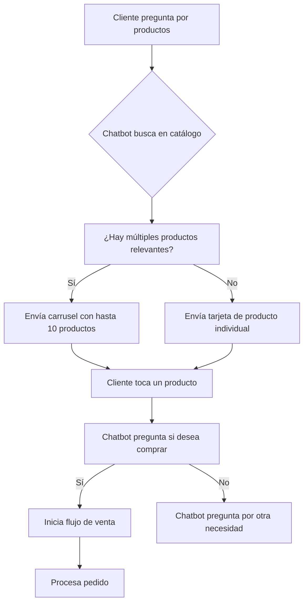

> El catálogo de WhatsApp es una de las herramientas más potentes para negocios que buscan vender directamente desde la aplicación de mensajería más usada del mundo. Con E-SMART360 puedes crear, sincronizar y gestionar tu catálogo de productos sin necesidad de conocimientos técnicos avanzados.

Con el auge de WhatsApp como canal de comunicación empresarial, integrar tu catálogo directamente en esta aplicación puede ayudarte a aumentar tus ventas y llegar a una audiencia más amplia. La API de Catálogos de WhatsApp es parte integral de la API de WhatsApp Business, permitiendo a las empresas crear y gestionar catálogos de productos directamente dentro de WhatsApp.

Al aprovechar esta funcionalidad, puedes presentar tus ofertas a los clientes de manera efectiva, proporcionando información detallada de los productos, todo dentro de la comodidad de su aplicación de mensajería preferida. Esta experiencia optimizada mejora el compromiso del cliente e impulsa las ventas.

## ¿Qué es un Catálogo de Productos en WhatsApp?

Un catálogo de productos en WhatsApp es una función que permite a las empresas mostrar sus productos o servicios directamente dentro de la aplicación. Los clientes pueden navegar por los artículos, ver detalles como precios, descripciones e imágenes, y realizar consultas sin salir del chat.

A diferencia de enviar largas descripciones de texto, el catálogo presenta tus productos de forma visual y organizada, facilitando la decisión de compra a tus clientes. Los productos aparecen como tarjetas interactivas dentro de la conversación, con la opción de ver más detalles al tocar cada uno.

> El catálogo no solo sirve para mostrar productos. También puedes usarlo para exhibir servicios, paquetes promocionales, membresías o cualquier oferta comercial que tengas. La versatilidad del catálogo lo convierte en una herramienta indispensable para cualquier negocio que quiera vender por WhatsApp.

El catálogo de WhatsApp se basa en la infraestructura de Facebook Commerce Manager, lo que significa que los mismos productos que muestras en Facebook Shop o Instagram Shopping pueden sincronizarse automáticamente con tu catálogo de WhatsApp. Esto te permite gestionar todo tu inventario desde un solo lugar.

## Cómo Funciona la Integración

La integración del catálogo de WhatsApp funciona en tres niveles:

1. **Facebook Commerce Manager** — Aquí se crea y gestiona el catálogo maestro con todos los productos
2. **WhatsApp Cloud API** — El catálogo se conecta a tu número de WhatsApp Business
3. **E-SMART360** — La plataforma sincroniza el catálogo y lo potencia con funcionalidades avanzadas como chatbots, automatización de ventas y webhooks

> Es importante entender que no basta con crear el catálogo en Commerce Manager. Para que los clientes puedan ver los productos dentro de WhatsApp, el catálogo debe estar conectado a la API de WhatsApp Cloud a través de WhatsApp Manager. La plataforma E-SMART360 automatiza este proceso y añade capas de funcionalidad adicional.

## Requisitos Previos

Antes de comenzar con la configuración, asegúrate de cumplir con todos los requisitos necesarios:

### Cuenta de Negocio en Facebook Business Manager

Necesitas una cuenta activa en [business.facebook.com](https://business.facebook.com/) para gestionar tu catálogo y conectarlo con WhatsApp. Si no tienes una, puedes crearla siguiendo el proceso de registro de Facebook Business Manager. Este es el requisito fundamental, ya que Commerce Manager depende directamente de tu Business Manager.

### Número de WhatsApp Business API

Debes tener un número registrado en la API de WhatsApp Cloud. E-SMART360 te guía durante el proceso de conexión a través del Embedded Signup, que simplifica la vinculación de tu número con la plataforma sin necesidad de configuraciones técnicas complejas.

### Cuenta activa en E-SMART360

Regístrate en la plataforma y conecta tu número de WhatsApp Business siguiendo los pasos de incorporación. El proceso de registro es rápido y una vez completado tendrás acceso a todas las herramientas de gestión del catálogo.

### Productos definidos y preparados

Ten listas las imágenes, títulos, descripciones y precios de los productos que deseas incluir en tu catálogo. WhatsApp recomienda imágenes de al menos 400x400 píxeles con formato JPG o PNG, y descripciones concisas pero informativas que no excedan los 60 caracteres para el título y 120 para la descripción.

### Diferencias entre WhatsApp Business App y WhatsApp Business API

La **WhatsApp Business App** es la aplicación gratuita para pequeñas empresas que incluye funciones básicas como respuestas rápidas, etiquetas y catálogo simple. Sin embargo, está limitada a un solo dispositivo y no permite automatización avanzada.

La **WhatsApp Business API** (Cloud API) es la solución empresarial que ofrece E-SMART360. Permite:
- Gestión desde múltiples dispositivos y plataformas
- Automatización completa con chatbots
- Integración con catálogos de Facebook Commerce Manager
- Broadcasting masivo con plantillas aprobadas
- Webhooks y conexiones con sistemas externos (CRM, ERP, e-commerce)
- Hasta 100 agentes de servicio simultáneos

Si tu negocio tiene más de 5 consultas diarias o necesitas automatización, la API es la opción correcta.

## Paso 1: Crear el Catálogo en Facebook Commerce Manager

El primer paso para tener tu catálogo operativo en WhatsApp es crearlo en Facebook Commerce Manager. A continuación te explicamos cada subpaso en detalle.

### 1. Accede a Facebook Business Manager

Ve a [business.facebook.com](https://business.facebook.com/) e inicia sesión con las credenciales de tu cuenta de negocio. Una vez dentro, despliega el menú **Todas las herramientas** en la barra lateral izquierda y selecciona **Commerce**.

> Si no ves la opción Commerce, verifica que tu Business Manager esté correctamente configurado y verificado. Para verificarlo:
1. Ve a Configuración de negocio > Cuentas > Cuentas de WhatsApp
2. Asegúrate de que tengas al menos una cuenta de WhatsApp configurada
3. Si tu Business Manager no está verificado, sigue el proceso de verificación que Meta solicita. Esto puede incluir la verificación telefónica y documentación de tu empresa.

Consulta la guía de verificación de Business Manager si tienes problemas durante este paso.

### 2. Selecciona tu Cuenta de Negocio

Una vez dentro de Commerce Manager, desde la esquina superior derecha, haz clic en el **perfil** o selector de cuentas. Asegúrate de seleccionar la **cuenta de negocio** correcta (la misma que usas para WhatsApp). Luego presiona el botón **Comenzar** para iniciar la creación del catálogo.

### 3. Elige el Tipo de Catálogo

Commerce Manager te presentará varias opciones de catálogo según el tipo de negocio:

- **E-Commerce** — Ideal para tiendas en línea con productos físicos o digitales. Es la opción más común y la que recomendamos para la mayoría de los negocios.
- **Viajes** — Para hoteles, vuelos, paquetes turísticos y experiencias de viaje.
- **Propiedades** — Para bienes raíces, alquileres y propiedades comerciales.
- **Automóviles** — Para concesionarios de vehículos, repuestos y accesorios automotrices.

Para la mayoría de los negocios que venden productos por WhatsApp, la opción recomendada es **E-Commerce**. Después de seleccionarla, el sistema te preguntará si tu negocio opera **en línea**, de forma **local** o **ambas**. Selecciona la opción que mejor describa tu modelo de negocio.

### 4. Selecciona el Método de Carga de Productos

Este es uno de los pasos más importantes. Tienes dos opciones principales para agregar productos a tu catálogo:

**Opción A: Carga Manual**
Agregas cada producto individualmente con sus imágenes, título, descripción, precio y enlace. Esta opción es ideal si tienes pocos productos (menos de 50) o si tu inventario cambia con poca frecuencia.

**Opción B: Conexión con Plataformas Partner**
Sincroniza automáticamente tu inventario desde plataformas como:
- **Shopify** — Sincronización bidireccional en tiempo real
- **BigCommerce** — Integración nativa con Facebook Commerce
- **WooCommerce** — A través de plugins y conectores

> La conexión con plataformas partner es muy recomendable porque:
- Los cambios de precio se reflejan automáticamente
- El inventario se actualiza en tiempo real
- Los nuevos productos se agregan sin intervención manual
- Se elimina el riesgo de errores humanos al cargar datos

Una vez seleccionado el método, elige el **propietario del catálogo** (tu negocio en Facebook), asigna un **nombre descriptivo** a tu catálogo y define el **caso de uso** (generalmente "Ventas"). Finalmente, haz clic en **Crear**.

### 5. Agrega Productos al Catálogo

Después de crear el catálogo, serás redirigido a la vista del mismo. Haz clic en **Ver catálogo** para acceder a la interfaz de gestión.

Para agregar productos manualmente:
1. Presiona el botón **Agregar artículos**
2. Selecciona **Manual** como método de carga
3. Completa los campos para cada producto:
   - **Nombre del producto** (máximo 60 caracteres)
   - **Descripción** (máximo 120 caracteres)
   - **Precio** con moneda configurada
   - **Imagen principal** (formato JPG o PNG, mínimo 400x400 píxeles)
   - **Enlace del producto** (opcional, para redirigir a tu tienda)
   - **Marca** (opcional)
   - **GTIN o código de barras** (opcional)
4. Haz clic en **Subir artículos** para guardar cada producto

Puedes agregar tantos productos como necesites. El límite actual es de **500 productos** por catálogo. Si tienes más productos, considera organizarlos en categorías o crear múltiples catálogos.

### Consejos para imágenes de productos en WhatsApp

Las imágenes de tus productos son la carta de presentación en el catálogo. Sigue estas recomendaciones:
- **Tamaño mínimo:** 400x400 píxeles
- **Tamaño recomendado:** 1200x1200 píxeles para mejor calidad en pantallas retina
- **Formato:** JPG o PNG
- **Relación de aspecto:** 1:1 (cuadrado) para mejor visualización
- **Fondo:** Preferiblemente blanco o liso
- **Tamaño máximo de archivo:** 8 MB
- **Sin texto superpuesto:** Evita añadir texto promocional sobre las imágenes, ya que puede ser rechazado por las políticas de Meta

## Paso 2: Conectar el Catálogo con WhatsApp Cloud API

Una vez que has creado el catálogo en Commerce Manager, el siguiente paso es vincularlo con tu cuenta de WhatsApp Business a través de WhatsApp Cloud API.

### 1. Accede a WhatsApp Manager

Desde el menú **Todas las herramientas** de Business Manager, selecciona **WhatsApp Manager**. Esta es la interfaz donde se gestionan todos los aspectos relacionados con la API de WhatsApp Business.

### 2. Selecciona la Opción de Catálogo

En el menú izquierdo, dentro de las **Herramientas de la cuenta**, busca y selecciona la opción **Catálogo**. Si no ves esta opción inmediatamente, puede estar bajo el submenú **Configuración de WhatsApp**.

### 3. Conecta tu Catálogo

Haz clic en el botón **Elegir catálogo**. Se abrirá una ventana con la lista de catálogos disponibles en tu Business Manager. Selecciona el **catálogo** que creaste en el Paso 1 de la lista desplegable y presiona **Conectar catálogo**.

> Si no ves tu catálogo en la lista, verifica que:
- El catálogo fue creado en el mismo Business Manager
- Tienes permisos de administrador sobre el catálogo
- El catálogo no está ya conectado a otra cuenta de WhatsApp
- Esperaste al menos 5 minutos después de crear el catálogo (a veces la sincronización toma unos minutos)

Una vez conectado, recibirás una confirmación visual. Tu catálogo ahora está vinculado a tu número de WhatsApp Business y los clientes podrán ver los productos al interactuar con tu negocio.

## Paso 3: Importar el Catálogo en E-SMART360

Después de conectar el catálogo con WhatsApp Business Manager, ahora debes importarlo en la plataforma E-SMART360 para activar todas las funcionalidades avanzadas: mostrar productos con opción de compra, integrar con chatbots y automatizar flujos de ventas.

### Conecta tu cuenta de WhatsApp

Inicia sesión en tu panel de E-SMART360. Ve a la sección **Conectar Cuenta** dentro del módulo de WhatsApp. Si es tu primera vez, sigue el proceso de Embedded Signup que te guiará para vincular tu número de WhatsApp con la plataforma.

### Sincroniza tu número

Una vez conectada la cuenta, haz clic en el botón **Sincronizar** junto a tu número de WhatsApp. Este paso actualiza la conexión entre E-SMART360 y la API de WhatsApp Cloud, asegurando que todos los datos estén actualizados.

### Accede al Catálogo de E-Commerce

En el menú principal, navega a la sección **Catálogo de E-Commerce**. Aquí encontrarás tu catálogo conectado con todos los productos sincronizados automáticamente. Si usaste la carga manual en Commerce Manager, los productos aparecerán después de la sincronización inicial.

### Verifica la sincronización

Revisa que todos los productos se hayan importado correctamente. Verifica nombres, precios, imágenes y descripciones. Si encuentras discrepancias, puedes editarlos directamente desde el panel de E-SMART360 o corregirlos en Commerce Manager y volver a sincronizar.

> Una vez importado, el catálogo estará disponible para tus clientes directamente desde la conversación de WhatsApp. Pueden navegar, ver productos y realizar pedidos sin salir del chat. Además, desde E-SMART360 puedes:
- Configurar el chatbot para recomendar productos automáticamente
- Enviar catálogos completos en respuestas de broadcasting
- Vincular productos con flujos de venta automatizados
- Generar informes de productos más vistos y consultados

## Cómo se Visualiza el Catálogo en WhatsApp

Una vez que todo está configurado, el catálogo se muestra como una galería interactiva dentro del chat de WhatsApp. Cuando un cliente abre la conversación con tu negocio, puede ver el catálogo de las siguientes formas:

1. **Icono de tienda** — Aparece un icono de tienda en la parte inferior del chat
2. **Botón "Ver catálogo"** — Dentro de la conversación, los clientes pueden tocar este botón
3. **Enlace compartido** — Puedes enviar un enlace directo al catálogo
4. **Respuesta automática del chatbot** — El chatbot puede mostrar productos basados en preguntas del cliente

Los clientes pueden:
- Desplazarse por los productos en una vista de cuadrícula
- Tocar cada producto para ver detalles ampliados
- Ver imágenes en alta resolución
- Leer descripciones y precios
- Realizar consultas directamente desde la vista del producto
- Compartir productos con otros contactos

### 🔍 Navegación intuitiva

Los productos se organizan en una cuadrícula fácil de explorar. Los clientes pueden deslizar hacia arriba para ver más productos y tocar cualquier artículo para ver sus detalles completos.

### 📱 Experiencia móvil nativa

El catálogo está optimizado para dispositivos móviles. Se abre dentro de la misma aplicación de WhatsApp, sin redireccionar a páginas externas, lo que reduce la fricción en la experiencia de compra.

### 🔄 Actualización en tiempo real

Los cambios que hagas en Commerce Manager o en tu plataforma de e-commerce se reflejan automáticamente. Si un producto se agota, desaparece del catálogo sin que tengas que hacer nada.

También puedes compartir enlaces de tu catálogo con los usuarios a través de otros canales como correo electrónico, redes sociales o tu sitio web. Si los usuarios hacen clic en el enlace desde su teléfono móvil, serán dirigidos al catálogo directamente en WhatsApp.

## Integración con Chatbots y Automatización de Ventas

Una de las ventajas más poderosas de E-SMART360 es la capacidad de combinar tu catálogo con un chatbot inteligente que automatiza todo el proceso de ventas. El chatbot actúa como un vendedor virtual disponible 24/7 que guía al cliente desde la primera consulta hasta la compra final.

### Configura tu Chatbot de Ventas en E-SMART360

### Diseña el flujo de conversación

Planifica cómo guiarás a tus clientes desde el saludo inicial hasta la compra. Define:
- **Saludo inicial** — Mensaje de bienvenida que presenta el negocio
- **Menú de opciones** — Categorías de productos o servicios
- **Preguntas clave** — Para identificar qué busca el cliente
- **Respuestas automáticas** — Para consultas frecuentes
- **Puntos de decisión** — Ramificaciones según la respuesta del cliente
- **Mensaje de cierre** — Resumen del pedido y pasos siguientes

### Conecta el catálogo al chatbot

En el Bot Manager de E-SMART360, vincula tu catálogo de productos para que el chatbot pueda:
- Sugerir artículos basados en palabras clave
- Mostrar productos de categorías específicas
- Enviar fichas de producto con imágenes y precios
- Responder preguntas sobre disponibilidad

### Configura respuestas inteligentes

Define respuestas automáticas para preguntas frecuentes como:
- Precios y variantes disponibles
- Tiempos y costos de envío
- Políticas de devolución y garantía
- Métodos de pago aceptados
- Información de contacto y horarios

### Activa el flujo de ventas

Guarda el flujo de conversación, asígnale un nombre descriptivo y actívalo en el constructor de flujos de E-SMART360. El chatbot ahora gestionará consultas de clientes automáticamente, sugerirá productos y guiará a los compradores a través del proceso de compra sin intervención humana.

### Ejemplo: Flujo de ventas automatizado para una tienda de ropa

**Escenario:** Una tienda de ropa online que vende camisetas, pantalones y accesorios.

**Interacción real:**
1. El cliente escribe: "Hola, ¿tienen camisetas?"
2. El chatbot responde: "¡Hola! Sí, tenemos varias opciones en camisetas 👕. Estas son nuestras colecciones disponibles: [Muestra 3 productos del catálogo con imágenes y precios]. ¿Te gusta alguna en particular?"
3. El cliente dice: "Me gusta la roja"
4. El chatbot responde: "Excelente elección. La camiseta roja está disponible en las tallas S, M, L y XL. ¿Qué talla usas?"
5. El cliente responde: "Talla M"
6. El chatbot confirma: "Perfecto, tenemos la camiseta roja talla M en stock por $29.990. ¿Te gustaría agregar algo más o procedemos con el pedido?"
7. El cliente confirma: "Procedamos"
8. El chatbot envía: "¡Genial! Te hemos enviado los detalles del pedido y las instrucciones de pago. Para confirmar, responde CONFIRMAR."
9. El cliente responde "CONFIRMAR" y el pedido queda registrado automáticamente en el sistema.

### Beneficios del Chatbot + Catálogo

- **Compromiso sin esfuerzo:** Responde automáticamente a las consultas de los clientes al instante, eliminando tiempos de espera.
- **Recomendaciones personalizadas:** El chatbot puede sugerir productos basados en las preferencias del usuario, su historial de compras o las respuestas a preguntas previas.
- **Disponibilidad 24/7:** El chatbot está siempre listo para ayudar, incluso fuera del horario laboral, fines de semana y días festivos.
- **Mayor conversión:** Las conversaciones fluidas combinadas con la presentación visual de productos llevan a más ventas y menor abandono del carrito.
- **Escalabilidad:** Atiende a múltiples clientes simultáneamente sin necesidad de aumentar tu equipo de ventas.
- **Consistencia:** Todos los clientes reciben la misma calidad de atención, sin depender del estado de ánimo o experiencia del agente humano.
- **Recolección de datos:** Cada interacción genera datos valiosos sobre preferencias de clientes, productos más consultados y patrones de compra.
- **Integración multicanal:** El mismo chatbot puede funcionar en WhatsApp, Facebook Messenger e Instagram DM desde una sola plataforma.

### 📦 Tienda de Electrónica - Caso de Éxito

Un distribuidor de accesorios tecnológicos en Chile configuró su catálogo con 200 productos sincronizados desde Shopify. El chatbot responde automáticamente preguntas sobre compatibilidad (¿funciona este cargador con mi iPhone 15?), muestra productos relacionados basados en el historial de navegación, y envía el enlace de pago seguro. **Resultado: 35% más de conversiones en los primeros 30 días**, con un tiempo de respuesta promedio de 2 segundos.

### 🛍️ Tienda de Ropa - Caso de Éxito

Una boutique de moda en México integró su catálogo de WhatsApp con un flujo de chatbot que recomienda outfits completos basados en el estilo preferido del cliente (casual, formal, deportivo). Los clientes pueden ver colecciones completas sin salir de la conversación. El chatbot también envía recordatorios de carritos abandonados con imágenes de los productos. **Resultado: 50% menos de consultas repetitivas al equipo de ventas** y un incremento del 20% en el ticket promedio gracias a las recomendaciones cruzadas.

## Casos de Uso Avanzados

### Notificaciones Automáticas de Pedidos con Webhooks

Puedes configurar E-SMART360 para enviar notificaciones automáticas de pedidos directamente por WhatsApp cuando alguien compra en tu tienda WooCommerce o Shopify. El flujo funciona así:

1. Cliente realiza una compra en tu tienda online
2. WooCommerce/Shopify envía un webhook con los datos del pedido
3. E-SMART360 procesa el webhook y activa el flujo de notificación
4. El cliente recibe un mensaje de WhatsApp: "✅ ¡Gracias por tu compra! Tu pedido #1234 ha sido confirmado. Te notificaremos cuando sea enviado."
5. Cuando el pedido es enviado, otro mensaje automático: "🚚 Tu pedido #1234 ha sido enviado. Número de seguimiento: 1Z999AA10123456784."

> Combina el catálogo con los **webhooks de WooCommerce/Shopify** para ofrecer una experiencia de postventa completa:
- Notificación de confirmación de pedido
- Actualización de estado del envío
- Encuesta de satisfacción después de la entrega
- Ofertas de productos complementarios basados en la compra realizada
Todo desde una sola conversación de WhatsApp.

### Confirmación de Pedidos Contra Entrega (COD)

Si trabajas con pagos contra entrega (COD), puedes automatizar completamente la verificación de pedidos. El flujo de confirmación incluye:

1. El cliente realiza un pedido en tu tienda con método de pago "Contra entrega"
2. El webhook de WooCommerce/Shopify envía los datos del pedido a E-SMART360
3. El chatbot envía un mensaje de confirmación al cliente con los detalles del pedido
4. El cliente debe confirmar el pedido respondiendo "SÍ" o "CONFIRMAR"
5. Si el cliente confirma, el pedido se marca como verificado automáticamente
6. Si el cliente no responde en 24 horas, se envía un recordatorio
7. Si el cliente cancela, el pedido se marca como cancelado

Este proceso **reduce significativamente las falsas órdenes** y los costos de logística asociados a entregas fallidas.

### Catálogos para Servicios Profesionales

El catálogo de WhatsApp no está limitado a productos físicos. También puedes utilizarlo para mostrar servicios profesionales de manera atractiva:

**Ejemplos de uso para servicios:**
- **Consultorías** — Paquetes de horas de consultoría con descripciones detalladas de cada servicio
- **Educación** — Cursos online, talleres y programas educativos con fechas y precios
- **Salud y bienestar** — Membresías de gimnasio, sesiones de terapia, planes de nutrición
- **Agencias de marketing** — Paquetes de servicios con entregables específicos
- **Desarrollo web** — Planes de creación de sitios web, mantenimiento, SEO
- **Reservas** — Experiencias turísticas, alquiler de espacios, entradas a eventos

### Recuperación de Carritos Abandonados

Una de las funcionalidades más potentes de E-SMART360 es la recuperación automática de carritos abandonados. El flujo es el siguiente:

1. Un cliente agrega productos a su carrito en tu tienda WooCommerce o Shopify pero no completa la compra
2. Después de un tiempo configurable (ej: 1 hora), E-SMART360 envía un mensaje automático por WhatsApp
3. El mensaje incluye imágenes de los productos abandonados y un enlace directo al carrito
4. El cliente puede completar la compra desde el mismo WhatsApp
5. Si no hay respuesta, se envía un segundo recordatorio con un código de descuento

### ¿Puedo actualizar mi catálogo después de crearlo?

Sí, absolutamente. Puedes actualizar tu catálogo en cualquier momento. Los cambios que puedes hacer incluyen:

- **Agregar nuevos productos** — Añade productos individualmente o en lote
- **Editar productos existentes** — Actualiza precios, descripciones, imágenes o disponibilidad
- **Eliminar productos** — Retira artículos que ya no estén disponibles
- **Reorganizar categorías** — Cambia la estructura de tu catálogo

Si usas la conexión con plataformas partner (Shopify, BigCommerce, WooCommerce), los cambios se sincronizan **automáticamente** en tiempo real. Si usas carga manual, debes editar los productos directamente en Commerce Manager y luego sincronizar en E-SMART360.

Las actualizaciones en Commerce Manager pueden tardar hasta 15 minutos en reflejarse en WhatsApp debido a los tiempos de caché de Meta.

## Consejos para Maximizar tus Ventas con el Catálogo

1. **Imágenes de alta calidad** — Invierte en fotografías profesionales de tus productos. Las imágenes son el factor más importante en la decisión de compra.
2. **Descripciones claras y concisas** — WhatsApp tiene límites de caracteres. Sé directo y destaca los beneficios clave de cada producto.
3. **Precios visibles** — Incluye siempre el precio. Los clientes que ven el precio tienen más probabilidades de comprar.
4. **Actualización constante** — Mantén tu inventario actualizado. Nada frustra más a un cliente que preguntar por un producto agotado.
5. **Combina con chatbot** — Automatiza las preguntas frecuentes para que el cliente siempre tenga una respuesta inmediata.
6. **Segmenta tus campañas** — Usa los datos de compra para enviar catálogos personalizados según los intereses de cada cliente.
7. **Incluye testimonios** — Agrega reseñas de clientes en las descripciones de los productos cuando sea posible.
8. **Promociones exclusivas** — Ofrece descuentos especiales solo para compras a través del catálogo de WhatsApp.

## Preguntas Frecuentes

### ¿Qué es un catálogo de productos en WhatsApp?

Un catálogo de productos en WhatsApp es una función que permite a las empresas mostrar sus productos o servicios directamente dentro de la aplicación. Permite a los clientes navegar por los artículos, ver detalles y hacer consultas sin salir del chat. Los productos aparecen con imágenes, nombres, precios y descripciones en una galería interactiva optimizada para dispositivos móviles. Es como tener una tienda virtual dentro de WhatsApp.

### ¿Por qué debería integrar un catálogo de productos en WhatsApp?

Integrar un catálogo en WhatsApp ofrece múltiples beneficios:
- **Mayor alcance:** WhatsApp tiene más de 2.000 millones de usuarios activos
- **Mejor experiencia de compra:** Los clientes ven productos sin salir de la app
- **Aumento de ventas:** La presentación visual impulsa las decisiones de compra
- **Automatización:** Combinado con chatbot, el proceso de venta se vuelve 24/7
- **Menor fricción:** Los clientes no necesitan registrarse en una web ni descargar otra app
- **Comunicación directa:** Pueden preguntar dudas al instante mientras ven los productos

### ¿Cómo creo un catálogo de productos en WhatsApp paso a paso?

El proceso completo consta de 3 pasos principales:

**Paso 1:** Crea el catálogo en Facebook Commerce Manager
- Accede a business.facebook.com
- Ve a Todas las herramientas > Commerce
- Crea un nuevo catálogo de tipo E-Commerce
- Agrega tus productos manualmente o conecta Shopify/BigCommerce

**Paso 2:** Conecta el catálogo con WhatsApp Cloud API
- Abre WhatsApp Manager desde las herramientas de Business Manager
- Selecciona Catálogo en las herramientas de la cuenta
- Elige tu catálogo y presiona Conectar

**Paso 3:** Importa el catálogo en E-SMART360
- Ve a Conectar Cuenta > Sincroniza tu número
- Accede al Catálogo de E-Commerce
- Verifica que todos los productos estén sincronizados

El proceso completo toma aproximadamente 30 minutos si ya tienes los productos preparados.

### ¿Hay un límite en la cantidad de productos que puedo agregar?

Sí, actualmente WhatsApp permite hasta **500 productos** por catálogo. Este límite es suficiente para la mayoría de las pequeñas y medianas empresas. Si necesitas mostrar más de 500 productos, tienes estas opciones:

1. **Crear múltiples catálogos** — Puedes tener varios catálogos en diferentes cuentas de WhatsApp
2. **Usar categorías** — Organiza tus productos en categorías para facilitar la navegación
3. **Rotación de inventario** — Mantén solo los productos más populares y rota según temporada
4. **Catálogo dinámico** — Usa la API para gestionar qué productos se muestran según disponibilidad

Si no ves tus productos después de agregarlos, verifica que no hayas superado este límite.

### ¿Qué tipos de productos puedo incluir en el catálogo?

Puedes incluir una amplia variedad de productos y servicios:
- **Bienes físicos:** Ropa, electrónica, libros, muebles, alimentos, cosméticos
- **Productos digitales:** Ebooks, software, cursos online, plantillas, música
- **Servicios profesionales:** Consultorías, clases, membresías, suscripciones
- **Paquetes turísticos:** Hoteles, vuelos, excursiones, experiencias
- **Entradas:** Eventos, conciertos, festivales, conferencias
- **Membresías:** Gimnasios, clubs, plataformas de streaming

Meta tiene políticas de productos prohibidos que debes revisar antes de crear tu catálogo (armas, productos ilegales, contenido para adultos, etc.).

### ¿Necesito conocimientos técnicos para usar E-SMART360 con mi catálogo?

No, para nada. E-SMART360 está diseñado específicamente para ser fácil de usar, permitiendo a usuarios sin conocimientos técnicos crear y gestionar sus catálogos de productos y chatbots. La plataforma proporciona:

- **Guías paso a paso** durante todo el proceso de integración
- **Interfaz visual** tipo arrastrar y soltar para crear flujos de chatbot
- **Plantillas predefinidas** para los casos de uso más comunes
- **Soporte técnico** para resolver cualquier duda durante la configuración
- **Documentación completa** con ejemplos prácticos

La única integración que puede requerir asistencia técnica es la configuración de webhooks avanzados entre E-SMART360 y WooCommerce/Shopify, pero incluso ese proceso está simplificado con guías detalladas.

### ¿Puedo conectar mi tienda WooCommerce o Shopify al catálogo?

Sí, E-SMART360 ofrece integraciones nativas con WooCommerce y Shopify que permiten:

- **Sincronización automática** de productos, precios e inventario
- **Notificaciones de nuevos pedidos** directamente en WhatsApp
- **Recuperación de carritos abandonados** con mensajes automáticos
- **Verificación de pagos contra entrega** (COD) mediante chatbot
- **Actualización de estados de envío** en tiempo real

La conexión con WooCommerce se realiza mediante un plugin oficial que instalas en tu sitio de WordPress. Para Shopify, la integración se hace a través de la API de Shopify con un proceso de autenticación OAuth que toma menos de 5 minutos.

### ¿Puedo tener múltiples catálogos para diferentes líneas de productos?

Sí, puedes crear múltiples catálogos si tienes diferentes líneas de negocio. Por ejemplo, una tienda que vende ropa y electrónica puede tener un catálogo separado para cada categoría. Cada catálogo se gestiona de forma independiente en Commerce Manager y puede conectarse a diferentes números de WhatsApp si es necesario.

Para gestionar múltiples catálogos desde E-SMART360, puedes:
- Asignar diferentes chatbots por catálogo
- Enviar catálogos específicos según segmentos de clientes
- Crear flujos de venta diferenciados por tipo de producto
- Generar reportes separados por catálogo

### ¿Cómo se comparte el catálogo en una conversación de WhatsApp?

Existen varias formas de compartir el catálogo con tus clientes:

1. **Botón automático de WhatsApp** — Cuando configuras correctamente el catálogo, aparece automáticamente un botón "Ver catálogo" en la conversación
2. **Enlace directo** — Puedes copiar y compartir el enlace del catálogo en cualquier mensaje
3. **Respuesta del chatbot** — Configura tu chatbot para que envíe productos específicos cuando el cliente pregunte por ellos
4. **Broadcasting** — Incluye productos del catálogo en tus campañas de mensajes masivos
5. **Plantillas de mensaje** — Crea plantillas aprobadas por Meta que incluyan tarjetas de productos

El enlace del catálogo es especialmente útil para incluirlo en tus perfiles de redes sociales, firma de correo electrónico o sitio web.

### ¿Qué sucede si un cliente quiere comprar pero no tengo sistema de pago integrado?

No necesitas tener un sistema de pago integrado para usar el catálogo. Puedes:

- **Pago contra entrega (COD)** — El chatbot confirma el pedido y el cliente paga al recibir
- **Transferencia bancaria** — El chatbot envía los datos bancarios para la transferencia
- **Enlace de pago** — Genera un enlace de pago con Mercado Pago, Stripe, PayPal u otro procesador
- **WhatsApp Pay** — Si está disponible en tu país, los clientes pueden pagar directamente en WhatsApp
- **Coordinación manual** — El chatbot recopila los datos del pedido y un agente se encarga del cobro

E-SMART360 es compatible con más de 20 métodos de pago incluyendo PayPal, Stripe y Mercado Pago.

## Integración con Carousel Media Templates

Además del catálogo estándar, E-SMART360 te permite usar **plantillas de carrusel** para mostrar múltiples productos en un solo mensaje. Esta función es ideal para:

- **Lanzamientos de productos** — Muestra varios productos nuevos en un solo mensaje interactivo
- **Ofertas promocionales** — Presenta una colección de productos en descuento
- **Recomendaciones personalizadas** — Envía un carrusel con productos basados en compras anteriores
- **Colecciones de temporada** — Muestra toda una colección (verano, invierno, navidad) en un formato visual atractivo

Las plantillas de carrusel deben ser aprobadas por Meta antes de su uso. El proceso de aprobación обычно toma entre 24 y 48 horas hábiles.

## Estrategias Avanzadas de Ventas

### Cross-Selling Automatizado

Cuando un cliente consulta por un producto específico, el chatbot puede sugerir productos complementarios. Por ejemplo:

- Cliente pregunta por un **teléfono** → El chatbot muestra el teléfono + una funda protectora + un cargador
- Cliente pregunta por un **vestido** → El chatbot muestra el vestido + zapatos que combinan + accesorios

### Upselling con Catálogo

Configura el chatbot para ofrecer versiones mejoradas de los productos que el cliente está viendo:

- **Producto básico:** $29.990 → **Producto premium:** $49.990 (con mejores materiales y garantía extendida)
- **Plan mensual:** $19.990/mes → **Plan anual:** $199.990/año (ahorro de 2 meses)

### Segmentación de Clientes

Usa los datos recopilados por E-SMART360 para segmentar a tus clientes y enviar catálogos personalizados:

| Segmento | Criterio | Catálogo Recomendado |
|----------|----------|---------------------|
| Nuevos clientes | Sin compras previas | Productos más vendidos |
| Clientes frecuentes | Más de 3 compras | Novedades y premium |
| Clientes inactivos | Sin compras en 90 días | Ofertas de reactivación |
| Clientes VIP | Compras > $100.000 | Colección exclusiva |

### Campañas Temporales

Aprovecha fechas especiales para crear campañas con tu catálogo:

- **Cyber Monday / Black Friday** — Catálogo completo con precios especiales
- **Día de la Madre / Padre** — Colección de regalos sugeridos
- **Fin de temporada** — Liquidación con descuentos visibles
- **Lanzamiento de producto** — Catálogo exclusivo para preventa

## Solución de Problemas Comunes

### El catálogo no aparece en WhatsApp

Si después de seguir todos los pasos el catálogo no se muestra en WhatsApp, verifica:

1. **Sincronización pendiente** — Espera al menos 15 minutos después de conectar el catálogo
2. **Permisos insuficientes** — Asegúrate de tener rol de administrador en el Business Manager
3. **Catálogo en otra cuenta** — Verifica que el catálogo no esté vinculado a otro número
4. **Cuenta no verificada** — El Business Manager debe estar verificado para mostrar el catálogo
5. **Formato de productos incorrecto** — Revisa que todos los productos cumplan con los requisitos de formato

### Los productos no se sincronizan con Shopify

Si los productos de Shopify no aparecen en tu catálogo:

1. Desconecta y vuelve a conectar la integración en Commerce Manager
2. Verifica que los productos de Shopify tengan estado "Activo"
3. Asegúrate de que los productos tengan imágenes asignadas
4. Confirma que los precios estén configurados correctamente
5. Revisa que el inventario no sea cero (los productos con stock 0 no se sincronizan)

### El chatbot no muestra productos del catálogo

Si tu chatbot de E-SMART360 no muestra productos al cliente:

1. Confirma que el catálogo esté correctamente importado en E-SMART360
2. Verifica que el flujo del chatbot incluya un paso de "Mostrar catálogo"
3. Revisa que las palabras clave del chatbot coincidan con nombres de productos
4. Asegúrate de que el chatbot esté activo y no en modo borrador
5. Prueba el flujo desde la vista previa antes de publicarlo

## Video Tutorial

Puedes ver el video tutorial completo sobre cómo habilitar el catálogo en WhatsApp con permisos de Cloud API. Busca en nuestro canal de YouTube los tutoriales de catálogo de WhatsApp para ver el proceso en acción paso a paso.

> **Actualización de la guía de catálogo de productos (2025-03-06)**
> Se actualizó esta guía para incluir:
- Nuevos métodos de conexión con plataformas partner (Shopify, BigCommerce, WooCommerce)
- Mayor cobertura de integraciones con webhooks para notificaciones de pedidos
- Ejemplos prácticos de automatización de ventas con chatbot y catálogo
- Sección de solución de problemas comunes
- Límite de productos por catálogo actualizado a 500 según documentación más reciente de WhatsApp Cloud API
- Nuevos casos de uso para servicios profesionales y recuperación de carritos abandonados
- Estrategias avanzadas de cross-selling y upselling
- Integración con plantillas de carrusel para promociones
- Tabla de segmentación de clientes para campañas dirigidas

---

*¿Te ha sido útil esta guía? Si tienes preguntas adicionales sobre la configuración de tu catálogo de productos en WhatsApp, contacta a nuestro equipo de soporte técnico. Estamos disponibles para ayudarte a maximizar tus ventas a través de WhatsApp.*
