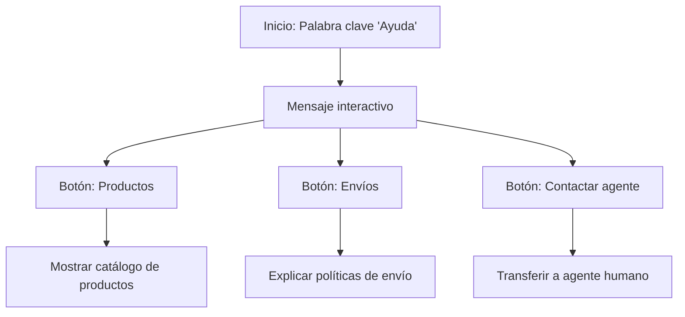
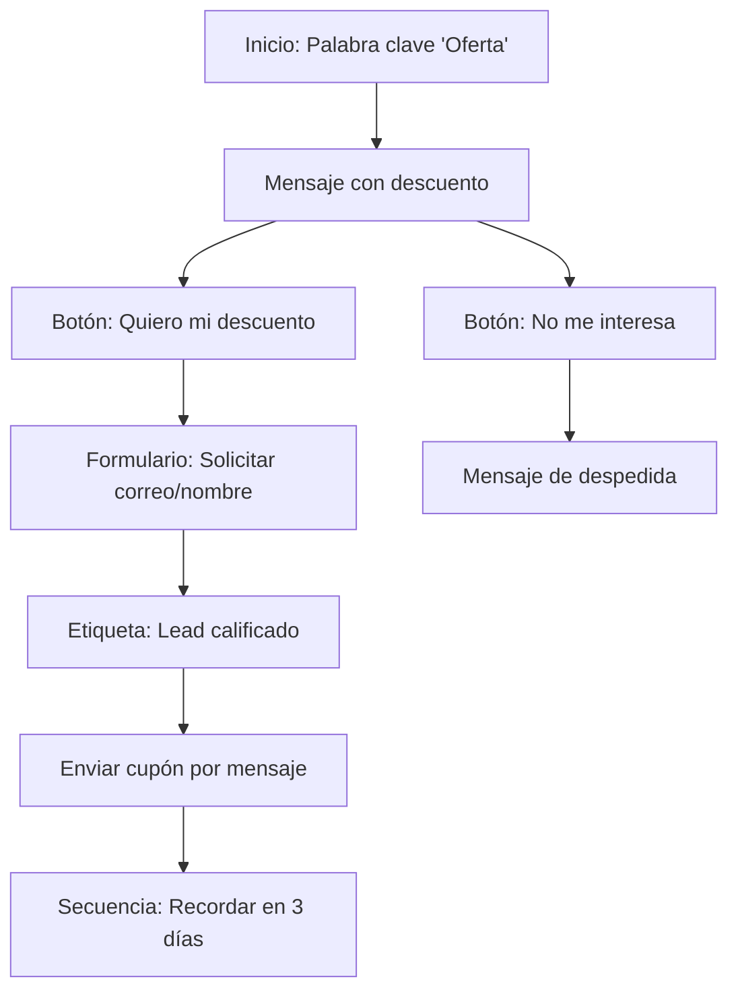

# Cómo construir un chatbot de WhatsApp sin código

Desde una simple consulta hasta la compra del producto deseado, el recorrido de un cliente es todo un proceso, ¿cierto?

Cuando esto ocurre físicamente en una tienda, piensa en todos los pasos: recibirlos, responder sus preguntas, mostrarles diferentes productos que se ajusten a sus preferencias y finalmente cerrar la venta. Sin embargo, replicar todos esos pasos de forma confiable en línea es un gran desafío, especialmente cuando manejas un alto volumen de clientes. Pero en esta era tecnológica, lograr ese mismo éxito es más fácil de lo que crees, solo con mantenerte un poco actualizado.

¿Te preguntas cómo? La respuesta es: ¡un chatbot, un simple chatbot de WhatsApp!


> **Dato clave:** Los chatbots de WhatsApp impulsan una **tasa de apertura de mensajes del 98%** y ofrecen un **aumento verificable del 156% en las tasas de conversión** en comparación con los canales tradicionales. Así es como las marcas modernas están convirtiendo chats en ingresos.

## ¿Qué es un chatbot de WhatsApp y por qué usarlo?

Un chatbot de WhatsApp es una tecnología para "chatear" automáticamente con los clientes. Eres tú quien decide qué, cuándo, por qué y cuánto dirá. En otras palabras, es una herramienta de automatización empresarial.


> **El poder de WhatsApp:** El **67% de los usuarios se siente más seguro** comprando a empresas a las que puede contactar por WhatsApp, y las tasas de conversión en WhatsApp son típicamente **3 veces más altas que las campañas de correo electrónico**.

Por esta razón, gigantes corporativos como Nivea, Unilever y Flamingo han adoptado los chatbots de WhatsApp desde hace bastante tiempo. La prueba está en los números.

## Construye tu primer chatbot de WhatsApp en menos de 10 minutos

Ahora vamos al grano: qué tan rápido puedes construir un chatbot incluso si no eres un experto en tecnología. Principalmente necesitarás dos cosas:

1. Una **Cuenta de WhatsApp Business verificada (WABA)**
2. Un **Proveedor de Servicios Empresariales (BSP) sin código**

Asumimos que tu WABA verificada ya está configurada. Si no es así, puedes instalar WhatsApp Business y verificarlo fácilmente con tu número móvil. En esta guía mostraremos el proceso completo usando **E-SMART360**.

### Requisitos previos

Antes de continuar, asegúrate de tener lo siguiente en orden:

- Una cuenta de **Meta Business Suite** con acceso de administrador
- **WABA vinculada** a tu cuenta de Meta Business Suite o página de perfil


### Accede a tu cuenta de E-SMART360

Abre tu cuenta de E-SMART360 en el navegador. Desde el menú lateral izquierdo, selecciona **Conectar cuenta → Conectar WhatsApp**. Verás dos opciones: selecciona la opción marcada para la **integración en un solo clic**.
    
    
> La segunda opción requiere más tiempo, así que mantenla como respaldo. Si la necesitas, consulta la guía de configuración de WhatsApp Cloud API.
    
### Selecciona tu método de conexión

Elige según tu configuración: con o sin permiso de catálogo. Haz clic y serás redirigido a una página de inicio de sesión de Facebook. Completa la información requerida usando la cuenta que tenga acceso de administrador a tu Meta Business Suite.
  
### Sigue las instrucciones en pantalla

Haz clic en el botón indicado, sigue las instrucciones adicionales en pantalla y guarda los cambios. Una vez verificado, E-SMART360 finalizará el enlace.
  
### Confirma la conexión

Revisa tu **Panel de control de E-SMART360** para confirmar que tu cuenta de WhatsApp está vinculada. ¡Ya estás listo para volar!
  
### Diseña tu chatbot sin escribir código

Ahora viene la parte interesante: diseñarás exactamente cómo el chatbot interactuará con tus clientes sin escribir una sola línea de código. Es hora de darle la bienvenida a tu **Gestor de Bots**.


### Accede al Gestor de Bots

Desde el **Panel de control**, haz clic en **Gestor de Chatbots** → Navega al menú **Bot de WhatsApp**. Haz clic en la sección **Respuesta del Bot** y luego en **Crear**.
  
### Explora el lienzo del constructor de flujos

Instantáneamente aparecerá un lienzo de constructor de flujos. Aquí verás varios componentes que puedes usar para configurar las acciones de tu chatbot: mensajes de texto, componentes interactivos, botones, condiciones y más.
  
### Crea tu primer saludo automático

Arrastra un componente de texto o interactivo desde el panel de componentes. Conéctalo al nodo **Inicio del flujo**. Escribe un mensaje de bienvenida, por ejemplo: "¡Hola! Soy el asistente virtual de [Tu Empresa]. ¿En qué puedo ayudarte hoy?". Guarda el flujo y prueba el chatbot para verificar que funciona correctamente.
  

> **¡Felicidades!** Has construido tu primer chatbot de WhatsApp. Pero esto es solo el comienzo. Gradualmente dominarás funciones más potentes como gestionar flujos de entrada de usuario, configurar mensajes en secuencia, integrar tu catálogo y datos de Google Sheets. Esencialmente, podrás automatizar completamente tu **estrategia de marketing en WhatsApp** sin necesidad de conocimientos de programación.

## Cómo crear un chatbot basado en palabras clave

Una de las formas más efectivas de configurar tu chatbot es mediante palabras clave. Así puedes responder automáticamente cuando un cliente escriba términos específicos como "Hola", "Precio" o "Ayuda".


### Paso a paso

### Accede al Gestor de Bots

Ve al menú **Gestor de Bots** en el panel de control de E-SMART360. Selecciona la cuenta de bot que deseas configurar y haz clic en **Respuesta del Bot**.
      
### Crea un nuevo chatbot

Haz clic en el botón **Crear** en la configuración de Respuesta del Bot. Aparecerá el lienzo del **Constructor Visual de Flujos**.
      
### Nombra tu chatbot

Localiza el componente **Inicio del Flujo del Bot**. Haz doble clic para abrir la ventana **Configurar Referencia**. Ingresa un nombre en el campo Título. Opcionalmente, elige una etiqueta y selecciona una secuencia.
      
### Configura una palabra clave de activación

En la misma ventana, ingresa una palabra clave para activar el bot (por ejemplo, "Hola", "Ayuda", "Precio"). Puedes elegir entre:
        - **Coincidencia exacta de palabra clave**: el bot solo se activa con esa palabra específica
        - **Coincidencia de cadena**: el bot se activa con cualquier frase que contenga la palabra clave (ej. "Hola, necesito ayuda")
      
### Configura un mensaje de respuesta

Arrastra una conexión desde el conector **Siguiente** del Inicio del Flujo. Suéltala en el lienzo para revelar las opciones de componentes. Selecciona el **Componente Interactivo**. Haz doble clic para abrir el modal de configuración. Completa el Encabezado, Cuerpo y Pie del mensaje (el cuerpo es obligatorio). Configura un tiempo de espera si lo deseas y guarda.
      
### Añade botones interactivos

Arrastra un conector desde el socket de botones del Componente Interactivo. Aparecerá un **Componente de Botón**. Haz doble clic e ingresa el texto del botón. Selecciona una acción para cuando se haga clic (Enviar Mensaje, Iniciar un Flujo, etc.). Repite para agregar más botones.
      
### Configura el mensaje final y guarda

Selecciona el **Componente de Texto** para el mensaje final. Configúralo y haz clic en **Guardar** en la parte superior derecha del lienzo.
      
### Prueba tu chatbot

Abre WhatsApp, escribe la palabra clave configurada y envíala. Observa la respuesta del chatbot para confirmar que funciona correctamente.
      

> **Solución de problemas comunes:**
- **¿La palabra clave no activa respuestas?** Revisa que esté correctamente configurada en el Componente de Activación.
- **¿Los botones no aparecen?** Asegúrate de que estén vinculados correctamente a un componente interactivo.
- **¿Falta el mensaje final?** Verifica que el Componente de Texto esté agregado y guardado.
- **¿Los cambios no se guardan?** Siempre haz clic en Guardar antes de salir del constructor visual.

## Cómo construir un chatbot de seguimiento automático

Un chatbot de seguimiento es un sistema automatizado que envía mensajes de recordatorio a usuarios que han interactuado con tu chatbot pero no han completado una acción, como realizar una compra o registrarse. Ayuda a las empresas a mantenerse en contacto con clientes potenciales y mejora las tasas de conversión.

### ¿Por qué usar un sistema de seguimiento automatizado?

- Ahorra tiempo al automatizar recordatorios
- Aumenta las ventas y conversiones
- Asegura que los usuarios no olviden tu oferta
- Funciona 24/7 sin esfuerzo manual

### Configuración del chatbot de seguimiento


### Crea el flujo del chatbot

Ve al Panel de control → **Gestor de Bots** → **Respuesta del Bot** → **Crear**. Nombra el chatbot de forma reconocible, como "Bot de Seguimiento". Guárdalo y asegúrate de que se active cuando un usuario interactúe con un mensaje relacionado con productos.
  
### Configura mensajes interactivos

Agrega un bloque interactivo a tu chatbot. Crea un mensaje como: "¿Te interesaría nuestro producto?" con botones de **Sí** y **No**. Si el usuario selecciona Sí, proporciónale un enlace de compra. Si selecciona No, finaliza la conversación u ofrece asistencia.
  
### Usa etiquetas para rastrear acciones de usuarios

Cuando un usuario haga clic en "Comprar ahora", aplícale una etiqueta como **Comprar ahora**. Si el usuario no hace clic en el botón, no recibe esta etiqueta. Usa esta etiqueta para determinar quién necesita un recordatorio de seguimiento.
  
### Configura la secuencia de seguimiento

Arrastra el conector desde el botón "Comprar ahora" hacia la opción **Suscribir a Secuencia** para iniciar una secuencia de seguimiento. Esto enviará un mensaje de recordatorio si el usuario no compra dentro de 30 minutos (o el tiempo que elijas).
  
### Agrega condiciones al seguimiento

Añade una condición para hacer seguimiento basado en si seleccionaron el botón "Comprar ahora" o no. Si no lo hicieron, envía el mensaje de seguimiento. Puedes incluir nuevamente el botón de compra para facilitar la conversión.
  
### Repite según sea necesario

Puedes repetir el proceso para enviar otro recordatorio si aún no han comprado. WhatsApp permite enviar mensajes de seguimiento ilimitados dentro de las 24 horas. Después de 24 horas, solo se pueden usar plantillas de mensajes preaprobadas.
  

> **Programación estratégica:** Programa tus recordatorios de forma estratégica para evitar saturar a los usuarios. Las secuencias de 3 a 5 mensajes espaciados suelen funcionar mejor que los envíos masivos.

## Impacto de los chatbots de WhatsApp en el mundo real

El mundo empresarial del siglo XXI se mueve a una velocidad vertiginosa. Si un cliente dice "hola" y no recibe atención inmediata, ese cliente se pierde en un instante. Aquí es donde brilla la tecnología.

Los datos confirman que, aunque existen varias plataformas de comunicación, **WhatsApp es actualmente la más popular y la más efectiva**. Por eso, las grandes industrias ya tratan a WhatsApp como su principal motor de marketing. En la era de la automatización, la IA ha llevado esto a un nivel superior. Como resultado, el uso de chatbots de WhatsApp está **disparándose**.


### Nivea: 207% del objetivo alcanzado

Nivea enfrentó el desafío del **compromiso masivo orgánico** para un nuevo producto. Lanzaron la **Campaña Cocoa Shades**, anclada completamente en un chatbot de WhatsApp. El gancho era simple: los usuarios enviaban una foto al bot y recibían instantáneamente una versión estilizada única, perfectamente adaptada a su tono de piel. El resultado fue un **asombroso 207% del objetivo de alcance**.
  
### Unilever: 14x más ventas

Unilever necesitaba **alta presencia de marca impactante** para su nueva línea de productos. Crearon **MadameBot**, su chatbot de WhatsApp. Cubrieron São Paulo con 1000 carteles con el número de WhatsApp. Cuando los consumidores contactaban, MadameBot ofrecía consejos personalizados de cuidado de productos, descuentos y envío gratuito. Este simple chatbot impulsó ventas **14 veces más altas**.
  
## Mensajes en secuencia para ventas automatizadas

Los mensajes en secuencia son conjuntos preconfigurados de mensajes automatizados que se envían a los suscriptores basados en activadores y horarios predefinidos. Estos mensajes ayudan a mantener el compromiso, nutrir leads y automatizar respuestas eficientemente.

### Ideas para mensajes en secuencia

- **Secuencias de bienvenida**: Atrae a nuevos suscriptores con saludos personalizados
- **Secuencias de soporte al cliente**: Automatiza respuestas a consultas comunes
- **Secuencias de nutrición de leads**: Educa a los leads sobre productos o servicios
- **Secuencias de ventas**: Guía a los clientes potenciales a través del embudo de ventas
- **Secuencias de incorporación**: Ayuda a nuevos usuarios a comenzar
- **Secuencias promocionales**: Anuncia nuevos productos, descuentos o eventos
- **Secuencias educativas**: Proporciona contenido valioso a los suscriptores


> **Beneficios comprobados:**
- **Experiencia del cliente mejorada**: Las respuestas automatizadas garantizan atención instantánea
- **Mayor eficiencia**: Reduce la carga de trabajo manual automatizando tareas repetitivas
- **Mejores conversiones**: Nutre leads y mejora las tasas de conversión
- **Compromiso mejorado**: Mantiene a los usuarios interesados con seguimientos oportunos
- **Optimización basada en datos**: Realiza un seguimiento del rendimiento y refina las secuencias según los análisis

### Cómo configurar una campaña de mensajes en secuencia


### Crea una nueva secuencia

Navega al **Constructor de Flujos** y selecciona **Nueva Secuencia**. Asígnale un nombre y configura el tiempo entre mensajes.
  
### Estructura tu secuencia

Diseña la secuencia con texto, medios y llamadas a la acción. Puedes incluir imágenes, botones y enlaces. Mantén los mensajes concisos y relevantes.
  
### Personaliza la interacción

Utiliza los datos del usuario para personalizar cada mensaje. Los mensajes personalizados tienen tasas de apertura y clic significativamente más altas.
  
### Activa y monitorea

Finaliza la configuración y activa la secuencia. Monitorea el rendimiento y realiza mejoras basadas en los datos. Recuerda usar plantillas de mensajes preaprobadas para mensajes fuera de la ventana de 24 horas.
  
## Mejores prácticas para la automatización con chatbots


### Mensajes concisos

Mantén los mensajes cortos y directos. Los usuarios de WhatsApp prefieren respuestas rápidas y claras. Evita párrafos extensos.
  
### Personalización

Personaliza las interacciones usando datos del usuario como nombre, ubicación o historial de compras. Esto aumenta significativamente el compromiso.
  
### Programación estratégica

Programa los mensajes en momentos óptimos. Evita horas de la madrugada o fines de semana. Analiza cuándo tus usuarios están más activos.
  
### Buenas prácticas adicionales

- **Usa plantillas preaprobadas**: Para mensajes fuera de la ventana de 24 horas, WhatsApp requiere plantillas de mensajes preaprobadas
- **Monitorea la calidad**: Revisa la calificación de calidad de tu número en el panel de Meta
- **Respeta los límites**: WhatsApp tiene límites de mensajería basados en la calidad de tu cuenta
- **Ofrece valor**: Cada mensaje debe aportar valor al usuario, no solo promocionar
- **Prueba constantemente**: Realiza pruebas A/B con diferentes mensajes y horarios

## Exportación de flujos de chatbot

Puedes exportar el flujo de tu chatbot y compartirlo con otros miembros de tu equipo. Esto es especialmente útil para:

- Compartir configuraciones entre diferentes cuentas
- Respaldar tus flujos automatizados
- Colaborar con colegas en el diseño de conversaciones


> **Recuerda:** Puedes exportar tu flujo completo desde el constructor visual y reimportarlo en otra cuenta de E-SMART360 para duplicar la configuración sin tener que empezar desde cero.

## Conclusión

En ventas y marketing, un chatbot de WhatsApp no es solo una puerta de entrada: es la apertura colossal que automatiza el potencial empresarial en ganancias tangibles. Una vez que cruzas esa puerta, te sorprenderá la enorme escala de posibilidades que este chatbot desbloquea.

Como dice el refrán: **"De pequeñas bellotas crecen grandes robles"**. Este chatbot tiene exactamente ese poder. Puede **cambiar fundamentalmente la trayectoria de tu negocio**. Los principales actores ya lo están demostrando. Por lo tanto, dudar en adoptar esta tecnología de nueva generación simplemente significa dejar atrás una ventaja competitiva masiva.


> **¿Listo para dar el salto?** Comienza hoy con E-SMART360 y construye tu primer chatbot de WhatsApp sin necesidad de programación. En menos de 15 minutos puedes tener tu asistente virtual funcionando y atendiendo clientes 24/7.

### Recursos relacionados

- **Envío de mensajes masivos**: Aprende a enviar mensajes por lote usando Google Sheets
- **Regla de 24 horas**: Cómo cumplir efectivamente con la mensajería de WhatsApp y Facebook
- **Anuncios Click to WhatsApp**: Haz que cada clic cuente
- **Mensajes en secuencia**: Guía completa para automatizar campañas de seguimiento

## Preguntas frecuentes


### ¿Qué necesito para construir un chatbot de WhatsApp?

Una cuenta de WhatsApp Business verificada, una cuenta de Meta Business Manager con acceso de administrador y una cuenta en E-SMART360. No se requieren conocimientos de programación. Con estos tres elementos puedes tener tu chatbot funcionando en minutos.

### ¿Cuánto tiempo toma configurar un chatbot de WhatsApp?

Normalmente toma entre 10 y 15 minutos configurar un chatbot de WhatsApp básico. El proceso de conexión de la cuenta es rápido gracias a la integración en un solo clic, y el constructor visual de flujos permite diseñar las respuestas del bot de forma intuitiva.

### ¿El chatbot de E-SMART360 es gratuito?

El chatbot de E-SMART360 es un servicio freemium. Ofrece registro gratuito y pruebas, junto con varios planes de precios basados en tu uso. Puedes empezar sin costo y escalar según tus necesidades.

### ¿El chatbot puede enviar mensajes de campaña a todos mis clientes a la vez?

Sí, el chatbot puede enviar mensajes masivos a todos tus clientes a la vez usando la función de transmisión de WhatsApp (WhatsApp Broadcasting). Además, puedes personalizar cada mensaje con variables como el nombre del cliente para mayor efectividad.

### ¿Puedo integrar mi catálogo de productos o Google Sheets con el chatbot?

Sí, los chatbots modernos como E-SMART360 permiten la integración con catálogos de productos y Google Sheets. Puedes mostrar productos directamente en el chat y usar datos de hojas de cálculo para personalizar las respuestas. No se requieren conocimientos de programación para estas integraciones.

### ¿Puedo personalizar el tiempo entre mensajes en una secuencia?

Sí, E-SMART360 te permite configurar retrasos y horarios específicos para cada mensaje en una secuencia. Puedes definir intervalos de minutos, horas o días entre cada mensaje para crear un flujo de comunicación natural y efectivo.

### ¿Es WhatsApp mejor que Messenger o Email para automatización?

Sí, WhatsApp presume una tasa de conversión 3 veces más alta que el correo electrónico y Messenger para automatización. Además, la tasa de apertura de mensajes en WhatsApp alcanza el 98%, comparado con el 20-30% del email. Por eso la adopción de chatbots de WhatsApp está creciendo rápidamente.

## Ejemplos prácticos de uso


### Ejemplo 1: Tienda de e-commerce

Una tienda de ropa online configura un chatbot con palabras clave como "Catálogo", "Precios" y "Envíos". Cuando un cliente escribe "Catálogo", el bot responde con las categorías disponibles mediante botones interactivos. Si el cliente selecciona una categoría, el bot muestra productos destacados con imágenes y precios. Si el cliente no compra en 30 minutos, el bot envía un recordatorio automático con un descuento especial. **Resultado: 40% más de conversiones en el primer mes.**
  
### Ejemplo 2: Consultorio médico

Un consultorio dental implementa un chatbot para gestionar citas. Los pacientes escriben "Agendar cita" y el bot muestra los horarios disponibles. Tras seleccionar la fecha y hora, el bot confirma la cita y envía un recordatorio 24 horas antes. Si el paciente no confirma, el bot ofrece reagendar. Además, responde preguntas frecuentes sobre horarios, ubicación y preparación para procedimientos. **Resultado: 60% menos llamadas telefónicas y 35% más citas confirmadas.**
  
---

## Guía completa del constructor visual de flujos

El constructor visual de flujos de E-SMART360 es el corazón de la plataforma. Te permite diseñar conversaciones complejas mediante un sistema de arrastrar y soltar, sin necesidad de escribir una sola línea de código.

### Componentes disponibles

| Componente | Descripción | Uso recomendado |
|---|---|---|
| **Inicio de Flujo** | Punto de entrada del bot, con configuración de palabra clave | Configurar qué activa el chatbot |
| **Texto** | Envía un mensaje de texto plano al usuario | Mensajes informativos, preguntas simples |
| **Interactivo** | Envía mensajes con encabezado, cuerpo y pie | Promociones, anuncios importantes |
| **Botón** | Añade botones con acciones configurables | Respuestas de opción múltiple, CTA |
| **Imagen** | Envía imágenes en la conversación | Mostrar productos, infografías |
| **Video** | Envía videos en la conversación | Tutoriales, demostraciones |
| **Audio** | Envía notas de voz o archivos de audio | Mensajes personalizados |
| **Archivo** | Envía documentos PDF, DOC, etc. | Catálogos, manuales |
| **Condición** | Rama la conversación según una condición | Seguimiento inteligente, rutas personalizadas |
| **API HTTP externa** | Llama a APIs externas desde el flujo | Integraciones avanzadas, verificación de datos |
| **Secuencia** | Programa mensajes futuros en la conversación | Recordatorios, seguimiento |
| **Etiqueta** | Asigna una etiqueta al usuario para segmentación | Identificar leads calificados, intereses |
| **Lista dinámica** | Muestra una lista de opciones seleccionables | Menú de opciones, selección de productos |
| **Flujo de formulario** | Crea formularios nativos dentro de WhatsApp | Captura de datos, encuestas |
| **Solicitar ubicación** | Pide la ubicación del usuario | Encontrar tiendas cercanas, calcular envíos |


> **Tip profesional:** Combina varios componentes para crear flujos avanzados. Por ejemplo, puedes usar un componente de Inicio con palabra clave que lleve a un componente Interactivo con botones. Cada botón puede activar una ruta diferente del flujo. Agrega condiciones para personalizar la experiencia según las respuestas del usuario.

### Cómo estructurar flujos conversacionales avanzados

#### Flujo básico de atención al cliente



#### Flujo de captura de leads



### Configuración avanzada de palabras clave

El sistema de palabras clave de E-SMART360 es flexible y potente. Aquí tienes las opciones disponibles:


### Modos de coincidencia de palabras clave

- **Coincidencia exacta**: El bot solo se activa si el mensaje del usuario coincide EXACTAMENTE con la palabra clave configurada. Ejemplo: si configuras "Hola", solo responderá cuando el usuario escriba exactamente "Hola".
- **Coincidencia de cadena**: El bot se activa si el mensaje del usuario CONTIENE la palabra clave en cualquier parte. Ejemplo: si configuras "ayuda", responderá tanto a "Necesito ayuda" como a "Ayuda por favor".
- **Coincidencia con Regex**: Para usuarios avanzados, permite usar patrones complejos. Ejemplo: `\b(hola|buenos días|qué tal)\b` para múltiples saludos.

### Configuración de frecuencia de respuesta

E-SMART360 te permite configurar qué hacer cuando un mensaje del usuario NO coincide con ninguna palabra clave. Puedes:
- **No hacer nada**: El bot ignora el mensaje (opción silenciosa)
- **Enviar un mensaje predeterminado**: Como "Lo siento, no entendí tu mensaje. Escribe 'Ayuda' para ver las opciones disponibles"
- **Configurar límite de frecuencia**: Evita que el bot responda repetidamente al mismo usuario si sigue enviando mensajes no reconocidos. Ejemplo: responder máximo 3 veces en 1 hora.

### Manejo de etiquetas y segmentación de usuarios

Las etiquetas son una herramienta poderosa para segmentar a tus usuarios y personalizar la comunicación.


### Asignar etiquetas automáticamente

En el constructor de flujos, agrega un componente de **Etiqueta** después de que un usuario realice una acción específica. Por ejemplo, cuando un usuario hace clic en "Comprar ahora", puedes asignarle la etiqueta "Interesado en compra".
  
### Segmentar para campañas

Usa las etiquetas para crear listas de difusión segmentadas. Envía un mensaje especial solo a usuarios con etiqueta "Interesado en compra" que aún no han comprado.
  
### Personalizar respuestas según etiquetas

Configura condiciones en el flujo del bot para que el mensaje varíe según las etiquetas del usuario. Un usuario nuevo recibe un mensaje de bienvenida, mientras que uno recurrente recibe una oferta especial.
  
### Monitorear la efectividad

Revisa el panel de análisis para ver cuántos usuarios tienen cada etiqueta y cómo progresan a través de tu embudo de ventas. Ajusta tus flujos según los datos.
  

> **Caso de éxito:** Un negocio de cursos online usó etiquetas para segmentar leads por interés ("Marketing", "Programación", "Diseño") y envió secuencias personalizadas a cada grupo. La tasa de conversión aumentó un 73% en comparación con los envíos masivos sin segmentación.

## Integración de datos con Google Sheets

Una de las funcionalidades más potentes de E-SMART360 es la capacidad de usar datos de Google Sheets directamente en las respuestas del chatbot.

### Cómo funciona


### Conecta tu Google Sheets

Desde el panel de integraciones de E-SMART360, vincula tu cuenta de Google y selecciona la hoja de cálculo que contiene tus datos (nombres, productos, montos, etc.).
  
### Configura las variables

En el constructor de flujos, al redactar un mensaje, usa llaves `{{ }}` para indicar qué variable de tu hoja quieres insertar. Por ejemplo: "Hola {{nombre}}, tu pedido #{{pedido_id}} está en camino".
  
### Programa el envío

Configura una campaña de difusión que lea fila por fila tu Google Sheets y envíe mensajes personalizados a cada destinatario.
  

### Ejemplo práctico con Google Sheets

Imagina que tienes una hoja con columnas: Nombre, Teléfono, Producto, Monto, Pedido. Con E-SMART360 puedes enviar un mensaje como:
> "Hola {{Nombre}}, gracias por tu compra de {{Producto}} por ${{Monto}}. Tu pedido #{{Pedido}} será enviado en las próximas 24 horas."

Cada cliente recibe un mensaje únicamente con sus datos.

> Las integraciones de E-SMART360 también incluyen WooCommerce, Shopify, Zapier, Make y más. Puedes conectar tu tienda online para recibir notificaciones automáticas de pedidos y recuperar carritos abandonados.

## Automatización de notificaciones de pedidos

Conecta tu tienda WooCommerce o Shopify a E-SMART360 para automatizar notificaciones de pedidos a través de WhatsApp.

### Tipos de notificaciones

| Tipo | Cuándo se envía | Ejemplo |
|---|---|---|
| **Pedido nuevo** | Al recibir un nuevo pedido | "¡Gracias {{nombre}}! Pedido #{{id}} en proceso." |
| **Pago confirmado** | Cuando se confirma el pago | "Pago confirmado por ${{monto}}." |
| **Pedido enviado** | Cuando se marca como enviado | "🚚 Pedido #{{id}} enviado. Guía: {{guia}}" |
| **Carrito abandonado** | Cliente no completa compra | "Tu carrito con {{producto}} te espera. Usa REABIERTO10" |

### Configuración del webhook


### Genera el webhook en E-SMART360

Ve a Configuración → Webhooks → Crear nuevo webhook. Copia la URL generada.
  
### Configura el webhook en tu tienda

En WooCommerce o Shopify, ve a Ajustes → Notificaciones → Webhooks. Pega la URL de E-SMART360 y selecciona los eventos (pedido creado, pagado, enviado).
  
### Diseña el mensaje en el constructor

Vuelve a E-SMART360 y usa el constructor de flujos para diseñar el mensaje que se enviará cuando llegue el webhook.
  
## Seguridad y cumplimiento normativo


### Regla de las 24 horas

WhatsApp permite mensajes de seguimiento ilimitados dentro de la ventana de 24 horas desde la última interacción. Después, solo puedes iniciar conversaciones usando **plantillas preaprobadas** por Meta. E-SMART360 gestiona esto automáticamente.
  
### Calidad de la cuenta

Meta monitorea constantemente la calidad de tus mensajes. Cuentas con bajas calificaciones pueden ver reducidos sus límites. E-SMART360 proporciona herramientas para monitorear tu calificación.
  
### Cómo mantener una calificación alta

1. **Envía contenido relevante**: Cada mensaje debe aportar valor
2. **Gestiona los opt-outs**: Respeta las solicitudes de baja
3. **Evita mensajes repetitivos**: No envíes lo mismo múltiples veces
4. **Monitorea los reportes**: Muchos reportes bajan tu calificación
5. **Usa plantillas adecuadas**: Marketing, utilidad, servicio


> **Importante:** Si tu cuenta recibe muchos reportes de spam, Meta puede deshabilitar tu número. Sigue las mejores prácticas para mantener un ecosistema saludable.

## Análisis y optimización del chatbot

Una vez que tu chatbot está funcionando, es crucial analizar su rendimiento para optimizarlo.

### Métricas clave

| Métrica | Qué indica | Cómo mejorarla |
|---|---|---|
| **Tasa de activación** | % de usuarios que activan el bot | Optimizar palabras clave, añadir sinónimos |
| **Tasa de finalización** | % que completan el flujo | Simplificar pasos |
| **Tasa de clic en botones** | % que hacen clic en CTA | Mejorar textos de botones |
| **Tasa de conversión** | % que realizan la acción deseada | Mejorar ofertas |
| **Tasa de abandono** | % que salen del flujo | Identificar punto de fricción |


> Usa el panel de análisis de E-SMART360 semanalmente. Realiza pruebas A/B cambiando un elemento a la vez y mide cuál funciona mejor.

## Transferencia a agente humano

No todas las conversaciones deben ser automatizadas. E-SMART360 ofrece **chat en vivo** y **bandeja compartida** para transferir conversaciones complejas a agentes humanos.


### Configura el handover

Agrega un botón "Hablar con un agente" que active la transferencia al chat en vivo.
  
### Los agentes reciben la notificación

La conversación aparece en la **bandeja compartida** del equipo.
  
### Contexto completo

El agente humano ve el historial completo incluyendo etiquetas y datos recopilados.
  
### Mensajes de firma

Configura firmas automáticas para que los clientes sepan qué agente les atiende.
  

> **Dato clave:** Las empresas que combinan chatbots con agentes humanos resuelven tickets **32 veces más rápido** y mejoran los tiempos de respuesta en un **52%**.

## Casos de uso por industria

### Educación
Instituciones educativas pueden usar chatbots para:
- Responder consultas sobre admisiones y fechas límite
- Compartir materiales de estudio y recordatorios
- Notificar calificaciones y asistencia

### Salud
Clínicas y consultorios pueden:
- Agendar y confirmar citas
- Enviar recordatorios de medicación
- Compartir resultados de forma segura

### Bienes raíces
Agencias inmobiliarias automatizan:
- Presentación de propiedades por presupuesto
- Programación de visitas
- Seguimiento de leads

### Restaurantes
Negocios de comida se benefician con:
- Menús interactivos con imágenes
- Toma de pedidos por WhatsApp
- Confirmación y seguimiento de entregas

## Preguntas frecuentes adicionales


### ¿Qué es la regla de 24 horas de WhatsApp?

La regla de 24 horas establece que puedes enviar mensajes de seguimiento ilimitados dentro de las 24 horas posteriores a la última interacción del usuario. Después de ese período, solo puedes contactar usando plantillas preaprobadas. E-SMART360 gestiona esta ventana automáticamente.

### ¿Puedo usar E-SMART360 para múltiples números de WhatsApp?

Sí, E-SMART360 soporta múltiples números en una sola cuenta. Puedes gestionar diferentes líneas para diferentes departamentos (ventas, soporte, marketing) o sucursales desde un mismo panel.

### ¿Cómo gestiono los opt-outs?

E-SMART360 detecta automáticamente palabras como "BAJA", "STOP" o "CANCELAR" y detiene los envíos a ese número. Puedes configurar palabras clave personalizadas para bajas de suscripción.

### ¿Qué tipos de archivos soporta el chatbot?

El chatbot soporta imágenes (JPG, PNG, WebP), videos (MP4), documentos (PDF, DOC, XLS) y audio (MP3, OGG, AAC). Límites: imágenes 5MB, videos 16MB, documentos 100MB.

### ¿Soporta mensajes en otros idiomas?

Sí, E-SMART360 es completamente agnóstico al idioma. Puedes configurar tu chatbot en español, inglés, portugués, francés, alemán, etc. El sistema de traducción en vivo permite traducir conversaciones en tiempo real.

### ¿Qué es el Green Tick de WhatsApp?

Es la verificación oficial de Meta que autentica a tu empresa. E-SMART360 facilita el proceso de solicitud guiándote a través de los requisitos de Meta.

## Próximos pasos

Ahora que conoces los fundamentos para construir un chatbot de WhatsApp sin código, te recomendamos:

1. **Comienza con un chatbot simple** de bienvenida y FAQs
2. **Agrega palabras clave** una por una, probando cada funcionalidad
3. **Integra tu catálogo** de productos o servicios
4. **Configura secuencias** de seguimiento para leads
5. **Monitorea las métricas** y optimiza según los datos
6. **Expande a multicanal**: WhatsApp, Messenger, Instagram y Web Chat

## Ejemplo completo de flujo conversacional

A continuación, un ejemplo completo de cómo sería una conversación real entre un usuario y tu chatbot configurado con E-SMART360:

```
Usuario: Hola
━━━━━━━━━━━━━━━━━━━━━━━━━━━━━━━━━━
Chatbot: ¡Bienvenido a Tienda Tech! 🎉
Soy tu asistente virtual. ¿En qué puedo ayudarte?

1️⃣ Ver productos
2️⃣ Estado de mi pedido
3️⃣ Contactar con un asesor
4️⃣ Promociones y descuentos
━━━━━━━━━━━━━━━━━━━━━━━━━━━━━━━━━━
Usuario: 1
━━━━━━━━━━━━━━━━━━━━━━━━━━━━━━━━━━
Chatbot: Aquí tienes nuestras categorías:

📱 Electrónica
👕 Moda
🏠 Hogar
⚽ Deportes

¿Cuál te interesa?
━━━━━━━━━━━━━━━━━━━━━━━━━━━━━━━━━━
Usuario: Electrónica
━━━━━━━━━━━━━━━━━━━━━━━━━━━━━━━━━━
Chatbot: Productos destacados:

1️⃣ Audífonos Bluetooth - $29.99
2️⃣ Cargador inalámbrico - $19.99
3️⃣ Smartwatch - $89.99

📸 (imagen de cada producto)

Selecciona un producto para más detalles o escribe "Comprar"
━━━━━━━━━━━━━━━━━━━━━━━━━━━━━━━━━━
Usuario: Comprar audífonos
━━━━━━━━━━━━━━━━━━━━━━━━━━━━━━━━━━
Chatbot: ¡Excelente elección! 🎧

Audífonos Bluetooth Pro
✅ Cancelación de ruido
✅ 30 horas de batería
✅ Envío gratis
✅ Precio: $29.99

¿Deseas realizar la compra?

[🛒 Comprar ahora]  [❌ Ver más productos]
━━━━━━━━━━━━━━━━━━━━━━━━━━━━━━━━━━
Usuario: (Hace clic en Comprar ahora)
━━━━━━━━━━━━━━━━━━━━━━━━━━━━━━━━━━
Chatbot: Para procesar tu pedido necesito:

1️⃣ Nombre completo
2️⃣ Dirección de envío

(Escribe la información)
━━━━━━━━━━━━━━━━━━━━━━━━━━━━━━━━━━
Usuario: Juan Pérez, Av. Principal 123
━━━━━━━━━━━━━━━━━━━━━━━━━━━━━━━━━━
Chatbot: ✅ Pedido #1234 registrado

📦 Recibirás tu pedido en 3-5 días hábiles
💰 Pagarás $29.99 contra entrega

¿Algo más en lo que pueda ayudarte?

[Sí, ver más] [No, gracias]
```


> Este flujo se puede diseñar completamente con el constructor visual de E-SMART360 sin escribir código. Cada rama, cada botón y cada condición se configura con simples clics.

## Lista de verificación para lanzar tu chatbot

Antes de poner tu chatbot en producción, revisa esta lista:

- [ ] **Cuenta WABA verificada** y conectada a E-SMART360
- [ ] **Mensaje de bienvenida** configurado y probado
- [ ] **Palabras clave** definidas para las consultas más comunes
- [ ] **Flujos de respuesta** diseñados para cada palabra clave
- [ ] **Botones interactivos** funcionando correctamente
- [ ] **Mensaje de no coincidencia** configurado (fallback)
- [ ] **Secuencias de seguimiento** configuradas
- [ ] **Etiquetas de segmentación** asignadas en los puntos clave
- [ ] **Integración con catálogo** o Google Sheets verificada
- [ ] **Transferencia a agente humano** configurada
- [ ] **Prueba completa** recorriendo todos los flujos
- [ ] **Monitoreo de métricas** configurado para revisión semanal


> **¿Listo para transformar tu negocio?** Regístrate en E-SMART360 y construye tu primer chatbot de WhatsApp hoy mismo. Sin código, sin complicaciones, con resultados reales.
