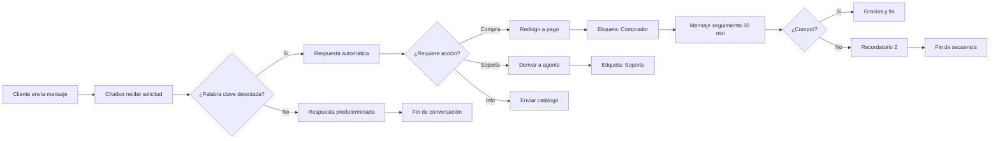

> **Actualización (2026-02-03)**
> Guía actualizada con nuevos pasos para el constructor visual de flujos, ejemplos prácticos de casos de uso reales, configuración de flujo de entrada de datos del usuario y chatbot de secuencia de ventas.

## ¿Qué es un Chatbot de WhatsApp y por qué usarlo?

Un chatbot de WhatsApp es una tecnología que permite mantener conversaciones automatizadas con tus clientes. Tú decides **qué, cuándo, por qué y cuánto** dirá. Es, en esencia, una herramienta de automatización empresarial.

Desde que un cliente realiza una consulta hasta que compra el producto deseado, todo ese proceso implica un recorrido. Cuando esto ocurre físicamente en una tienda, piensa en todos los pasos: recibirlos, responder sus preguntas, mostrarles diferentes productos según sus preferencias y finalmente cerrar la venta. Replicar estos pasos de manera confiable en línea es un gran desafío, especialmente cuando manejas un alto volumen de clientes. En la era tecnológica actual, lograr ese mismo éxito es más fácil de lo que imaginas: solo necesitas mantenerte actualizado.

> **El dato clave:** los chatbots de WhatsApp tienen una **tasa de apertura del 98%** y generan un **incremento del 156% en las tasas de conversión** en comparación con los canales tradicionales. Las marcas modernas están convirtiendo conversaciones en ingresos.

Grandes corporaciones como Nivea, Unilever y Flamingo ya han adoptado los chatbots de WhatsApp desde hace tiempo. La prueba está en los números: el **67% de los usuarios se sienten más seguros** comprando en negocios a los que pueden contactar por WhatsApp, y las tasas de conversión en WhatsApp son típicamente **3 veces más altas que las campañas de correo electrónico**.

> **¿Sabías que...?** Los mensajes de WhatsApp tienen una tasa de apertura del 98%, frente al 20% del email. Esto significa que prácticamente todos tus clientes verán tu mensaje.

## Construye tu Primer Chatbot de WhatsApp en Menos de 10 Minutos

Ahora veamos al grano: qué tan rápido puedes construir un chatbot incluso si no eres un experto en tecnología. Principalmente, necesitarás dos cosas:

1. **Una Cuenta de WhatsApp Business verificada (WABA)**
2. **Un Proveedor de Servicios Empresariales (BSP) sin código**

Asumiendo que tu WABA ya está configurada. Si no es así, puedes instalar WhatsApp Business y verificarlo con tu número móvil. En esta guía, todo el proceso se muestra utilizando **E-SMART360** como BSP.

> **Requisitos previos:**
  - Una cuenta de Meta Business Suite con acceso de administrador
  - Una WABA vinculada a tu cuenta de Meta Business Suite o página de perfil
  - Navegador web actualizado (Chrome, Firefox o Edge)

### Paso 1: Conectar tu Cuenta de WhatsApp

### Accede al panel de E-SMART360

Abre tu cuenta de E-SMART360 en el navegador y desde el menú lateral izquierdo:
  - Selecciona **Conectar Cuenta → Conectar WhatsApp**
  - Verás dos opciones. Selecciona la opción de **integración en un solo clic**

### Autenticación con Facebook

Haz clic y serás redirigido a una página de inicio de sesión de Facebook. Completa la información requerida usando la cuenta que tenga acceso de administrador a tu Meta Business Suite.

### Confirma la conexión

Sigue las instrucciones adicionales en pantalla y guarda los cambios. Una vez verificado, E-SMART360 finalizará el enlace. Revisa tu panel de control para confirmar que tu cuenta de WhatsApp está vinculada.

> La segunda opción de conexión requiere más tiempo y pasos manuales. Te recomendamos usar la primera opción de integración en un solo clic para ahorrar tiempo. Si necesitas la configuración manual, consulta nuestra guía de conexión paso a paso en la sección de recursos.

### Paso 2: Acceder al Constructor de Bots

Ahora llega la parte interesante: diseñar exactamente cómo interactuará el chatbot con tus clientes sin escribir una sola línea de código. Es hora de conocer el **Gestor de Bots**.

### Crea un nuevo bot

Desde el panel de control:
  - Haz clic en **Gestor de Chatbots** → Navega al menú **Bot de WhatsApp**
  - Ve a la sección **Respuestas del Bot** y haz clic en **Crear**

### Explora el lienzo visual

Instantáneamente aparecerá un lienzo de construcción visual de flujos. La zona marcada muestra los diversos componentes que puedes usar para configurar las acciones de tu chatbot.

### Diseña tu primer saludo

Arrastra y suelta los componentes para comenzar con un mensaje de bienvenida simple. Una vez que te familiarices con esta interfaz de **arrastrar y soltar**, podrás manejar desde preguntas frecuentes y atención al cliente, hasta ejecutar campañas de ventas completas.

### Guarda y prueba

Guarda el flujo y prueba el chatbot para verificar que funcione correctamente. Abre WhatsApp, envía un mensaje a tu número de negocio y observa la respuesta.

¡Excelente! Has construido un chatbot de WhatsApp funcional. Pero esto es solo el comienzo. Gradualmente, podrás dominar muchas más funciones avanzadas, como gestionar flujos de entrada de usuario, configurar mensajes en secuencia, integrar tu catálogo y datos de Google Sheets. Podrás automatizar completamente tu **estrategia de marketing de WhatsApp** sin necesidad de conocimientos de programación.

## Cómo Crear un Chatbot Basado en Palabras Clave

Una de las formas más comunes de activar tu chatbot es mediante palabras clave. Así es como puedes configurarlo en E-SMART360:

### Nombra tu chatbot

Localiza el componente **Iniciar Flujo del Bot**. Haz doble clic para abrir la ventana de configuración. Ingresa un nombre en el campo Título y, opcionalmente, elige una etiqueta y selecciona una secuencia.

### Configura una palabra clave

En la misma ventana, ingresa una palabra clave para activar el bot (por ejemplo, "Hola", "Inicio", "Ayuda").

  

### Coincidencia exacta

Si seleccionas **Coincidencia Exacta de Palabra Clave**, el bot solo se activará con esa palabra específica. Útil para comandos precisos como "catálogo" o "precios".
    
### Coincidencia parcial

Si seleccionas **Coincidencia de Cadena**, el bot se activará con cualquier frase u oración que contenga esa palabra clave. Por ejemplo, si la palabra clave es "Hola", el bot se activará con "Hola, necesito ayuda".
    
### Crea un mensaje interactivo

Arrastra una conexión desde la salida del componente Iniciar Flujo. Suéltala en el lienzo para revelar las opciones de componentes. Selecciona el **Componente Interactivo**. Haz doble clic para abrir el modal de configuración. Completa el encabezado, cuerpo y pie del mensaje (el cuerpo es obligatorio). Establece un tiempo de retardo si lo deseas.

### Agrega botones interactivos

Arrastra un conector desde el componente interactivo. Aparecerá un **Componente de Botón en Línea**. Haz doble clic, ingresa el texto del botón y selecciona una acción (Enviar Mensaje, Iniciar un Flujo, Acción por Defecto del Sistema, etc.). Repite el proceso para agregar más botones.

### Configura mensaje final y guarda

Selecciona el **Componente de Texto** para el mensaje final. Configúralo y guarda. Haz clic en el botón **Guardar** en la esquina superior derecha del lienzo para guardar toda la configuración del bot.

### Prueba tu chatbot

Abre WhatsApp, escribe la palabra clave que configuraste y envíala. Observa la respuesta del chatbot para confirmar que funciona correctamente.

> **Consejos para palabras clave efectivas:**
  - Usa palabras que tus clientes usarían naturalmente
  - Incluye sinónimos para cubrir diferentes formas de consulta
  - Evita palabras demasiado cortas que puedan generar falsos positivos
  - Prueba cada palabra clave antes de activar el bot

## Cómo Construir un Chatbot de Seguimiento Automático

Un chatbot de seguimiento envía mensajes de recordatorio a usuarios que han interactuado con tu chatbot pero no han completado una acción, como realizar una compra o registrarse. Ayuda a las empresas a mantenerse en contacto con clientes potenciales y mejora las tasas de conversión.

> **Beneficios del seguimiento automatizado:**
  - Ahorra tiempo automatizando recordatorios
  - Aumenta las ventas y conversiones
  - Asegura que los usuarios no olviden tu oferta
  - Funciona 24/7 sin esfuerzo manual
  - Mejora la retención de clientes a largo plazo

### Crea el flujo del chatbot de seguimiento

Ve al panel de E-SMART360 → **Gestor de Bots** → **Respuestas del Bot** → **Crear**. Nombra el chatbot con un nombre reconocible, como "Bot de Seguimiento". Asegúrate de que se active cuando un usuario interactúe con un mensaje relacionado con productos.

### Configura mensajes interactivos

Agrega un bloque interactivo a tu chatbot. Crea un mensaje como: *"¿Te interesaría nuestro producto?"* con botones de Sí y No. Si el usuario selecciona Sí, proporciónale un enlace de pago. Si selecciona No, finaliza la conversación u ofrece asistencia adicional.

### Aplica etiquetas para rastrear acciones

Cuando un usuario haga clic en "Comprar Ahora", aplica una etiqueta llamada "ComprarAhora". Si el usuario no hace clic en el botón, no recibe esta etiqueta. Usa esta etiqueta para determinar quién necesita un recordatorio de seguimiento.

### Configura la secuencia de seguimiento

Arrastra y suelta el conector desde la opción 'Suscribir a Secuencia' del botón Comprar Ahora para iniciar una nueva secuencia de seguimiento. Configura un mensaje de recordatorio si el usuario no compra dentro de 30 minutos (o el tiempo que elijas). Agrega una condición para hacer seguimiento según si seleccionaron el botón "Comprar Ahora" o no. Si es falso, envía el mensaje de seguimiento.

### Repite el proceso de recordatorios

Puedes repetir el proceso para enviar otro recordatorio si aún no han comprado. Programa múltiples recordatorios espaciados en el tiempo para maximizar las conversiones sin saturar al usuario. Por ejemplo: primer recordatorio a los 30 minutos, segundo a las 2 horas, tercero a las 24 horas.

### Exporta el flujo del chatbot

Puedes exportar tu flujo de chatbot y compartirlo con otros miembros de tu equipo o usarlo como plantilla para futuros bots. El archivo exportado puede importarse en otras cuentas de E-SMART360.

> **Programación de mensajes:** WhatsApp permite enviar mensajes de seguimiento ilimitados dentro de las primeras 24 horas. Después de 24 horas, solo se pueden enviar mensajes de plantilla preaprobados. Programa tus recordatorios estratégicamente para evitar saturar a los usuarios.

## Cómo Recopilar Datos de Usuarios Sin Formularios en WhatsApp

Una de las funciones más potentes del chatbot de E-SMART360 es la capacidad de recopilar datos de usuarios mediante un flujo conversacional, sin necesidad de formularios tradicionales. En lugar de pedir al usuario que llene un formulario, el chatbot hace preguntas una por una y almacena las respuestas.

> **¿Qué es el flujo de entrada de usuario?** Es una automatización del chatbot que recopila datos del usuario paso a paso a través de mensajes. En lugar de usar formularios, los usuarios responden a indicaciones automatizadas de manera conversacional, haciendo el proceso fluido y amigable.

### ¿Por qué usar el flujo de entrada de datos?

- **Mayor participación:** los usuarios prefieren interacciones de chat antes que llenar formularios
- **Eficiencia de automatización:** no se necesita ingreso manual de datos
- **Flexibilidad de integración:** sincroniza los datos recopilados con hojas de cálculo, CRMs o herramientas de automatización

### Configuración del flujo de entrada

### Crea un nuevo chatbot para el flujo de entrada

Ve a **Gestor de Bots** → **Respuestas del Bot** → **Crear**. Asígnale un nombre como "Flujo de Entrada de Usuario". Configura una palabra clave (por ejemplo, "registro") para activar el chatbot.

### Agrega el elemento de flujo de entrada

Arrastra el elemento **Flujo de Entrada de Usuario** al lienzo. Este elemento despliega el componente de preguntas. Puedes elegir dónde almacenar los datos: URL de Webhook o Google Sheets.

### Configura las preguntas

Agrega las preguntas que deseas hacer al usuario:

  1. **Primera pregunta:** solicita el correo electrónico del usuario
     - Tipo de respuesta: Email (validado mediante expresiones regulares)
  2. **Segunda pregunta:** pregunta si su negocio está registrado
     - Tipo de respuesta: Opción múltiple (Sí/No)
  3. **Preguntas adicionales:** agrega tantas como necesites (nombre, teléfono, ubicación, etc.)
  4. **Mensaje de cierre:** finaliza el flujo con un mensaje de agradecimiento

### Guarda y prueba

Guarda la configuración y abre WhatsApp. Envía la palabra clave que configuraste. Verás que el chatbot comienza a hacer las preguntas una por una y recopila las respuestas.

### Exporta los datos recopilados

Desde la configuración del chatbot, puedes encontrar los datos recopilados y exportarlos como hoja de cálculo para su análisis posterior.

### Email

Tipo de respuesta validado con expresiones regulares. El chatbot verifica que el formato del correo sea válido antes de continuar.
  
### Opción múltiple

Preguntas con respuestas predefinidas (Sí/No, selección de opciones). Ideal para segmentar usuarios.
  
### Texto libre

Respuestas abiertas donde el usuario escribe libremente. Útil para recoger opiniones o comentarios.
  
### Número telefónico

Validación de formato numérico. Perfecto para recopilar números de contacto adicionales.
  
> **Consejos para el flujo de entrada:**
  - Mantén las preguntas concisas y claras
  - Valida las respuestas para asegurar una recopilación precisa de datos
  - Personaliza los mensajes de seguimiento según las respuestas obtenidas
  - Prueba y actualiza el chatbot regularmente para mejorar la eficiencia

## Integración del Catálogo de Productos para Vender en WhatsApp

Para vender productos directamente en WhatsApp, puedes integrar tu catálogo de productos con el chatbot. Esto permite a los clientes ver productos, consultar precios y realizar compras sin salir de la aplicación.

### Crea tu catálogo en Meta Commerce Manager

Ve a [business.facebook.com](https://business.facebook.com/) y selecciona 'Commerce' en el menú de Herramientas. Haz clic en tu cuenta de negocio y presiona 'Comenzar'. Elige 'Ecommerce', decide si tu negocio es en línea o local, y procede. Agrega tus productos manualmente o conéctate con plataformas como Shopify.

### Vincula el catálogo a WhatsApp

Después de crear el catálogo, ve al WhatsApp Manager, selecciona 'Catálogo' y haz clic en 'Conectar'. Una vez conectado, el catálogo estará disponible en E-SMART360.

### Sincroniza en E-SMART360

Dentro de E-SMART360, ve a la sección de WhatsApp y haz clic en 'Sincronizar' para vincular tu número. Luego accede al menú **Catálogo E-Commerce** para encontrar tu catálogo sincronizado.

### Configura el chatbot para mostrar productos

En el Gestor de Bots, puedes crear flujos que muestren productos del catálogo. Cuando un usuario pregunte por un producto, el chatbot puede enviar imágenes, descripciones y precios directamente desde el catálogo.

> **Beneficios clave del catálogo integrado:**
  - **Interacción sin esfuerzo:** respuestas instantáneas automatizadas
  - **Recomendaciones personalizadas:** sugiere productos según preferencias del usuario
  - **Disponibilidad 24/7:** el chatbot siempre está listo para ayudar
  - **Mayores conversiones:** conversaciones fluidas que llevan a más ventas
  - **Escalabilidad:** atiende múltiples clientes simultáneamente

## Impacto de los Chatbots de WhatsApp en el Mundo Real

El mundo empresarial del siglo XXI se mueve a una velocidad vertiginosa. Si un cliente saluda y no recibe atención inmediata, ese cliente se pierde en un instante. Aquí es donde brilla la ventaja de la tecnología.

Los datos confirman que, aunque existen varias plataformas de comunicación, **WhatsApp es actualmente la más popular y la más efectiva**. Por eso, las grandes industrias ya tratan a WhatsApp como su principal herramienta de marketing. En la era de la automatización, la inteligencia artificial ha llevado esto a un nivel completamente nuevo. Como resultado, el uso de chatbots de WhatsApp está **disparado**.

### El Éxito de Nivea: 207% del Objetivo Alcanzado

Nivea enfrentó un desafío familiar para toda gran marca: la **participación orgánica masiva** para un nuevo producto. La solución no fue otra campaña publicitaria, sino una inversión estratégica en automatización. Lanzaron la **Campaña Cocoa Shades**, anclada completamente en un **Chatbot de WhatsApp**.

El gancho era simple y poderoso. Los usuarios enviaban una foto al bot y recibían instantáneamente una versión estilizada única de sí mismos, perfectamente adaptada a su tono de piel. Esto encendió inmediatamente la campaña y Nivea obtuvo la exposición deseada. Como resultado, un simple chatbot de WhatsApp logró un **asombroso 207% del objetivo de alcance**.

### El Éxito de Unilever: Ventas 14 Veces Más Altas

Unilever necesitaba **alcanzar una presencia de marca de alto impacto** para su nueva línea de productos. Por eso, **Unilever también optó por la misma estrategia que Nivea**. Crearon **MadameBot**, su propio chatbot de WhatsApp.

Para despertar la curiosidad inicial, cubrieron São Paulo con 1000 carteles que mostraban el número de WhatsApp. Cuando los consumidores interesados se comunicaban, MadameBot tomaba el control. Entregaba consejos personalizados de cuidado de productos mientras presentaba los nuevos artículos. Los clientes que avanzaban en la interacción eran recompensados con descuentos y envío gratis. Muy pronto, este simple chatbot conversacional impulsó las ventas **14 veces más**.

### Nivea - Campaña Cocoa Shades

- **Objetivo:** Alcance orgánico masivo
  - **Estrategia:** Chatbot con transformación de fotos
  - **Resultado:** 207% del objetivo de alcance
  - **Clave del éxito:** Interacción lúdica y personalizada

### Unilever - MadameBot

- **Objetivo:** Presencia de marca de alto impacto
  - **Estrategia:** Chatbot con consejos personalizados
  - **Resultado:** Ventas 14 veces más altas
  - **Clave del éxito:** Descuentos y envío gratis como incentivo

## Configuración Avanzada: Respuesta para Mensajes No Reconocidos

Es importante configurar qué sucede cuando un usuario envía un mensaje que tu chatbot no reconoce. Puedes establecer una respuesta predeterminada y controlar la frecuencia con la que se envía para evitar respuestas repetitivas.

### Configura el mensaje por defecto

En el Gestor de Bots, busca la sección **Respuesta Sin Coincidencia**. Allí puedes definir un mensaje genérico como: *"Lo siento, no entendí tu mensaje. ¿Puedes reformularlo? Escribe 'Ayuda' para ver las opciones disponibles."*

### Controla la frecuencia

Configura el límite de frecuencia para que el mensaje de "sin coincidencia" no se envíe más de una vez cada cierto período. Esto evita molestias al usuario y mantiene una experiencia de conversación fluida.

## Agregando Botones CTA a tus Mensajes

Los botones con llamada a la acción (CTA) permiten a los usuarios realizar acciones específicas directamente desde el chat, mejorando la tasa de interacción.

### Accede al editor de mensajes

Desde el Gestor de Bots, selecciona el mensaje donde deseas agregar botones CTA.

### Agrega botones interactivos

En el editor, selecciona la opción de agregar botones. Puedes elegir entre:
  - **Botón de llamada telefónica:** inicia una llamada al hacer clic
  - **Botón de URL:** abre un enlace en el navegador
  - **Botón de respuesta rápida:** envía un texto predefinido

### Personaliza cada botón

Para cada botón, configura:
  - **Texto del botón:** máximo 20 caracteres
  - **Acción:** define qué sucede al hacer clic
  - **Parámetros:** URL, número telefónico o texto de respuesta

> **Mejores prácticas para botones CTA:**
  - Usa verbos de acción: "Comprar Ahora", "Ver Catálogo", "Hablar con Agente"
  - Limita a 3 botones por mensaje (máximo permitido por WhatsApp)
  - Asegúrate de que los enlaces sean accesibles y funcionen correctamente
  - Prueba cada botón antes de publicar el flujo

## Automatización de Conversaciones de Ventas

Una vez que tu chatbot está activo, puede manejar consultas de clientes, sugerir productos y guiarlos a través del proceso de compra de forma completamente automática. Puedes guardar el flujo de tu chatbot y activarlo en el Constructor de Flujos para interactuar con los clientes.

### Configuración de una Secuencia de Ventas

### Crea un flujo de ventas

Desde el Gestor de Bots, crea un nuevo chatbot y nómbralo "Secuencia de Ventas". Define las palabras clave que activarán el flujo, como "comprar", "productos" o "precios".

### Diseña el recorrido del cliente

El chatbot debe guiar al cliente paso a paso:
  1. **Saludo y bienvenida** con opciones de productos
  2. **Consulta de preferencias** para recomendar productos específicos
  3. **Presentación del producto** con imagen, descripción y precio
  4. **Botón de compra** que redirige al pago
  5. **Mensaje de confirmación** con detalles del pedido

### Aplica etiquetas de seguimiento

Configura etiquetas automáticas para cada etapa:
  - "Interesado" cuando el usuario pregunta por un producto
  - "Carrito" cuando selecciona un producto
  - "Comprador" cuando completa la compra
  - "Abandonó" si inició pero no completó la compra

### Configura recordatorios automáticos

Para los usuarios etiquetados como "Abandonó", programa una secuencia de seguimiento con recordatorios automáticos. El primer recordatorio puede enviarse a los 30 minutos, el segundo a las 2 horas y el tercero a las 24 horas.

## Consejos y Solución de Problemas

### Mi chatbot no se activa con las palabras clave

**Posible causa:** La palabra clave no está configurada correctamente en el componente de activación. Revisa que esté escrita sin errores tipográficos y que el tipo de coincidencia (exacta o parcial) sea el adecuado para tu caso de uso. También verifica que el bot esté en estado "Activo" y no en "Borrador".

### Los botones no aparecen en el mensaje

**Solución:** Asegúrate de que los botones estén correctamente vinculados a un componente interactivo. Verifica que cada botón tenga una acción asignada. Recuerda que WhatsApp permite máximo 3 botones por mensaje interactivo.

### El mensaje final no se envía

**Posible causa:** El Componente de Texto no está agregado o no se guardó correctamente. Revisa que el flujo tenga una conexión completa desde el inicio hasta el final.

### Los cambios no se guardan

**Solución:** Siempre haz clic en el botón **Guardar** en la esquina superior derecha del lienzo antes de salir del constructor visual. El autoguardado solo captura cambios temporales.

### ¿Puedo usar el chatbot para enviar campañas masivas?

**Sí.** El chatbot puede enviar mensajes masivos a todos tus clientes a la vez usando la función de Transmisión de WhatsApp. Sin embargo, debes cumplir con las políticas de WhatsApp sobre mensajes comerciales y respetar los límites de transmisión según tu nivel de calidad y la franja horaria.

### ¿Puedo integrar mi catálogo de productos o Google Sheets?

**Sí.** E-SMART360 permite la integración con catálogos de productos y Google Sheets. Puedes mostrar productos directamente en el chat, enviar ofertas personalizadas basadas en datos de hojas de cálculo, y automatizar respuestas con información actualizada de tu inventario. No se requieren conocimientos de programación.

### ¿Es WhatsApp mejor que Messenger o Email para automatización?

**Sí, considerablemente.** WhatsApp cuenta con una tasa de conversión 3 veces más alta que el email y Messenger. Además, la tasa de apertura del 98% supera ampliamente el 20% del email. Por eso la adopción de chatbots de WhatsApp está creciendo rápidamente entre empresas de todos los tamaños.

## Ejemplos Prácticos

### Ejemplo: Tienda de Ropa Online

**Problema:** Una tienda de ropa recibía decenas de consultas diarias sobre tallas, disponibilidad y envíos.
  
  **Solución con chatbot:**
  1. Configuraron palabras clave como "tallas", "envío", "disponible"
  2. Crearon respuestas automáticas con la información actualizada
  3. Integraron el catálogo de productos para mostrar imágenes y precios
  4. Agregaron botón "Comprar Ahora" que redirige al carrito
  5. Configuraron un flujo de entrada para recopilar correos electrónicos de clientes interesados
  
  **Resultado:** Redujeron consultas manuales en un 70% y aumentaron las ventas nocturnas en un 35%.

### Ejemplo: Clínica Dental

**Problema:** Pacientes olvidaban confirmar citas o preguntaban repetidamente los mismos datos.
  
  **Solución con chatbot:**
  1. Bot de bienvenida con opciones: Agendar Cita / Horarios / Ubicación
  2. Sistema de recordatorio automático 24h antes de la cita
  3. Seguimiento post-consulta preguntando por la experiencia
  4. Integración con Google Calendar para disponibilidad en tiempo real
  5. Flujo de entrada para recopilar datos del paciente antes de la primera visita
  
  **Resultado:** Reducción del 60% en ausencias a citas y aumento del 40% en reseñas positivas.

## Preguntas Frecuentes Adicionales

### ¿Qué necesito para construir un chatbot de WhatsApp?

Una cuenta de WhatsApp Business verificada, una cuenta de Meta Business Manager con acceso de administrador y una cuenta en E-SMART360. No se requieren conocimientos de programación.

### ¿Cuánto tiempo toma configurar un chatbot de WhatsApp?

Típicamente toma unos 15 minutos configurar un chatbot básico de WhatsApp. Con el constructor visual de arrastrar y soltar, el proceso es rápido e intuitivo.

### ¿El chatbot de E-SMART360 es gratuito?

E-SMART360 ofrece un modelo freemium. Puedes registrarte gratis y probar las funciones básicas. Existen diversos planes de precios según tu nivel de uso y necesidades específicas.

### ¿Qué tasa de apertura tienen los mensajes de WhatsApp?

Los mensajes de WhatsApp tienen una tasa de apertura del 98%, significativamente más alta que el email (20%) y otras plataformas de mensajería. Esto los convierte en el canal más efectivo para comunicación empresarial.

### ¿Cómo manejo conversaciones complejas que el chatbot no puede resolver?

E-SMART360 permite la transferencia sin interrupciones a un agente humano cuando el chatbot no puede resolver la consulta. Puedes configurar palabras clave como "agente" o "humano" para activar la derivación, o establecer reglas basadas en la intención del usuario.

### ¿Qué tipos de respuestas puedo usar en el chatbot?

El chatbot soporta múltiples tipos de mensajes: texto plano, mensajes interactivos con botones, mensajes con imágenes o video, listas de opciones, mensajes con CTA (llamada telefónica, URL) y carruseles de productos. Cada tipo tiene un propósito específico y puede combinarse para crear experiencias ricas.

### ¿Cómo exportar los datos recopilados por el chatbot?

Desde la configuración de tu chatbot en el Gestor de Bots, puedes acceder a los datos recopilados a través de los flujos de entrada. Los datos pueden exportarse como hoja de cálculo (CSV/Excel) para su análisis o integrarse directamente con Google Sheets para visualización en tiempo real.

## Mensajes de Secuencia: Automatiza Campañas Completas

Los mensajes de secuencia son conjuntos preconfigurados de mensajes automatizados que se envían a los suscriptores según activadores y horarios predefinidos. Estos mensajes ayudan a mantener el compromiso, nutrir leads y automatizar respuestas de manera eficiente.

### Tipos de secuencias que puedes crear

### Secuencias de Bienvenida

Atrae a nuevos suscriptores con saludos personalizados. Cuando un usuario envía un mensaje por primera vez, una secuencia de bienvenida puede presentar tu negocio, mostrar tus productos principales y guiar al usuario hacia la siguiente acción.

### Secuencias de Ventas

Guía a los clientes potenciales a través del embudo de ventas. Cada mensaje acerca al usuario un paso más a la compra: presentación, beneficios, oferta especial, y llamado a la acción.

### Secuencias Educativas

Proporciona contenido valioso a los suscriptores. Cursos cortos, consejos de uso, tutoriales y más. Ideal para posicionar tu marca como autoridad en el sector.

### Secuencias Promocionales

Anuncia nuevos productos, descuentos o eventos. Programa el lanzamiento en el momento óptimo para maximizar el impacto.

### Beneficios de usar mensajes de secuencia

- **Experiencia del cliente mejorada:** las respuestas automatizadas garantizan una interacción instantánea
- **Mayor eficiencia:** reduce la carga de trabajo manual automatizando tareas repetitivas
- **Mejores conversiones:** nutre leads y mejora las tasas de conversión con mensajes oportunos
- **Mayor compromiso:** mantiene a los usuarios interesados con seguimientos puntuales
- **Optimización basada en datos:** analiza el rendimiento y refina las secuencias según las métricas

### Cómo configurar una campaña de mensajes de secuencia

### Crea una nueva secuencia

Ve al **Constructor de Flujos** y selecciona 'Nueva Secuencia'. Asígnale un nombre descriptivo.

### Configura el tiempo de los mensajes

Define los intervalos entre cada mensaje. Por ejemplo: mensaje 1 al momento, mensaje 2 después de 1 hora, mensaje 3 después de 24 horas.

### Estructura los mensajes

Diseña cada mensaje con texto, imágenes y llamadas a la acción. Asegúrate de que cada mensaje aporte valor y tenga un propósito claro dentro de la secuencia.

### Activa la secuencia

Guarda y activa la secuencia. El sistema comenzará a enviar los mensajes automáticamente según la configuración.

### Monitorea el rendimiento

E-SMART360 proporciona analíticas para rastrear la participación, tasas de respuesta y efectividad de la campaña. Ajusta las secuencias según los resultados.

> **Mejores prácticas para secuencias:**
  - Mantén los mensajes concisos y relevantes
  - Personaliza las interacciones usando datos del usuario
  - Programa los mensajes estratégicamente para mantener el compromiso
  - Usa plantillas de mensajes preaprobadas para mensajes fuera de la ventana de 24 horas
  - Analiza y refina continuamente las secuencias basándote en los datos de rendimiento

## Recuperación de Carritos Abandonados en WooCommerce

Si tienes una tienda WooCommerce, puedes recuperar carritos abandonados automáticamente mediante WhatsApp. Cuando un cliente agrega productos a su carrito pero no completa la compra, E-SMART360 puede enviarle un recordatorio personalizado.

### Cuándo se considera un carrito abandonado

Un carrito se considera abandonado cuando un cliente:
- Agrega productos al carrito pero cierra el navegador sin pagar
- Inicia el proceso de pago pero no lo completa
- Abandona la página después de ver el total con envío
- Sale del sitio sin finalizar la transacción

### Cómo configurar la recuperación de carritos

### Crea una plantilla de mensaje

Ve al **Gestor de Bots** → **Plantillas de Mensaje** → **Crear**. Ingresa un nombre, configura el idioma y selecciona la categoría (Marketing). Redacta el mensaje incluyendo un descuento o incentivo. Agrega un botón de llamada a la acción que enlace de vuelta al carrito. Guarda y sincroniza la plantilla.

### Configura el flujo webhook

Ve a **Flujo Webhook** en el panel de E-SMART360. Haz clic en **Crear** e ingresa un nombre para el flujo. Selecciona la cuenta de WhatsApp y la plantilla de mensaje aprobada. Haz clic en **Crear Webhook** y copia la URL generada.

### Instala el plugin de WooCommerce

En E-SMART360, ve a **Integraciones** → **E-Commerce** y descarga el plugin **WooCommerce Abandoned Cart Webhook**. Instálalo y actívalo en WordPress. Ve a **Configuración** en el panel de WordPress y pega la URL del Webhook en el campo correspondiente. Guarda los cambios.

### Configura el mapeo de datos

Desde la campaña de Flujo Webhook, ve a "Mapeo de Respuesta Webhook". Asigna el número de teléfono al campo correspondiente y configura cualquier campo adicional necesario. Guarda el flujo.

> **Nota importante:** WhatsApp no permite el signo "+" en los números de teléfono. Si tus datos incluyen el "+", ve a la sección de **Formateadores de Datos** en el Flujo Webhook, configura una nueva acción de **Recortar a la Izquierda** para el campo "+" y guárdala.

## Integración con Google Sheets y Otras Herramientas

E-SMART360 se integra con múltiples herramientas para potenciar la automatización de tu chatbot de WhatsApp:

### Google Sheets

Importa contactos desde hojas de cálculo, sincroniza datos de clientes en tiempo real y exporta las respuestas recopiladas por tu chatbot directamente a Google Sheets para su análisis.

### Zapier / Pabbly

Conecta E-SMART360 con más de 3000 aplicaciones mediante Zapier o Pabbly. Automatiza flujos de trabajo complejos sin programación.

### Shopify / WooCommerce

Integra tu tienda online para enviar notificaciones de pedidos, recuperar carritos abandonados y sincronizar tu catálogo de productos automáticamente.

## Configuración de Etiquetas y Campos Personalizados

Las etiquetas y campos personalizados te permiten segmentar a tus clientes y personalizar las interacciones del chatbot.

### Crea etiquetas personalizadas

Ve al **Gestor de Suscriptores** → **Campos y Etiquetas**. Crea etiquetas como "Cliente VIP", "Nuevo Lead", "Carrito Abandonado", etc.

### Aplica etiquetas automáticamente

En el constructor de flujos del chatbot, puedes configurar que se apliquen etiquetas automáticamente cuando un usuario realice ciertas acciones, como hacer clic en un botón o responder una pregunta.

### Usa etiquetas para segmentar

Las etiquetas te permiten enviar mensajes específicos a grupos de usuarios. Por ejemplo, envía un descuento especial solo a los "Cliente VIP" o un recordatorio solo a "Carrito Abandonado".

## Ejemplo Adicional: Agencia de Marketing Digital

### Ejemplo: Agencia de Marketing Digital

**Problema:** Una agencia de marketing necesitaba capturar leads calificados de sus anuncios de Facebook y WhatsApp, pero perdía clientes potenciales porque no podía responder rápidamente a todas las consultas.
  
  **Solución con chatbot:**
  1. Configuraron un chatbot de bienvenida que se activaba automáticamente al recibir el primer mensaje
  2. El chatbot hacía preguntas de calificación: tipo de negocio, presupuesto, servicios requeridos
  3. Los leads calificados se etiquetaban como "Lead Caliente" y se transferían al equipo de ventas
  4. Los leads no calificados se añadían a una secuencia de nutrición con contenido educativo
  5. Integraron Google Sheets para tener un registro centralizado de todos los leads capturados
  
  **Resultado:** Capturaron 3 veces más leads calificados y redujeron el tiempo de respuesta inicial de 4 horas a 5 segundos.

## Conclusión

En ventas y marketing, un chatbot de WhatsApp no es solo una puerta de entrada: es la apertura colosal que transforma el potencial empresarial en ganancias tangibles. Una vez que cruzas ese umbral, te sorprenderá la escala de posibilidades que este chatbot desbloquea.

Como dice el refrán: **"De grandes bellotas crecen grandes robles."** Este chatbot tiene exactamente ese poder. Puede **cambiar fundamentalmente la trayectoria de tu negocio**. Los principales actores del mercado ya lo están demostrando.
