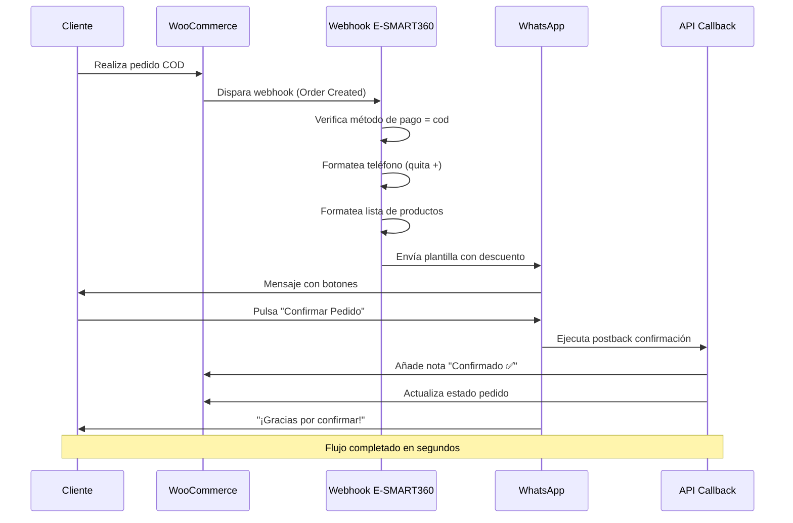

> Esta guía te muestra cómo transformar automáticamente los pedidos de WooCommerce pagados contra reembolso (COD) en pedidos prepago, enviando mensajes personalizados de WhatsApp con cupones de descuento justo después de que se realice el pedido.

## Resumen Ejecutivo

La función **Webhook Workflow** de E-SMART360 te permite convertir automáticamente pedidos **Contra Reembolso (COD)** de WooCommerce en **pedidos prepago** mediante el envío de mensajes de WhatsApp con códigos de descuento u ofertas especiales.

Cuando un cliente realiza un pedido COD, WooCommerce activa un webhook que envía los datos del pedido en tiempo real a E-SMART360. El sistema verifica el método de pago, formatea el número de teléfono, mapea los detalles de los productos, aplica condiciones y envía un mensaje de WhatsApp con una plantilla que incluye un código promocional, animando al cliente a cambiar de COD a pago anticipado. Cuando el cliente confirma o cancela mediante los botones de respuesta rápida, el sistema actualiza el pedido en WooCommerce automáticamente a través de las APIs de callback.


> **Beneficio clave:** Reduce drásticamente los pedidos falsos y mejora tu flujo de caja al incentivar el pago anticipado, ofreciendo descuentos exclusivos que el cliente recibe directamente en su WhatsApp.

## ¿Por Qué Convertir Pedidos COD a Prepago?

Los pedidos contra reembolso representan un desafío para cualquier tienda online. A continuación se detallan los principales problemas que este flujo resuelve:

- **Riesgo de fraude:** Pedidos falsos que nunca se recogen, generan costes operativos y pérdida de tiempo
- **Costes operativos:** Gastos de logística invertida cuando el pedido no se entrega (transporte ida y vuelta)
- **Flujo de caja:** El pago se recibe mucho después de enviar el producto, afectando la liquidez del negocio
- **Tasa de rechazo:** Hasta un 15-30% de los pedidos COD pueden ser rechazados en la entrega
- **Saturación del equipo:** La verificación manual de pedidos COD consume tiempo valioso del personal

Ofrecer un incentivo económico por adelantado a través de WhatsApp resuelve estos problemas de forma automática y personalizada, sin intervención manual.

## Requisitos Previos


### Integración WooCommerce activa

Asegúrate de tener WooCommerce correctamente instalado y conectado con E-SMART360. Consulta la guía de integración para WooCommerce para configurar la conexión entre ambas plataformas.
  
### Cuenta de WhatsApp Business API

Necesitas un número de teléfono registrado en WhatsApp Cloud API y conectado a tu cuenta de E-SMART360. Si aún no lo has hecho, sigue la guía de conexión de número de teléfono con Embedded Signup.
  
### Plantilla de mensaje aprobada

Las plantillas de mensaje de WhatsApp deben estar creadas y aprobadas por Meta antes de poder usarlas en un flujo automatizado. Sin una plantilla aprobada, el sistema no podrá enviar los mensajes.
  
## Paso 1: Crear la Plantilla de Mensaje en E-SMART360

El primer paso es crear una plantilla de mensaje que incluya un código de descuento y los detalles del pedido. La plantilla es el vehículo a través del cual tu oferta de descuento llegará al cliente.

### Acceder al Gestor de Bots

Para comenzar, ingresa a tu cuenta de E-SMART360 y sigue estos pasos.


### Accede al Gestor de Bots

Ve al **Panel de Control** de E-SMART360. En la barra lateral izquierda, haz clic en el menú **Gestor de Bots** (Bot Manager). Se cargará la página del Gestor de Bots de WhatsApp.
  
### Ve a Plantillas de Mensaje

Dentro del Gestor de Bots, haz clic en la opción **Plantilla de Mensaje** (Message Template). Se abrirá la página de configuración de plantillas donde podrás ver las plantillas existentes y crear nuevas.
  
### Crea una nueva plantilla

Haz clic en el botón **Crear** (Create). Aparecerá un formulario modal titulado "Plantilla de Mensaje". Este formulario te permitirá configurar el nombre de la plantilla, las variables, el cuerpo del mensaje y los botones de respuesta rápida.
  
### Configura las variables de la plantilla

Crea dos variables que se usarán en el cuerpo del mensaje:
    
      - <strong>Lista de Productos (Product List):</strong> Contendrá los nombres de los productos que el cliente ha pedido
      - <strong>Precio Total (Total Price):</strong> Contendrá el total a pagar por el pedido
    
  
### Configura el cuerpo de la plantilla

Proporciona un nombre en el campo **Nombre de la plantilla** (Template Name). Escribe el mensaje en el **cuerpo del mensaje** insertando las variables que creaste. El mensaje debe incluir un código de descuento atractivo y mencionar los productos del pedido.
  
### Añade botones de respuesta rápida

Es importante añadir botones de respuesta rápida para que el cliente pueda interactuar con el mensaje. Añade los siguientes botones:
    
      - <strong>"Confirmar Pedido" (Confirm Order):</strong> Para que el cliente acepte la oferta y convierta su pedido a prepago
      - <strong>"Cancelar Pedido" (Cancel Order):</strong> Para que el cliente cancele el pedido si no está interesado
    
  
### Guarda la plantilla

Haz clic en **Guardar** (Save) para guardar la plantilla completa con todos los elementos configurados.
  
### Espera la aprobación de Meta

Después de guardar, la plantilla se enviará a Meta para su revisión. Haz clic en el botón **Verificar estado** (Check Status) para comprobar el estado de la plantilla. Solo podrás usar la plantilla cuando su estado sea **aprobado** (approved).
  

> La aprobación de plantillas por parte de Meta puede tardar desde unos minutos hasta 24 horas. Asegúrate de que el contenido cumple con las políticas de mensajería de Meta para evitar rechazos. Las principales causas de rechazo incluyen: contenido engañoso, promesas poco claras, errores ortográficos y uso incorrecto de mayúsculas.

### Ejemplo de Plantilla

A continuación se muestra un ejemplo de cómo podría verse tu plantilla una vez configurada:

```
Cuerpo del mensaje:
¡Gracias por tu pedido {{1}} por {{2}}! 🎉

Si pagas ahora online, obtén un 15% de descuento
con el código {{3}}.

¿Confirmas tu pago anticipado?

Botones:
[Confirmar Pedido] [Cancelar Pedido]
```

### Variables Recomendadas para la Plantilla

| Variable | Descripción | Ejemplo |
|----------|-------------|---------|
| `{{1}}` | Lista de productos del pedido | "Zapatillas Nike, Camiseta deportiva" |
| `{{2}}` | Precio total del pedido | "$45.90" |
| `{{3}}` | Código de descuento personalizado | "PREPAGO15" |

### Consideraciones para la Aprobación de Plantillas


### Directrices para el contenido de la plantilla

1. **Claridad:** El propósito del mensaje debe ser evidente desde las primeras palabras. Indica claramente que se trata de una oferta de descuento por pago anticipado.
2. **Precisión:** No incluyas información engañosa. El descuento debe ser real y aplicable bajo las condiciones que describes.
3. **Ortografía:** Revisa cuidadosamente la ortografía y gramática. Meta rechaza sistemáticamente plantillas con errores.
4. **Límite de caracteres:** El cuerpo del mensaje tiene un límite de 1024 caracteres. Los botones de respuesta rápida tienen un límite de 20 caracteres cada uno (incluyendo espacios).
5. **Idioma:** La plantilla debe estar en el mismo idioma que usará tu audiencia. No mezcles idiomas en una misma plantilla.
6. **Sin URLs acortadas:** Si incluyes enlaces, utiliza URLs completas y verificables. Las URLs acortadas suelen ser rechazadas.
7. **Botones funcionales:** Asegúrate de que los botones de respuesta rápida tengan acciones asociadas (postbacks) que funcionen correctamente.

## Paso 2: Configurar Postbacks para Confirmación de Pedido

Necesitas crear postbacks para los botones de respuesta rápida. Los postbacks son acciones automatizadas que se ejecutan cuando el cliente pulsa un botón en el mensaje de WhatsApp. Cada botón debe tener su propio postback.


### Configura un flujo de bot inicial


      - Ve al **Gestor de Bots** → **Flujo del Bot** (Bot Flow).
      - Agrega un componente **Iniciar flujo de bot** (Start Bot Flow) arrastrándolo al área de trabajo.
      - Haz doble clic en el componente y se abrirá un panel de configuración.
      - Proporciona un **Título** descriptivo, por ejemplo "Confirmar Pedido COD".
      - Opcionalmente, puedes añadir una **Etiqueta** para organizar mejor los flujos y una **Secuencia** si trabajas con flujos encadenados.
    
  
### Añade un elemento de texto al postback


      - Agrega un **Elemento de texto** (Text Element) al componente Iniciar flujo de bot.
      - Haz doble clic en el elemento de texto para abrir el editor.
      - Escribe el mensaje de respuesta que recibirá el cliente, por ejemplo: "¡Gracias por confirmar tu pedido! ✅ Hemos registrado tu pago anticipado y procesaremos tu envío en las próximas 24 horas."
      - Haz clic en **Aceptar** (OK) para cerrar el editor.
      - Haz clic en **Guardar** (Save) para almacenar el flujo.
    
  
### Repite el proceso para el botón Cancelar

Crea otro postback similar para el botón "Cancelar Pedido". El mensaje de respuesta podría ser: "Tu pedido ha sido cancelado. Si deseas realizar uno nuevo, visita nuestra tienda online. ¡Te esperamos!"
  

### ¿Qué son los postbacks y cómo funcionan?

Los postbacks son respuestas automáticas predefinidas que se envían cuando un cliente interactúa con un botón de respuesta rápida en un mensaje de WhatsApp. En el contexto de E-SMART360, cada botón (Confirmar/Cancelar) dispara un flujo de bot específico que:
1. Envía un mensaje de confirmación o cancelación al cliente instantáneamente
2. Ejecuta una API de callback para actualizar el pedido en WooCommerce con una nota personalizada
3. Registra la interacción completa en el historial de conversaciones de E-SMART360
4. Permite llevar un seguimiento detallado de todas las respuestas de los clientes

## Paso 3: Crear el Webhook Workflow

El Webhook Workflow es el corazón de esta automatización. Actúa como el puente entre WooCommerce y WhatsApp, conectando ambas plataformas a través de E-SMART360 para que la comunicación fluya en tiempo real.


### Accede a Webhook Workflow

Haz clic en el menú **Webhook Workflow** (Webhook Workflow) en la barra lateral izquierda del panel de control de E-SMART360. Se mostrará la página principal de flujos de trabajo donde podrás ver los workflows existentes y crear nuevos.
  
### Crea un nuevo workflow


      - Haz clic en el botón **Crear** (Create).
      - Aparecerá una sección llamada "Nuevo flujo de trabajo" (New Workflow) en la parte inferior de la página.
      - Proporciona un nombre descriptivo en el campo **Nombre del flujo de trabajo** (Workflow Name), por ejemplo: "Conversión COD a Prepago".
      - Selecciona la cuenta de WhatsApp desde la que deseas enviar el mensaje. Puedes tener múltiples cuentas conectadas para diferentes tiendas o marcas.
      - Selecciona la plantilla de mensaje que creaste en el Paso 1.
    
  
### Copia la URL del webhook

Al instante aparecerá una **URL de callback del webhook** (Webhook Callback URL). Esta URL es única para tu workflow. Cópiala exactamente como aparece, la necesitarás en la configuración de WooCommerce.
  
### Añade el webhook en WooCommerce

Ahora debes ir al panel de administración de WooCommerce para configurar el webhook:
    
      - Ve al panel de administración de WordPress.
      - Navega a **WooCommerce** → **Ajustes** → **Avanzado** (WooCommerce → Settings → Advanced).
      - Selecciona la pestaña **Webhook** (Webhooks).
      - Haz clic en el botón **Añadir webhook** (Add Webhook).
      - Rellena los siguientes campos:
        
          <li><strong>Nombre:</strong> Un nombre descriptivo como "Enviar WhatsApp pedidos COD"
          - <strong>Estado:</strong> Activo (Active)
          - <strong>Tema (Topic):</strong> Selecciona "Pedido creado" (Order Created)
          - <strong>URL de entrega:</strong> Pega exactamente la URL de callback que copiaste de E-SMART360
        
      </li>
      - Haz clic en **Guardar webhook** (Save Webhook) para confirmar la configuración.
    
  

> **¿Qué es un webhook?** Es una forma de comunicación automática entre aplicaciones. Cuando ocurre un evento en WooCommerce (como un nuevo pedido), envía automáticamente los datos a una URL externa (E-SMART360) para que se procese una acción. Es como un mensajero digital que avisa a E-SMART360 cada vez que alguien compra en tu tienda.

### Diagrama del Flujo Completo del Webhook



## Paso 4: Capturar y Mapear los Datos del Webhook

Una vez configurado el webhook en WooCommerce, necesitas capturar datos reales desde tu tienda para configurar el mapeo de respuesta en E-SMART360. Este paso es fundamental para que el sistema sepa qué información extraer del pedido.


### Captura la respuesta del webhook

En E-SMART360, haz clic en el botón **Capturar respuesta del webhook** (Capture Webhook Response). Aparecerá la página de mapeo de respuesta del webhook con datos de ejemplo proporcionados automáticamente por el sistema.
  
### Ignora los datos de ejemplo y genera datos reales

Los datos de ejemplo que aparecen inicialmente son solo una muestra del formato. Ignóralos. Debes generar datos reales: ve a tu tienda WooCommerce y realiza un **pedido de prueba** seleccionando específicamente "Contra reembolso" (COD) como método de pago.
  
### Obtén los datos reales del pedido

Vuelve a E-SMART360 y haz clic en el botón **Detalles de conexión** (Connection Details). Espera unos segundos hasta que aparezcan los datos reales del pedido que acabas de realizar. El sistema capturará automáticamente la información enviada por WooCommerce.
  
### Configura el mapeo de campos

Con los datos reales ya visibles en pantalla, configura el mapeo de los campos. Debes indicarle a E-SMART360 qué datos del pedido debe usar para cada variable de la plantilla:
    
      - <strong>Número de teléfono:</strong> Selecciona la opción que corresponde al teléfono de facturación (billing → phone number). Este es el número al que se enviará el mensaje de WhatsApp.
      - <strong>Precio total:</strong> Selecciona la variable que contiene el total del pedido. Normalmente estará en la raíz del JSON como "total".
      - <strong>Lista de productos:</strong> Selecciona "line_items" que contiene los productos del pedido.
    
  
### Estructura de Datos del Webhook de WooCommerce

Cuando WooCommerce envía los datos de un pedido a través del webhook, la respuesta JSON tiene una estructura como la siguiente:


#### Ejemplo de datos del webhook

```json
{
  "id": 12345,
  "number": "WC-12345",
  "status": "pending",
  "total": "89.00",
  "subtotal": "89.00",
  "payment_method": "cod",
  "payment_method_title": "Contra reembolso",
  "billing": {
    "first_name": "Juan",
    "last_name": "Perez",
    "phone": "+521234567890",
    "email": "juan@ejemplo.com"
  },
  "line_items": [
    {
      "name": "Chaqueta de Cuero",
      "product_id": 456,
      "quantity": 1,
      "total": "89.00"
    }
  ]
}
```


### Formatear el Número de Teléfono

WhatsApp **no puede enviar mensajes** a un número de teléfono que tenga un signo más (`+`) antes del número. Este es un requisito técnico de la API de WhatsApp. Por lo tanto, necesitas configurar un formateador para eliminar el signo más del número.


### Crea un formateador para el teléfono


      - Localiza la sección **Formateador de datos** (Data Formatter) en la página de mapeo del webhook.
      - Haz clic en el botón **Nuevo** (New).
      - Aparecerá un formulario para configurar el formateador. Proporciona un nombre descriptivo en el campo **Nombre**, por ejemplo "Limpiar más del teléfono".
      - Selecciona la acción **Eliminar caracteres** (Remove Characters) en el campo **Acción**.
      - En el campo de valor, escribe exactamente el carácter `+` (signo más).
      - Haz clic en **Guardar formateador** (Save Formatter).
    
  
### Selecciona el formateador en el mapeo

Vuelve a la sección de mapeo de campos y, en el campo del número de teléfono, selecciona el formateador que acabas de crear. El sistema aplicará automáticamente el formateador a todos los números de teléfono entrantes.
  
### Formatear la Lista de Productos

La lista de productos llega como un array (lista) de objetos. Para mostrarla correctamente en el mensaje de WhatsApp, necesitas concatenar los nombres de los productos en una sola cadena de texto.


### Crea un formateador para la lista de productos


      - En la sección de Formateador de datos, haz clic en **Nuevo** (New).
      - Proporciona un nombre, por ejemplo "Lista de productos formateada".
      - Selecciona la acción **Concatenar elementos de lista** (Concat List Items) en el campo **Acción**.
      - En el campo **Separador (glue)**, escribe una coma seguida de un espacio (`, `) para separar los nombres de los productos.
      - En el campo **Posición** (Position), escribe `name` que es la propiedad del objeto que contiene el nombre del producto.
      - Haz clic en **Guardar formateador** (Save Formatter).
    
  
### Selecciona el formateador en el mapeo

En el campo de lista de productos del mapeo, selecciona el formateador que acabas de crear. Ahora, en lugar de mostrar "[object Object]", el mensaje mostrará "Chaqueta de Cuero, Camiseta".
  


### Formateador Teléfono

```json
    {
      "nombre": "Limpiar más del teléfono",
      "acción": "eliminar_caracteres",
      "caracteres_a_eliminar": "+"
    }
    ```
  
### Formateador Productos

```json
    {
      "nombre": "Productos formateados",
      "acción": "concatenar_items",
      "separador": ", ",
      "propiedad": "name"
    }
    ```
  
> **Consejo profesional:** Si tu tienda WooCommerce tiene productos con nombres muy largos, también puedes concatenar los SKU en lugar de los nombres para que el mensaje sea más corto y visualmente limpio. Simplemente usa "sku" en el campo Posición en lugar de "name".

## Paso 5: Configurar APIs de Callback para Confirmación y Cancelación

Para que los botones de "Confirmar Pedido" y "Cancelar Pedido" tengan un efecto real en WooCommerce, es necesario crear APIs de callback. Estas APIs se encargan de comunicarse con WooCommerce y actualizar el estado del pedido cuando el cliente interactúa con el mensaje.


### Accede a APIs de Callback

Ve a la sección **APIs de Callback** (Callback APIs) en el panel de configuración de E-SMART360 y haz clic en el botón **Nuevo** (New).
  
### Crea la API de callback para confirmación


      - Proporciona un **Nombre** descriptivo, por ejemplo "Confirmar pedido COD a prepago".
      - En el campo **Tipo**, selecciona **Actualización de nota de pedido WooCommerce** (WooCommerce Order Note Update). Esta opción permite añadir una nota privada al pedido en WooCommerce.
      - Elige la **tienda WooCommerce** integrada que deseas utilizar si tienes varias tiendas configuradas.
      - Escribe una **nota de confirmación** en el campo de nota. Esta nota se añadirá al pedido como nota privada (solo visible para el administrador). Ejemplo: "Pedido confirmado por el cliente vía WhatsApp ✅. Cliente aceptó oferta de prepago."
      - Haz clic en **Guardar API de callback** (Save Callback API).
    
  
### Crea la API de callback para cancelación

Repite el proceso para la cancelación con los siguientes datos:
    
      - **Nombre:** "Cancelar pedido COD".
      - **Tipo:** "Actualización de nota de pedido WooCommerce".
      - **Nota:** "Pedido cancelado por el cliente vía WhatsApp ❌".
      - Guarda la API.
    
  
### Asigna las APIs de callback a los botones

Vuelve a la página de mapeo del Webhook Workflow. En los campos de postback de los botones de respuesta rápida, realiza la siguiente asignación:
    
      - Para el botón **Confirmar pedido**: selecciona la API de callback de confirmación que acabas de crear.
      - Para el botón **Cancelar pedido**: selecciona la API de callback de cancelación.
    
  

### ¿Qué ocurre cuando el cliente pulsa 'Confirmar Pedido'?

El proceso completo paso a paso:
1. El cliente recibe el mensaje de WhatsApp con los botones de respuesta rápida en su teléfono.
2. Al pulsar **Confirmar Pedido**, se dispara el postback correspondiente configurado en el Gestor de Bots.
3. El postback ejecuta la API de callback de confirmación.
4. La API de callback se conecta a WooCommerce a través de su API REST.
5. WooCommerce añade una nota privada al pedido indicando que fue confirmado.
6. Opcionalmente, puedes configurar que el pedido cambie de estado "pendiente" a "procesando" en WooCommerce.
7. El cliente recibe un mensaje de confirmación automático: "¡Gracias por confirmar tu pedido! En breve procesaremos tu envío."
8. Todo el proceso ocurre en cuestión de segundos.

### ¿Qué ocurre cuando el cliente pulsa 'Cancelar Pedido'?

El proceso de cancelación es igualmente automático:
1. El cliente pulsa el botón **Cancelar Pedido** en el mensaje de WhatsApp.
2. Se dispara el postback de cancelación.
3. La API de callback de cancelación envía una solicitud a WooCommerce.
4. WooCommerce recibe la solicitud y añade una nota privada al pedido.
5. El pedido se marca como cancelado en WooCommerce.
6. El cliente recibe un mensaje de confirmación: "Tu pedido ha sido cancelado. Si deseas realizar uno nuevo, visita nuestra tienda."
7. También puedes configurar un mensaje alternativo ofreciendo un descuento para futuras compras.

## Paso 6: Configurar el Envío con Retraso y Condiciones

Ahora configuraremos cuándo y a quién se envía el mensaje. E-SMART360 te ofrece control total sobre el momento del envío y las condiciones que deben cumplirse para que el mensaje se entregue.


### Configura el retraso opcional del mensaje

En la página de configuración del workflow, verás una opción llamada **Enviar mensaje con retraso** (Send Message with Delay). Esta opción te permite definir un tiempo de espera antes de enviar el mensaje. Puedes seleccionar el tiempo en **Minutos**.

    Recomendamos configurar un retraso de entre 2 y 5 minutos por las siguientes razones:
    
      - Da tiempo al cliente para recibir primero la confirmación del pedido por correo electrónico
      - Permite que el cliente revise los detalles de su pedido
      - Hace que la oferta de descuento llegue en el momento justo, cuando el cliente ya está procesando la compra
    
  
### Activa las condiciones de envío

Activa la opción **Enviar mensaje basado en condiciones** (Send Message Based on Conditions). Esta opción te permite definir reglas que determinan si el mensaje debe enviarse o no, basándose en los datos del pedido.

    Una vez activada, haz clic en el botón **Añadir regla** (Add Rule).
  
### Configura la regla para identificar pedidos COD

Al hacer clic en "Añadir regla", aparecerán tres campos que debes configurar:
    
      - <strong>Seleccionar campo de datos (Select Data Field):</strong> Elige la opción correspondiente al método de pago. Normalmente será "payment_method: cod" o simplemente "payment_method".
      - <strong>Seleccionar operador (Select Operator):</strong> Elige **Igual (=)** (Equal).
      - <strong>Valor (Value):</strong> Escribe exactamente `cod`. Este es el valor que WooCommerce utiliza internamente para identificar el método de pago contra reembolso.
    
  
### Guarda el workflow completo

Una vez configuradas todas las opciones, haz clic en el botón **Guardar workflow** (Save Workflow). Aparecerá un mensaje de confirmación indicando que el flujo de trabajo se ha guardado correctamente y ya está activo.
  

> ¡La automatización está lista y funcionando! Cuando un cliente realice una compra contra reembolso (COD) en tu tienda WooCommerce, recibirá automáticamente un mensaje de WhatsApp con un código de descuento para convertir su pedido a prepago. Todo el proceso es automático y no requiere intervención manual.

### Múltiples Condiciones Avanzadas

Puedes añadir más de una condición para refinar aún más el envío de mensajes y adaptarlo a diferentes estrategias de negocio:


### 💰 Pedido mínimo para descuento

Añade una segunda regla: `total > 20` usando el operador "Mayor que (>)", así solo se envían ofertas a pedidos con valor superior a $20, protegiendo tu margen en pedidos pequeños donde el descuento no sería rentable.
  
### 📍 Filtrar por ubicación geográfica

Si realizas envíos locales o regionales, añade `billing.country = MX` para segmentar por país. Útil si solo ofreces pago anticipado en ciertas regiones o si los costes de envío varían por ubicación.
  
### Estrategias de Descuento Recomendadas según el Valor del Pedido

| Valor del Pedido | Descuento Recomendado | Código Sugerido | Tipo de Oferta |
|:----------------:|:---------------------:|:---------------:|----------------|
| $10 – $30 | 10% | PREPAGO10 | Descuento fijo porcentual |
| $30 – $100 | 15% | PREPAGO15 | Descuento fijo porcentual |
| $100 – $300 | 20% | PREPAGO20 | Descuento fijo porcentual |
| $300+ | 25% o envío gratis | PREPAGO25 | Descuento variable o beneficio adicional |

Estos valores son orientativos. E-SMART360 te permite personalizar el código y porcentaje según tu estrategia comercial y margen de beneficio.

## Paso 7: Probar el Sistema Completo

Después de configurar todo el flujo, es fundamental probar el sistema para asegurarse de que funciona correctamente antes de ponerlo en producción.


### Realiza un pedido COD de prueba

Ve a tu tienda WooCommerce y realiza un pedido de prueba seleccionando **Contra reembolso** (Cash on Delivery) como método de pago. Usa un número de teléfono real al que tengas acceso para poder verificar la recepción del mensaje.
  
### Verifica la recepción del mensaje de WhatsApp

Revisa el teléfono que usaste en el pedido de prueba. Deberías recibir un mensaje de WhatsApp en un plazo de 2 a 5 minutos (dependiendo del retraso configurado) con los detalles del pedido y el código de descuento.
  
### Prueba la confirmación del pedido

Cuando recibas el mensaje, pulsa el botón **Confirmar Pedido**. Verifica lo siguiente:
    
      - Recibes un mensaje de confirmación automático
      - El pedido en WooCommerce se actualiza con una nota de confirmación
      - El pedido cambia de estado (si configuraste ese cambio)
    
  
### Prueba la cancelación del pedido

Realiza otro pedido COD de prueba. Esta vez pulsa el botón **Cancelar Pedido** y verifica:
    
      - Recibes un mensaje de cancelación automático
      - El pedido en WooCommerce se marca como cancelado
      - Se añade una nota privada de cancelación
    
  
### Revisa el informe del workflow

Haz clic en el botón **Informe del workflow** (Workflow Report) para ver estadísticas de ejecución, mensajes enviados, estado de cada intento y posibles errores.
  
### Validación de Mensajes en Tiempo Real


### Cómo verificar que el mensaje se está enviando correctamente

1. Ve al apartado **Conversaciones** (Conversations) en el panel de control de E-SMART360.
2. Busca el número de teléfono del cliente de prueba en la lista de conversaciones.
3. Abre la conversación y verifica que el mensaje de plantilla se haya enviado correctamente.
4. Comprueba que los botones de respuesta rápida aparezcan sin errores.
5. Revisa el estado del mensaje (entregado, leído, fallido).
6. Si el mensaje aparece como fallido, consulta la sección de solución de problemas más abajo.
7. También puedes revisar el registro de actividad del webhook en WooCommerce para confirmar que los datos se enviaron correctamente.

## Ejemplos Prácticos


### 🛍️ Tienda de Ropa Deportiva

Un cliente compra unas zapatillas Nike y una camiseta deportiva por $89 USD contra reembolso. Automáticamente recibe un WhatsApp: "¡Gracias por tu pedido de Zapatillas Nike, Camiseta deportiva por $89! 🎉 Si pagas ahora online, obtén un **15% de descuento** con el código **DEPORTE15**". El cliente pulsa Confirmar y paga al instante con tarjeta.
  
### 📱 Tienda de Electrónica

Un cliente pide unos auriculares inalámbricos por $120 y una funda protectora por $25, total $145 COD. Recibe el mensaje: "Tienes AirPods Pro, Funda Silicona por $145 pendientes. Si pagas ahora, llévate un estuche de carga GRATIS y 20% OFF con código TECH20". El cliente confirma el prepago y recibe el enlace de pago.
  
### 🥤 Tienda de Suplementos

Un gimnasio compra proteína y creatina por $250 COD. Recibe: "Tu pedido de Whey Protein 2kg, Creapure 500g por $250. Paga ahora y recibe ENVÍO GRATIS + muestra gratis. Código: FIT250". El pedido se convierte a prepago en menos de 2 minutos.
  
### 🎁 Tienda de Regalos Personalizados

Un cliente compra una taza personalizada ($15) y un llavero ($8) por $23 COD. Como el pedido supera $20, recibe la oferta: "Tu pedido de Taza Personalizada, Llavero por $23. Paga ahora y ahorra un 10% con código REGALO10". Incluso en pedidos pequeños, la automatización genera valor.
  
## Escenario Adicional: Recuperación de Carritos Abandonados

Además de la conversión de COD a prepago, el mismo Webhook Workflow puede configurarse para recuperar carritos abandonados en WooCommerce, ampliando aún más el valor de esta funcionalidad.


### Cómo configurar la recuperación de carritos abandonados

1. Crea una nueva plantilla de mensaje con un tono más amigable, por ejemplo: "¡Hola! Viste que dejaste `{{1}}` en tu carrito por `{{2}}`. Vuelve ahora y obtén un 10% de descuento con código **VUELVE10**."
2. Configura un webhook en WooCommerce con el tema **Carrito abandonado** (Abandoned Cart) en lugar de Pedido creado.
3. Sigue los mismos pasos de mapeo y condiciones explicados anteriormente en esta guía.
4. Configura un retraso mayor, por ejemplo 60 minutos, para dar tiempo al cliente a completar su compra de forma natural.
5. Guarda el workflow y pruébalo con un carrito abandonado real.

De esta forma, no solo conviertes COD a prepago, sino que también recuperas ventas perdidas de clientes que abandonaron el proceso de compra en el último paso.

## Integración con Shopify

Aunque esta guía se centra en WooCommerce, el mismo principio aplica a tiendas Shopify. E-SMART360 también permite configurar Webhook Workflows para Shopify, con una configuración muy similar.


### Diferencias entre WooCommerce y Shopify para este flujo

1. **Origen del webhook:** En Shopify, los webhooks se configuran desde el panel de administración de Shopify en Ajustes → Notificaciones → Webhooks.
2. **Formato de datos:** Shopify envía los datos en un formato JSON diferente al de WooCommerce, pero el mapeo en E-SMART360 se realiza de la misma manera, seleccionando los campos correspondientes.
3. **Método de pago:** En Shopify, el identificador del método de pago COD puede variar. Revisa los datos de ejemplo para identificar el campo exacto.
4. **Callback API:** Para Shopify, las APIs de callback utilizan la API de Shopify en lugar de WooCommerce. E-SMART360 dispone de integración nativa con ambas plataformas.
5. **Ventaja adicional:** Con Shopify, también puedes notificar al cliente cuando su pedido se envía o cuando hay cambios en el estado del envío.

## Panel de Informes del Workflow

Una vez que el flujo esté en funcionamiento, puedes acceder al panel de informes para monitorizar su rendimiento.


### Cómo interpretar el informe del workflow

El informe del workflow te proporciona datos valiosos sobre el rendimiento de tu automatización:
1. **Total de ejecuciones:** Número total de veces que se ha disparado el webhook.
2. **Mensajes enviados:** Cuántos mensajes de WhatsApp se han entregado correctamente.
3. **Tasa de éxito:** Porcentaje de mensajes entregados sobre el total de ejecuciones.
4. **Errores:** Lista detallada de errores ocurridos durante la ejecución.
5. **Tiempo de respuesta:** Tiempo promedio entre la recepción del webhook y el envío del mensaje.

Utiliza estos datos para optimizar tu flujo: ajusta los descuentos si la tasa de conversión es baja, revisa los errores si hay fallos recurrentes.

## Solución de Problemas y Errores Comunes

A continuación se presentan los problemas más frecuentes al configurar este flujo y cómo resolverlos.

### El mensaje no se envía


### Causas y soluciones para mensajes no enviados

- **Formato del teléfono incorrecto:** Asegúrate de que el formateador elimine el signo `+` del número. Si el número llega con formato internacional (+521234567890), WhatsApp lo rechazará.
- **Plantilla no aprobada:** Verifica que la plantilla tenga estado "aprobado" (approved). Una plantilla en estado "pendiente" o "rechazado" no se puede usar.
- **Permisos de WooCommerce:** Revisa que la API REST de WooCommerce tenga los permisos necesarios para enviar webhooks.
- **Pedido no es COD:** Confirma que el pedido de prueba se haya realizado con método de pago "Contra reembolso".
- **Firewall o plugins de seguridad:** Algunos plugins de seguridad en WordPress pueden bloquear los webhooks salientes. Revisa la configuración de Wordfence, Sucuri u otros plugins similares.
- **URL de webhook incorrecta:** Verifica que la URL copiada en WooCommerce coincida exactamente con la proporcionada por E-SMART360.
- **Límite de la API de WhatsApp:** Si has enviado muchos mensajes recientemente, puede que hayas alcanzado el límite de conversaciones. Revisa los límites de mensajería de WhatsApp en tu cuenta.

### WooCommerce API no responde


### Soluciones para problemas de conexión con WooCommerce

1. **Verifica los enlaces permanentes de WordPress:** Ve a Ajustes → Enlaces permanentes y haz clic en "Guardar cambios" sin modificar nada. Esto regenera las reglas de reescritura de WordPress.
2. **Comprueba que la API REST de WooCommerce esté habilitada:** Ve a WooCommerce → Ajustes → Avanzado → API REST y asegúrate de que esté activa.
3. **Revisa los registros de errores de WooCommerce:** Ve a WooCommerce → Estado → Registros para identificar errores relacionados con webhooks.
4. **Desactiva temporalmente otros plugins:** Si el webhook sigue sin funcionar, desactiva temporalmente otros plugins para descartar conflictos.
5. **Aumenta la memoria de PHP:** WordPress a veces limita la memoria para las solicitudes de API. Aumenta el límite a 256MB o más en tu archivo wp-config.php.

### La API de callback no actualiza el pedido


### Posibles causas y soluciones

- **Credenciales de API incorrectas:** Verifica que la integración con WooCommerce esté configurada con las credenciales correctas (Consumer Key y Consumer Secret).
- **La tienda seleccionada no es la correcta:** Si tienes varias tiendas WooCommerce integradas, asegúrate de seleccionar la tienda correcta en la API de callback.
- **Permisos insuficientes:** La clave de API de WooCommerce debe tener permisos de lectura y escritura.
- **El pedido ya fue actualizado:** Si el pedido ya tiene una nota similar, WooCommerce puede ignorar la solicitud. Usa notas diferentes para confirmación y cancelación.

## FAQ


### ¿Qué es la función Webhook Workflow en E-SMART360?

Webhook Workflow es una funcionalidad que te permite enviar mensajes automatizados de WhatsApp basados en datos en tiempo real recibidos de plataformas externas como WooCommerce, Shopify o páginas de Facebook. Actúa como un puente entre tu tienda online y tus clientes en WhatsApp, permitiendo comunicaciones personalizadas y automáticas.

### ¿Cómo convierte E-SMART360 los pedidos contra reembolso en prepago?

Cuando un cliente realiza un pedido COD en WooCommerce, un webhook envía los datos del pedido a E-SMART360. El sistema verifica que el método de pago sea COD y envía un mensaje de WhatsApp con un código de descuento o promoción, animando al cliente a completar el pago online. Cuando el cliente confirma, se actualiza el pedido en WooCommerce automáticamente a través de las APIs de callback.

### ¿Qué plataformas intervienen en esta integración?

Este flujo de trabajo utiliza tres plataformas principales:
1. **E-SMART360:** Orquesta la automatización, gestiona las plantillas, los webhooks y las APIs de callback.
2. **WooCommerce:** Es la tienda online donde se realizan los pedidos.
3. **WhatsApp Business API:** Es el canal de comunicación a través del cual se envía el mensaje al cliente.
También puedes aplicar el mismo principio con Shopify siguiendo pasos similares.

### ¿Necesito plantillas de mensaje de WhatsApp para este flujo?

Sí. Es obligatorio crear y obtener la aprobación de una plantilla de mensaje de WhatsApp en E-SMART360 antes de usarla en un Webhook Workflow. Sin una plantilla aprobada por Meta, el sistema no podrá enviar el mensaje. El proceso de aprobación puede tardar desde unos minutos hasta 24 horas.

### ¿Puedo controlar cuándo se envía el mensaje de WhatsApp?

Sí. E-SMART360 te permite enviar mensajes instantáneamente o con un retraso configurable de varios minutos. El retraso puede ayudar a que el cliente primero reciba la confirmación del pedido por correo electrónico y luego la oferta de descuento, haciendo que la oferta sea más efectiva y menos intrusiva.

### ¿Cómo identifica E-SMART360 los pedidos contra reembolso?

E-SMART360 utiliza el mapeo de respuesta del webhook para leer el campo del método de pago desde los datos del pedido de WooCommerce. Luego aplica una condición que verifica que el valor sea "cod" antes de enviar el mensaje. Puedes ver los datos reales del webhook en la sección de mapeo para identificar el campo exacto en tu configuración.

### ¿Por qué es necesario formatear el número de teléfono?

WhatsApp no acepta números de teléfono con el signo más (+) delante. Es un requisito técnico de la API de WhatsApp Cloud API. E-SMART360 incluye un formateador para eliminar automáticamente el signo más, asegurando que los mensajes se entreguen correctamente. Sin este paso, todos los mensajes fallarían al intentar enviarse.

### ¿Puedo incluir los detalles de los productos en el mensaje?

Sí. Puedes mapear los artículos del pedido (line items) de WooCommerce y mostrarlos en la plantilla de WhatsApp utilizando variables y formateadores. El formateador de concatenación te permite unir varios productos en una lista legible. Esto permite que el cliente vea exactamente lo que pidió, lo que aumenta la confianza.

### ¿Este flujo de trabajo es totalmente automático?

Sí. Una vez configurado, todo el proceso se ejecuta automáticamente sin intervención manual. Desde que el cliente crea el pedido hasta que recibe el mensaje de WhatsApp, el sistema orquesta cada paso: recepción del webhook, verificación de condiciones, formateo de datos, envío del mensaje y actualización del pedido si el cliente responde.

### ¿Qué ocurre si el cliente no responde al mensaje de WhatsApp?

El pedido permanece en su estado original (pendiente de pago). Puedes configurar un proceso de seguimiento manual o crear workflows adicionales para casos en los que el cliente no interactúe con el mensaje en un plazo determinado. También puedes revisar estos casos desde el panel de Conversaciones de E-SMART360.

### ¿Funciona con múltiples cuentas de WhatsApp?

Sí. Si tienes varias cuentas de WhatsApp conectadas a E-SMART360, puedes seleccionar desde qué cuenta deseas enviar los mensajes en la configuración del Webhook Workflow. Esto es útil si gestionas múltiples tiendas o marcas con diferentes números de WhatsApp.

### ¿Cuánto tarda en aprobarse una plantilla de mensaje?

El tiempo de aprobación varía según la carga de trabajo de Meta. Generalmente puede tardar desde unos minutos hasta 24 horas. Para maximizar las posibilidades de aprobación rápida, asegúrate de que el contenido cumpla con todas las políticas de Meta, especialmente las relacionadas con marketing y utilidad.

## Consejos y Mejores Prácticas


> **Errores comunes que debes evitar:**
1. Copiar incorrectamente la URL del webhook en WooCommerce
2. Usar datos de ejemplo en lugar de datos reales para el mapeo
3. Olvidar crear el formateador para eliminar el signo más del teléfono
4. No esperar a que la plantilla sea aprobada antes de probar
5. Configurar condiciones incorrectas que impidan el envío del mensaje


### 🔧 Verifica la URL del webhook

Asegúrate de haber copiado exactamente la URL de callback de E-SMART360 en la configuración de WooCommerce. Un carácter mal copiado (una barra extra, un guion faltante) puede impedir toda la comunicación entre las plataformas.
  
### 🔧 Usa siempre datos reales para el mapeo

Los datos de ejemplo que proporciona el sistema son útiles para entender la estructura, pero el mapeo debes configurarlo con datos reales de un pedido. Los nombres de los campos pueden variar ligeramente según la configuración de tu WooCommerce.
  
### 📊 Monitoriza el rendimiento

Revisa periódicamente el informe del workflow para identificar patrones. Si la tasa de conversión de COD a prepago es baja, prueba con descuentos mayores o mensajes más persuasivos. Si hay muchos errores, revisa la configuración.
  
### 🔄 Prueba antes de producir

Siempre realiza pruebas completas con pedidos reales antes de poner el flujo en producción. Prueba tanto la confirmación como la cancelación, y verifica que los cambios se reflejan correctamente en WooCommerce y WhatsApp.
  
## Conclusión

La automatización de conversión de pedidos COD a prepago mediante Webhook Workflow es una de las estrategias más efectivas para optimizar tu tienda online:

- **Reduce pedidos fraudulentos** al requerir confirmación activa del cliente a través de WhatsApp
- **Mejora el flujo de caja** al recibir el pago antes del envío, eliminando la incertidumbre del contra reembolso
- **Aumenta la tasa de conversión** ofreciendo descuentos personalizados en el momento justo
- **Automatiza la comunicación** sin intervención manual, liberando tiempo de tu equipo
- **Ofrece mejor experiencia al cliente** con interacciones personalizadas en tiempo real a través de su canal preferido

Con esta configuración, puedes convertir eficientemente los pedidos contra reembolso en prepago, reduciendo drásticamente los pedidos falsos y optimizando la eficiencia del procesamiento de pedidos de tu tienda.


## Checklist de Implementación Completa

Utiliza esta lista de verificación para asegurarte de que no te falta ningún paso antes de poner el flujo en producción:

### Configuración Previa
- [ ] WooCommerce está instalado y configurado correctamente
- [ ] E-SMART360 está conectado a WooCommerce (integración activa)
- [ ] Número de WhatsApp Business API está conectado a E-SMART360
- [ ] El número de WhatsApp tiene un plan activo con saldo suficiente para enviar mensajes

### Creación de Plantilla
- [ ] Plantilla de mensaje creada en el Gestor de Bots
- [ ] Variables configuradas (lista de productos y precio total)
- [ ] Botones de respuesta rápida añadidos (Confirmar y Cancelar)
- [ ] Plantilla tiene estado "aprobado" en Meta
- [ ] El cuerpo del mensaje incluye un código de descuento claro
- [ ] Los botones no exceden los 20 caracteres permitidos

### Postbacks
- [ ] Postback creado para el botón "Confirmar Pedido"
- [ ] Postback creado para el botón "Cancelar Pedido"
- [ ] Los mensajes de respuesta son claros y útiles para el cliente

### Webhook Workflow
- [ ] Workflow creado en E-SMART360
- [ ] Webhook añadido en WooCommerce con tema "Order Created"
- [ ] URL de callback copiada correctamente
- [ ] Webhook en WooCommerce está en estado "Activo"
- [ ] Se han capturado datos reales de un pedido de prueba

### Mapeo de Datos
- [ ] Número de teléfono mapeado al campo billing.phone
- [ ] Precio total mapeado correctamente
- [ ] Lista de productos mapeada a line_items
- [ ] Formateador creado para eliminar el signo + del teléfono
- [ ] Formateador creado para concatenar los productos
- [ ] Formateadores seleccionados en los campos correspondientes

### APIs de Callback
- [ ] API de callback creada para confirmación de pedido
- [ ] API de callback creada para cancelación de pedido
- [ ] APIs de callback asignadas a los botones correspondientes
- [ ] Notas de callback son descriptivas y útiles

### Reglas y Condiciones
- [ ] Regla configurada para filtrar solo pedidos COD
- [ ] Retraso configurado (opcional pero recomendado)
- [ ] Reglas adicionales configuradas si es necesario (monto mínimo, país)
- [ ] Workflow guardado correctamente

### Pruebas
- [ ] Pedido COD de prueba realizado con éxito
- [ ] Mensaje de WhatsApp recibido correctamente
- [ ] Botón "Confirmar Pedido" funciona correctamente
- [ ] Botón "Cancelar Pedido" funciona correctamente
- [ ] Pedido se actualiza en WooCommerce correctamente en ambos casos
- [ ] Informe del workflow muestra ejecuciones exitosas

## Glosario de Términos

| Término | Definición |
|---------|------------|
| **COD** | Cash on Delivery (Contra Reembolso). Método de pago donde el cliente paga al recibir el producto. |
| **Webhook** | Mecanismo de comunicación automática entre aplicaciones que envía datos cuando ocurre un evento. |
| **Workflow** | Flujo de trabajo automatizado que ejecuta una serie de acciones en respuesta a un evento. |
| **Plantilla de mensaje** | Mensaje predefinido aprobado por Meta que puede incluir variables y botones interactivos. |
| **Postback** | Acción automatizada que se ejecuta cuando un cliente pulsa un botón en un mensaje de WhatsApp. |
| **API de callback** | Interfaz que permite a E-SMART360 comunicarse con WooCommerce para actualizar datos del pedido. |
| **Formateador de datos** | Herramienta que transforma los datos recibidos (ej: eliminar caracteres, concatenar listas) antes de usarlos en el mensaje. |
| **Mapeo de respuesta** | Configuración que indica qué campos del webhook corresponden a cada variable de la plantilla. |

## Recursos Relacionados

- Guía de integración WooCommerce con E-SMART360
- Cómo crear plantillas de mensaje aprobadas por Meta
- Gestión de postbacks y flujos de bot en E-SMART360
- Configuración de múltiples cuentas de WhatsApp en E-SMART360
- Guía de solución de errores comunes de la API de WhatsApp
- Recuperación de carritos abandonados con Webhook Workflow


> **Ultima actualización (Mayo 2026)**
> Esta guía ha sido actualizada con los cambios más recientes en la API de Meta para WhatsApp Cloud API y las nuevas funcionalidades de Webhook Workflow de E-SMART360.
