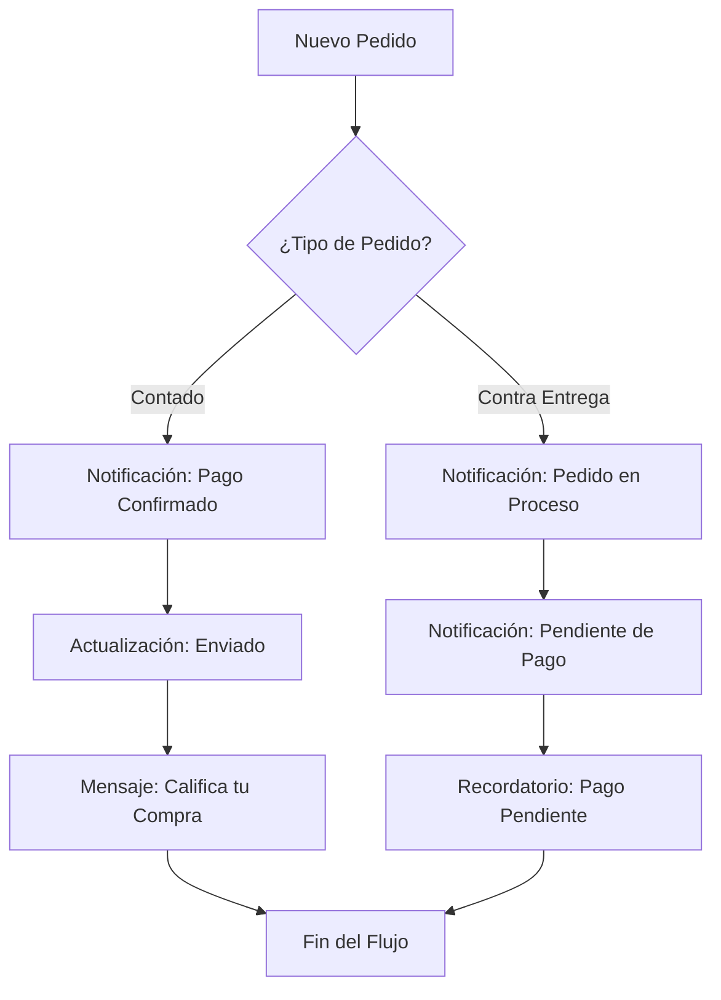
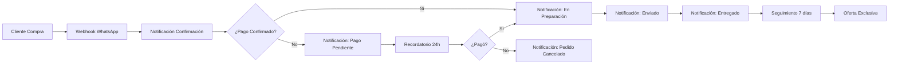

> **Actualización (2025-06-19)**
> Esta guía ha sido actualizada con los pasos detallados para configurar webhooks en Shopify y WooCommerce, incluyendo mapeo de respuestas y resolución de problemas comunes.

Imagina que inicias un negocio en línea. Las cosas van muy bien. A medida que tu negocio crece, la cantidad de clientes sigue aumentando, lo cual es excelente. El problema es que ahora que tu negocio es estable, recibes miles de pedidos al día, algo bastante común para cualquier negocio consolidado. Con miles de pedidos, es tu responsabilidad mantener a tus clientes informados sobre el estado de sus compras: actualizaciones de pedidos, cancelaciones, notificaciones, etc. Actualizar a todos tus clientes manualmente puede ser una tarea extenuante y poco productiva. Lamentablemente, esta es la realidad para muchos negocios en línea hoy en día.


> No tiene que ser así. Con el flujo de Webhook de WhatsApp de E-SMART360, puedes automatizar fácilmente las notificaciones de actualización de pedidos de Shopify o WooCommerce. Cada vez que tus clientes compren algo en tu tienda, recibirán una notificación automática por WhatsApp.

En esta guía, te mostraré cómo usar el flujo de Webhook de WhatsApp para transformar la forma en que gestionas tu negocio y hacerlo crecer como nunca antes.

## ¿Qué es el Flujo de Webhook de WhatsApp?

El flujo de Webhook de WhatsApp es una herramienta poderosa para las empresas que desean automatizar el proceso de notificación de actualización de pedidos. Puedes usar el webhook de E-SMART360 para enviar notificaciones de actualización de pedidos en tiempo real a tus clientes de Shopify y WooCommerce. Es una forma confiable y eficiente de mantener a tus clientes informados y satisfechos con sus compras.


> Los webhooks son esencialmente mensajes HTTP que se envían automáticamente desde una aplicación a otra cuando ocurre un evento específico. En este caso, cuando se crea un pedido en tu tienda, se envía una notificación automática a WhatsApp.

También puede ser beneficioso para cualquier estrategia de compromiso con el cliente.

¿Cómo? Imagina este escenario: pides algo en línea en la Tienda A y realizas el pago, pero no recibes ninguna confirmación de tu pedido ni actualizaciones relacionadas. ¿Cómo te sentirías?

Frustrante, ¿verdad?

Ahora imagina este otro escenario: cuando pides algo en línea en la Tienda B e inmediatamente recibes una confirmación y actualizaciones de seguimiento. ¿No te sentirías mucho mejor y más satisfecho comprando en la Tienda B?

Exactamente, ¿a quién no le gustaría tener control sobre su compra, especialmente si fue en línea? Saber dónde está tu pedido y cuándo llega es tranquilizador.


> Con el flujo de Webhook de WhatsApp de E-SMART360, automatizar tus notificaciones de actualización de pedidos puede ser muy fácil y conveniente.

### Capacidades de Personalización

Puedes hacer muchas cosas con el Webhook de E-SMART360, más allá de enviar notificaciones automatizadas de actualización de pedidos. A continuación exploramos las capacidades más importantes que puedes aprovechar.

### Personalización de Mensajes

Puedes personalizar tu notificación de actualización de pedido como desees. E-SMART360 te permite modificar cada aspecto del mensaje que recibe el cliente: desde el saludo inicial hasta los detalles del pedido y el cierre. Puedes incluir el nombre del cliente, el número de pedido, la lista de productos comprados, el total pagado, la fecha estimada de entrega y enlaces de seguimiento. La personalización hace que cada cliente se sienta único y valorado.

### Tiempo de Retardo

Puedes establecer un tiempo de retardo para cuándo tus clientes recibirán sus actualizaciones. Esto es útil si deseas espaciar las notificaciones para no saturar al cliente. Por ejemplo, puedes enviar la confirmación del pedido inmediatamente después de la compra, pero programar el mensaje de seguimiento para 24 horas después. Esta funcionalidad te permite crear una secuencia de comunicación perfectamente calendarizada.

### Condiciones Específicas

Puedes establecer condiciones para pedidos específicos que enviarán notificaciones solo cuando se cumplan ciertos criterios. Por ejemplo:

- **Umbral de precio**: Enviar notificación solo para pedidos mayores a $50.
- **Tipo de producto**: Notificar solo pedidos de productos físicos, no digitales.
- **Ubicación geográfica**: Enviar mensajes personalizados según la ciudad o país del cliente.
- **Método de pago**: Mensajes diferentes para pagos con tarjeta, PayPal o contra entrega.
- **Cliente VIP**: Enviar notificaciones especiales a clientes recurrentes.

Por ejemplo, si un cliente pide un producto personalizado, puedes configurar el webhook para que envíe actualizaciones según los detalles de su pedido únicamente. Esto no solo mantiene al cliente informado, sino que también agrega un toque personalizado a su experiencia de compra. Esto puede ayudar a mejorar la satisfacción y lealtad del cliente.


> Cuando tienes una gran calidad de producto y un excelente soporte al cliente, tu negocio está destinado a crecer. El webhook es la herramienta que une ambos mundos.

### Múltiples Canales de Salida

Una de las ventajas más potentes del flujo de webhook es que no se limita solo a WhatsApp. Puedes configurar el webhook para que también:

1. Envíe un correo electrónico de confirmación.
2. Registre el pedido en una hoja de Google Sheets.
3. Dispare una notificación en Slack para tu equipo de logística.
4. Cree un ticket automático en tu sistema de soporte.
5. Actualice un CRM externo con los datos del nuevo cliente.

Esta versatilidad convierte al webhook en el centro neurálgico de tu operación de e-commerce.

## ¿Cómo Puede el Flujo de Webhook de WhatsApp Cambiar la Forma en que Haces Negocios?

El flujo de Webhook de WhatsApp de E-SMART360 puede cambiar la forma en que haces negocios de una manera simple pero muy efectiva.

Uno de los mayores inconvenientes que he enfrentado personalmente al comprar en línea es que, una vez que realizas el pago, el dueño de la tienda desaparece. Sí, me ha pasado muchas veces y estoy seguro de que tú también puedes identificarte. No digo que no haya recibido el producto o que me hayan estafado. Hablo de ese momento de incertidumbre cuando no recibes noticias de la tienda en línea y no sabes nada: cuándo recibirás el producto o si lo recibirás siquiera. En ese momento, muchas cosas pasan por tu mente. La tensión aumenta aún más si es un artículo costoso.

Hay un viejo dicho: "El cliente es el rey". Y estoy completamente de acuerdo. Porque si me tratan como a un rey, volveré a esa tienda una y otra vez. Así es como nacen los clientes leales.

### El Costo de No Automatizar

Muchos dueños de negocios no se dan cuenta del costo oculto de no automatizar sus notificaciones:

- **Tiempo perdido**: Un equipo de soporte puede pasar de 2 a 4 horas diarias solo enviando actualizaciones de pedidos manualmente.
- **Errores humanos**: Es fácil olvidarse de actualizar a un cliente o enviar información incorrecta cuando se hace manualmente.
- **Insatisfacción**: La falta de comunicación es una de las principales razones por las que los clientes no repiten compras.
- **Carga operativa**: A medida que crece el negocio, las notificaciones manuales se vuelven insostenibles.

Mantener a los clientes satisfechos es clave para el éxito en el competitivo mundo de las compras en línea actual. El flujo de Webhook de WhatsApp de E-SMART360 puede cambiar la forma en que te conectas con los clientes, aumentando tus ganancias. Así es cómo:


### Comunicación sencilla con el cliente

Las actualizaciones automáticas de pedidos a través de WhatsApp, la aplicación más popular, eliminan la necesidad de correos electrónicos y llamadas manuales. Esto libera tiempo del personal y mantiene a los clientes informados.
  
### Compromiso personalizado

Ve más allá de las actualizaciones básicas. E-SMART360 te permite personalizar mensajes con detalles del pedido o promociones. Imagina un cliente que recibe actualizaciones con su nombre y el diseño del producto que eligió. Este simple toque personal fortalece la conexión con el cliente.
  
### Relaciones proactivas

Las actualizaciones regulares a través de WhatsApp mantienen tu marca presente en la mente del cliente. Los clientes aprecian la transparencia y se sienten valorados. Esto genera lealtad y fomenta la repetición de compras.
  
### Operaciones simplificadas

E-SMART360 automatiza las actualizaciones de pedidos, haciendo que tu flujo de trabajo sea más fluido y las operaciones más eficientes. Tu equipo puede concentrarse en cosas más importantes, como el desarrollo de productos o el marketing.
  
E-SMART360 es más que una herramienta de automatización. Es una inversión que te ayuda a construir relaciones más sólidas con los clientes, simplificar operaciones y lograr el éxito a largo plazo.

### Impacto Medible en tu Negocio

Al implementar el flujo de webhook para notificaciones de pedidos, puedes esperar resultados concretos:


### 📈 Reducción de Tickets de Soporte

Las notificaciones automáticas reducen hasta en un 40% las consultas de clientes preguntando "¿dónde está mi pedido?". Al tener la información directamente en WhatsApp, los clientes no necesitan contactar a soporte para saber el estado de su compra.
  
### 💵 Aumento de Ventas Repetidas

Los clientes que reciben notificaciones automáticas de sus pedidos tienen un 30% más de probabilidad de volver a comprar. La transparencia y la comunicación constante generan confianza.
  
### ⏱️ Ahorro de Horas Operativas

Un negocio con 100 pedidos diarios puede ahorrar hasta 15 horas semanales de trabajo manual en notificaciones. Esto equivale a liberar medio empleado para tareas más productivas.
  
### ⭐ Mejora en Calificaciones

Las tiendas que implementan notificaciones automáticas de pedidos ven una mejora promedio de 0.5 estrellas en sus calificaciones en plataformas de reseñas.
  
## Ejemplos del Mundo Real


### 🛍️ Tienda de Ropa (E-commerce)

Imagina una tienda de ropa popular como Zara usando E-SMART360. Cuando un cliente compra algo, aparece un mensaje en su WhatsApp confirmando el pedido, detallando lo que compró (como un vestido o un zapato) e incluyendo un enlace para rastrear el paquete. Unos días después, otro mensaje podría preguntar cómo le gustan sus nuevos productos o sugerir artículos similares que podrían interesarle. Todo a través de WhatsApp, manteniendo al cliente informado y feliz, mientras se abren puertas a más ventas.
  
### ✈️ Agencia de Viajes

Imagina una agencia de viajes usando E-SMART360. Cuando reservas un vuelo u hotel, recibes un mensaje de WhatsApp al instante con todos los detalles: horarios de vuelo, dirección del hotel, etc. Pero eso no es todo. Unos días antes de tu viaje, E-SMART360 puede enviar otro mensaje como recordatorio con información importante como el clima en tu destino o si necesitas visa. Este sistema automático hace que viajar sea más fácil para ti y libera al personal de la agencia para otras tareas.
  
### 🏦 Banca Simplificada

Cada vez que usas tu tarjeta de débito o transfieres dinero, E-SMART360 puede enviarte un mensaje rápido a WhatsApp. Sabrás al instante sobre la actividad de tu cuenta, para que puedas estar seguro de que todo está bien. Si algo parece sospechoso, el banco también puede enviarte un mensaje para verificar si realmente fuiste tú. Esto agrega una capa adicional de seguridad a tu cuenta.
  
### 📚 Educación Automatizada

Plataformas educativas como Udemy pueden usar E-SMART360 para mantener a los estudiantes comprometidos. Cuando alguien se inscribe en un curso, el instructor puede enviar un mensaje de bienvenida por WhatsApp con detalles sobre la clase y cómo acceder a ella. A medida que avanza el curso, se pueden enviar mensajes de recordatorio sobre próximas conferencias, fechas límite de tareas o materiales de estudio adicionales. Esto ayuda a los estudiantes a mantenerse al día y libera tiempo de los instructores.
  
## Guía Paso a Paso: Configurar Webhook para Shopify


> A continuación te mostramos el proceso detallado para conectar tu tienda Shopify con WhatsApp mediante el flujo de Webhook de E-SMART360.

### Paso 1: Crear una Plantilla de Mensaje en WhatsApp

1. Inicia sesión en **E-SMART360** y ve a **Bot Manager**.
2. Haz clic en **Plantilla de Mensaje**.
3. Crea una plantilla con las siguientes variables:
   - **ListaProductos** — para listar los artículos del pedido
   - **TotalPrecio** — para mostrar el monto total
   - **FechaEstimadaEntrega** — para la fecha estimada de entrega
4. Guarda la plantilla.


> Para ver el proceso detallado de creación de plantillas de mensajes, consulta nuestra guía sobre cómo crear plantillas de mensaje para WhatsApp.

### Paso 2: Configurar un Flujo de Webhook

1. Ve a **Flujo Webhook** en E-SMART360.
2. Haz clic en **Crear Flujo de Trabajo**.
3. Asígnale un **nombre** al flujo.
4. Selecciona la **cuenta de WhatsApp** desde la que se enviará el mensaje.
5. Elige la **plantilla de mensaje** que creaste anteriormente.
6. Haz clic en **Crear Flujo de Trabajo** para generar una **URL de Webhook**.
7. Copia la **URL de Webhook** para usarla en la configuración de Shopify.

### Paso 3: Integrar el Webhook con Shopify

1. Inicia sesión en tu **Panel de Administración de Shopify**.
2. Ve a **Configuración → Notificaciones**.
3. En la sección de **Webhooks**, haz clic en **Crear Webhook**.
4. Completa el formulario del webhook:
   - **Evento**: Selecciona **Creación de Pedido**.
   - **Formato**: Mantén **JSON**.
   - **URL**: Pega la **URL de Webhook** de E-SMART360.
5. Haz clic en **Guardar**.

### Paso 4: Configurar el Mapeo de Respuestas del Webhook

1. Regresa a **E-SMART360 → Flujo Webhook**.
2. Haz clic en **Capturar Respuesta del Webhook**.
3. En Shopify, haz clic en **Enviar Notificación de Prueba**.
4. Espera a que la **Respuesta del Webhook** aparezca en E-SMART360.
5. Mapea los campos de la respuesta:
   - **Número de Teléfono** → `shipping_address > phone`
   - **Precio Total** → `total_price`
   - **Lista de Productos** → `line_items`
   - **Fecha Estimada de Entrega** → `created_at`
6. Haz clic en **Guardar Flujo de Trabajo**.

### Paso 5: Probar y Verificar la Configuración

1. Realiza un **pedido de prueba** en Shopify.
2. Ve a **Reportes** en E-SMART360 y verifica el estado del pedido:
   - Inicialmente, el estado será **Pendiente**.
   - Después del procesamiento, cambiará a **Completado**.
3. Revisa tu **cuenta de WhatsApp** — deberías recibir la notificación del pedido.


### Shopify

```json
    {
      "event": "orders/create",
      "format": "json",
      "url": "https://tu-dominio.esmart360.com/webhook/workflow/abc123"
    }
    ```
  
### WooCommerce

```json
    {
      "event": "woocommerce_order_status_processing",
      "format": "json",
      "url": "https://tu-dominio.esmart360.com/webhook/workflow/xyz789"
    }
    ```
  
> ¡Felicidades! Has configurado exitosamente las notificaciones automáticas de pedidos de Shopify a WhatsApp. Tus clientes ahora recibirán actualizaciones en tiempo real sobre sus compras.

## Integración con WooCommerce

El flujo de Webhook de WhatsApp también funciona perfectamente con WooCommerce. El proceso es similar al de Shopify, con algunos pasos adicionales específicos para WordPress.


### Instalar el Plugin WooCommerce

Si aún no lo has hecho, instala y activa WooCommerce en tu sitio de WordPress. Asegúrate de tener la última versión del plugin para garantizar compatibilidad con los webhooks.
  
### Configurar Webhook en WooCommerce

Ve a **WooCommerce → Ajustes → Avanzado → Webhooks**. Haz clic en **Añadir Webhook**.
  
### Configurar los Parámetros del Webhook

- **Nombre**: Asigna un nombre descriptivo, ej. "Notificaciones WhatsApp"
    - **Estado**: Activo
    - **Evento**: Selecciona "Pedido procesado" (`woocommerce_order_status_processing`)
    - **URL de entrega**: Pega la URL de Webhook generada en E-SMART360
  
### Guardar y Probar

Guarda el webhook. Realiza un pedido de prueba en tu tienda WooCommerce y verifica que la notificación llegue a WhatsApp. Puedes usar los productos de prueba que vienen por defecto en WooCommerce.
  

> Asegúrate de que tu instalación de WooCommerce tenga los permalinks configurados correctamente y que no haya conflictos con otros plugins de envío de datos para que el webhook funcione sin problemas.

### Eventos Soportados en WooCommerce

Puedes configurar webhooks para múltiples eventos en WooCommerce, cada uno con su propia plantilla de mensaje:

| Evento | Código | Cuándo se Dispara |
|--------|--------|-------------------|
| Pedido Procesado | `woocommerce_order_status_processing` | Cuando el pago se confirma |
| Pedido Completado | `woocommerce_order_status_completed` | Cuando el pedido se entrega |
| Pedido Cancelado | `woocommerce_order_status_cancelled` | Cuando el cliente o admin cancela |
| Pedido en Espera | `woocommerce_order_status_on-hold` | Cuando el pago está pendiente |
| Pedido Reembolsado | `woocommerce_order_status_refunded` | Cuando se procesa un reembolso |
| Pedido Fallido | `woocommerce_order_status_failed` | Cuando el pago falla |


> Puedes crear un flujo de webhook diferente para cada estado de pedido, permitiendo una comunicación granular y contextualmente relevante en cada etapa del ciclo de vida del pedido.

### Solución de Problemas Comunes en WooCommerce

Si encuentras problemas al configurar el webhook en WooCommerce, aquí tienes las soluciones más frecuentes:

1. **El webhook no se dispara**: Verifica que los permalinks de WordPress estén configurados como "Nombre de la entrada" (no "Simple"). Ve a **Ajustes → Enlaces permanentes** y selecciona una opción que no sea la simple.
2. **Error 403 Forbidden**: Algunos plugins de seguridad bloquean los webhooks. Agrega una excepción en tu firewall o plugin de seguridad para permitir peticiones a la URL del webhook.
3. **El webhook se dispara pero no llega la notificación**: Revisa que la plantilla de mensaje esté aprobada por WhatsApp. Las plantillas rechazadas no pueden enviar mensajes.
4. **Conflictos con cache**: Si usas un plugin de caché como W3 Total Cache o WP Rocket, asegúrate de excluir la URL del webhook del caché.

### Configuración Avanzada para WooCommerce

Para negocios que usan WooCommerce con plugins de personalización, puedes aprovechar características adicionales:

- **Campos personalizados de checkout**: Si usas plugins que agregan campos adicionales al checkout (como fecha de entrega preferida, notas especiales, etc.), estos datos también pueden ser capturados y enviados en la notificación de WhatsApp.
- **Productos variables**: Cuando un cliente compra un producto variable (talla, color, etc.), los detalles de la variación se incluyen automáticamente en los datos del webhook y pueden mostrarse en el mensaje.
- **Cupones y descuentos**: El webhook captura si se usó algún cupón o descuento, permitiendo enviar mensajes personalizados como "¡Ahorraste $15 gracias a tu cupón VIP!"

## Casos de Uso Avanzados

### Notificaciones Condicionales

Puedes configurar reglas condicionales en tu flujo de webhook para enviar diferentes mensajes según el tipo de pedido. Esto te permite crear experiencias altamente personalizadas sin intervención manual.



### Integración con Múltiples Canales

Puedes combinar el webhook con otras integraciones para crear un ecosistema completo de automatización:


### 📊 Google Sheets

Los datos de los pedidos se pueden registrar automáticamente en Google Sheets para llevar un registro centralizado de todas las transacciones. Puedes crear columnas automáticas para: fecha del pedido, producto, cantidad, total, estado del envío y teléfono del cliente. Esto te permite tener un dashboard en tiempo real de todas tus ventas.
  
### 🤖 Zapier

Conecta el webhook con Zapier para enviar datos a más de 2000 aplicaciones adicionales como Slack, Trello, Mailchimp, Salesforce y más. Por ejemplo: cuando se recibe un pedido, Zapier puede crear automáticamente una tarjeta en Trello para tu equipo de producción, enviar un mensaje a Slack al canal de logística y agregar el cliente a una lista de Mailchimp.
  
### 📧 Email Marketing

Después de la notificación en WhatsApp, puedes activar secuencias de email marketing para seguimiento y fidelización. Por ejemplo: 7 días después de la entrega, envía un email pidiendo una reseña; 30 días después, envía un código de descuento para su próxima compra.
  
### Automatización de Flujos Completos

Puedes diseñar flujos completos que abarquen todo el ciclo de vida del cliente:



Este diagrama muestra cómo un solo webhook puede orquestar toda la comunicación post-venta, desde la confirmación inicial hasta las ofertas de fidelización, pasando por recordatorios de pago y notificaciones de envío.

### Personalización de Mensajes con Variables Dinámicas

El verdadero poder del webhook está en la personalización. Puedes usar variables dinámicas en tus plantillas de mensaje para que cada notificación sea única:


#### Ejemplo de plantilla

```
¡Hola {{nombre}}! 🎉

Tu pedido #{{pedido_id}} ha sido confirmado.

📦 Productos: {{lista_productos}}
💰 Total: {{total_precio}}
📅 Entrega estimada: {{fecha_entrega}}

Gracias por confiar en nosotros.

🔗 Rastrea tu pedido: {{enlace_seguimiento}}
```
  
## Preguntas Frecuentes


### ¿Qué es exactamente un webhook y cómo funciona en WhatsApp?

Un webhook es un mecanismo que permite que una aplicación envíe datos en tiempo real a otra aplicación cuando ocurre un evento específico. En el contexto de E-SMART360, cuando se crea un pedido en tu tienda Shopify o WooCommerce, el sistema envía automáticamente una solicitud HTTP a la URL de webhook configurada, que a su vez dispara el envío de una notificación personalizada a WhatsApp del cliente. A diferencia de las APIs tradicionales que requieren polling (consultas repetitivas), los webhooks son impulsados por eventos y entregan los datos instantáneamente.

### ¿Qué sucede si el webhook no captura la respuesta?

Si el webhook no captura la respuesta, sigue estos pasos de solución:
1. Verifica que la **URL de Webhook** esté correctamente configurada en Shopify o WooCommerce.
2. Haz clic en **Enviar Notificación de Prueba** nuevamente en la plataforma de origen.
3. Actualiza la página del **Flujo Webhook** en E-SMART360 y verifica si aparece alguna respuesta.
4. Revisa que la plantilla de mensaje esté aprobada por WhatsApp y no tenga errores.
5. Asegúrate de que la cuenta de WhatsApp esté correctamente conectada y activa.

### ¿Puedo modificar la plantilla de mensaje de WhatsApp después de crear el webhook?

Sí, puedes editar el contenido del mensaje y las variables en cualquier momento desde la sección **Plantilla de Mensaje** en E-SMART360. Sin embargo, ten en cuenta que cualquier cambio en la plantilla puede requerir una nueva aprobación por parte de WhatsApp si modificas variables o el formato del mensaje. Es recomendable hacer las pruebas necesarias antes de guardar los cambios definitivos.

### ¿Qué hago si la notificación no se envía a WhatsApp?

Si la notificación no llega a WhatsApp, verifica lo siguiente:
1. Confirma que la **cuenta de WhatsApp** esté vinculada correctamente a E-SMART360.
2. Revisa si el **Flujo de Webhook** está activo y no en pausa.
3. Comprueba que el número de teléfono del cliente esté correctamente formateado (incluyendo código de país, sin signos + ni espacios).
4. Verifica que el cliente tenga WhatsApp instalado y activo.
5. Revisa los **Reportes** en E-SMART360 para ver el estado detallado del envío.

### ¿Puedo agregar otros eventos de Shopify además de la creación de pedidos?

¡Sí! Puedes crear webhooks adicionales para diferentes eventos como:
- **Pedidos cancelados** — para notificar cancelaciones
- **Pedidos enviados** — para notificar el envío con número de guía
- **Pedidos cumplidos** — para confirmar la entrega
- **Reembolsos** — para notificar devoluciones de dinero
- **Clientes nuevos** — para dar la bienvenida a nuevos compradores

Puedes configurar tantos webhooks como necesites, cada uno con su propia plantilla de mensaje personalizada.

### ¿Necesito una API de WhatsApp de pago para esto?

Sí, para enviar mensajes a través del flujo de webhook necesitas tener activa la **API de WhatsApp Business**. E-SMART360 funciona exclusivamente con la API oficial de WhatsApp Business (Cloud API), que requiere una cuenta verificada y configurada correctamente. La buena noticia es que E-SMART360 no aplica markup adicional sobre las tarifas de conversación de WhatsApp, por lo que solo pagas lo estrictamente necesario a Meta. Puedes consultar nuestros planes de precios para más detalles.

### ¿Cuánto tiempo tarda en llegar la notificación después de crear el pedido?

Las notificaciones a través del webhook se envían en **tiempo real**, generalmente en cuestión de segundos después de que se dispara el evento. El tiempo de entrega depende de:
1. La velocidad de conexión entre tu tienda y los servidores de E-SMART360.
2. El tiempo de procesamiento de WhatsApp para entregar el mensaje al cliente.
3. Si usas una plantilla aprobada (marketing) o una plantilla de utilidad.
En condiciones normales, el cliente recibe la notificación en menos de 5 segundos desde que se completa el pedido.

### ¿Puedo configurar diferentes webhooks para diferentes tipos de productos o categorías?

Sí, puedes crear múltiples flujos de webhook, cada uno con sus propias reglas y condiciones. Por ejemplo, podrías tener:
- Un webhook para productos digitales que envíe enlaces de descarga.
- Un webhook para productos físicos que incluya información de envío.
- Un webhook para productos personalizados que notifique al cliente cuando su producto esté listo.
- Un webhook para pedidos mayoristas con mensajes y tiempos de entrega diferentes.
Cada flujo puede tener su propia plantilla de mensaje y condiciones de activación.

### ¿El webhook funciona con precios en diferentes monedas?

Sí, el webhook captura el precio exacto en la moneda configurada en tu tienda. Shopify y WooCommerce envían los datos del pedido con la moneda original en el JSON de respuesta. E-SMART360 respeta ese formato y lo incluye en la notificación tal cual. Si tu tienda maneja múltiples monedas, el webhook capturará la moneda específica que el cliente usó al realizar el pago. Esto es especialmente útil para tiendas que venden internacionalmente y necesitan mostrar el precio exacto en la moneda local del comprador.

### ¿Puedo enviar imágenes o archivos adjuntos en las notificaciones del webhook?

Sí, siempre que uses una plantilla de mensaje multimedia (carousel o imagen). El flujo de webhook de E-SMART360 es compatible con plantillas que incluyen imágenes, videos y documentos. Por ejemplo, puedes crear una plantilla que muestre la foto del producto comprado, el recibo de pago en PDF, o un video corto de agradecimiento. Para usar esta funcionalidad, necesitas crear una plantilla de mensaje multimedia en WhatsApp Manager y sincronizarla con E-SMART360, luego seleccionarla en la configuración del flujo de webhook.

### ¿Cómo maneja el webhook los pedidos con múltiples direcciones de envío?

Shopify y WooCommerce manejan los pedidos con múltiples direcciones de envío de manera diferente. En el caso de Shopify, cada envío parcial genera un evento de cumplimiento separado. El webhook capturará cada evento individualmente, permitiendo enviar notificaciones específicas para cada envío. Para WooCommerce, necesitarías un plugin que divida el pedido en envíos separados, y cada sub-pedido activaría su propio webhook. En ambos casos, el cliente recibirá notificaciones detalladas para cada parte de su pedido.

### ¿Qué tan seguro es el flujo de webhook para transmitir datos de clientes?

La seguridad es una prioridad. El flujo de webhook de E-SMART360 utiliza conexiones HTTPS cifradas (SSL/TLS) para todas las transmisiones de datos. Esto significa que la información del cliente, incluidos nombres, direcciones y detalles de pago, viaja de forma segura entre tu tienda y los servidores de E-SMART360. Además, E-SMART360 cumple con las regulaciones de protección de datos (GDPR) y no almacena información sensible más allá de lo necesario para procesar la notificación. Recomendamos no incluir datos financieros completos (como números de tarjeta) en las plantillas de mensaje.

### ¿El webhook funciona si uso un CDN o firewall en mi tienda?

Sí, pero puede requerir configuración adicional. Si usas servicios como CloudFlare, Sucuri o cualquier firewall de aplicaciones web (WAF), es posible que necesites agregar una regla de excepción para permitir las solicitudes salientes del webhook hacia la URL de E-SMART360. Además, algunos CDN pueden cachear las respuestas del webhook, lo que interferiría con su funcionamiento. Te recomendamos:
1. Agregar la URL de E-SMART360 a la lista blanca de tu firewall.
2. Deshabilitar el caché para las rutas de webhook si es necesario.
3. Verificar que las reglas de redireccionamiento no interfieran con las peticiones POST del webhook.

### ¿Puedo usar el webhook para enviar notificaciones a múltiples números de teléfono por pedido?

Sí, es posible si tu tienda captura más de un número de teléfono por pedido. Por ejemplo, podrías tener el número del comprador y un número alternativo de contacto. El webhook puede enviar la notificación a ambos números configurando reglas de mapeo adicionales. También puedes configurar que una copia de la notificación se envíe a un número interno de tu equipo para monitoreo. Esto es útil para negocios donde el comprador y el receptor del pedido son personas diferentes, como en el caso de regalos o envíos a terceros.

## Ejemplos Prácticos Adicionales


### 🔄 Recuperación de Carritos Abandonados

Configura un webhook que se active cuando un cliente agregue productos al carrito pero no complete la compra. Después de 30 minutos sin actividad, envía un mensaje automático por WhatsApp recordándole los productos que dejó pendientes, incluyendo un enlace directo a su carrito para que pueda finalizar la compra en un solo clic. Esta estrategia puede recuperar hasta un 15-20% de los carritos abandonados.
  
### 📦 Notificaciones Post-Venta

Después de que el pedido sea entregado, configura un webhook que envíe un mensaje de seguimiento preguntando al cliente cómo fue su experiencia con el producto. Incluye un enlace directo para dejar una reseña o contactar a soporte. Esto no solo mejora la satisfacción del cliente, sino que también genera contenido valioso (reseñas) que puede impulsar futuras ventas.
  
### 🎁 Promociones por Cumpleaños

Integra tu webhook con un calendario de cumpleaños de clientes. Cuando sea el cumpleaños de un cliente que haya comprado antes, el webhook puede enviar automáticamente un mensaje con un código de descuento especial. Esta estrategia de marketing personalizada tiene una tasa de conversión hasta 5 veces mayor que las promociones genéricas.
  
### 📋 Encuestas de Satisfacción Automatizadas

7 días después de la entrega del pedido, configura el webhook para enviar una encuesta de satisfacción simple a través de WhatsApp. Pregunta sobre la calidad del producto, el tiempo de entrega y la experiencia general. Las respuestas pueden alimentar directamente tu sistema de CRM para mejorar continuamente tu servicio.
  
## Diferencias entre Webhook y API Tradicional

| Aspecto | Webhook | API Tradicional |
|---------|---------|-----------------|
| Dirección de la comunicación | Unidireccional (origen → destino) | Bidireccional (consulta y respuesta) |
| Activación | Basada en eventos | Basada en peticiones (polling) |
| Tiempo de respuesta | En tiempo real (instantáneo) | Depende de la frecuencia de consulta |
| Carga del servidor | Baja (solo cuando ocurre el evento) | Alta (consultas repetitivas) |
| Complejidad técnica | Media (configuración inicial) | Alta (gestión de endpoints) |
| Eficiencia | Alta (solo datos relevantes) | Media (puede traer datos innecesarios) |


> Mientras que una API tradicional requiere que consultes constantemente si hay nuevos pedidos (cada 5, 10 o 30 minutos), el webhook te notifica instantáneamente en el momento exacto en que se crea el pedido. Esto hace que los webhooks sean significativamente más eficientes y rápidos para automatizaciones en tiempo real.

## Arquitectura Técnica del Flujo de Webhook

Para los usuarios más técnicos, aquí explicamos cómo funciona el flujo de datos en el webhook:

```
Tienda Online (Shopify/WooCommerce)
        |
        | (1) Evento: Nuevo Pedido
        |
        v
(2) Petición HTTP POST (JSON) ──────────────────────────► E-SMART360
        |                                                      |
        | (3) Procesamiento y validación de datos              |
        | (4) Mapeo de campos según plantilla                  |
        | (5) Selección de template de mensaje                 |
        |                                                      |
        ◄──────────── (6) Confirmación recibida ───────────────|
                                                              |
                                              (7) Envío a través de WhatsApp Cloud API
                                                              |
                                                              v
                                              Cliente recibe notificación en WhatsApp
```

1. **Evento**: Se crea un nuevo pedido en tu tienda (Shopify o WooCommerce).
2. **Petición HTTP POST**: La tienda envía automáticamente una petición POST a la URL del webhook de E-SMART360 con los datos del pedido en formato JSON.
3. **Procesamiento**: E-SMART360 recibe y valida los datos, verificando que la estructura sea correcta.
4. **Mapeo**: Los campos del JSON se mapean a las variables de tu plantilla de mensaje.
5. **Selección de template**: Se elige la plantilla de WhatsApp correspondiente.
6. **Confirmación**: E-SMART360 responde a la tienda confirmando la recepción.
7. **Envío**: Se dispara el envío del mensaje a través de WhatsApp Cloud API.


> Todo este proceso toma menos de 3 segundos desde que el cliente hace clic en "Comprar" hasta que recibe la notificación en su WhatsApp.

## Consejos para Maximizar el Impacto de tus Notificaciones


> Para obtener los mejores resultados con tus notificaciones automatizadas de WhatsApp, considera estas mejores prácticas:

1. **Segmenta tus mensajes**: No todas las notificaciones deben ser iguales. Adapta el tono y contenido según el tipo de cliente (nuevo, recurrente, VIP).
2. **Incluye llamadas a la acción**: Agrega botones o enlaces en tus mensajes para que el cliente pueda realizar acciones como rastrear su pedido, contactar a soporte o dejar una reseña.
3. **Mide y optimiza**: Utiliza los reportes de E-SMART360 para analizar la tasa de entrega y apertura de tus notificaciones. Ajusta los horarios de envío según el comportamiento de tus clientes.
4. **No sobrecargues**: Aunque la automatización es poderosa, evita enviar demasiados mensajes. Un cliente satisfecho recibe notificaciones relevantes sin sentirse abrumado.
5. **Combina con marketing**: Usa las notificaciones de pedidos como una oportunidad para hacer ventas cruzadas o sugerir productos complementarios de forma no intrusiva.
6. **Prueba antes de lanzar**: Siempre realiza pruebas con pedidos de muestra antes de activar el webhook en producción. Verifica que todos los datos se muestren correctamente en el mensaje.
7. **Monitorea los reportes**: Revisa semanalmente los reportes de E-SMART360 para identificar patrones de entrega, errores recurrentes y oportunidades de mejora en tus plantillas.
8. **Actualiza tus plantillas periódicamente**: Revisa cada 2-3 meses que tus plantillas de mensaje sigan siendo relevantes y cumplan con las políticas actualizadas de WhatsApp.
9. **Capacita a tu equipo**: Asegúrate de que tu equipo de soporte y logística entienda cómo funciona el webhook y qué información recibe el cliente en cada etapa.
10. **Crea un plan de contingencia**: Define qué hacer si el webhook falla (por ejemplo, un respaldo manual o un sistema alternativo de notificaciones).


> WhatsApp es el canal con la tasa de apertura más alta (98%) comparado con el email (20%) o SMS (45%). Aprovechar esta ventaja para notificaciones de pedidos marca una diferencia significativa en la satisfacción del cliente.

## Listo para Comenzar

Automatizar tus notificaciones de pedidos con el flujo de Webhook de WhatsApp de E-SMART360 es una situación beneficiosa tanto para ti como para tus clientes. Liberarás tiempo valioso para tu personal, simplificarás tus operaciones comerciales y obtendrás información valiosa sobre el comportamiento de los clientes. Pero lo más importante, crearás una experiencia de compra más satisfactoria y personalizada que generará lealtad y repetición de negocios.


> ¿Estás listo para transformar tu negocio con notificaciones automáticas por WhatsApp? Comienza hoy mismo configurando tu primer flujo de webhook en E-SMART360 y descubre el poder de la automatización inteligente.

### Checklist de Implementación

Antes de lanzar tu flujo de webhook, asegúrate de haber completado todos estos pasos:

- [ ] Tienes una cuenta activa en E-SMART360
- [ ] Tu cuenta de WhatsApp Business está verificada y activa
- [ ] Has creado al menos una plantilla de mensaje aprobada por WhatsApp
- [ ] Has configurado el flujo de webhook en E-SMART360
- [ ] Has integrado la URL del webhook en tu tienda (Shopify o WooCommerce)
- [ ] Has mapeado correctamente los campos de respuesta
- [ ] Has realizado una prueba exitosa con un pedido de prueba
- [ ] Has verificado que la notificación llega correctamente a WhatsApp
- [ ] Has compartido el flujo con tu equipo de soporte y logística
- [ ] Has configurado alertas para errores o fallos en el webhook

### Resumen de Beneficios

| Aspecto | Sin Automatización | Con Webhook de WhatsApp |
|---------|-------------------|------------------------|
| Tiempo por notificación | 2-3 minutos manual | 0 segundos (automático) |
| Tasa de error | Alta (humana) | Cero (automatizada) |
| Personalización | Limitada | Completa con variables |
| Escalabilidad | Difícil (requiere más personal) | Ilimitada |
| Satisfacción del cliente | Variable | Consistente y alta |
| Disponibilidad | Horario laboral | 24/7/365 |
| Costo operativo | Alto (salarios) | Mínimo (suscripción) |

### Próximos Pasos Recomendados

Una vez que hayas implementado con éxito las notificaciones básicas de pedidos, considera estos pasos adicionales:

1. **Expande a otros eventos**: Configura webhooks para notificaciones de envío, cancelaciones y reembolsos.
2. **Implementa recuperación de carritos**: Usa el webhook para detectar carritos abandonados y enviar recordatorios automáticos.
3. **Crea secuencias de post-venta**: Programa mensajes de seguimiento a los 7, 15 y 30 días después de la compra.
4. **Añade encuestas de satisfacción**: Configura un webhook que envíe una encuesta automática después de la entrega.
5. **Integra con tu CRM**: Conecta el webhook con tu sistema CRM para tener un registro completo de cada interacción.


> El 68% de los consumidores dice que la disponibilidad de información sobre el estado de su pedido influye en su decisión de comprar nuevamente en una tienda. Con E-SMART360, no solo cumples con esa expectativa, la superas.

### Preguntas para Evaluar tu Estrategia Actual

Antes de implementar el webhook, pregúntate:

1. ¿Cuánto tiempo dedica mi equipo a enviar notificaciones de pedidos manualmente?
2. ¿Cuántos tickets de soporte recibo semanalmente preguntando "¿dónde está mi pedido"?
3. ¿Mis clientes reciben información consistente y actualizada sobre sus compras?
4. ¿Estoy aprovechando las notificaciones para hacer ventas cruzadas o fidelización?
5. ¿Mi proceso actual escala cuando recibo el doble o triple de pedidos?

Si alguna de estas respuestas te hace reflexionar, el flujo de webhook de WhatsApp de E-SMART360 es la solución que necesitas.

### Recursos Relacionados

- [Cómo crear formularios de WhatsApp Flows](/recursos/formularios-whatsapp-flows)
- [Cómo usar WhatsApp Flows en E-SMART360](/recursos/usar-whatsapp-flows)
- [Enviar WhatsApp Flows desde tu sitio web con Webhook](/recursos/enviar-whatsapp-flows-webhook)
- [Integrar WooCommerce para automatización en WhatsApp](/recursos/integrar-woocommerce-whatsapp)
- [Recuperar carritos abandonados de Shopify por WhatsApp](/recursos/recuperar-carritos-abandonados-shopify)
- [Notificaciones de pedidos WooCommerce a WhatsApp](/recursos/notificaciones-woocommerce-whatsapp)

---

*Documento actualizado por última vez: 8 de mayo de 2026. Para consultas técnicas, contacta a nuestro equipo de soporte en E-SMART360.
