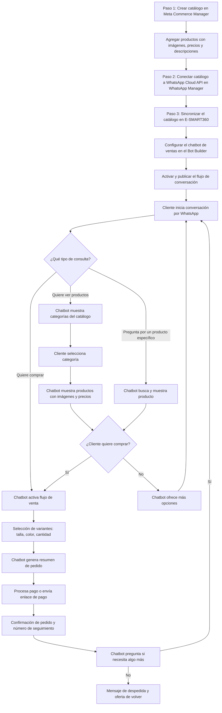

import { Callout, Steps, Step, Expandable, Columns, Card, Tabs, Tab, Update, CodeGroup, CodeGroupItem } from '/src/components/mdx';

# Cómo Integrar un Catálogo de Productos en WhatsApp

> **Actualización (6 Marzo 2025)**
> Guía actualizada con los últimos cambios de la API de WhatsApp Cloud y la configuración de catálogos en Meta Commerce Manager. Versión 2025: nuevos límites de productos, métodos de carga y mejores prácticas de sincronización.

Con el crecimiento de WhatsApp como una herramienta poderosa para la comunicación empresarial, integrar tu catálogo de productos en esta popular aplicación de mensajería puede ayudarte a impulsar tus ventas y llegar a una audiencia mucho más amplia. Hoy en día, los clientes esperan poder ver productos, consultar precios y recibir atención personalizada sin salir de sus aplicaciones de mensajería, y WhatsApp es donde pasan la mayor parte de su tiempo de comunicación digital.

> **¿Sabías que...?** Más del 70% de los usuarios de WhatsApp revisan activamente mensajes de negocios en la aplicación, y más del 60% prefiere hacer consultas de compra por chat antes que visitar un sitio web. Tener un catálogo integrado directamente en WhatsApp elimina fricciones, acelera el proceso de compra y mejora significativamente la experiencia del cliente.

## ¿Qué es un Catálogo de Productos en WhatsApp?

La API de Catálogo de WhatsApp es una parte integral de la API de WhatsApp Business. Esta funcionalidad permite a las empresas crear y gestionar catálogos de productos directamente dentro de WhatsApp, sin necesidad de plataformas externas complejas. Al aprovechar esta funcionalidad, las empresas pueden presentar sus productos u ofertas a los clientes de una manera visualmente atractiva, proporcionando imágenes, nombres, precios y descripciones detalladas, todo dentro de la comodidad de su aplicación de mensajería preferida.

Un catálogo de WhatsApp está diseñado para reemplazar las largas descripciones de texto y los enlaces externos que los clientes dudan en abrir. En lugar de eso, el catálogo muestra productos de forma nativa dentro del chat, permitiendo una experiencia de navegación fluida que mantiene al cliente comprometido y en el contexto de la conversación.

> **Ventaja clave:** Con el catálogo integrado en WhatsApp, tus clientes pueden ver productos, hacer preguntas en tiempo real y completar una compra sin salir nunca de la aplicación. Esto reduce la tasa de abandono, acelera el ciclo de ventas y puede aumentar la conversión hasta en un 40%.

### Características principales

- **Visualización nativa de productos:** Muestra imágenes de alta calidad, nombres, precios y descripciones detalladas de cada producto directamente en el chat de WhatsApp, sin necesidad de abrir enlaces externos.
- **Enlaces directos compartibles:** Puedes enviar enlaces directos al catálogo a tus clientes. Cuando hacen clic desde su teléfono móvil, el catálogo se abre automáticamente dentro de la interfaz de WhatsApp, brindando una experiencia integrada y profesional.
- **Navegación intuitiva:** Los clientes pueden explorar productos, ver categorías, hojear ofertas y seleccionar artículos sin tener que salir nunca del chat de WhatsApp.
- **Actualización en tiempo real:** Los cambios que realices en tu catálogo se reflejan al instante. Si actualizas un precio, agregas un nuevo producto o marcas algo como agotado, los clientes ven la información más reciente sin demoras.
- **Integración multicanal:** El mismo catálogo se sincroniza automáticamente con WhatsApp, Facebook e Instagram, permitiéndote gestionar todos tus productos desde un solo lugar.

### ¿Por qué deberías integrar tu catálogo en WhatsApp?

### 📱 Experiencia de compra sin fricciones

Los clientes pueden ver productos, consultar precios y hacer preguntas todo en un solo lugar. No hay necesidad de enviarlos a un sitio web externo o esperar respuestas por correo electrónico. Todo ocurre dentro del chat, en tiempo real, reduciendo drásticamente la tasa de abandono.
  
### 📈 Incremento comprobado en ventas

Las empresas que integran catálogos en WhatsApp reportan hasta un 35% más de consultas de compra y un 20% más de cierre de ventas. La razón es simple: cuando el cliente ve el producto al instante, la probabilidad de compra se dispara.
  
### 🤖 Automatización inteligente con chatbots

Combinado con los chatbots de E-SMART360, el catálogo cobra vida. Los chatbots pueden presentar productos relevantes basados en las preguntas del cliente, recomendar complementos y guiar todo el proceso de compra de forma automatizada pero personalizada, disponible 24 horas al día, 7 días a la semana.
  
### 🌐 Alcance global en tu mercado objetivo

WhatsApp cuenta con más de 2.500 millones de usuarios activos mensuales en todo el mundo. Tener tu catálogo disponible en esta plataforma significa que estás exactamente donde están tus clientes actuales y potenciales, sin necesidad de que descarguen una aplicación adicional.
  
### 🔄 Gestión centralizada desde un solo panel

Administra todos tus productos desde Meta Commerce Manager y automáticamente se reflejarán en WhatsApp, Facebook e Instagram. Esto elimina la duplicación de trabajo y asegura que la información sea consistente en todos los canales.
  
### 📊 Datos y métricas para optimizar ventas

Con las herramientas de E-SMART360 puedes rastrear qué productos reciben más atención, qué enlaces generan más clics y qué tipo de recomendaciones funcionan mejor. Estos datos te permiten refinar tu estrategia de ventas continuamente.
  
## Requisitos Previos

Antes de comenzar con el proceso de integración, asegúrate de tener lo siguiente preparado:

### ✅ Cuenta de WhatsApp Business API

Necesitas una cuenta de WhatsApp Business API activa y configurada. Si aún no tienes una, puedes configurarla fácilmente desde E-SMART360 sin necesidad de conocimientos técnicos avanzados. La plataforma te guía paso a paso a través de todo el proceso de Embedded Signup y conexión.
  
### ✅ Meta Business Manager

Una cuenta de negocio verificada en Facebook/Meta. Esta cuenta es necesaria para acceder a Commerce Manager, donde crearás y gestionarás tu catálogo de productos. Si aún no tienes una, créala gratuitamente en business.facebook.com. Asegúrate de completar la verificación empresarial si planeas manejar un volumen alto de productos.
  
### ✅ Productos listados y preparados

Antes de subir productos, ten lista la siguiente información para cada artículo:
    - Imágenes de alta calidad en formato JPG o PNG (mínimo 400x400 píxeles, recomendado 1024x1024)
    - Nombres claros, descriptivos y optimizados (máximo 100 caracteres)
    - Descripciones detalladas que destaquen características y beneficios
    - Precios actualizados con el formato numérico correcto (ej: 29.99, usando punto para decimales)
    - SKU o identificador único del producto (opcional pero muy recomendado)
    - Disponibilidad de inventario actualizada
  
### ✅ Cuenta activa en E-SMART360

Necesitas una cuenta activa en E-SMART360 para sincronizar el catálogo, activar la venta automatizada mediante chatbots, gestionar las interacciones desde la bandeja compartida y acceder a las funcionalidades avanzadas de venta conversacional. Si aún no tienes una, regístrate desde la página principal del sitio.
  
## Paso 1: Crear el Catálogo en Meta Commerce Manager

El primer paso para integrar tu catálogo de productos en WhatsApp es crearlo en Meta Commerce Manager. Este será el repositorio central desde donde se sincronizarán automáticamente tus productos con WhatsApp, Facebook e Instagram. Sigue estos pasos con atención para asegurar una configuración correcta.

### Accede a Commerce Manager

Abre tu navegador web y ve a [business.facebook.com](https://business.facebook.com/). Inicia sesión con las credenciales de tu cuenta de negocio de Facebook. Una vez dentro del panel principal, haz clic en el menú **"All Tools"** (Todas las herramientas), ubicado en la esquina inferior izquierda de la pantalla. Del menú de aplicaciones que se despliega, busca y selecciona **"Commerce"** (Comercio). Si no lo ves inmediatamente, puedes usar la barra de búsqueda del menú escribiendo "commerce".
  
### Selecciona tu cuenta de negocio

Una vez en Commerce Manager, mira hacia la esquina superior derecha de la pantalla. Allí verás tu foto de perfil o un icono de usuario. Haz clic en él para abrir el selector de cuentas y selecciona la **cuenta de negocio** específica que deseas utilizar para gestionar tu catálogo. Es importante elegir la cuenta correcta, especialmente si manejas múltiples negocios. Después de seleccionar, haz clic en el botón **"Get Started"** (Comenzar) que aparece en el centro de la pantalla para iniciar el asistente de creación de catálogo.
  
### Configura el tipo de catálogo

El asistente te presentará varias opciones. Sigue estos pasos:
    1. Selecciona la opción **"Create a catalog"** (Crear un catálogo) y haz clic en **"Get Started"**
    2. En la siguiente pantalla, elige el tipo de catálogo: selecciona **"E-commerce"** (Comercio electrónico) como categoría principal
    3. Ahora define si tus productos son:
       - **En línea (Online):** Productos que se venden a través de internet, ya sean físicos con envío o digitales para descarga
       - **Locales (Local):** Productos disponibles exclusivamente en tiendas físicas con recogida en local
    4. Haz clic en **"Next"** (Siguiente) después de hacer tu selección
  
### Elige el método de carga y completa la configuración

En este paso, decides cómo agregarás tus productos al catálogo. Tienes dos opciones principales:

    **Opción 1: Carga manual → Ideal para negocios pequeños o en etapa inicial**
    - Agregas cada producto individualmente ingresando nombre, imagen, descripción, precio y disponibilidad
    - Tienes control total sobre la información de cada artículo
    - Puedes empezar con pocos productos e ir expandiendo
    - Recomendado para catálogos de hasta 50 productos

    **Opción 2: Plataformas conectadas → Ideal para tiendas online ya establecidas**
    - Conecta tu tienda de Shopify, WooCommerce o BigCommerce directamente
    - Los productos se sincronizan automáticamente sin intervención manual
    - Los cambios en tu tienda (precios, stock, nuevos productos) se reflejan al instante
    - El inventario se mantiene actualizado en todo momento

    Después de elegir tu método, completa estos datos:
    - **Dueño del catálogo:** Selecciona tu negocio de Facebook
    - **Nombre del catálogo:** Elige un nombre descriptivo (ej: "Catálogo Tienda Online 2025")
    - **Moneda:** Selecciona la moneda de tus transacciones

    Haz clic en **"Create"** (Crear) para finalizar la creación del catálogo.
  
### Agrega productos al catálogo

Después de crear el catálogo, es momento de poblarlo con productos:

    1. Haz clic en **"View Catalogue"** (Ver catálogo) para visualizar tu catálogo recién creado
    2. Haz clic en el botón **"Add Items"** (Agregar productos) en la esquina superior derecha
    3. Selecciona **"Manual"** como método de carga si no conectaste una plataforma
    4. Completa la ficha de cada producto con la siguiente información:
       - **Imagen:** Sube un archivo JPG o PNG de alta calidad (1024x1024 píxeles recomendado)
       - **Nombre:** Máximo 100 caracteres, descriptivo y optimizado (ej: "Camiseta Algodón Premium Azul Marino")
       - **Descripción:** Incluye características principales, materiales, medidas, beneficios y usos recomendados
       - **Precio:** Usa formato numérico con punto decimal (ej: 29.99)
       - **Moneda:** Selecciona la moneda correspondiente
       - **Enlace del producto:** URL de la página del producto en tu tienda online (opcional)
       - **Marca:** Nombre de tu marca (opcional)
       - **GTIN:** Código de barras del producto (opcional pero útil para inventarios)
       - **Categoría:** Clasifica el producto (ej: "Ropa y accesorios > Ropa > Camisetas")
       - **Condición:** Nuevo, usado o reacondicionado

    5. Para agregar más productos, repite el proceso o usa la opción de **carga masiva por CSV** disponible en el menú de Commerce Manager
    6. Una vez completados todos los productos, haz clic en **"Upload Items"** (Subir productos)

    
> Puedes agregar hasta 500 productos por catálogo. Si tu inventario es más extenso, considera usar la conexión con plataformas de e-commerce como Shopify o WooCommerce para una sincronización automática y sin límites prácticos.
    
> **Límite importante de WhatsApp:** WhatsApp permite hasta **500 productos** por catálogo. Si necesitas alojar más de 500 productos, deberás crear catálogos adicionales (por ejemplo, uno por categoría) o segmentar tu oferta para mantener solo los productos más relevantes y con mejor rotación. Asegúrate también de que cada producto tenga una imagen de buena calidad y una descripción clara para maximizar el interés del cliente y la tasa de conversión.

## Paso 2: Conectar el Catálogo a la API de WhatsApp Cloud

Una vez que has creado tu catálogo de productos en Commerce Manager con toda la información correcta, el siguiente paso es conectarlo a la API de WhatsApp Cloud. Esta conexión es la que hará que tus productos sean visibles dentro de los chats de WhatsApp para tus clientes.

### Accede a WhatsApp Manager

Desde el menú **"All Tools"** (Todas las herramientas) en business.facebook.com, desplázate hacia abajo en el listado de aplicaciones disponibles y selecciona **"WhatsApp Manager"**. Esta es la herramienta central de administración para la API de WhatsApp Cloud, donde gestionarás la configuración de tu número de WhatsApp Business.
  
### Encuentra la opción Catalog en Account Tools

Una vez dentro de WhatsApp Manager, verás un menú lateral con diversas secciones de configuración. Busca la sección **"Account Tools"** (Herramientas de cuenta) y dentro de ella selecciona **"Catalog"** (Catálogo). Esta opción te permitirá vincular tu catálogo de productos comerciales a tu número de WhatsApp Business para que los clientes puedan ver los productos.
  
### Selecciona tu catálogo de la lista disponible

Haz clic en el botón **"Choose Catalog"** (Elegir Catálogo). Se abrirá un menú desplegable mostrando todos los catálogos disponibles que están asociados a tu Business Manager. Identifica y selecciona el catálogo específico que creaste en el Paso 1. Si tienes varios catálogos, tómate un momento para asegurarte de seleccionar el correcto, especialmente si manejas diferentes líneas de negocio.
  
### Conecta el catálogo a tu cuenta de WhatsApp

Después de seleccionar tu catálogo, haz clic en el botón **"Connect Catalog"** (Conectar Catálogo). El sistema iniciará el proceso de vinculación. Una vez completado, verás un mensaje de confirmación indicando que el catálogo ha sido conectado exitosamente a tu cuenta de WhatsApp Cloud API. En este punto, la parte técnica de Meta está completa.
  

> **¡Catálogo conectado a WhatsApp!** Tu catálogo de productos ya está técnicamente vinculado a WhatsApp. Ahora es momento de sincronizarlo con E-SMART360 para activar todas las funcionalidades avanzadas: chatbots de ventas, recomendaciones automáticas, broadcasting segmentado y más.

## Paso 3: Importar y Sincronizar el Catálogo en E-SMART360

Este es el paso final de la configuración técnica. Aquí conectarás todo lo que has preparado con E-SMART360 para empezar a vender de forma automatizada e inteligente.

### Inicia sesión en E-SMART360

Accede a tu panel de control de E-SMART360 con tu correo electrónico y contraseña habituales. Una vez dentro del dashboard principal, busca y haz clic en la sección **"WhatsApp"** ubicada en el menú lateral. Esta sección centraliza toda la gestión de tu cuenta de WhatsApp Business API.
  
### Conecta y sincroniza tu número de WhatsApp

Dentro de la sección WhatsApp, sigue estos pasos:
    1. Haz clic en **"Connect Account"** (Conectar Cuenta)
    2. La plataforma mostrará los números de WhatsApp asociados a tu cuenta de negocio
    3. Identifica el número que deseas utilizar para tu catálogo de productos
    4. Haz clic en el botón **"Sync"** (Sincronizar) que aparece junto al número
    5. Espera entre 5 y 15 segundos mientras la plataforma sincroniza los datos
  
### Accede al Catálogo de E-Commerce

En el menú lateral principal, busca la opción **"eCommerce Catalog"** (Catálogo de E-Commerce) y haz clic en ella. Aquí se mostrará automáticamente el catálogo que conectaste en WhatsApp Manager. Todos los productos que agregaste aparecerán listados con su información correspondiente: imágenes, nombres, precios y disponibilidad.
  
### Verifica la información de los productos

Revisa cuidadosamente que cada producto se haya sincronizado correctamente:
    - Las **imágenes** se muestran correctamente y con buena resolución
    - Los **precios** están actualizados y en la moneda correcta
    - Las **descripciones** están completas y son informativas
    - El **stock** refleja la disponibilidad real de tu inventario
    - Los **nombres** son los que deseas que vean tus clientes
    - Las **categorías** están correctamente asignadas
    - No hay productos duplicados por error

    Si encuentras algún problema, edita los productos directamente desde Commerce Manager y luego haz clic en **"Sync"** nuevamente para forzar una actualización.
  
### Configura las opciones de visualización del catálogo

E-SMART360 te ofrece varias opciones para personalizar cómo se muestra tu catálogo a los clientes:
    - **Orden de productos:** Define si aparecen por precio, popularidad, fecha de agregado o nombre
    - **Agrupación por categorías:** Organiza productos en grupos lógicos para facilitar la navegación
    - **Productos destacados:** Marca productos específicos para que aparezcan primero
    - **Ocultar agotados:** Configura para que los productos sin stock no se muestren automáticamente
    - **Etiquetas promocionales:** Agrega etiquetas como "Nuevo", "Oferta" o "Más vendido"
  

> **¡Todo listo para vender!** Una vez sincronizado y configurado, tus clientes podrán acceder al catálogo completo de productos directamente desde WhatsApp. Los cambios que realices en tu catálogo (precios, nuevos productos, actualizaciones) se reflejarán automáticamente sin necesidad de volver a sincronizar manualmente.

## Cómo se Muestra el Catálogo a tus Clientes en WhatsApp

Una vez completados todos los pasos de conexión y sincronización, el catálogo estará visible para tus clientes de las siguientes maneras:

### 1. Enlace directo al catálogo completo

Puedes compartir un enlace directo al catálogo con cualquier cliente a través del chat. Cuando el cliente hace clic en el enlace desde su teléfono móvil, el catálogo se abre automáticamente dentro de la interfaz de WhatsApp, mostrando todos los productos disponibles en una cuadrícula visual con imágenes, nombres y precios. La experiencia es idéntica a navegar en una tienda online, pero sin salir de la aplicación de mensajería.

### 2. Botones de acceso rápido al catálogo

Puedes incluir botones interactivos en los mensajes que envías (tanto manuales como automatizados por chatbots). Al hacer clic en estos botones, el cliente accede directamente al catálogo. Ejemplos de botones:
- "🛍️ Ver catálogo completo"
- "📦 Ver productos disponibles"
- "🏷️ Ver ofertas"

### 3. Recomendaciones inteligentes del chatbot

Los chatbots de E-SMART360 pueden recomendar productos automáticamente según la conversación con el cliente:
- Si un cliente pregunta "¿Tienen zapatillas para correr?", el chatbot busca en el catálogo y muestra las opciones disponibles
- Si un cliente selecciona una categoría, el chatbot presenta los productos destacados de esa categoría
- Durante una venta, el chatbot puede sugerir productos complementarios ("Los clientes que compraron esto también se llevaron...")

### 4. Mensajes con productos individuales

Puedes enviar mensajes que incluyan un producto específico con su imagen, precio, descripción y botones de acción. Esto es ideal para:
- Responder a consultas específicas de productos
- Enviar ofertas personalizadas y descuentos exclusivos
- Compartir lanzamientos y novedades
- Hacer seguimiento de ventas con productos recomendados

## Automatización de Ventas con Chatbot y Catálogo

Una vez que tu catálogo está sincronizado en E-SMART360, el verdadero potencial se desbloquea al combinarlo con un chatbot inteligente. La integración catálogo + chatbot es la estrategia más efectiva para convertir consultas en ventas de forma automática y escalable.

### Diseño del Flujo de Ventas Automatizado

### Planifica la experiencia del cliente

Antes de construir el chatbot, diseña el recorrido ideal del cliente. Un flujo de ventas efectivo suele incluir:
    1. **Saludo y bienvenida:** Mensaje amigable que presente la tienda y ofrezca ayuda
    2. **Menú de categorías:** Presenta las categorías principales del catálogo para que el cliente elija
    3. **Navegación de productos:** Muestra productos con imagen, precio y botones para ver detalles
    4. **Información detallada:** El cliente selecciona un producto y recibe toda la información
    5. **Proceso de compra:** Guía paso a paso: selección de variantes, cantidad, dirección de envío, método de pago
    6. **Confirmación:** Resumen del pedido, número de seguimiento y próxima interacción
  
### Construye el flujo en el Bot Builder

En el constructor de chatbots de E-SMART360:
    1. Crea un nuevo flujo de chatbot desde cero o duplica una plantilla existente
    2. Agrega bloques de tipo **"Catálogo"** o **"Producto"** en los puntos donde quieras mostrar productos
    3. Conecta los bloques del catálogo con las respuestas esperadas de los clientes
    4. Configura botones de acción como "Ver más detalles", "Comprar ahora", "Consultar precio"
    5. Define las respuestas automáticas para preguntas frecuentes sobre productos y precios
    6. Agrega bloques de recomendación de productos complementarios basados en la selección del cliente
  
### Configura las reglas de negocio y comportamiento

Define cómo responderá el chatbot en diferentes escenarios:
    - **Producto sin stock:** Mensaje de disculpa y sugerencia de producto alternativo similar
    - **Consulta de precio:** Respuesta automática con el precio actualizado y enlace directo al producto
    - **Pregunta sobre envíos:** Información detallada de políticas, tiempos y costos de envío
    - **Intención de compra:** Activación del flujo completo de venta guiada paso a paso
    - **Cliente indeciso:** Oferta de ayuda adicional o descuento por tiempo limitado
    - **Pregunta técnica:** Respuesta con especificaciones detalladas extraídas de la descripción del producto
  
### Prueba y activa el chatbot

Antes de poner el chatbot en producción:
    1. Guarda todos los cambios en el flujo
    2. Usa el **simulador integrado** de E-SMART360 para probar cada rama del flujo
    3. Verifica que los productos del catálogo se muestren correctamente con imágenes y precios
    4. Comprueba que los botones funcionen y dirijan a las secciones correctas
    5. Realiza pruebas con diferentes tipos de clientes (nuevos, recurrentes, con preguntas específicas)
    6. Una vez que todo funcione correctamente, haz clic en **"Activar"** o **"Publicar"**
    7. Monitorea las primeras conversaciones para asegurar una experiencia óptima
  
### Ejemplos de Flujos de Conversación por Tipo de Negocio

### 🛒 Tienda de Ropa y Accesorios

1. **Cliente:** "Hola, ¿tienen camisetas?"  
    2. **Chatbot:** "¡Hola! Sí, tenemos varias opciones de camisetas. ¿Prefieres ver las de manga corta o manga larga?"  
    [Botones: "Manga corta" | "Manga larga" | "Ver catálogo completo"]  
    3. **Cliente selecciona "Manga corta"**  
    4. **Chatbot:** "Estas son nuestras camisetas de manga corta disponibles:"  
    [Muestra 3 productos del catálogo con imágenes, precios y talles disponibles]  
    5. **Cliente:** "Me gusta la azul marino, ¿cuánto cuesta?"  
    6. **Chatbot:** "La camiseta azul marino cuesta $24.99 y está disponible en talles S, M, L, XL y XXL. Te queda muy bien. ¿Te gustaría comprarla?"  
    [Botones: "Comprar ahora" | "Ver otros colores" | "Ver guía de talles"]
  
### 🍕 Restaurante y Delivery

1. **Cliente:** "¿Qué tienen para cenar?"  
    2. **Chatbot:** "¡Bienvenido a Pizzería Roma! Hoy tenemos un menú delicioso. ¿Qué te gustaría ver?"  
    [Botones: "🍕 Pizzas" | "🥗 Ensaladas" | "🍝 Pastas" | "🥤 Bebidas"]  
    3. **Cliente selecciona "Pizzas"**  
    4. **Chatbot:** [Muestra catálogo con fotos de cada pizza, ingredientes y precios]  
    5. **Cliente:** "Quiero una margarita personal"  
    6. **Chatbot:** "Excelente elección. Pizza Margarita personal - $14.99. ¿Te gustaría agregar algo más o confirmar el pedido?"  
    [Botones: "Confirmar pedido" | "Agregar más productos" | "Ver promociones"]
  
### 💻 Agencia de Servicios Profesionales

1. **Cliente:** "¿Ofrecen servicios de diseño web?"  
    2. **Chatbot:** "¡Hola! Sí, tenemos planes de diseño web adaptados a diferentes necesidades y presupuestos. Estos son nuestros planes disponibles:"  
    [Muestra catálogo con Planes: Básico ($299), Profesional ($599), Enterprise ($1,299)]  
    3. **Cliente:** "Cuéntame más sobre el plan Profesional"  
    4. **Chatbot:** "El Plan Profesional incluye: Diseño web responsive (5 páginas), Hosting por 1 año, Dominio .com, SEO básico, Formulario de contacto, Integración de redes sociales, y 2 revisiones de diseño. Precio: $599."  
    5. **Chatbot:** "¿Te gustaría agendar una llamada de consulta gratuita para discutir tu proyecto en detalle?"  
    [Botones: "Agendar llamada" | "Recibir cotización detallada" | "Ver más servicios"]
  
## Estrategias Avanzadas para Maximizar las Ventas con tu Catálogo

Integrar tu catálogo en WhatsApp y configurar un chatbot básico es solo el comienzo. Para realmente maximizar el potencial de tu canal de ventas conversacional, implementa estas estrategias avanzadas:

### 1. Segmentación Inteligente de Audiencia

No todos los clientes están interesados en los mismos productos ni responden a los mismos mensajes. La segmentación inteligente te permite personalizar las recomendaciones basándote en múltiples factores:

- **Historial de compras previas:** Si un cliente ya compró zapatillas deportivas, recomiéndale ropa deportiva, calcetines técnicos y accesorios para hacer ejercicio
- **Intereses manifestados en conversaciones:** Analiza las palabras clave que el cliente ha mencionado en interacciones anteriores para inferir sus preferencias
- **Ubicación geográfica:** Ofrece promociones locales o productos disponibles en su zona geográfica específica
- **Comportamiento de navegación en el catálogo:** Identifica qué productos ha visto, cuánto tiempo pasó en cada categoría y qué abandonó en el carrito
- **Etapa del ciclo de compra:** Diferencia entre nuevos leads (necesitan información), leads calificados (comparan opciones) y clientes recurrentes (merecen recompensas por fidelidad)

### 2. Campañas de Broadcasting Segmentado con Contenido del Catálogo

Combina tu catálogo con las potentes capacidades de broadcasting de E-SMART360 para llegar a los clientes correctos con los productos correctos en el momento correcto:

> **Ejemplo práctico de segmentación efectiva:** Si lanzas un nuevo producto de tecnología, envíalo solo a clientes que hayan comprado tecnología anteriormente. Si tienes una oferta de ropa de verano, envíala exclusivamente a clientes en regiones con clima cálido o que estén en temporada estival. El broadcasting segmentado multiplica la efectividad de tus campañas entre 3 y 5 veces en comparación con envíos masivos sin segmentar.

Para configurar una campaña de broadcasting efectiva con tu catálogo:
1. Crea segmentos de clientes basados en criterios específicos (compras anteriores, intereses, ubicación, última compra)
2. Diseña un mensaje atractivo que incluya un enlace directo a productos relevantes del catálogo
3. Programa el envío en el momento óptimo para cada segmento (basado en análisis de horarios de mayor actividad)
4. Realiza un seguimiento automático de los clientes que hicieron clic en los enlaces
5. Envía mensajes de seguimiento personalizados a quienes interactuaron pero no compraron

### 3. Recomendaciones Automáticas impulsadas por IA

E-SMART360 incorpora inteligencia artificial que analiza las conversaciones de los clientes en tiempo real y recomienda productos del catálogo de forma autónoma:

- **Análisis semántico del lenguaje:** La IA entiende la intención real del cliente aunque no mencione palabras exactas o use sinónimos
- **Coincidencia contextual avanzada:** Relaciona preguntas frecuentes, dudas y necesidades expresadas con productos relevantes del catálogo
- **Aprendizaje continuo automático:** El sistema mejora la precisión de sus recomendaciones con cada interacción y feedback
- **Personalización dinámica:** Las recomendaciones se adaptan al comportamiento individual de cada cliente en tiempo real
- **Detección de oportunidades de upselling:** Identifica cuándo ofrecer un producto de mayor valor o complementario

### 4. Recuperación Inteligente de Carritos Abandonados

Los carritos abandonados representan una de las mayores oportunidades de venta perdidas. Con la integración del catálogo y E-SMART360, puedes implementar un sistema automático de recuperación:

1. Detecta automáticamente cuándo un cliente ha mostrado interés en productos pero no completó la compra
2. Espera un período determinado (por ejemplo, 2 horas) antes de enviar el primer recordatorio
3. Envía un mensaje personalizado recordando los productos específicos que dejó en el carrito, incluyendo imágenes y precios desde el catálogo
4. Ofrece un incentivo atractivo como descuento exclusivo, envío gratuito o un regalo sorpresa
5. Proporciona un enlace directo para completar la compra de forma rápida y sencilla
6. Si no hay respuesta, programa un segundo recordatorio a las 24 horas con un tono más personal
7. Si el cliente responde, activa el flujo de ventas del chatbot para ayudarle a finalizar la compra

> Las estrategias de recuperación de carritos abandonados por WhatsApp tienen una tasa de éxito hasta 3 veces mayor que el email marketing tradicional, con tasas de recuperación que oscilan entre el 15% y el 30% de los carritos abandonados.

## Beneficios de Usar E-SMART360 para tus Ventas por WhatsApp con Catálogo

### ⚡ Compromiso Inmediato sin Esfuerzo Manual

Automatiza respuestas instantáneas a consultas de clientes las 24 horas del día. Tu chatbot responde en milisegundos, mostrando productos del catálogo de forma inmediata sin necesidad de intervención humana. Los clientes reciben atención al instante, lo que mejora radicalmente su experiencia de compra y aumenta las probabilidades de conversión.
  
### 🎯 Recomendaciones Hiper-Personalizadas

El sistema sugiere productos basándose en el análisis inteligente de las preferencias del usuario, su historial de navegación en el catálogo y el contexto de la conversación actual. Cada cliente recibe recomendaciones relevantes para sus intereses específicos, lo que aumenta la tasa de conversión y el valor promedio del pedido.
  
### 🕐 Disponibilidad Absoluta 24/7/365

Tu tienda nunca cierra. El chatbot y el catálogo están operativos permanentemente. Los clientes pueden consultar productos, ver precios y verificar disponibilidad a cualquier hora del día, fines de semana y días festivos. Esto significa que nunca pierdes una venta porque tu equipo de ventas no estaba disponible en ese momento.
  
### 📈 Conversión de Ventas Significativamente Mayor

Las conversaciones de venta optimizadas y sin fricciones producen tasas de cierre muy superiores. Al eliminar pasos innecesarios, mantener al cliente dentro de WhatsApp y presentar los productos de forma visual e inmediata, reduces la fricción y facilitas que la compra se complete. Los usuarios de E-SMART360 reportan entre un 30% y un 40% más de conversión en sus canales de WhatsApp.
  
### 👥 Escalabilidad Ilimitada sin Costos Adicionales

Atiende a cientos o miles de clientes simultáneamente. Mientras que un agente humano solo puede gestionar una conversación a la vez, tu chatbot puede manejar conversaciones ilimitadas en paralelo, mostrando el catálogo a cada cliente sin demoras, errores ni necesidad de contratar más personal.
  
### 🔄 Actualización Automática en Tiempo Real sin Esfuerzo

Todos los cambios en tu catálogo se reflejan al instante. Ya sea que actualices precios por una promoción, agregues una nueva colección de productos, o marques artículos como agotados, las modificaciones son inmediatas en WhatsApp. Esto elimina la necesidad de actualizaciones manuales y asegura que tus clientes siempre vean información correcta.
  
## Preguntas Frecuentes sobre el Catálogo de Productos en WhatsApp

### ¿Qué es exactamente un catálogo de productos en WhatsApp?

Un catálogo de productos en WhatsApp es una función integrada en la API de WhatsApp Business que permite a las empresas mostrar sus productos o servicios directamente dentro de la aplicación de mensajería. Los clientes pueden navegar los artículos en una cuadrícula visual, ver imágenes y descripciones detalladas, consultar precios actualizados y hacer preguntas sobre productos específicos sin salir del chat. Esta funcionalidad transforma WhatsApp de un simple canal de comunicación a un verdadero canal de ventas conversacional con capacidad de mostrar inventario en tiempo real.

### ¿Por qué debería integrar un catálogo de productos en WhatsApp para mi negocio?

Integrar un catálogo en WhatsApp ofrece múltiples beneficios estratégicos para tu negocio: mejora significativamente el compromiso del cliente al mantenerlo dentro de la aplicación que ya usa a diario, agiliza drásticamente la experiencia de compra eliminando la necesidad de redirigir a sitios web externos, aumenta las ventas al reducir la fricción en el proceso de decisión de compra, y facilita la comunicación directa e inmediata con tu negocio. Además, te diferencia de la competencia y posiciona tu marca como moderna, accesible y centrada en la experiencia del cliente.

### ¿Cuál es el proceso paso a paso para crear un catálogo en WhatsApp?

El proceso completo consta de tres fases bien diferenciadas:
  1. **Creación del catálogo en Meta Commerce Manager:** Accede a business.facebook.com, selecciona Commerce desde el menú All Tools, crea un nuevo catálogo de tipo e-commerce, elige si tus productos son online o locales, selecciona método de carga (manual o con plataforma conectada), y agrega todos tus productos con imágenes, precios y descripciones detalladas.
  2. **Conexión a WhatsApp Cloud API:** En WhatsApp Manager, navega a Account Tools > Catalog, selecciona tu catálogo de la lista desplegable y haz clic en Connect Catalog para vincularlo a tu número de WhatsApp Business.
  3. **Sincronización en E-SMART360:** En el panel de control, conecta tu cuenta de WhatsApp, sincroniza tu número, accede a eCommerce Catalog para verificar los productos y configura las opciones de visualización. Una vez completado, tu catálogo estará listo para ser compartido con tus clientes.

### ¿Puedo modificar o actualizar mi catálogo después de haberlo creado?

Sí, puedes actualizar tu catálogo en cualquier momento y cuantas veces necesites sin ninguna restricción. Puedes agregar nuevos productos, editar la información de productos existentes (precios, descripciones, imágenes), o eliminar artículos que ya no estén disponibles o hayas discontinuado. Todos los cambios que realices en Meta Commerce Manager se sincronizan automáticamente con WhatsApp Cloud API y con E-SMART360, por lo que los clientes siempre verán la información más actualizada y correcta en tiempo real.

### ¿Existe un límite de productos que puedo tener en mi catálogo de WhatsApp?

Sí, actualmente WhatsApp Cloud API permite hasta **500 productos** por catálogo. Si tu negocio maneja un inventario superior a 500 productos, tienes dos alternativas viables:
  - **Crear múltiples catálogos organizados** por categorías o líneas de negocio (ej: "Ropa Hombre", "Ropa Mujer", "Accesorios", "Ofertas")
  - **Seleccionar y segmentar tu oferta** manteniendo en el catálogo principal solo los productos más relevantes, populares o con mejor rotación
  E-SMART360 puede gestionar sin problemas múltiples catálogos simultáneamente, ofreciendo una experiencia unificada al cliente.

### ¿Qué tipos de productos o servicios puedo incluir en el catálogo?

Puedes incluir prácticamente cualquier tipo de producto o servicio que tu negocio ofrezca:
  - **Bienes físicos:** Ropa, calzado, electrónica, alimentos, muebles, libros, juguetes, cosméticos, herramientas
  - **Productos digitales:** E-books, cursos online, software, plantillas, música, fotografías, membresías digitales
  - **Servicios profesionales:** Consultorías, clases particulares, suscripciones, membresías, planes de mantenimiento
  - **Paquetes y combos:** Kits promocionales, experiencias completas, bundles de productos, ofertas temporales
  El requisito fundamental es proporcionar descripciones claras, completas y atractivas, e imágenes de alta calidad que muestren el producto de la mejor manera posible.

### ¿Necesito conocimientos de programación o técnicos para usar el catálogo?

No, en absoluto. E-SMART360 está diseñado específicamente para ser intuitivo y fácil de usar, permitiendo a usuarios sin absolutamente ningún conocimiento de programación crear, configurar y gestionar sus catálogos de productos sin ninguna dificultad técnica. La plataforma ofrece asistentes visuales paso a paso, interfaces claras y un equipo de soporte técnico disponible para resolver cualquier duda o problema durante todo el proceso de integración y uso diario.

### ¿Puedo recibir pagos directamente desde el catálogo de WhatsApp?

WhatsApp actualmente permite mostrar productos con imágenes, precios y descripciones, y compartir enlaces de compra o pago. La transacción financiera final (el cobro) puede realizarse a través de un enlace de pago externo o integrando una pasarela de pagos. E-SMART360 complementa esta funcionalidad ofreciendo chatbots que guían al cliente paso a paso hasta completar la compra, con integración nativa de pasarelas de pago como Stripe, PayPal, Mercado Pago y otras para procesar los pagos de forma rápida, segura y sin complicaciones para el cliente.

### ¿Cómo ve el cliente los productos del catálogo en su WhatsApp?

Cuando un cliente accede al catálogo desde su WhatsApp, ve una cuadrícula o lista de productos organizados visualmente con su imagen principal, nombre y precio. Puede tocar cualquier producto para ampliar la vista y ver información detallada: descripción completa, imágenes adicionales, precio actualizado, disponibilidad de stock y un botón para contactar al vendedor o iniciar el proceso de compra. La experiencia de usuario es muy similar a navegar en una tienda online desde el móvil, con la gran ventaja de que todo ocurre dentro de la aplicación de mensajería que el cliente ya usa a diario y donde se siente cómodo.

### ¿Funciona igual en WhatsApp Business App y en WhatsApp API?

El catálogo empresarial completo con todas las funcionalidades descritas en esta guía (sincronización automática, integración con chatbots, broadcasting, recomendaciones con IA) funciona exclusivamente a través de la API de WhatsApp Cloud. La WhatsApp Business App gratuita para Android y iPhone tiene una versión más limitada y básica del catálogo, con menos capacidad de productos y sin opciones de automatización. Para aprovechar todas las capacidades avanzadas de venta conversacional, necesitas la API de WhatsApp Cloud gestionada a través de E-SMART360.

### ¿Puedo tener varios catálogos separados por tipo de producto?

Sí, puedes crear y gestionar múltiples catálogos independientes en Meta Commerce Manager. Por ejemplo: un catálogo para ropa de hombre, otro para ropa de mujer, otro para accesorios y otro para ofertas especiales. E-SMART360 soporta la gestión de múltiples catálogos sincronizados simultáneamente, permitiéndote organizar tus productos de la manera más lógica y conveniente para tu negocio y para la experiencia de navegación de tus clientes.

### ¿Cómo se manejan las variantes como talla, color o material?

WhatsApp Commerce Manager soporta de forma nativa la creación de variantes de productos. Puedes definir atributos personalizados como talla (S, M, L, XL), color (rojo, azul, verde), material (algodón, poliéster, lino) o cualquier otra característica relevante para tu producto. Cuando el cliente ve el producto en el catálogo, puede seleccionar la variante deseada y verificar la disponibilidad específica de esa combinación antes de proceder con la compra. E-SMART360 gestiona estas variantes de forma automática y transparente.

### ¿Los cambios en mi tienda online se sincronizan automáticamente con el catálogo?

Sí, si has conectado tu plataforma de e-commerce (Shopify, WooCommerce, BigCommerce) a Meta Commerce Manager durante la configuración inicial, todos los cambios se sincronizan de forma automática y en tiempo real. Esto significa que cuando actualices un precio por una promoción, añadas un nuevo producto a tu colección, modifiques una descripción o marques algo como agotado en tu tienda online, los cambios se reflejarán instantáneamente en tu catálogo de WhatsApp sin ninguna intervención manual adicional.

### ¿Qué hago si mi catálogo no se sincroniza o tengo problemas técnicos?

Si encuentras problemas de sincronización, sigue esta guía de solución:
  1. Verifica que el catálogo esté conectado correctamente en WhatsApp Manager (Account Tools > Catalog)
  2. Confirma que tu Embedded Signup esté completo y tu número verificado
  3. Asegúrate de tener permisos de administrador completos en el Business Manager
  4. Revisa que todos los productos tengan al menos una imagen y un nombre válido
  5. Desde E-SMART360, fuerza una resincronización manual: WhatsApp > Sync
  6. Si el problema continúa, contacta al equipo de soporte técnico de E-SMART360 para asistencia personalizada

### ¿Cuánto tiempo toma tener el catálogo funcionando desde cero?

El proceso completo de configuración inicial desde cero puede tomar entre 15 y 45 minutos en total, dependiendo de varios factores: la cantidad de productos que necesites agregar, si ya tienes un Meta Business Manager configurado previamente, si optas por carga manual o conexión con plataforma de e-commerce, y la complejidad del flujo de chatbot que decidas implementar. Una vez completada la configuración inicial, el mantenimiento diario es mínimo y las actualizaciones se gestionan de forma automática.

## Solución de Problemas Comunes

### El catálogo no aparece visible en WhatsApp después de conectarlo

Si después de completar todos los pasos de configuración el catálogo no se muestra en WhatsApp, verifica lo siguiente en orden:
  1. Confirma que el catálogo esté correctamente conectado en WhatsApp Manager: revisa Account Tools > Catalog y verifica que aparezca como "Connected"
  2. Asegúrate de haber sincronizado la cuenta en E-SMART360 después de conectar el catálogo en WhatsApp Manager
  3. Comprueba que tu número de WhatsApp esté verificado y activo en la plataforma (estado "Active" o "Connected")
  4. Verifica que los productos tengan al menos una imagen y un nombre para poder ser mostrados visualmente
  5. Espera entre 5 y 15 minutos, ya que la sincronización entre plataformas puede tener una latencia inicial
  6. Cierra y vuelve a abrir WhatsApp en el dispositivo del cliente para forzar la actualización de la interfaz
  7. Si nada funciona, desconecta y vuelve a conectar el catálogo siguiendo los pasos desde cero

### Los productos se sincronizan incorrectamente o incompletos en E-SMART360

Si los productos aparecen con datos incompletos o erróneos, revisa estos puntos críticos:
  1. **Imágenes:** Cada producto debe tener al menos una imagen en JPG o PNG con resolución mínima de 400x400 píxeles
  2. **Nombres:** No deben exceder los 100 caracteres y deben ser descriptivos
  3. **Descripciones:** Deben ser informativas pero concisas (máximo 500 caracteres recomendado)
  4. **Precios:** Usa formato numérico con punto para decimales (ej: 29.99, no uses coma)
  5. **Moneda:** Todos los productos del mismo catálogo deben usar la misma moneda
  6. **Caracteres especiales:** Evita caracteres muy especiales o símbolos que puedan causar errores de codificación
  7. **Categorías:** Asigna categorías válidas dentro de la taxonomía de Meta Commerce Manager

<Expandable title="Error al conectar el catálogo en WhatsApp Manager: "No se puede conectar"">
  Este error puede tener varias causas. Prueba estas soluciones en orden de menor a mayor complejidad:
  1. **Cierra sesión completamente:** Cierra sesión en Facebook en todas las pestañas y dispositivos, luego inicia sesión nuevamente
  2. **Limpia caché y cookies:** Limpia los datos de navegación de tu navegador o mejor aún, prueba con otro navegador (Firefox, Edge, Chrome)
  3. **Verifica permisos:** Asegúrate de tener permisos de administrador completo en el Business Manager (no solo permisos parciales)
  4. **Verificación empresarial:** Confirma que tu cuenta de negocio esté verificada por Meta (Business Verification completada)
  5. **Navegador y modo incógnito:** A veces el modo incógnito o privado resuelve problemas de caché persistentes
  6. **Región y disponibilidad:** Verifica que WhatsApp Cloud API esté disponible en tu región geográfica
  7. **Espera y reintenta:** Si todo lo demás falla, espera 24 horas y vuelve a intentar, ya que a veces hay limitaciones temporales de Meta

### El chatbot no muestra los productos del catálogo en las conversaciones

Si tu chatbot responde a los clientes pero no está mostrando los productos del catálogo, revisa estos puntos:
  1. Confirma que el catálogo esté sincronizado y visible en E-SMART360 en la sección eCommerce Catalog
  2. Verifica que hayas agregado bloques específicos de tipo "Catálogo" o "Producto" en el flujo del chatbot
  3. Comprueba que los productos que quieres mostrar estén marcados como "activos" y con stock disponible
  4. Asegúrate de que el flujo del chatbot esté en estado "Publicado" y no en "Borrador"
  5. Usa el simulador de chatbot integrado para probar el flujo antes de exponerlo a clientes reales
  6. Revisa que las condiciones y reglas del flujo estén correctamente configuradas para mostrar productos
  7. Si usas variables condicionales, verifica que los valores coincidan con los datos del cliente

### Los precios aparecen en formato incorrecto o moneda equivocada

Si los precios se muestran con formato incorrecto o en una moneda diferente:
  1. Verifica la configuración de moneda en Meta Commerce Manager (Settings > Commerce)
  2. Confirma que todos los productos usen el mismo formato numérico (punto para decimales)
  3. Asegúrate de no haber mezclado productos con diferentes monedas en el mismo catálogo
  4. Si configuraste descuentos o promociones desde una plataforma externa, verifica que se estén aplicando correctamente
  5. Actualiza los precios directamente en Commerce Manager y fuerza una resincronización manual
  6. Si el problema persiste, elimina y vuelve a crear los productos problemáticos

## Casos de Uso y Ejemplos Prácticos Reales

### Caso 1: Tienda de Ropa Deportiva

### 👟 Tienda SportFit

Una tienda de ropa deportiva con 350 productos configuró su catálogo en WhatsApp con E-SMART360. Clasificaron sus productos en categorías: calzado, ropa hombre, ropa mujer y accesorios. Configuraron un chatbot que, cuando un cliente pregunta por un tipo de producto específico (ej. "zapatillas para correr asfalto"), busca automáticamente en el catálogo y recomienda las 3 opciones más relevantes con fotos, precios y talles disponibles. El chatbot también sugiere productos complementarios como calcetines técnicos o ropa de running. Resultado: 45% más de ventas en los primeros 3 meses.
  
### 🍕 Pizzería Bella Napoli

Un restaurante italiano integró su menú completo como catálogo de productos. Cuando los clientes escriben "Menú", reciben un mensaje con las categorías del menú: Entradas, Pizzas, Pastas, Postres y Bebidas. Al seleccionar "Pizzas", el catálogo muestra cada variedad con foto real del plato, ingredientes y precio. Los clientes pueden personalizar su pedido (masa, ingredientes extra) y pagar directamente. Resultado: 60% de los pedidos se realizan ahora por WhatsApp, reduciendo llamadas telefónicas en un 70%.
  
### 💻 Agencia WebPro

Una agencia de marketing digital transformó sus servicios en "productos" del catálogo de WhatsApp. Cada servicio tiene una ficha detallada con descripción, entregables, precio y casos de éxito. El chatbot califica leads automáticamente preguntando: tipo de negocio, presupuesto, objetivos y urgencia. Según las respuestas, recomienda el plan más adecuado y agenda una reunión de consulta gratuita. Resultado: leads 3 veces más calificados y 50% más de reuniones agendadas.
  
### Caso 2: Implementación Detallada en una Tienda de Electrónica

### Caso completo: TechStore - Electrónica de consumo

Una tienda de electrónica llamada "TechStore" implementó el catálogo de WhatsApp con E-SMART360 siguiendo este plan:

  **Fase 1: Configuración técnica**
  - Crearon un catálogo en Meta Commerce Manager con 350 productos de electrónica
  - Conectaron su tienda Shopify para sincronización automática de inventario y precios
  - Vincularon exitosamente el catálogo a WhatsApp Cloud API
  - Importaron y verificaron el catálogo en E-SMART360

  **Fase 2: Automatización inteligente**
  - Diseñaron un flujo de chatbot con 4 categorías principales: Auriculares, Cargadores, Fundas y Smartwatches
  - Configuraron respuestas inteligentes para las 20 preguntas técnicas más frecuentes sobre especificaciones
  - Implementaron el sistema de "comprados juntos frecuentemente" para recomendaciones cruzadas automáticas
  - Activaron la recuperación de carritos abandonados con recordatorios a las 2h y 24h

  **Fase 3: Resultados obtenidos en 3 meses**
  - Reducción del 60% en consultas repetitivas sobre disponibilidad, precios y especificaciones técnicas
  - Aumento del 40% en la tasa de conversión de consultas a ventas completadas
  - Incremento del 25% en el valor promedio del pedido gracias a las recomendaciones automáticas de productos complementarios
  - Atención ininterrumpida 24/7 sin necesidad de personal de ventas nocturno
  - Clientes satisfechos pueden consultar stock y especificaciones en tiempo real sin necesidad de llamar
  - Recuperación del 18% de carritos abandonados que antes se perdían irremediablemente

## Buenas Prácticas para Optimizar tu Catálogo de WhatsApp

Para obtener los mejores resultados con tu catálogo de productos en WhatsApp, implementa estas buenas prácticas:

### 1. Optimización de imágenes de producto
- Usa imágenes de alta calidad con fondo blanco o neutro para destacar el producto
- Mantén una proporción de aspecto consistente en todos los productos (recomendado 1:1)
- Tamaño mínimo recomendado: 400x400 píxeles. Tamaño óptimo: 1024x1024 píxeles
- Formato de archivo: JPG para fotografías, PNG para productos con fondo transparente
- Peso máximo por imagen: 5 MB (intenta mantenerlo por debajo de 1 MB para carga rápida)
- Usa el mismo estilo visual en todas las imágenes para dar una apariencia profesional y coherente

### 2. Escritura de descripciones efectivas
- Sé conciso pero informativo: máximo 500 caracteres recomendado
- Destaca los beneficios y soluciones que aporta el producto, no solo sus características
- Incluye especificaciones técnicas relevantes para productos que lo requieran
- Usa un lenguaje claro, directo y cercano al cliente
- Incluye palabras clave que los clientes podrían usar para buscar el producto
- Evita la jerga técnica excesiva a menos que tu audiencia sea especializada

### 3. Gestión proactiva del inventario
- Mantén el stock sincronizado automáticamente con tu plataforma de e-commerce
- Revisa semanalmente los productos con baja rotación para considerar promociones
- Actualiza los productos de temporada de forma proactiva antes de que cambie la demanda
- Retira del catálogo productos descontinuados para no confundir a los clientes
- Configura alertas de stock bajo para reabastecer productos populares a tiempo

### 4. Medición y mejora continua
- Rastrea semanalmente qué productos reciben más clics, consultas y compras
- Analiza los patrones de navegación de los clientes en el catálogo para identificar tendencias
- Ajusta el orden de los productos según la demanda real y los datos de ventas
- Realiza pruebas A/B con diferentes imágenes y descripciones para maximizar el engagement
- Solicita feedback directo a los clientes sobre su experiencia de compra por WhatsApp
- Revisa las conversaciones del chatbot para identificar oportunidades de mejora en las respuestas automáticas

## Diagrama Visual del Flujo Completo de Integración

---

> **¿Listo para transformar tu negocio y empezar a vender por WhatsApp?** Integrar tu catálogo de productos en WhatsApp con E-SMART360 cambiará la forma en que te conectas con tus clientes y generas ventas. Sigue los pasos de esta guía completa y comienza a ofrecer una experiencia de compra moderna, rápida, visual y altamente efectiva. Recuerda que nuestro equipo de soporte técnico está disponible para ayudarte en cada paso del proceso de configuración.

> **Resumen rápido del proceso completo:**  
  Paso 1 → Crea tu catálogo en Meta Commerce Manager con todos tus productos  
  Paso 2 → Conéctalo a WhatsApp Cloud API desde WhatsApp Manager  
  Paso 3 → Sincronízalo en E-SMART360 y verifica los productos  
  Paso 4 → Configura tu chatbot de ventas en el Bot Builder  
  Paso 5 → ¡Publica y empieza a vender!  

  En menos de una hora puedes tener tu tienda online funcionando completamente dentro de WhatsApp, lista para atender clientes, mostrar productos y cerrar ventas de forma automatizada.

---

*¿Te ha resultado útil esta guía completa? Si tienes preguntas adicionales, encuentras algún problema técnico durante la configuración o necesitas ayuda personalizada, nuestro equipo de soporte está a tu disposición para asistirte en cada paso del proceso.*
