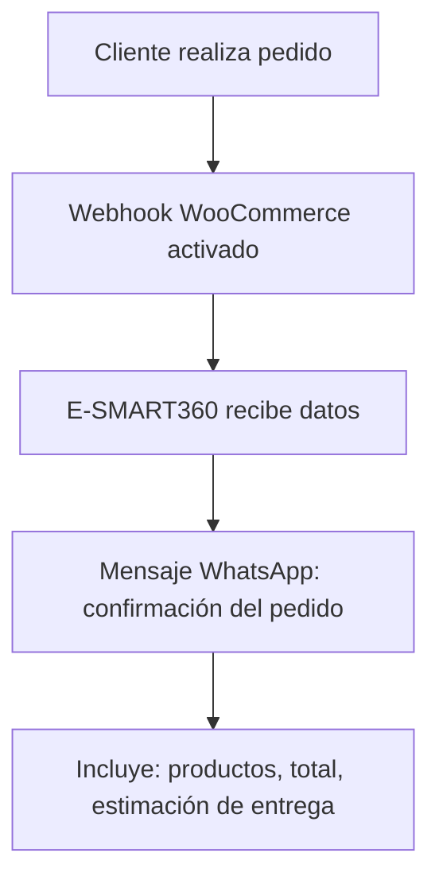

# Integrar WooCommerce con E-SMART360 para automatizar tu tienda en WhatsApp


> **Resumen:** Ve a Integraciones → E-Commerce → Nuevo → WooCommerce, ingresa Nombre de Perfil, URL de Tienda, Consumer Key y Consumer Secret, guarda y la conexión estará lista. En WooCommerce: Ajustes → Avanzado → API REST → Añadir clave → Lectura/Escritura → Generar. Copia las claves en E-SMART360 y guarda. Listo: notificaciones de pedidos en WhatsApp, verificación de COD y recuperación de carritos abandonados funcionan automáticamente.

Integrar tu tienda **WooCommerce** con **E-SMART360** desbloquea potentes funciones de automatización en WhatsApp que mantienen a tus clientes informados en tiempo real. Desde confirmaciones de pedidos y actualizaciones de envío hasta verificación de pedidos contra reembolso (COD) y recuperación de carritos abandonados, todo ocurre automáticamente a través de WhatsApp.

## ¿Por qué conectar WooCommerce con E-SMART360?


### Notificaciones instantáneas

Envía confirmaciones de pedidos y actualizaciones de envío por WhatsApp, el canal con la tasa de apertura más alta entre todos los canales de comunicación.

### Verificación de COD

Reduce las devoluciones y los pedidos falsos verificando automáticamente los pedidos contra reembolso antes de procesarlos.

### Recuperación de carritos

Recupera carritos abandonados con recordatorios oportunos y cupones de descuento personalizados.

### Bandeja unificada

Centraliza todas las conversaciones de tus clientes en la bandeja de entrada omnicanal de E-SMART360.

## Prerrequisitos

- Acceso de **administrador** a WordPress con WooCommerce instalado
- API REST de WooCommerce disponible (WooCommerce ≥3.5 la incluye nativamente)
- Tu sitio web accesible a través de **HTTPS** (recomendado)

## A. Conectar WooCommerce dentro de E-SMART360

Sigue estos pasos para establecer la conexión entre tu tienda y la plataforma:


### Acceder a la sección de integraciones

En E-SMART360, ve a **Integraciones → Shopify/WC API**.

### Crear una nueva integración

Haz clic en **Nuevo** y selecciona **WooCommerce**.

### Completar el formulario de conexión

Completa los siguientes campos:

- **Nombre del Perfil** — cualquier etiqueta que te ayude a identificar la conexión (ej. "Tienda Principal Woo").
- **URL de la Tienda** — la URL de tu sitio WordPress donde se ejecuta WooCommerce (ej. `https://tutienda.com`).
- **Consumer Key** — la clave de consumo que generarás desde WooCommerce.
- **Consumer Secret** — el secreto de consumo que generarás desde WooCommerce.

Mantén esta página abierta — pegarás las claves aquí después del siguiente paso.


> No cierres esta ventana. Después de generar las claves en WooCommerce, volverás aquí para completar la configuración.

## B. Crear claves de API REST en WooCommerce


### Ir a la configuración de API

En el panel de administración de **WordPress**, ve a **WooCommerce → Ajustes → Avanzado → API REST**.

### Generar nueva clave

Haz clic en **Añadir clave**.

### Configurar la clave

- **Descripción**: Ingresa un nombre descriptivo (ej. "Integración E-SMART360").
- **Permisos**: Selecciona **Lectura/Escritura**.
- Haz clic en **Generar clave API**.

### Copiar las credenciales

Copia el **Consumer Key** y el **Consumer Secret** generados.

### Pegar las claves en E-SMART360

Regresa a **E-SMART360 → Integraciones → E-Commerce → WooCommerce** y pega las claves en los campos correspondientes. Haz clic en **Guardar**.

Verás un mensaje de confirmación indicando que la integración fue exitosa.

## C. Habilitar automatizaciones de WhatsApp

Después de guardar la integración, puedes habilitar las automatizaciones de dos maneras diferentes.

### Opción 1: Activación rápida (Recomendada para principiantes)

Ve a **Gestor de Chatbots → Bot de WhatsApp → Automatización WC/Shopify**. Desde aquí puedes activar fácilmente:

- **Envío de Notificaciones de Pedidos** — envía mensajes automáticos a los clientes cuando se realiza o actualiza un pedido.
- **Verificación de Pedidos COD** — confirma los pedidos contra reembolso a través de WhatsApp antes de enviarlos.


> Esta opción es ideal si quieres poner en marcha las automatizaciones básicas en cuestión de minutos, sin necesidad de configuraciones complejas.

### Opción 2: Flujo de trabajo Webhook (Personalización avanzada)

Para obtener la máxima flexibilidad, ve a **Automatización de WhatsApp → Flujo de Trabajo Webhook**. Esto te permite construir flujos personalizados activados por eventos de WooCommerce, como:

- Opciones avanzadas para el envío de notificaciones.
- Lógica condicional (ej. enviar un cupón solo si el total supera los $100).
- Acciones de múltiples pasos que involucran CRMs o APIs externas.


### Ejemplos de integración con Webhook Workflow

Aquí tienes algunos ejemplos de lo que puedes lograr combinando WooCommerce con el flujo de trabajo webhook:

- Recuperar carritos abandonados de WooCommerce enviando recordatorios automáticos.
- Enviar notificaciones de pedidos de WooCommerce a WhatsApp con todos los detalles del producto.
- Enviar notificaciones de cambio de estado de pedidos (creado, pagado, enviado, completado, reembolsado).
- Verificar pedidos contra reembolso (COD) a través de WhatsApp antes de proceder con el envío.

### Automatizaciones avanzadas que puedes crear

Con la integración de WooCommerce y E-SMART360, puedes automatizar prácticamente cualquier aspecto de la gestión de pedidos:

- Enviar mensajes automáticos de WhatsApp para **pedido creado**, **pagado**, **enviado**, **completado** y **reembolsado**.
- Añadir variables dinámicas como **nombre del cliente**, **total del pedido** y **enlace de seguimiento**.
- Enviar un mensaje automático a clientes COD para **confirmar el pedido**.
- Ofrecer un incentivo para cambiar de COD a **pago anticipado** (opcional).
- Detectar carritos con productos pero sin finalizar la compra.
- Enviar recordatorios inteligentes, **códigos de descuento** y enlaces de productos para recuperar clientes.

## D. Configuración avanzada: Verificación de pedidos COD

Una de las funciones más potentes de la integración es la verificación automática de pedidos contra reembolso. Este proceso te ayuda a reducir pedidos falsos y devoluciones.

### Crear una plantilla de mensaje para verificación COD


### Ir al Gestor de Plantillas

En E-SMART360, ve a **Gestor de Chatbots → Plantillas de Mensajes** y haz clic en **Crear**.

### Configurar la plantilla

- Ingresa un **nombre** para la plantilla.
- Selecciona el **idioma** y la **categoría** (Marketing o Utilidad).
- Escribe el cuerpo del mensaje incluyendo variables para **Lista de Productos** y **Precio Total**.

### Añadir botones de respuesta rápida

Agrega botones de **Respuesta Rápida**:
- **"Confirmar Pedido"**
- **"Cancelar Pedido"**

Estos botones permitirán al cliente responder directamente desde WhatsApp.

### Guardar y sincronizar

Guarda la plantilla y espera a que sea aprobada por Meta. Una vez aprobada, estará lista para usarse.

### Crear el flujo de trabajo webhook para COD


### Ir a Flujo de Trabajo Webhook

En E-SMART360, ve a **Flujo de Trabajo Webhook** y haz clic en **Crear Flujo de Trabajo**.

### Configurar el webhook

- Ingresa un **nombre** para el flujo de trabajo.
- Selecciona la **cuenta de WhatsApp** que deseas utilizar.
- Elige la **plantilla de mensaje** que creaste para la verificación COD.
- Copia la **URL de Callback del Webhook** que se genera automáticamente.

### Añadir el webhook en WooCommerce

En el panel de administración de WordPress:
- Ve a **WooCommerce → Ajustes → Avanzado → Webhooks**.
- Haz clic en **Añadir Webhook**.
- **Nombre**: Ingresa un nombre descriptivo.
- **Estado**: Activo.
- **Tema**: Selecciona **Pedido Creado**.
- **URL de Entrega**: Pega la URL de Callback que copiaste.
- Guarda el webhook.

### Capturar datos de respuesta

En E-SMART360, haz clic en **Capturar Respuesta del Webhook**. Luego realiza un pedido de prueba en WooCommerce para generar datos reales. Después de unos segundos, los datos del pedido aparecerán en la pantalla.

### Mapear los campos

En la sección **Mapeo de Respuesta del Webhook**, asigna los siguientes campos:
- **Número de Teléfono** → Número de teléfono de facturación.
- **Precio Total** → Variable de precio total.
- **Lista de Productos** → Elementos de línea (line_items).

### Configurar formateador para lista de productos

Haz clic en **Nuevo** en la sección de Formateadores de Datos:
- **Nombre**: Ingresa un nombre (ej. "Formatear Productos").
- **Acción**: Selecciona **concat list items**.
- **Separador**: Ingresa una coma (`,`).
- **Posición**: Escribe `name`.
- Guarda el formateador y selecciónalo en el campo de lista de productos.

### Configurar postbacks para los botones

Selecciona los postbacks correspondientes para los botones de respuesta rápida:
- **Confirmar pedido**: Selecciona el postback de confirmación.
- **Cancelar pedido**: Selecciona el postback de cancelación.

### Crear APIs de Callback

Ve a **APIs de Callback** → **Nuevo**:
- **Confirmación**: Crea una API para **Actualización de Nota de Pedido de WooCommerce** con una nota de confirmación.
- **Cancelación**: Crea otra API similar con una nota de cancelación.
- Asigna cada API al botón de respuesta rápida correspondiente.

### Añadir regla para pedidos COD

En el flujo de trabajo, haz clic en **Añadir Regla**:
- **Campo de datos**: Selecciona `payment_method`.
- **Operador**: Igual a (`=`).
- **Valor**: `cod`.
- Guarda el flujo de trabajo.

Esto asegura que solo los pedidos contra reembolso activen el mensaje de verificación.


> Recuerda que los números de teléfono en WhatsApp no deben incluir el signo `+`. Si tus datos incluyen el prefijo `+`, usa un formateador de datos con la acción **Trim Left** y el valor `+` para eliminarlo automáticamente.

### Probar el sistema de verificación COD


### Realizar un pedido de prueba

Crea un pedido contra reembolso en WooCommerce desde un número de teléfono válido.

### Verificar el flujo de trabajo

En E-SMART360, revisa el **Informe del Flujo de Trabajo** para confirmar que el webhook se ejecutó correctamente.

### Confirmar el mensaje en WhatsApp

Verifica que el cliente recibe el mensaje de WhatsApp con los detalles del pedido y los botones de confirmación/cancelación.

### Probar la respuesta del cliente

Haz clic en **Cancelar Pedido** desde el mensaje de WhatsApp y verifica que el estado del pedido en WooCommerce se actualiza correctamente.

## E. Recuperación de carritos abandonados

Los carritos abandonados representan ingresos perdidos, pero no tienen por qué quedarse así. Con E-SMART360 puedes enviar recordatorios automáticos por WhatsApp para recuperarlos.

### ¿Cuándo se considera un carrito abandonado?

Un carrito se considera abandonado cuando un cliente:
- Añade productos a su carrito.
- Ingresa sus datos de contacto (incluyendo número de teléfono).
- Abandona la página sin completar el pago.


### Configurar la recuperación de carritos abandonados paso a paso

**1. Crear una plantilla de mensaje para carritos abandonados**

Ve a **Gestor de Chatbots → Plantillas de Mensajes → Crear**:
- Selecciona la categoría **Marketing**.
- Escribe un mensaje atractivo que incluya un descuento o incentivo.
- Añade un botón de llamada a la acción que enlace directamente al carrito.
- Guarda y sincroniza la plantilla. Espera la aprobación de Meta.

**2. Configurar el flujo de trabajo webhook**

- Ve a **Flujo de Trabajo Webhook** y haz clic en **Crear**.
- Ingresa un nombre y selecciona la cuenta de WhatsApp.
- Elige la plantilla de mensaje que acabas de crear.
- Copia la URL del webhook generada.

**3. Instalar el plugin de carritos abandonados**

En E-SMART360, ve a **Integraciones → E-Commerce** y descarga el **Plugin de Webhook para Carritos Abandonados de WooCommerce**. Instálalo y actívalo en WordPress.

En el panel de WordPress, ve a **Ajustes → Configuración del Webhook de Carrito Abandonado** y pega la URL del webhook. Guarda los cambios.

**4. Mapear los datos del webhook**

En E-SMART360, haz clic en **Capturar Respuesta del Webhook**. Ve a WordPress y haz clic en **Enviar Webhook de Prueba**.

En la sección **Mapeo de Respuesta del Webhook**:
- **Número de Teléfono** → Número de teléfono de facturación.
- Mapea cualquier campo personalizado adicional si es necesario.
- Guarda el flujo de trabajo.

**5. Eliminar el signo "+" de los números**

Ve a **Formateadores de Datos** → **Nuevo**:
- **Acción**: Trim Left.
- **Campo a recortar**: `+`.
- Guarda y aplica el formateador.

## Preguntas frecuentes


### ¿Qué permisos necesitan las claves de API de WooCommerce?

Configura los permisos como **Lectura/Escritura** al generar las claves en WooCommerce → Ajustes → Avanzado → API REST. Esto permite que E-SMART360 lea información de pedidos y realice actualizaciones (como añadir notas de confirmación o cancelación).

### ¿Qué debo ingresar como URL de Tienda en E-SMART360?

Usa la URL exacta del sitio WordPress donde está instalado WooCommerce, incluyendo `https://`. Por ejemplo: `https://tutienda.com`.

### ¿E-SMART360 puede enviar actualizaciones de pedidos automáticamente?

Sí. Habilita las **Notificaciones de Pedidos** en la sección de Automatización → Automatizaciones de E-Commerce. Puedes configurar disparadores para cada estado del pedido: creado, pagado, enviado, completado y reembolsado.

### ¿Qué hago si el mensaje de WhatsApp no se envía?

Verifica lo siguiente:
1. El número de teléfono está en formato correcto (sin el signo `+`).
2. La plantilla de mensaje ha sido aprobada por Meta.
3. La URL del webhook está correctamente copiada en WooCommerce.
4. El cliente tiene un número de teléfono válido registrado en el pedido.

### ¿Cuánto tiempo toma la configuración completa?

Normalmente entre 5 y 15 minutos si ya tienes acceso de administrador a WordPress y las claves de API de WooCommerce. La aprobación de las plantillas de mensaje por Meta puede tomar desde unos minutos hasta 24 horas.

### ¿Puedo usar varias cuentas de WhatsApp para diferentes tiendas?

Sí, E-SMART360 soporta múltiples números de WhatsApp. Puedes conectar varias tiendas WooCommerce y asignar diferentes cuentas de WhatsApp a cada una.

## Ejemplos prácticos


### Caso 1: Tienda de ropa online

Una tienda de ropa implementó la verificación COD con E-SMART360. Cada vez que un cliente seleccionaba pago contra reembolso, recibía un mensaje automático con los productos y el total. El cliente debía confirmar el pedido para que se procesara. **Resultado: reducción del 40% en devoluciones por pedidos falsos.**

### Caso 2: Tienda de electrónica

Una tienda de electrónica configuró la recuperación de carritos abandonados con un cupón del 10% de descuento. Cuando un cliente abandonaba el carrito, recibía un recordatorio en WhatsApp con el enlace directo al checkout. **Resultado: recuperación del 25% de los carritos abandonados en la primera semana.**

## Consejos y solución de problemas


> **Verifica la URL del webhook:** Asegúrate de que la URL del callback esté copiada exactamente como se muestra en E-SMART360, sin espacios adicionales ni caracteres faltantes.

> **Usa el mapeo correcto de variables:** Verifica que cada campo en el mapeo de respuesta del webhook corresponda al dato correcto del pedido. Un mapeo incorrecto puede resultar en mensajes con datos vacíos.

> **Revisa los permisos de la API de WooCommerce:** Si el webhook no funciona, verifica que las claves de API tengan permisos de **Lectura/Escritura** y que no hayan sido revocadas.

> **Prueba con un pedido de muestra:** Antes de lanzar la automatización en producción, realiza siempre una prueba con un pedido real para confirmar que todo funciona correctamente.

## Solución de problemas comunes

### El webhook no se activa

Si el webhook de WooCommerce no está enviando datos a E-SMART360, verifica lo siguiente:

1. **Estado del webhook**: En WooCommerce → Ajustes → Avanzado → Webhooks, confirma que el estado sea **Activo**.
2. **URL de entrega**: Asegúrate de que la URL del callback esté exactamente como la proporcionó E-SMART360.
3. **Tema del webhook**: Verifica que el tema seleccionado sea el correcto (ej. `order.created` para nuevos pedidos).
4. **Firewall**: Algunos servidores bloquean conexiones salientes. Consulta con tu proveedor de hosting.

### Los mensajes no llegan al cliente

1. **Plantilla no aprobada**: Revisa que la plantilla de mensaje haya sido aprobada por Meta. Las plantillas en estado "Pendiente" o "Rechazada" no se pueden enviar.
2. **Número de teléfono incorrecto**: El número debe incluir el código de país sin el signo `+`. Usa el formateador Trim Left si es necesario.
3. **Límite de mensajes**: Revisa que no hayas excedido el límite de mensajes de tu tier de WhatsApp.
4. **Ventana de 24 horas**: Los mensajes de plantilla solo se pueden enviar fuera de la ventana de 24 horas de conversación.

### Error al mapear los campos del webhook

1. **Datos de muestra vs. reales**: Asegúrate de usar datos reales de un pedido de prueba, no solo los datos de muestra predeterminados.
2. **Formateadores**: Si la lista de productos no se muestra correctamente, verifica que el formateador **concat list items** esté configurado con el campo `name`.
3. **Actualización de datos**: Si cambias la estructura de los datos del webhook, vuelve a capturar la respuesta y re-mapea los campos.

## Integraciones adicionales recomendadas

Una vez que tengas WooCommerce conectado, puedes potenciar aún más tu automatización combinándolo con otras integraciones:


### Google Sheets

Combina WooCommerce con Google Sheets para:
- Exportar pedidos automáticamente a una hoja de cálculo.
- Segmentar clientes por historial de compras.
- Crear campañas de marketing basadas en datos de pedidos.

### Zapier

Conecta WooCommerce con más de 3000 aplicaciones:
- Envía datos de pedidos a tu CRM.
- Crea tickets de soporte automáticos.
- Sincroniza clientes con tu plataforma de email marketing.

### Webhook Workflow

Crea flujos complejos con:
- Lógica condicional avanzada.
- Múltiples pasos con diferentes APIs.
- Secuencias de mensajes en cadena.

## Automatización de notificaciones por estado de pedido

Aquí tienes una guía detallada de los tipos de notificaciones que puedes automatizar según el estado del pedido:

### Pedido creado



### Pedido pagado
Cuando el cliente completa el pago (especialmente útil para conversiones de COD a prepago):
- Envía un mensaje de agradecimiento.
- Incluye el comprobante de pago.
- Proporciona el número de seguimiento si está disponible.

### Pedido enviado
- Notifica al cliente que su pedido está en camino.
- Incluye el enlace de seguimiento del paquete.
- Añade el tiempo estimado de entrega.

### Pedido completado
- Solicita una reseña o valoración del producto.
- Ofrece un cupón de descuento para la próxima compra.
- Pregunta si necesita ayuda con el producto.

### Pedido reembolsado
- Notifica al cliente sobre el reembolso.
- Explica el motivo y el tiempo estimado para ver el dinero en su cuenta.
- Ofrece asistencia si tiene preguntas adicionales.

## Plantilla de ejemplo para notificación de pedido


#### Plantilla de pedido

```
¡Hola {{1}}! 🎉

Hemos recibido tu pedido #{{2}} en {{3}}.

📦 Productos:
{{4}}

💰 Total: {{5}}

🚚 Estado: {{6}}

Gracias por confiar en nosotros. Te mantendremos informado sobre cada paso.

¡Saludos,
El equipo de {{7}}!
```

### Variables de la plantilla

| Variable | Descripción |
|----------|-------------|
| `{{1}}` | Nombre del cliente |
| `{{2}}` | Número de pedido |
| `{{3}}` | Nombre de la tienda |
| `{{4}}` | Lista de productos |
| `{{5}}` | Total del pedido |
| `{{6}}` | Estado del pedido |
| `{{7}}` | Nombre de la tienda (despedida) |

## Estrategias para reducir devoluciones COD

Las devoluciones en pedidos contra reembolso pueden afectar significativamente la rentabilidad de tu tienda. Aquí tienes algunas estrategias adicionales:


### Confirmación en 2 pasos

Envía un primer mensaje informando del pedido y un segundo mensaje 30 minutos después solicitando confirmación explícita. Los clientes que confirman dos veces tienen una tasa de aceptación mucho mayor.

### Incentivo al prepago

Ofrece un descuento del 5-10% si el cliente cambia de COD a pago anticipado. Incluye este incentivo en el mensaje de confirmación del pedido.

### Recordatorio de entrega

24 horas antes de la entrega, envía un mensaje recordatorio con la dirección y el horario estimado. Reduce significativamente los rechazos en el momento de la entrega.

## FAQ avanzada


### ¿Puedo usar E-SMART360 con múltiples tiendas WooCommerce?

Sí, puedes conectar tantas tiendas WooCommerce como necesites. Cada tienda debe configurarse como un perfil de integración independiente en E-SMART360. Puedes crear flujos de trabajo webhook diferentes para cada tienda y asignarlos a diferentes cuentas de WhatsApp si lo deseas.

### ¿E-SMART360 soporta pedidos con múltiples productos?

Sí, los flujos de trabajo webhook manejan correctamente pedidos con múltiples productos. Usa el formateador **concat list items** para combinar todos los nombres de productos en una sola cadena de texto, separados por comas. También puedes personalizar el separador (ej. punto y coma, guión, o salto de línea).

### ¿Cómo manejo los reembolsos automáticos?

Puedes configurar un flujo de trabajo webhook que se active con el evento `order.refunded` de WooCommerce. E-SMART360 enviará automáticamente un mensaje de notificación al cliente informándole sobre el reembolso, el monto y el tiempo estimado para ver el dinero reflejado.

### ¿Qué pasa si el cliente no responde al mensaje de verificación COD?

Si el cliente no responde dentro de un período definido (ej. 24 horas), puedes configurar un recordatorio automático o marcar el pedido como "no confirmado" para revisión manual. E-SMART360 te permite establecer reglas de escalamiento para estos casos.

### ¿Puedo enviar imágenes de productos en las notificaciones?

Sí, utilizando plantillas de mensaje multimedia. Puedes crear plantillas que incluyan imágenes de los productos comprados, lo que ayuda a reducir confusiones y aumenta la confianza del cliente en la compra.

## Conclusión

Integrar WooCommerce con E-SMART360 transforma completamente la forma en que gestionas la comunicación con tus clientes. Desde la confirmación inicial del pedido hasta la recuperación de carritos abandonados y la verificación de pagos contra reembolso, cada paso del ciclo de compra puede automatizarse para ofrecer una experiencia fluida y profesional.


> **¿Listo para empezar?** Conecta tu tienda WooCommerce con E-SMART360 siguiendo los pasos de esta guía y descubre cómo la automatización inteligente puede impulsar tus ventas y reducir tus costos operativos.

### Guía rápida de variables de WooCommerce disponibles en E-SMART360

Cuando configures el mapeo de respuesta del webhook, estas son las variables más comunes que puedes utilizar desde los datos del pedido de WooCommerce:

| Variable en WooCommerce | Campo en E-SMART360 | Descripción |
|---|---|---|
| `billing.first_name` | Nombre del cliente | Nombre de pila del cliente |
| `billing.last_name` | Apellido del cliente | Apellido del cliente |
| `billing.phone` | Número de teléfono | Teléfono de facturación |
| `billing.email` | Correo electrónico | Email de facturación |
| `billing.address_1` | Dirección | Dirección principal |
| `billing.city` | Ciudad | Ciudad de facturación |
| `billing.state` | Estado/Provincia | Estado o provincia |
| `billing.postcode` | Código postal | Código postal de facturación |
| `billing.country` | País | País de facturación |
| `total` | Total del pedido | Monto total del pedido |
| `total_tax` | Impuestos | Total de impuestos |
| `shipping_total` | Envío | Total del envío |
| `discount_total` | Descuento | Total de descuentos aplicados |
| `payment_method` | Método de pago | Método de pago seleccionado |
| `payment_method_title` | Nombre del método de pago | Nombre legible del método de pago |
| `line_items` | Lista de productos | Array con los productos del pedido |
| `shipping_lines` | Método de envío | Array con los métodos de envío |


> Puedes usar tanto variables planas como estructuras anidadas. Por ejemplo, `billing.phone` accede al teléfono dentro del objeto `billing`. El sistema de mapeo de E-SMART360 reconoce automáticamente estos formatos.

## Configuración de reglas condicionales avanzadas

Las reglas condicionales en el flujo de trabajo webhook te permiten enviar mensajes diferentes según las características del pedido. Aquí tienes algunos ejemplos prácticos:

### Ejemplo 1: Enviar mensaje solo para pedidos de alto valor

Configuración de la regla:
- **Campo**: `total`
- **Operador**: Mayor o igual que (`>=`)
- **Valor**: `100`

Esto activa el mensaje solo cuando el total del pedido es de $100 o más.

### Ejemplo 2: Segmentar por método de envío

Puedes crear reglas para enviar mensajes diferentes según el método de envío seleccionado:

- Si el método de envío es "Envío exprés": mensaje con tiempo de entrega de 24 horas.
- Si el método de envío es "Envío estándar": mensaje con tiempo de entrega de 5-7 días.

### Ejemplo 3: Notificaciones basadas en categoría de producto

Si vendes productos de diferentes categorías (ropa, electrónica, hogar), puedes configurar flujos separados que activen mensajes específicos según la categoría del producto en el pedido.

## Estrategias de segmentación para campañas de marketing post-venta

### Segmentación por frecuencia de compra


### Nuevos compradores (1ra compra)

**Estrategia:** Envía un mensaje de bienvenida con un cupón de descuento para su segunda compra.

**Ejemplo de mensaje:**
"¡Gracias por tu primera compra, {{nombre}}! 🎉 Como agradecimiento, aquí tienes un 15% de descuento en tu próximo pedido. Usa el código: BIENVENIDO15"

### Compradores recurrentes (+3 compras)

**Estrategia:** Ofrece acceso anticipado a nuevos productos o ventas exclusivas.

**Ejemplo de mensaje:**
"{{nombre}}, eres un cliente VIP! 🌟 Como valoramos tu lealtad, tendrás acceso anticipado a nuestra nueva colección este viernes. ¡Mantente atento!"

### Segmentación por valor del pedido

| Tipo de cliente | Valor del pedido | Estrategia |
|---|---|---|
| Cliente de bajo valor | < $30 | Envía ofertas de productos complementarios de bajo costo |
| Cliente de valor medio | $30 - $100 | Ofrece envío gratis en su próxima compra |
| Cliente de alto valor | > $100 | Invita a un programa de fidelidad o membresía exclusiva |
| Cliente premium | > $500 | Ofrece atención personalizada y descuentos por volumen |

### Automatización de reseñas y valoraciones

Después de que un pedido sea marcado como "completado" en WooCommerce, puedes configurar un flujo que:

1. Espere 3 días (para que el cliente reciba y pruebe el producto).
2. Envíe un mensaje amigable solicitando una reseña.
3. Incluya un enlace directo a la página de valoración del producto.
4. Ofrezca un pequeño incentivo (descuento o puntos de fidelidad) por dejar una reseña.

## Integración con métodos de pago populares

E-SMART360 es compatible con los principales métodos de pago de WooCommerce, lo que te permite crear flujos personalizados para cada uno:


### PayPal

Los pedidos pagados con PayPal pueden activar:
- Mensaje de confirmación inmediata con el ID de transacción.
- Enlace para seguimiento del pago.
- Notificación cuando el pago se complete exitosamente.

### Stripe

Con Stripe, puedes:
- Verificar el estado de la transacción.
- Enviar recibos digitales.
- Gestionar reembolsos automáticos.

### Transferencia bancaria

Para pagos por transferencia:
- Envía los datos bancarios automáticamente.
- Configura un recordatorio si el pago no se recibe en 48 horas.
- Confirma la recepción del pago de forma manual o automática.

### Contra reembolso (COD)

Como ya vimos en detalle:
- Envía el mensaje de verificación.
- Espera la confirmación del cliente.
- Actualiza el estado del pedido según la respuesta.

## Optimización de la tasa de conversión de mensajes

Para maximizar la efectividad de tus mensajes automatizados, considera estos consejos basados en datos:

### Mejores prácticas para mensajes de WhatsApp

1. **Personalización**: Usa siempre el nombre del cliente. Los mensajes personalizados tienen tasas de apertura 3 veces mayores.
2. **Claridad**: Sé directo y específico. Indica claramente qué acción debe tomar el cliente.
3. **Timing**: Envía los mensajes en horarios adecuados (evita noches y fines de semana).
4. **Llamada a la acción clara**: Cada mensaje debe tener un objetivo único y un botón o instrucción clara.
5. **Valor**: Asegúrate de que cada mensaje aporte valor al cliente, no solo información.

### Métricas clave para monitorear

| Métrica | Qué mide | Valor óptimo |
|---------|----------|-------------|
| **Tasa de apertura** | % de mensajes abiertos | > 90% (WhatsApp) |
| **Tasa de clics** | % de clics en botones CTA | > 15% |
| **Tasa de confirmación COD** | % de pedidos COD confirmados | > 70% |
| **Tasa de recuperación de carritos** | % de carritos recuperados | > 10% |
| **Tasa de cancelación** | % de pedidos cancelados tras notificación | < 5% |

## Preguntas frecuentes adicionales


### ¿Qué pasa si WooCommerce no tiene un carrito abandonado nativo?

Efectivamente, WooCommerce no incluye una funcionalidad nativa de carritos abandonados. Para solucionarlo, E-SMART360 proporciona un plugin especializado de "Webhook para Carritos Abandonados de WooCommerce" que puedes descargar desde la sección de Integraciones. Este plugin detecta cuándo un cliente añade productos al carrito, ingresa sus datos y abandona la página sin completar la compra, activando automáticamente el webhook.

### ¿Cómo evito que los clientes reciban mensajes duplicados?

Las respuestas duplicadas pueden ocurrir cuando múltiples reglas o flujos coinciden con el mismo evento. Para evitarlo:
1. Revisa que no tengas flujos de trabajo duplicados configurados.
2. Asegúrate de que las reglas condicionales sean mutuamente excluyentes.
3. Usa el filtro de estado del pedido para evitar que un pedido actualizado active múltiples notificaciones.
4. Verifica que las automatizaciones rápidas (Opción 1) y los flujos webhook (Opción 2) no estén configurados para el mismo evento.

### ¿E-SMART360 puede manejar pedidos en múltiples monedas?

Sí, los flujos de trabajo webhook respetan la moneda configurada en WooCommerce. El sistema de mapeo extrae el valor del campo `currency` del pedido y lo pasa a la plantilla de mensaje. Puedes personalizar el mensaje para que incluya el símbolo de la moneda (ej. $, €, £).

### ¿Qué hago si se me olvidó el Consumer Key o Consumer Secret?

Si perdiste las claves de API REST, puedes generar nuevas desde WooCommerce → Ajustes → Avanzado → API REST. Localiza la clave anterior y haz clic en **Revocar** para desactivarla, luego crea una nueva siguiendo los pasos de la sección B de esta guía. No olvides actualizar las claves en E-SMART360 después de generarlas.

### ¿Puedo probar la integración sin enviar mensajes reales?

E-SMART360 ofrece un modo de prueba que te permite capturar y revisar los datos del webhook sin enviar mensajes reales. Puedes:
1. Activar la opción de **modo sandbox** en el flujo de trabajo.
2. Realizar pedidos de prueba en WooCommerce.
3. Revisar los datos capturados en la sección de **Informe del Flujo de Trabajo**.
4. Ajustar el mapeo y las reglas antes de activar el envío real de mensajes.

### ¿E-SMART360 maneja cupones y descuentos de WooCommerce?

Sí, puedes acceder a los datos de cupones y descuentos aplicados a un pedido usando la variable `coupon_lines`. Esto te permite:
- Enviar mensajes confirmando el descuento aplicado.
- Informar al cliente del ahorro obtenido.
- Mostrar el precio original y el precio con descuento.

## ¿Qué sigue?

Una vez completada la integración básica, te recomendamos explorar:

1. **Notificaciones avanzadas**: Configura mensajes personalizados para cada estado del pedido.
2. **Segmentación de clientes**: Usa los datos de WooCommerce para crear campañas de marketing segmentadas.
3. **Análisis de datos**: Revisa los informes de flujo de trabajo para optimizar tus automatizaciones.
4. **Escalamiento**: A medida que tu negocio crece, añade más números de WhatsApp y más flujos de trabajo. Con la arquitectura flexible de E-SMART360, escalar es tan simple como crear una nueva integración.
