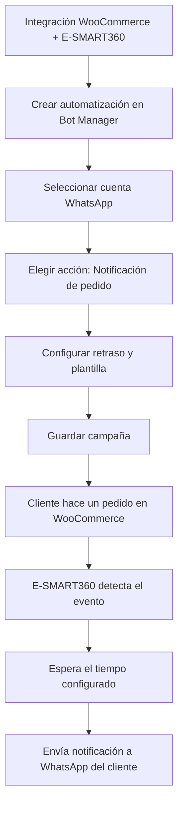

# Notificaciones de Pedidos WooCommerce a WhatsApp

Con E-SMART360 puedes enviar notificaciones de pedidos de WooCommerce directamente a WhatsApp, manteniendo a tus clientes informados en tiempo real sobre el estado de sus compras.

Para lograrlo, primero debes integrar tu tienda WooCommerce con E-SMART360 y luego crear una campaña de automatización que gestione el envío de las notificaciones.

> La notificación automática de pedidos por WhatsApp mejora la experiencia del cliente, reduce consultas de soporte y aumenta la confianza en tu tienda online.

## Requisitos Previos

Antes de comenzar, asegúrate de tener lo siguiente:

- Una cuenta activa en E-SMART360
- Una tienda WooCommerce funcionando (WordPress + WooCommerce)
- Un número de teléfono conectado a WhatsApp Cloud API
- Acceso al panel de administración de tu tienda WooCommerce

> Si aún no has conectado tu número de WhatsApp, consulta la guía de conexión de WhatsApp Business API en la sección de configuración de E-SMART360.

## Paso 1: Integrar WooCommerce con E-SMART360

El primer paso es conectar tu tienda WooCommerce con la plataforma E-SMART360. Esta integración permite que ambas herramientas intercambien información sobre productos, pedidos y clientes.

Sigue estos pasos:

### Accede a las integraciones

Inicia sesión en tu panel de E-SMART360. En el menú lateral, navega a la sección de **Integraciones** y busca la opción de **WooCommerce**.
  
### Configura la API de WooCommerce

En tu panel de administración de WooCommerce (WordPress), ve a **WooCommerce → Ajustes → Avanzado → API REST**. Crea una nueva clave de API con permisos de **Lectura/Escritura**.
    
> Asegúrate de generar la clave API con permisos de lectura y escritura para que E-SMART360 pueda leer los pedidos y enviar notificaciones correctamente.
    
### Ingresa las credenciales en E-SMART360

Copia la **Consumer Key** y **Consumer Secret** generadas en WooCommerce. Pégalas en los campos correspondientes dentro del formulario de integración de E-SMART360. Ingresa también la URL de tu tienda.
  
### Verifica la conexión

Haz clic en **Verificar Conexión** para asegurarte de que la comunicación entre WooCommerce y E-SMART360 funciona correctamente. Si todo está bien, verás un mensaje de confirmación.
  
### Guarda la integración

Una vez verificada la conexión, guarda la configuración. Tu tienda WooCommerce aparecerá ahora como integrada en E-SMART360.
  

> Una vez completada la integración, E-SMART360 podrá acceder a los datos de tu tienda para crear automatizaciones basadas en eventos como nuevos pedidos, cambios de estado o carritos abandonados.

## Paso 2: Crear la Campaña de Automatización

Una vez que tu tienda WooCommerce está integrada, el siguiente paso es crear la campaña que gestionará el envío de notificaciones de pedidos por WhatsApp.

### Accede al gestor de bots

Ve al panel de control de E-SMART360 y dirígete a **WhatsApp → Bot Manager** o **WhatsApp → Automatizaciones**.
  
### Selecciona la cuenta de WhatsApp

Elige la cuenta de WhatsApp desde la cual deseas enviar las notificaciones de pedido. Esta debe ser la cuenta oficial de tu negocio.
  
### Elige la opción de automatización WooCommerce/Shopify

Busca y selecciona la opción **Automatización WC/Shopify** o **Notificaciones de WooCommerce** dentro del menú de automatizaciones.
  
### Crea la automatización

Haz clic en el botón **Crear**. Se abrirá un formulario con los campos que deberás completar.
  
### Configuración del formulario de automatización

Completa los siguientes campos en el formulario de automatización:

### Campos obligatorios

- **Nombre de la campaña**: Asigna un nombre descriptivo como "Notificaciones de pedidos - WooCommerce"
    - **Tipo de tienda**: Selecciona **WooCommerce**
    - **Seleccionar tienda API**: Elige la tienda WooCommerce que integraste previamente
    - **Acción**: Selecciona **Notificación de pedido**
  
### Campos opcionales y avanzados

- **Retraso del mensaje (minutos)**: Define el tiempo de espera antes de enviar la notificación (útil para confirmar que el pedido no fue cancelado)
    - **Plantilla de mensaje**: Se asignará automáticamente la plantilla predeterminada del sistema, como `system_order_success_notification_new`
    - **Asignar etiqueta**: Puedes asignar una etiqueta para organizar los contactos que reciben notificaciones
    - **Asignar secuencia**: Opcionalmente, asigna una secuencia de seguimiento post-compra
  

### Guarda la configuración

Una vez que hayas completado todos los campos, haz clic en **Guardar**. La campaña de automatización quedará activa de inmediato.
    
> ¡Listo! La automatización está creada. Ahora cada vez que un cliente realice un pedido en tu tienda WooCommerce, recibirá una notificación en WhatsApp después del tiempo que hayas configurado.
    
## Paso 3: Probar la Automatización

Para verificar que todo funciona correctamente, realiza un pedido de prueba en tu tienda WooCommerce.

1. Accede a tu tienda como cliente y completa el proceso de compra con un número de teléfono válido.
2. Espera el tiempo de retraso que configuraste en la campaña.
3. Revisa la conversación de WhatsApp en el número que proporcionaste.

> Deberías recibir un mensaje automático confirmando el pedido con los detalles relevantes. Si no recibes la notificación, verifica que la integración de WooCommerce esté activa y que la cuenta de WhatsApp esté correctamente configurada.

## Configuración Avanzada: Notificaciones con Webhook Workflow

Además del método estándar de automatización, E-SMART360 ofrece una alternativa más flexible mediante **Webhook Workflow**. Esta opción te permite personalizar completamente los mensajes y añadir lógica condicional.

### ¿Qué es Webhook Workflow?

Es un sistema que permite capturar eventos de WooCommerce a través de webhooks y disparar acciones personalizadas en WhatsApp. Es ideal para escenarios donde necesitas:

- Enviar mensajes diferentes según el estado del pedido
- Incluir datos dinámicos como productos, totales o direcciones de envío
- Combinar notificaciones con otras integraciones

### Configuración del Webhook Workflow

### Crea un webhook en WooCommerce

En tu panel de WordPress, ve a **WooCommerce → Ajustes → Avanzado → Webhooks**. Crea un nuevo webhook con los siguientes datos:
    - **Nombre**: Notificaciones WhatsApp
    - **Estado**: Activo
    - **Tópico**: Selecciona el evento (por ejemplo, "Pedido creado" o "Pedido completado")
    - **URL de entrega**: La URL del webhook que se genera en E-SMART360
  
### Configura el webhook en E-SMART360

En el panel de E-SMART360, ve a **Webhook Workflow**. Haz clic en **Crear** y completa:
    - **Nombre**: Asigna un nombre al workflow
    - **Cuenta de WhatsApp**: Selecciona la cuenta emisora
    - **Plantilla de mensaje**: Elige o crea la plantilla que se usará para la notificación
  
### Captura y mapea los datos del webhook

Una vez creado el webhook, el sistema te proporcionará una URL. Cópiala y pégala en la configuración del webhook de WooCommerce.
    
    Luego:
    1. En E-SMART360, haz clic en **Capturar respuesta del webhook**
    2. En WooCommerce, realiza un pedido de prueba o usa la opción **Enviar webhook de muestra**
    3. Los datos capturados aparecerán en el mapeo de respuesta
  
### Configura el mapeo de campos

Asigna cada campo del webhook a los lugares correspondientes en tu plantilla de mensaje:
    - **Número de teléfono** → billing phone number (el número de teléfono de facturación del cliente)
    - **Nombre del cliente** → first_name + last_name
    - **Total del pedido** → order_total
    - **Productos** → line_items
    - **ID del pedido** → order_id
  
### Guarda y activa el workflow

Una vez completado el mapeo, guarda el workflow. Este quedará activo y empezará a procesar las notificaciones automáticamente.
  

> El Webhook Workflow te permite usar **formateadores de datos**. Por ejemplo, si tu webhook devuelve el número con el signo "+" (ej: +521234567890), puedes usar el formateador **Trim Left** para eliminar el "+" y que WhatsApp lo acepte sin problemas.

## Recuperación de Carritos Abandonados

Las notificaciones de pedidos no son lo único que puedes automatizar. Con la misma integración WooCommerce, puedes configurar la **recuperación de carritos abandonados** para enviar recordatorios automáticos a los clientes que dejaron productos sin comprar.

### ¿Cuándo se considera un carrito abandonado?

WooCommerce no tiene un sistema nativo de carritos abandonados, pero un carrito se considera abandonado cuando:

- El cliente agrega productos al carrito
- Ingresa sus datos de contacto, incluyendo el número de teléfono
- Abandona la página sin completar el pago

### Configurar recuperación de carritos abandonados

### Descarga e instala el plugin de carrito abandonado

En E-SMART360, ve a **Integraciones → E-Commerce** y descarga el plugin **WooCommerce Abandoned Cart Webhook Plugin**. Instálalo y actívalo en tu panel de WordPress.
  
### Configura la URL del webhook en el plugin

Ve a **Ajustes → Abandoned Cart Webhook Setting** en tu WordPress. Pega la URL del webhook que generaste en el paso anterior y guarda los cambios.
  
### Crea una plantilla de mensaje atractiva

Diseña una plantilla de mensaje para carritos abandonados que incluya:
    - Un recordatorio amigable de los productos dejados en el carrito
    - Un incentivo o descuento para motivar la compra
    - Un botón de llamada a la acción con enlace directo al carrito
    
> Las plantillas de tipo **Marketing** son las adecuadas para campañas de recuperación de carritos. Deben ser aprobadas por Meta antes de usarse.
    
### Mapea los datos del webhook

Ve a la página de la campaña del Webhook Workflow y entra a **Mapeo de Respuesta del Webhook**. Asigna:
    - **Número de teléfono** → Billing phone number
    - **Nombre** → Customer name
    - **Productos** → Cart items
    - **Total** → Cart total
  
### Elimina el signo + de los números de teléfono

WhatsApp no permite el signo "+" en los números. En el Webhook Workflow, ve a **Formateadores de Datos** → **Nuevo**. Configura:
    - **Acción**: Trim Left (Recortar por la izquierda)
    - **Campo a recortar**: "+"
    Guarda y aplica el formateador.
  
### Prueba y activa

Realiza una prueba agregando productos al carrito, ingresando un número de teléfono válido y abandonando el proceso. Si todo está configurado correctamente, recibirás el recordatorio en WhatsApp.
  

> La recuperación de carritos abandonados por WhatsApp puede incrementar tus ventas entre un 10% y un 30%, ya que los mensajes llegan directamente al teléfono del cliente y tienen altas tasas de apertura.

## Verificación de Pedidos Contra Reembolso (COD)

Para tiendas que ofrecen pago contra reembolso (COD), E-SMART360 permite automatizar la verificación de estos pedidos directamente por WhatsApp.

### Cómo funciona

1. El cliente realiza un pedido con pago contra reembolso en WooCommerce
2. E-SMART360 envía automáticamente un mensaje de WhatsApp solicitando confirmación
3. El cliente responde confirmando o cancelando el pedido
4. El sistema actualiza automáticamente el estado del pedido en WooCommerce

### Beneficios de la verificación COD

- Reduce pedidos falsos
    - Disminuye devoluciones en destino
    - Mejora la tasa de entregas exitosas
    - Automatiza un proceso que antes era manual
    - Ahorra tiempo a tu equipo de logística
  
### Estados que puedes gestionar

- Confirmación automática al realizar el pedido
    - Recordatorio previo al envío
    - Verificación el día de la entrega
    - Seguimiento post-entrega
    - Encuesta de satisfacción
  
## Plantillas de Mensaje Recomendadas

E-SMART360 incluye plantillas predeterminadas para notificaciones de pedidos, pero también puedes crear las tuyas propias. Aquí tienes algunos ejemplos:

### Ejemplo 1: Notificación de pedido realizado

> ¡Hola {{cliente}}! 🎉
>
> Hemos recibido tu pedido #{{order_id}} por un total de {{total}}.
> Pronto recibirás una actualización cuando sea enviado.
>
> Gracias por comprar en {{store_name}}.

### Ejemplo 2: Notificación de envío

> ¡Buenas noticias, {{cliente}}! 📦
>
> Tu pedido #{{order_id}} ha sido enviado.
> Número de seguimiento: {{tracking_number}}
>
> Puedes dar seguimiento aquí: {{tracking_url}}

### Ejemplo 3: Recordatorio de carrito abandonado

> ¡Hola {{cliente}}! 👋
>
> Vimos que dejaste algunos productos en tu carrito:
> {{productos}}
>
> Usa el código **REGRESA10** y obtén un 10% de descuento en tu compra.
> ¡Tu carrito te espera! 🛒

> E-SMART360 también es compatible con **mensajes con carrusel multimedia** para mostrar productos, y con **botones CTA** (Call To Action) para que los clientes puedan confirmar, ver detalles o pagar directamente desde WhatsApp.

## Personalización de Mensajes con Variables Dinámicas

Una de las características más potentes de E-SMART360 es la capacidad de personalizar cada notificación usando variables dinámicas extraídas directamente de tu tienda WooCommerce.

### Variables disponibles

### Información del pedido

- `{{order_id}}` — Número único de identificación del pedido
    - `{{order_total}}` — Total del pedido con moneda
    - `{{order_date}}` — Fecha y hora en que se realizó el pedido
    - `{{order_status}}` — Estado actual del pedido (procesando, completado, etc.)
    - `{{payment_method}}` — Método de pago seleccionado
    - `{{order_notes}}` — Notas agregadas por el cliente
  
### Información del cliente

- `{{customer_name}}` — Nombre completo del cliente
    - `{{customer_first_name}}` — Solo el nombre de pila
    - `{{customer_last_name}}` — Apellido del cliente
    - `{{customer_email}}` — Correo electrónico
    - `{{customer_phone}}` — Número de teléfono
  
### Productos y envío

- `{{product_list}}` — Lista de productos comprados
    - `{{product_count}}` — Cantidad total de artículos
    - `{{shipping_address}}` — Dirección de envío completa
    - `{{shipping_method}}` — Método de envío seleccionado
    - `{{tracking_number}}` — Número de seguimiento (si aplica)
    - `{{tracking_url}}` — Enlace para rastrear el paquete
  
> Puedes combinar estas variables libremente en tus plantillas de mensaje. Por ejemplo: *"Hola {{customer_first_name}}, tu pedido #{{order_id}} por {{order_total}} ya está en camino. Número de seguimiento: {{tracking_number}}"*

## Configuración de la Regla de 24 Horas y Ventana de Servicio

Al enviar notificaciones de pedidos, es importante entender cómo funcionan las ventanas de conversación de WhatsApp para evitar costos inesperados o bloqueos.

### Ventana de servicio de 24 horas

Cuando envías una notificación de pedido a un cliente, se inicia una **ventana de conversación de 24 horas**. Durante este periodo, puedes enviar mensajes sin restricciones y el cliente puede responder. Después de las 24 horas, necesitarás usar una **plantilla de mensaje** para volver a contactar al cliente.

### Estrategias para cumplir con la regla de 24 horas

1. **Agrupa notificaciones**: En lugar de enviar una notificación por cada cambio de estado, combina varias actualizaciones en un solo mensaje al inicio de la ventana de servicio
2. **Usa plantillas de utilidad**: Para mensajes fuera de la ventana de 24 horas, usa siempre plantillas de tipo **Utility** aprobadas por Meta para notificaciones de servicio
3. **Programa las notificaciones**: Si un pedido se realiza fuera del horario laboral, programa el envío para que caiga dentro de la ventana de servicio estándar
4. **Mantén la conversación abierta**: Si el cliente responde a tu notificación, la ventana de 24 horas se extiende desde su último mensaje

> Las notificaciones de pedidos deben usar plantillas de tipo **Utility** (no Marketing) para mantener el costo por conversación más bajo y tener mayores probabilidades de aprobación por parte de Meta. Las plantillas de utilidad están diseñadas específicamente para comunicaciones transaccionales como confirmaciones de pedido, actualizaciones de envío y notificaciones de entrega.

## Notificaciones Multilingües

Si tu tienda WooCommerce atiende clientes en varios idiomas, E-SMART360 te permite gestionar notificaciones en diferentes lenguas.

### Cómo configurar notificaciones multilingües

### Crea plantillas por idioma

Ve al Gestor de Plantillas y crea versiones de tu plantilla de notificación de pedido en cada idioma que necesites. Por ejemplo: español, inglés, portugués y francés. Cada versión debe tener su propio código de locale (es, en, pt, fr).
  
### Asigna el locale al cliente

En la integración de WooCommerce, asegúrate de que el campo de idioma del cliente esté siendo mapeado correctamente. WooCommerce por defecto incluye el locale del cliente basado en la configuración regional de su navegador.
  
### Configura el envío dinámico

En la automatización, E-SMART360 detectará automáticamente el idioma del cliente y seleccionará la plantilla correspondiente. Si no hay una plantilla en el idioma del cliente, se usará el idioma por defecto que configures.
  
## Preguntas Frecuentes

### ¿Puedo enviar notificaciones de múltiples tiendas WooCommerce a un solo número de WhatsApp?

Sí, E-SMART360 permite conectar varias tiendas WooCommerce y gestionarlas desde una misma cuenta de WhatsApp. Puedes crear campañas de automatización independientes para cada tienda, cada una con su propia configuración y plantillas de mensajes. Esto es ideal si gestionas múltiples marcas o comercios.

### ¿Qué hago si no recibo la notificación de prueba después de configurar la campaña?

Si no recibes la notificación después del tiempo configurado, verifica lo siguiente:
  - La integración de WooCommerce está activa y la conexión fue verificada exitosamente
  - El número de teléfono del cliente de prueba está registrado correctamente en WooCommerce con código de país incluido
  - La cuenta de WhatsApp seleccionada tiene saldo o conversaciones disponibles
  - El mensaje no está siendo bloqueado por la política de Meta (revisa la calidad de la plantilla)
  También puedes revisar los registros de actividad en E-SMART360 para identificar posibles errores.

### ¿Puedo personalizar el mensaje de notificación más allá de la plantilla predeterminada?

Sí, absolutamente. Aunque el sistema asigna una plantilla predeterminada (`system_order_success_notification_new`), puedes crear tus propias plantillas personalizadas desde el **Gestor de Plantillas** de E-SMART360. Una vez creadas y aprobadas por Meta, puedes seleccionarlas en la configuración de tu campaña de automatización. Puedes incluir variables dinámicas como nombre del cliente, total del pedido, productos comprados, número de seguimiento y más.

### ¿Cuánto tiempo tarda en aprobarse una plantilla de mensaje para notificaciones de pedidos?

Las plantillas de tipo **Utility** (utilidad), como las notificaciones de pedidos, suelen aprobarse más rápido que las de marketing, a menudo en cuestión de horas. Sin embargo, el tiempo de aprobación puede variar entre 1 hora y 3 días hábiles dependiendo de la carga del sistema de revisión de Meta. E-SMART360 te notificará cuando la plantilla esté aprobada y lista para usar.

### ¿E-SMART360 soporta otros sistemas de e-commerce además de WooCommerce?

Sí, E-SMART360 también es compatible con **Shopify** y otros sistemas a través de integraciones vía **HTTP API**, **Zapier** o **Pabbly Connect**. Cada plataforma tiene su propio método de integración, pero todas pueden enviar notificaciones de pedidos por WhatsApp sin importar el sistema de e-commerce que uses.

### ¿Qué costos tiene enviar notificaciones de pedidos por WhatsApp?

El envío de notificaciones de pedidos se realiza a través de WhatsApp Cloud API. Meta cobra por conversación iniciada. Las notificaciones de servicio (como confirmación de pedido o envío) suelen entrar en la categoría de **conversaciones de servicio** que tienen un costo menor que las de marketing. E-SMART360 no aplica markup adicional sobre las tarifas oficiales de WhatsApp. Consulta la sección de precios para más detalles.

### ¿Puedo programar el envío de notificaciones para horarios específicos?

Sí, E-SMART360 te permite configurar ventanas de envío. Puedes definir que las notificaciones solo se envíen dentro de un horario laboral específico (por ejemplo, de 9:00 a 20:00) y los pedidos realizados fuera de ese horario se almacenen para enviarse al inicio de la siguiente ventana. Esto evita molestar a los clientes con notificaciones nocturnas y mejora las tasas de apertura.

### ¿Cómo manejo el consentimiento del cliente para recibir notificaciones por WhatsApp?

El consentimiento se gestiona en el momento de la compra. Al realizar un pedido en WooCommerce, el cliente proporciona su número de teléfono voluntariamente como parte del proceso de pago. E-SMART360 considera esto como consentimiento implícito para recibir comunicaciones transaccionales relacionadas con su pedido. Para campañas de marketing, es recomendable agregar una casilla de verificación explícita en el checkout de WooCommerce.

### ¿Puedo enviar imágenes de productos en las notificaciones?

Sí, E-SMART360 soporta **mensajes multimedia** en las notificaciones. Puedes incluir imágenes de los productos comprados, el logotipo de tu tienda o incluso un carrusel con múltiples productos. Para ello, necesitarás usar una plantilla de mensaje con tipo **Media** o **Carousel**. Las imágenes deben estar alojadas en una URL pública y accesible.

### ¿Qué sucede si el número de teléfono del cliente no está registrado en WhatsApp?

Si el número de teléfono del cliente no tiene una cuenta activa de WhatsApp, el mensaje no podrá ser entregado. E-SMART360 registrará el intento fallido en los logs de actividad. En estos casos, puedes configurar un **fallback** para enviar la notificación por correo electrónico o SMS. Recomendamos siempre tener un método de contacto alternativo configurado en WooCommerce.

## Integración con Zapier para Notificaciones Avanzadas

Si necesitas conectar WooCommerce con herramientas adicionales o crear flujos más complejos, puedes usar **Zapier** como puente entre tu tienda y E-SMART360.

### Ejemplo: Enviar notificación cuando se crea un pedido en WooCommerce usando Zapier

### Crea un Zap en Zapier

Inicia sesión en Zapier y crea un nuevo Zap. Selecciona **WooCommerce** como aplicación de disparo (Trigger) y elige el evento **New Order** (Nuevo pedido).
  
### Conecta tu tienda WooCommerce

Zapier te pedirá las credenciales de tu tienda (URL, Consumer Key y Consumer Secret). Las mismas credenciales que usaste para integrar WooCommerce con E-SMART360 funcionarán aquí.
  
### Configura la acción en E-SMART360

Como acción (Action), selecciona **E-SMART360** (o Webhooks by Zapier). Configura el webhook con la URL que generaste en E-SMART360 para la recepción de datos.
  
### Mapea los campos

Mapea los datos del pedido de WooCommerce a los campos que E-SMART360 espera: número de teléfono, nombre del cliente, total, ID del pedido, etc. Asegúrate de que el campo de teléfono incluya el código de país.
  
### Prueba y activa el Zap

Ejecuta una prueba con un pedido de muestra. Si los datos fluyen correctamente, activa el Zap.
  

> Zapier te permite añadir lógica condicional, como enviar diferentes mensajes según el total del pedido (ej: descuento especial para pedidos mayores a $100) o filtrar por método de pago.

## Integración HTTP API para Conexiones Personalizadas

Para desarrolladores o integraciones a medida, E-SMART360 ofrece una integración vía **HTTP API** que permite conectar prácticamente cualquier sistema con tus notificaciones de WhatsApp.

### Configurar una conexión HTTP API

### Accede a la sección HTTP API

Ve a **Integraciones → HTTP API** en el panel de E-SMART360. Haz clic en **Crear** para iniciar una nueva conexión API.
  
### Agrega los detalles de la API

Completa los siguientes campos:
    - **Nombre de la API**: Un nombre descriptivo como "Notificación de pedidos WooCommerce"
    - **Método**: Selecciona el método HTTP (GET, POST, PUT, etc.)
    - **URL del Endpoint**: La URL externa de tu API (ej: https://tutienda.com/api/v1/orders)
    - **ID de suscriptor de prueba**: Un ID de suscriptor de E-SMART360 para pruebas
  
### Configura los encabezados de la solicitud

Agrega los encabezados HTTP necesarios:
    - **Content-Type**: application/json (o el que especifique tu API)
    - **Authorization**: Bearer token o credenciales según requiera tu API
  
### Configura el cuerpo de la solicitud (opcional)

Si tu API requiere datos en el cuerpo, agrega los campos necesarios. Puedes elegir entre valores estáticos o dinámicos basados en la interacción del usuario.
  
### Verifica y guarda

Haz clic en **Verificar Conexión** para enviar una solicitud de prueba. Si es exitosa, haz clic en **Guardar API**.
  
### Usa en el Flow Builder

Una vez configurada, puedes agregar el elemento **HTTP API** en cualquier parte del flujo de tu chatbot o automatización. Esto te permite llamar a APIs externas en el momento exacto en que ocurre un evento.
  

> Con la integración HTTP API, puedes sincronizar datos de pedidos en tiempo real entre WooCommerce y E-SMART360, crear registros en CRMs externos, gestionar inventarios o incluso enviar notificaciones a equipos internos cuando se recibe un pedido de alto valor.

## Solución de Problemas Comunes

### Error de conexión con WooCommerce API

Si la verificación de la integración falla:
  1. Verifica que la Consumer Key y Consumer Secret fueron copiadas correctamente, sin espacios adicionales
  2. Asegúrate de que la URL de tu tienda WooCommerce sea accesible públicamente
  3. Comprueba que los permisos de la API sean **Lectura/Escritura**
  4. Revisa que no haya un firewall o plugin de seguridad bloqueando las solicitudes API
  5. Prueba la conexión desde otra herramienta (como Postman) para descartar problemas del servidor

### Los mensajes no se entregan a pesar de que la campaña está activa

1. Verifica que el número de teléfono del cliente esté registrado con el código de país correcto
  2. Confirma que el cliente no haya optado por no recibir mensajes
  3. Revisa el límite de mensajes de tu cuenta (puede estar en tier limitado si es nueva)
  4. Asegúrate de que la plantilla de mensaje esté aprobada por Meta
  5. Consulta los logs de actividad en E-SMART360 para mensajes de error específicos

### El webhook no captura datos de WooCommerce

Si el webhook no recibe datos:
  - En WooCommerce, asegúrate de que el webhook esté en estado **Activo**
  - Verifica que la URL de entrega sea exactamente la generada por E-SMART360
  - Comprueba que el tópico del webhook sea el correcto (ej: "order.created" o "order.updated")
  - Desactiva cualquier plugin de almacenamiento en caché que pueda interferir
  - Prueba enviando un webhook manual desde WooCommerce para verificar la conectividad

### Error 130472: El número está en un experimento de Meta

Este error ocurre cuando el número de teléfono del destinatario está siendo utilizado en un programa experimental de Meta. Para resolverlo:
  1. Pide al cliente que se comunique con el soporte de Meta para salir del programa experimental
  2. Como alternativa temporal, usa otro número de contacto del cliente si está disponible
  3. Si el cliente no puede resolverlo, espera 48 horas ya que estos experimentos suelen ser temporales
  4. Contacta al soporte técnico de E-SMART360 para que revisen el estado del número desde el panel de administración

### Error 131026: Mensaje no entregable

El error 131026 indica que el mensaje no pudo ser entregado. Las causas más comunes son:
  - El destinatario ha bloqueado tu número de WhatsApp
  - El destinatario ha cambiado de número o eliminado su cuenta de WhatsApp
  - La cuenta ha superado el límite de mensajes permitido (rate limiting)
  - La calidad de la cuenta es baja y Meta ha restringido los envíos
  
  Revisa la calidad de tu número en el panel de Meta Business Manager y, si es necesario, reduce la frecuencia de envío temporalmente.

## Ejemplos Prácticos

### 🛍️ Tienda de Ropa

Envía notificaciones automáticas cuando:
    - Se confirma el pedido (Utility)
    - El paquete es enviado con número de seguimiento
    - El pedido está listo para recoger en tienda
    **Resultado:** Reducción del 40% en llamadas de soporte preguntando por el estado del pedido
  
### 🍕 Restaurante Online

Automatiza:
    - Confirmación del pedido con tiempo estimado
    - Notificación cuando el repartidor sale
    - Encuesta de satisfacción post-entrega
    **Resultado:** Aumento del 25% en pedidos repetidos
  
### 💻 Tienda de Electrónicos

Configura flujos avanzados:
    - Verificación de stock antes de confirmar
    - Notificación de disponibilidad de productos agotados
    - Seguimiento de garantía post-venta
    **Resultado:** Mejora del 35% en la experiencia post-venta
  
## Integración con Google Sheets para Datos Personalizados

E-SMART360 también permite usar datos de **Google Sheets** para enriquecer tus notificaciones. Por ejemplo, si tienes una hoja de cálculo con información adicional de clientes (como preferencias de producto o dirección alternativa), puedes combinarla con los datos del pedido para crear mensajes hiperpersonalizados.

> Esta funcionalidad es especialmente útil para campañas estacionales, donde puedes ofrecer descuentos personalizados basados en el historial de compras del cliente.

## Actualizaciones y Novedades

> **Soporte para múltiples estados de WooCommerce (15 Abril 2026)**
> Ahora puedes configurar notificaciones para cualquier estado de pedido de WooCommerce: pendiente, procesando, completado, cancelado, reembolsado y estados personalizados. Cada estado puede tener su propia plantilla de mensaje.

> **Nuevo: Seguimiento en tiempo real (10 Marzo 2026)**
> Los clientes pueden hacer clic en un botón dentro del mensaje de WhatsApp para ver el estado en tiempo real de su pedido sin salir de la aplicación.

## Conclusión

Enviar notificaciones de pedidos de WooCommerce a WhatsApp con E-SMART360 es un proceso directo que consta de tres pasos principales: integrar tu tienda, crear la campaña de automatización y probar su funcionamiento.

Además de las notificaciones básicas, puedes aprovechar funcionalidades avanzadas como:

- **Webhook Workflow** para personalización total
- **Recuperación de carritos abandonados** para recuperar ventas perdidas
- **Verificación de pedidos COD** para reducir fraudes
- **Múltiples plantillas** para diferentes estados y escenarios

Implementar estas automatizaciones no solo mejora la comunicación con tus clientes, sino que también libera tiempo de tu equipo de soporte para enfocarse en tareas de mayor valor. WhatsApp es el canal preferido por los consumidores, y tener notificaciones automáticas en esta plataforma es una ventaja competitiva real.

> ¿Listo para empezar? Conecta tu tienda WooCommerce a E-SMART360 hoy y comienza a enviar notificaciones automáticas de pedidos a WhatsApp en minutos.

## Artículos Relacionados

- [Convertir pedidos COD de WooCommerce en prepagos vía WhatsApp](/recursos/convertir-pedidos-woocommerce-efectivo-a-prepago)
- [Verificar pedidos contra reembolso de Shopify con E-SMART360](/recursos/verificar-pedidos-shopify-contra-reembolso)
- [Guía de integración de WooCommerce para automatización en WhatsApp](/recursos/integracion-woocommerce-whatsapp-automatizacion)
- [Webhook Workflow para notificaciones de pedidos en Shopify](/recursos/webhook-workflow-notificaciones-shopify)
