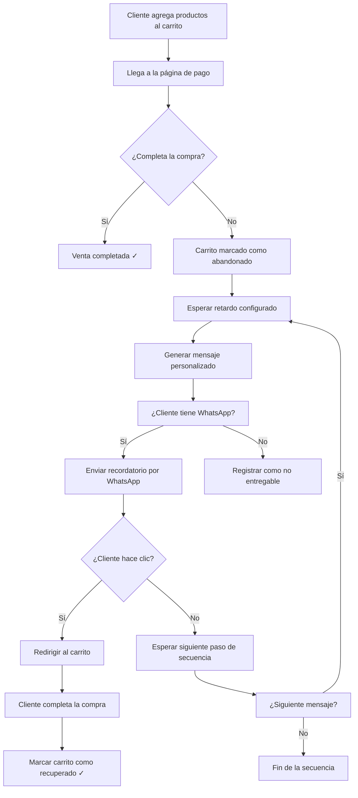
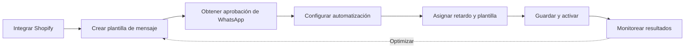

# Cómo Recuperar Carritos Abandonados de Shopify por WhatsApp


> **Última actualización:** 23 de junio de 2025

Cuando un cliente agrega un producto a su carrito pero decide no finalizar la compra, se dice que el carrito ha sido abandonado. Cada día, los dueños de tiendas Shopify pierden numerosas ventas cuando clientes con buenas intenciones abandonan sus carritos antes de completar el proceso de pago.

El **mensaje de recuperación de carrito abandonado a WhatsApp** es un tipo de mensaje transaccional rápido que se envía a tus clientes para recuperar ventas perdidas. Puedes usarlo para recordar a los clientes los artículos que tienen en sus carritos de compra y animarlos a completar sus compras.

Con E-SMART360 puedes configurar un sistema de **recuperación automática de carritos abandonados por WhatsApp** de manera sencilla y efectiva. En esta guía te mostraremos paso a paso cómo crear una campaña exitosa para recuperar carritos abandonados en tu tienda Shopify.


> El mensaje de carrito abandonado se rellena automáticamente con un resumen de los artículos que el cliente tenía en su carrito. Se envía después de un período de tiempo que puedes configurar en los ajustes de la campaña.

## ¿Por qué es importante recuperar carritos abandonados?

Configurar mensajes de WhatsApp para carritos abandonados es un método fantástico para reconectar con clientes potenciales. Las estadísticas del sector muestran que:

- La tasa promedio de abandono de carritos en e-commerce ronda el **70%** — esto significa que de cada 10 clientes que muestran intención de compra, 7 no llegan a completar la transacción
- Los mensajes de recuperación pueden recuperar entre un **10% y un 30%** de esas ventas perdidas, dependiendo de la calidad del mensaje y el momento de envío
- WhatsApp tiene una **tasa de apertura del 98%** (frente al 20-30% del correo electrónico), lo que lo convierte en el canal más efectivo para este tipo de comunicaciones
- Los mensajes de WhatsApp se leen en promedio **3 minutos después** de ser recibidos, mientras que los correos electrónicos pueden tardar horas o días

### El impacto económico del abandono de carritos

Para entender la magnitud del problema, considera estos datos:


### Tienda pequeña (100 pedidos/mes)

- Pedidos potenciales perdidos: ~230 carritos abandonados/mes
    - Valor promedio del carrito: $45
    - Ingresos perdidos mensuales: ~$10,350
    - Recuperación potencial (20%): $2,070/mes adicionales
  
### Tienda mediana (500 pedidos/mes)

- Pedidos potenciales perdidos: ~1,160 carritos abandonados/mes
    - Valor promedio del carrito: $55
    - Ingresos perdidos mensuales: ~$63,800
    - Recuperación potencial (20%): $12,760/mes adicionales
  
Implementar esta estrategia te permite mejorar significativamente los ingresos de tu tienda Shopify y recuperar clientes que de otro modo se habrían perdido. Cada carrito recuperado es un cliente que vuelve a confiar en tu tienda, con alta probabilidad de repetir compra en el futuro.

### ¿Por qué WhatsApp es el canal ideal?


> WhatsApp no solo tiene una tasa de apertura superior al 98%, sino que también genera una tasa de clics (CTR) entre el 15% y el 25% en mensajes de recuperación de carritos, superando ampliamente al email marketing, SMS y notificaciones push.

---

## Paso 1: Integrar tu tienda Shopify con E-SMART360

Lo primero que necesitas hacer es integrar tu tienda Shopify con E-SMART360. Este proceso es sencillo y te permitirá acceder a todas las funcionalidades de automatización.


### Accede a la configuración de integración

Inicia sesión en tu cuenta de E-SMART360. En el menú lateral izquierdo, haz clic en **Integraciones**. Luego selecciona **E-commerce** y haz clic en el botón **Nuevo**.
  
### Selecciona Shopify como plataforma

Del listado de opciones, elige **Shopify**. Se abrirá un formulario con los siguientes campos:
    
    - **Nombre del perfil** — El nombre de tu tienda o cualquier identificador que te ayude a reconocerla.
    - **Subdominio de la tienda** — El subdominio de tu tienda Shopify.
    - **Token de acceso de administrador** — Necesario para la autenticación (en el siguiente paso te explicamos cómo generarlo).
  
### Obtén el token de acceso de administrador en Shopify


> Este paso es fundamental. Sin el token de acceso, la integración no podrá funcionar correctamente.
    
1. Inicia sesión en el panel de administración de tu tienda Shopify.
    2. Ve a **Configuración** → **Apps y canales de venta** → **Desarrollar apps**.
    3. Haz clic en **Crear una app**, ingresa un nombre y confirma haciendo clic en **Crear app**.
    4. Ve a **Configurar alcances de API de administrador** y concede permisos de lectura y escritura para:
       - **Order Editing** (Edición de pedidos)
       - **Orders** (Pedidos)
    5. Haz clic en **Guardar**.
    6. En **Credenciales de API**, haz clic en **Instalar app** y luego en **Instalar**.
    7. Haz clic en **Revelar token una vez** y copia tu **token de acceso de administrador**.
  
### Finaliza la integración

Vuelve a E-SMART360 y pega el token de acceso de administrador en el campo correspondiente. Haz clic en **Guardar** para completar la integración.
    
    ¡Listo! Tu tienda Shopify ahora está conectada con E-SMART360.
  

> Una vez integrada tu tienda Shopify, podrás usarla en flujos de automatización webhook, recuperación de carritos abandonados, notificaciones de pedidos y verificación de pedidos contra reembolso.

### Solución de problemas comunes en la integración


### Error: Token de acceso no válido

Si recibes un error de token no válido al intentar conectar:

1. Verifica que hayas copiado el token completo (incluye caracteres alfanuméricos y guiones).
2. Confirma que el token no haya expirado. Los tokens de Shopify tienen una validez indefinida pero pueden revocarse manualmente.
3. Asegúrate de haber concedido los permisos correctos (`read_orders`, `write_orders`, `read_order_edits`).
4. Si el problema persiste, genera un nuevo token siguiendo los pasos del Paso 1 nuevamente.

### Error: No se encuentran pedidos o carritos

Si la integración se realizó correctamente pero no aparecen datos:

1. La sincronización inicial puede tardar hasta 15 minutos.
2. Verifica que tu tienda Shopify tenga actividad reciente (pedidos o carritos creados).
3. Comprueba que el webhook de Shopify esté configurado para enviar eventos de carrito abandonado.
4. Asegúrate de tener habilitado el seguimiento de carritos abandonados en la configuración de Shopify: **Configuración → Checkout → Carritos abandonados**.

### Problemas con webhooks de Shopify

Para que la detección de carritos abandonados funcione correctamente, Shopify debe enviar eventos webhook a E-SMART360:

1. En tu panel de Shopify, ve a **Configuración → Notificaciones → Webhooks**.
2. Agrega un nuevo webhook con los siguientes parámetros:
   - **Evento:** `carts/update` o `checkouts/update`
   - **Formato:** JSON
   - **URL:** La proporcionada por E-SMART360 en la configuración de integración
3. Guarda los cambios y espera unos minutos para que la conexión se establezca.

---

## Paso 2: Crear una plantilla de mensaje para WhatsApp

Después de integrar tu tienda Shopify con E-SMART360, necesitas crear una plantilla de mensaje de WhatsApp con variables. Usaremos variables porque cada cliente tendrá diferentes productos y precios totales en sus carritos.


### Crear plantillas predeterminadas

E-SMART360 te permite crear plantillas predeterminadas de forma automática. Desde el menú de navegación izquierdo del panel:

    1. Ve a **WhatsApp Bot Manager**.
    2. Selecciona la cuenta de WhatsApp desde la que deseas enviar mensajes (si tienes varias cuentas).
    3. Luego selecciona **Plantilla de mensaje**.
    4. Haz clic en el botón **Crear predeterminadas**.

    Esto generará automáticamente **cuatro plantillas predeterminadas** para diferentes propósitos. También se generarán algunas **variables predeterminadas** para las plantillas. Puedes usar esas variables en otras plantillas de mensaje si lo deseas.

    
> Después de crear las plantillas, haz clic en el botón **Verificar estado** para comprobar si han sido aprobadas por WhatsApp. Las plantillas deben estar aprobadas antes de poder usarlas en tus campañas.
    

### Crear plantilla personalizada

Si prefieres crear una plantilla personalizada para la recuperación de carritos:

    1. Ve a **WhatsApp Bot Manager** → **Plantilla de mensaje**.
    2. Haz clic en **Crear plantilla**.
    3. Selecciona la categoría **Utilidad** (ya que se trata de una notificación transaccional).
    4. Redacta el mensaje usando variables como `{{1}}` para el nombre del producto, `{{2}}` para el precio total, etc.
    5. Envía la plantilla a revisión de WhatsApp.

    **Ejemplo de plantilla para carrito abandonado:**
    ```
    ¡Hola {{1}}! 👋
    
    Notamos que dejaste algunos artículos en tu carrito en {{2}}:
    
    🛒 {{3}}
    Total: {{4}}
    
    Completa tu compra aquí: {{5}}
    
    ¡No dejes pasar esta oportunidad! 🎉
    ```
  
### Variables disponibles para personalizar plantillas

E-SMART360 genera automáticamente variables predeterminadas que puedes usar en tus plantillas para personalizar los mensajes según los datos de cada cliente:

| Variable | Descripción | Ejemplo de valor |
|----------|-------------|------------------|
| `{{customer_name}}` | Nombre del cliente | María García |
| `{{cart_items}}` | Lista de productos en el carrito | Vestido floral, Zapatos, Bolso |
| `{{cart_total}}` | Total del carrito | $89.97 USD |
| `{{cart_url}}` | Enlace para recuperar el carrito | https://tutienda.com/cart/abc123 |
| `{{store_name}}` | Nombre de tu tienda | Mi Tienda Online |
| `{{product_count}}` | Número de productos | 3 artículos |
| `{{abandoned_time}}` | Tiempo desde el abandono | hace 1 hora |


> Estas variables se reemplazan automáticamente con los datos reales de cada cliente al enviar el mensaje, lo que permite una personalización masiva sin esfuerzo manual.

### Directrices para plantillas de utilidad y marketing

Es importante conocer las categorías de plantillas que WhatsApp permite, ya que la clasificación correcta determina cuándo y cómo se puede enviar el mensaje:


### Plantillas de utilidad

Las plantillas de utilidad son mensajes preaprobados diseñados para actualizaciones transaccionales, como confirmaciones, cambios o suspensiones relacionadas con una transacción o suscripción específica. Estas plantillas deben ser funcionales y no promocionales.

**Ejemplos de plantillas de utilidad:**
- Confirmación de pedido: "Tu pedido #12345 ha sido confirmado. Pronto recibirás una actualización de seguimiento."
- Recibo de pago: "Tu pago de $50 se ha procesado con éxito. ¡Gracias por tu compra!"
- Recordatorio de cita: "Recordatorio: Tu cita con el Dr. Smith está programada para el 15 de marzo a las 10 AM. Responde para confirmar."


> Si una plantilla contiene contenido tanto de utilidad como de marketing, se clasificará como plantilla de marketing.


### Plantillas de marketing

Las plantillas de marketing ofrecen mayor flexibilidad y se utilizan para mensajes que no se relacionan con una transacción específica. Pueden incluir promociones, ofertas, mensajes de bienvenida, invitaciones o solicitudes de interacción.

**Ejemplos de plantillas de marketing:**
- Oferta promocional: "¡Oferta exclusiva! Obtén un 20% de descuento en tu próxima compra. Usa el código AHORRA20."
- Reenganche de clientes: "Te extrañamos. Disfruta de envío gratis en tu próximo pedido. Toca abajo para comprar ahora."
- Invitación a evento: "Únete a nuestro próximo seminario web sobre tendencias de marketing digital. ¡Regístrate ahora!"

---

## Paso 3: Configurar la automatización de carritos abandonados

Una vez que tengas las plantillas de mensaje creadas y aprobadas, es momento de configurar la automatización. Sigue estos pasos:


### Accede a la automatización WC/Shopify

En el menú lateral del panel de E-SMART360, ve a **WC/Shopify Automation** (lo encontrarás justo debajo de la opción Plantilla de mensaje). Haz clic en el botón **Crear**.
  
### Configura los parámetros de la campaña

Al hacer clic en "Crear" se abrirá un formulario. Complétalo siguiendo estos pasos:

    1. **Nombre** — Asigna un nombre para la campaña (ej. "Recuperación carritos abandonados").
    2. **Tipo de tienda** — Selecciona **Shopify**.
    3. **API de la tienda** — Selecciona la API de tu tienda del listado desplegable.
    4. **Acción** — Selecciona **Recuperación de carrito abandonado** (Abandoned Cart Recovery).
    5. **Retardo del mensaje** — Por defecto son 30 minutos. Puedes cambiarlo según prefieras.
    6. **Plantilla de mensaje** — Según la acción seleccionada, la plantilla se selecciona automáticamente. Puedes usar la plantilla predeterminada o tu plantilla personalizada.
    7. **Etiquetas y secuencias** — Puedes segmentar a estos usuarios con una etiqueta y enviar mensajes de secuencia posteriormente usando la etiqueta y los mensajes de secuencia.
  
### Guarda la configuración

Finalmente, haz clic en el botón **Guardar**. ¡Eso es todo! La automatización está lista para funcionar.
  

> **¿Cómo funciona exactamente?** Cuando un cliente llega a la página de pago pero no completa la compra, el carrito se considera abandonado. Después del período de tiempo que especificaste en la campaña, el cliente recibirá automáticamente un mensaje de WhatsApp recordatorio.

---

## Cómo funciona el proceso de recuperación

1. El cliente agrega productos a su carrito en tu tienda Shopify.
2. El cliente llega a la página de pago.
3. Si el cliente no completa la compra, el carrito se marca como abandonado.
4. Después del retardo configurado (ej. 30 minutos), se envía automáticamente un mensaje de WhatsApp.
5. El mensaje incluye los productos que el cliente dejó en su carrito y un enlace para completar la compra.


> **Requisito importante:** Asegúrate de que en tu tienda Shopify el **número de teléfono** esté configurado como campo requerido en la dirección de facturación. Sin este dato, no podremos identificar al cliente para enviarle el mensaje de WhatsApp.

## Estrategias avanzadas de recuperación

### Secuencias de múltiples mensajes

Una sola notificación puede no ser suficiente para recuperar un carrito abandonado. La estrategia más efectiva consiste en crear una secuencia de mensajes escalonados:


### Secuencia recomendada de 3 pasos

### Paso 1: Recordatorio amigable (30 min)

> "¡Hola {{customer_name}}! 👋 Te recordamos que tienes {{product_count}} en tu carrito en {{store_name}} por un total de {{cart_total}}. ¿Quieres completar tu compra? → {{cart_url}}"
        
        **Propósito:** Recordatorio suave y oportuno, justo cuando el cliente aún está en contexto de compra.
      
### Paso 2: Urgencia (4 horas)

> "¡Hola {{customer_name}}! ⏰ Tu carrito en {{store_name}} aún está esperando. Los artículos que seleccionaste podrían agotarse. ${'{'}Asegura tu compra aquí → {{cart_url}}{'}'}"
        
        **Propósito:** Crear sensación de urgencia y escasez.
      
### Paso 3: Oferta especial (24 horas)

> "¡Hola {{customer_name}}! 🎁 Como valoramos tu interés, aquí tienes un **10% de descuento** en tu carrito de {{store_name}}. Usa el código **VUELVE10** al finalizar tu compra → {{cart_url}}"
        
        **Propósito:** Incentivo adicional para clientes indecisos. El descuento por tiempo limitado aumenta la tasa de conversión.
      

### Secuencia rápida (2 pasos)

Ideal para productos de bajo costo o compras por impulso:
    
    1. **15 minutos:** Recordatorio directo con enlace al carrito.
    2. **2 horas:** Mensaje con oferta de envío gratis o descuento.
  
### Secuencia para alto valor

Para productos de precio elevado donde la decisión de compra es más meditada:
    
    1. **1 hora:** Recordatorio informativo.
    2. **6 horas:** Mensaje destacando beneficios y garantías.
    3. **24 horas:** Oferta especial o financiamiento.
    4. **48 horas:** Último aviso antes de liberar el carrito.
  
### Uso de etiquetas y segmentación

E-SMART360 te permite asignar etiquetas a los clientes que han abandonado su carrito, lo que facilita la segmentación y el envío de campañas específicas posteriormente:


#### Ejemplo de etiquetas útiles

```
Etiquetas recomendadas para segmentación:
- carrito-abandonado-sin-descuento
- carrito-abandonado-con-descuento
- carrito-alto-valor (carritos >$100)
- carrito-producto-agotable (productos con stock limitado)
- cliente-recurrente (cliente que ya ha comprado antes)
- cliente-nuevo (primera vez en la tienda)
```

### Configuración de seguimiento con secuencias

Una vez que has etiquetado a los clientes que abandonaron su carrito, puedes crear mensajes de secuencia para seguimiento:

1. Ve a **Secuencias** en el panel de E-SMART360.
2. Crea una nueva secuencia dirigida a la etiqueta `carrito-abandonado-sin-descuento`.
3. Configura mensajes de seguimiento semanales con novedades o promociones.
4. Cuando un cliente compre, se eliminará automáticamente de la secuencia.


> Las secuencias permiten mantener el contacto con clientes que no convirtieron inicialmente, aumentando las posibilidades de venta futura sin necesidad de enviar repetidamente el mismo tipo de mensaje.

## Cumplimiento y mejores prácticas con WhatsApp Business API

Para mantener una buena reputación en WhatsApp y evitar bloqueos o restricciones, sigue estas recomendaciones:

### Límites de mensajes y calidad de la cuenta

WhatsApp asigna límites de mensajes según la calidad de tu cuenta:

| Nivel | Conversaciones/día | Requisitos |
|------|-------------------|------------|
| Tier 1 | 1,000 por día | Cuenta nueva |
| Tier 2 | 10,000 por día | Calidad > 70%, 7+ días activo |
| Tier 3 | 100,000 por día | Calidad > 70%, 30+ días activo |
| Tier 4 | 500,000+ por día | Aprobación especial de Meta |

Para subir de nivel, mantén una alta **calificación de calidad** (>70%) y un bajo **número de bloqueos** de usuarios.


### ¿Cómo se calcula la calificación de calidad?

WhatsApp evalúa la calidad de tu cuenta basándose en:

1. **Bloqueos de usuarios:** Si muchos usuarios bloquean tu número, la calidad baja.
2. **Reportes de spam:** Los usuarios pueden reportar tus mensajes como spam.
3. **Tasa de opt-out:** Si muchos usuarios solicitan dejar de recibir mensajes.
4. **Interacciones:** Cuantos más usuarios respondan a tus mensajes, mejor será tu calificación.

Recomendación: Mantén siempre un enfoque centrado en el cliente. No envíes mensajes excesivos ni fuera de contexto.

### Regla de las 24 horas

WhatsApp permite enviar mensajes a los clientes libremente dentro de una ventana de **24 horas** desde la última interacción del usuario con tu negocio. Fuera de esta ventana, solo puedes enviar mensajes utilizando **plantillas de mensaje aprobadas**.

Dado que los carritos abandonados pueden ocurrir en cualquier momento, la recuperación debe hacerse mediante plantillas de utilidad aprobadas (dentro de la ventana de 24 horas si el cliente interactuó recientemente, o mediante plantilla si no hay ventana activa).


> Si un cliente no ha interactuado con tu negocio en más de 24 horas, NO puedes enviarle un mensaje de carrito abandonado sin usar una plantilla aprobada por WhatsApp. E-SMART360 maneja automáticamente esta verificación.

### Frecuencia de mensajes y anti-spam

Para proteger la experiencia del usuario y la reputación de tu cuenta:

1. **No envíes más de 3 mensajes de recuperación** por carrito abandonado.
2. **Respeta un intervalo mínimo de 2 horas** entre mensajes.
3. **Detén los mensajes** si el cliente compra o solicita baja.
4. **No envíes mensajes de recuperación** si el cliente ya recibió una notificación de pedido completado.

---

### Consejos para maximizar la efectividad de tus campañas 


### Momento óptimo de envío

El tiempo de retardo es crucial. Recomendamos:
    - **30 minutos** para productos de impulso
    - **1-2 horas** para productos considerados
    - **4-6 horas** para productos de alto valor
    
    Puedes crear múltiples campañas con diferentes retardos para crear una secuencia de recordatorios.
  
### Personalización del mensaje

Los mensajes personalizados tienen tasas de conversión mucho más altas:
    - Incluye el nombre del cliente y los productos específicos
    - Agrega un botón de CTA directo al carrito
    - Usa emojis para hacer el mensaje más atractivo
    - Considera ofrecer un descuento por tiempo limitado
  
### Pruebas A/B

Crea dos versiones de la misma campaña cambiando un elemento (tono del mensaje, retardo, oferta) y compara cuál genera mejor tasa de recuperación. E-SMART360 te permite duplicar campañas fácilmente.
  
## Monitoreo y análisis de resultados

### Diagrama del flujo de recuperación



### Diagrama de la configuración en E-SMART360



Una vez que tu campaña está activa, el seguimiento continuo te permite optimizarla y maximizar su efectividad.

### Métricas clave

- **Tasa de recuperación:** Porcentaje de carritos abandonados convertidos en ventas. Rango saludable: 10-30%.
- **Tasa de clics (CTR):** Usuarios que hicieron clic en el enlace del mensaje. Objetivo: >15%.
- **Tasa de opt-out:** Usuarios que solicitaron baja. Alerta si supera el 2%.
- **Tiempo hasta la compra:** Cuánto tardan los clientes en completar la compra tras recibir el mensaje.

### Interpretación de resultados

| Síntoma | Posible causa | Solución |
|---------|---------------|----------|
| Baja tasa de recuperación | Mensaje poco atractivo | Mejora el copy, agrega emojis, ofrece descuento |
| Alto opt-out | Demasiados mensajes | Reduce frecuencia, respeta intervalos |
| Bajo CTR pero buena recuperación | Enlace no visible | Mueve el CTA al inicio, usa botones |
| Alta recuperación temprana | El retardo es adecuado | Prueba acortarlo más |

---

## Ejemplos prácticos de campañas exitosas


### Ejemplo 1: Tienda de moda

**Escenario:** Una tienda de ropa online nota que el 75% de los carritos se abandonan.
    
    **Solución:** Configuran una campaña con retardo de 1 hora. El mensaje incluye:
    
    > "¡Hola María! 👗 Notamos que dejaste estos looks en tu carrito:
    > Vestido floral - $45.99
    > Total del carrito: $89.97
    > ¡Completa tu compra aquí y recibe envío gratis! → [Enlace]"
    
    **Resultado:** 18% de los carritos recuperados en el primer mes.
  
### Ejemplo 2: Tienda de electrónica

**Escenario:** Una tienda de gadgets tecnológicos con alta tasa de abandono en productos de precio medio.
    
    **Solución:** Crean una secuencia de 3 mensajes:
    1. A los 30 min: Recordatorio amigable
    2. A las 4 horas: "Tu carrito está esperando" con enlace directo
    3. A las 24 horas: Oferta especial de 10% de descuento
    
    **Resultado:** 25% de recuperación con la secuencia completa.
  
### Ejemplo 3: Tienda de suscripciones (modelo SaaS)

**Escenario:** Una empresa SaaS que vende suscripciones mensuales y anuales nota que muchos usuarios llegan a la página de pago pero no completan la suscripción.

**Solución:** Configuran una campaña de recuperación con un enfoque educativo:

1. **A los 30 minutos:** Mensaje recordatorio simple.
2. **A las 2 horas:** Mensaje destacando los beneficios principales y testimonios.
3. **A las 24 horas:** Oferta de prueba gratuita extendida de 7 a 14 días.

> "Hola {{customer_name}}! 🚀 Notamos que estabas probando {{product_name}}.
> ¿Sabías que nuestros usuarios reportan un **40% más de productividad**?
>
> Completa tu registro aquí y obtén **14 días de prueba gratis**: {{cart_url}}"

**Resultado:** 22% de conversión en suscripciones pagas, con un alto valor de vida del cliente (LTV).

---

## Preguntas frecuentes


### ¿Qué sucede si el cliente ya compró los productos en otro momento?

Si el cliente completa la compra antes de que se envíe el mensaje de recuperación, la sincronización con Shopify detectará que el carrito ya no está abandonado y no se enviará ningún mensaje. El sistema verifica el estado del carrito en tiempo real antes de enviar cada comunicación.

### ¿Puedo enviar más de un mensaje de recuperación?

Sí, puedes crear múltiples campañas de automatización con diferentes retardos para enviar una secuencia de recordatorios. Por ejemplo: un primer mensaje a los 30 minutos, un segundo a las 4 horas y un tercero a las 24 horas. Así aumentas las probabilidades de recuperar la venta sin ser invasivo.

### ¿El cliente puede optar por no recibir estos mensajes?

WhatsApp Business API requiere que los clientes hayan optado por recibir comunicaciones de tu negocio. Si un cliente responde con palabras como "BAJA", "STOP" o "NO", el sistema registrará su solicitud y no se le enviarán más mensajes de marketing, aunque los mensajes de utilidad (como confirmaciones de pedido) aún pueden enviarse si están relacionados con una transacción activa.

### ¿Qué hago si mi plantilla de mensaje es rechazada por WhatsApp?

Las plantillas pueden ser rechazadas por varias razones: contenido promocional en una plantilla de utilidad, formato incorrecto, o falta de claridad en el propósito del mensaje. Revisa las directrices de WhatsApp para plantillas de utilidad y marketing, corrige el contenido y vuelve a enviarla para aprobación. E-SMART360 te notificará el estado de cada plantilla.

### ¿Puedo usar esta función con WooCommerce en lugar de Shopify?

Sí, E-SMART360 también es compatible con WooCommerce. El proceso de configuración es muy similar: integra tu tienda WooCommerce, crea las plantillas de mensaje y configura la automatización seleccionando WooCommerce como tipo de tienda. Consulta nuestra guía específica para WooCommerce si necesitas más detalles.

### ¿Qué costo tiene cada mensaje de recuperación enviado?

Cada mensaje de plantilla de WhatsApp que se envía fuera de la ventana de 24 horas tiene un costo asociado, que varía según el país del destinatario. Los mensajes de utilidad (como recordatorios de carrito abandonado) tienen una tarifa menor que los de marketing. E-SMART360 no aplica márgenes adicionales sobre las tarifas oficiales de WhatsApp Cloud API. Consulta la sección de facturación en tu panel para ver los costos específicos por país.

### ¿Los mensajes de carrito abandonado se envían como utilidad o marketing?

Los mensajes de recuperación de carritos abandonados se clasifican como **plantillas de utilidad**, ya que están directamente relacionados con una transacción o servicio específico (el proceso de compra iniciado por el cliente). Esto es importante porque:

1. Las plantillas de utilidad tienen una tarifa más baja que las de marketing.
2. Los límites de mensajes para utilidad son más flexibles.
3. La tasa de aprobación de plantillas de utilidad es generalmente más alta.

Asegúrate de que tu plantilla no incluya contenido promocional para mantener la categoría de utilidad.

### ¿Qué pasa si el cliente tiene mi número guardado pero no ha optado por recibir mensajes?

WhatsApp Business API requiere que los clientes hayan dado su consentimiento para recibir comunicaciones. Sin embargo, cuando un cliente inicia el proceso de compra en tu tienda y proporciona su número de teléfono en la dirección de facturación, esto se considera consentimiento implícito para recibir comunicaciones relacionadas con esa transacción (como la recuperación del carrito).

Para asegurar el cumplimiento:
- Incluye una opción para darse de baja en cada mensaje.
- No agregues a los clientes a listas de marketing sin su consentimiento explícito.
- Responde inmediatamente a las solicitudes de baja.

### ¿Puedo programar los mensajes solo en horario laboral?

WhatsApp tiene restricciones para el envío de mensajes de marketing fuera del horario laboral. Para los mensajes de utilidad (como recuperación de carritos), no hay restricción horaria, ya que se consideran transaccionales. Sin embargo, por respeto al cliente, recomendamos:

- Configurar retardos que eviten horarios nocturnos (ej. no enviar entre 10 PM y 8 AM).
- Usar las plantillas para reiniciar conversaciones después de horas no laborables si el cliente no ha interactuado recientemente.
- E-SMART360 respeta automáticamente las ventanas de conversación de WhatsApp.

## Solución de problemas comunes

### Problemas con la integración Shopify


### Mi tienda Shopify no aparece en el listado de APIs

Si después de integrar tu tienda no ves la API disponible en el menú desplegable:

1. Verifica que el token de acceso tenga los permisos correctos (`read_orders`, `write_orders`).
2. Espera 5-10 minutos y refresca la página.
3. Desconecta y vuelve a conectar la integración siguiendo los pasos del Paso 1.
4. Si el problema persiste, contacta al soporte de E-SMART360.

### El mensaje no se envía aunque la campaña está activa

Posibles causas:

1. **Plantilla no aprobada:** Verifica que la plantilla de mensaje tenga estado **Aprobado** en WhatsApp. Puedes revisarlo en WhatsApp Bot Manager → Plantilla de mensaje → Verificar estado.
2. **Número de teléfono no disponible:** El cliente no proporcionó su número en la dirección de facturación de Shopify.
3. **Fuera de ventana de 24 horas:** Si el cliente no ha interactuado con tu negocio en más de 24 horas, necesitas usar una plantilla aprobada.
4. **Límite de mensajes alcanzado:** Revisa los límites de tu cuenta (Tier 1-4) en WhatsApp Cloud API.
5. **Error en los permisos de Shopify:** Reinstala la aplicación y concede nuevamente los permisos necesarios.

### El enlace del carrito no funciona o lleva a una página vacía

Posibles soluciones:

1. Verifica que el carrito de Shopify no haya expirado (los carritos abandonados expiran después de 90 días por defecto).
2. Comprueba que la URL generada no tenga errores de codificación.
3. Si usas variables en la plantilla, asegúrate de que `{{cart_url}}` esté correctamente mapeada.
4. Prueba el enlace manualmente desde un navegador en modo incógnito.

### Errores comunes de WhatsApp


### Error 130472: El número de teléfono es parte de un experimento

Este error ocurre cuando el número de teléfono del cliente está siendo evaluado por WhatsApp como parte de un grupo de prueba. No es un error de configuración de E-SMART360. El mensaje no se entregará a ese contacto específico. Recomendamos intentar nuevamente más tarde o contactar al soporte de Meta si el problema persiste.

### Error 131026: Mensaje no entregable

Este error indica que WhatsApp no pudo entregar el mensaje al destinatario. Las causas comunes incluyen:

1. El número del destinatario no es válido o está bloqueado.
2. El destinatario ha cambiado su número.
3. El destinatario ha optado por no recibir mensajes de tu negocio.
4. Problemas temporales de infraestructura de WhatsApp.

No se requiere acción de tu parte; E-SMART360 registra estos errores automáticamente.

---

## Conclusión

La recuperación de carritos abandonados a través de WhatsApp  es una de las estrategias más efectivas para aumentar las ventas de tu tienda Shopify. Con E-SMART360, el proceso de configuración es simple y rápido:

1. **Integra** tu tienda Shopify en pocos minutos
2. **Crea** plantillas de mensaje atractivas y personalizadas
3. **Configura** la automatización con el retardo que prefieras
4. **Recupera** ventas perdidas automáticamente


> Implementar esta estrategia no requiere conocimientos técnicos avanzados. Con los pasos descritos en esta guía, cualquier dueño de tienda Shopify puede comenzar a recuperar carritos abandonados y aumentar sus ingresos de forma significativa.

### Recursos relacionados

Para profundizar en la automatización de tu tienda Shopify con E-SMART360, te recomendamos explorar:

- [Cómo enviar notificaciones de pedidos de Shopify a WhatsApp](/recursos/notificaciones-pedidos-shopify-whatsapp)
- [Cómo verificar pedidos contra reembolso de Shopify por WhatsApp](/recursos/verificar-pedidos-shopify-cod-whatsapp)
- [Guía completa de plantillas de mensaje para WhatsApp](/recursos/plantillas-mensaje-whatsapp)
- [Integración de Shopify para automatización en WhatsApp](/recursos/integracion-shopify-automatizacion-whatsapp)
