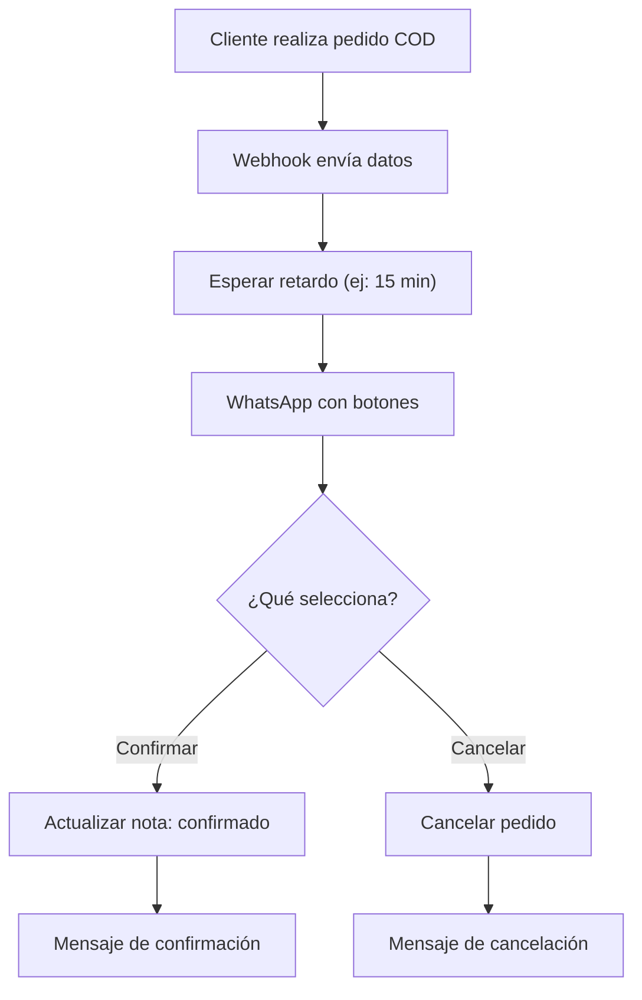

# Cómo Verificar un Pedido Contra Reembolso (COD) de WooCommerce por WhatsApp

Para verificar un pedido contra reembolso (Cash On Delivery / COD) de WooCommerce por WhatsApp, primero debes integrar tu tienda WooCommerce con E-SMART360. Una vez integrada, puedes crear una campaña de automatización que envíe un mensaje con botones de confirmación y cancelación cada vez que se genere un nuevo pedido COD, y actualice automáticamente el estado del pedido según la respuesta del cliente.


> **Beneficio clave:** Esta automatización elimina los pedidos COD falsos, reduce las devoluciones fallidas y optimiza tu operativa logística. Los estudios muestran que la verificación por WhatsApp puede reducir las pérdidas por pedidos falsos hasta en un 80%.

## Requisitos Previos

Antes de comenzar, asegúrate de tener lo siguiente:

1. Una cuenta activa en **E-SMART360**
2. Una tienda **WooCommerce** funcionando (versión 6.0 o superior)
3. Tu tienda **WooCommerce integrada** con E-SMART360 a través de la API REST
4. Un número de WhatsApp conectado a E-SMART360
5. Una plantilla de mensaje aprobada por WhatsApp (para iniciar conversaciones con clientes)
6. Permisos de administrador en WordPress para configurar webhooks


> Si aún no has integrado tu tienda WooCommerce con E-SMART360, consulta la guía sobre cómo integrar WooCommerce para automatización con WhatsApp en E-SMART360. Necesitarás generar una clave API desde WooCommerce → Ajustes → Avanzado → API REST y proporcionar tanto la Consumer Key como la Consumer Secret en el panel de E-SMART360.

### Verificar la Conexión de WooCommerce

Antes de crear la campaña de verificación COD, confirma que la integración con WooCommerce funciona correctamente:

1. En el panel de E-SMART360, ve a la sección de **Integraciones**
2. Busca tu tienda WooCommerce en la lista de conexiones activas
3. Haz clic en **Probar conexión** — si aparece un mensaje de éxito, la integración está lista
4. Si la conexión falla, verifica que las credenciales API sean correctas y que WooCommerce sea accesible desde internet


> Si tu tienda WooCommerce está en un entorno local o de desarrollo, asegúrate de que sea accesible públicamente para que E-SMART360 pueda comunicarse con ella. Los webhooks de WooCommerce requieren que el servidor de E-SMART360 pueda alcanzar tu instalación.

## ¿Qué es la Verificación COD y Por Qué es Importante?

Los pedidos contra reembolso (Cash On Delivery) son aquellos donde el cliente paga en efectivo al recibir el producto. Este método es muy popular en mercados latinoamericanos, pero también es el más vulnerable a pedidos falsos o "bromas" que generan:

- **Costos logísticos perdidos** — cada intento de entrega fallido cuesta en combustible, tiempo del repartidor y desgaste del vehículo
- **Productos que regresan a inventario** con posible daño o desgaste en el embalaje
- **Tiempo del equipo** dedicado a preparar pedidos que nunca se entregarán
- **Oportunidad de venta perdida** en productos que pudieron haber comprado clientes reales
- **Indicadores de rendimiento distorsionados** que dificultan la toma de decisiones


> Con la verificación automatizada por WhatsApp, puedes reducir los pedidos COD falsos hasta en un 90%, asegurando que solo se procesen los pedidos que el cliente realmente confirmó.

## Paso 1: Crear la Plantilla de Mensaje

El mensaje que recibirá el cliente debe incluir los detalles del pedido y botones de respuesta rápida para confirmar o cancelar. Las plantillas de mensaje son obligatorias en WhatsApp Business API para iniciar conversaciones (mensajes fuera de la ventana de 24 horas).

1. Ve al panel de **E-SMART360**
2. Accede al menú **Gestor de Bots** en la sección de WhatsApp
3. Selecciona **Plantillas de Mensaje**
4. Haz clic en **Crear nueva plantilla**


> Las plantillas de mensaje deben ser aprobadas por Meta antes de usarlas. El proceso de revisión puede tomar desde minutos hasta 24 horas. Asegúrate de que tu mensaje cumpla con las políticas de WhatsApp: sin contenido engañoso, con lenguaje claro y un propósito evidente. Usa la categoría "utilitaria" para verificación de pedidos, ya que se aprueba más rápido.

### Configurar las Variables de la Plantilla

Crea dos variables personalizadas que se reemplazarán con datos reales de cada pedido:

- **Product List** — mostrará los nombres de los productos del pedido
- **Total Price** — mostrará el monto total a pagar

Estas variables se mapearán desde los datos del pedido de WooCommerce durante la configuración del webhook.

### Redactar el Cuerpo del Mensaje

Escribe un mensaje claro usando las variables. Por ejemplo:

```
¡Hola {{1}}!

Hemos recibido tu pedido en nuestra tienda. Estos son los detalles:

📦 Productos: {{Product List}}
💰 Total a pagar: {{Total Price}}

Por favor, confirma que deseas continuar con este pedido.
Si no lo reconoces o no deseas recibirlo, puedes cancelarlo.
```

### Agregar Botones de Respuesta Rápida

Añade dos botones de tipo **Respuesta Rápida**:

- **Confirmar Pedido** — el cliente confirma que desea recibir el pedido
- **Cancelar Pedido** — el cliente rechaza o no reconoce el pedido


> Usa texto claro y accionable en los botones. "Sí, confirmo mi pedido" funciona mejor que solo "Confirmar". Los botones ambiguos son una de las causas principales de rechazo de plantillas por parte de Meta.

### Guardar la Plantilla

Revisa que todo esté correcto y haz clic en **Guardar**. La plantilla ahora está en estado "Pendiente" hasta que Meta la revise. Puedes monitorear su estado desde el panel de plantillas.

## Paso 2: Crear los Postbacks

Los postbacks son las respuestas automáticas que se enviarán cuando el cliente haga clic en cada botón. Necesitas crear uno para confirmación y otro para cancelación.


### Acceder a la sección de Postbacks

Desde el **Gestor de Bots**, ve a la sección de **Postbacks** y haz clic en **Crear nuevo**.
    Se abrirá el editor de flujo de bot.
  
### Configurar el postback de confirmación

- **Título:** Confirmación de pedido COD
    Agrega un componente **Iniciar Flujo de Bot** haciendo doble clic sobre él en el canvas:
    - Ingresa un título descriptivo
    - (Opcional) Agrega una etiqueta y secuencia para organizar tus flujos
    Luego agrega un elemento de **Texto** dentro del flujo:
    
    ```
    ✅ ¡Gracias por confirmar tu pedido, {{1}}!
    Hemos registrado tu confirmación. Tu pedido será preparado para envío y
    recibirás notificaciones sobre el estado de tu entrega.
    Monto a pagar al recibir: {{total}}
    Si tienes alguna duda, responde a este mensaje y nuestro equipo te atenderá.
    ```
    Haz clic en **OK** y luego en **Guardar**.
  
### Configurar el postback de cancelación

Repite el proceso con:
    - **Título:** Cancelación de pedido COD
    Mensaje de texto:
    
    ```
    ❌ Hemos cancelado tu pedido #{{order_id}} como solicitaste.
    Si fue un error o deseas realizar un nuevo pedido, visita nuestra tienda en línea.
    ¡Estaremos encantados de ayudarte!
    Si tienes alguna pregunta, responde a este mensaje.
    ```
    Haz clic en **Guardar**.
  
## Paso 3: Crear la Campaña de Automatización WooCommerce

Ahora configuraremos la campaña que orquestará todo el flujo de verificación. Sigue las instrucciones a continuación:


### Acceder a las automatizaciones

En el **Gestor de Bots**, selecciona una **cuenta de WhatsApp** desde la cual quieras enviar mensajes. Luego selecciona la opción **WC/Automatización Shopify**.
  
### Crear nueva campaña

Haz clic en el botón **Crear**. Aparecerá un formulario de automatización WooCommerce/Shopify que debes completar.
  
### Completar el formulario de la campaña

Sigue estos pasos numerados:

    1. **Nombre de la campaña:** Proporciona un nombre descriptivo, por ejemplo "Verificación COD WooCommerce"
    2. **Tipo de tienda:** Selecciona **WooCommerce**
    3. **Seleccionar API de Tienda:** Elige la API de tu tienda que has integrado con E-SMART360. También puedes hacer clic en **Agregar Nueva API** si aún no la has configurado
    4. **Acción:** Selecciona **Verificación COD**
    
    Al seleccionar "Verificación COD", varios campos se autocompletarán automáticamente:
    
    | Campo | Valor por defecto | Descripción |
    |-------|-------------------|-------------|
    | Retardo del Mensaje | 15 minutos | Tiempo de espera antes de enviar el mensaje |
    | Plantilla de Mensaje | System_cod_order_verification_new | Plantilla para el mensaje de verificación |
    | Botón: Confirmar Pedido | Default Confirm Order | Postback al confirmar |
    | Texto Nota/Etiqueta | order-confirmed | Nota que se agrega en WooCommerce |
    | Botón: Cancelar Pedido | Default Cancel Order | Postback al cancelar |
    
    5. **Retardo del Mensaje:** Puedes cambiar el tiempo de retardo (recomendado: 10-30 minutos)
    6. **Plantilla de Mensaje:** Puedes seleccionar tu plantilla creada manualmente
    7. **Asignar Etiqueta:** Opcional, para organizar tus campañas
    8. **Asignar Secuencia:** Opcional, para seguimiento de campañas
    9. Haz clic en **Guardar**
  

> **Acerca del retardo de mensaje:** El valor de 15 minutos es el predeterminado pero puedes ajustarlo según el comportamiento de tus clientes. Algunos negocios usan 5 minutos para una respuesta rápida, mientras que otros prefieren 30 minutos para dar tiempo a que el cliente revise su pedido con calma. Para productos de alto valor, considera un retardo mayor.

## Paso 4: Configurar las Callback APIs

Las Callback APIs permiten que E-SMART360 actualice el estado del pedido en WooCommerce automáticamente cuando el cliente responde desde WhatsApp.


### Acceder a Callback APIs

Dentro de la configuración de tu campaña WooCommerce, busca la sección **Callback APIs** y haz clic en **Nueva**.
  
### Crear API para confirmación

- **Nombre:** Confirmar pedido vía WhatsApp
    - **Acción:** Selecciona **Actualizar nota de pedido WooCommerce**
    - **Tienda:** Elige tu tienda WooCommerce integrada
    - **Nota:** "Pedido confirmado por el cliente vía WhatsApp"
    - Haz clic en **Guardar Callback API**
  
### Crear API para cancelación

- **Nombre:** Cancelar pedido vía WhatsApp
    - **Acción:** **Actualizar nota de pedido WooCommerce**
    - **Nota:** "Pedido cancelado por el cliente vía WhatsApp"
    - Haz clic en **Guardar Callback API**
  
### Asignar APIs a los botones

Vuelve a la configuración de la campaña y asigna:
    - Botón **Confirmar Pedido** → Callback API de confirmación
    - Botón **Cancelar Pedido** → Callback API de cancelación
    Guarda los cambios.
  
## Cómo Funciona el Sistema de Verificación

Una vez configurada la campaña, el flujo de trabajo es completamente automático:



## Paso 5: Probar el Sistema

Ahora que la campaña está creada, haz un pedido en tu tienda WooCommerce para verificar que todo funcione correctamente.


### Crear un pedido de prueba

Accede a tu tienda WooCommerce y realiza una compra seleccionando **Contra Reembolso (COD)** como método de pago. Asegúrate de usar un número de teléfono real con formato internacional sin el signo +.
  
### Esperar el retardo configurado

Espera el tiempo de retardo que especificaste (15 minutos por defecto). Recibirás el mensaje de WhatsApp con los detalles del pedido y los botones.
  
### Probar la confirmación

Haz clic en **Confirmar Pedido**. Aparecerá un mensaje de confirmación. Verifica en WooCommerce que la nota se actualizó como `order-confirmed`.
  
### Probar la cancelación

Realiza otro pedido de prueba y haz clic en **Cancelar Pedido**. Verifica que:
    1. Recibes el mensaje de cancelación en WhatsApp
    2. El pedido en WooCommerce aparece como cancelado
    3. La nota del pedido refleja la cancelación
  

> Durante las pruebas, asegúrate de que el número de teléfono en WooCommerce tenga el formato internacional correcto sin el signo + al inicio. Ejemplos: 5215512345678 para México, 34612345678 para España, 573001234567 para Colombia. El formato incorrecto es la causa más común de fallos.

## Integración Alternativa: Webhook Workflow

Si prefieres un enfoque más flexible con control granular, puedes usar la funcionalidad de **Webhook Workflow** de E-SMART360. Esta alternativa te permite personalizar el mapeo de datos y crear lógicas condicionales avanzadas.


### Crear un Webhook Workflow

En el panel de E-SMART360, ve a **Webhook Workflow** y haz clic en **Crear Workflow**.
    - Asigna un nombre, por ejemplo "Flujo verificación COD"
    - Selecciona la plantilla de mensaje que creaste
    - Copia la **URL de Callback del Webhook** que se genera automáticamente
  
### Configurar el Webhook en WooCommerce

Ve al panel de administración de WordPress:
    1. WooCommerce → Ajustes → **Avanzado** → **Webhooks**
    2. Haz clic en **Añadir Webhook**
    3. **Nombre:** Verificación COD E-SMART360
    4. **Estado:** Activo
    5. **Tema:** Pedido creado
    6. **URL de entrega:** Pega la URL del callback
    7. Haz clic en **Guardar Webhook**
  
### Capturar datos del webhook

En E-SMART360, haz clic en **Capturar respuesta del webhook**. Aparecerán datos de muestra. Ignóralos.
    Coloca un pedido real en tu tienda WooCommerce (contra reembolso). Luego regresa a E-SMART360 y haz clic en **detalles de conexión**. Espera a que aparezcan los datos reales del pedido.
  
### Configurar el mapeo de campos

Una vez capturados los datos reales, configura el mapeo:
    
    | Campo E-SMART360 | Campo WooCommerce |
    |------------------|-------------------|
    | Número de teléfono | billing → phone |
    | Precio total | total |
    | Lista de productos | line_items |
    | Nombre del cliente | billing → first_name, last_name |
    
    **Crear formateador para productos:**
    1. Haz clic en **Nuevo** en formateadores de datos
    2. **Nombre:** Formatear productos
    3. **Acción:** Concatenar elementos de lista
    4. **Separador:** ", "
    5. **Posición:** "name"
    6. Guarda y selecciona el formateador en "Lista de productos"
  
### Seleccionar postbacks para botones

Asigna:
    - Botón Confirmar Pedido → Postback de confirmación
    - Botón Cancelar Pedido → Postback de cancelación
  
### Agregar regla para solo pedidos COD

1. Selecciona la primera opción del workflow
    2. Haz clic en **Agregar regla**
    3. **Campo:** payment_method → cod
    4. **Operador:** Igual a (=)
    5. **Valor:** cod
    6. Guarda el workflow
  

> Esta regla asegura que los pedidos pagados con tarjeta, PayPal u otros métodos no reciban el mensaje de verificación, evitando confusiones y consumo innecesario de mensajes.

### Ver Reportes del Workflow

Para monitorear el rendimiento:

1. Ve a **Webhook Workflow** en el panel de E-SMART360
2. Localiza tu workflow y haz clic en **Ver reporte**
3. Podrás ver ejecuciones, pedidos procesados, errores y estado

## Consideraciones sobre Plantillas de Mensaje

### ¿Qué son y por qué son necesarias?

WhatsApp Business API requiere que los mensajes fuera de la ventana de 24 horas usen plantillas preaprobadas. Las categorías son:

- **Utilitarias** — notificaciones, confirmaciones. Se aprueban más rápido.
- **Marketing** — promociones. Revisión más estricta.
- **Autenticación** — códigos OTP.

Para verificación COD, usa **utilitaria**: se aprueba más rápido y tiene mejor entrega.

### Causas comunes de rechazo

| Motivo | Descripción | Solución |
|--------|-------------|----------|
| Falta de claridad | Propósito no evidente | Indica que es verificación de pedido |
| Contenido engañoso | Afirmaciones no verificables | Sé específico y realista |
| Formato incorrecto | Variables mal posicionadas | Usa nombres descriptivos |
| Botones ambiguos | Texto no descriptivo | "Confirmar Pedido" en vez de "OK" |
| Error de formato | Caracteres especiales | Revisa formato antes de enviar |


### ¿Qué hacer si la plantilla es rechazada?

1. Lee el motivo del rechazo
  2. Corrige el problema: simplifica el lenguaje, sé claro
  3. Verifica que los botones describan exactamente la acción
  4. Reenvía la plantilla para revisión
  Las utilitarias se aprueban rápido tras corregir errores.

### Tiempo de aprobación

Varía entre 5 minutos y 24 horas hábiles. Influyen:
- Categoría de la plantilla
- Claridad y cumplimiento de políticas
- Calidad de la cuenta WhatsApp Business
- Carga del equipo de revisión de Meta


> Crea y envía la plantilla con anticipación, antes de configurar la campaña. Monitorea el estado desde el panel de plantillas.

## Solución de Problemas Comunes


> **Error: El mensaje no se envía al cliente**
  
  Causas posibles:
  - Formato del teléfono incorrecto (debe ser internacional sin +)
  - Plantilla no aprobada aún
  - Cliente sin consentimiento para recibir mensajes
  - Webhook inactivo en WooCommerce
  - Firewall bloqueando solicitudes salientes

> **Error: El botón no actualiza el pedido en WooCommerce**
  
  Causas posibles:
  - Callback API mal configurada o no asignada al botón
  - Credenciales API de WooCommerce incorrectas o expiradas
  - Postback no asignado al botón correcto
  - Pedido ya actualizado por otro proceso

> **Error: El webhook no se dispara al crear un pedido**
  
  Solución paso a paso:
  1. Verifica que la URL del webhook esté exactamente como la copiaste
  2. Confirma estado **Activo**
  3. Tema debe ser **Pedido creado**
  4. Revisa registros en WooCommerce → Ajustes → Avanzado → Webhooks → [webhook] → Registro de entregas
  5. Error 404 = URL incorrecta. Error 401 = problemas de autenticación

## Casos de Uso Reales


### 🛒 Tienda de electrodomésticos

Una tienda con 50 pedidos COD diarios implementó la verificación. Resultados:
    - **Reducción del 92%** en pedidos falsos
    - **Ahorro de 18 horas semanales** en verificación manual
    - **Mejora del 23%** en entregas exitosas
    Configuración: retardo 10 min, recordatorio a las 2 h, cancelación a las 24 h.
  
### 🍕 Restaurante con delivery

Verificación COD condicional (mayor a $500 MXN):
    - Solo se cocinan pedidos confirmados
    - **Reducción del 35%** en desperdicio
    - Mensaje personalizado con tiempo de entrega
  
### 👕 Tienda de moda

Pico de 200 pedidos COD/día durante Buen Fin:
    - Sin personal adicional
    - **99% de respuesta** en menos de 30 min
    - Solo 3% de cancelaciones
  
### 📚 Librería online

60% de ventas eran COD:
    - 15% pedidos falsos antes
    - **Menos del 1%** después
    - Ahorro de $8,000 MXN/mes
  
## Integración con Google Sheets para Auditoría


### Conectar Google Sheets

En E-SMART360, ve a Integraciones y conecta tu cuenta de Google Sheets.
  
### Crear workflow de registro

Crea un workflow que se active al recibir la respuesta del cliente.
  
### Configurar acción

Agrega "Agregar fila a Google Sheet" con: número de pedido, nombre del cliente, total, respuesta, fecha, productos.
  
### Verificar

Prueba con un pedido real y confirma que los datos aparezcan en Sheets.
  

> Este registro es útil para equipos de contabilidad y logística que necesitan auditoría de cada pedido procesado. También permite generar reportes sobre la efectividad del sistema.

## Personalización Avanzada de la Campaña


### ⏱ Retardo del mensaje

Configurable entre 1 minuto y 24 horas. Recomendamos 15-30 minutos. Productos de alto valor pueden beneficiarse de retardos más largos.
  
### 📝 Notas personalizadas

Totalmente personalizables. Por ejemplo: "Confirmado por WhatsApp - [fecha]" para mejor trazabilidad.
  
### 🏷 Etiquetas y secuencias

Asigna etiquetas para filtrar pedidos. Crea secuencias de seguimiento para no respondidos.
  
## Manejo de Pedidos Sin Respuesta


### Estrategia recomendada

1. **Primer recordatorio (2 h):** Mensaje amable recordando confirmar
  2. **Segundo recordatorio (6 h):** Aviso de cancelación automática próxima
  3. **Cancelación automática (24 h):** Cancela el pedido en WooCommerce
  4. **Registro:** Marca como "no confirmado" para análisis posterior
  
  En E-SMART360 puedes crear workflows condicionales que automaticen todo esto.

## Preguntas Frecuentes


### ¿Qué formato debe tener el número de teléfono en WooCommerce?

Formato internacional sin el signo +:
  
  | País | Formato | Ejemplo |
  |------|---------|---------|
  | México | 52 + número | 5215512345678 |
  | España | 34 + número | 34612345678 |
  | Colombia | 57 + número | 573001234567 |
  | Argentina | 54 + número | 5491123456789 |
  | Chile | 56 + número | 56912345678 |
  | Perú | 51 + número | 51987123456 |
  
  E-SMART360 intenta limpiar espacios y guiones automáticamente.

### ¿Funciona para pedidos prepagados?

Está diseñada para COD. Para prepagados, usa un flujo diferente: mensaje de agradecimiento con seguimiento del envío, no un botón de confirmación.

### ¿Qué pasa si el cliente escribe texto en vez de usar botones?

Configura un chatbot con palabras clave en E-SMART360:
  - "confirmar", "sí", "ok" → ejecutan confirmación
  - "cancelar", "no" → ejecutan cancelación
  - Otros → recordatorio de usar botones

### ¿Cuenta contra mi límite de mensajería?

Sí, el mensaje inicial cuenta. Pero solo se envía a pedidos COD (20-40% del total). La respuesta del cliente es dentro de la ventana de 24 h, sin costo adicional. El impacto es mínimo vs. las pérdidas evitadas.

### ¿Funciona con múltiples tiendas o números?

Sí. Crea campañas separadas para cada tienda, asigna diferentes números de WhatsApp, o usa el mismo para todas. Cada campaña se asocia a una API de tienda específica.

### ¿Qué significa el estado de calidad de WhatsApp?

WhatsApp asigna una calificación de calidad a tu número basada en cómo los usuarios interactúan con tus mensajes. Si muchos usuarios bloquean o reportan tus mensajes, la calificación baja. Para mantenerla alta:
  - Envía mensajes relevantes (como verificación COD)
  - Respeta los horarios de no contacto
  - Usa plantillas aprobadas
  - Monitorea la calidad desde el panel de E-SMART360

### ¿Cómo afecta la regla de 24 horas de WhatsApp?

WhatsApp permite enviar mensajes gratuitos dentro de la ventana de 24 horas después del último mensaje del cliente. Fuera de esa ventana, debes usar plantillas de mensaje. En el flujo COD:
  - El mensaje inicial usa una plantilla (costo aplica)
  - La respuesta del cliente (clic en botón) inicia una nueva ventana de 24 h
  - Los mensajes de postback se envían dentro de esa ventana (sin costo)

## Mejores Prácticas para Maximizar la Efectividad

Para obtener los mejores resultados con tu sistema de verificación COD, considera estas recomendaciones:

### Configuración Inicial

- **Empieza con un retardo de 15 minutos** y ajústalo según la tasa de respuesta de tus clientes
- **Usa mensajes claros y cortos** — los mensajes demasiado largos tienen menor tasa de lectura
- **Prueba con 10 pedidos reales** antes de activar la campaña para todos los clientes
- **Monitorea la tasa de confirmación** durante la primera semana y ajusta si es necesario

### Optimización Continua

- **Segmenta por valor de pedido** — los pedidos de alto valor pueden necesitar verificación más estricta
- **Analiza los patrones de cancelación** — si muchos clientes cancelan, revisa si hay problemas con el producto o el precio
- **Ajusta el retardo según el día** — los fines de semana los clientes pueden tardar más en responder
- **Combina con recordatorios** automáticos para maximizar la tasa de confirmación

### Seguimiento de Métricas

| Métrica | Qué indica | Objetivo recomendado |
|---------|------------|---------------------|
| Tasa de respuesta | % de clientes que responden | > 90% |
| Tasa de confirmación | % que confirman vs. total | > 80% |
| Tasa de cancelación | % que cancelan vs. total | < 10% |
| Tiempo medio de respuesta | Cuánto tardan en responder | < 30 minutos |
| Pedidos falsos evitados | Cancelaciones sin respuesta | Monitorear tendencia |

## Resumen

Con E-SMART360, verificar pedidos contra reembolso en WooCommerce es un proceso completamente automatizado que:

1. **Detecta automáticamente** cada nuevo pedido COD
2. **Espera el tiempo configurado** para no abrumar al cliente
3. **Envía un WhatsApp** con detalles del pedido y botones de acción
4. **Procesa la respuesta** confirmando o cancelando
5. **Actualiza WooCommerce** automáticamente
6. **Notifica al cliente** con un mensaje de confirmación


> **¿Listo para empezar?** Configura tu primera campaña de verificación COD siguiendo esta guía y protege tu negocio de pedidos falsos desde hoy.

---

*¿Te ha sido útil esta guía? Compártela con tu equipo o consúltala cuando necesites recordar algún paso de la configuración.*
