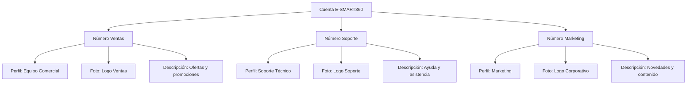

# Configuración del Perfil de WhatsApp Business para la API de WhatsApp Cloud

> Mantener actualizada la información de tu perfil de WhatsApp Business es esencial para generar confianza y profesionalismo con tus clientes. Con E-SMART360 puedes gestionar todos los aspectos de tu perfil directamente desde el panel de control, sin necesidad de acceder a la aplicación móvil de WhatsApp.

## Introducción

En una cuenta personal de WhatsApp puedes establecer fácilmente un estado, agregar una dirección y diversos datos personales. Sin embargo, cuando utilizas la **API de WhatsApp Cloud**, el número no puede gestionarse desde la aplicación móvil tradicional. Es aquí donde entra E-SMART360.

Hemos implementado una funcionalidad completa que te permite cambiar el estado, agregar información comercial como dirección, descripción, correo electrónico y sitio web, todo desde un solo lugar: el panel de E-SMART360.

> **Dato clave:** La API de WhatsApp Cloud funciona de manera independiente a la app de WhatsApp en tu teléfono. Todo lo que configures desde E-SMART360 se reflejará automáticamente cuando un cliente vea tu perfil comercial en WhatsApp.

## Acceder a la Configuración del Perfil

Para comenzar a personalizar tu perfil empresarial en WhatsApp Cloud API desde E-SMART360, sigue estos pasos:

### Ingresa al panel de E-SMART360

Accede a tu cuenta en E-SMART360 con tus credenciales habituales. Una vez dentro del panel de control principal, ubica la sección de canales de WhatsApp.
  
### Ve a la sección de cuentas conectadas

En el menú lateral, busca y haz clic en **"Cuentas Conectadas de WhatsApp"**. Se desplegará una lista con todos los números de teléfono que tienes vinculados a la plataforma a través de la API de WhatsApp Cloud.
  
### Selecciona el número deseado

Identifica el número de teléfono cuyo perfil deseas modificar. Cada cuenta aparecerá con su nombre, número y estado actual de conexión.
  
### Haz clic en 'Ajustes de Perfil'

Una vez seleccionada la cuenta, verás la opción **"Ajustes de Perfil"**. Al hacer clic, se abrirá un formulario con todos los campos editables de tu perfil comercial.
  
## Campos Disponibles en el Perfil

El formulario de perfil te permite modificar los siguientes campos:

| Campo | Descripción | Longitud Máxima |
|-------|-------------|-----------------|
| **About (Acerca de)** | Estado visible en el perfil, similar al "About" de WhatsApp personal | 139 caracteres |
| **Dirección** | Dirección física de tu negocio | 256 caracteres |
| **Descripción** | Descripción detallada de tu empresa | 512 caracteres |
| **Correo Electrónico** | Email de contacto empresarial | 128 caracteres |
| **Sitio Web** | URL de tu página web oficial | 256 caracteres |
| **Vertical / Industria** | Categoría del sector al que pertenece tu negocio | Según lista predefinida |

> Todos estos datos se muestran cuando un cliente hace clic en tu perfil desde su aplicación de WhatsApp. Es la primera impresión que muchos clientes tendrán de tu negocio, por lo que es importante mantenerla actualizada y profesional.

## Cambiar la Foto de Perfil

La foto de perfil es el elemento visual más importante de tu cuenta empresarial en WhatsApp. Es lo primero que ven los clientes cuando reciben un mensaje tuyo o buscan tu negocio.

### Accede a WhatsApp Manager

Inicia sesión en tu [**Administrador de WhatsApp**](https://business.facebook.com/wa/manage/home/), la herramienta oficial de Meta para gestionar cuentas empresariales.
  
### Ve a Números de Teléfono

Dirígete a **Administrador de WhatsApp > Herramientas de cuenta > Números de teléfono**, o sigue este enlace directo: **[Gestionar números](https://business.facebook.com/wa/manage/phone-numbers/)**.
  
### Localiza tu número

Encuentra el número de teléfono que deseas actualizar y haz clic en el botón **"Configuración"** junto a ese número.
  
### Accede a la sección de Perfil

Dentro del menú de configuración, haz clic en **"Perfil"**. Aquí encontrarás las opciones para personalizar tu imagen y datos comerciales.
  
### Cambia la foto

Haz clic en **"Cambiar foto de perfil"**. Sube una imagen que represente adecuadamente tu negocio. Se recomienda usar el logotipo de tu empresa o una imagen corporativa profesional.
  
### Guarda los cambios

Una vez subida la imagen, haz clic en **"Guardar"** para confirmar la actualización. La nueva foto se reflejará en todos los chats y perfiles donde aparezca tu número.
  

> **Recomendaciones para la foto de perfil:**
- Usa una imagen cuadrada de al menos 640x640 píxeles
- El formato recomendado es PNG o JPG
- Asegúrate de que el logotipo o imagen sea claramente visible incluso en tamaño pequeño
- Evita textos excesivamente pequeños o detalles que no se aprecien en miniatura
- Mantén la coherencia con otras redes sociales de tu negocio

## Actualizar la Descripción del Negocio

La descripción de tu negocio es un texto breve que aparece en el perfil y ayuda a los clientes a entender qué ofreces.

### Edita el campo de descripción

Dentro de la sección **"Perfil"** en WhatsApp Manager, localiza el campo **"Descripción del negocio"**.
  
### Redacta un texto claro y conciso

Escribe una descripción que explique claramente qué productos o servicios ofreces. Sé directo y profesional. Puedes incluir palabras clave relacionadas con tu sector.
  
### Guarda los cambios

Haz clic en **"Guardar"** para aplicar la nueva descripción. El cambio será visible de inmediato para tus clientes.
  

> **Ejemplo de buena descripción:**
"Tienda de ropa sostenible con envíos a toda Colombia. Vestidos, camisetas y accesorios fabricados con materiales ecológicos. ¡Únete al cambio! Atención al cliente de lunes a viernes de 9:00 a 18:00."

## Agregar o Actualizar el Sitio Web

Vincular tu sitio web al perfil de WhatsApp permite a los clientes conocer más sobre tu negocio con un solo clic.

### Ubica la sección de sitio web

En el perfil de WhatsApp Manager, desplázate hasta la sección **"Sitio web"**.
  
### Ingresa la URL completa

Escribe la dirección completa de tu sitio web, incluyendo el protocolo (https://). Por ejemplo: `https://tunegocio.com`.
  
### Guarda la información

Haz clic en **"Guardar"** para confirmar. El enlace aparecerá en tu perfil de WhatsApp Business para que los clientes puedan visitarlo directamente.
  
## Editar Información Adicional del Negocio

Además de los campos principales, puedes actualizar datos complementarios que enriquecen tu perfil comercial.

> La API de WhatsApp Cloud expone múltiples endpoints para gestionar el perfil de tu negocio. Todos estos cambios se pueden realizar desde el panel de E-SMART360, que actúa como interfaz visual simplificada sobre la API oficial de Meta.

### Dirección Comercial

Agregar una dirección física ayuda a los clientes a saber dónde encontrarte:

1. Localiza el campo **"Dirección"** en la configuración del perfil
2. Ingresa la dirección completa incluyendo ciudad, estado y código postal
3. Haz clic en **"Guardar"** para aplicar el cambio

### Correo Electrónico de Contacto

Proporciona un correo electrónico para que los clientes puedan contactarte por otras vías:

1. Encuentra el campo **"Correo electrónico"**
2. Ingresa la dirección de email empresarial
3. Verifica que sea correcta y haz clic en **"Guardar"**

### Categoría o Vertical del Negocio

Seleccionar la categoría correcta ayuda a WhatsApp a entender mejor tu negocio y puede mejorar la visibilidad:

1. Busca el campo **"Vertical"** o **"Industria"**
2. Selecciona la categoría que mejor describa tu negocio entre las opciones disponibles (Comercio, Educación, Salud, Servicios, etc.)
3. Guarda los cambios

### Lista completa de verticales disponibles en WhatsApp Cloud API

| Categoría | Descripción | Ejemplos de uso |
|-----------|-------------|-----------------|
| Automotriz | Venta y servicio de vehículos | Concesionarios, talleres mecánicos |
| Comercio minorista | Tiendas físicas y en línea | Ropa, electrónica, supermercados |
| Educación | Instituciones educativas y formación | Escuelas, academias, cursos online |
| Entretenimiento | Ocio y contenido multimedia | Cines, streaming, juegos |
| Finanzas | Servicios bancarios y financieros | Bancos, fintech, seguros |
| Healthcare | Salud y bienestar | Clínicas, hospitales, farmacias |
| Hospitalidad | Hoteles y alojamiento | Hoteles, hostales, Airbnb |
| Profesional | Servicios profesionales | Abogados, contadores, consultores |
| Restaurantes | Comida y bebida | Restaurantes, cafeterías, bares |
| Retail | Venta al por menor | Grandes superficies, boutiques |
| Tecnología | Productos y servicios tech | Software, hardware, soporte técnico |
| Viajes | Turismo y transporte | Aerolíneas, agencias de viaje |
| Sin categorizar | General / otros | Negocios no clasificados |

> Elegir la categoría correcta es importante no solo para la clasificación de tu negocio, sino también para habilitar ciertas funcionalidades como plantillas de mensajes específicas por industria y análisis de métricas comparativas con negocios similares.

> **Beneficio de un perfil completo:**
Los perfiles con información completa generan hasta un 35% más de interacciones con los clientes, ya que transmiten confianza y profesionalismo. Además, un perfil bien configurado mejora tu elegibilidad para funciones avanzadas como el Checkmark Verde de WhatsApp.

## Gestión de Perfiles Múltiples

Si gestionas varios números de WhatsApp desde una misma cuenta de E-SMART360, puedes configurar perfiles diferentes para cada uno. Esto es especialmente útil en los siguientes escenarios:

### Escenario: Diferentes departamentos

### Escenario: Múltiples marcas o franquicias

Si eres revendedor white label y gestionas clientes con diferentes marcas:

- Cada marca puede tener su propia foto de perfil y descripción personalizada
- Los clientes verán únicamente la información de la marca que les corresponde
- La gestión centralizada desde E-SMART360 facilita el mantenimiento de todos los perfiles

> Para cambiar entre perfiles, simplemente selecciona la cuenta conectada que deseas modificar desde el panel de E-SMART360 y accede a sus ajustes de perfil de forma independiente.

## Personalización de Marca en el Perfil

### Para Usuarios Gratuitos

Si estás usando el plan gratuito de E-SMART360, la sección **"Acerca de"** de tu perfil mostrará una leyenda de atribución. Esta marca puede eliminarse al actualizar a cualquiera de nuestros planes premium.

### Para Usuarios Premium

Los planes premium de E-SMART360 eliminan la marca de la sección "Acerca de" y además incluyen:

- Límite ampliado de suscriptores
- Respuestas con IA ilimitadas
- Mensajes broadcast ilimitados
- Respuestas automáticas ilimitadas
- Workflows de Webhook ilimitados
- Cuentas de bot ilimitadas
- Campañas de secuencias ilimitadas
- Chat en vivo completo con todas las funciones
- Y muchas más funcionalidades avanzadas

> **Planes Premium desde $10.99/mes**
Además de remover la marca, los planes premium desbloquean todo el potencial de E-SMART360 para automatización de marketing en WhatsApp y Telegram.

### Para Revendedores White Label

Los usuarios del programa **Revendedor White Label** de E-SMART360 pueden personalizar la marca que aparece en el perfil de sus clientes. Así es como se configura:

### Configurar Branding Global

### Ve a Configuración

Desde el panel de E-SMART360, navega a **Configuración > General**.
      
### Ingresa el texto de marca

En el campo denominado **"TEXTO DE COPYRIGHT EN EL CAMPO ABOUT DE WHATSAPP"**, escribe el texto de marca que deseas mostrar (por ejemplo, "Desarrollado por Tu Agencia").
      
### Guarda los cambios

Haz clic en **"Guardar"** para aplicar la personalización a nivel global.
      

### Activar/Desactivar por Paquete

Los revendedores pueden activar o desactivar esta personalización para paquetes específicos. Desde la sección de **Paquetes**:
    
    1. Selecciona el paquete que deseas configurar
    2. Busca la opción de personalización de marca
    3. Actívala o desactívala según lo necesites
    4. Guarda los cambios

    Esto te permite ofrecer planes con y sin marca blanca a diferentes precios.
  
## Métodos alternativos para configurar el perfil

E-SMART360 te ofrece múltiples formas de gestionar tu perfil empresarial de WhatsApp. Además del panel integrado, puedes hacerlo directamente desde WhatsApp Manager de Meta si prefieres usar la herramienta oficial:

### Desde E-SMART360

- Acceso directo desde el panel
    - No necesitas salir de la plataforma
    - Cambios en tiempo real
    - Ideal para usuarios que gestionan todo desde un solo lugar
    - Personalización de marca disponible para revendedores
  
### Desde WhatsApp Manager (Meta)

- Herramienta oficial de Meta
    - Acceso a configuraciones adicionales del WABA
    - Gestión de números y plantillas en un solo sitio
    - Necesario para cambios avanzados como el perfil
    - Se sincroniza automáticamente con E-SMART360
  
> **Importante:** Los cambios que realices desde WhatsApp Manager se reflejarán automáticamente en E-SMART360 y viceversa, ya que ambos acceden a la misma API de WhatsApp Cloud.

## Enlaces Útiles para la Configuración

Aquí tienes una lista de enlaces directos a las herramientas oficiales de Meta que complementan la gestión de tu perfil empresarial:

| Recurso | Enlace | Propósito |
|---------|--------|-----------|
| WhatsApp Manager | business.facebook.com/wa/manage/home/ | Centro de gestión de WhatsApp Business API |
| Números de teléfono | business.facebook.com/wa/manage/phone-numbers/ | Gestionar números y perfiles |
| Business Manager | business.facebook.com/ | Gestión empresarial de Meta |
| Configuración de pago | business.facebook.com/wa/manage/payments/ | Métodos de pago para la API |
| Verificación empresarial | business.facebook.com/wa/manage/business-verification/ | Solicitar verificación oficial |

## Preguntas Frecuentes

### ¿Puedo cambiar la foto de perfil desde la aplicación móvil de WhatsApp si uso Cloud API?

No. Cuando utilizas la API de WhatsApp Cloud, el número queda desvinculado de la aplicación móvil tradicional. Para cambiar la foto de perfil, descripción y demás datos, debes hacerlo a través de E-SMART360 o directamente desde el WhatsApp Manager de Meta. No es posible hacerlo desde la app de WhatsApp en tu teléfono.

### ¿Cuánto tiempo tardan en reflejarse los cambios en el perfil?

Los cambios suelen ser visibles de inmediato para los contactos existentes. Sin embargo, en algunos casos puede tomar hasta 24 horas para que los cambios se propaguen completamente a través de los servidores de WhatsApp. Si después de 24 horas los cambios no se ven, te recomendamos verificar que los datos se hayan guardado correctamente.

### ¿Qué tamaño y formato debe tener la foto de perfil?

Se recomienda una imagen cuadrada de al menos 640x640 píxeles en formato PNG o JPG. WhatsApp comprimirá la imagen automáticamente, por lo que es mejor empezar con una imagen de alta calidad. El tamaño máximo de archivo es de 5 MB.

### ¿La descripción del negocio tiene límite de caracteres?

Sí, la descripción del negocio tiene un límite de 512 caracteres (incluyendo espacios). WhatsApp muestra las primeras líneas en la vista previa y el texto completo cuando el usuario expande el perfil. Procura ser conciso pero informativo, incluyendo la información más relevante al inicio.

### ¿Puedo tener diferentes perfiles para diferentes números de WhatsApp?

Sí. Cada número de teléfono conectado a la API de WhatsApp Cloud tiene su propio perfil independiente. Puedes configurar diferentes fotos, descripciones y datos para cada número. Esto es especialmente útil si gestionas múltiples negocios o departamentos desde una misma cuenta de E-SMART360.

### ¿Qué es la categoría 'Vertical' y cómo elegir la correcta?

La categoría "Vertical" o industria ayuda a Meta a clasificar tu negocio para fines de análisis y cumplimiento normativo. Debes seleccionar la opción que mejor describa tu actividad principal. Las categorías incluyen: Automotriz, Comercio minorista, Educación, Entretenimiento, Finanzas, Healthcare, Hospitalidad, Profesional, Restaurantes, Retail, Tecnología, Viajes, entre otras.

## Casos de Uso y Ejemplos Prácticos

### Ejemplo 1: Tienda de Ropa Online

**Perfil optimizado para e-commerce:**
    
    - **Foto:** Logotipo de la tienda
    - **Descripción:** "Tienda de ropa sostenible con envíos a toda Colombia. Vestidos, camisetas y accesorios ecológicos. Descuentos por temporada. Atención: Lun-Vie 9AM-6PM."
    - **Sitio web:** tutiendaderopa.com/catalogo
    - **Email:** hola@tutiendaderopa.com
    - **Dirección:** Calle 123 #45-67, Bogotá
    
    **Resultado:** Los clientes pueden verificar la legitimidad del negocio, acceder al catálogo completo y contactar fácilmente.
  
### Ejemplo 2: Consultoría Profesional

**Perfil para servicios profesionales:**
    
    - **Foto:** Foto profesional del consultor o logo de la firma
    - **Descripción:** "Consultoría empresarial con +10 años de experiencia. Especialistas en transformación digital, marketing chatbots y automatización de procesos. Agenda tu consultoría gratis."
    - **Sitio web:** consultoriaprofesional.com/agenda
    - **Email:** contacto@consultoriaprofesional.com
    - **Dirección:** Av. Principal 789, Of. 302, Medellín
    
    **Resultado:** Transmite autoridad y profesionalismo, facilitando que leads potenciales agenden una reunión.
  
## Mejores Prácticas para un Perfil Profesional

### Actualización Periódica

- Revisa tu perfil al menos una vez al mes
    - Actualiza la descripción si cambian tus servicios o promociones
    - Cambia la foto temporal para campañas especiales (Black Friday, Navidad, etc.)
    - Mantén actualizados los datos de contacto
  
### Consistencia de Marca

- Usa la misma foto de perfil que en tus otras redes sociales
    - Mantén un tono de voz coherente en la descripción
    - Asegúrate de que el sitio web sea el mismo que promocionas en otros canales
    - Verifica que la dirección y email estén actualizados en todos los directorios
  
### Optimización para Conversión

- Incluye llamadas a la acción en la descripción ("Contáctanos", "Compra aquí")
    - Menciona horarios de atención para gestionar expectativas
    - Si aplica, indica métodos de pago aceptados
    - Agrega palabras clave relevantes para tu sector
  
## Solución de Problemas Comunes

### Los cambios no se reflejan después de guardarlos

**Posibles causas y soluciones:**

1. **Caché de WhatsApp:** Espera entre 5 y 30 minutos para que los cambios se propaguen. La caché del servidor puede retrasar la actualización.
2. **Sesión expirada:** Cierra sesión y vuelve a iniciar en E-SMART360 o WhatsApp Manager, luego intenta guardar nuevamente.
3. **Error de validación:** Revisa que ningún campo contenga caracteres no permitidos. Algunos símbolos especiales pueden causar errores silenciosos.
4. **Límite de API:** Si realizas muchos cambios seguidos, la API puede aplicar un rate limiting. Espera unos minutos e intenta de nuevo.

Si el problema persiste después de 24 horas, contacta a nuestro equipo de soporte técnico.

### No veo la opción 'Ajustes de Perfil' en mi panel

Esta opción solo aparece para cuentas de WhatsApp Cloud API correctamente conectadas. Verifica que:

1. Tu número esté conectado exitosamente a la API de WhatsApp Cloud
2. Tu cuenta de WhatsApp Business esté verificada (si aplica)
3. Tu sesión en E-SMART360 no haya expirado
4. Estés usando la versión más reciente de la plataforma

Si el problema continúa, intenta reconectar tu número de WhatsApp desde la sección de conexiones.

### ¿Puedo usar emojis en la descripción del negocio?

Sí, WhatsApp permite el uso de emojis en la descripción del negocio y en el campo "Acerca de". Los emojis pueden ayudar a que tu perfil sea más atractivo visualmente y a transmitir información rápidamente. Sin embargo, úsalos con moderación y asegúrate de que sean apropiados para tu tipo de negocio. Ten en cuenta que los emojis ocupan más espacio en el límite de caracteres.

## Conclusión

Mantener actualizado el perfil de tu negocio en WhatsApp Cloud API es una tarea sencilla pero fundamental para proyectar una imagen profesional y confiable. Con E-SMART360, puedes gestionar todos estos ajustes de manera centralizada, ahorrando tiempo y asegurándote de que tus clientes siempre encuentren la información más actualizada sobre tu negocio.

## Integración con el Perfil de Facebook Business Manager

Tu perfil de WhatsApp Business está vinculado a tu cuenta de Facebook Business Manager. Esto significa que ciertos cambios pueden gestionarse también desde allí:

1. **Imagen de perfil compartida:** Si usas el mismo logo que en tu página de Facebook, puedes sincronizarlo
2. **Nombre del negocio:** Debe coincidir con el nombre registrado en Business Manager para evitar rechazos de verificación
3. **Categoría empresarial:** La categoría que selecciones en Business Manager se reflejará en tu perfil de WhatsApp

### Requisitos para la vinculación

- Tener una cuenta de Facebook Business Manager activa
- Haber verificado tu negocio en Meta (paso necesario para límites más altos)
- El número de teléfono debe estar registrado en la API de WhatsApp Cloud

> Si cambias el nombre de tu negocio en Business Manager, recuerda actualizar también la descripción en WhatsApp para mantener la coherencia en todos los canales.

## Sincronización entre E-SMART360 y la API de WhatsApp

Es importante entender cómo se sincronizan los datos entre E-SMART360 y la API de WhatsApp Cloud:

### Cambios desde E-SMART360

- Se envían a la API de WhatsApp Cloud inmediatamente
    - Se reflejan en WhatsApp Manager en segundos
    - Visibles para los clientes en 5-15 minutos
    - Historial de cambios disponible en el panel
  
### Cambios desde WhatsApp Manager

- Se sincronizan automáticamente con E-SMART360
    - E-SMART360 detecta cambios en la siguiente consulta de API
    - Pueden pasar hasta 30 minutos en reflejarse en el panel
    - Se recomienda refrescar la página después de cambios externos
  
## Verificación del Perfil y Checkmark Verde

Mantener un perfil completo y actualizado es un requisito para solicitar el **Checkmark Verde** (verificación oficial) de WhatsApp. Los criterios que evalúa Meta incluyen:

### Completitud del perfil

Todos los campos deben estar llenos: nombre, descripción, foto, dirección, sitio web, email y categoría. Un perfil incompleto será rechazado automáticamente.
  
### Consistencia de la información

Los datos de tu perfil deben coincidir con los registros públicos de tu empresa. El nombre debe ser el mismo que aparece en registros comerciales, sitio web y otras plataformas.
  
### Actividad reciente

Meta verifica que el número tenga actividad reciente y no sea una cuenta inactiva. Se recomienda mantener conversaciones activas con clientes.
  
### Cumplimiento de políticas

El perfil y los mensajes enviados deben cumplir con las políticas de WhatsApp Business. Cualquier infracción puede retrasar o impedir la verificación.
  

> El Checkmark Verde otorga mayor confianza a los clientes y puede aumentar la tasa de apertura de mensajes hasta en un 25%. Una vez que tu perfil esté completo, puedes iniciar el proceso de verificación desde WhatsApp Manager.

## Preguntas Frecuentes Adicionales

### ¿Puedo tener una dirección diferente para cada número de WhatsApp?

Sí, absolutamente. Cada número conectado a la API de WhatsApp Cloud tiene su propio perfil independiente. Puedes asignar direcciones diferentes si gestionas varias sucursales o ubicaciones. Desde E-SMART360 puedes gestionar cada perfil por separado, lo que facilita mantener la información actualizada para cada ubicación física de tu negocio.

### ¿Qué hago si mi perfil muestra información desactualizada?

Si ves información incorrecta o desactualizada en tu perfil, puedes actualizarla directamente desde el panel de E-SMART360 en la sección de Ajustes de Perfil. Si los cambios no se reflejan después de 24 horas, verifica que:
1. Guardaste correctamente los cambios
2. Tu sesión no haya expirado
3. La conexión con la API de WhatsApp Cloud esté activa
4. No haya conflictos con cambios realizados desde WhatsApp Manager

Si el problema persiste, contacta a nuestro equipo de soporte.

### ¿Los cambios en el perfil afectan a los mensajes que ya tengo enviados?

No. Los cambios en el perfil (foto, descripción, sitio web, etc.) solo afectan a cómo se muestra tu información comercial a los clientes cuando ven tu perfil. No modifican ningún mensaje ya enviado ni afectan a las conversaciones en curso. Los cambios son puramente informativos y se aplican hacia adelante.

### ¿Puedo usar el perfil de WhatsApp Cloud API en varios dispositivos simultáneamente?

Sí, la API de WhatsApp Cloud permite la conexión simultánea desde múltiples dispositivos y plataformas. Puedes gestionar el perfil desde E-SMART360 mientras tus agentes atienden conversaciones desde el chat en vivo compartido. Todos los cambios que realices en el perfil se verán reflejados en todos los dispositivos donde esté activa la cuenta.

### ¿Existe alguna restricción sobre la frecuencia con la que puedo cambiar la foto de perfil?

No hay una restricción explícita de Meta sobre la frecuencia de cambios en la foto de perfil. Sin embargo, se recomienda no cambiar la foto más de una vez por semana para mantener una imagen coherente ante tus clientes. Los cambios frecuentes pueden causar confusión y hacer que tu negocio parezca menos estable.

## Conclusión

Mantener actualizado el perfil de tu negocio en WhatsApp Cloud API es una tarea sencilla pero fundamental para proyectar una imagen profesional y confiable. Con E-SMART360, puedes gestionar todos estos ajustes de manera centralizada, ahorrando tiempo y asegurándote de que tus clientes siempre encuentren la información más actualizada sobre tu negocio.

Recuerda los puntos clave:

- Tu perfil es la carta de presentación de tu negocio en WhatsApp
- Mantén todos los campos actualizados para transmitir confianza
- Los revendedores white label pueden personalizar la marca de sus clientes
- Un perfil completo es requisito para obtener el Checkmark Verde
- Puedes gestionar múltiples perfiles desde una sola cuenta de E-SMART360

> **¿Listo para optimizar tu perfil de WhatsApp Business?**  
Accede a tu panel de E-SMART360 y comienza a personalizar tu perfil hoy mismo. Si aún no tienes una cuenta, regístrate gratis y descubre todas las herramientas de automatización que tenemos para ti.
