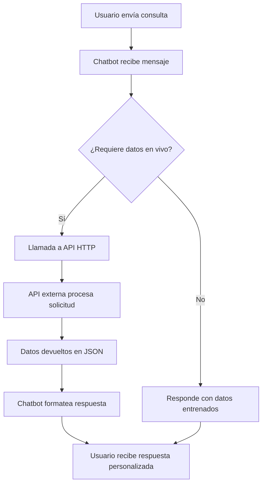
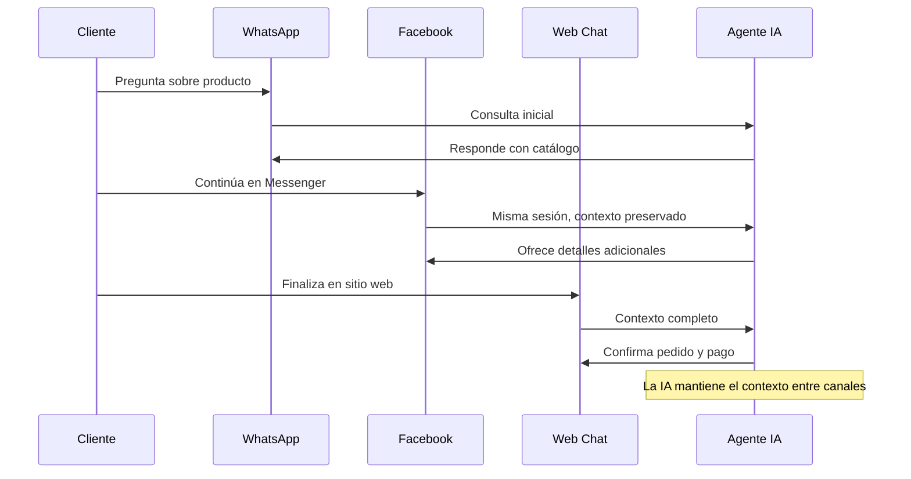

import { Callout, Steps, Step, Expandable, Columns, Card, Tabs, Tab, CodeGroup, CodeGroupItem, Update } from '@esmart360/components';

# Entrenar un Asistente de IA para Chatbot con FAQ, URL, Archivo, API HTTP y Google Sheets


> **Resumen rápido:** Esta guía te lleva paso a paso por el proceso de entrenar el Agente de IA de E-SMART360 para tu chatbot. Puedes enseñarle a tu asistente a responder de forma profesional y precisa alimentándolo con: FAQs y resúmenes manuales, contenido de URLs específicas de tu sitio web, documentos y archivos (PDF, Word, TXT), datos en tiempo real desde Google Sheets e información en vivo de plataformas externas como WooCommerce o WordPress mediante APIs HTTP. La guía también explica cómo configurar el chatbot para responder consultas "sin coincidencia" usando sus datos entrenados y cómo integrarlo con una bandeja de entrada compartida para transferencias fluidas a agentes humanos.


> **Última actualización (2026-02-09)**
> Contenido revisado y actualizado con las últimas funcionalidades del Agente de IA de E-SMART360.

## Introducción

En la era digital actual, los chatbots se han convertido en una herramienta indispensable tanto para individuos como para organizaciones. Facilitan la comunicación, mejoran la experiencia del usuario y permiten escalar la atención al cliente sin incrementar proporcionalmente los costos operativos.

E-SMART360 ha lanzado su funcionalidad de **Agente de IA** para chatbot, brindando a las empresas capacidades virtuales de detección de intenciones que lo convierten en la forma más inteligente y eficiente de interactuar con los clientes. En este panorama digital en rápida evolución, las soluciones impulsadas por IA están transformando la forma en que los clientes se relacionan con las marcas, y E-SMART360 lidera el camino con sus capacidades inteligentes.


> El Agente de IA de E-SMART360 está diseñado para diferentes necesidades empresariales. Es extremadamente versátil y eficiente, capaz de manejar desde consultas simples hasta flujos de trabajo complejos con datos en vivo.

## ¿Qué puedes entrenar en tu Agente de IA?

El asistente de IA de E-SMART360 puede ser entrenado con múltiples fuentes de datos para ofrecer respuestas precisas y contextuales:


### FAQs Manuales

Entrena con preguntas y respuestas predefinidas para respuestas rápidas y consistentes. Ideal para consultas frecuentes como horarios, precios y políticas.

### URLs y Sitios Web

Extrae contenido directamente de páginas web seleccionando elementos específicos mediante selectores CSS (ID o Clase). Perfecto para documentación y páginas de productos.

### Archivos y Documentos

Sube archivos PDF, Word o TXT con manuales de entrenamiento, guías de productos o catálogos. El chatbot procesa y aprende de todo el contenido.

### APIs HTTP en Tiempo Real

Conecta tu chatbot con plataformas externas como WooCommerce, WordPress, Shopify o cualquier API personalizada para obtener y actualizar datos en vivo.

### Google Sheets

Sincroniza datos desde hojas de cálculo de Google para mantener la información siempre actualizada sin necesidad de intervención manual.

## Guía Paso a Paso para Entrenar tu Chatbot con IA

Sigue estos pasos para configurar y entrenar tu Agente de IA en E-SMART360.

### Paso 1: Crear una Campaña de Entrenamiento de IA


### Accede al panel de entrenamiento

Dirígete al **Panel de Control** de E-SMART360, ve a **Configuración** y haz clic en **"Campaña de Entrenamiento de IA"**.

### Crea una nueva campaña

Haz clic en el botón **"Crear"** para iniciar una nueva campaña de entrenamiento. También puedes editar o actualizar campañas existentes desde el menú de Acciones.

### Configura el mensaje de inicio

Se abrirá una página donde puedes agregar el **Nombre de la Campaña** y el **Mensaje de Instrucción**. Ya existe un mensaje de instrucción predeterminado que el bot usa para entender su rol. Puedes ajustarlo según tus necesidades.


> **Ejemplo de mensaje de instrucción:**
*"Tu responsabilidad es apoyar a nuestros clientes como agente o representante de nuestra empresa. Siempre preséntate como 'nosotros' o 'nuestra empresa' al hablar de características, servicios o políticas. Tu rol es ayudar a los clientes con información precisa y útil sobre nuestras ofertas. Al responder consultas sobre precios, proporciona información clara y concisa, incluyendo cualquier descuento disponible, paquetes u opciones de suscripción. Mantén tus respuestas profesionales, amigables e informativas."*

### Guarda la campaña

Una vez configurado el nombre y el mensaje de instrucción, haz clic en **Guardar** para crear la campaña.

### Paso 2: Entrenar el Chatbot con FAQs Manuales

Una vez creada la campaña, puedes modificarla haciendo clic en el botón **"+"** del menú de **Acciones**.


> Puedes entrenar la IA usando dos formatos: **Resumen** o **FAQ**.


### Resumen

Un resumen es más inteligente ya que proporciona contexto completo sobre tu negocio y genera respuestas más ricas. Sin embargo, consume más tokens que el formato FAQ.

**Ventajas:**
- Respuestas más contextuales y detalladas
- Mejor comprensión del negocio en su conjunto
- Mayor naturalidad en las interacciones

**Desventajas:**
- Mayor consumo de tokens
- Costo ligeramente superior por consulta

### FAQ

El formato FAQ es más eficiente en costos y utiliza preguntas y respuestas específicas. Es ideal para respuestas rápidas y precisas.

**Ventajas:**
- Menor consumo de tokens
- Respuestas más rápidas
- Más económico
- Fácil de estructurar

**Desventajas:**
- Respuestas menos contextuales
- Puede no cubrir matices no previstos

Simplemente sube tu contenido en el formato requerido, guarda la configuración y tu IA estará lista para funcionar.


### Agrega contenido al chatbot

Haz clic en el botón **"+"** desde el menú de Acciones de tu campaña. Selecciona el tipo de entrenamiento (Resumen o FAQ).

### Ingresa tus datos

Escribe tu resumen de negocio o agrega tantas preguntas y respuestas como necesites. El chatbot utilizará esta información para responder a los clientes.

### Guardar y activar

Guarda los cambios. El chatbot ya comenzará a usar la información proporcionada en sus respuestas.


> **Consejo profesional:** Combina ambos formatos para obtener lo mejor de ambos mundos: usa un resumen para el contexto general del negocio y FAQs para consultas específicas recurrentes.

### Paso 3: Entrenar el Chatbot con URLs

Puedes insertar una URL para que el chatbot extraiga datos directamente desde una página web.


### Accede a la sección URL

Desde la campaña de entrenamiento, cambia a la pestaña **URL** desde el panel derecho y haz clic en **"Nuevo"**.

### Configura la URL de origen

Agrega la **URL de la Campaña**: la dirección de la página web desde donde el bot extraerá datos.

En la sección **"Configuración de Extracción de Contenido"**, debes seleccionar un **Selector**, que puede ser **ID** o **Clase** (Class). Esto depende del diseño del sitio web. Algunos elementos en la página se definen por un ID (único para ese elemento), mientras que otros se definen por una Clase (que puede aplicarse a múltiples elementos).


#### Ejemplo: Extraer por ID

```html
<div id="contenido-principal">
  <!-- Este contenido será extraído -->
  <h1>Nuestros Productos</h1>
  Descripción de productos...
</div>
```
Selector: **ID** | Nombre: **contenido-principal**

#### Ejemplo: Extraer por Clase

```html
<div class="producto-card">
  <!-- Este contenido será extraído -->
  <h2 class="producto-nombre">Producto X</h2>
  <span class="producto-precio">$29.99</span>
</div>
```
Selector: **Class** | Nombre: **producto-card**

### Excluye contenido no deseado (opcional)

Puedes **eliminar configuraciones de contenido** por ID o clase para especificar áreas que deseas excluir si la página web contiene detalles innecesarios como anuncios, barras de navegación o pies de página irrelevantes para el contenido que deseas extraer. Eliminar estas secciones asegura que solo se incluya el contenido necesario en el proceso de extracción.

### Genera y guarda

Una vez agregada la URL y configurado el selector, haz clic en **"Generar FAQ"** o **"Generar Respuesta Cruda"** y guarda los cambios.


> - **Generar FAQ**: Divide el contenido en entradas de FAQ individuales. Usa menos tokens y es más económico.
- **Generar Respuesta Cruda**: Devuelve todo el documento como una respuesta integral. Proporciona respuestas más detalladas pero consume más tokens.

> Puedes extraer datos de una sección específica de la página usando selectores ID/Clase, o bien de la página completa. En el segundo caso, es recomendable usar la opción de eliminación de contenido para quitar encabezados, pies de página y otros elementos irrelevantes.

### Paso 4: Entrenar el Chatbot con Archivos

Puedes subir documentos estructurados como manuales de entrenamiento, FAQs o guías de productos.


### Accede a la sección de archivos

Desde la configuración de la campaña de entrenamiento, ve a la sección **"Archivo"** y haz clic en **"Nuevo"**.

### Sube tu archivo

Selecciona y sube un archivo en formato **PDF**, **Word (.doc)** o **TXT**. El sistema procesará el documento completo.

### Elige el modo de procesamiento

Tienes dos opciones para procesar el archivo:

**Opción 1: Generar Respuesta Cruda:**
Esta opción devuelve todo el documento como una respuesta integral y completa. Al proporcionar la respuesta completa en una sola FAQ, se obtienen respuestas mucho más detalladas y contextuales. Sin embargo, este método requiere más tokens y consume más créditos.

**Opción 2: Generar FAQ:**
Esta opción divide el contenido en entradas de FAQ individuales y más pequeñas. Este enfoque utiliza menos tokens y es más económico, aunque el chatbot puede no ofrecer respuestas tan contextuales o detalladas como con la respuesta cruda. Es ideal para respuestas rápidas y concisas.

### Guarda la configuración

Una vez seleccionada tu opción preferida, haz clic en **"Guardar"**. El chatbot utilizará el archivo subido para ofrecer respuestas, ya sean detalladas o concisas según el método elegido.


### 📄 Formato PDF

Ideal para manuales de producto, guías de usuario, catálogos y documentación extensa. El asistente extrae y aprende de todo el contenido del PDF.

### 📝 Formato Word y TXT

Perfecto para FAQs estructuradas, listas de preguntas, guías de procedimientos y cualquier contenido textual que puedas tener en estos formatos.

### Paso 5: Entrenar tu Asistente de IA con API HTTP

Con E-SMART360, puedes entrenar tu asistente de IA conectándolo directamente a plataformas externas mediante la integración de **API HTTP**. En lugar de depender solo de FAQs estáticas, documentos o URLs de contenido, esta integración te permite obtener y actualizar datos en tiempo real desde sistemas como WooCommerce, WordPress, Shopify o cualquier API personalizada.


> **Ejemplo práctico:** Conecta una API de WooCommerce a WhatsApp. El asistente de IA usa instantáneamente los datos de productos para responder consultas o recomendar productos en tiempo real. Este enfoque transforma tu chatbot en un asistente dinámico e inteligente que aprende continuamente de datos en vivo.

### Accede a la integración HTTP API

Ve a **Integraciones** en el panel de control de E-SMART360, selecciona la plataforma social donde deseas integrar la API (WhatsApp, Facebook, Instagram, Telegram, Webchat) y haz clic en **"Crear"**.

### Configura los detalles de conexión

- **Nombre de la API:** Proporciona un nombre reconocible (ej. "Productos WooCommerce").
- **Método:** Selecciona el método HTTP (GET, POST, PUT, DELETE según corresponda).
- **URL del Endpoint:** Ingresa la URL de la API externa (ej. `https://tutienda.com/wp-json/wc/v3/products`).
- **ID de Suscriptor de Prueba:** Opcionalmente, copia un ID de suscriptor del Gestor de Suscriptores para pruebas.

### Configura los encabezados de la solicitud

- **Content-Type:** Establécelo como `application/json` u otro tipo según las especificaciones de la API.
- **Authorization:** Agrega las credenciales necesarias (ej. Token Bearer, clave de API).

### Configura el cuerpo de la solicitud (opcional)

- Agrega los campos requeridos para la solicitud API (ej. username, email, product_id).
- Elige entre valores estáticos o dinámicos basados en la entrada del usuario.
- Selecciona el formato: JSON, Form Data o X-WWW-FORM-URLENCODED según los requisitos de la API.

### Guarda y verifica la conexión

Haz clic en **"Verificar Conexión"** para enviar una solicitud de prueba. Si es exitosa, haz clic en **"Guardar API"** para finalizar la configuración.

### Mapea los datos de respuesta

Mapea los campos de respuesta de la API a las variables de E-SMART360. Por ejemplo, si la API devuelve un `user_id` o `email`, puedes mapearlo de vuelta al perfil del suscriptor. También puedes guardar elementos de lista como JSON para usarlos en mensajes interactivos.


> **¿Cómo funciona en el flujo del chatbot?** Una vez que la API está incorporada en una plataforma social, puedes agregar un **Elemento HTTP API** en cualquier parte del flujo del chatbot usando el constructor visual de flujos. Configura cuándo y cómo debe llamarse la API según las interacciones del usuario.

#### Diagrama del Flujo de Integración API



#### Recursos adicionales sobre APIs:

Para guías detalladas paso a paso sobre la configuración de integraciones HTTP API y entrenamiento de IA, consulta estos recursos:

- [Usar Listas Dinámicas en Mensajes Interactivos de WhatsApp](/recursos/listas-dinamicas-whatsapp)
- [Guía de Integración de API HTTP en el Flujo del Bot](/recursos/integracion-api-http-flujo-bot)
- [Integrar WordPress con WhatsApp mediante API de E-SMART360](/recursos/integrar-wordpress-whatsapp-api)
- [Mostrar Productos de WooCommerce Dentro de WhatsApp](/recursos/mostrar-productos-woocommerce-whatsapp)

### Paso 6: Entrenar tu Asistente de IA con Google Sheets

Con E-SMART360, puedes entrenar tu asistente de IA usando datos en vivo desde **Google Sheets**, haciéndolo más inteligente, personalizado y actualizado. Este enfoque te permite automatizar la comunicación con los clientes mientras mantienes tu IA informada con datos en tiempo real.


### Conecta tu cuenta de Google

Ve a **Configuración** > **Integración de Google Sheet**. Haz clic en **"Iniciar sesión con Google"** e inicia sesión en tu cuenta de Google. Agrega una hoja existente o crea una nueva.

### Crea campos personalizados (opcional)

Antes de obtener datos, puedes crear campos personalizados para almacenar la información recuperada. Ve a **Gestor de Suscriptores** > **Administrar Campos Personalizados** y crea los campos que necesites.

### Crea una campaña de obtención de datos

Ve a **Configuración** > **Obtener Datos de Google Sheet**. Selecciona **"Campaña de Obtención de Datos de WhatsApp"** y haz clic en **"Crear"**. Nombra la API y selecciona la hoja de Google de la que deseas obtener datos.

### Mapea los datos

- Elige un **campo de búsqueda** (ej. el mensaje del suscriptor).
- Selecciona los encabezados de columna de Google Sheet y mapéalos a los campos personalizados correspondientes.
- Agrega tantos campos como necesites.


> **Ejemplo:** Si tu Google Sheet tiene columnas como "ID de Suscriptor", "Nombre", "Teléfono", "Dirección" — mapea cada una al campo personalizado correspondiente en E-SMART360.

### Verifica la conexión

Haz clic en **"Verificar Conexión"** para asegurarte de que la hoja está conectada correctamente y todos los mapeos de datos son precisos.

### Usa los datos en tus respuestas

Ahora puedes integrar los datos obtenidos en las respuestas de tu chatbot:
1. Ve al **Gestor de Bots** de WhatsApp y haz clic en **"Crear Respuesta de Bot"**.
2. Agrega un disparador basado en palabras clave (ej. "Plomero", "Electricista").
3. Selecciona **"Obtener Datos de Google Sheet"** y vincúlalo a la campaña.
4. Usa campos personalizados en el texto de respuesta para personalizar los mensajes.
5. Guarda y prueba tu bot.


> **Ejemplo práctico:** Si un usuario pregunta por un plomero, el bot recupera los datos de contacto del plomero desde la hoja de Google y proporciona la respuesta en el chat. Esto funciona para cualquier tipo de consulta basada en datos tabulares.

### Paso 7: Configurar la Respuesta "Sin Coincidencia"

Una vez que has completado el entrenamiento de tu chatbot con URLs, archivos y FAQs manuales, es momento de configurar la **Respuesta Sin Coincidencia (No Match Reply)**, donde el bot responderá a cualquier consulta del cliente según los datos entrenados.


### Accede al Gestor de Bots

Ve al **Gestor de Bots**, luego a **"Botones de Acción"** y haz clic en **"Sin Coincidencia"**.

### Configura la respuesta AI

Se te redirigirá al constructor visual de flujos de arrastrar y soltar. Haz doble clic en **"Respuesta AI"**. En la sección **"Campaña de entrenamiento de Open AI"**, selecciona la campaña entrenada y guarda.

### Activa la respuesta Sin Coincidencia

En el siguiente paso, desplázate hacia abajo en el Gestor de Bots y haz clic en **"Configuración"**. Activa la opción **"Respuesta Sin Coincidencia"** y guarda la configuración.


> La configuración de **Respuesta Sin Coincidencia** con una Campaña de IA es la mejor opción para mantener tu chatbot de IA activo todo el tiempo. Sin ella, las consultas que no coincidan con reglas predefinidas quedarán sin respuesta.

### Paso 8: Habilitar el Sistema de Control Central "Activar Agente de IA"


### Navega al Gestor de Bots

Simplemente navega al **Gestor de Bots** desde el panel de control.

### Activa el Agente de IA

Localiza la opción **"Activar Agente de IA"** y actívala. Aparecerá el menú de chatbots ya entrenados; puedes seleccionar tu campaña preferida.

### Elige el modo de operación

Configura el chatbot según tu preferencia:
- **Agente de IA para Todas las Consultas:** La IA maneja absolutamente todas las consultas de los clientes.
- **IA solo como Respaldo:** La IA solo interviene cuando las reglas predefinidas no coinciden.


> La detección de intenciones en el sistema del Agente de IA es una funcionalidad avanzada. Para aprender cómo configurar la detección de intenciones, consulta la guía de [Detección de Intenciones Impulsada por IA para Mejorar la Eficiencia del Chatbot](/recursos/deteccion-intenciones-ia-chatbot).

### Probar el Chatbot

Una vez completados todos los pasos, es hora de probar el bot desde el punto de vista del usuario.


> ✅ El chatbot de IA ahora responde perfectamente. Tu chatbot de IA gratuito está completamente entrenado y configurado. Ahora puede responder a las consultas de tus clientes usando los datos entrenados de FAQs manuales, URLs y archivos subidos. Cuando la "Respuesta Sin Coincidencia" o el "Agente de IA para Todas las Consultas" está habilitado, el bot puede proporcionar respuestas útiles, garantizando una atención al cliente fluida.

## ¿Por qué usar el Agente de IA de E-SMART360 para tu Negocio?

Hay muchas razones por las que este Agente de IA es necesario en el escenario empresarial actual. El Agente de IA de E-SMART360 puede transformar tu negocio y la interacción con tus clientes:


### 📱 Soporte Multicanal

Puedes configurar el Agente de IA en Chatbot de Sitio Web, WhatsApp, Messenger, Instagram y Telegram. Un solo entrenamiento, múltiples canales de atención.

### ⏰ Disponibilidad 24/7

Proporciona atención al cliente instantánea y continua durante todo el día para aumentar la satisfacción del cliente. Tu negocio nunca duerme.

### 🧠 Entrenamiento Inteligente

Disponibilidad de entrenar al bot en FAQs, datos basados en archivos u otras fuentes externas para respuestas contextuales. Cada interacción mejora su precisión.

### 🎯 Interacciones Personalizadas

Llega a los clientes con respuestas altamente personalizadas y construye mejores relaciones con ellos. Cada cliente recibe una atención única.

### 📈 Escalable y Rentable

Maneja cargas crecientes sin costo adicional. A medida que tu negocio crece, el asistente escala contigo sin necesidad de contratar más personal.

### 🚀 Productividad Mejorada

Libera a tu equipo para que aborde tareas más complejas mientras el bot maneja las consultas rutinarias. Optimiza los recursos humanos.

## E-SMART360 como Software de Chatbot Multicanal

E-SMART360 es un software de chatbot omnicanal que cubre las plataformas de redes sociales más populares utilizadas a nivel mundial.

### Chatbot de WhatsApp
El canal de chatbot de WhatsApp de E-SMART360 cuenta con un conjunto completo de herramientas que incluye un constructor de chatbots de arrastrar y soltar, broadcasting, flujo de trabajo webhook, chat en vivo, integración de formularios WhatsApp Flows, integración de Google Sheets, API HTTP, integración con tiendas de ecommerce, múltiples métodos de pago y mucho más.

### Chatbot de Facebook Messenger
El chatbot de Messenger es rico en control central del Agente de IA, broadcasting, chat en vivo, lista de publicaciones, Gestor de Postbacks, Widget de Engagement, Secuencia, Flujo de Entrada, Menú Persistente, Gestor de Postbacks RCN, Lista Blanca de Dominios, Conector JSON API, Webhook de Salida, Botones de Acción, Campaña de Entrenamiento de IA, Configuración y más.

### Chatbot de Instagram DM
El chatbot de Instagram incluye diversas capacidades como constructor de chatbots sin código, Agente de IA, Gestor de Postbacks, Secuencia, Flujo de Entrada, Menú Persistente, Lista Blanca de Dominios, Conector JSON API, Webhook de Salida, Botones de Acción, Campaña de Entrenamiento de IA, Configuración de Inicio y chat en vivo.

### Chatbot de Telegram
El chatbot de Telegram de E-SMART360 está equipado con excelentes capacidades de gestión de grupos. Este canal está cargado con funciones como Gestor de Grupos, Gestor de Suscriptores, Broadcasting, Chat en Vivo, Secuencia, Webhook de Salida, opciones de filtrado de mensajes, gestión de actividad de grupos y mucho más.

### Chatbot de Sitio Web
La integración del Chatbot de Sitio Web es la más reciente adición de E-SMART360. Permite a las empresas integrar este chatbot directamente en su sitio web. Ofrece comunicación en tiempo real incluyendo funcionalidad de Chat en Vivo. Los agentes pueden ver y controlar las conversaciones desde aquí. Además, el chatbot es altamente personalizable y la campaña de entrenamiento de IA también está disponible. Con herramientas completas como creación de chatbots, Gestor de Postbacks, Flujo de Entrada, Menú Persistente, Conector JSON API, Webhook de Salida y Botones de Acción, las empresas pueden personalizar completamente la funcionalidad de su chatbot.

## Mejorando tu Agente de IA con la Bandeja de Entrada Compartida

La **Bandeja de Entrada Compartida** de E-SMART360 lleva la eficiencia de tu chatbot de IA al siguiente nivel al integrar seamlessmente la colaboración humana en tu sistema de atención al cliente. Con la función **"Asignar Miembro del Equipo o Agente por IA"**, el Agente de IA trabaja inteligentemente para escalar conversaciones que requieren intervención humana, asegurando que ninguna consulta quede sin resolver.

### Cómo la Bandeja de Entrada Compartida Complementa la Asistencia de IA

1. **Escalado Basado en Intenciones:** Aprovechando capacidades avanzadas de **Procesamiento de Lenguaje Natural (NLP)**, el chatbot de IA detecta intenciones o frases específicas del usuario que señalan la necesidad de soporte humano. Por ejemplo, cuando un cliente dice "Necesito hablar con una persona", la IA entiende la solicitud y asigna inmediatamente la conversación al miembro del equipo apropiado.

2. **Colaboración Optimizada:** La **Bandeja de Entrada Compartida** asegura que todas las consultas escaladas se gestionen eficientemente. Los miembros del equipo pueden ver, responder y resolver los problemas de los clientes en tiempo real, manteniendo un flujo seamless entre la automatización de IA y la intervención humana.

3. **Satisfacción del Cliente Mejorada:** Al combinar la velocidad y precisión de la IA con la empatía y experiencia de los agentes humanos, la Bandeja de Entrada Compartida asegura que los clientes reciban respuestas oportunas y personalizadas a sus consultas.

### Por Qué es Importante

Esta funcionalidad cierra la brecha entre la automatización y el servicio personalizado. Mientras el Agente de IA maneja consultas rutinarias, la Bandeja de Entrada Compartida permite a los agentes humanos concentrarse en las necesidades más complejas de los clientes, creando un sistema de soporte equilibrado y eficiente.


> Al activar la función **"Asignar Miembro del Equipo o Agente por IA"**, puedes asegurarte de que tu chatbot de IA funcione como un socio confiable para tu equipo de soporte, escalando consultas de forma inteligente y proporcionando experiencias fluidas al cliente.

## Casos de Uso y Aplicaciones Prácticas


### 🛒 Comercio Electrónico

Un cliente pregunta: "¿Tienen este producto en talla M?" El asistente consulta la API de WooCommerce en tiempo real, verifica el inventario y responde con la disponibilidad actual y opciones de talla alternativa.

### 🏥 Servicios Médicos

Un paciente pregunta: "¿Cuál es el horario del Dr. García?" El bot consulta Google Sheets donde se almacenan los horarios semanales y responde con los días y horas disponibles.

### 🔧 Soporte Técnico

Un usuario dice: "No puedo iniciar sesión." La IA, entrenada con el manual de solución de problemas en PDF, guía al usuario paso a paso para recuperar su acceso sin intervención humana.

### 🏨 Hotelería

Un huésped pregunta: "¿El hotel tiene piscina?" El asistente, entrenado con la URL del sitio web del hotel, responde con los servicios disponibles, horarios y reglas de uso.

## Preguntas Frecuentes


### ¿Cómo funciona el precio de los Tokens de IA?

El entrenamiento del chatbot de IA en E-SMART360 funciona con tecnología de IA avanzada. Para cada cuenta premium, hay **100,000 tokens gratuitos cada mes**. Si estos 100,000 tokens no cubren tu uso, entonces **10 millones de tokens te costarán solo $14.5 USD**, con validez ilimitada. Puedes adquirir Tokens de IA de E-SMART360 para una integración seamless del Agente de IA desde la sección de precios.

### ¿Cuál es el propósito de un chatbot de IA para comercio electrónico?

El propósito principal de un chatbot de IA para comercio electrónico es automatizar tareas, atención al cliente y gestión de campañas de marketing. Ayuda a reducir costos, tiempos de espera, proporciona soporte más rápido y, en última instancia, abre el camino hacia negocios de ecommerce exitosos. Con el Agente de IA de E-SMART360, puedes gestionar todo desde una sola plataforma.

### ¿Por qué elegir un chatbot de IA en lugar del método tradicional?

Un chatbot de IA utiliza procesamiento de lenguaje natural en lugar de sistemas basados en comandos. Los chatbots de IA tienen la capacidad de entender el lenguaje humano y dar respuestas basadas en las preguntas, incluso cuando estas no coinciden exactamente con lo que fue programado. Esto permite interacciones mucho más naturales y fluidas con los clientes, mejorando significativamente la experiencia de usuario.

### ¿Puedo personalizar un chatbot para mi tienda de comercio electrónico?

Sí, puedes personalizar un chatbot para tu tienda de comercio electrónico con E-SMART360. Con el plan de **Marca Blanca (White-Label)**, puedes usar tu propia marca y logotipo, así como la localización para adaptarlo mejor a tus necesidades. El chatbot de E-SMART360 es altamente personalizable con su constructor de flujos de arrastrar y soltar, y las instalaciones de chatbot entrenado con IA.

### ¿Cómo puedo crear un chatbot de IA gratis?

E-SMART360 es una plataforma de chatbot de IA gratuita con opciones multicanal. Puedes simplemente conectar o integrar tus cuentas de redes sociales y empezar a crear chatbots de IA gratuitos. La plataforma ofrece un plan gratuito permanente con funciones esenciales para que cualquier negocio pueda comenzar a automatizar su atención al cliente sin inversión inicial.

### ¿Cómo mejora un chatbot de IA la atención al cliente?

Un chatbot de IA puede manejar FAQs, resolver problemas más rápido, proporcionar respuestas instantáneas y operar 24/7 para mejorar significativamente la satisfacción del cliente. Con el Agente de IA de E-SMART360, los clientes reciben respuestas inmediatas a sus consultas sin importar la hora del día, lo que reduce la frustración y aumenta la probabilidad de conversión.

### ¿Qué características debe tener un chatbot de atención al cliente?

Debes buscar soporte multicanal, IA conversacional, capacidades de integración, funciones de automatización de marketing y opciones de personalización. E-SMART360 ofrece todas estas características, permitiéndote gestionar chatbots en WhatsApp, Facebook Messenger, Instagram, Telegram y tu sitio web desde una sola plataforma.

### ¿Cuál es el mejor chatbot de IA gratuito?

El mejor chatbot de IA gratuito depende de tus necesidades y caso de uso. Si deseas usar un chatbot para redes sociales y gestionar tareas de marketing y atención al cliente en múltiples canales, E-SMART360 es la mejor opción. Para conversación general de IA, existen otras alternativas, pero para una solución empresarial completa de chatbot multicanal, E-SMART360 ofrece la combinación más potente de funcionalidades gratuitas y premium.

## Optimización del Rendimiento del Agente de IA

Una vez que has entrenado y configurado tu Agente de IA, es importante monitorear y optimizar su rendimiento continuamente para asegurar que ofrece la mejor experiencia posible a tus clientes.

### Monitoreo de Conversaciones


### Revisa el historial de conversaciones

Accede al panel de **Chat en Vivo** o **Bandeja de Entrada Compartida** para revisar las conversaciones que ha tenido tu chatbot. Identifica patrones de preguntas que el bot haya respondido correctamente y aquellas donde haya tenido dificultades.

### Analiza las respuestas fallidas

Busca conversaciones donde el cliente haya mostrado frustración o haya solicitado hablar con un agente humano. Estas son oportunidades para mejorar el entrenamiento de tu IA.

### Actualiza los datos de entrenamiento

Basándote en el análisis, agrega nuevas FAQs, actualiza los resúmenes, o añade nuevos archivos y URLs que cubran las lagunas de conocimiento identificadas.

### Prueba después de cada actualización

Siempre realiza pruebas después de actualizar los datos de entrenamiento para verificar que el comportamiento del bot sea el esperado y que las respuestas sean precisas y útiles.

### Métricas Clave a Monitorear

| Métrica | Descripción | Objetivo Recomendado |
|---------|-------------|----------------------|
| Tasa de Resolución en Primer Contacto | % de consultas resueltas sin escalar a humano | Superior al 80% |
| Tiempo Promedio de Respuesta | Tiempo que tarda el bot en responder | Menos de 3 segundos |
| Tasa de Escalado a Humano | % de conversaciones que requieren agente humano | Inferior al 20% |
| Satisfacción del Cliente (CSAT) | Calificación promedio del cliente después de la interacción | Superior a 4.0/5.0 |
| Consumo de Tokens | Tokens utilizados por día/semana/mes | Dentro del presupuesto mensual |


> El monitoreo regular es esencial para mantener la calidad del servicio. Un chatbot de IA sin supervisión puede comenzar a dar respuestas incorrectas si los datos de entrenamiento se vuelven obsoletos. Programa revisiones periódicas de tu campaña de entrenamiento.

## Integración con Zapier, Make y N8N

Además de las integraciones nativas de API HTTP y Google Sheets, E-SMART360 se conecta con plataformas de automatización como **Zapier**, **Make (Integromat)** y **N8N**, ampliando enormemente las posibilidades de integración con más de 2000 aplicaciones.

### Zapier

Con Zapier, puedes conectar tu chatbot de E-SMART360 con cientos de aplicaciones sin necesidad de escribir código. Algunos casos de uso populares:

- **CRM**: Cuando un suscriptor interactúa con tu chatbot, crea automáticamente un contacto en HubSpot, Salesforce o Pipedrive.
- **Email Marketing**: Agrega automáticamente nuevos leads capturados por el chatbot a tus listas de Mailchimp, ActiveCampaign o ConvertKit.
- **Soporte**: Crea tickets en Freshdesk, Zendesk o HelpScout cuando un cliente solicita ayuda humana.
- **Notificaciones**: Envía notificaciones a Slack, Discord o Telegram cuando ocurren eventos importantes en tu chatbot.


> Para configurar Zapier con E-SMART360, ve a **Integraciones** > **Zapier** y genera una clave API. Luego, en Zapier, busca "E-SMART360" como aplicación de disparo o acción y sigue los pasos de configuración.

### Make (Integromat)

Make ofrece una plataforma visual de automatización más potente que Zapier, permitiendo flujos de trabajo complejos con múltiples pasos, condicionales y transformaciones de datos.

### N8N

N8N es una alternativa de código abierto que puedes alojar en tu propio servidor, ofreciendo control total sobre tus datos y flujos de automatización.

## Escenarios Avanzados de Uso

### Atención al Cliente Multicanal Unificada

Un cliente puede iniciar una conversación en WhatsApp, continuarla en Facebook Messenger y finalizarla en el chat web. El Agente de IA de E-SMART360 mantiene el contexto de la conversación a través de todos los canales, asegurando una experiencia consistente sin importar dónde se comunique el cliente.



### Ventas Automatizadas con Detección de Intención de Compra

Configura tu Agente de IA para detectar cuándo un cliente tiene intención de compra y activar automáticamente un flujo de ventas:

1. El cliente pregunta sobre un producto específico
2. La IA detecta la intención de compra mediante NLP
3. El chatbot proporciona detalles del producto, precio y disponibilidad
4. Ofrece un enlace de pago o genera un carrito de compra
5. Si el cliente duda, la IA ofrece asistencia adicional o descuentos
6. Si el cliente confirma, procesa el pedido y envía confirmación

### Encuestas de Satisfacción Automatizadas

Después de resolver una consulta, el Agente de IA puede enviar automáticamente una encuesta de satisfacción. Los resultados se almacenan en Google Sheets para análisis posterior, permitiéndote identificar áreas de mejora en tu servicio.


### 🏪 Tienda de Ropa Online

Una tienda de ropa entrena su IA con el catálogo de productos (URL), la guía de tallas (PDF) y las políticas de devolución (FAQ). Un cliente pregunta: "¿Qué talla me recomiendas para una camiseta?" El bot responde con la guía de tallas y sugiere productos basados en las preferencias del cliente.

### 🏢 Empresa de Servicios B2B

Una empresa de consultoría entrena su IA con casos de estudio (archivos PDF), precios de servicios (Google Sheets) y artículos del blog (URLs). Cuando un prospecto pregunta por servicios específicos, el bot proporciona casos de estudio relevantes y cotizaciones actualizadas en tiempo real.

### 🍕 Restaurante con Delivery

Un restaurante entrena su IA con el menú (URL), horarios de atención (FAQ) y zonas de cobertura (Google Sheets). Los clientes pueden preguntar por el menú del día, hacer pedidos y conocer el tiempo estimado de entrega, todo sin intervención humana.

### 🏦 Institución Financiera

Un banco entrena su IA con las políticas de préstamos (PDF), tasas de interés actualizadas (Google Sheets) y preguntas frecuentes sobre productos financieros (FAQ). Los clientes pueden obtener información precisa sobre productos financieros 24/7.

## Solución de Problemas Comunes

### El chatbot no responde correctamente


### Verifica la conexión de la fuente de datos

Asegúrate de que todas las URLs, archivos y Google Sheets estén accesibles y correctamente configurados. Una URL caída o un archivo corrupto pueden afectar el rendimiento del chatbot.

### Revisa el mensaje de instrucción

El mensaje de instrucción (prompt) define el comportamiento del bot. Si el bot no responde como esperas, ajusta el prompt para ser más específico sobre el tono, formato y alcance de las respuestas.

### Verifica la campaña de entrenamiento seleccionada

Confirma que la campaña de entrenamiento correcta esté seleccionada en la configuración del Agente de IA y en la Respuesta Sin Coincidencia.

### Prueba con consultas de ejemplo

Envía consultas de prueba desde el frontend del chatbot para verificar que las respuestas sean precisas. Si fallan, revisa los datos de entrenamiento para detectar lagunas de información.

### La integración de API HTTP no funciona

1. **Verifica la URL del endpoint**: Asegúrate de que la URL sea correcta y accesible públicamente.
2. **Confirma las credenciales**: Revisa que los tokens de autenticación o claves API sean válidos y no hayan expirado.
3. **Comprueba el método HTTP**: Asegúrate de que el método (GET, POST, etc.) coincida con lo que espera la API externa.
4. **Valida el formato del cuerpo**: Si usas JSON, verifica que el cuerpo de la solicitud esté correctamente formateado.
5. **Usa la función de verificación**: Haz clic en "Verificar Conexión" para diagnosticar problemas antes de implementar.

### La sincronización de Google Sheets no se actualiza

1. **Reconecta tu cuenta de Google**: A veces la sesión expira y necesita ser renovada.
2. **Verifica los permisos**: Asegúrate de que la hoja de cálculo tenga los permisos de acceso adecuados.
3. **Comprueba los nombres de las columnas**: Los encabezados deben coincidir exactamente con los campos mapeados.
4. **Revisa el formato de los datos**: Las celdas vacías o formatos incorrectos pueden causar errores en la sincronización.

## Consejos para un Entrenamiento Efectivo


> La calidad del entrenamiento determina directamente la calidad de las respuestas de tu chatbot. Invertir tiempo en preparar buenos datos de entrenamiento es la mejor inversión que puedes hacer para tu asistente de IA.

### Mejores Prácticas para FAQs

- **Sé específico**: Cada FAQ debe cubrir una pregunta concreta, no temas amplios.
- **Usa lenguaje natural**: Redacta las preguntas como las haría un cliente real.
- **Proporciona respuestas completas**: No des respuestas de una sola línea; proporciona contexto útil.
- **Actualiza regularmente**: Revisa y actualiza las FAQs periódicamente basándote en las preguntas reales de los clientes.
- **Cubre variaciones**: Incluye diferentes formas de hacer la misma pregunta.

### Mejores Prácticas para URLs

- **Selecciona contenido relevante**: No incluyas páginas enteras si solo necesitas una sección específica.
- **Usa selectores precisos**: Invertir tiempo en identificar el selector correcto (ID vs Clase) mejora la precisión.
- **Excluye el ruido**: Elimina navegación, anuncios y pies de página de la extracción.
- **Verifica periódicamente**: Las páginas web cambian; verifica que los selectores sigan funcionando.

### Mejores Prácticas para Archivos

- **Usa PDFs con texto seleccionable**: Los PDFs escaneados (imágenes) no son procesables.
- **Organiza el contenido**: Documentos bien estructurados con encabezados y secciones claras producen mejores resultados.
- **Elige el formato adecuado**: Para documentos extensos, usa "Respuesta Cruda". Para documentos de referencia rápida, usa "FAQ".

### Mejores Prácticas para Google Sheets

- **Mantén los datos limpios**: Celdas vacías o datos inconsistentes afectan la calidad de las respuestas.
- **Usa encabezados descriptivos**: Nombres de columna claros facilitan el mapeo de datos.
- **Actualiza los datos regularmente**: El poder de Google Sheets está en la facilidad de actualización sin modificar el bot.
- **Combina con APIs**: Usa Google Sheets para datos que cambian con poca frecuencia y APIs HTTP para datos en tiempo real.

## Integración con WhatsApp Business API

E-SMART360 es un partner oficial de Meta Business y ofrece integración directa con la **API de WhatsApp Business**, permitiendo a las empresas acceder a funcionalidades premium que no están disponibles en la aplicación regular de WhatsApp.

### Beneficios de la Integración con WhatsApp Business API

| Característica | Descripción |
|----------------|-------------|
| **Múltiples agentes** | Varios miembros del equipo pueden atender conversaciones simultáneamente desde la misma cuenta de WhatsApp |
| **Mensajes plantilla** | Envía mensajes proactivos aprobados por Meta para notificaciones, recordatorios y promociones |
| **Chat en vivo** | Los agentes humanos pueden intervenir en tiempo real cuando el Agente de IA lo requiera |
| **Gestor de suscriptores** | Organiza y segmenta tu base de contactos para campañas dirigidas |
| **Catálogo de productos** | Muestra tu catálogo directamente dentro de WhatsApp con enlaces de compra |
| **Múltiples números** | Conecta varios números de WhatsApp a una sola cuenta de E-SMART360 |


> Para habilitar WhatsApp Business API, ve a **Configuración** > **WhatsApp Business API** en tu panel de E-SMART360. Necesitarás un número de teléfono verificado y aprobación de Meta para comenzar.

## Uso del Gestor de Postbacks

El **Gestor de Postbacks** es una herramienta fundamental para crear flujos conversacionales avanzados. Te permite definir respuestas específicas basadas en las interacciones del usuario con botones, menús y mensajes interactivos.


### Configura un postback básico

Desde el **Gestor de Bots**, selecciona **Postback Manager** y haz clic en **Crear Nuevo**. Define un nombre para el postback (ej. "consultar-precio") y el mensaje de respuesta que el bot enviará cuando se active.

### Vincula el postback a un botón

En el constructor de flujos, agrega un elemento de botón o lista interactiva. Configura el ID del postback para que coincida con el que creaste en el paso anterior.

### Combina postbacks con IA

Puedes configurar un postback para que primero consulte al Agente de IA y luego ejecute acciones adicionales como llamar a una API, enviar datos a Google Sheets o transferir la conversación a un agente humano.

## Configuración del Widget de Engagement

El **Widget de Engagement** te permite capturar la atención de los visitantes en tu sitio web con mensajes personalizados y ofertas especiales.

### Tipos de Widgets Disponibles


### 🎯 Widget de Saludo

Muestra un mensaje de bienvenida personalizado cuando un usuario visita tu sitio web. Puedes configurarlo para que aparezca después de un tiempo específico o cuando el usuario realice una acción determinada.

### 💬 Widget de Oferta

Presenta promociones especiales o descuentos a los visitantes. Ideal para campañas de marketing estacionales o para recuperar carritos abandonados.

### 📋 Widget de Encuesta

Recopila opiniones y comentarios de los usuarios mediante encuestas rápidas directamente en el chat. Los resultados se almacenan para análisis posterior.

### Configuración Paso a Paso

1. Ve al **Gestor de Bots** del canal de sitio web.
2. Selecciona **Widget de Engagement** en el menú.
3. Elige el tipo de widget que deseas crear.
4. Personaliza el mensaje, colores, y la imagen del widget.
5. Define las reglas de activación (tiempo en página, scroll, intención de salida).
6. Configura la respuesta del bot cuando el usuario interactúe con el widget.
7. Guarda y publica el widget.


> Prueba diferentes tipos de widgets para ver cuál genera mejor engagement con tu audiencia. Puedes tener múltiples widgets activos y rotarlos según campañas específicas.

## Automatización de Comentarios en Redes Sociales

E-SMART360 permite automatizar las respuestas a comentarios en publicaciones de **Facebook** e **Instagram**, creando una experiencia de atención al cliente verdaderamente omnicanal.

### Cómo Funciona

1. **Conexión de la cuenta**: Conecta tu página de Facebook y cuenta de Instagram a E-SMART360.
2. **Configuración de palabras clave**: Define palabras clave o frases que activarán respuestas automáticas.
3. **Respuestas inteligentes**: El Agente de IA puede generar respuestas contextuales a los comentarios, no solo respuestas predefinidas.
4. **Escalado a DM**: Cuando un comentario requiere atención más detallada, el bot puede invitar al usuario a continuar por Mensaje Directo.

### Ventajas de la Automatización de Comentarios

- **Respuesta inmediata**: Los comentarios reciben respuesta en segundos, mejorando la percepción de tu marca.
- **Consistencia**: Todas las respuestas mantienen el tono y la calidad de tu marca.
- **Cobertura 24/7**: Los comentarios fuera del horario laboral no quedan sin respuesta.
- **Ahorro de tiempo**: Tu equipo puede concentrarse en los comentarios que realmente requieren intervención humana.

## Programa de Partners y Marca Blanca

E-SMART360 ofrece programas de **Partner** pensados para agencias y emprendedores que desean ofrecer soluciones de chatbot a sus propios clientes.


### 🔄 Programa de Revendedor

Conviértete en revendedor de E-SMART360 y ofrece chatbots multicanal a tus clientes con tu propia marca. Incluye:
- Precios mayoristas
- Panel de control white-label
- Soporte técnico incluido
- Facturación directa a tus clientes
- Capacidad de gestionar múltiples cuentas de clientes desde un solo panel

### 🤝 Programa de Afiliado

Gana comisiones recurrentes recomendando E-SMART360 a otros negocios. Beneficios:
- Comisiones recurrentes mensuales
- Material de marketing incluido
- Panel de afiliado con estadísticas en tiempo real
- Pagos automáticos
- Sin límite máximo de ganancias

> **¿Interesado en convertirte en Partner?** Regístrate en el programa de partners desde el panel de E-SMART360 y accede a herramientas exclusivas para hacer crecer tu negocio de chatbot marketing.

## Seguridad y Privacidad de Datos

En E-SMART360, la seguridad de tus datos y los de tus clientes es una prioridad fundamental. Implementamos múltiples capas de protección para garantizar que toda la información esté segura.

### Medidas de Seguridad Implementadas

- **Cifrado SSL/TLS**: Todas las comunicaciones entre tu navegador y nuestros servidores están cifradas.
- **Autenticación de dos factores**: Protege tu cuenta con una capa adicional de seguridad.
- **Cumplimiento GDPR**: Políticas de privacidad y manejo de datos alineadas con el Reglamento General de Protección de Datos.
- **Almacenamiento seguro**: Los datos de los suscriptores se almacenan en servidores seguros con acceso restringido.
- **Control de acceso basado en roles**: Define qué miembros del equipo tienen acceso a qué funcionalidades.

## Migración desde Otras Plataformas

Si vienes de otra plataforma de chatbot, E-SMART360 facilita la migración con herramientas y soporte dedicado.


### Exporta tus datos

Exporta tus suscriptores, flujos de chatbot y configuraciones desde tu plataforma actual en formato CSV o JSON.

### Importa a E-SMART360

Usa la herramienta de importación masiva para cargar tus suscriptores y configuración en E-SMART360. Ve a **Gestor de Suscriptores** > **Importar** y selecciona tu archivo.

### Reconstruye tus flujos

El constructor visual de flujos de arrastrar y soltar de E-SMART360 te permite recrear tus automatizaciones de forma rápida e intuitiva.

### Conecta tus canales

Conecta tus cuentas de WhatsApp, Facebook, Instagram, Telegram y sitio web al nuevo panel de E-SMART360.

### Entrena tu Agente de IA

Configura las campañas de entrenamiento de IA con tus FAQs, URLs y archivos existentes para que el asistente comience a funcionar inmediatamente.

## Tabla Comparativa de Canales y Funcionalidades

| Funcionalidad | WhatsApp | Messenger | Instagram DM | Telegram | Web Chat |
|---------------|----------|-----------|-------------|----------|----------|
| Agente de IA | ✅ | ✅ | ✅ | ✅ | ✅ |
| Constructor de Flujos | ✅ | ✅ | ✅ | ✅ | ✅ |
| Broadcasting | ✅ | ✅ | ✅ | ✅ | ❌ |
| Chat en Vivo | ✅ | ✅ | ✅ | ✅ | ✅ |
| Google Sheets | ✅ | ✅ | ✅ | ❌ | ❌ |
| API HTTP | ✅ | ✅ | ✅ | ✅ | ✅ |
| Gestor de Postbacks | ✅ | ✅ | ✅ | ✅ | ✅ |
| Widget de Engagement | ❌ | ❌ | ❌ | ❌ | ✅ |
| Gestor de Grupos | ❌ | ❌ | ❌ | ✅ | ❌ |
| Automatización de Comentarios | ❌ | ✅ | ✅ | ❌ | ❌ |
| Catálogo de Productos | ✅ | ❌ | ❌ | ❌ | ❌ |


> Cada canal tiene características únicas que lo hacen ideal para diferentes casos de uso. WhatsApp es perfecto para ventas y atención al cliente, mientras que Telegram destaca en gestión de comunidades. Elige los canales que mejor se adapten a las necesidades de tu negocio.

## Testimonios de Clientes

Empresas de todo el mundo confían en E-SMART360 para potenciar su atención al cliente y automatizar sus procesos de marketing.


### ⭐ Tienda de Moda Online

"Desde que implementamos el Agente de IA de E-SMART360, nuestras ventas en WhatsApp aumentaron un 40%. El bot responde al instante y deriva solo las consultas complejas a nuestro equipo."
— **María G., Gerente de Ecommerce**

### ⭐ Agencia de Marketing Digital

"El programa de white-label nos permitió ofrecer chatbots con nuestra propia marca a más de 50 clientes. La integración con Google Sheets y APIs HTTP nos diferencia de la competencia."
— **Carlos R., CEO de Agencia Digital**

### ⭐ Clínica Dental

"Nuestros pacientes pueden agendar citas 24/7 sin intervención humana. El Agente de IA entiende sus necesidades y encuentra el horario perfecto. La satisfacción del paciente mejoró notablemente."
— **Dra. Laura M., Directora de Clínica**

## Recursos de Aprendizaje Adicionales

Para seguir profundizando en el uso del Agente de IA de E-SMART360, te recomendamos explorar estos recursos:

### Videotutoriales

- **Introducción al Agente de IA**: Aprende los conceptos básicos del asistente inteligente de E-SMART360.
- **Entrenamiento con FAQs Manuales**: Tutorial paso a paso para entrenar tu bot con preguntas frecuentes.
- **Integración de API HTTP**: Guía visual para conectar tu chatbot con plataformas externas.
- **Uso de Google Sheets con el Chatbot**: Cómo sincronizar datos de hojas de cálculo con tu asistente.
- **Configuración de Respuesta Sin Coincidencia**: Aprende a manejar consultas imprevistas.

### Artículos Relacionados

- [Introducción al Asistente de IA de E-SMART360](/recursos/introduccion-asistente-ia)
- [Detección de Intenciones Impulsada por IA](/recursos/deteccion-intenciones-ia)
- [Guía de Integración de API HTTP en el Flujo del Bot](/recursos/integracion-api-http-flujo)
- [Cómo Usar Listas Dinámicas en Mensajes Interactivos de WhatsApp](/recursos/listas-dinamicas-whatsapp)
- [Enviar Mensajes Masivos de WhatsApp Usando Google Sheets](/recursos/mensajes-masivos-google-sheets)
- [Plataforma de Chat en Vivo para Chatbot de WhatsApp](/recursos/chat-en-vivo-whatsapp)

## Conclusión

Como has visto a lo largo de esta guía completa, entrenar un asistente de IA con E-SMART360 crea un chatbot inteligente, eficiente y fácil de usar que puede manejar consultas de clientes, proporcionar información precisa dentro de los datos proporcionados y representar tu negocio de manera profesional.

El Agente de IA de E-SMART360 te permite:

- **Automatizar la atención al cliente** con respuestas inteligentes y contextuales que evolucionan con cada interacción
- **Integrar múltiples fuentes de datos** (FAQs, URLs, archivos, APIs HTTP y Google Sheets) para mantener la información siempre actualizada
- **Escalar tu operación** sin aumentar proporcionalmente los costos, atendiendo cientos de consultas simultáneas
- **Personalizar la experiencia** de cada cliente según sus necesidades, historial y comportamiento
- **Operar 24/7** en múltiples canales simultáneamente (WhatsApp, Facebook, Instagram, Telegram y Web)
- **Colaborar con tu equipo** mediante la Bandeja de Entrada Compartida y la asignación inteligente de conversaciones
- **Diferenciarte de la competencia** con una experiencia de atención al cliente superior e innovadora


> **¿Listo para empezar?** Crea una cuenta gratuita en E-SMART360 y comienza a entrenar tu primer Agente de IA en minutos. No se requiere experiencia técnica previa. Únete a las miles de empresas que ya transformaron su atención al cliente con E-SMART360.
