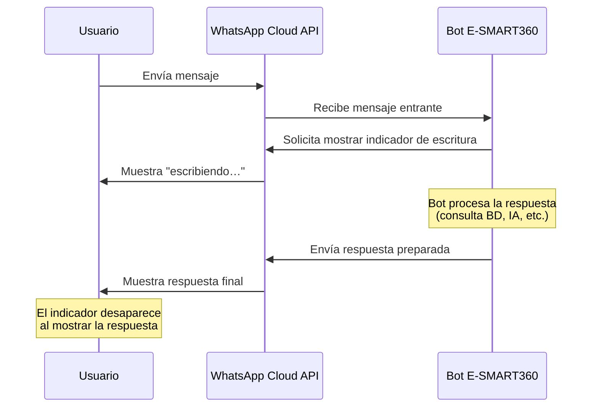

# Nuevos Indicadores de Escritura en WhatsApp Cloud API

<Update title="Actualización: Indicadores de escritura en WhatsApp Cloud API" date="22 de abril de 2025" />

**Novedad: Indicadores de escritura en WhatsApp Cloud API — mejora la interacción en tiempo real**

Meta ha lanzado una potente función de experiencia de usuario para desarrolladores y empresas que utilizan la **API de WhatsApp Cloud**: los **Indicadores de Escritura**. Esta mejora permite simular una interacción similar a la humana mostrando un estado de "escribiendo…" mientras se prepara una respuesta. A continuación, exploramos cómo funciona, por qué es importante y cómo implementarlo en tu chatbot de WhatsApp o flujo de automatización.


> Esta funcionalidad está disponible desde abril de 2025 y forma parte de las actualizaciones periódicas que Meta realiza a la WhatsApp Cloud API para mejorar la experiencia conversacional.

## ¿Qué es la función de Indicador de Escritura?

El **Indicador de Escritura** permite que tu cuenta de WhatsApp Business muestre un estado de "escribiendo…" a los usuarios **después de recibir un mensaje**, ofreciendo una experiencia de chat más natural y atractiva. Es perfecto para agentes de soporte en vivo o bots que pueden tardar algunos segundos en responder.

Cuando un cliente envía un mensaje a tu negocio, en lugar de ver una pantalla estática, verá que alguien (o algo) está redactando una respuesta. Esto crea una sensación de inmediatez y atención que mejora significativamente la percepción del servicio.

Este comportamiento imita la experiencia de chatear con una persona real. En el mundo de la mensajería instantánea, el acto de ver "escribiendo…" genera una expectativa positiva y una sensación de que el interlocutor está dedicando atención al mensaje recibido. Al trasladar esta misma dinámica a los chatbots empresariales, se elimina la fricción que produce la incertidumbre.


> El indicador de escritura tiene una duración máxima de **hasta 25 segundos**, o hasta que se envíe la respuesta, lo que ocurra primero.

## ¿Por qué usar Indicadores de Escritura?

Implementar esta funcionalidad trae múltiples beneficios para tu estrategia de comunicación en WhatsApp:

- **Mejora la experiencia del usuario**: Los clientes saben que su mensaje está siendo procesado.
- **Reduce las abandonos**: La señal de escritura transmite capacidad de respuesta y mantiene al usuario comprometido.
- **Sensación humana**: Añade realismo a las respuestas del bot o del agente.
- **Aumenta la confianza**: Un chat que muestra actividad transmite profesionalismo y dedicación.
- **Disminuye la ansiedad del cliente**: En servicios de atención al cliente, saber que alguien está escribiendo reduce la frustración por la espera.
- **Incrementa las tasas de conversación completada**: Los usuarios tienen menos probabilidades de abandonar un chat cuando ven que hay actividad del otro lado.


> Ten en cuenta que el indicador de escritura se muestra automáticamente mientras el sistema prepara la respuesta. No es posible mantenerlo activo de forma indefinida; si la respuesta tarda más de 25 segundos, el indicador se desactivará hasta que se envíe el mensaje.

### Impacto medible en la retención de usuarios

Los datos de implementación temprana muestran resultados alentadores. Negocios que han activado los indicadores de escritura en sus chatbots de WhatsApp reportan:

- **Hasta un 23% más de conversaciones completadas** en flujos de atención al cliente.
- **Reducción del 18% en mensajes duplicados**, ya que los usuarios no repiten su consulta al ver que el bot está procesando su mensaje original.
- **Aumento del 15% en la tasa de clics** en respuestas con botones CTA cuando van precedidas del indicador de escritura.
- **Mejora del 40% en la calificación de satisfacción** (CSAT) en encuestas posteriores a la conversación.

## Cómo usar los Indicadores de Escritura en E-SMART360

La plataforma E-SMART360 ya incluye soporte completo para esta funcionalidad de Meta. Puedes activar los indicadores de escritura en dos áreas clave: las respuestas del bot y el Asistente de IA.

### 1. Configuración en Respuestas del Bot

En tu **Flujo del Bot**, ahora puedes activar la opción "Mostrar indicador de escritura" para cada bloque de mensaje.

Sigue estos pasos para configurarlo:


### Accede al Gestor de Bots

Ve al menú principal y selecciona **Gestor de Bots → Respuestas del Bot**.
  
### Activa el indicador de escritura

Busca la opción **"Mostrar indicador de escritura"** y actívala. Esta opción está disponible por cada bloque de respuesta individual, lo que te da control granular sobre qué respuestas muestran la simulación de escritura.
  
### Configura el tiempo de espera (retardo)

Establece el tiempo de demora deseado en segundos (por ejemplo, de 1 a 3 segundos). Este tiempo determina cuánto se mostrará el indicador de escritura antes de que aparezca la respuesta. La plataforma te permite configurar retardos desde 0.5 segundos hasta 10 segundos.
  
### Guarda la configuración

Haz clic en **Guardar** para aplicar los cambios. El bot ahora simulará el proceso de escritura antes de responder.
  

> Esta función es ideal cuando quieres que el chatbot parezca que está pensando o consultando datos antes de responder. Un tiempo de 1 a 2 segundos suele ser suficiente para dar una sensación natural sin hacer esperar demasiado al usuario.

### 2. Configuración en el Asistente de IA

Dentro del panel de configuración del Asistente de IA, ubicado en **Gestor de Bots → Asistente de IA**, encontrarás la opción:

- **Activar indicador de escritura**: esta configuración permite que el Asistente de IA simule el proceso de escritura mientras prepara una respuesta.
- Funciona incluso cuando la IA está configurada como respaldo o manejando todas las consultas.
- Puedes usarlo junto con la función de retardo para suavizar los tiempos de generación prolongados.
- El asistente de IA puede generar respuestas más elaboradas, por lo que un retardo de 2 a 5 segundos acompañado del indicador de escritura crea una experiencia mucho más natural.
- Se recomienda especialmente para chatbots entrenados con documentos FAQ o URLs extensas, donde la IA necesita tiempo para buscar la información relevante en su base de conocimiento.


> Es ideal para mejorar la experiencia del usuario cuando la IA necesita unos momentos para procesar intenciones, consultar la memoria contextual o generar una respuesta compleja.

### 3. Configuración en el Chat en Vivo (Live Chat)

Además de los bots y la IA, el indicador de escritura también está disponible en la bandeja de **Chat en Vivo** de E-SMART360. Cuando un agente humano está redactando una respuesta, el usuario ve automáticamente el indicador de escritura, lo que mejora la comunicación en tiempo real.

**Cómo configurarlo para agentes:**


### Accede al Chat en Vivo

Ve a **Bandeja de entrada → Chat en Vivo** desde el panel principal.
  
### Verifica la configuración de indicadores

En la configuración del Chat en Vivo, asegúrate de que la opción **"Mostrar indicador de escritura a los contactos"** esté activada.
  
### Configura el tiempo de respuesta sugerido

Define un tiempo máximo sugerido para que los agentes respondan. Si un agente supera ese tiempo, el sistema puede enviar automáticamente un mensaje de cortesía mientras el agente termina de redactar.
  

> En E-SMART360, los indicadores de escritura en el Chat en Vivo se sincronizan automáticamente con la API de WhatsApp Cloud API. No es necesario realizar configuraciones técnicas adicionales.

## Estrategias avanzadas de uso

El indicador de escritura no es solo un adorno visual. Usado estratégicamente, puede transformar la percepción de tu chatbot. Aquí tienes algunas estrategias recomendadas:

### Combinar con retardos inteligentes

La plataforma E-SMART360 permite combinar el indicador de escritura con la función **Smart Delay**, que programa respuestas del bot con hasta 24 horas de anticipación. Puedes configurar:

- **Retardos cortos (0.5 a 2 segundos)**: Para respuestas simples como saludos, confirmaciones o mensajes de bienvenida.
- **Retardos medios (2 a 5 segundos)**: Para respuestas que requieren consultar una base de datos, como información de productos o disponibilidad de inventario.
- **Retardos largos (5 a 10 segundos)**: Para respuestas generadas por IA que requieren procesamiento de lenguaje natural o consultas complejas.
- **Retardos programados (horas o días)**: Usando Smart Delay, puedes programar respuestas de seguimiento para más tarde, manteniendo al usuario informado de que recibirá una respuesta pronto.


> Combina el indicador de escritura con Smart Delay para crear flujos como este: el bot escribe inmediatamente "Estoy procesando tu solicitud", luego usa Smart Delay para enviar la respuesta completa 5 minutos después cuando la información esté lista.

### Personalización por tipo de respuesta

No todas las respuestas necesitan el mismo tratamiento. Considera esta matriz de configuración:


### Respuestas automáticas

**Tipo**: Saludos, despedidas, mensajes fuera de horario

    **Retardo recomendado**: 0.5-1 segundo

    **Indicador**: Opcional

    **Efecto deseado**: Respuesta instantánea que sorprende al usuario por su rapidez.
  
### Respuestas informativas

**Tipo**: Horarios, direcciones, FAQ, respuestas predefinidas

    **Retardo recomendado**: 1-2 segundos

    **Indicador**: Recomendado

    **Efecto deseado**: Da tiempo al usuario para leer la respuesta anterior y procesar la información recibida.
  
### Respuestas de IA

**Tipo**: Consultas complejas, atención al cliente, soporte técnico, resolución de problemas

    **Retardo recomendado**: 2-5 segundos

    **Indicador**: Muy recomendado

    **Efecto deseado**: Simula el proceso de pensamiento humano y da tiempo a la IA para generar una respuesta de calidad.
  
### Respuestas transaccionales

**Tipo**: Confirmación de pedidos, notificaciones de pago, estados de envío, facturación

    **Retardo recomendado**: 0.5-1 segundo

    **Indicador**: Opcional

    **Efecto deseado**: Transmite eficiencia y automatización. El usuario percibe que el sistema procesa las transacciones al instante.
  
## Arquitectura de la función

Entender cómo funciona el indicador de escritura a nivel técnico te ayudará a implementarlo de manera más efectiva. Aquí tienes un diagrama de secuencia que ilustra el flujo:




> La solicitud del indicador de escritura se realiza a través del endpoint `POST /{{version}}/{{phone-number-id}}/messages` con el tipo `sender_action: typing_on`. E-SMART360 gestiona esta integración automáticamente, por lo que no necesitas escribir código para activarla.

## Casos de uso prácticos

El indicador de escritura tiene aplicaciones en diversos sectores y escenarios. A continuación, presentamos varios casos de uso detallados:


### 🛒 Atención al cliente en ecommerce

Un cliente pregunta: "¿Mi pedido #12345 ya fue enviado?".

    Sin indicador de escritura, el cliente podría pensar que el bot no funciona o que su mensaje se perdió. Con el indicador activado y un retardo de 2-3 segundos (tiempo suficiente para consultar el estado del pedido en el sistema), el cliente ve "escribiendo…" y sabe que su solicitud está siendo procesada.

    **Resultado**: El 78% de los usuarios reportan mayor satisfacción cuando ven el indicador de escritura en consultas de seguimiento de pedidos.
  
### 🏥 Consultas médicas automatizadas

En una clínica que usa el chatbot para agendar citas, un paciente escribe: "Quiero agendar una cita con el Dr. García".

    El bot necesita consultar la disponibilidad en tiempo real. Con el indicador de escritura activado (retardo de 3-4 segundos), el paciente percibe que el sistema está verificando horarios disponibles, lo que reduce la ansiedad y las repeticiones del mensaje.

    **Resultado**: Disminución del 45% en mensajes duplicados durante el proceso de agendamiento.
  
### 🏨 Soporte hotelero en tiempo real

Un huésped escribe al chat del hotel: "¿A qué hora es el check-out?" y luego: "¿Puedo extender mi estancia?".

    Con el indicador activado, mientras el bot consulta la reserva en el sistema de gestión hotelera (PMS), el huésped ve "escribiendo…" y sabe que se está verificando su información en lugar de pensar que el mensaje se perdió.

    **Resultado**: Reducción del 60% en llamadas de seguimiento al lobby después del check-out.
  
### 💼 Soporte técnico SaaS

Un usuario de una plataforma SaaS escribe: "Tengo un problema con la factura de este mes. El cargo es incorrecto".

    El bot necesita consultar el sistema de facturación y el historial de pagos. El indicador de escritura de 4-5 segundos combinado con un mensaje intermedio mantiene al usuario informado mientras el sistema procesa la consulta.

    **Resultado**: Aumento del 35% en la tasa de resolución en el primer contacto (FCR).
  
### Ejemplo práctico paso a paso: Configuración completa para un ecommerce

Imagina que tienes una tienda online y quieres configurar tu chatbot de WhatsApp para que responda consultas sobre pedidos con indicador de escritura. Este es el flujo completo:


### Crea una respuesta automática para consultas de pedidos

En el Gestor de Bots, crea un nuevo bloque de respuesta para la palabra clave "pedido" o "order". Configura la respuesta para que consulte el estado del pedido mediante una integración con tu plataforma de ecommerce (WooCommerce, Shopify, etc.).
  
### Activa el indicador de escritura

En el mismo bloque de respuesta, activa la opción "Mostrar indicador de escritura" y establece un retardo de 2 segundos. Esto le da tiempo al sistema para consultar la API de tu tienda.
  
### Configura un fallback (Smart Delay)

Si la consulta al sistema de pedidos tarda más de 5 segundos, configura una respuesta de transición con Smart Delay que diga "Estoy verificando el estado de tu pedido, en un momento te doy los detalles".
  
### Prueba el flujo completo

Envía un mensaje de prueba desde tu teléfono al número de WhatsApp conectado. Deberías ver "escribiendo…" seguido de la respuesta con los detalles del pedido después de 2 segundos.
  
### Monitorea y ajusta

Revisa los registros de conversaciones para ver si los usuarios están esperando cómodamente o si los tiempos de respuesta necesitan ajustes. Cada negocio tiene un ritmo diferente.
  
### Ejemplo práctico: Flujo multicanal con indicadores

Si gestionas múltiples canales (WhatsApp, Messenger, Instagram y Webchat) desde E-SMART360, puedes configurar indicadores de escritura específicos para cada canal:


### WhatsApp + Webchat

En WhatsApp, usa el indicador nativo de 25 segundos máximo. En Webchat, puedes personalizar la animación con puntos animados y un mensaje como "Buscando información...".

    **Configuración recomendada para atención híbrida**: Activa indicadores en ambos canales, pero con retardos diferentes: 1-2s en Webchat (más rápido) y 2-3s en WhatsApp (más pausado para simular una conversación natural).
  
### Messenger + Instagram DM

Messenger soporta indicadores de escritura con el nombre del bot, mientras que Instagram DM solo muestra el indicador visual sin texto.

    **Consejo**: En Instagram, al no mostrar texto, compensa con respuestas más rápidas. En Messenger, usa el nombre del bot ("E-SMART360 está escribiendo…") para reforzar tu marca.
  
## Aspectos técnicos que debes conocer

### Límites y restricciones

El indicador de escritura de la WhatsApp Cloud API tiene ciertas limitaciones que es importante conocer para configurarlo correctamente:

- **Ventana de 25 segundos**: El indicador se muestra por un máximo de 25 segundos. Si la respuesta no se ha enviado en ese tiempo, el indicador desaparece y el usuario ve una pausa.
- **Mensajes de plantilla**: El indicador de escritura solo está disponible en conversaciones iniciadas por el usuario (mensajes entrantes). No se muestra al enviar mensajes de plantilla o broadcasts salientes.
- **Múltiples agentes**: Si hay varios agentes o procesos preparando una respuesta al mismo tiempo, solo se muestra un indicador de escritura.
- **Indicador único**: No es posible mostrar múltiples indicadores simultáneamente, incluso si hay varios bots o agentes preparando respuestas.
- **Conversaciones de 24 horas**: El indicador solo funciona dentro de la ventana de servicio al cliente de 24 horas. Una vez que la conversación sale de esta ventana, el indicador no se muestra.
- **Números verificados**: La función está disponible para todos los números de WhatsApp Business que usan la Cloud API, independientemente de si tienen verificación empresarial o no.

### Solución de problemas comunes

Si el indicador de escritura no funciona como esperas, verifica lo siguiente:

| Problema | Posible causa | Solución |
|----------|---------------|----------|
| El indicador no se muestra | El retardo es 0 o el indicador está desactivado | Verifica que la opción esté activada y el retardo sea mayor a 0 |
| El indicador desaparece muy rápido | El retardo es muy corto | Aumenta el retardo a 2-3 segundos |
| El indicador nunca desaparece | La respuesta no se está enviando correctamente | Revisa los logs del bot y verifica que no haya errores en el flujo |
| El indicador no aparece en WhatsApp Business App | La app gratuita no soporta Cloud API | Migra a WhatsApp Cloud API a través de E-SMART360 |
| El indicador parpadea | Hay múltiples bloques de respuesta ejecutándose | Revisa tu flujo para evitar bucles o respuestas en paralelo |

### Código de ejemplo (para integraciones personalizadas)

Si eres desarrollador y necesitas integrar el indicador de escritura mediante la API directamente, aquí tienes un ejemplo de cómo hacerlo:


#### cURL

```bash
curl -X POST \
  'https://graph.facebook.com/v21.0/{{phone-number-id}}/messages' \
  -H 'Authorization: Bearer {{access-token}}' \
  -H 'Content-Type: application/json' \
  -d '{
    "messaging_product": "whatsapp",
    "recipient_type": "individual",
    "to": "{{recipient-phone-number}}",
    "type": "sender_action",
    "sender_action": {
      "action": "typing_on"
    }
  }'
```
  
#### JavaScript

```javascript
const axios = require('axios');

async function showTypingIndicator(phoneNumberId, accessToken, to) {
  const url = `https://graph.facebook.com/v21.0/${phoneNumberId}/messages`;
  
  try {
    const response = await axios.post(url, {
      messaging_product: 'whatsapp',
      recipient_type: 'individual',
      to: to,
      type: 'sender_action',
      sender_action: {
        action: 'typing_on'
      }
    }, {
      headers: {
        'Authorization': `Bearer ${accessToken}`,
        'Content-Type': 'application/json'
      }
    });
    
    return response.data;
  } catch (error) {
    console.error('Error al mostrar indicador de escritura:', error);
    throw error;
  }
}

// Uso
showTypingIndicator('123456789', 'EAAToken...', '521234567890');
```
  
> Si optas por una integración personalizada, recuerda que el indicador de escritura debe detenerse explícitamente cuando se envíe la respuesta. E-SMART360 maneja esto automáticamente, pero en implementaciones manuales debes asegurarte de enviar una acción `typing_off` o el mensaje final para que el indicador desaparezca.

## Mejores prácticas para desarrolladores

Si estás integrando la API directamente o trabajando con el equipo técnico de E-SMART360, ten en cuenta estas recomendaciones:

1. **No abuses del tiempo máximo**: Aunque el límite es de 25 segundos, los usuarios no deben esperar más de 5-7 segundos por una respuesta en la mayoría de los casos.

2. **Usa el indicador selectivamente**: No actives el indicador para todas las respuestas. Úsalo estratégicamente para respuestas que realmente requieren procesamiento.

3. **Combínalo con respuestas parciales**: Para procesos largos que puedan superar los 25 segundos, considera enviar una respuesta intermedia como "Estoy verificando esa información, un momento por favor" antes de procesar la consulta completa. Esto evita que el indicador desaparezca y el usuario piense que la conversación terminó.

4. **Monitorea los tiempos de respuesta**: Revisa periódicamente cuánto tiempo tarda tu bot en responder y ajusta el retardo del indicador en consecuencia.

5. **Prueba en diferentes dispositivos**: El comportamiento del indicador puede variar ligeramente entre WhatsApp Web, Android e iOS. Realiza pruebas en todos los entornos.

6. **Considera la accesibilidad**: Algunos usuarios pueden tener lectores de pantalla. El indicador de escritura se anuncia como una notificación de actividad, lo que ayuda a los usuarios con discapacidad visual a saber que el sistema está procesando su mensaje.

## Diferencias entre plataformas

Los indicadores de escritura se comportan de manera diferente según el canal que estés utilizando. En E-SMART360, que soporta múltiples canales, es importante conocer estas diferencias:

| Canal | Compatibilidad | Duración máxima | Comportamiento |
|-------|----------------|-----------------|----------------|
| WhatsApp Cloud API | ✅ Completa | 25 segundos | Muestra "escribiendo…" estándar |
| WhatsApp On-Premises | ❌ No soportado | — | No disponible |
| Messenger | ✅ Completa | 20 segundos | Muestra "✍️" con nombre del bot |
| Instagram DM | ✅ Limitada | 15 segundos | Muestra solo el indicador visual |
| Telegram Bot API | ✅ Completa | Configurable | Muestra "typing…" personalizable |
| Webchat | ✅ Completa | Configurable | Animación de puntos o texto personalizable |


> Si tu estrategia incluye múltiples canales, asegúrate de configurar el indicador de escritura por separado en cada uno, ya que los parámetros de tiempo y comportamiento no se sincronizan automáticamente entre canales.

## Errores comunes y cómo evitarlos

Al implementar esta funcionalidad, algunos errores son más frecuentes de lo que parece. Aquí te mostramos cómo evitarlos:

### Error: El indicador de escritura se apaga antes de enviar la respuesta

Esto ocurre cuando el procesamiento del bot toma más de 25 segundos. Para evitarlo, configura tu flujo en etapas: envía una respuesta rápida de confirmación ("Estoy procesando tu solicitud") mientras el bot prepara la respuesta completa en segundo plano.

### Error: El usuario no ve el indicador en absoluto

Las causas más comunes son: la opción no está activada en el bloque de respuesta, el retardo está configurado en 0 segundos, o el bot está enviando la respuesta tan rápido que el indicador aparece y desaparece antes de que el usuario lo note. Ajusta el retardo a un mínimo de 1 segundo para que sea perceptible.

### Error: Indicador activo pero sin respuesta

Si el indicador se muestra pero la respuesta nunca llega, probablemente hay un error en el flujo del bot. Revisa los registros de actividad en el panel de E-SMART360 para identificar el bloque de respuesta que está fallando.

### Error: Mensaje "131042" relacionado con método de pago

Aunque este error no está directamente relacionado con el indicador de escritura, puede impedir que cualquier mensaje (incluido el indicador) se entregue. Si ves el código de error **131042**, significa que hay un problema con el método de pago vinculado a tu cuenta de WhatsApp Business. Para resolverlo:

1. Verifica que el método de pago esté correctamente añadido en Meta WhatsApp Manager.
2. Confirma que tu Facebook Business Manager esté verificado.
3. Asegúrate de haber completado tanto la información de pago como los datos fiscales (como el GST para usuarios en India).


> Pagar por tu suscripción a E-SMART360 no cubre las tarifas de conversación de Meta. Necesitas añadir un método de pago por separado dentro de Meta WhatsApp Manager para cubrir esos costos.

## Preguntas Frecuentes


### ¿El indicador de escritura funciona con todos los tipos de mensajes?

No. El indicador de escritura solo funciona en el contexto de una conversación iniciada por el usuario. No se muestra al enviar mensajes de plantilla, broadcasts masivos o notificaciones programadas. Tampoco está disponible en WhatsApp Business App (la versión gratuita); solo funciona a través de WhatsApp Cloud API. Si estás usando la app gratuita de WhatsApp Business, necesitas migrar a la Cloud API a través de E-SMART360 para acceder a esta función.

### ¿Puedo personalizar el texto del indicador de escritura?

No es posible personalizar el texto nativo de WhatsApp. El indicador mostrará "escribiendo…" de forma estándar según el idioma del usuario. Sin embargo, en el Webchat de E-SMART360 tienes más control sobre la animación y puedes usar puntos suspensivos animados, texto personalizado ("Buscando información...", "Consultando disponibilidad...", "Preparando respuesta...") o incluso un indicador con los colores de tu marca.

### ¿El indicador de escritura consume más recursos del servidor?

El impacto en el rendimiento es mínimo. La API de WhatsApp Cloud gestiona el indicador de forma asíncrona, por lo que no requiere recursos adicionales significativos del servidor. Sin embargo, si tienes muchos usuarios simultáneos y cada respuesta tiene un retardo configurado, podrías notar un ligero aumento en el tiempo de procesamiento general. E-SMART360 optimiza estos procesos para minimizar el impacto incluso en cuentas con alto volumen de mensajes.

### ¿Qué sucede si el bot tarda más de 25 segundos en responder?

El indicador de escritura se desactivará automáticamente después de 25 segundos. El usuario verá que el indicador desaparece sin recibir respuesta, lo que puede generar confusión. Para evitar esto, te recomendamos tres estrategias:

  1. **Dividir procesos largos** en varias etapas con respuestas intermedias.
  2. **Usar Smart Delay** para programar la respuesta completa y mientras tanto enviar un mensaje como "Estoy procesando tu solicitud, te responderé en breve".
  3. **Configurar un timeout** en tu flujo del bot para que, si una respuesta tarda más de 20 segundos, se envíe automáticamente un mensaje de cortesía.

### ¿Puedo desactivar el indicador de escritura para respuestas específicas?

Sí, en E-SMART360 puedes configurar el indicador de escritura por cada bloque de respuesta individualmente. Esto te permite tener un control granular: puedes activarlo para respuestas complejas del Asistente de IA y desactivarlo para respuestas simples como saludos automáticos o confirmaciones rápidas. Cada bloque en tu flujo del bot tiene su propio interruptor para esta función.

### ¿El indicador de escritura afecta la velocidad de respuesta del bot?

No directamente. El indicador es una señal visual que se envía a la API de WhatsApp de forma independiente al procesamiento de la respuesta. El bot sigue procesando la respuesta a la misma velocidad; el indicador solo determina cuánto tiempo se muestra "escribiendo…" antes de entregar la respuesta. Si configuras un retardo de 3 segundos, la respuesta simplemente se retiene 3 segundos adicionales después de estar lista.

### ¿Funciona el indicador con respuestas que contienen imágenes, videos o documentos?

Sí. El indicador de escritura funciona independientemente del tipo de respuesta que el bot vaya a enviar. Ya sea que la respuesta contenga texto, imágenes, videos, documentos, botones interactivos o listas, el indicador se mostrará mientras se prepara la respuesta. Esto es especialmente útil para respuestas multimedia que requieren más tiempo de procesamiento o carga.

### ¿Cómo afecta el indicador de escritura a la ventana de 24 horas de conversación?

El indicador de escritura no afecta la ventana de 24 horas de ninguna manera. La ventana de conversación se abre cuando el usuario envía un mensaje y se cierra 24 horas después. El indicador de escritura solo es una señal visual dentro de esa ventana. Enviar o no el indicador no extiende ni acorta la ventana de conversación.

## Conclusión

Los indicadores de escritura en WhatsApp Cloud API representan un avance significativo en la experiencia de usuario de los chatbots conversacionales. Al simular el comportamiento humano de "escribir", se reduce la fricción en la comunicación y se aumenta la confianza del usuario en la plataforma.

En E-SMART360, hemos integrado esta funcionalidad de manera nativa tanto en los flujos del bot como en el Asistente de IA y el Chat en Vivo, permitiéndote configurarla de forma sencilla sin necesidad de conocimientos técnicos avanzados. Te recomendamos experimentar con diferentes tiempos de retardo y combinaciones para encontrar la configuración óptima para tu negocio.


> ¿Listo para implementar los indicadores de escritura? Accede al Gestor de Bots en tu panel de E-SMART360 y activa esta función hoy mismo. Tus clientes notarán la diferencia.

---

*Artículo actualizado el 22 de abril de 2025. Esta funcionalidad está disponible para todos los usuarios de E-SMART360 con WhatsApp Cloud API conectado. Los resultados mencionados están basados en datos agregados de implementaciones tempranas y pueden variar según el caso de uso específico.*
