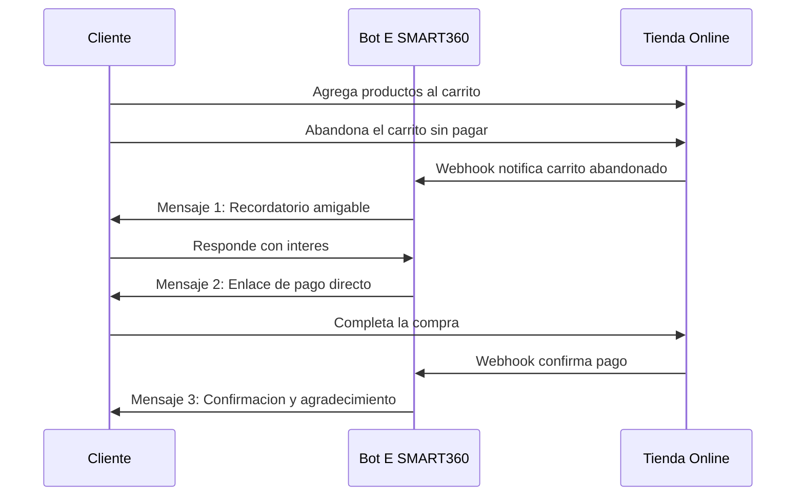

# API de WhatsApp Business: Eleva la Interacción con tus Clientes

<Update title="Actualización" date="31 Mar 2026" />


> WhatsApp, con sus más de 2 mil millones de usuarios activos mensuales, se ha convertido en la plataforma de mensajería más grande del mundo. La API de WhatsApp Business (WABA API) permite a las empresas de todos los tamaños aprovechar esta plataforma para comunicarse de manera efectiva con sus clientes, construir confianza y aumentar las ventas. Con E-SMART360, puedes integrar toda esta potencia en flujos de automatización sin complicaciones.

## ¿Qué es la API de WhatsApp Business?

WhatsApp Business y la API de WhatsApp Business están diseñadas a la medida para los negocios actuales. Ambas ofrecen una amplia gama de herramientas para conectar con los clientes de manera efectiva. Ambas plataformas priorizan la seguridad, contando con el cifrado de extremo a extremo característico de WhatsApp.

En términos simples, la API de WABA permite a las empresas:

- **Generar Confianza:** Fortalecer la confianza del cliente y mejorar la lealtad hacia la marca.
- **Comunicación en Tiempo Real:** Interactuar al instante con los clientes, ofreciendo soporte personalizado.
- **Plataforma Segura:** Proporcionar un espacio seguro para que empresas y clientes se comuniquen.


### 📊 Alcance Global

Más de 2 mil millones de usuarios activos mensuales en todo el mundo. WhatsApp es la plataforma de mensajería líder a nivel global.

### 📈 Tasa de Apertura

Los mensajes de texto de WhatsApp tienen una tasa de apertura del 98%, superando ampliamente al correo electrónico y otros canales.

## Cómo WhatsApp Mejora la Interacción con los Clientes

WhatsApp ofrece dos tipos de cuentas para las empresas: la cuenta business regular, equipada con saludos automatizados y mensajes de ausencia, ideal para empresas pequeñas; y la API de WhatsApp Business, más robusta, diseñada para empresas más grandes. La API soporta múltiples usuarios y permite esfuerzos de marketing y servicio al cliente, permitiendo a las empresas crear bots de WhatsApp para una mejor interacción.


> Ambas opciones permiten a las empresas conectarse con su audiencia de manera personal. La API, en particular, ofrece opciones de mensajería abierta para enviar mensajes ilimitados y gratuitos en varios formatos, además de funciones de automatización para proporcionar respuestas oportunas a los clientes.

### Métricas y Análisis

La API también proporciona métricas valiosas, como análisis de entrega de mensajes y gasto total en mensajes, lo que permite a las empresas conectarse eficientemente con los clientes a un costo razonable.


> Con E-SMART360 puedes monitorear en tiempo real las siguientes métricas clave:
- **Tasa de entrega:** Porcentaje de mensajes que llegan exitosamente a tus clientes.
- **Tasa de apertura:** Cuántos clientes abren y leen tus mensajes.
- **Tasa de respuesta:** Cuántos clientes interactúan con tus campañas.
- **Costo por conversación:** Desglose detallado de gastos por tipo de conversación.
- **Volumen de mensajes:** Número total de mensajes enviados en un período determinado.

## Usa el Marketing de WhatsApp para Hacer Felices a los Clientes y Aumentar las Ventas

Frente a la creciente competencia en la industria, las empresas deben adoptar proactivamente técnicas de marketing de vanguardia para involucrar a su audiencia objetivo de manera efectiva. El marketing empresarial de WhatsApp, cada vez más popular en los últimos años, permite a las marcas conectarse con una amplia audiencia, cultivar relaciones sólidas y mejorar su potencial de ventas.

WhatsApp es actualmente la plataforma de mensajería más popular del mundo. Tiene más de mil millones de usuarios activos, lo que la convierte en una herramienta imprescindible para las empresas que desean conectarse con su audiencia a nivel personal. Como más de la mitad de las personas que usan los servicios de mensajería de WhatsApp revisan su aplicación todos los días, las marcas pueden asegurarse de que la audiencia objetivo recibirá sus ofertas a través de la plataforma.


### Tasa de Apertura

Los mensajes de texto en WhatsApp tienen una tasa de apertura del 98%, comparada con el 20-30% del correo electrónico. Esto significa que prácticamente todos tus clientes verán tu mensaje.

### Retorno de Inversión

Las campañas en WhatsApp generan un retorno de inversión significativamente mayor que otros canales, gracias a su alcance directo y personalizado.

### Engagement

Los usuarios interactúan con las marcas en WhatsApp 3 veces más que en cualquier otra plataforma de mensajería.

### Estrategias de Marketing Efectivas en WhatsApp

Para maximizar el impacto de tus campañas, considera estas estrategias probadas:


### Segmenta tu Audiencia

Agrupa a tus clientes por intereses, historial de compras y comportamiento. Los mensajes segmentados tienen hasta un 40% más de conversión que los mensajes masivos no segmentados.

### Personaliza tus Mensajes

Usa el nombre del cliente y recomendaciones basadas en compras anteriores. La personalización aumenta significativamente las tasas de respuesta.

### Automatiza con Bots Inteligentes

Configura chatbots con E-SMART360 para manejar preguntas frecuentes y calificar leads automáticamente. Responde al instante, incluso fuera del horario laboral.

### Mide y Optimiza

Revisa las métricas de entrega, tasas de apertura y respuestas. Ajusta tus campañas basándote en los datos para mejorar continuamente los resultados.

## Haz Crecer tu Negocio de E-commerce con Chatbots de WhatsApp: Genera Leads Efectivamente

En el mundo del comercio minorista, las preguntas repetitivas de los clientes pueden abrumar a tu personal, ya sea que manejes una marca de e-commerce, una tienda física, o ambas. Pero hay una solución: los chatbots de WhatsApp. Estos asistentes automatizados manejan consultas comunes, ahorrando tiempo y esfuerzo a tu equipo de soporte.

Con la API Business de WhatsApp, la comunicación se vuelve fluida. Puedes usar mensajes plantilla para involucrar a los clientes o responder directamente a sus mensajes de sesión. Las empresas de e-commerce encuentran estos chatbots invaluables, no solo para responder preguntas, sino también para convertir leads en clientes. Además, puedes compartir información adicional, mejorando la interacción con los clientes y aligerando la carga de tu equipo de soporte.

Los casos de uso más comunes de mensajes plantilla para una marca minorista incluyen:


### 🛒 Ofertas

Ofertas y promociones relevantes para cada cliente según su historial.

### 📦 Stock

Recordatorios de productos que han vuelto a estar disponibles.

### 🚀 Nuevos Lanzamientos

Presentaciones de nuevos productos relevantes basados en compras anteriores.

### 🎯 Recomendaciones

Recomendaciones de productos basadas en compras recientes.

### 🛍️ Carrito Abandonado

Recordatorios de carritos abandonados para recuperar ventas perdidas.

### 📊 Soporte

Apoyo a tus funciones de marketing minorista con mensajes automatizados.

Los mensajes plantilla son mensajes pre-aprobados que permiten tanto la comunicación entrante como saliente con los clientes. Son esenciales para iniciar conversaciones cuando el cliente no ha enviado un mensaje recientemente.

## API de WhatsApp Business en E-SMART360 para una Mejor Atención al Cliente

La API de WhatsApp Business en E-SMART360 permite a las empresas integrar las capacidades de mensajería de WhatsApp sin problemas en sus flujos de automatización. Al aprovechar la API de WhatsApp Business, E-SMART360 empodera a las empresas para interactuar con sus clientes en WhatsApp, habilitando conversaciones automatizadas, transmisión de mensajes y experiencias de chat interactivas.

### Características y Funcionalidades Clave


### Conversaciones Automatizadas

E-SMART360 utiliza la API de WhatsApp Business para automatizar conversaciones con los clientes. Esto permite a las empresas manejar preguntas frecuentes, proporcionar respuestas instantáneas y ofrecer soporte al cliente 24/7 sin intervención humana.

### Transmisión de Mensajes

Las empresas pueden enviar mensajes masivos a sus clientes usando la API de WhatsApp Business. Esta función es particularmente útil para campañas de marketing, promociones y anuncios importantes. Los mensajes pueden segmentarse a grupos específicos de clientes para una comunicación personalizada.

### Experiencias Interactivas

E-SMART360 permite crear experiencias de chat interactivas a través de WhatsApp. Las empresas pueden diseñar menús interactivos, recopilar comentarios de clientes, realizar encuestas y facilitar transacciones directamente dentro de la interfaz de chat. Esto mejora el compromiso y la satisfacción del cliente.

### Notificaciones de Pedidos

E-SMART360 puede usar la API de WhatsApp Business para enviar notificaciones de pedidos, actualizaciones de entrega y confirmaciones de transacciones a los clientes en tiempo real. Esta comunicación mantiene a los clientes informados sobre sus compras y mejora su experiencia general de compra.

### Integración Multicanal

E-SMART360 integra la mensajería de WhatsApp sin problemas con otros canales de comunicación. Esta integración garantiza una experiencia del cliente unificada y consistente en múltiples plataformas, incluyendo redes sociales, correo electrónico y chat web.

### Seguridad y Cumplimiento

E-SMART360 garantiza que las interacciones a través de la API de WhatsApp Business sean seguras y cumplan con las políticas y regulaciones de WhatsApp. Esto incluye protección de datos, cifrado y adherencia a las regulaciones de suscripción y baja.

> E-SMART360 también proporciona funciones de análisis e informes para las interacciones de WhatsApp. Las empresas pueden realizar un seguimiento de la entrega de mensajes, tasas de apertura, respuestas de clientes y otras métricas para medir la efectividad de sus campañas de marketing en WhatsApp.

## Entendiendo los Tipos de Conversaciones en WhatsApp

En WhatsApp, las conversaciones se refieren a hilos de mensajes de 24 horas entre tu negocio y tus clientes, conocido como la ventana de servicio al cliente. Estas conversaciones se abren y se cobran cuando los mensajes son entregados. Es fundamental comprender los diferentes tipos de conversaciones para gestionar correctamente los costos y cumplir con las políticas de WhatsApp.

```mermaid
graph TD
    A[Cliente envía mensaje] --> B[Se abre ventana de 24 horas]
    B --> C{¿Qué tipo de<br/>mensaje envías?}
    C -->|Marketing| D[Conversación de Marketing - Costo]
    C -->|Utilidad| E[Conversación de Utilidad - Costo reducido]
    C -->|Servicio| F[Conversación de Servicio - Sin costo]
    C -->|Autenticación| G[Conversación de Autenticación - Costo reducido]
    D --> H[¿Cambiaste de tipo?]
    E --> H
    F --> I[24h gratis, luego usa plantilla]
    H -->|Sí| J[Nuevo cargo por conversación]
    H -->|No| K[Mismo cargo, mensajes ilimitados]
    style A fill:#e1f5fe,stroke:#01579b
    style F fill:#e8f5e9,stroke:#2e7d32
    style J fill:#ffebee,stroke:#c62828
``` Estas conversaciones se abren y se cobran cuando los mensajes son entregados. Meta clasifica las conversaciones en tres tipos principales:

### 1. Conversaciones de Marketing

Son conversaciones iniciadas por el negocio con el objetivo de promocionar productos o servicios entre clientes que han optado por recibir comunicaciones. Cualquier mensaje iniciado por el negocio que no califique como de servicio o utilidad cae en esta categoría.

**Ejemplo:** Tienes una promoción especial o el lanzamiento de un nuevo producto. Enviar un mensaje plantilla de marketing aprobado a través de E-SMART360 iniciará una Conversación de Marketing.

### 2. Conversaciones de Utilidad

Son conversaciones iniciadas por el negocio que proporcionan actualizaciones transaccionales esenciales, como confirmaciones de compra o recordatorios de facturación, a clientes que han optado por recibirlas.

**Ejemplo:** Un cliente realiza un pedido y tú envías una actualización de entrega o un mensaje de confirmación. Esto inicia una Conversación de Utilidad.

### 3. Conversaciones de Servicio

Son conversaciones iniciadas por el usuario, típicamente utilizadas para responder a consultas o inquietudes de los clientes dentro de la ventana de servicio de 24 horas.

**Ejemplo:** Un cliente envía un mensaje a tu negocio con una consulta sobre un producto. Si respondes dentro de 24 horas con un mensaje de formato libre y no hay una conversación abierta existente, se inicia una Conversación de Servicio.


> **Regla de Facturación:** Los cargos se aplican cuando comienza una conversación. Los mensajes múltiples enviados dentro de la misma ventana de conversación no incurren en costos adicionales. Sin embargo, enviar un mensaje de una categoría de conversación diferente en una conversación activa inicia un nuevo cargo bajo la categoría correspondiente.

### Regla de las 24 Horas: Lo que Necesitas Saber

WhatsApp tiene una regla que controla cómo las empresas pueden enviar mensajes a los clientes. Esta regla ayuda a proteger a los usuarios del spam y mantiene los chats útiles y relevantes.

**¿Qué es la regla de las 24 horas?** Cuando un cliente envía un mensaje a una empresa, esta tiene 24 horas para responder con cualquier mensaje que desee. Durante esta ventana, la empresa puede enviar mensajes de formato libre (sin necesidad de plantillas) y responder preguntas, resolver problemas o proporcionar información adicional de manera natural.

Después de 24 horas, la empresa no puede enviar mensajes normales a menos que utilice una plantilla de mensaje aprobada por WhatsApp. Esto significa que si necesitas iniciar una conversación proactivamente o hacer un seguimiento después de que la ventana haya expirado, debes usar una plantilla pre-aprobada que corresponda a la categoría adecuada (marketing, utilidad o autenticación).


### ✅ ¿Por qué existe esta regla?

- Protege la privacidad de los usuarios
- Fomenta respuestas rápidas por parte de las empresas
- Ayuda a las empresas a cumplir con las políticas de WhatsApp

### ⏰ ¿Qué pasa después de 24 horas?

- Solo puedes usar plantillas de mensajes pre-aprobadas
- Ejemplos: actualizaciones de pedidos, recordatorios, seguimiento de soporte
- Con E-SMART360 puedes programar estas plantillas fácilmente

### ¿Cómo te ayuda E-SMART360 a cumplir la regla de 24 horas?

E-SMART360 facilita el cumplimiento de la regla de 24 horas de las siguientes maneras:

- **Cuenta regresiva visible:** Muestra cuánto tiempo queda antes de que se cierre la ventana de 24 horas.
- **Alertas automáticas:** Recibe recordatorios antes de que la ventana expire.
- **Soporte de plantillas:** Envía fácilmente mensajes aprobados después de las 24 horas.
- **Creación de plantillas:** Personaliza mensajes para mantener las conversaciones activas.

### ¿Qué Sucede si Envías Múltiples Tipos de Plantilla en la Misma Ventana de 24 Horas?

Si se envía una plantilla de una categoría diferente durante una conversación activa, se abrirá una nueva conversación y se cobrará por separado. Por ejemplo:

- Si se envía una Plantilla de Utilidad en una Conversación de Servicio activa, comenzará una Conversación de Utilidad separada, con duración de 24 horas desde el momento en que se entregue la plantilla.
- Si se envía una Plantilla de Utilidad dentro de una Conversación de Utilidad ya abierta, no se aplica ningún cargo nuevo.


> **Importante:** Gestionar correctamente los tipos de conversación es clave para optimizar tus costos de mensajería en WhatsApp. Con E-SMART360, tienes visibilidad completa de cada tipo de conversación y sus costos asociados.

## Tipos de Mensajes en la API de WhatsApp

Existen 3 tipos diferentes de mensajes en WhatsApp que debes conocer:

### 1. Mensajes Entrantes

Cualquier mensaje que tu cliente te envía es un mensaje entrante. Cada vez que recibes un mensaje entrante, WhatsApp te da 24 horas para responder a ese mensaje del cliente. Esta ventana de 24 horas se llama la ventana de servicio al cliente.

### 2. Mensajes Salientes

Cualquier mensaje que envías a los clientes dentro de la ventana de servicio al cliente de 24 horas es un mensaje saliente. Es importante destacar que la ventana de 24 horas se reinicia cada vez que tu cliente te envía un mensaje. Es decir, obtienes una nueva ventana de 24 horas para responder cada vez que un cliente te envía un mensaje.

### 3. Mensajes Plantilla

Para iniciar una nueva conversación con un cliente o responder a un mensaje entrante fuera de la ventana de 24 horas, necesitarás usar un mensaje plantilla pre-aprobado.


### Ejemplo práctico: Flujo completo de mensajes

**Escenario:** Un cliente te escribe a las 10:00 AM preguntando por el estado de su pedido.

1. **Mensaje entrante:** El cliente pregunta "¿Cuándo llega mi pedido #1234?"
2. **Ventana de 24 horas:** Se abre a las 10:00 AM. Tienes hasta las 10:00 AM del día siguiente para responder libremente.
3. **Mensaje saliente:** Respondes a las 10:15 AM: "¡Hola Juan! Tu pedido #1234 salió hoy y llegará mañana."
4. **Reinicio de ventana:** Si Juan responde "Gracias" a las 4:00 PM, se reinicia la ventana. Ahora tienes hasta las 4:00 PM del día siguiente.
5. **Fuera de ventana:** Si necesitas contactar a Juan después de que la ventana expire, deberás usar una plantilla de mensaje aprobada, como "Recordatorio: Tu garantía está por vencer, contáctanos para renovarla."

## Niveles de Mensajería en WhatsApp

Los niveles de mensajería de WhatsApp ayudan a las empresas a gestionar su alcance de comunicación. Piensa en estos niveles como diferentes categorías de membresía que determinan cuántos usuarios únicos puedes contactar en un período de 24 horas.

### Desglose de Niveles de Mensajería

| Nivel | Límite | Ideal para |
|-------|--------|------------|
| **Nivel 1** | 1,000 números únicos por 24 horas | Pequeñas empresas y campañas iniciales |
| **Nivel 2** | 10,000 números únicos por 24 horas | Negocios en expansión |
| **Nivel 3** | 100,000 números únicos por 24 horas | Negocios medianos a grandes |
| **Nivel 4** | Ilimitado (limitado por SLA) | Grandes volúmenes de comunicación |


> **Cómo subir de nivel:**
1. Mantén interacciones de alta calidad con tus mensajes. WhatsApp evalúa la calidad basándose en cómo los usuarios interactúan con tus mensajes: si los bloquean o marcan como spam, tu calidad se reduce.
2. Usa consistentemente la capacidad de tu nivel actual. Si solo usas el 10% de tu límite, WhatsApp no tiene motivos para aumentarlo.
3. Demuestra compromiso y valor para tus usuarios. Los mensajes relevantes y útiles generan más respuestas positivas.
4. Los mensajes que responden a conversaciones iniciadas por usuarios no cuentan para el límite, así que incentiva a tus clientes a iniciar conversaciones.

> **Puntos clave sobre los niveles de mensajería:**
- El límite se aplica a **usuarios únicos**, no al número total de mensajes. Puedes enviar múltiples mensajes al mismo usuario sin consumir más de su cupo.
- Las excepciones incluyen mensajes que responden a conversaciones iniciadas por usuarios. Estos no cuentan para el límite.
- Todos los negocios nuevos comienzan en el Nivel 1 por defecto. Con el tiempo y el uso consistente, puedes escalar.
- El límite se calcula sobre una ventana móvil de 24 horas. No es un límite diario fijo, sino un período continuo.


### ¿Cómo funciona la ventana móvil de 24 horas para los niveles?

El límite de mensajería se mide en una ventana móvil de 24 horas, no en un día calendario. Esto significa que:

- Si envías un mensaje a 500 usuarios a las 9:00 AM del lunes, esos 500 usuarios cuentan para tu límite hasta las 9:00 AM del martes.
- A las 9:01 AM del martes, esos 500 usuarios se liberan y puedes contactar a otros 500 (si tu nivel lo permite).
- Esto hace que la gestión sea más dinámica: puedes planificar campañas en diferentes horas del día para maximizar el uso de tu nivel.
- E-SMART360 te muestra en tiempo real cuántos usuarios únicos has contactado en las últimas 24 horas.

## Comparativa: WhatsApp Business API vs Canales Tradicionales

Para entender verdaderamente el valor de WhatsApp Business API, comparemos sus métricas con los canales de comunicación tradicionales:


### 📧 Email Marketing

- Tasa de apertura: 20-30%
- Tasa de clics: 2-5%
- Entrega en bandeja principal: 85%
- Costo por contacto: Bajo
- Inmediatez: Baja

### 💬 SMS Marketing

- Tasa de apertura: 90-95%
- Tasa de clics: 8-15%
- Entrega: 98%
- Costo por contacto: Alto
- Inmediatez: Alta

### 📱 WhatsApp Business API

- Tasa de apertura: 98%
- Tasa de clics: 35-60%
- Entrega: 99%+
- Costo por contacto: Medio
- Inmediatez: Muy alta

### 🔔 Notificaciones Push

- Tasa de apertura: 40-60%
- Tasa de clics: 5-10%
- Entrega: 90%
- Costo por contacto: Muy bajo
- Inmediatez: Alta

Como puedes ver, WhatsApp Business API ofrece la combinación más equilibrada de alta tasa de apertura, excelente entrega y alta inmediatez, todo a un costo competitivo.

## Configuración de la API de WhatsApp con E-SMART360

Facebook ha abierto la API de WhatsApp Cloud para uso global, permitiendo el marketing seguro de chat de WhatsApp a través de E-SMART360. Para integrar WhatsApp Cloud API con E-SMART360, sigue estos pasos:


### Crea una Aplicación

Ve a Facebook Developer y haz clic en el botón "Create App". Selecciona "Business" como tipo de aplicación, proporciona información básica como nombre y correo de contacto. Agrega WhatsApp a la aplicación y obtén el ID de la Cuenta de WhatsApp Business.

### Agrega Número de Teléfono

Proporciona los detalles del negocio como nombre comercial, zona horaria y categoría. Verifica tu número de teléfono mediante mensaje de texto o llamada.

### Configura el Webhook

Configura una URL de callback y un token de verificación en la sección de Configuración de Facebook Developer, usando los detalles proporcionados por E-SMART360. Suscríbete al campo de webhook de Mensajes.

### Obtén el Token de Acceso

Navega a la página de Configuración de Negocio, crea un usuario del sistema y asigna activos (seleccionando aplicaciones y permisos). Genera un token de acceso para la gestión empresarial, mensajería de WhatsApp Business y gestión de WhatsApp Business. Copia y guarda el token de acceso.

### Conecta el Bot de WhatsApp a E-SMART360

Ingresa el ID de la Cuenta de WhatsApp Business y el token de acceso en la sección de WhatsApp de E-SMART360. Haz clic en "Conectar" para establecer la conexión.


> **Prerrequisitos importantes antes de comenzar:**
- Debes tener una cuenta activa en Facebook Business Manager.
- Tu negocio debe estar registrado y verificado en Meta.
- Necesitas un número de teléfono que no esté registrado actualmente en WhatsApp.
- El número debe poder recibir un código de verificación por SMS o llamada de voz.
- Asegúrate de cumplir con las políticas de comercio de WhatsApp para tu industria.

### Verificación de la Configuración con una Prueba de Mensaje

Una vez que hayas completado la conexión, es recomendable realizar una prueba para verificar que todo funciona correctamente:


### Envía un mensaje de prueba

Desde el panel de E-SMART360, utiliza la función de enviar mensaje de prueba a tu propio número de WhatsApp para verificar la conexión.

### Verifica la entrega

Revisa el panel de análisis para confirmar que el mensaje fue entregado exitosamente. Deberías ver el estado "Enviado" o "Entregado".

### Prueba el webhook

Envía un mensaje desde tu WhatsApp al número conectado. Verifica que E-SMART360 reciba el webhook correctamente en la sección de registros.

### Configura tu primer flujo automatizado

Crea un flujo básico de bienvenida que responda automáticamente a los nuevos mensajes entrantes.

### Ejemplo de Configuración de Webhook con cURL

Si deseas verificar manualmente tu configuración de webhook, puedes usar el siguiente comando cURL para probar que tu endpoint está funcionando:


#### cURL

```bash
curl -X POST "https://graph.facebook.com/v18.0/WHATSAPP_BUSINESS_ACCOUNT_ID/messages" \
  -H "Authorization: Bearer YOUR_ACCESS_TOKEN" \
  -H "Content-Type: application/json" \
  -d '{
    "messaging_product": "whatsapp",
    "to": "RECIPIENT_PHONE_NUMBER",
    "type": "template",
    "template": {
      "name": "hello_world",
      "language": {
        "code": "es_MX"
      }
    }
  }'
```

#### Node.js

```javascript
const axios = require('axios');

const sendMessage = async () => {
  const response = await axios.post(
    `https://graph.facebook.com/v18.0/${WHATSAPP_BUSINESS_ACCOUNT_ID}/messages`,
    {
      messaging_product: 'whatsapp',
      to: 'RECIPIENT_PHONE_NUMBER',
      type: 'template',
      template: {
        name: 'hello_world',
        language: { code: 'es_MX' }
      }
    },
    {
      headers: {
        Authorization: `Bearer ${YOUR_ACCESS_TOKEN}`,
        'Content-Type': 'application/json'
      }
    }
  );
  console.log('Message sent:', response.data);
};

sendMessage();
```

> ¿No quieres lidiar con configuraciones técnicas? E-SMART360 simplifica todo este proceso con su conector integrado. Solo necesitas ingresar tu ID de Cuenta de WhatsApp Business y tu Token de Acceso, y E-SMART360 maneja el resto automáticamente.

## Optimización de Costos en WhatsApp Business API

Comprender cómo se estructuran los costos es fundamental para maximizar tu presupuesto de comunicación:


### 💰 Mensajes de Marketing

Promociones, ofertas y descuentos. Tienen un costo por conversación. Ejemplo: "Obtén 30% de descuento hoy. Responde SÍ para reclamar."

### 🔐 Mensajes de Autenticación

OTPs y verificación de cuentas. Costo reducido. Ejemplo: "Tu código de inicio de sesión es 6482. No lo compartas con nadie."

### 📋 Mensajes de Utilidad

Actualizaciones de pedidos y detalles de entrega. Costo reducido. Ejemplo: "Tu pedido #12345 ha sido enviado."

### 💬 Mensajes de Servicio

Chats de atención al cliente. Sin costo desde noviembre 2024. Ejemplo: "¿Cómo podemos ayudarte hoy?"

### Consejos para Ahorrar Costos


### Envía solo mensajes relevantes

Cada conversación innecesaria es un gasto evitable. Segmenta bien a tu audiencia.

### Agrupa mensajes del mismo tipo

Mantén todos los mensajes del mismo tipo dentro de 24 horas para evitar cargos adicionales.

### Monitorea tus créditos

Revisa periódicamente tu saldo para evitar interrupciones en las campañas.


> **¿Qué pasa si te quedas sin créditos?** No podrás enviar nuevos mensajes. Las transmisiones y automatizaciones dejarán de funcionar. Mantén siempre un saldo positivo.

## Casos de Uso Prácticos


### 🏪 Tienda de Ropa Online

**Problema:** 30% de carritos abandonados sin recuperación.
**Solución:** Con E-SMART360, la tienda implementó un chatbot que envía un recordatorio amigable 1 hora después del abandono, seguido de un cupón de descuento del 10% a las 24 horas usando una plantilla de marketing aprobada.
**Resultado:** Recuperación del 18% de carritos abandonados en el primer mes.

### 🏥 Clínica Dental

**Problema:** 25% de pacientes no confirmaban sus citas.
**Solución:** La clínica configuró recordatorios automáticos vía WhatsApp con confirmación de un solo clic. Los pacientes reciben un recordatorio 48 horas antes y otro 24 horas antes.
**Resultado:** Reducción del 60% en ausencias a citas.

### 🍕 Restaurante de Comida Rápida

**Problema:** Baja tasa de reorden y clientes que no regresaban.
**Solución:** Implementaron un programa de fidelización vía WhatsApp. Después de cada compra, el chatbot envía un mensaje de agradecimiento con puntos acumulados y una oferta especial para la próxima visita.
**Resultado:** Aumento del 40% en la tasa de reorden en 3 meses. Los clientes en el programa gastan 25% más por visita.

### 🏦 Cooperativa de Ahorro

**Problema:** Altos costos operativos en la verificación de transacciones y notificaciones.
**Solución:** Automatizaron notificaciones de transacciones, alertas de saldo bajo y verificación de movimientos sospechosos usando mensajes de utilidad y autenticación.
**Resultado:** Reducción del 70% en llamadas al call center y ahorro del 50% en costos de SMS.

### Ejemplo de Flujo Automatizado: Recuperación de Carrito Abandonado

A continuación, te mostramos cómo configurarías un flujo de recuperación de carrito abandonado en E-SMART360:




> Este flujo puede configurarse completamente desde el panel visual de E-SMART360 sin necesidad de escribir código. Solo necesitas conectar tu tienda mediante un webhook y definir los mensajes que deseas enviar en cada paso.

## Guía Rápida de Referencia: Costos por Tipo de Conversación

La siguiente tabla resume los diferentes tipos de conversación y sus características de costo:

| Tipo de Conversación | Quién la Inicia | Categoría de Costo | Ejemplo de Uso |
|----------------------|-----------------|-------------------|----------------|
| **Marketing** | Empresa | Con costo | Promociones, ofertas, campañas |
| **Utilidad** | Empresa | Costo reducido | Confirmaciones de pedidos, envíos |
| **Autenticación** | Empresa | Costo reducido | Códigos OTP, verificación de cuenta |
| **Servicio** | Cliente | Sin costo | Consultas de soporte, preguntas |


> **Dato importante:** Desde noviembre de 2024, las conversaciones de servicio iniciadas por el cliente son completamente gratuitas. WhatsApp tomó esta decisión para fomentar que las empresas ofrezcan un mejor servicio al cliente sin preocuparse por los costos.

### Ejemplo de Cálculo de Costos Mensuales

Supongamos que tu negocio envía los siguientes mensajes en un mes:

- **10,000 mensajes de marketing** a 10,000 usuarios únicos
- **5,000 mensajes de utilidad** (confirmaciones de pedidos)
- **15,000 conversaciones de servicio** atendidas
- **2,000 mensajes de autenticación** (OTPs)

**Costo estimado:**
- Marketing: 10,000 × (costo por conversación de marketing)
- Utilidad: 5,000 × (costo por conversación de utilidad)
- Servicio: 15,000 × $0 = $0
- Autenticación: 2,000 × (costo por conversación de autenticación)


> Con E-SMART360, puedes ver en tiempo real el desglose de costos por tipo de conversación directamente desde tu panel de control. Esto te permite identificar oportunidades de ahorro y optimizar tu estrategia de mensajería.

### Estrategias Avanzadas para Minimizar Costos

Además de los consejos básicos, considera estas estrategias avanzadas:


### Consolida múltiples actualizaciones en un solo mensaje

En lugar de enviar una confirmación de pedido, una actualización de envío y una notificación de entrega como tres conversaciones de utilidad separadas, intenta agrupar la información relevante en un solo mensaje dentro de la misma ventana de conversación.

### Usa ventanas de servicio para resolver problemas completos

Cuando un cliente inicia una conversación de servicio, aprovec  ha al máximo la ventana de 24 horas para resolver todas sus dudas de una sola vez, evitando tener que iniciar múltiples conversaciones.

### Segmenta inteligentemente tus campañas de marketing

En lugar de enviar campañas masivas a todos tus contactos, segmenta tu audiencia y envía mensajes solo a los clientes con mayor probabilidad de conversión. Menos mensajes de marketing = menos costos.

### Automatiza la calificación de leads antes de enviar marketing

Usa chatbots para calificar leads primero a través de conversaciones de servicio (gratuitas) y solo envía mensajes de marketing a los leads calificados. Esto reduce drásticamente los costos de marketing.

## Preguntas Frecuentes


### ¿Cómo puedo empezar a usar la API de WhatsApp Business con E-SMART360?

Para comenzar, solo necesitas una cuenta de Facebook Business Manager y un número de teléfono verificable. E-SMART360 te guía a través del proceso de Embedded Signup para conectar tu número en minutos. Una vez conectado, puedes empezar a crear chatbots y campañas de mensajería inmediatamente. El proceso completo, desde la creación de la cuenta hasta el envío del primer mensaje, puede completarse en menos de 30 minutos.

### ¿Todos los mensajes de WhatsApp tienen costo?

No. Las conversaciones iniciadas por el cliente son gratuitas. Solo se cobran las conversaciones iniciadas por el negocio (marketing, utilidad y autenticación). Las conversaciones de servicio (iniciadas por el cliente) son gratuitas desde noviembre de 2024. Es importante entender esta distinción para planificar tu estrategia de comunicación y optimizar costos.

### ¿Puedo mezclar diferentes tipos de mensajes en una misma conversación?

Técnicamente sí, pero cada vez que cambias de tipo de mensaje (por ejemplo, de servicio a marketing), se inicia una nueva conversación y se aplica un nuevo cargo. Es más eficiente mantener todos los mensajes del mismo tipo dentro de la ventana de 24 horas. Por ejemplo, si un cliente te escribe por soporte (servicio, gratuito) y durante la misma conversación quieres enviarle una oferta (marketing, con costo), se abrirá una conversación de marketing separada.

### ¿Qué son las plantillas de mensajes y por qué son necesarias?

Las plantillas de mensajes son mensajes pre-aprobados por WhatsApp que permiten a las empresas iniciar conversaciones con los clientes fuera de la ventana de 24 horas. Son necesarias para enviar notificaciones proactivas como confirmaciones de pedidos, recordatorios de citas o campañas de marketing. Las plantillas pasan por un proceso de revisión de WhatsApp para garantizar que cumplen con las políticas de la plataforma. E-SMART360 te permite crear y gestionar plantillas fácilmente, y te notifica cuando son aprobadas o rechazadas.

### ¿Cómo puedo mejorar mi nivel de mensajería en WhatsApp?

Para subir de nivel, mantén una alta calidad en tus interacciones, usa consistentemente la capacidad de tu nivel actual y demuestra compromiso con tus usuarios. Los mensajes que responden a conversaciones iniciadas por usuarios no cuentan para el límite, así que incentiva a tus clientes a iniciar conversaciones. WhatsApp evalúa tres factores principales para determinar si puedes subir de nivel: tu volumen de mensajes, tu tasa de calidad (basada en bloqueos y denuncias) y el compromiso de tus usuarios.

### ¿Qué sucede si un cliente responde después de 24 horas?

Si un cliente responde después de que la ventana de 24 horas haya expirado, se abre una nueva ventana de servicio gratuita. Puedes responder con mensajes de formato libre sin necesidad de una plantilla. Esto reinicia el contador de 24 horas desde la respuesta del cliente. Es una excelente razón para incentivar a tus clientes a responder tus mensajes: cada respuesta abre una nueva ventana gratuita.

### ¿Cómo gestiono las suscripciones y bajas de mis usuarios?

Es fundamental cumplir con las políticas de WhatsApp respecto al consentimiento del usuario. E-SMART360 incluye herramientas para gestionar las suscripciones:
- Puedes crear mensajes de opt-in donde los usuarios confirman su deseo de recibir comunicaciones.
- Cada mensaje debe incluir una opción clara para darse de baja.
- E-SMART360 rastrea automáticamente el estado de suscripción de cada contacto.
- Los usuarios que se dan de baja son excluidos automáticamente de futuras campañas.

### ¿Qué tipos de medios puedo enviar a través de WhatsApp Business API?

WhatsApp Business API soporta múltiples formatos de medios:
- **Imágenes:** JPG, PNG, GIF (hasta 5 MB)
- **Documentos:** PDF, DOCX, XLSX, PPTX (hasta 100 MB)
- **Video:** MP4, 3GPP (hasta 16 MB)
- **Audio:** AAC, MP4, AMR, MP3 (hasta 16 MB)
- **Stickers:** WebP con metadatos específicos
- **Ubicación:** Coordenadas geográficas interactivas
- **Contactos:** Tarjetas de contacto vCard
- **Botones interactivos:** Respuestas rápidas, llamadas a la acción y listas de opciones

## Mejores Prácticas para Marketing en WhatsApp

Para maximizar el retorno de inversión de tus campañas en WhatsApp, sigue estas mejores prácticas:


### 🎯 Personalización

Usa el nombre del cliente, su historial de compras y preferencias. Los mensajes personalizados tienen 3 veces más probabilidades de generar una respuesta.

### ⏰ Timing Estratégico

Envía mensajes en horarios óptimos (10am-12pm y 4pm-6pm). Evita horarios nocturnos o fines de semana temprano.

### 📏 No Satures

Respeta la frecuencia. Máximo 2-3 mensajes de marketing por semana por cliente. El exceso de mensajes aumenta las tasas de bloqueo.

### 🔗 Llamadas a la Acción Claras

Cada mensaje debe tener un objetivo claro: comprar, agendar, confirmar o responder. Incluye botones interactivos para facilitar la acción.

### Errores Comunes que Debes Evitar


### Enviar mensajes sin consentimiento previo

Siempre debes obtener el opt-in del cliente antes de enviar mensajes de marketing. WhatsApp puede suspender tu cuenta si envías mensajes no solicitados.

### No monitorear la calidad de tu número

WhatsApp asigna una calificación de calidad a cada número (verde, amarillo, rojo). Si tu calificación baja a rojo, tu límite de mensajería se reduce drásticamente.

### Usar el mismo mensaje para todos

La segmentación es clave. Los mensajes genéricos tienen tasas de conversión mucho más bajas que los mensajes adaptados a cada segmento de audiencia.

### Ignorar las respuestas de los clientes

Cuando un cliente responde a tu mensaje de marketing, se abre una conversación de servicio gratuita. Aprovecha para interactuar y resolver sus dudas.

## Integración de WhatsApp con Otros Canales en E-SMART360

Una de las ventajas más poderosas de E-SMART360 es la capacidad de integrar WhatsApp con otros canales de comunicación y herramientas de negocio:


### Integración con plataformas de e-commerce

E-SMART360 se conecta con las principales plataformas de e-commerce como WooCommerce y Shopify para automatizar:
- Notificaciones de confirmación de pedido
- Actualizaciones de estado de envío
- Recordatorios de carrito abandonado
- Solicitudes de reseña post-compra
- Notificaciones de reabastecimiento de productos

La integración se realiza mediante webhooks que sincronizan los eventos de tu tienda con los flujos automatizados de E-SMART360.

### Integración con Google Sheets

Puedes conectar Google Sheets con E-SMART360 para:
- Importar contactos desde una hoja de cálculo directamente a tus listas de difusión
- Exportar datos de interacciones y respuestas para análisis externo
- Sincronizar datos de clientes entre tu CRM y WhatsApp automáticamente
- Crear campañas personalizadas basadas en datos de tu hoja de cálculo

### Integración con herramientas de automatización

E-SMART360 se integra con Zapier, Pabbly y N8N para conectar WhatsApp con más de 2,000 aplicaciones:
- Envía automáticamente un mensaje de WhatsApp cuando recibes un nuevo lead desde tu formulario web
- Crea tickets de soporte en tu sistema de helpdesk cuando un cliente reporta un problema por WhatsApp
- Actualiza tu CRM cuando un cliente completa una compra a través de WhatsApp
- Dispara flujos de email marketing complementarios después de una interacción en WhatsApp

## Glosario de Términos

| Término | Definición |
|---------|-----------|
| **WABA API** | WhatsApp Business API, la interfaz que permite a las empresas enviar y recibir mensajes de WhatsApp de forma programática |
| **Ventana de 24 horas** | Período de servicio al cliente que se abre cuando un cliente envía un mensaje al negocio |
| **Mensaje Plantilla** | Mensaje pre-aprobado por WhatsApp que permite iniciar conversaciones fuera de la ventana de 24 horas |
| **Nivel de Mensajería** | Categoría que determina cuántos usuarios únicos puede contactar un negocio en 24 horas |
| **Conversación de Marketing** | Conversación iniciada por el negocio con fines promocionales, con costo asociado |
| **Conversación de Utilidad** | Conversación iniciada por el negocio para proporcionar información transaccional, con costo reducido |
| **Conversación de Servicio** | Conversación iniciada por el cliente para recibir soporte, sin costo desde noviembre 2024 |
| **Opt-in** | Consentimiento explícito del cliente para recibir mensajes de marketing por WhatsApp |
| **Webhook** | Mecanismo que permite a E-SMART360 recibir notificaciones en tiempo real de eventos externos |
| **Calidad de Número** | Calificación que WhatsApp asigna a cada número según las interacciones con los usuarios |

## Conclusión

La API de WhatsApp Business es una herramienta poderosa para cualquier negocio que busque mejorar su comunicación con los clientes. Con E-SMART360, puedes aprovechar todo el potencial de esta API sin complicaciones técnicas: desde la automatización de conversaciones y el envío de campañas de marketing, hasta la gestión inteligente de costos y el cumplimiento de las reglas de WhatsApp.


> ¿Listo para transformar la comunicación con tus clientes? Con E-SMART360 puedes integrar WhatsApp Business API en minutos y empezar a ver resultados inmediatos. La combinación de alcance global, altas tasas de apertura y automatización inteligente hace de WhatsApp el canal de comunicación más efectivo para los negocios modernos.

---

*¿Te ha sido útil este artículo? Comparte tu experiencia o consulta con nuestro equipo de soporte para obtener ayuda personalizada.*
