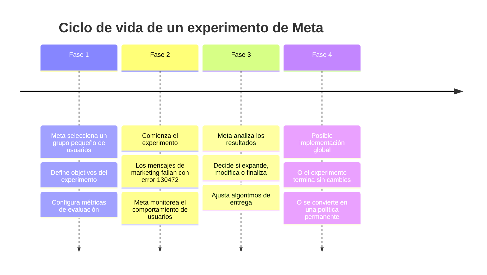

# Error 130472 de WhatsApp: Por qué ocurre y cómo solucionarlo

<Update title="Actualizado" date="31 de marzo de 2026" />


> El error 130472 de WhatsApp indica que un cliente forma parte de un experimento de Meta y no puede recibir plantillas de mensajes de marketing a menos que exista una ventana de chat abierta de 24 horas o un punto de entrada activo. No se te cobrará, tu cuenta no está bloqueada y la solución es pedirle al cliente que te escriba primero.

## ¿Qué significa el error 130472 de WhatsApp?

Si ves el siguiente mensaje en tus reportes de entrega:

> **Código de Error: 130472 — No se pudo enviar el mensaje porque este número de teléfono de usuario forma parte de un experimento**

Significa que tu plantilla de mensaje de marketing no pudo entregarse porque el cliente forma parte de un **grupo de experimentación de Meta**.

### Condiciones para la entrega

El mensaje solo se entregará si se cumple **al menos una** de estas condiciones:

1. **Ventana de servicio al cliente activa**: existe una conversación abierta de 24 horas entre tu negocio y el cliente.
2. **Punto de entrada abierto**: el cliente te contactó a través de un punto de entrada abierto, como un anuncio de WhatsApp Click-to-WhatsApp o un widget de chat en tu sitio web.

Si no se cumple ninguna de estas condiciones, el mensaje falla automáticamente con el código 130472.


> Reenviar el mensaje no ayudará. El mismo error aparecerá una y otra vez mientras el cliente siga formando parte del experimento.

## ¿Por qué Meta ejecuta este experimento?

Meta (propietaria de WhatsApp) ejecuta periódicamente **experimentos en la plataforma** para:

- **Probar cómo afectan los mensajes de marketing a la experiencia del usuario**: Meta busca equilibrar las necesidades comerciales con la satisfacción del usuario final.
- **Proteger la participación del usuario**: reducir los mensajes de marketing no deseados mejora la retención de usuarios en la plataforma.
- **Mejorar la calidad general de los mensajes**: los experimentos ayudan a Meta a refinar sus algoritmos de entrega.

Estos experimentos involucran solo a un **porcentaje muy pequeño de usuarios** y no tienen una fecha de finalización fija. Meta los ajusta periódicamente según los resultados que observa.


> El hecho de que un usuario esté en el experimento no significa que tu cuenta o tus mensajes tengan problemas de calidad. Es una decisión unilateral de Meta sobre el receptor, no sobre el remitente.

## ¿Me cobrarán por los mensajes no entregados?

**No.** ✅

Si tu mensaje falla debido al error 130472, WhatsApp lo marca automáticamente como **no entregable** y **no se te facturará** por ese intento de envío. Esto se aplica tanto a campañas de broadcasting como a mensajes automatizados enviados desde tus flujos de chatbot.

### Desglose de facturación

| Escenario | ¿Se cobra? |
|-----------|-----------|
| Mensaje entregado correctamente | ✅ Sí, tarifa normal de conversación |
| Error 130472 (usuario en experimento) | ❌ No, no se cobra |
| Error 131026 (mensaje no entregable) | ❌ No, no se cobra |
| Error 131042 (problema de método de pago) | ❌ No se envía, no se cobra |

## ¿Puedo solucionar o evitar el error 130472?

No puedes evitar el experimento de Meta. Sin embargo, puedes **entregar el mensaje igualmente** siguiendo esta estrategia:


### Pide al cliente que te escriba primero

Comunícate con el cliente por otro canal (email, SMS, llamada telefónica, redes sociales) y pídele amablemente que te envíe un mensaje a tu número de WhatsApp Business.

### Espera la ventana de servicio de 24 horas

Una vez que el cliente te responda, se abre automáticamente una **ventana de servicio al cliente de 24 horas**. Durante esa ventana, puedes enviar mensajes de plantilla de marketing sin restricciones.

### Reenvía tu mensaje original

Dentro de esa ventana de 24 horas, reenvía tu plantilla de marketing. Ahora se entregará sin el error 130472.


> **Estrategia alternativa**: Si no puedes contactar al cliente por otros medios, considera crear una campaña de anuncios Click-to-WhatsApp. Cuando el usuario hace clic en el anuncio, inicia una conversación que abre la ventana de servicio, permitiéndote enviar tu mensaje de marketing.

## ¿El error 130472 significa que mi cuenta de WhatsApp está bloqueada?

**No.** ❌

Tu cuenta **no está bloqueada ni restringida** de ninguna manera.

Este error solo afecta a los clientes que actualmente forman parte del experimento de Meta. El resto de tus campañas y mensajes se entregan con normalidad. Puedes seguir operando tus broadcasts, automatizaciones y chatbot sin problemas para la gran mayoría de tus contactos.

## Puntos clave para recordar

- **Error 130472** = El cliente está en un experimento de Meta.
- Los mensajes de marketing fallan **solo si no hay una ventana de chat abierta o un punto de entrada activo**.
- **No se te cobra** por los mensajes no entregados debido a este error.
- **Reenviar no ayuda**: el mismo error aparecerá hasta que el cliente salga del experimento o inicie una conversación contigo.
- La única forma de entregar el mensaje es que el **cliente interactúe primero** contigo.

### Otros errores relacionados de entrega de WhatsApp

Si estás experimentando problemas de entrega, estos errores también pueden ser relevantes:

- **[Error 131026: Mensaje no entregable](/recursos/error-whatsapp-131026)** — Explicación y soluciones para mensajes que no se pueden entregar para mantener un ecosistema saludable.
- **Error 131042: Problema con el método de pago** — Ocurre cuando hay un problema con la tarjeta de crédito o método de pago vinculado a tu cuenta de WhatsApp Business.
- **Solución: Mensaje no entregado para mantener un ecosistema saludable** — Guía completa sobre las políticas de engagement de Meta.

## Comprendiendo el contexto: experimentos de Meta y el ecosistema de mensajería

Para entender mejor por qué Meta realiza estos experimentos, es importante conocer el contexto más amplio de su estrategia de plataforma.

### ¿Qué busca Meta con estos experimentos?

Meta está constantemente equilibrando tres factores:

1. **Experiencia del usuario**: WhatsApp es ante todo una aplicación de mensajería personal. Meta quiere asegurarse de que los mensajes comerciales no degraden la experiencia de los usuarios.
2. **Viabilidad comercial**: las empresas necesitan WhatsApp para comunicarse con sus clientes. Meta desarrolla el ecosistema de WhatsApp Business API precisamente para esto.
3. **Calidad del ecosistema**: los mensajes de baja calidad o spam dañan la plataforma. Los experimentos ayudan a Meta a refinar qué tipos de mensajes se consideran valiosos.

### Frequency Capping de Meta

Relacionado con estos experimentos, Meta también implementa **límites de frecuencia (frequency capping)** que afectan cómo se entregan los mensajes promocionales:


### ¿Qué es el frequency capping de Meta?

El frequency capping es un enfoque estratégico de Meta para proteger a los usuarios de la sobrecarga de mensajes. Limita los mensajes promocionales por usuario para prevenir la fatiga de mensajes y garantizar una comunicación significativa.

**Características principales:**
- Limita los mensajes promocionales que un usuario puede recibir
- Previene la saturación de la bandeja de entrada
- Mantiene la calidad del mensaje
- Mejora la participación del usuario

**Impacto en las empresas:**
- Tasas de entrega reducidas para mensajes promocionales
- Necesidad de estrategias de mensajería más específicas
- Mayor enfoque en calidad sobre cantidad
- Mayor potencial de visibilidad para mensajes bien segmentados

### Mejores prácticas para maximizar la entrega de mensajes

Aunque no puedes controlar los experimentos de Meta, puedes optimizar tu estrategia de mensajería para minimizar el impacto:


### Estrategias de consentimiento

- Obtén consentimiento claro de los usuarios antes de enviar mensajes de marketing
- Segmenta tu audiencia por nivel de engagement
- Ofrece opciones de suscripción granular (qué tipo de mensajes quieren recibir)
- Proporciona opciones fáciles para darse de baja

### Optimización de campañas

- Espacia la frecuencia de tus mensajes (no más de 1-2 campañas por semana por usuario)
- Crea contenido valioso y no puramente promocional
- Monitorea el rendimiento de tus mensajes por segmento
- Adapta tu enfoque según las tasas de entrega observadas
- Espera 24-48 horas antes de reenviar mensajes fallidos

> **¿Sabías que...?** El frequency capping de Meta se aplica globalmente, no solo en mercados específicos. No hay un límite fijo de mensajes por usuario; Meta lo determina dinámicamente según sus algoritmos. Aunque el usuario haya dado su consentimiento explícito (opt-in), esto no garantiza la entrega. El algoritmo de Meta es complejo y considera múltiples factores.

## Cómo diagnosticar problemas de entrega en E-SMART360

Si estás experimentando problemas de entrega de mensajes, aquí tienes un flujo de diagnóstico paso a paso:


### Identifica el número que no recibió el mensaje

Revisa el reporte de tu campaña de broadcasting. Busca los números de teléfono que aparecen con estado "Fallido".

### Confirma el número desde el que estás enviando

Asegúrate de estar enviando desde el número de teléfono correcto vinculado a tu cuenta de E-SMART360. Puedes verificarlo desde la sección de Chat en Vivo.

### Busca el mensaje fallido

Toma el número de teléfono del destinatario y búscalo en el registro de mensajes (sin el signo '+' inicial).

### Identifica el código de error específico

Si el mensaje no se entregó, verás una marca de verificación roja junto al mensaje. Pasa el cursor sobre ella para ver el código de error y la razón del fallo.

### Consulta el catálogo oficial de errores de Meta

Copia el código de error y búscalo en el directorio oficial de códigos de error de Meta para desarrolladores. Allí encontrarás la explicación detallada de cada código.


### ¿Cómo consultar el directorio de errores de Meta?

1. Visita el sitio de desarrolladores de Meta: `developers.facebook.com/docs/whatsapp/cloud-api/support/error-codes/`
2. Presiona **Ctrl + F** (o Cmd + F en Mac)
3. Pega el código de error (por ejemplo, 130472)
4. Lee la explicación detallada y las acciones recomendadas

## Ejemplos prácticos

### Ejemplo 1: Campaña de Black Friday

**Situación**: Una tienda de ropa envía una campaña de Black Friday a 10,000 suscriptores. 50 mensajes fallan con error 130472.

**Análisis**: Estos 50 contactos están en el experimento de Meta. No hay nada malo con la cuenta ni con la campaña.

**Solución práctica**:
1. Identifica los 50 contactos por su número de teléfono
2. Envíales un SMS o email diciendo: "¡Hola! Tenemos una oferta especial para ti en WhatsApp. Escríbenos al [número] para recibir tu descuento exclusivo de Black Friday 🎉"
3. Cuando te escriban, la ventana de 24 horas se abrirá
4. Reenvía el mensaje de la plantilla de Black Friday

### Ejemplo 2: Notificación de carrito abandonado

**Situación**: Un cliente agregó productos al carrito pero no completó la compra. El flujo automatizado de recuperación de carrito abandonado intenta enviar un recordatorio, pero falla con error 130472.

**Análisis**: El cliente está en el experimento de Meta.

**Alternativas disponibles**:


### Opción A: Recordatorio por email

- Envía un email recordatorio automático
- Incluye un enlace directo al carrito
- Agrega un botón de "Habla con nosotros en WhatsApp" que abra un chat
- Una vez que el cliente inicie el chat, el flujo automatizado puede continuar

### Opción B: Anuncio retargeting

- Crea una campaña de anuncios Click-to-WhatsApp dirigida a estos usuarios
- Cuando hagan clic en el anuncio, inician una conversación en WhatsApp
- Automatiza una respuesta instantánea con el recordatorio del carrito
- El costo del anuncio se compensa con la recuperación de la venta

### Ejemplo 3: Notificación de envío

**Situación**: Quieres notificar a un cliente que su pedido ya fue enviado, usando una plantilla de tipo "utility" (utilidad).

**Buenas noticias**: El error 130472 afecta principalmente a plantillas de **marketing**, no a las de utilidad. Si estás usando una plantilla de tipo "utility" con información transaccional (confirmación de pedido, actualización de envío, factura), es mucho más probable que se entregue incluso si el usuario está en el experimento.


> **Recomendación**: Siempre que sea posible, usa plantillas de tipo "utility" para comunicaciones transaccionales. Meta trata estos mensajes de manera diferente y tienen mayores tasas de entrega, incluso durante experimentos en la plataforma.

## Tipos de mensajes en WhatsApp Business API

Para entender mejor cómo funcionan las reglas de entrega, es importante conocer los tipos de mensajes que existen en WhatsApp Business API:


### Tipos de mensajes en WhatsApp Business API

**1. Mensajes de Servicio (Service/Utility)**
Destinados a brindar información específica sobre una transacción o actualización al cliente. Incluyen:
- Confirmaciones de pedido
- Actualizaciones de envío
- Recordatorios de citas
- Alertas de cuenta
- Facturas y recibos

Estos mensajes tienen **mayor prioridad de entrega** y no están sujetos al límite de 24 horas de la ventana de servicio. Puedes enviarlos incluso fuera de la ventana de servicio usando plantillas pre-aprobadas.

**2. Mensajes de Marketing (Marketing)**
Destinados a promocionar productos, servicios o marcas. Incluyen:
- Ofertas y descuentos
- Lanzamientos de productos
- Contenido promocional
- Campañas estacionales

Estos son los mensajes más afectados por experimentos como el del error 130472 y por el frequency capping.

**3. Mensajes de Autenticación (Authentication)**
Utilizados para verificar la identidad del usuario mediante códigos de un solo uso (OTP). Tienen ventanas de servicio especiales.

**4. Mensajes de Servicio al Cliente**
Conversaciones iniciadas por el usuario durante la ventana de 24 horas. No requieren plantillas y pueden contener cualquier contenido relevante para atender al cliente.

## Preguntas frecuentes


### ¿El error 130472 afecta a todas mis campañas de WhatsApp?

No. Solo afecta a un porcentaje muy pequeño de usuarios que forman parte del experimento de Meta. La gran mayoría de tus campañas y mensajes se entregarán con normalidad.

### ¿Cómo sé qué clientes están en el experimento?

Cuando un reporte de entrega muestra el código de error 130472 para un número específico, ese cliente está en el grupo de prueba. Puedes identificarlos revisando los reportes de entrega de tus campañas de broadcasting.

### ¿Este experimento terminará algún día?

Meta no ha proporcionado una fecha de finalización. Los experimentos son continuos y pueden cambiar en cualquier momento. Lo mejor es mantener las buenas prácticas de mensajería y monitorear tus reportes de entrega periódicamente.

### ¿Debería dejar de hacer marketing en WhatsApp por este error?

En absoluto. ✅ La mayoría de tus mensajes se entregarán con normalidad. Este error afecta solo a una pequeña fracción de usuarios. Sigue con tus campañas de marketing, pero monitorea tus reportes de entrega para identificar patrones.

### ¿El error 130472 puede aparecer en cualquier momento o solo al inicio de campañas?

Puede aparecer en cualquier momento. Meta añade y elimina usuarios de los grupos de experimento de forma dinámica. Un usuario que hoy recibe tus mensajes sin problemas podría mañana estar en el experimento, y viceversa.

### ¿Afecta también a mensajes enviados desde chatbots automatizados?

Sí. El error 130472 se aplica a cualquier intento de enviar una plantilla de marketing, ya sea desde una campaña de broadcasting, un flujo automatizado de chatbot, o una respuesta programada. La única excepción es si existe una ventana de servicio abierta de 24 horas.

### ¿Puedo apelar o contactar a Meta para que saquen a un cliente del experimento?

No. Meta no ofrece un mecanismo de apelación para estos experimentos. La mejor estrategia es la mencionada anteriormente: pide al cliente que te escriba primero para abrir la ventana de servicio.

### ¿El frequency capping y el error 130472 son lo mismo?

No son lo mismo, pero están relacionados:
- **Error 130472**: El usuario está en un grupo de experimento específico de Meta.
- **Frequency capping**: Límite dinámico de mensajes promocionales que un usuario puede recibir, determinado por el algoritmo de Meta.

Ambos buscan proteger la experiencia del usuario pero funcionan de manera diferente. Puedes experimentar ambos al mismo tiempo.

## Resumen y recomendaciones finales

El error 130472 es una señal de que Meta está refinando activamente su ecosistema de mensajería comercial. En lugar de verlo como un obstáculo, considéralo un recordatorio para adoptar las mejores prácticas de marketing en WhatsApp:


### 1. Prioriza calidad

Crea mensajes valiosos y relevantes para tu audiencia. Los mensajes de alta calidad tienen mejores tasas de entrega.

### 2. Segmenta inteligentemente

No envíes a toda tu lista. Segmenta por comportamiento, preferencias y nivel de engagement.

### 3. Diversifica canales

Usa WhatsApp como canal principal pero complementa con email, SMS y redes sociales para llegar a usuarios afectados por experimentos.

> En E-SMART360 monitoreamos de cerca las actualizaciones de Meta para mantenerte informado y asegurar que tus campañas de WhatsApp se ejecuten sin problemas. Si ves el error 130472, ahora sabes exactamente por qué ocurre y qué hacer a continuación.

### Para más información

- [Error 131026: Mensaje no entregable - Soluciones](/recursos/error-whatsapp-131026)
- [Guía de plantillas de mensajes para WhatsApp](/recursos/plantillas-mensajes-whatsapp)
- [Reglas de broadcasting en WhatsApp](/recursos/reglas-broadcasting-whatsapp)
- [Límites de mensajería en WhatsApp Business API](/recursos/limites-mensajeria-whatsapp)
- [Política de frequency capping de Meta](/recursos/frequency-capping-meta-whatsapp)
- [Solución: Mensaje no entregado para mantener un ecosistema saludable](/recursos/mensaje-no-entregado-ecosistema-saludable)

## Apéndice: Guía rápida de códigos de error de WhatsApp

A continuación presentamos una guía de referencia rápida con los códigos de error más comunes que puedes encontrar al enviar mensajes a través de WhatsApp Business API:

| Código | Significado | Acción recomendada |
|--------|-------------|-------------------|
| 130472 | El número del usuario está en un experimento de Meta | Pedir al cliente que inicie la conversación |
| 131026 | Mensaje no entregable para mantener ecosistema saludable | Revisar calidad de la plantilla y reputación |
| 131042 | Error relacionado con el método de pago | Verificar tarjeta y configuración de pago en Meta |
| 131005 | Límite de mensajes alcanzado | Esperar o solicitar aumento de límite |
| 131008 | Número de teléfono no registrado en WhatsApp | Verificar que el número sea válido y esté activo |
| 131014 | Plantilla de mensaje rechazada | Revisar y corregir la plantilla según directrices |

## Casos de uso reales y estrategias avanzadas

### Estrategia 1: Segmentación por engagement para minimizar el impacto

Una de las formas más efectivas de reducir el impacto del error 130472 es segmentar tu audiencia según su nivel de engagement:

```mermaid
graph TD
    A[Lista completa de contactos] --> B{¿Ha interactuado
en los últimos 30 días?}
    B -->|Sí| C[Segmento Activo]
    B -->|No| D[Segmento Inactivo]
    C --> E[Enviar campaña de marketing]
    E --> F{¿Error 130472?}
    F -->|No| G[Mensaje entregado ✅]
    F -->|Sí| H[Registrar contacto como
"en experimento"]
    H --> I[Intentar por otro canal]
    D --> J[Enviar campaña de
reactivación primero]
    J --> K{¿Respondió?}
    K -->|Sí| L[Mover a Segmento Activo]
    K -->|No| M[Considerar limpieza
de lista]
```

### Estrategia 2: Campañas multicanal sincronizadas

Cuando lances una campaña importante, coordina el envío a través de múltiples canales:


### Día 1: Envío inicial por WhatsApp

Envía tu campaña de marketing a toda tu lista. Monitorea los reportes de entrega para identificar los contactos que fallaron con error 130472.

### Día 2: Email de respaldo

Para los contactos identificados con error 130472, envía un email de respaldo con el mismo contenido promocional. Incluye un botón de CTA que diga "Ver oferta en WhatsApp" que abra un chat contigo.

### Día 3: SMS de respaldo

Si el email tampoco generó una interacción, envía un SMS corto: "Tienes una oferta especial esperándote en WhatsApp. Escríbenos para verla → [enlace]".

### Día 4-7: Ventana de oportunidad

Cuando los contactos te escriban (desde el email, SMS o anuncio), la ventana de servicio de 24 horas se abre automáticamente. Aprovecha para entregar el mensaje original y continuar la conversación.

### Estrategia 3: Automatización con webhooks

Puedes automatizar la detección y manejo del error 130472 usando los webhooks de E-SMART360:


#### Ejemplo de webhook

```javascript
// Ejemplo: Manejo automático del error 130472
// Configura este webhook en E-SMART360 para recibir notificaciones de estado de entrega

function handleDeliveryStatus(webhookPayload) {
  const { status, error_code, recipient_phone, template_name } = webhookPayload;
  
  if (status === "failed" && error_code === "130472") {
    // El contacto está en un experimento de Meta
    console.log(`Contacto ${recipient_phone} está en experimento Meta`);
    
    // Opción 1: Registrar para seguimiento manual
    addToFollowUpList(recipient_phone, template_name);
    
    // Opción 2: Enviar email automático de respaldo
    sendBackupEmail(recipient_phone, template_name);
    
    // Opción 3: Programar reintento después de 48 horas
    scheduleRetry(recipient_phone, template_name, 48);
  }
}
```

## Consejos de solución de problemas avanzados

### Verificación del método de pago

Si además del error 130472 estás viendo errores relacionados con pagos (como el 131042), verifica estos puntos:


### Abre la configuración de pagos

Ve a la sección de Métodos de Pago en E-SMART360 y selecciona el Facebook Business Manager correcto asociado a tu cuenta.

### Localiza tu cuenta de WhatsApp Business

Dentro de Facturación y Pagos, ve a Cuentas y busca WhatsApp Business Accounts. Asegúrate de que coincida con tu ID de negocio en E-SMART360.

### Verifica el método de pago

Si no ves ningún método de pago agregado, verás un botón "Agregar método de pago". Haz clic en los tres puntos (•••) y luego en "Ver detalles". Completa ambos pasos: agregar información de pago y verificar información fiscal.

### Verifica tu Business Manager

Si el método de pago está configurado pero los mensajes siguen fallando, tu Facebook Business Manager podría no estar verificado. Ve al Centro de Seguridad y verifica que tu negocio tenga la etiqueta "Verificado". Si no, inicia el proceso de verificación y espera 24-48 horas.

### Diferencia entre error 130472 y bloqueo de cuenta

Es muy importante no confundir el error 130472 con un bloqueo o restricción de tu cuenta:

| Síntoma | Error 130472 | Cuenta bloqueada | Cuenta restringida |
|---------|-------------|-----------------|-------------------|
| Solo algunos mensajes fallan | ✅ Sí | ❌ No | ❌ No |
| Todos los mensajes fallan | ❌ No | ✅ Sí | ✅ Sí |
| Puedes iniciar sesión normalmente | ✅ Sí | ❌ No | ✅ Sí |
| Aparece mensaje de "cuenta deshabilitada" | ❌ No | ✅ Sí | ❌ No |
| La solución es que el cliente escriba primero | ✅ Sí | ❌ No | ❌ No |
| Debes contactar a soporte de Meta | ❌ No | ✅ Sí | ✅ Sí |

## Glosario de términos


### Ventana de servicio de 24 horas

Período de 24 horas que se abre automáticamente cuando un usuario envía un mensaje a tu negocio en WhatsApp. Durante esta ventana, puedes responder con cualquier tipo de mensaje (incluyendo mensajes de marketing sin plantilla). Fuera de esta ventana, solo puedes enviar mensajes usando plantillas pre-aprobadas (marketing, utility o authentication).

### Plantilla de mensaje

Formato de mensaje pre-aprobado por Meta que permite a las empresas iniciar conversaciones con los usuarios. Deben ser aprobadas por Meta antes de su uso y pueden ser de tipo marketing, utility o authentication. Las plantillas de marketing son las más afectadas por el error 130472.

### Punto de entrada abierto

Cualquier mecanismo por el cual un usuario puede iniciar una conversación con tu negocio, como un anuncio Click-to-WhatsApp, un widget de chat en tu sitio web, o un enlace directo a WhatsApp. Cuando un usuario inicia la conversación a través de uno de estos puntos, la ventana de 24 horas se abre automáticamente.

### Reporte de entrega (delivery report)

Información que WhatsApp envía al remitente indicando si un mensaje fue entregado, leído o si falló. Incluye códigos de error detallados cuando algo sale mal. En E-SMART360 puedes acceder a estos reportes desde la sección de Broadcasting > Reportes de Campaña.

## Preguntas frecuentes adicionales


### ¿Qué pasa si el cliente sale del experimento? ¿Recibirá los mensajes automáticamente?

Cuando Meta saca a un usuario del grupo de experimento, los mensajes de marketing volverán a entregarse de forma normal, siempre que se cumplan las condiciones estándar de entrega (existencia de plantilla aprobada, límites de mensajería, etc.). No es necesario que hagas nada especial; los mensajes futuros se entregarán automáticamente.

### ¿El error 130472 puede afectar a usuarios de otros países de manera diferente?

Sí. Meta ejecuta experimentos en diferentes mercados y regiones de manera independiente. Es posible que observes una mayor incidencia del error 130472 en ciertos países o regiones donde Meta está realizando pruebas más amplias. Monitorea tus reportes de entrega segmentados geográficamente para identificar patrones regionales.

### ¿Cómo afecta la calidad de mi plantilla al error 130472?

La calidad de tu plantilla no influye directamente en el error 130472, ya que este error se debe a una decisión de Meta sobre el receptor, no sobre el remitente. Sin embargo, las plantillas con baja calidad (calificación roja o amarilla) pueden experimentar otros problemas de entrega. Mantén siempre la calidad de tus plantillas en verde siguiendo las directrices de Meta.

### ¿Puedo usar mensajes de marketing sin plantilla para evitar el error 130472?

No. Fuera de la ventana de servicio de 24 horas, solo puedes enviar mensajes usando plantillas pre-aprobadas. Los mensajes de marketing sin plantilla solo se pueden enviar dentro de una ventana de servicio activa. Por lo tanto, la única forma de evitar el error 130472 es asegurarte de que exista una ventana de servicio abierta.

### ¿El error 130472 también afecta a los mensajes de tipo utility o service?

El error 130472 está documentado para mensajes de marketing. Los mensajes de tipo utility (transaccionales) suelen tener un tratamiento diferente por parte de Meta y es menos probable que se vean afectados por este experimento. Sin embargo, en casos excepcionales, algunos usuarios en experimentos muy específicos podrían experimentar restricciones también en mensajes utility.

### ¿Cuánto tiempo debo esperar antes de intentar enviar el mensaje de nuevo?

No hay un tiempo de espera recomendado, ya que reenviar el mensaje no resolverá el error mientras el cliente siga en el experimento. En lugar de esperar, enfócate en abrir una ventana de servicio pidiendo al cliente que te escriba primero. Una vez que la ventana esté abierta, puedes enviar el mensaje inmediatamente.

### ¿El error 130472 es permanente para un usuario específico?

No es permanente. Meta añade y elimina usuarios de los grupos de experimento periódicamente. Un usuario puede estar en el experimento durante días, semanas o meses, y luego salir sin previo aviso. Recomendamos etiquetar a estos usuarios y revisar su estado periódicamente.

### ¿Cómo puedo monitorear la tasa de error 130472 en mis campañas?

En el panel de reportes de E-SMART360 puedes filtrar por código de error para ver cuántos mensajes fallaron específicamente con el error 130472 en cada campaña. Te recomendamos:
1. Crear un reporte semanal de errores de entrega
2. Segmentar por código de error
3. Calcular el porcentaje sobre el total de mensajes enviados
4. Comparar la tasa entre diferentes campañas para identificar patrones
5. Configurar alertas para cuando la tasa de error 130472 supere el 5% de tu envío

### ¿Es recomendable usar números alternativos de WhatsApp para evitar el experimento?

No. El experimento se aplica a nivel de usuario (receptor), no a nivel de número de negocio (remitente). Usar múltiples números para enviar el mismo mensaje a un usuario en el experimento no evitará el error. Además, esta práctica podría ser considerada como un intento de eludir las políticas de Meta y podría resultar en restricciones para tu cuenta.

## Checklist de verificación rápida

Usa esta lista para diagnosticar rápidamente cualquier problema de entrega:

- [ ] **Paso 1**: ¿El error es específicamente 130472? → Ve al Paso 2. ¿Es otro código? → Consulta la tabla de códigos de error.
- [ ] **Paso 2**: ¿El cliente tiene una ventana de servicio abierta de 24 horas? → Si no, pasa al Paso 3. Si sí, el error no debería ocurrir; contacta a soporte.
- [ ] **Paso 3**: ¿Puedes contactar al cliente por otro canal (email, SMS, teléfono)? → Si sí, pídele que te escriba a WhatsApp.
- [ ] **Paso 4**: ¿Tienes anuncios Click-to-WhatsApp activos? → Si sí, comparte el enlace del anuncio con el cliente para que inicie la conversación.
- [ ] **Paso 5**: ¿El cliente forma parte consistente del experimento (más de 30 días)? → Considera estrategias alternativas como migrar a otro canal principal para ese contacto.
- [ ] **Paso 6**: ¿Has documentado el caso? → Guarda el número y la fecha para referencia futura.

## Perspectiva a futuro: cómo evolucionan los experimentos de Meta

Meta utiliza los experimentos para refinar continuamente su plataforma. Entender esta dinámica te ayudará a prepararte para el futuro:

### Línea de tiempo típica de un experimento de Meta



### Lo que esto significa para tu negocio

- **Corto plazo**: El error 130472 puede aparecer y desaparecer. Mantén la calma y aplica las soluciones descritas en esta guía.
- **Mediano plazo**: Es probable que Meta implemente restricciones más inteligentes basadas en el comportamiento del usuario. La segmentación y personalización serán cada vez más importantes.
- **Largo plazo**: El marketing en WhatsApp evolucionará hacia comunicaciones más relevantes y con mayor consentimiento del usuario. Las empresas que adopten estas prácticas desde ahora estarán mejor posicionadas.

## Ejemplo de diálogo: cómo pedir al cliente que te escriba

Aquí tienes un ejemplo de mensaje que puedes enviar por otro canal para solicitar al cliente que inicie una conversación en WhatsApp:


### Email

**Asunto**: ¡Tenemos una sorpresa para ti en WhatsApp! 🎁

**Cuerpo**:
> Hola [Nombre],
>
> Queremos compartir contigo una oferta exclusiva directamente en WhatsApp.
>
> Para recibirla, simplemente escríbenos al [número de WhatsApp] con la palabra "OFERTA" y en segundos recibirás tu descuento personalizado.
>
> 👉 [Enlace directo a WhatsApp](https://wa.link/[tucodigo])
>
> ¡Te esperamos!
>
> El equipo de [Tu Empresa]

### SMS

[Nombre], tienes una oferta exclusiva esperándote en WhatsApp. Escríbenos ahora con la palabra OFERTA al [número] para recibirla. [Enlace]

### Redes Sociales

📢 ¡Atención [Nombre]! ⚠️ No pudimos entregarte un mensaje importante en WhatsApp. Escríbenos con la palabra INFO al [número] para verlo. Estamos listos para atenderte 💬

> **Recomendación**: Siempre que solicites a un cliente que te escriba por WhatsApp, ofrece un incentivo claro (descuento, información exclusiva, acceso anticipado) para motivar la acción. Esto no solo resuelve el error 130472, sino que también mejora el engagement general.

## Integración con otras funcionalidades de E-SMART360

Aprovecha las capacidades de E-SMART360 para manejar el error 130472 de manera más eficiente:

### Automatización con flujos de chatbot

Puedes crear un flujo de chatbot que detecte cuándo un usuario ha estado inactivo y automáticamente intente reactivarlo:


#### Estrategia de reactivación

```
Flujo de reactivación automática:

1. Día 0: Usuario se suscribe → Bienvenida
2. Día 7: No ha interactuado → Enviar tip útil
3. Día 14: No ha interactuado → Enviar encuesta rápida
4. Día 21: No ha interactuado → Enviar oferta especial (MARKETING)
   ├── Si se entrega → Continuar flujo normal
   └── Si falla (130472) → Registrar como "en experimento"
5. Día 28: Contacto en experimento → Enviar email de respaldo
6. Día 35: Si respondió al email → Enviar WhatsApp ahora (ventana abierta)
```

### Uso de etiquetas para seguimiento

Crea etiquetas en E-SMART360 para dar seguimiento a los contactos afectados:


### Etiquetas recomendadas

- **en-experimento-meta**: Contactos actualmente en el experimento
- **error-130472-recurrente**: Contactos que recurrentemente muestran el error
- **pendiente-email-respaldo**: Contactos que necesitan email de seguimiento
- **reactivado-tras-experimento**: Contactos que salieron del experimento

### Automatización con etiquetas

1. Cuando un mensaje falla con 130472, etiqueta automáticamente al contacto
2. Programa un flujo de email automático para los contactos etiquetados
3. Cuando el contacto responda, cambia la etiqueta a "reactivado"
4. Envía el mensaje original dentro de la ventana de 24 horas
5. Monitorea la tasa de conversión de estos contactos
