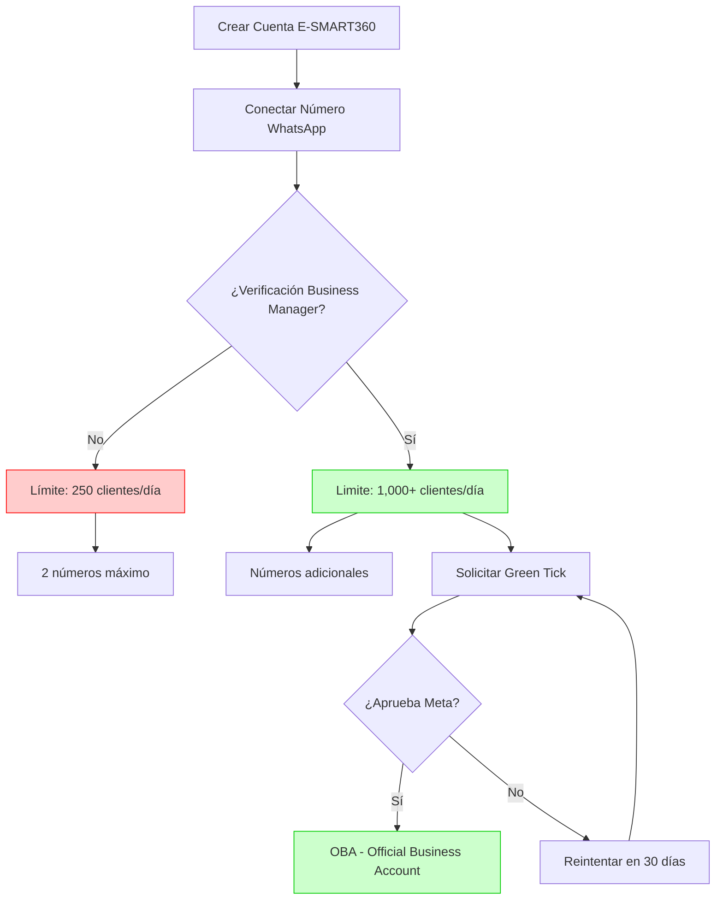

# ¿Es Obligatoria la Verificación Empresarial en WhatsApp Business? Límites y Beneficios

> **Actualización (9 febrero 2026)**
> WhatsApp ha actualizado recientemente sus políticas de verificación empresarial, haciendo que el proceso sea opcional para la incorporación inicial, pero no por ello menos importante para escalar operaciones.

> **Resumen ejecutivo:** La verificación empresarial en la Plataforma WhatsApp Business es un proceso formal que confirma la autenticidad de tu empresa ante Meta y sus clientes. Las empresas verificadas obtienen señales de confianza más sólidas, un alcance significativamente mejorado y límites de envío de mensajes mucho más altos. Esta guía explora por qué la verificación es esencial para el crecimiento, cómo funciona el proceso y cuándo se convierte en una necesidad para las comunicaciones empresariales profesionales.

## ¿Qué es la Verificación Empresarial de WhatsApp?

> **Nota importante:** A partir de las actualizaciones más recientes de Meta, la verificación empresarial ya no es un requisito obligatorio para comenzar a usar la Plataforma WhatsApp Business. Sin embargo, las empresas no verificadas enfrentan limitaciones significativas que pueden obstaculizar su crecimiento. Esta guía detalla exactamente esas limitaciones y los pasos para superarlas.

La verificación empresarial en la Plataforma WhatsApp Business es el proceso mediante el cual Meta confirma que una empresa es legítima y está operando de manera legal. Este proceso permite que las empresas accedan a funcionalidades avanzadas de la API de WhatsApp Business, incluyendo la capacidad de enviar mensajes a gran escala, mostrar un nombre de empresa verificado y construir confianza con los clientes.

En E-SMART360, después de conectar el número de teléfono, el estado de la cuenta del Business Manager no verificado se muestra como **AVAILABLE_WITHOUT_REVIEW** (disponible sin revisión). Esto indica que la cuenta puede comenzar a enviar mensajes, pero con restricciones importantes.

## Incorporación sin Verificación Empresarial: Límites Revelados

Con las actualizaciones recientes, las empresas ahora pueden comenzar a enviar mensajes a clientes sin la verificación empresarial. Sin embargo, al hacerlo se enfrentan a limitaciones significativas que pueden afectar sus estrategias de comunicación y engagement con los clientes.

### 1. Alcance Limitado: 250 Clientes Únicos

Sin verificación empresarial, las empresas pueden enviar conversaciones iniciadas por la empresa a solo **250 clientes únicos** en un período móvil de 24 horas por número de teléfono. Esta restricción limita seriamente los esfuerzos para llegar a una audiencia más amplia y relacionarse con una base diversa de clientes.

> **Importante:** El límite de 250 clientes únicos es un tope diario móvil. Si envías mensajes a 250 personas hoy, deberás esperar 24 horas desde el primer mensaje para que se "liberen" esos contactos y puedas escribir a otros nuevos.

### 2. Máximo de 2 Números de Teléfono

Las empresas sin verificación están limitadas a registrar hasta **2 números de teléfono**. Esta limitación puede restringir la escalabilidad de los esfuerzos de comunicación para empresas con operaciones más grandes y bases de clientes extensas.

> ¿Sabías que muchas empresas necesitan múltiples números de teléfono para segmentar sus operaciones? Por ejemplo: un número para ventas, otro para soporte técnico y otro para atención al cliente. Con la limitación de solo 2 números, esta segmentación se vuelve imposible.

> **Atención:** El estado AVAILABLE_WITHOUT_REVIEW significa que puedes enviar mensajes, pero tu cuenta está "bajo observación". Cualquier reporte de spam o queja de cliente puede resultar en restricciones inmediatas, ya que Meta tiene menos información sobre tu empresa al no estar verificada.

### ¿Cómo se Ve Esto en la Práctica?

Imagina que tienes un negocio de comercio electrónico que recibe 500 pedidos al día. Sin verificación, solo podrías contactar al 50% de tus nuevos clientes para confirmar sus pedidos, enviar actualizaciones de envío o hacer seguimiento. El otro 50% simplemente no recibiría comunicación de tu parte hasta que ellos te escriban primero.

## Beneficios de la Verificación Empresarial

Si bien la verificación empresarial es opcional, desbloquea ventajas significativas que pueden impulsar el crecimiento de las empresas en la Plataforma WhatsApp Business.

### 1. Escalando el Alcance: De 1,000 a Clientes Ilimitados

Al optar por la verificación empresarial, las empresas pueden escalar su alcance al cliente de manera significativa:

### Sin Verificación

- 250 clientes únicos por día
    - Máximo 2 números de teléfono
    - Sin nombre de display aprobado
    - Estado: AVAILABLE_WITHOUT_REVIEW
  
### Con Verificación

- Desde 1,000 hasta clientes ilimitados
    - Números de teléfono adicionales
    - Nombre de display oficial aprobado
    - Estado verificado con todas las capacidades
  
Las cuentas verificadas pueden iniciar conversaciones con **1,000 clientes únicos** en un período móvil de 24 horas, con el potencial de aumentar a 10,000, 100,000 o incluso un número **ilimitado** por número de teléfono, dependiendo del nivel de reputación y el límite de mensajería asignado.

### 2. Respuestas Ilimitadas a Conversaciones Iniciadas por Clientes

Con la verificación empresarial, las empresas pueden proporcionar respuestas rápidas e ilimitadas a las conversaciones iniciadas por los clientes dentro de la **ventana de mensajería de 24 horas**. Este nivel de capacidad de respuesta fomenta experiencias positivas para los clientes y fortalece las relaciones.

### 3. Reconocimiento de Marca Mejorado con Aprobación del Nombre de Display

La verificación empresarial garantiza la aprobación del nombre de display, fortaleciendo el reconocimiento de la marca y la confianza entre los clientes. Un nombre de display aprobado ayuda a los clientes a diferenciar los mensajes oficiales de posibles spam o actividades fraudulentas.

> **Dato clave:** Los clientes son 3 veces más propensos a responder a un mensaje de una empresa con nombre de display verificado que a uno que solo muestra un número de teléfono. La verificación genera confianza instantánea.

### 4. Acceso a la Marca Verde (Green Tick / OBA)

Uno de los beneficios más visibles de la verificación empresarial es la posibilidad de solicitar la **marca de verificación verde de WhatsApp** (Official Business Account o OBA). Esta insignia especial muestra el nombre de tu empresa junto con un pequeño check verde, en lugar de solo mostrar tu número de teléfono.

> **¿Sabías que...?** El Green Tick no solo muestra tu nombre de empresa, sino que también lo hace visible en todas las vistas del chat, incluso si el cliente no te tiene guardado en sus contactos. Esto elimina la confusión y refuerza tu identidad de marca.

## ¿Cómo Funciona el Proceso de Verificación?

### Vincula tu Cuenta de WhatsApp Business

Antes de comenzar el proceso de verificación, asegúrate de que tu cuenta de WhatsApp Business esté vinculada a E-SMART360. El número de teléfono debe estar configurado correctamente y funcionando dentro de la plataforma.
  
### Accede al Security Center de Meta

Ve al [Security Center](https://business.facebook.com/settings/security) de tu Business Manager. Selecciona la cuenta empresarial que has configurado para WhatsApp. Esto te llevará a la configuración de cuenta adecuada.
  
### Inicia la Verificación

Dentro de la sección **Business Verification**, haz clic en el botón **Start Verification**. Si el botón no aparece o está atenuado, puede deberse a información empresarial incompleta, una página de Facebook faltante o detalles de cuenta sin confirmar.
  
### Proporciona los Datos de tu Empresa

Selecciona el país donde está registrada tu empresa e ingresa la siguiente información:
    - Nombre legal de la empresa
    - Dirección física
    - Número de teléfono
    - Sitio web
    Asegúrate de que estos datos coincidan exactamente con la información en tus documentos de respaldo.
  
### Elige el Método de Contacto

Selecciona cómo Meta se pondrá en contacto contigo para la verificación. Las opciones incluyen:
    - **Correo electrónico**
    - **SMS**
    - **Llamada telefónica**
    - **Verificación de dominio**
    
> **Importante:** Usa un número de teléfono o dirección de correo electrónico al que tengas acceso inmediato para recibir el código de verificación.
    
### Sube los Documentos de Respaldo

Proporciona los documentos necesarios que acrediten tu empresa. La tabla a continuación muestra qué documentos son aceptados y cuáles no.
  
### Documentos Aceptados y Rechazados

### ✅ Aceptados

- Certificado de Formación o Constitución (ej: Certificado GST)
    - Artículos de Constitución
    - Licencia Comercial y Permisos
    - Registro Fiscal de la Empresa
    - Estados de Cuenta Bancarios Empresariales
    - Udyog Aadhaar (UID) / Udyam Certificate
    - Informes de Crédito Empresariales
    - Facturas de Servicios Públicos (luz, agua, gas)
    - Tarjeta PAN (Permanent Account Number)
    - Certificado de Establecimiento Comercial
  
### ❌ No Aceptados

- Facturas comerciales (emitidas por tu empresa)
    - Órdenes de compra
    - Solicitudes auto-completadas
    - Declaraciones de impuestos presentadas por ti
    - Estados de cuenta bancarios personales
    - Capturas de pantalla del sitio web
    - Folletos, flyers o membretes de la empresa
  
> **Importante sobre el idioma:** Si tus documentos no están en un idioma compatible, asegúrate de proporcionar una traducción oficial al inglés emitida por una agencia certificada. Los idiomas aceptados incluyen: español, inglés, árabe, bengalí, francés, alemán, griego, hebreo, hindi, indonesio, italiano, japonés, coreano, malayo, mandarín, polaco, portugués, ruso, tailandés, turco y vietnamita.

## ¿Qué Hacer si tu Solicitud de Verificación es Rechazada?

Si recibes un correo o notificación de que tu solicitud de verificación empresarial de WhatsApp fue rechazada por Meta, **no te preocupes**. Meta te da hasta **tres oportunidades** para volver a presentar tu solicitud de verificación.

Puedes verificar las razones del rechazo en el [Security Center](https://business.facebook.com/settings/security) de tu cuenta de WhatsApp Business Manager. Simplemente haz clic en **Learn More** para ver por qué se denegó tu solicitud. Después de hacer las correcciones necesarias, haz clic en **Get Started** para enviar otra solicitud.

### Razones Comunes de Rechazo

### 1. Documentos no aceptados

Meta tiene pautas estrictas sobre qué documentos se aceptan para la verificación empresarial. Asegúrate de consultar la tabla de documentos aceptados en la sección anterior. Los documentos incorrectos son la causa más común de rechazo.

### 2. Documentos incompletos

Asegúrate de que los documentos que envíes contengan **toda la información requerida**: nombre legal de la empresa, dirección física, número de teléfono y sitio web. Si falta alguno de estos datos, tu solicitud será rechazada. Además, tu sitio web debe incluir tu nombre legal de la empresa y tu logotipo.

### 3. Idioma no soportado

Meta solo acepta documentos en ciertos idiomas. Si tus documentos no están en uno de los idiomas compatibles, proporciona una traducción oficial al inglés con sello certificado de una agencia de traducción. Los idiomas soportados incluyen español, inglés, francés, alemán, entre otros.

### 4. Documentos ilegibles o vencidos

Asegúrate de que tus documentos sean **claros, legibles y estén vigentes**. Los documentos borrosos, recortados o vencidos resultarán en rechazo. El revisor debe poder verificar claramente toda la información.

### 5. Documentos adicionales faltantes

A veces, Meta puede solicitar documentos extras para verificar tu negocio. Si esto ocurre, asegúrate de enviar los documentos requeridos dentro del **plazo indicado**. No hacerlo puede llevar al rechazo.

## Solución de Problemas: Botón "Start Verification" No Visible

Un problema común que enfrentan las empresas es que el botón **"Start Verification"** aparece atenuado, gris o simplemente no es visible. Aquí te explicamos las causas y soluciones:

### Causas Comunes

El botón de verificación puede estar oculto por:
- Información empresarial incompleta
- Página de Facebook faltante
- Detalles de cuenta sin confirmar

### Pasos para Activar el Botón

### Conecta tu Página de Facebook

Visita el [Security Center de Facebook Business](https://business.facebook.com/security). Navega a Business Settings > Pages y añade tu página oficial de Facebook de la empresa. Asegúrate de ser administrador de la página.
  
### Crea un App ID

Ve a la sección de Apps y haz clic en "Add". Selecciona "Business" como tipo de aplicación y añade un nombre de display empresarial.
  
### Completa la Configuración de la App

Rellena la información requerida de la aplicación, añade tu correo electrónico empresarial y elige el rol de negocio adecuado.
  
### Solicita Acceso Avanzado

Ve a App Review, busca la "Live Video API", solicita acceso avanzado y completa los detalles de verificación.
  
### Proporciona Información Empresarial

Añade una descripción de una línea de tu negocio y sube un video de demostración corto si es necesario. Rellena todos los campos de verificación con precisión.
  
### Consejos Profesionales para una Verificación Exitosa

- Usa un lenguaje claro y profesional en todas las presentaciones
- Proporciona información empresarial precisa y verificable
- Prepara todos los documentos necesarios con anticipación
- Sé paciente y revisa cuidadosamente los comentarios
- Si el proceso es lento, puede tomar varios días. Ten paciencia.
- Si hay fallos técnicos, prueba con un navegador diferente o borra la caché

## El Green Tick de WhatsApp: El Sello Definitivo de Confianza

Una vez que tu Meta Business Manager está verificado, puedes solicitar el **Green Tick de WhatsApp** (Official Business Account). Esta insignia especial brinda un reconocimiento único a tu marca al mostrar tu nombre empresarial junto con un pequeño check verde.

### 5 Requisitos Indispensables

### 1. API de WhatsApp Configurada

Tu número de teléfono ya debe estar configurado con la API de WhatsApp Business a través de E-SMART360.
  
### 2. Meta Business Account Verificada

Asegúrate de que tu Meta Business Account esté completamente verificada siguiendo los pasos descritos anteriormente.
  
### 3. Nombre de Display Aprobado

Tu nombre de display debe cumplir con las directrices de WhatsApp. Debe incluir el nombre de tu empresa o marca.
  
### 4. Verificación en Dos Pasos Activada

Habilita la verificación en dos pasos en WhatsApp Manager > Phone Numbers > Settings > Two-Step Verification.
  
### 5. Presencia Mediática Sólida

Tu negocio debe tener al menos 3 piezas de contenido orgánico: artículos de relaciones públicas, publicaciones de blog o cobertura de noticias. Los artículos de PR pagados no cuentan.
  
### Cómo Solicitar el Green Tick

1. Inicia sesión en tu [WhatsApp Manager Account](https://business.facebook.com/wa/manage/home/)
2. Ve a WhatsApp Manager > Account tools > Phone numbers
3. Localiza tu número de teléfono y haz clic en **Settings**
4. En el menú de Settings, haz clic en **Profile**
5. Dentro de Profile, haz clic en **Request Verification**
6. Completa la información requerida para la solicitud de **Official Business Account (OBA)**

> **Nota importante:** Una vez que recibes el Green Tick, **no puedes cambiar tu nombre de display** sin volver a solicitar la verificación. Asegúrate de tener el nombre finalizado antes de presentar tu solicitud.

### ¿Vale la Pena el Green Tick?

Si bien el green tick no proporciona funciones adicionales por sí mismo, añade credibilidad y confianza a tu cuenta, mostrando a los clientes que están interactuando con un negocio legítimo. Los clientes son significativamente más propensos a interactuar con cuentas verificadas.

## Consejos para Mejorar tus Posibilidades de Obtener el Green Tick

### Crea un sitio web y correo electrónico oficiales

Asegúrate de tener un sitio web profesional y un correo electrónico con dominio propio. Esto demuestra a WhatsApp que tu negocio es legítimo y tiene presencia digital establecida.

### Ejecuta campañas de Click-to-WhatsApp Ads

Participar en anuncios Click-to-WhatsApp demuestra que eres un usuario activo de la plataforma. Esto puede aumentar tu credibilidad ante WhatsApp. Las campañas publicitarias pagan demostrando uso activo.

### Mantén una calificación de alta calidad

Asegúrate de que tu cuenta de WhatsApp tenga una calificación de alta calidad. Esto puede mejorar tus posibilidades al solicitar el green tick. Revisa periódicamente tu calidad de rating en WhatsApp Manager.

### Aumenta el conocimiento de la marca

Consigue cobertura mediática orgánica en artículos de relaciones públicas, blogs o medios de noticias. Puedes hacer referencia hasta 5 publicaciones durante tu solicitud. El contenido orgánico es fundamental para este requisito.

## El Proceso Total: Diagrama de Flujo

## Tipos de Cuentas de WhatsApp Business

### Cuenta Business
Es la cuenta predeterminada que se obtiene al registrarse en WhatsApp. Tu nombre de empresa aparecerá junto a tu número de teléfono, pero los usuarios verán principalmente tu número a menos que te guarden como contacto.

### Cuenta Official Business Account (OBA)
El **Green Tick de WhatsApp** o **Official Business Account** muestra tu nombre empresarial en todas las vistas, y la insignia de verificación verde añade credibilidad. Esta es la cuenta a la que se aplica con el Green Tick.

## Casos de Uso y Ejemplos Prácticos

### Caso 1: Tienda de Ropa Online

**Situación:** Una tienda de ropa recibe 200 pedidos diarios y necesita contactar a cada cliente para confirmación y seguimiento de envío.

    **Sin verificación:** Solo puede contactar a 250 clientes únicos, pero necesita al menos 200 diarios. Cualquier campaña de marketing o reactivación de clientes antiguos queda fuera de su alcance.

    **Con verificación:** Puede contactar a los 200 clientes de pedidos diarios + 800 más para campañas de marketing, recuperación de carritos abandonados y ofertas personalizadas. Además, puede escalar a miles al mejorar su reputación.
  
### Caso 2: Agencia Inmobiliaria

**Situación:** Una agencia con 5 agentes que necesitan contactar leads de propiedades de forma independiente.

    **Sin verificación:** Máximo 2 números de teléfono. Tres agentes no tendrían número propio y compartirían el mismo, confundiendo a los clientes.

    **Con verificación:** Pueden tener 5+ números telefónicos, uno por agente, cada uno con su propio límite de 1,000+ clientes únicos. Mensajes personalizados y seguimiento individualizado.
  
## Preguntas Frecuentes

### ¿Es obligatorio verificar mi cuenta de WhatsApp Business?

No es obligatorio para empezar a usar la plataforma, pero es necesario si planeas enviar más de 250 mensajes al día, usar más de 2 números de teléfono o tener un nombre de display oficial aprobado. Para empresas que buscan escalar, la verificación es esencial.

### ¿Qué pasa si no verifico mi negocio en WhatsApp?

Tu cuenta permanecerá en un estado "limitado", con un tope de 250 clientes únicos al día y restricción a solo 2 números de teléfono registrados. No podrás acceder a funcionalidades avanzadas ni solicitar el Green Tick.

### ¿Por qué las empresas deberían verificar su cuenta de WhatsApp Business?

La verificación aumenta la confianza del cliente, puede mejorar la entrega de mensajes y permite acceder a funciones mejoradas como el estado comercial oficial y límites de mensajería más altos. Además, tu nombre aparecerá de forma visible para los clientes.

### ¿Cuánto tiempo toma la verificación de WhatsApp Business?

La verificación generalmente toma desde unas horas hasta varios días hábiles, dependiendo de la precisión de la documentación proporcionada a Meta. El plazo máximo puede ser de hasta 30 días en casos complejos.

### ¿Puedo reintentar si mi verificación es rechazada?

Sí. Meta te da hasta **tres oportunidades** para volver a presentar tu solicitud. Revisa los motivos del rechazo en el Security Center, corrige los errores y vuelve a intentarlo. Puedes reaplicar después de 30 días si tu solicitud de Green Tick es denegada.

### ¿El Green Tick afecta los límites de mensajería?

No directamente. El Green Tick es una insignia de verificación de autenticidad y confianza. Los límites de mensajería dependen de la verificación de tu Meta Business Manager y la reputación de tu número telefónico. Sin embargo, tener el Green Tick puede mejorar indirectamente tu reputación y calidad de rating.

### ¿Puedo cambiar mi nombre de display después de obtener el Green Tick?

No. Una vez que recibes el Green Tick, **no puedes cambiar tu nombre de display** sin volver a solicitar la verificación. Asegúrate de tener el nombre de tu empresa finalizado y correcto antes de presentar la solicitud de OBA.

## Diferencias Clave Entre Verificación de Business Manager y Green Tick

Es importante entender que la **verificación del Meta Business Manager** y el **Green Tick de WhatsApp (OBA)** son dos procesos diferentes, aunque complementarios:

| Aspecto | Verificación Business Manager | Green Tick (OBA) |
|---------|------------------------------|-------------------|
| **Propósito** | Verificar que la empresa existe legalmente | Verificar que la marca es auténtica en WhatsApp |
| **¿Requisito?** | Altamente recomendado para escalar | Opcional, basado en méritos |
| **Límites de mensajería** | Los desbloquea directamente | No los afecta directamente |
| **Nombre de display** | Permite aprobación del nombre | Muestra el check verde junto al nombre |
| **Visibilidad** | Interna (Meta) | Pública (clientes) |
| **Reaplicación** | 3 intentos disponibles | 30 días de espera tras rechazo |
| **Documentación** | Documentos legales de la empresa | Pruebas de presencia mediática y uso activo |

### El Camino Recomendado

1. **Primero:** Configura tu cuenta en E-SMART360 y conecta tu número
2. **Segundo:** Verifica tu Meta Business Manager (desbloquea límites)
3. **Tercero:** Una vez verificado, solicita el Green Tick para credibilidad de marca
4. **Cuarto:** Mantén una alta calidad de rating y buena reputación para escalar límites

## ¿Qué Son los Límites de Mensajería y Cómo se Relacionan con la Verificación?

Los límites de mensajería de WhatsApp determinan cuántos clientes únicos puede contactar tu negocio en un período de 24 horas. Estos límites están directamente relacionados con tu estado de verificación:

### Escala de Límites de Mensajería

- **Sin verificación:** 250 clientes únicos/día (límite fijo, sin posibilidad de escalar)
- **Con verificación + reputación baja:** 1,000 clientes únicos/día
- **Con verificación + reputación media:** 10,000 clientes únicos/día
- **Con verificación + reputación alta:** 100,000 clientes únicos/día
- **Con verificación + reputación muy alta:** Ilimitado

> La reputación de tu número se construye con bajas tasas de bloqueo, bajos reportes de spam, alta tasa de respuesta de clientes y mensajes relevantes. La verificación te da acceso a esta escalera de crecimiento.

### Factores que Afectan tu Límite de Mensajería

Además de la verificación, estos factores influyen en tu límite:

- **Calidad de rating:** Basado en feedback de usuarios (bloqueos, reportes como spam)
- **Tasa de conversación iniciada por cliente:** Cuantos más clientes te escriban primero, mejor será tu reputación
- **Antigüedad del número:** Los números más antiguos y estables tienen mejor reputación
- **Volumen de mensajes:** Incrementos graduales son mejores que picos repentinos

## Estrategias para Mantener tu Cuenta Verificada en Buen Estado

Una vez que obtienes la verificación, es importante mantener tu cuenta en buen estado para no perder los beneficios:

### Monitorea tu calidad de rating semanalmente

Revisa periódicamente tu WhatsApp Manager para asegurarte de que tu calidad de rating se mantenga en verde (alta). Si ves que baja, identifica la causa: ¿hay mensajes que los clientes están reportando como spam? ¿Tus plantillas están siendo rechazadas?
  
### Usa plantillas de mensaje aprobadas

Para mensajes iniciados por la empresa, utiliza siempre plantillas aprobadas por WhatsApp. Las plantillas de marketing deben ser relevantes y no engañosas. Las plantillas de utilidad deben proporcionar información concreta y valiosa.
  
### Respeta los horarios de no laborables

Evita enviar mensajes fuera del horario comercial habitual. Si necesitas comunicarte fuera de horario, utiliza plantillas específicas diseñadas para reiniciar conversaciones después del horario laboral.
  
### Ofrece opciones de baja (opt-out)

Incluye siempre una opción clara para que los clientes dejen de recibir mensajes. Esto reduce los reportes como spam y mejora tu calidad de rating.
  
### Personaliza tus mensajes

Los mensajes personalizados tienen tasas de respuesta más altas y menos reportes de spam. Utiliza variables como el nombre del cliente, su última compra o su ubicación para hacer cada mensaje relevante.
  
## Checklist de Preparación para la Verificación

Antes de iniciar el proceso, utiliza esta lista de verificación para asegurarte de que todo está en orden:

### Antes de Solicitar la Verificación del Business Manager

- [ ] ¿Tienes una cuenta de Business Manager activa?
- [ ] ¿Tu número de WhatsApp está conectado exitosamente en E-SMART360?
- [ ] ¿Tienes una página de Facebook creada y vinculada a tu Business Manager?
- [ ] ¿Tu sitio web utiliza un dominio propio (no gratuito)?
- [ ] ¿Tu sitio web incluye nombre legal de la empresa, dirección y logotipo?
- [ ] ¿Tus documentos legales están vigentes y no vencidos?
- [ ] ¿Los documentos están escaneados en alta resolución (legibles)?
- [ ] ¿El nombre legal en los documentos coincide exactamente con el registrado?
- [ ] ¿La dirección en los documentos coincide con la ingresada?
- [ ] ¿Tienes acceso inmediato al correo/teléfono para recibir el código?

### Antes de Solicitar el Green Tick (OBA)

- [ ] ¿Tu Meta Business Manager está verificado?
- [ ] ¿Tu nombre de display está aprobado y cumple directrices?
- [ ] ¿La verificación en dos pasos está activada?
- [ ] ¿Tienes al menos 3 artículos de prensa o blogs orgánicos?
- [ ] ¿Has ejecutado campañas de Click-to-WhatsApp?
- [ ] ¿Tu calidad de rating es alta (verde)?
- [ ] ¿El nombre de display está finalizado (no cambiará después)?

> **Descarga este checklist** y revísalo punto por punto antes de cada envío de solicitud. Muchos rechazos ocurren por detalles pequeños que esta lista ayuda a prevenir.

## Preguntas Avanzadas

### ¿Qué hago si mi solicitud de verificación es rechazada en el tercer intento?

Si agotas tus 3 oportunidades, deberás crear un nuevo Meta Business Manager desde cero con una cuenta empresarial diferente. Asegúrate de revisar minuciosamente CADA requisito antes de reintentar. Recomendamos esperar al menos una semana para preparar toda la documentación correctamente antes de cada intento.

### ¿Puedo tener múltiples Business Managers verificados?

Sí, una misma empresa puede tener varios Business Managers, cada uno con su propio proceso de verificación. Esto es útil para agencias que manejan múltiples marcas o para empresas con divisiones independientes. Cada Business Manager necesitará su propio conjunto de documentos.

### ¿La verificación afecta el costo de los mensajes de WhatsApp?

No directamente. Los costos de mensajería de WhatsApp están determinados por el país del destinatario y el tipo de conversación (marketing, utilidad, servicio, autenticación). La verificación no cambia las tarifas, pero sí te permite enviar más mensajes, lo que puede aumentar tu factura total aunque el costo unitario siga siendo el mismo.

### ¿Los números virtuales son aceptados para la verificación?

Meta acepta números virtuales y VoIP siempre que puedan recibir SMS o llamadas para la verificación en dos pasos. Sin embargo, para el registro inicial del número en WhatsApp Business API, algunos tipos de números virtuales pueden presentar problemas. Lo ideal es usar un número móvil que pueda recibir mensajes SMS y llamadas de voz.

### ¿Puedo verificar mi Business Manager sin tener un sitio web?

Es muy difícil. Meta requiere un sitio web como parte del proceso de verificación para confirmar la legitimidad de tu negocio. El sitio web debe incluir tu nombre legal de la empresa, dirección física y logotipo. Sin un sitio web propio, las posibilidades de aprobación son extremadamente bajas.

## Errores Comunes y Cómo Evitarlos

### Error 1: Documentos con información inconsistente

**Problema:** El nombre en tus documentos no coincide exactamente con el nombre que ingresaste en el formulario de verificación. Incluso una diferencia menor como "Inc." vs "Incorporated" puede causar rechazo.
  
  **Solución:** Revisa que CADA detalle coincida: nombre legal exacto, dirección completa sin abreviaturas no estándar, y número telefónico con código de país correcto.

### Error 2: Dominio de sitio web no verificado

**Problema:** Tu sitio web usa un dominio gratuito (ej: mirempresa.wordpress.com) o la página no incluye tu información de contacto y nombre legal.
  
  **Solución:** Usa un dominio propio (ej: mirempresa.com) y asegúrate de que incluya: página de contacto con dirección física, aviso legal con nombre de la empresa, y diseño profesional que refleje tu marca.

### Error 3: Traducciones no certificadas

**Problema:** Enviaste una traducción casera de tus documentos sin el sello de una agencia certificada.
  
  **Solución:** Utiliza servicios de traducción oficial que proporcionen un certificado o sello notarial. Las traducciones libres no son aceptadas por Meta.

### Error 4: Solicitar el Green Tick sin preparación

**Problema:** Solicitas el Green Tick inmediatamente después de verificar tu Business Manager, sin tener presencia mediática ni calidad de rating alta.
  
  **Solución:** Antes de solicitar el Green Tick, asegúrate de cumplir TODOS los 5 requisitos: API configurada, Business Manager verificado, nombre de display aprobado, verificación en dos pasos activada, y mínimo 3 publicaciones de cobertura mediática orgánica.

## Migración Entre BSPs: ¿Se Mantiene la Verificación?

Si estás migrando desde otro Business Solution Provider (BSP) a E-SMART360, es importante saber que tu verificación del Meta Business Manager **se mantiene** siempre y cuando uses la misma cuenta de Business Manager. La verificación está vinculada al Business Manager de Meta, no al proveedor de servicios.

### ¿Qué debo hacer al migrar de BSP?

Al migrar de otro BSP a E-SMART360:
  
  1. Verifica que tu número de teléfono esté liberado del BSP anterior
  2. Configura el número en E-SMART360 siguiendo el proceso de onboarding
  3. Tu verificación de Business Manager sigue intacta
  4. Tus límites de mensajería acumulados se mantienen
  5. Tu calidad de rating viaja con el número telefónico
  
  **Importante:** Si cambias de Business Manager (creas uno nuevo), tendrás que verificar desde cero.

### ¿Puedo usar el mismo número de teléfono en E-SMART360 sin perder mi reputación?

Sí. La reputación del número (calidad de rating, límites de mensajería) está asociada al número telefónico, no al BSP. Al migrar tu número a E-SMART360, conservas toda tu reputación acumulada. Solo asegúrate de que el BSP anterior libere el número correctamente para evitar conflictos.

## Resumen de Acción Rápida

| Situación | Acción Recomendada |
|-----------|-------------------|
| Acabo de crear mi cuenta | Configurar número y conectar WhatsApp |
| Envío a < 250 clientes/día | Puedes operar sin verificación temporalmente |
| Necesito > 250 clientes/día | Iniciar verificación del Business Manager YA |
| Mi verificación fue rechazada | Revisar documentos, corregir errores, reintentar |
| Business Manager verificado | Solicitar aprobación de nombre de display |
| Nombre de display aprobado | Solicitar Green Tick (si cumples requisitos mediáticos) |
| Quiero mantener límites altos | Monitorear calidad de rating semanalmente |

## Recursos Adicionales

> Aquí tienes algunos enlaces útiles directamente desde la documentación oficial de Meta para gestionar tu configuración de WhatsApp Business API:
  
  - [Centro de Seguridad de Meta Business](https://business.facebook.com/settings/security) — Para iniciar o verificar el estado de tu verificación
  - [WhatsApp Manager](https://business.facebook.com/wa/manage/phone-numbers/) — Para gestionar números y perfiles
  - [Límites de mensajería de WhatsApp](https://developers.facebook.com/docs/whatsapp/messaging-limits) — Documentación oficial sobre escalabilidad de límites
  - [Centro de ayuda para empresas](https://www.facebook.com/business/help/2640149499569241) — Guía oficial para empezar a enviar mensajes

## Conclusión: Tomando una Decisión Informada

Ya sea que estés empezando con la verificación del Business Manager, enfrentando un rechazo, o buscando el Green Tick, cada paso en este proceso te acerca a una comunicación más profesional, escalable y confiable con tus clientes.

Las empresas que invierten en la verificación no solo desbloquean límites más altos, sino que construyen una base de confianza con sus clientes que se traduce en mejores tasas de conversión, menor número de bloqueos y una presencia de marca más sólida en WhatsApp.

Si bien las empresas pueden comenzar a enviar mensajes a los clientes sin verificación empresarial, es crucial reconocer las limitaciones que conlleva. El límite de 250 clientes únicos y la restricción a 2 números de teléfono pueden plantear desafíos para las empresas que buscan expandir su alcance y esfuerzos de participación.

Al optar por la verificación empresarial, las empresas pueden superar estas limitaciones y acceder a una serie de beneficios, que incluyen:

- **Mayor alcance al cliente:** De 250 a miles o clientes ilimitados
- **Respuestas ilimitadas** a conversaciones iniciadas por clientes
- **Reconocimiento de marca mejorado** con nombre de display aprobado
- **Acceso al Green Tick** para credibilidad adicional
- **Múltiples números de teléfono** para segmentar operaciones

En última instancia, la decisión de solicitar la verificación empresarial en la Plataforma WhatsApp Business debe basarse en las necesidades y objetivos únicos de cada empresa. Comprender las implicaciones de la verificación y su potencial de crecimiento permite a las empresas tomar una decisión informada que se alinee con sus estrategias de comunicación y objetivos de participación del cliente.

La Plataforma WhatsApp Business ofrece un canal valioso para que las empresas se conecten con los clientes, y la verificación empresarial sirve como una puerta de entrada para desbloquear todo su potencial.

> **¿Listo para verificar tu negocio?** Desde E-SMART360 te acompañamos en todo el proceso de verificación empresarial, desde la configuración inicial hasta la solicitud del Green Tick. Contáctanos para recibir asistencia personalizada y asegurar que tu documentación cumpla con todos los requisitos de Meta.
