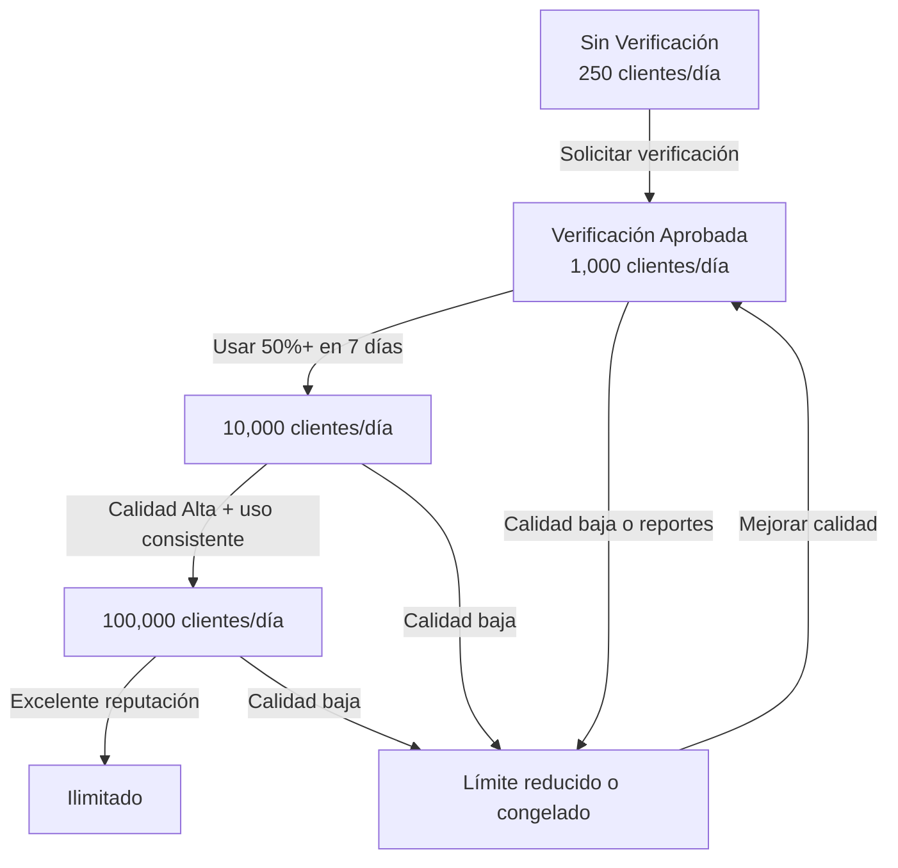

# ¿Es Necesaria la Verificación de Negocio en WhatsApp? Límites y Beneficios

> **En resumen:** La verificación empresarial en la Plataforma de Negocios de WhatsApp es un proceso formal que confirma la autenticidad de tu empresa ante Meta y tus clientes. Las empresas verificadas obtienen señales de confianza más sólidas, un alcance significativamente mejorado y límites de envío de mensajes mucho más altos.

Última actualización: 9 de febrero de 2026

A medida que las empresas exploran las posibilidades de la Plataforma de Negocios de WhatsApp, es esencial comprender las implicaciones de la verificación empresarial. Las actualizaciones recientes han hecho que la verificación empresarial sea opcional para la incorporación, lo que plantea la pregunta sobre su necesidad real. En esta guía, analizamos en profundidad las limitaciones que enfrentan las empresas sin verificación y destacamos los beneficios de optar por la verificación empresarial en WhatsApp.

## Incorporación Sin Verificación Empresarial: Limitaciones Reveladas

Con las actualizaciones recientes, las empresas ahora pueden comenzar a enviar mensajes a los clientes sin verificación empresarial. Sin embargo, sin ella, las empresas enfrentan ciertas limitaciones que pueden afectar sus estrategias de comunicación y compromiso con los clientes.

> En E-SMART360, después de conectar el número de teléfono, el estado de la cuenta de Business Manager no verificada se muestra como **AVAILABLE_WITHOUT_REVIEW**.

### 1. Alcance Limitado a 250 Clientes Únicos

Sin verificación empresarial, las empresas pueden enviar conversaciones iniciadas por la empresa a solo **250 clientes únicos** en un período móvil de 24 horas por número de teléfono. Esta restricción puede dificultar los esfuerzos para llegar a una audiencia más amplia e interactuar con una base de clientes diversa.

Para ponerlo en perspectiva: si tienes una base de datos de 5,000 clientes potenciales, solo podrás contactar al 5% de ellos cada día sin verificación. Para una campaña de lanzamiento de producto o una promoción de temporada, esto representa una barrera significativa.

#### ¿Qué significa en la práctica?

- **Para una tienda en línea:** Solo puedes notificar a 250 clientes sobre ofertas o recordatorios de carrito abandonado por día.
- **Para un restaurante:** Solo puedes enviar menús del día o promociones a 250 comensales diariamente.
- **Para una agencia inmobiliaria:** Solo puedes compartir nuevas propiedades con 250 prospectos cada 24 horas.
- **Para una clínica:** Solo puedes recordar citas a 250 pacientes por día.

### 2. Máximo de 2 Números de Teléfono

Las empresas sin verificación están limitadas a registrar hasta **2 números de teléfono**. Esta limitación puede restringir la escalabilidad de los esfuerzos de comunicación para empresas con operaciones y bases de clientes más grandes.

#### Implicaciones de esta limitación:

- Si tu negocio opera en múltiples regiones o países, necesitarás más de 2 números para segmentar adecuadamente tu comunicación.
- Si deseas separar canales (ventas, soporte, marketing), 2 números pueden no ser suficientes.
- Para agencias que gestionan múltiples marcas, esta limitación hace imposible operar sin verificación.
- La rotación de números se vuelve problemática: si un número se daña por mala reputación, solo te queda uno de respaldo.

> **Consecuencia crítica:** Sin verificación, no solo estás limitado en alcance y números, sino que tampoco puedes acceder a la aprobación de nombre comercial. Esto significa que tus mensajes aparecerán sin un nombre de marca verificado, lo que reduce la tasa de apertura y la confianza del cliente. Los usuarios de WhatsApp son más propensos a ignorar o reportar mensajes de remitentes no identificados.

### Sin Verificación

- Límite: 250 clientes únicos/24h
    - Máximo: 2 números telefónicos
    - Sin nombre comercial aprobado
    - Ideal para pruebas iniciales
  
### Con Verificación

- Desde 1,000 hasta clientes ilimitados
    - Múltiples números telefónicos
    - Nombre comercial aprobado
    - Escalabilidad real del negocio
  
## Beneficios de la Verificación Empresarial

Si bien la verificación empresarial es opcional, desbloquea ventajas significativas que pueden impulsar a las empresas a prosperar en la Plataforma de Negocios de WhatsApp. A continuación, desglosamos cada beneficio en detalle para que puedas evaluar si la verificación es adecuada para tu negocio.

### 1. Alcance Escalable: De 1,000 a Clientes Ilimitados

Al optar por la verificación empresarial, las empresas pueden escalar su alcance de clientes de manera significativa. Las cuentas verificadas pueden iniciar conversaciones con **1,000 clientes únicos** en un período móvil de 24 horas, con el potencial de aumentar a **10,000**, **100,000** o incluso un **número ilimitado** por número de teléfono.

### Nivel 1K (Inicial)

Al alcanzar 1,000 conversaciones diarias, Meta evalúa automáticamente tu cuenta para escalar. Para llegar a este nivel, debes solicitarlo manualmente desde el WhatsApp Manager.
  
### Nivel 10K

Si mantienes una calidad de mensaje Media o Alta, tu límite sube a 10,000 conversaciones por día. Meta verifica que hayas usado al menos la mitad de tu capacidad actual en los últimos 7 días.
  
### Nivel 100K

Con uso constante y buena reputación, alcanzas 100,000 conversaciones diarias. En este nivel, tu negocio ya está operando a gran escala.
  
### Ilimitado

Las cuentas con la mejor calidad de mensaje y volumen consistente pueden llegar a límites ilimitados. Este nivel está reservado para empresas consolidadas con excelente reputación.
  
#### ¿Cómo funciona el escalado automático?

Una vez que alcanzas el límite de 1,000 mensajes por día, Meta puede aumentar automáticamente tu límite si cumples estas condiciones:

1. **Tu número de teléfono debe estar conectado** y activo.
2. **Tu calificación de calidad debe ser Media o Alta.**
3. **Debes estar usando activamente tu límite actual:** en los últimos 7 días, debes haber usado al menos la mitad de tu límite actual.

Si cumples con todos estos criterios, Meta aumentará tu límite un nivel superior en un plazo de 24 horas. Sin embargo, si tu calificación de calidad ha estado en "Marcada" (Flagged) durante los últimos 7 días, tu límite podría disminuir en lugar de aumentar.

> **Dato importante:** El escalado automático significa que no necesitas solicitar manualmente cada aumento. Con una estrategia de mensajería de calidad, tu cuenta crece orgánicamente.

### 2. Respuestas Ilimitadas a Conversaciones Iniciadas por Clientes

Con la verificación empresarial, las empresas pueden proporcionar respuestas rápidas e ilimitadas a las conversaciones iniciadas por los clientes dentro de la ventana de mensajería de 24 horas. Este nivel de capacidad de respuesta fomenta experiencias positivas para el cliente y fortalece las relaciones.

#### ¿Por qué es importante?

- **Sin verificación:** Si un cliente te escribe y superas el límite de 250 conversaciones activas iniciadas por la empresa, tu capacidad de respuesta se ve afectada.
- **Con verificación:** Puedes responder a todos los clientes que te escriban, sin importar cuántos sean, durante la ventana de 24 horas.
- **Atención al cliente escalable:** Ideal para negocios con alto volumen de consultas entrantes.
- **Soporte post-venta:** Los clientes pueden hacer seguimiento de sus pedidos sin restricciones.

### 3. Reconocimiento de Marca Mejorado con Aprobación de Nombre Comercial

La verificación empresarial garantiza la aprobación del nombre comercial, fortaleciendo el reconocimiento de la marca y la confianza entre los clientes. Un nombre comercial aprobado ayuda a los clientes a diferenciar los mensajes oficiales de posibles actividades de spam o fraudulentas.

#### Impacto en las tasas de conversión:

| Indicador | Sin nombre aprobado | Con nombre aprobado |
|-----------|-------------------|-------------------|
| Tasa de apertura | 45-55% | 70-85% |
| Tasa de clics | 8-12% | 18-25% |
| Reportes como spam | Alto riesgo | Mínimo |
| Confianza del cliente | Baja | Alta |

### 4. Acceso a Funciones Avanzadas de la API

La verificación también desbloquea funciones avanzadas que no están disponibles para cuentas no verificadas:

- **Catálogos de productos interactivos** en WhatsApp
- **Plantillas de mensajes multimedia** con imágenes, videos y documentos
- **Integración con sistemas CRM** y herramientas de automatización
- **Notificaciones transaccionales** sin límite de volumen
- **Múltiples agentes o usuarios** gestionando la misma bandeja de entrada
- **Análisis e informes detallados** de rendimiento de campañas

> **Dato clave:** Un nombre comercial verificado no solo aumenta la confianza del cliente, sino que también mejora las tasas de entrega de mensajes, ya que Meta prioriza las cuentas verificadas en sus sistemas.

## El Proceso de Verificación: Guía Paso a Paso

Para obtener la verificación empresarial en la Plataforma de Negocios de WhatsApp, debes seguir un proceso estructurado a través de Meta. Aquí te explicamos cómo hacerlo desde E-SMART360.

### Requisitos Previos

Antes de comenzar el proceso de verificación, asegúrate de cumplir con los siguientes requisitos:

1. **Cuenta de Facebook Business Manager activa:** Si aún no tienes una, puedes crearla desde business.facebook.com. Asegúrate de usar un correo electrónico corporativo y no uno personal.
2. **Número de teléfono conectado a E-SMART360:** Tu número de WhatsApp Business debe estar correctamente vinculado a la plataforma. Si necesitas ayuda, consulta nuestra guía de conexión.
3. **Documentación legal de tu empresa:** Ten a mano todos los documentos que acrediten la existencia legal de tu negocio (certificado de incorporación, licencia comercial, etc.).
4. **Sitio web corporativo activo:** Tu sitio web debe mostrar el nombre legal de la empresa y el logotipo. Los sitios genéricos o sin información de la empresa pueden causar rechazo.
5. **Acceso al Centro de Seguridad:** Debes tener permisos de administrador en el Business Manager para iniciar el proceso.

> **Recomendación:** Antes de iniciar la verificación, verifica que todos tus datos comerciales sean consistentes en todas las plataformas: sitio web, redes sociales, documentos legales y registros fiscales. Cualquier discrepancia puede resultar en un rechazo.

### Paso 1: Accede al Centro de Seguridad

Ve a [business.facebook.com/settings/security](https://business.facebook.com/settings/security) e inicia sesión con tu cuenta de Business Manager. Asegúrate de usar una cuenta con permisos de administrador.
  
### Paso 2: Selecciona tu Cuenta de Negocio

Elige la cuenta de negocio que has configurado para WhatsApp. Esto te llevará a la configuración de cuenta adecuada. Si tienes múltiples cuentas de negocio, selecciona la que corresponde a tu operación de WhatsApp.
  
### Paso 3: Inicia la Verificación

En la sección de Verificación Empresarial, haz clic en el botón **Iniciar Verificación**. Si el botón aparece atenuado o no está visible, puede deberse a:
    - Tu cuenta no tiene los permisos de administrador necesarios
    - Tu Business Manager es demasiado reciente
    - Meta tiene restricciones temporales en tu región
    - Tu cuenta tiene alguna infracción previa
  
### Paso 4: Proporciona los Datos de tu Empresa

Selecciona tu país, ingresa el nombre legal de tu empresa, dirección, número de teléfono y sitio web. **IMPORTANTE:** Estos datos deben coincidir EXACTAMENTE con la información en tus documentos de respaldo. Cualquier variación, por mínima que sea, puede causar el rechazo de tu solicitud.
  
### Paso 5: Elige el Método de Contacto

Selecciona cómo Meta te contactará para la verificación. Puedes elegir entre:
    - **Correo electrónico:** Más rápido, revisa tu bandeja de entrada y la carpeta de spam.
    - **SMS:** Ideal si necesitas una verificación rápida desde el móvil.
    - **Llamada telefónica:** Un representante de Meta te llamará para confirmar los datos.
    - **Verificación de dominio:** Útil si ya tienes tu sitio web verificado en Meta.
    
    **Importante:** Usa un número de teléfono o correo electrónico al que tengas acceso inmediato durante las siguientes 48 horas.
  
### Paso 6: Sube los Documentos de Respaldo

Proporciona los documentos necesarios como tu licencia comercial, certificado de incorporación o estado de cuenta bancario empresarial. Revisa la tabla de documentos aceptados más abajo para asegurarte de que tus documentos cumplen con los requisitos.
  
### Paso 7: Confirma los Datos de Contacto

Revisa que tu información de contacto sea correcta. Cualquier error aquí puede hacer que no recibas el código de verificación. Verifica especialmente:
    - El número de teléfono (con código de país)
    - La dirección de correo electrónico
    - El nombre del contacto responsable
  
### Paso 8: Ingresa el Código de Verificación

Una vez que recibas el código a través del método seleccionado, ingrésalo en el formulario correspondiente. El código tiene un tiempo de expiración, así que ingrésalo tan pronto como lo recibas.
  
### Paso 9: Espera la Aprobación de Meta

Meta revisará tu solicitud y recibirás un correo de confirmación una vez que tu cuenta esté verificada. El proceso puede tardar desde unas horas hasta 30 días. Puedes hacer seguimiento del estado en el Centro de Seguridad.
  
### ¿Qué hacer si el botón "Iniciar Verificación" no aparece?

Si el botón de inicio de verificación está atenuado o no es visible, prueba estas soluciones:

1. **Verifica tus permisos:** Asegúrate de tener rol de administrador en el Business Manager.
2. **Confirma la configuración de tu cuenta:** Revisa que toda la información de tu empresa esté completa en la configuración del Business Manager.
3. **Espera 24-48 horas:** A veces Meta necesita tiempo para procesar la creación de cuentas nuevas.
4. **Contacta al soporte de Meta:** Puedes solicitar ayuda a través del Centro de Ayuda de Facebook Business.
5. **Verifica desde otro navegador o dispositivo:** En ocasiones, problemas de caché o cookies pueden impedir que el botón se muestre correctamente.

### Documentos Aceptados por Meta

### ✅ Documentos Aceptados

- Certificado de Formación o Incorporación (ej: certificado GST)
    - Artículos de Incorporación
    - Licencia y Permisos Comerciales
    - Registro de Impuestos Comerciales
    - Estados de Cuenta Bancarios Empresariales
    - Udyog Aadhaar (UID) / Udyam Certificate
    - Reportes de Crédito Comerciales
    - Facturas de Servicios Públicos
    - Tarjeta PAN
    - Certificado de Establecimiento Comercial
  
### ❌ Documentos NO Aceptados

- Facturas de venta
    - Órdenes de compra
    - Solicitudes auto-completadas
    - Declaraciones de impuestos
    - Estados de cuenta bancarios personales
    - Impresiones de sitio web
    - Folletos, volantes, membretes
  
> **Importante:** Si tus documentos no están en uno de los idiomas compatibles (inglés, español, francés, alemán, portugués, entre otros), debes proporcionar una traducción oficial al inglés con sello certificado de una agencia de traducción.
    
  Asegúrate de que tus documentos sean **claros, legibles y actuales**. Los documentos borrosos, recortados o vencidos resultarán en rechazo.

## Causas Comunes de Rechazo en la Verificación

Si tu solicitud de verificación es rechazada, no te preocupes. Estas son las causas más comunes y cómo solucionarlas.

### 1. Documentación Incorrecta o Incompleta

Los documentos que subas deben contener toda la información requerida. Los detalles en tus documentos deben coincidir exactamente con los que estás intentando verificar. Revisa que incluyan:

- **Nombre legal de la empresa**
- **Dirección física**
- **Número de teléfono**
- **Sitio web**

Si falta alguna de estas informaciones, tu solicitud será rechazada. Además, tu sitio web debe incluir el **nombre legal de tu empresa** y el **logotipo comercial**.

### 2. Idioma No Soportado

Meta solo acepta documentos en ciertos idiomas. Los idiomas compatibles incluyen: árabe, bengalí, inglés, francés, alemán, griego, hebreo, hindi, indonesio, italiano, japonés, coreano, malayo, mandarín, polaco, portugués, ruso, español, tailandés, turco y vietnamita.

### 3. Documentos Ilegibles o Vencidos

Asegúrate de que tus documentos sean claros y actuales. El revisor debe poder verificar toda la información claramente.

### 4. Documentos Adicionales Faltantes

A veces, Meta puede solicitar documentos adicionales para verificar tu negocio. Si esto sucede, asegúrate de enviar los documentos requeridos dentro del **plazo indicado**. No hacerlo puede llevar al rechazo.

### 5. Inconsistencia en la Información

Uno de los errores más comunes pero menos obvios es la inconsistencia de datos. Por ejemplo:

- **Nombre de la empresa:** Si en tus documentos aparece "Tech Solutions S.A.S." pero en el formulario de verificación escribiste "Tech Solutions", esto causará rechazo.
- **Dirección:** La dirección en tus documentos debe coincidir exactamente con la ingresada en el Business Manager.
- **Sitio web:** El dominio de tu sitio web debe mostrar claramente el nombre legal de tu empresa y su logotipo.

### 6. Tipo de Documento Incorrecto

No todos los documentos son aceptados por Meta. Por ejemplo, las facturas de venta, las órdenes de compra y las declaraciones de impuestos personales **no son documentos válidos** para la verificación empresarial. Usa exclusivamente los documentos de la lista de aceptados.

### 7. Nombre del Titular No Coincidente

El nombre del titular que aparece en tu documento de identificación debe coincidir con el nombre de la persona que está solicitando la verificación. Si estás usando el documento de un socio o director, asegúrate de que esa persona sea quien inicie el proceso.

> **Consejo práctico:** Después de corregir los errores comunes, puedes volver a enviar tu solicitud de verificación. Revisa dos veces todos los documentos y asegúrate de que cumplan con los requisitos de Meta para evitar un nuevo rechazo. La mayoría de las empresas logran la verificación en su segundo intento.

### Lista de Verificación Pre-Envío

Antes de enviar tu solicitud de verificación, revisa esta lista:

- [ ] ¿Tu nombre legal de empresa coincide en TODOS los documentos?
- [ ] ¿La dirección física es exacta en todos los documentos?
- [ ] ¿Tu sitio web muestra el nombre legal y logotipo de la empresa?
- [ ] ¿Los documentos son legibles, completos y vigentes?
- [ ] ¿Los documentos están en un idioma compatible o tienen traducción certificada?
- [ ] ¿Tienes acceso inmediato al correo/teléfono de contacto?
- [ ] ¿Tu Business Manager tiene permisos de administrador?
- [ ] ¿La información de tu empresa en Facebook Business Manager está completa?

## Límites de Mensajería y Calidad: Claves para Escalar

Una vez verificada tu cuenta, entender los límites de mensajería y la calidad de tus mensajes es fundamental para escalar tu negocio en WhatsApp. La verificación es solo el primer paso; mantener una buena reputación es lo que realmente te permitirá crecer.

### Cómo Funcionan los Límites de Mensajería

Cuando usas WhatsApp para tu negocio a través de E-SMART360, Meta establece límites sobre cuántas conversaciones puedes iniciar en un período de 24 horas. Estos límites están diseñados para proteger a los usuarios de WhatsApp del spam y garantizar una experiencia de calidad.

Inicialmente, después de la verificación, tu negocio puede abrir hasta **1,000 conversaciones nuevas diarias**. Pero con una estrategia adecuada, puedes escalar a niveles mucho más altos.

#### Tabla de Niveles de Mensajería

| Nivel | Conversaciones por día |¿Cómo se alcanza? | Requisito de calidad |
|-------|----------------------|------------------|---------------------|
| 1,000 | Inicial | Solicitud manual desde WhatsApp Manager | - |
| 10,000 | Automático | Uso del 50%+ del límite actual en 7 días | Media o Alta |
| 100,000 | Automático | Uso consistente + crecimiento gradual | Alta |
| Ilimitado | Automático | Mejor calidad + alto volumen sostenido | Alta sostenida |

### Diferencias Clave entre Verificación y Límites de Mensajería

Es importante entender que la verificación empresarial y los límites de mensajería son conceptos relacionados pero distintos:

- **Sin verificación:** Nunca podrás superar los 250 clientes únicos por día, sin importar la calidad de tus mensajes.
- **Con verificación:** Puedes escalar desde 1,000 hasta ilimitado, pero tu velocidad de escalado depende de la calidad de tus mensajes.
- **Sin calidad:** Una cuenta verificada con mala calidad de mensajes puede ver reducidos sus límites o incluso ser suspendida.

> **Regla de oro:** La verificación abre la puerta, pero la calidad del mensaje determina qué tan lejos puedes llegar.

### El Ciclo de Vida de un Límite de Mensajería

### Cómo Verificar tu Límite de Mensajería

Para monitorear tu límite de mensajería, inicia sesión en tu **WhatsApp Manager** desde E-SMART360:

1. **Antes de alcanzar 1,000 mensajes:** Ve a **Overview > Limits** para rastrear tu límite actual y ver sugerencias sobre cómo aumentarlo.
2. **Después de alcanzar 1,000 mensajes:** Revisa la sección **Account tools > Insights** para ver actualizaciones sobre tu límite de mensajería, incluyendo cualquier aumento del escalado automático.
3. **Monitoreo continuo:** Consulta el panel de **Phone numbers** para ver la calificación de calidad de cada número.

### ¿Qué Sucede si Alcanzas tu Límite?

Si llegas al límite de mensajería del día, no te preocupes. Puedes iniciar más conversaciones tan pronto como algunas de tus conversaciones activas finalicen. La ventana de 24 horas se renueva continuamente, permitiéndote mantener la comunicación con nuevos clientes.

### La Importancia de la Calidad del Mensaje

Meta evalúa la calidad de tus mensajes para determinar tu límite de mensajería. Tu calificación de calidad se basa en cómo interactúan tus destinatarios con tus mensajes. Por ejemplo, si demasiadas personas bloquean o reportan tu negocio, tu calificación de calidad bajará y tus límites se reducirán.

#### ¿Cómo se calcula la calificación de calidad?

La calificación se actualiza en función de los últimos 7 días de actividad e incluye estos factores:

- **Tasa de bloqueos:** Porcentaje de usuarios que bloquean tu número después de recibir un mensaje.
- **Tasa de reportes:** Usuarios que reportan tu número como spam.
- **Tasa de respuesta:** Si los usuarios responden a tus mensajes o los ignoran.
- **Interacciones positivas:** Clics en botones, respuestas a encuestas, uso de cupones.

#### Estados de calidad:

| Estado | Significado | Acción recomendada |
|--------|-------------|-------------------|
| 🟢 Verde (Alta) | Buena reputación | Continúa así, escalarás pronto |
| 🟡 Amarillo (Media) | Ciertas señales mixtas | Revisa frecuencias y contenido |
| 🟠 Naranja (Baja) | Alertas de calidad | Reduce envíos, optimiza mensajes |
| 🔴 Rojo (Marcada/Flagged) | Riesgo de suspensión | Detén campañas, revisa política |

### Buenas Prácticas

**Consentimiento explícito:** Envía solo a personas que hayan aceptado recibir mensajes. El opt-in es obligatorio según la política de Meta.

    **Personalización:** Usa el nombre del cliente y datos relevantes. Los mensajes genéricos tienen tasas de apertura mucho más bajas.

    **Frecuencia moderada:** No envíes más de 2-3 mensajes por semana a menos que sea una conversación activa.

    **Contenido de valor:** Cada mensaje debe aportar algo útil: ofertas, información relevante, recordatorios.

    **Horario adecuado:** Respeta los husos horarios de tus clientes. Evita enviar mensajes entre las 10 PM y 8 AM.

    **Segmentación:** Agrupa a tus contactos por intereses y comportamientos para enviar mensajes relevantes.

    **Medición constante:** Revisa tus métricas de calidad semanalmente para detectar problemas a tiempo.

    **Fácil baja:** Incluye siempre una opción para que los clientes dejen de recibir mensajes.
  
### Malas Prácticas

**Spam sin permiso:** Enviar mensajes a personas que nunca dieron su consentimiento es la forma más rápida de ser reportado.

    **Mensajes masivos genéricos:** Usar el mismo mensaje para toda tu base de datos sin personalización.

    **Saturación:** Enviar múltiples mensajes diarios a los mismos contactos. Esto causa bloqueos masivos.

    **Ignorar bajas:** No procesar las solicitudes de baja o bloqueo puede llevar a la suspensión de tu número.

    **Horarios inadecuados:** Enviar mensajes promocionales a altas horas de la noche o muy temprano.

    **Contenido engañoso:** Usar asuntos o promesas falsas para aumentar la tasa de apertura.

    **Falta de segmentación:** Enviar el mismo mensaje a toda la base sin importar intereses o ubicación.

    **No monitorear métricas:** Ignorar las alertas de calidad hasta que es demasiado tarde.
  
> **Consecuencias de la mala calidad:** Si tu calificación de calidad ha estado en "Flagged" (Marcada) durante los últimos 7 días, tu límite de mensajería puede disminuir automáticamente. En casos extremos, Meta puede suspender tu número de teléfono permanentemente.

## El "Green Tick" de WhatsApp: Verificación de Marca Oficial

Además de la verificación empresarial estándar, existe un nivel superior de verificación: el **Green Tick** (marca de verificación verde) de WhatsApp. Este distintivo aparece junto al nombre de tu empresa en el perfil de WhatsApp y es el máximo símbolo de autenticidad.

### Diferencias entre Verificación Empresarial y Green Tick

| Característica | Verificación Empresarial | Green Tick |
|---------------|-------------------------|------------|
| Propósito | Confirmar legitimidad ante Meta | Confirmar autenticidad ante clientes |
| ¿Se ve en el chat? | No, es interna de Meta | Sí, aparece un badge verde |
| Costo | Gratuito | Puede tener costos asociados |
| Límites de mensajería | Los desbloquea | Los mismos que verificación |
| Proceso | Documentación comercial | Revisión más rigurosa |
| Elegibilidad | Cualquier negocio verificado | Marcas con alto reconocimiento |

### ¿Cómo solicitar el Green Tick?

1. Asegúrate de tener la verificación empresarial completada primero.
2. Accede al **WhatsApp Manager** en tu Business Manager.
3. Ve a la sección de perfil de tu cuenta de WhatsApp.
4. Busca la opción "Solicitar badge oficial" o "Official Business Account".
5. Completa el formulario con información adicional sobre tu marca.
6. Meta revisará tu solicitud y te notificará la decisión.

> **Nota importante:** El Green Tick no es necesario para la mayoría de las empresas. La verificación empresarial estándar es suficiente para desbloquear todos los límites de mensajería y funciones de la API. El Green Tick es un distintivo adicional de prestigio para marcas consolidadas.

Puedes ver la calificación de calidad y el estado de tu número de teléfono en el panel de **WhatsApp Manager > Account tools > Phone numbers**. Esta calificación se actualiza en función de los últimos 7 días de actividad.

## Preguntas Frecuentes sobre la Verificación

### ¿Es obligatorio verificar mi cuenta de WhatsApp Business?

No es obligatorio para comenzar, pero sí necesario si planeas enviar más de 250 mensajes al día o deseas tener un nombre comercial oficial. Sin verificación, tu cuenta permanecerá en un estado "limitado", con un alcance máximo de 250 clientes únicos diarios y restricción a solo dos números de teléfono registrados.

### ¿Qué sucede si no verifico mi negocio en WhatsApp?

Tu cuenta permanecerá en un estado "limitado", con un techo de 250 clientes únicos por día y restringida a solo dos números de teléfono. Además, no podrás acceder a funciones avanzadas como la aprobación del nombre comercial, límites de mensajería superiores o la capacidad de escalar tus operaciones de marketing en WhatsApp.

### ¿Por qué deberían las empresas verificar su cuenta de WhatsApp Business?

La verificación aumenta la confianza del cliente, mejora la tasa de entrega de mensajes y permite acceder a funciones avanzadas como el estado comercial oficial y límites de mensajería más altos. Las empresas verificadas también tienen más probabilidades de aparecer en las búsquedas de directorios de socios de Meta, lo que aumenta su visibilidad.

### ¿Cuánto tiempo tarda la verificación de WhatsApp Business?

La verificación generalmente tarda desde unas pocas horas hasta varios días hábiles, dependiendo de la precisión de la documentación proporcionada a Meta. El plazo máximo oficial es de 30 días. Si tu solicitud es rechazada, puedes corregir los errores y volver a enviarla inmediatamente.

### ¿Puedo usar el mismo número de teléfono para WhatsApp Business App y la API de Cloud?

No. No puedes usar el mismo número de teléfono tanto para la aplicación móvil de WhatsApp Business como para la API de Cloud. Debes elegir una plataforma. Si ya tienes un número en la aplicación móvil, deberás migrarlo o usar un número diferente para la API. E-SMART360 te guía en todo el proceso de migración si es necesario.

## Ejemplos Prácticos de Escalado

### 📈 Ejemplo 1: Incremento a 10K en 2 Días

**Día 1:** Abres 500 conversaciones
    **Día 2:** Abres otras 500 conversaciones
    **Día 3:** Tu límite aumenta a 10,000 conversaciones por día
      
    *Resultado: Escalado rápido con uso intensivo inicial.*
  
### 📊 Ejemplo 2: Incremento a 10K en 5 Días

**Día 1:** Abres 100 conversaciones
    **Día 2:** Abres 200 conversaciones
    **Día 3:** Abres 200 conversaciones
    **Día 4:** Abres 300 conversaciones
    **Día 5:** Tu límite aumenta a 10,000
      
    *Resultado: Escalado progresivo con crecimiento constante.*
  
### 🏪 Ejemplo 3: Tienda en Línea Verificada

Una tienda de comercio electrónico con verificación:
    - Envía confirmaciones de pedido automáticas
    - Notifica actualizaciones de envío
    - Responde reclamos sin límite
    - Alcanza 50,000 clientes en campañas promocionales
      
    *Todo esto es imposible sin la verificación empresarial.*
  
## Casos de Uso y Escenarios Recomendados

### ¿Cuándo es Imprescindible la Verificación?

| Escenario | Recomendación |
|-----------|---------------|
| Campañas de marketing con más de 250 contactos | Verificación necesaria |
| Atención al cliente con alto volumen | Verificación necesaria |
| Notificaciones transaccionales (pedidos, facturas) | Verificación necesaria |
| Pruebas iniciales con pocos clientes | Sin verificación es suficiente |
| Negocio con un solo número y poco volumen | Sin verificación puede funcionar |
| Agencia gestionando múltiples cuentas | Verificación imprescindible |

### Después de la Verificación

Una vez que tu Meta Business Manager está verificado, estás listo para comenzar tus campañas. Recuerda revisar tu límite de mensajería, que ahora se basa en la reputación de tu número de teléfono más que en el estado de verificación.

> **¿Tu solicitud fue rechazada?** No te preocupes. Corrige los errores comunes mencionados en esta guía —documentación incorrecta, documentos incompletos, idioma no soportado o documentos ilegibles— y vuelve a enviar tu solicitud. La mayoría de las empresas logran la verificación en su segundo intento.

## Conclusión: Tomando una Decisión Informada

Si bien las empresas pueden comenzar a enviar mensajes a los clientes sin verificación empresarial, es crucial reconocer las limitaciones que conlleva. El límite de 250 clientes únicos y la restricción a 2 números de teléfono pueden plantear desafíos para las empresas que buscan expandir su alcance y esfuerzos de participación.

Al optar por la verificación empresarial, las empresas pueden superar estas limitaciones y acceder a una serie de beneficios, que incluyen un mayor alcance de clientes, respuestas ilimitadas a conversaciones iniciadas por clientes y un mejor reconocimiento de marca.

En última instancia, la decisión de solicitar la verificación empresarial en la Plataforma de Negocios de WhatsApp debe basarse en las necesidades y objetivos únicos de cada empresa. Comprender las implicaciones de la verificación y su potencial de crecimiento puede permitir a las empresas tomar una decisión informada que se alinee con sus estrategias de comunicación y objetivos de participación del cliente.

La Plataforma de Negocios de WhatsApp ofrece un canal valioso para que las empresas se conecten con los clientes, y la verificación empresarial sirve como puerta de entrada para desbloquear todo su potencial.

## Migración: De WhatsApp App a Business API (Cloud API)

Si actualmente usas la aplicación WhatsApp Business en tu teléfono y deseas migrar a la API en la nube (Cloud API) para acceder a funciones avanzadas, el proceso de migración requiere pasos adicionales.

### Pasos para la Migración

1. **Crea tu cuenta en E-SMART360** si aún no lo has hecho.
2. **Conecta tu número de teléfono** siguiendo el proceso de Embedded Signup.
3. **Elimina el número de la aplicación móvil** de WhatsApp Business antes de conectarlo a la API. No puedes usar el mismo número en ambas plataformas simultáneamente.
4. **Espera la desactivación:** Una vez que elimines el número de la app móvil, puede tomar hasta 24 horas para que el número esté disponible para la API.
5. **Completa la verificación empresarial** siguiendo los pasos descritos en esta guía.
6. **Configura tu primer flujo de automatización** en E-SMART360.

> **Precaución:** Durante la migración, perderás el historial de chats de la aplicación móvil. Asegúrate de exportar cualquier conversación importante antes de eliminar el número de la app.

## Preguntas Frecuentes Adicionales

### ¿Puedo verificar mi negocio si soy una empresa unipersonal o autónomo?

Sí, los autónomos y empresas unipersonales también pueden verificar su negocio. Necesitarás documentos como tu registro fiscal, licencia comercial o certificado de actividad. En algunos países, el documento de identidad nacional puede ser suficiente si está vinculado a tu actividad comercial. Consulta la documentación de Meta para tu país específico.

### ¿Qué hago si mi verificación fue rechazada varias veces?

Si has intentado la verificación múltiples veces sin éxito, te recomendamos:
  1. Revisar cuidadosamente que TODOS los datos coincidan exactamente entre documentos y formulario.
  2. Asegurarte de que tu sitio web muestre claramente el nombre legal y logotipo de tu empresa.
  3. Verificar que los documentos no estén vencidos y sean legibles.
  4. Contactar al soporte de Meta directamente para entender la razón específica del rechazo.
  5. Considerar usar un servicio de verificación asistida si el proceso se vuelve problemático.

### ¿La verificación expira? ¿Necesito renovarla?

La verificación empresarial no tiene una fecha de expiración fija, pero Meta puede requerir una reverificación periódica si detecta cambios en tu información comercial o si han pasado varios años desde la verificación inicial. Si realizas cambios importantes en tu empresa (nombre, estructura legal, dirección), es recomendable actualizar tu información en el Business Manager para evitar problemas.

### ¿Puedo tener múltiples negocios verificados en un solo Business Manager?

Sí, un solo Business Manager puede gestionar múltiples cuentas de negocio verificadas. Sin embargo, cada cuenta de negocio debe pasar por su propio proceso de verificación. Esto es especialmente útil para agencias que gestionan varias marcas o para empresas con múltiples líneas de negocio independientes.

### ¿Qué diferencia hay entre la verificación de Business Manager y la verificación de WhatsApp Business?

La verificación de **Business Manager** es el proceso descrito en esta guía: acreditas la legitimidad de tu empresa ante Meta para desbloquear límites de mensajería. La verificación de **WhatsApp Business** (a veces llamada "Green Tick") es un badge visual que aparece en el perfil de WhatsApp. Primero debes completar la verificación de Business Manager; el Green Tick es un paso opcional posterior para marcas establecidas.

### ¿Puedo usar E-SMART360 sin verificar mi negocio?

Sí, puedes usar E-SMART360 sin verificación empresarial. La plataforma funciona con cuentas en estado AVAILABLE_WITHOUT_REVIEW. Sin embargo, estarás limitado a 250 clientes únicos por día y 2 números de teléfono. E-SMART360 te notificará cuando sea momento de considerar la verificación en función de tu volumen de mensajes.

### Recursos adicionales sobre verificación y límites de mensajería

- **Guía de inicio rápido:** [Cómo empezar a enviar mensajes en la Plataforma de Negocios de WhatsApp](/recursos/inicio-rapido-whatsapp-business)
  - **Documentación oficial de Meta sobre límites:** [Límites de mensajería de WhatsApp Business](https://developers.facebook.com/docs/whatsapp/messaging-limits)
  - **Ayuda de Facebook para empresas:** [Cómo empezar a enviar mensajes](https://www.facebook.com/business/help/2640149499569241)
  - **Guía completa para usuarios de chatbot WhatsApp:** [Guía para usuarios de chatbot](/recursos/guia-completa-chatbot-whatsapp)
  - **Soporte técnico de E-SMART360:** [Centro de ayuda](/recursos/soporte)
  - **Guía de calidad de mensajes de WhatsApp:** [Cómo mantener una buena reputación](/recursos/calidad-mensajes-whatsapp)
  - **Precios y facturación de la API de WhatsApp:** [Entendiendo los costos de conversación](/recursos/costos-api-whatsapp)
