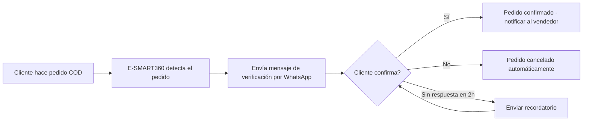
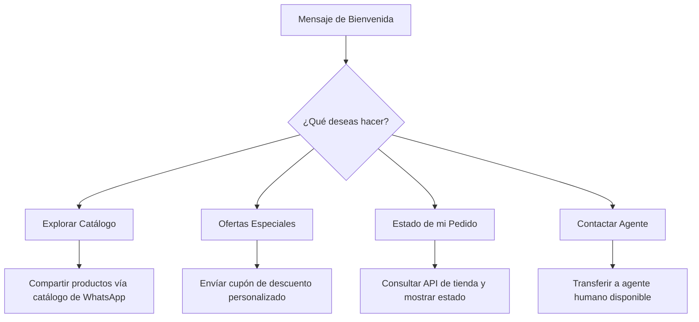

# Marketing en WhatsApp y Telegram: La Guía Completa

En la era digital actual, las empresas buscan constantemente nuevas formas de conectar con sus clientes y hacer crecer su audiencia. Una de las formas más efectivas de lograrlo es a través de los chatbots. Los chatbots son programas impulsados por inteligencia artificial que pueden simular conversaciones con usuarios humanos. Se pueden utilizar para una variedad de propósitos, como brindar servicio al cliente, responder preguntas e incluso realizar ventas.

> **TL;DR:** E-SMART360 es una plataforma integral que unifica la gestión de marketing en WhatsApp y Telegram. Ofrece automatización inteligente, campañas masivas, constructor visual de chatbots sin código, bandeja compartida para equipos, integraciones con ecommerce y CRMs, y una escalabilidad sin complicaciones técnicas. Con más de 2 mil millones de usuarios en WhatsApp y 900 millones en Telegram, nunca ha habido un mejor momento para automatizar tu comunicación.

*Última actualización: 29 de marzo de 2026*

---

## ¿Qué es E-SMART360?

E-SMART360 es una plataforma que ayuda a las empresas a crear y gestionar chatbots para WhatsApp y Telegram. Ofrece una amplia gama de funcionalidades diseñadas para cubrir todas las necesidades de comunicación digital de un negocio moderno.

> ### Puntos Clave de Venta
- **Sin recargos ocultos:** Sin márgenes adicionales en los costos de la API de WhatsApp. Pagas solo los cargos reales según la tarifa oficial de Meta.
- **API Oficial y Segura:** Nunca te preocupes por ser bloqueado. Utilizamos la API oficial de WhatsApp Business, garantizando el cumplimiento de todas las políticas.

### 1. Constructor Visual de Chatbots por Arrastrar y Soltar

Permite crear chatbots fácilmente, incluso si no tienes experiencia en programación. La interfaz visual te permite diseñar flujos de conversación completos conectando bloques de manera intuitiva.

### ¿Qué tipo de flujos puedes crear?

Puedes diseñar flujos de atención al cliente, secuencias de ventas, bots de calificación de leads, bots de soporte técnico, encuestas interactivas y mucho más. Cada flujo se construye conectando bloques visuales sin escribir una sola línea de código.

### 2. Chat en Vivo (Bandeja Compartida)

- **Monitoreo de Conversaciones:** La funcionalidad de chat en vivo es crucial para observar y supervisar las interacciones entre usuarios y chatbots. Sin esta función, resulta difícil revisar las conversaciones que ocurren.
- **Intervención de Agentes Humanos:** En situaciones donde el chatbot tenga dificultades o se requiera una respuesta más personalizada, un agente humano puede intervenir a través del chat en vivo, tomando el control de la conversación.
- **Soporte en Tiempo Real:** El chat en vivo facilita la asistencia inmediata a los clientes, permitiendo resolver sus inquietudes de forma rápida y efectiva.

> La bandeja compartida permite que múltiples agentes de tu equipo gestionen conversaciones simultáneamente. Puedes asignar chats específicos a agentes concretos, establecer prioridades y ver el historial completo de cada cliente.

### 3. Broadcasting (Transmisiones Masivas)

Envía mensajes dirigidos a los suscriptores de tus bots de WhatsApp y Telegram cuando necesites comunicar un mensaje promocional. Las transmisiones pueden segmentarse por etiquetas, historial de interacciones o datos personalizados.

> **Consejo:** Segmenta tu audiencia antes de enviar broadcasts. Envía mensajes diferentes a leads nuevos, clientes recurrentes y usuarios inactivos para maximizar la relevancia y las conversiones.

### 4. Automatización

Automatiza tareas como responder preguntas frecuentes y calificar leads haciendo preguntas y obteniendo respuestas. La automatización funciona 24/7 sin intervención humana.

### Configura tu primer flujo automatizado

Dentro del panel de E-SMART360, dirígete a la sección de Bots y selecciona "Crear Nuevo Bot". Elige un nombre descriptivo y selecciona el canal (WhatsApp, Telegram o ambos).

### Diseña las respuestas automáticas

Usa el constructor visual para agregar bloques de preguntas y respuestas. Puedes incluir texto, imágenes, botones y menús. Conecta cada posible respuesta del usuario al siguiente bloque.

### Configura la captura de leads

Agrega bloques de captura de datos como nombre, correo electrónico o teléfono. Estos datos se almacenan automáticamente y pueden enviarse a tu CRM o Google Sheets.

### Activa y monitorea

Publica tu bot y supervisa su rendimiento desde el panel de análisis. Revisa las conversaciones donde el bot no pudo ayudar y ajusta los flujos según sea necesario.

### 5. Integraciones

Conecta E-SMART360 con otro software, como sistemas CRM y plataformas de email marketing, para recolectar correos electrónicos a través del chatbot y enviarlos directamente a tu proveedor de servicios de correo.

| Integración | Propósito | Beneficio Clave |
|---|---|---|
| **WooCommerce** | Gestión de pedidos y pagos | Verificación instantánea de pedidos contra reembolso |
| **Shopify** | Notificaciones de tienda | Notificaciones de pedidos en tiempo real |
| **Zapier** | Automatización multiplataforma | Conecta con miles de apps sin código |
| **Google Sheets** | Datos de suscriptores | Envío masivo desde hojas de cálculo |
| **API HTTP** | Integración personalizada | Comunicación con cualquier sistema externo |
| **WhatsApp Flows** | Formularios interactivos | Captura datos directamente en el chat |
| **WPForms / Elementor** | Formularios WordPress | Activa mensajes automáticos al recibir envíos |
| **Pabbly / Make / N8N** | Automatización avanzada | Conecta con cientos de herramientas adicionales |

### 6. Automatización de Ecommerce

¡La verificación se vuelve muy sencilla! E-SMART360 confirma instantáneamente los pedidos de Shopify y WooCommerce a través de WhatsApp, eliminando los pedidos falsos y aumentando la confianza del cliente. Configuración sencilla, mensajes personalizables y automatización sin complicaciones agilizan tu flujo de trabajo.

**Cómo funciona la verificación de pedidos:**

Los clientes simplemente hacen clic en un botón para verificar los pedidos contra reembolso, ahorrándote tiempo y dolores de cabeza. Esta función elimina los pedidos falsos que tanto afectan a las tiendas en línea.

### 7. Gestión de Grupos de Telegram

E-SMART360 optimiza la gestión de grupos de Telegram con funciones como:

- **Filtrado de spam en tiempo real:** Detecta y elimina automáticamente mensajes no deseados.
- **Controles granulares de mensajes:** Restringe el envío de ciertos tipos de contenido.
- **Tareas automatizadas:** Programa mensajes de bienvenida, reglas y recordatorios.
- **Información sobre la actividad de los usuarios:** Ve quién es más activo, quién se unió recientemente y más.
- **Reglas de moderación personalizables:** Define tus propias reglas para mantener el orden.
- **Atención al cliente receptiva:** Los miembros pueden contactar al soporte directamente desde el grupo.

> Con E-SMART360 obtienes lo mejor de ambos mundos: comunicación sin esfuerzo y automatización potente. Permite a los administradores crear comunidades bien organizadas y atractivas. ¡Ahora sal y conquista tus metas digitales!

---

## ¿Por Qué tu Negocio Necesita E-SMART360?

E-SMART360 ofrece varias ventajas para tus esfuerzos de marketing en WhatsApp y Telegram. A continuación, exploramos en detalle cada beneficio:

### Alcance Masivo sin Precedentes

WhatsApp cuenta con más de 2.000 millones de usuarios activos mensuales en todo el mundo, mientras que Telegram supera los 900 millones. Juntos, representan el canal de comunicación más grande del planeta. Con E-SMART360 llegas a ambos desde una sola plataforma, maximizando tu alcance sin duplicar esfuerzos.

### Tasas de Apertura que Superan el 98%

Mientras que el email marketing promedia tasas de apertura del 20-30%, los mensajes de WhatsApp alcanzan consistentemente tasas superiores al 98%. Los mensajes de Telegram tampoco se quedan atrás. Esto significa que tu mensaje no solo llega, sino que es visto y leído por casi todos tus contactos.

### Personalización a Escala

Los chatbots de E-SMART360 pueden personalizar cada interacción usando el nombre del cliente, su historial de compras, preferencias y comportamiento previo. Puedes crear flujos que ofrezcan recomendaciones de productos basadas en compras anteriores, envíen felicitaciones de cumpleaños con descuentos exclusivos, o sugieran productos complementarios.

### Disponibilidad Absoluta 24/7/365

Mientras tu equipo duerme, E-SMART360 sigue trabajando. Responde preguntas frecuentes, procesa pedidos, califica leads y brinda soporte a cualquier hora del día o de la noche, los 365 días del año. Esto significa que nunca perderás una oportunidad de venta por no estar disponible.

### Rentabilidad Incomparable

El costo por contacto en WhatsApp y Telegram es significativamente menor que el de los canales tradicionales como email marketing, SMS o publicidad pagada. Además, al automatizar respuestas y procesos, reduces la carga de trabajo de tu equipo de soporte, permitiéndoles enfocarse en tareas de mayor valor.

### Analítica y Reportes Detallados

Accede a análisis completos sobre entrega de mensajes, tasas de lectura, respuestas de clientes y efectividad de campañas. Genera informes detallados para evaluar el rendimiento de tus estrategias y utiliza los datos obtenidos para refinar y mejorar continuamente tus campañas de marketing.

> ### Tipos de Mensajes en la API de WhatsApp
Es fundamental entender los tipos de mensajes que maneja la plataforma para utilizarlos correctamente:

- **Mensajes Entrantes:** Cualquier mensaje que tu cliente te envía. Cada mensaje entrante abre una ventana de 24 horas para responder sin necesidad de usar plantillas.
- **Mensajes Salientes:** Mensajes que envías dentro de la ventana de servicio al cliente de 24 horas. Esta ventana se reinicia cada vez que el cliente te envía un mensaje nuevo, dándote otras 24 horas para responder.
- **Mensajes con Plantilla (Template):** Para iniciar una nueva conversación o responder fuera de la ventana de 24 horas, necesitas usar una plantilla de mensaje preaprobada por Meta. Las plantillas pueden ser de tipo marketing, utilidad o autenticación.

---

## Comienza con E-SMART360: Formas Sencillas de Potenciar tu Negocio

Los chatbots de E-SMART360 están diseñados para negocios en WhatsApp y Telegram, lo que los convierte en una excelente opción para cualquier industria. E-SMART360 simplifica el proceso para que cualquier negocio pueda destacar en WhatsApp y Telegram, ¡incluso si no eres un experto en tecnología!

### Ventajas Clave para Empezar

- **Sin necesidad de código:** Crea chatbots con la facilidad de arrastrar y soltar. No necesitas un equipo de desarrolladores ni conocimientos de programación.
- **Sé creativo con tus mensajes:** Envía imágenes, videos, GIFs, documentos PDF y audios para mantener a tus clientes enganchados y hacer tus campañas más atractivas.
- **Mantente conectado con tus leads:** Cultiva relaciones a lo largo del tiempo con secuencias automatizadas de seguimiento que nutren a tus prospectos hasta que estén listos para comprar.
- **Transmite en WhatsApp y Telegram simultáneamente:** Llega a miles de personas al instante con broadcasts ilimitados, todo desde una sola interfaz.
- **Inteligente y personalizado:** Los chatbots aprenden de los usuarios y ofrecen interacciones a medida, mejorando con cada conversación.

### Cómo empezar con E-SMART360 en 4 Pasos

### Regístrate en la plataforma

Ve al sitio web de E-SMART360 y crea una cuenta gratuita. El proceso de registro toma menos de 2 minutos. No necesitas tarjeta de crédito para empezar.

### Conecta tus canales

Vincula tu número de WhatsApp Business y/o tu bot de Telegram a la plataforma. El asistente de configuración te guiará paso a paso. Para WhatsApp, puedes conectar mediante Embedded Signup o usando la API de Meta.

### Crea tu primer chatbot

Usa el constructor visual de arrastrar y soltar para diseñar tu primer flujo de conversación. Comienza con algo simple: un mensaje de bienvenida, respuestas a preguntas frecuentes y una opción para contactar a un agente humano.

### Prueba y publica

Antes de lanzar, prueba tu chatbot desde la vista previa. Verifica que todas las respuestas sean correctas y que los flujos funcionen como esperas. Luego, publícalo y comienza a recibir interacciones.

> Para obtener instrucciones detalladas sobre cómo crear un bot de Telegram y conectarlo a E-SMART360, consulta nuestra guía específica. También tenemos tutoriales paso a paso para la configuración de WhatsApp Cloud API.

Hay muchos recursos disponibles para ayudarte, incluyendo tutoriales en video, documentación completa, foros de la comunidad y soporte técnico especializado.

### ¿Qué incluye la documentación de E-SMART360?

La documentación incluye guías paso a paso para configurar cada canal (WhatsApp, Telegram, Facebook Messenger, Instagram, Webchat), tutoriales en video, artículos sobre resolución de problemas, guías de integración con WooCommerce, Shopify, Zapier, Google Sheets y más. También encontrarás casos de uso, ejemplos prácticos y las mejores prácticas recomendadas para cada industria.

### ¿Cuánto tiempo toma configurar un chatbot básico?

Un chatbot básico con mensaje de bienvenida y respuestas a 5-10 preguntas frecuentes puede estar listo en menos de 30 minutos. Los flujos más complejos con múltiples ramificaciones, integraciones y lógica condicional pueden tomar algunas horas, pero siempre dentro del constructor visual sin necesidad de programación.

---

## WhatsApp Business API vs WhatsApp Business App: ¿Cuál Necesitas?

No todas las versiones de WhatsApp funcionan igual para tu negocio. Si estás usando la versión equivocada, probablemente estés haciendo demasiado trabajo manual mientras otros negocios crecen más rápido usando automatización, soporte en equipo y herramientas de IA.

### WhatsApp Messenger (Uso Personal)

La aplicación original para chatear con amigos y familiares. Más de 2 mil millones de usuarios globalmente. Es rápida, segura y fácil de usar. Con WhatsApp Messenger puedes enviar mensajes privados, compartir notas de voz, hacer llamadas de voz o video y chatear en grupos. Pero **no tiene herramientas para negocios**. No puedes configurar respuestas automáticas, gestionar mensajes en equipo ni enviar mensajes masivos. Solo funciona con un número en un teléfono.

### WhatsApp Business App (Pequeños Negocios)

Creada para pequeñas y medianas empresas por Meta. Funciona como el WhatsApp normal pero con características adicionales: perfil de negocio con dirección, horario y descripción; respuestas rápidas para mensajes comunes; etiquetas para organizar chats (como "nuevo cliente" o "pedido completado"); y mensajes automáticos de bienvenida o ausencia. Sin embargo, **solo funciona en un teléfono y un número**. Es ideal para negocios muy pequeños, pero se queda corta al escalar.

### WhatsApp Business API (Negocios en Crecimiento)

Para empresas que necesitan gestionar muchos chats a la vez. No viene con su propia app, sino que se conecta a herramientas como CRM, software de helpdesk o plataformas como E-SMART360. Con la API, las empresas pueden enviar respuestas automáticas, asignar chats a diferentes miembros del equipo, ejecutar campañas de mensajes a gran escala, usar chatbots con IA, integrar catálogos de productos y mucho más. Para los clientes, la experiencia es la misma: los mensajes llegan a su chat normal de WhatsApp. Pero detrás de escena, las empresas tienen mucho más poder para organizar, automatizar y escalar sus conversaciones.

### Tabla Comparativa Rápida

| Plataforma | Ideal para | Funciones Clave | Limitaciones |
|---|---|---|---|
| **WhatsApp Messenger** | Uso personal | Chats simples, gratis, llamadas | Sin herramientas empresariales |
| **WhatsApp Business App** | Negocios pequeños/locales | Perfil comercial, respuestas rápidas, etiquetas | Solo un teléfono, funciones limitadas, sin API |
| **WhatsApp Business API** | Negocios en crecimiento/grandes | Chat en equipo, automatización, CRM, chatbots IA, catálogos | Requiere configuración inicial y aprobación de Meta |

---

## Beneficios Clave de la API de WhatsApp Business para Negocios en Crecimiento

La versión API ayuda a tu negocio a crecer sin perder el toque personal. A continuación, exploramos en detalle cada beneficio:

### 1. Automatización Inteligente

Los chatbots responden a los clientes automáticamente, manejan muchos mensajes a la vez y envían chats al miembro del equipo adecuado cuando es necesario. También puedes configurar la detección de clientes frustrados o enojados y transferirlos automáticamente a un agente humano para una atención más personalizada.

> Configura palabras clave como "queja", "cancelar", "hablar con persona" o "reclamo" para activar la transferencia inmediata a un agente humano. Esto asegura que los casos sensibles reciban atención prioritaria.

### 2. Recorridos de Chat Personalizados

Los chatbots pueden guiar a los clientes a través de procesos completos: reservar una cita, realizar una compra, solicitar soporte técnico o dar seguimiento a un pedido, todo dentro de WhatsApp. Esto ahorra tiempo y brinda una experiencia fluida al cliente.

### 3. Conversaciones Enriquecidas

Envía imágenes, videos, botones interactivos, listas de opciones, documentos, catálogos de productos y formularios, no solo texto plano. Esto hace que las conversaciones sean más rápidas, atractivas y efectivas.

### 4. Recorrido Completo del Cliente

Usa WhatsApp para todo el ciclo de vida del cliente: desde la captación de leads con anuncios Click-to-WhatsApp, pasando por la calificación y seguimiento automatizado, hasta el soporte postventa y la fidelización. Personaliza cada paso con automatización.

### 5. Múltiples Campañas Simultáneas

Inicia varias campañas de marketing o soporte a la vez. Segmenta tu audiencia por comportamiento, ubicación, historial de compras o cualquier dato personalizado. Envía el mensaje correcto a la persona correcta en el momento adecuado.

### 6. Integración con Anuncios de Facebook e Instagram

Convierte tus anuncios en conversaciones instantáneas de WhatsApp. Cuando un usuario hace clic en tu anuncio, se abre automáticamente un chat de WhatsApp con tu negocio. Esto genera leads más calificados y acelera el ciclo de ventas.

### 7. Conexión con tus Herramientas Existentes

Enlaza WhatsApp con tu CRM, plataforma de email marketing, helpdesk o cualquier otra herramienta que uses. Tu equipo ve todos los chats y datos de clientes en un solo lugar, eliminando la necesidad de cambiar entre múltiples aplicaciones.

### 8. Soporte Multilingüe con IA

Habla con los clientes en su propio idioma utilizando herramientas de inteligencia artificial. Puedes entrenar asistentes de IA con la información de tu negocio para que respondan preguntas en múltiples idiomas, ayudándote a expandir tu negocio a nuevos mercados.

---

## E-SMART360 Hace que la API de WhatsApp sea Fácil y Accesible

Ya sea que estés comenzando o creciendo rápidamente, elegir la configuración correcta de WhatsApp te ayuda a brindar un mejor servicio y crecer más rápido.

### Campañas Masivas Personalizadas

Envía mensajes a miles de personas en minutos. Usa variables personalizadas como el nombre del cliente, su última compra o su ubicación. Organiza tus contactos por listas de difusión y obtén aprobación rápida para tus plantillas de mensajes a través del gestor integrado.

### Soporte Automatizado 24/7

Usa chatbots sin necesidad de codificación para responder preguntas comunes, capturar leads y brindar ayuda ininterrumpida. Los chatbots pueden manejar cientos de conversaciones simultáneamente, algo que sería imposible para un equipo humano.

### Integración con tus Herramientas Favoritas

Conecta con CRMs, Shopify, WooCommerce, Google Sheets, Zapier, Pabbly, Make y más. Sin necesidad de conocimientos técnicos. La plataforma viene con conectores preconstruidos para las herramientas más populares.

### Chatbots con Inteligencia Artificial

Entrena asistentes de IA con la información de tu negocio: sitio web, FAQs, catálogo de productos, documentos PDF. Los asistentes responderán preguntas de forma clara, precisa e instantánea, aprendiendo y mejorando con cada interacción.

### Análisis y Seguimiento de Resultados

Accede a informes detallados con métricas de entrega, lectura, clics y conversiones. Segmenta tu audiencia basándote en su comportamiento y envía mensajes de seguimiento automatizados para mejorar tus resultados con menos esfuerzo manual.

---

## Estrategias Avanzadas de Marketing con Chatbots

### Secuencias de Ventas Automatizadas

Las secuencias de ventas te permiten enviar una serie de mensajes programados a tus leads y clientes sin intervención manual. Por ejemplo:

### Secuencia de Bienvenida

1. **Día 0:** Mensaje de bienvenida con oferta de introducción
2. **Día 3:** Tip útil relacionado con tu producto/servicio
3. **Día 7:** Caso de éxito o testimonio de cliente
4. **Día 14:** Oferta especial con descuento por tiempo limitado

### Secuencia de Carrito Abandonado

1. **1 hora después:** Recordatorio amistoso del carrito abandonado
2. **24 horas después:** ¿Necesitas ayuda con tu compra?
3. **3 días después:** Oferta de envío gratis para completar el pedido
4. **7 días después:** Última oportunidad con cupón de descuento

### Secuencia de Reactivación

1. **30 días sin actividad:** "Te extrañamos" — novedades y contenido relevante
2. **60 días sin actividad:** Encuesta rápida de 1 pregunta
3. **90 días sin actividad:** Oferta de "regreso" con descuento exclusivo

### Broadcasting con Datos Variables

Puedes enviar mensajes masivos personalizados usando datos de tu Google Sheets o CRM. Por ejemplo, puedes enviar un mensaje como:

> "Hola {{nombre}}, tu pedido {{pedido_id}} está en camino. Fecha estimada de entrega: {{fecha_entrega}}. ¡Gracias por confiar en nosotros!"

E-SMART360 reemplazará automáticamente cada variable con los datos correspondientes de cada destinatario, logrando una personalización uno a uno a escala masiva.

---

## Casos de Uso Prácticos y Ejemplos Reales

### Caso 1: Tienda de Ropa en Línea — Aumento de Ventas Recurrentes

Una tienda de ropa implementó E-SMART360 para automatizar sus campañas de marketing. Usando la segmentación por etiquetas, enviaban ofertas especiales a clientes que habían comprado en los últimos 30 días y mensajes de reactivación a usuarios inactivos.

**Flujo del bot de atención al cliente:**

**Resultados obtenidos:**
- **32% más de ventas recurrentes** en los primeros 3 meses.
- **45% de reducción** en consultas básicas al equipo de soporte.
- **Tasa de apertura del 99%** en campañas broadcast.

### Caso 2: Restaurante con Sistema de Reservas Automatizado

Un restaurante local configuró un bot de WhatsApp para gestionar reservas completamente. Los clientes seleccionaban fecha, hora y número de comensales directamente en el chat a través de botones interactivos.

**Flujo del bot de reservas:**

1. El cliente envía "Reservar" al número de WhatsApp del restaurante.
2. El bot pregunta: "¿Para cuántas personas?" (opciones: 1-2, 3-4, 5-6, 6+).
3. El bot muestra un calendario interactivo para seleccionar la fecha.
4. El cliente selecciona la hora deseada de las disponibles.
5. El bot confirma la reserva y envía un resumen con todos los detalles.
6. **2 horas antes:** El bot envía un recordatorio automático.
7. El cliente puede confirmar, modificar o cancelar respondiendo al recordatorio.

**Resultados obtenidos:**
- **Reducción del 45% en ausencias** gracias a los recordatorios automáticos.
- **20% más de reservas** al estar disponibles 24/7 para recibir reservas.
- **Ahorro de 15 horas semanales** del personal que antes gestionaba reservas por teléfono.

### Caso 3: Agencia Inmobiliaria — Calificación Automática de Leads

Una agencia inmobiliaria implementó un chatbot en WhatsApp para calificar leads automáticamente antes de pasarlos a los agentes de ventas.

**Proceso automatizado:**
1. El lead llega a través de un anuncio Click-to-WhatsApp o escanea un código QR.
2. El chatbot saluda y pregunta: "¿Estás buscando comprar o alquilar?"
3. Según la respuesta, hace preguntas específicas: presupuesto, zona, número de habitaciones, plazo.
4. El chatbot registra todas las respuestas en el CRM de la agencia vía API.
5. Asigna una calificación al lead (A: listo para comprar, B: interesado, C: explorando).
6. Los leads tipo A se asignan inmediatamente al agente correspondiente.
7. Los leads tipo B y C entran en una secuencia de nurturing automatizada.

**Resultados:** 60% más de conversiones y agentes dedicados solo a leads calificados.

---

## Preguntas Frecuentes

### ¿Puedo gestionar marketing de WhatsApp y Telegram en un solo lugar?

Sí. E-SMART360 proporciona un panel de control unificado que te permite crear bots, enviar transmisiones y gestionar suscriptores tanto de WhatsApp como de Telegram simultáneamente, todo desde una sola interfaz. Esto elimina la necesidad de usar herramientas separadas para cada canal.

### ¿Cuáles son los beneficios de usar un bot de Telegram para marketing?

Los bots de Telegram permiten transmisiones ilimitadas a suscriptores (sin límite de plantillas como en WhatsApp), atención al cliente automatizada y la capacidad de manejar grupos comunitarios grandes sin las restricciones del SMS tradicional. Telegram también ofrece canales públicos y grupos con hasta 200,000 miembros. Además, los bots de Telegram pueden interactuar en grupos, moderar contenido y ejecutar comandos personalizados.

### ¿E-SMART360 es una plataforma sin código?

Absolutamente. E-SMART360 está diseñado para que profesionales del marketing y dueños de negocios construyan flujos de automatización potentes para WhatsApp y Telegram usando una interfaz visual sin necesidad de programación. No se requieren conocimientos técnicos ni de desarrollo. Todo se hace mediante arrastrar, soltar y configurar opciones.

### ¿Cómo ayuda E-SMART360 a mejorar la participación de la audiencia?

Con funciones como automatización de campañas, personalización de mensajes con variables (nombre, última compra, ubicación), bandeja compartida para equipos de soporte y análisis detallados de comportamiento, E-SMART360 ayuda a los equipos a enviar mensajes altamente dirigidos que aumentan las tasas de respuesta y conversiones. La segmentación inteligente asegura que cada mensaje llegue a la audiencia correcta.

### ¿Qué diferencia hay entre un mensaje saliente y uno con plantilla en WhatsApp?

Un mensaje saliente se envía dentro de la ventana de 24 horas que se abre cuando un cliente te escribe. Puedes responder libremente con cualquier contenido. Un mensaje con plantilla se usa para **iniciar** una conversación o cuando han pasado más de 24 horas desde el último mensaje del cliente. Las plantillas deben ser preaprobadas por Meta y pueden ser de tipo marketing, utilidad, autenticación o servicio.

### ¿Puedo integrar E-SMART360 con mi CRM actual?

Sí. E-SMART360 se integra con cientos de herramientas a través de Zapier, Pabbly, Make, N8N, API HTTP y webhooks personalizados. Puedes enviar datos de leads, historial de conversaciones, actualizaciones de estado y respuestas de formularios directamente a tu CRM, sistema de tickets, plataforma de email marketing o cualquier otra aplicación que uses.

### ¿Qué tipos de contenido multimedia puedo enviar a través de los chatbots?

E-SMART360 soporta el envío de imágenes (JPG, PNG, GIF), videos (MP4), documentos (PDF, DOC, XLS), audios, stickers, GIFs animados, botones clickables con acciones (CTA), listas interactivas con varias opciones, catálogos de productos con imágenes y precios, formularios de WhatsApp Flows y mucho más. Todo directamente dentro de la conversación.

### ¿Cuánto cuesta usar la API de WhatsApp Business a través de E-SMART360?

E-SMART360 no aplica márgenes adicionales en los costos de la API de WhatsApp. Pagas solo los cargos reales según las tarifas oficiales de Meta, que varían según el país y el tipo de conversación (iniciada por el negocio o por el usuario). El precio de la suscripción a E-SMART360 cubre las funciones de la plataforma, mientras que los costos de conversación de WhatsApp se pagan directamente según el uso real.

### ¿Es seguro usar E-SMART360? ¿Cumple con las políticas de WhatsApp?

Sí. E-SMART360 utiliza la API oficial de WhatsApp Business, garantizando el cumplimiento total de todas las políticas y lineamientos de Meta. Esto significa que tu número de WhatsApp no será baneado por usar la plataforma. Además, toda la comunicación está cifrada y los datos de tus clientes se manejan de forma segura.

---

## Conclusión

E-SMART360 es una plataforma potente que puede ayudar a negocios de todos los tamaños a mejorar sus esfuerzos de marketing en WhatsApp y Telegram. Sus beneficios clave son:

- **Fácil de usar:** Diseñado para quienes no tienen experiencia en programación. La interfaz visual de arrastrar y soltar hace que la creación de chatbots sea accesible para cualquier persona.
- **Asequible:** Variedad de planes de precios para ajustarse a tu presupuesto, sin costos ocultos ni márgenes adicionales en la API de WhatsApp.
- **Escalable:** Crece junto con tu negocio. Desde un pequeño negocio local hasta una gran empresa con múltiples equipos y canales, E-SMART360 se adapta a tus necesidades.

> E-SMART360 ha ganado rápidamente la confianza de cientos de negocios. Elogiada por su facilidad de uso, funciones potentes y soporte excepcional, es la plataforma que necesitas si quieres adelantarte a la competencia y llevar tu marketing conversacional al siguiente nivel.

### ¿Listo para Empezar?

Regístrate hoy para una prueba gratuita y descubre cómo E-SMART
---

## Diferencias entre Marketing en WhatsApp y Telegram

Aunque E-SMART360 unifica ambos canales en una sola plataforma, es importante entender las diferencias clave entre WhatsApp y Telegram para aprovechar al máximo cada uno:

### WhatsApp: Ideal para Comunicación Masiva y Soporte

- **Alcance masivo:** 2.000+ millones de usuarios activos mensuales.
- **Tasas de apertura superiores al 98%** — prácticamente garantizado que tu mensaje será visto.
- **Catálogo de productos integrado:** Muestra tus productos directamente en el chat con imágenes, precios y descripciones.
- **Pagos en WhatsApp:** Acepta pagos directamente dentro de la conversación.
- **Anuncios Click-to-WhatsApp:** Convierte tráfico publicitario directamente en conversaciones.

### Limitaciones de WhatsApp a considerar

- Las plantillas de mensajes deben ser aprobadas por Meta antes de usarse.
- No puedes iniciar conversaciones sin plantillas aprobadas.
- Existen topes de mensajes según el nivel de calidad de tu número.
- Los mensajes de marketing tienen límites de frecuencia (frequency capping).

### Telegram: Ideal para Comunidades y Contenido

- **Sin límites de plantillas:** Puedes enviar cualquier mensaje sin necesidad de aprobación previa.
- **Grupos de hasta 200.000 miembros:** Ideal para comunidades grandes.
- **Canales públicos:** Transmite contenido a seguidores ilimitados.
- **Bots más flexibles:** Pueden interactuar dentro de grupos, moderar contenido y ejecutar comandos.
- **Sin costos de conversación:** No hay tarifas por mensaje como en WhatsApp API.

### Limitaciones de Telegram a considerar

- Menos usuarios que WhatsApp (900 millones vs 2.000 millones), aunque sigue siendo muy grande.
- No tiene un sistema de catálogo de productos nativo como WhatsApp.
- No ofrece pagos integrados en la conversación.
- La percepción del usuario puede ser más informal que WhatsApp Business.

---

## Configuración del Perfil de WhatsApp Business

Antes de comenzar a enviar mensajes, es fundamental configurar correctamente tu perfil de WhatsApp Business. Un perfil completo y profesional genera confianza en tus clientes.

### Configura la información del negocio

Desde el panel de E-SMART360, accede a la configuración de WhatsApp Business Profile. Completa:
- **Nombre del negocio:** Debe coincidir con tu marca registrada o nombre comercial.
- **Descripción:** 2-3 líneas explicando qué hace tu negocio.
- **Dirección:** La ubicación física de tu negocio.
- **Correo electrónico:** Un correo de contacto válido.
- **Sitio web:** La URL de tu página principal.
- **Horario de atención:** Los días y horas en que respondes mensajes.
- **Categoría:** Selecciona la categoría que mejor describa tu negocio.

### Sube tu foto de perfil

Usa el logo de tu empresa o una foto profesional que represente tu marca. La imagen debe ser cuadrada y de alta calidad (mínimo 640x640 píxeles).

### Verifica tu negocio (opcional pero recomendado)

Solicita la verificación de tu negocio con Meta para obtener el distintivo verde de verificación. Esto aumenta la confianza de los clientes y te permite acceder a límites de mensajes más altos.

---

## Cómo Crear Campañas de Broadcasting Efectivas

Las campañas de broadcasting son una de las herramientas más poderosas de E-SMART360. Aquí tienes una guía paso a paso para crear campañas que realmente conviertan:

### Paso 1: Segmenta tu Audiencia

No envíes el mismo mensaje a todos tus contactos. Crea segmentos basados en:
- **Comportamiento de compra:** Clientes recurrentes, compradores por primera vez, carritos abandonados.
- **Nivel de engagement:** Activos (respondieron en los últimos 7 días), inactivos (30+ días sin abrir).
- **Ubicación geográfica:** Clientes locales, nacionales o internacionales.
- **Intereses:** Basados en productos vistos o categorías de interés.

### Paso 2: Crea una Plantilla de Mensaje Atractiva

Las plantillas de mensaje deben ser aprobadas por Meta antes de su uso. Sigue estas mejores prácticas:

- **Sé conciso:** WhatsApp permite hasta 1024 caracteres en mensajes de marketing, pero los mensajes cortos (60-80 caracteres) tienen mejores tasas de clics.
- **Incluye un CTA claro:** Usa botones de "Comprar ahora", "Ver oferta", "Más información" para guiar al usuario.
- **Personaliza con variables:** Usa {{nombre}}, {{ciudad}}, {{ultima_compra}} para hacer cada mensaje único.
- **Añade valor:** Ofrece descuentos exclusivos, contenido gratuito o información útil.

### Ejemplo de plantilla de mensaje para promoción

**Asunto:** Oferta especial para {{nombre}} 🎉

Hola {{nombre}}, gracias por ser parte de nuestra comunidad.

Por tiempo limitado, tenemos un **{{descuento}}% de descuento** en {{categoria_producto}}.

👉 Usa el código: {{codigo_cupon}}

Ofertas válidas hasta el {{fecha_limite}}.

[Botón: Ver Ofertas]
[Botón: Comprar Ahora]

### Paso 3: Programa el Envío en el Momento Óptimo

Los mejores días y horas para enviar mensajes de marketing en WhatsApp son:
- **Martes a jueves:** Entre 10:00 y 12:00, o entre 14:00 y 16:00.
- **Evita:** Lunes por la mañana (la gente está ocupada), fines de semana tarde/noche (tiempo personal) y horarios nocturnos.
- **Prueba A/B:** Envía el mismo mensaje a diferentes segmentos en distintos horarios y mide cuál funciona mejor.

### Paso 4: Mide y Optimiza

Después de cada campaña, revisa las métricas clave:
- **Tasa de entrega:** ¿Cuántos mensajes llegaron realmente?
- **Tasa de lectura:** ¿Cuántos destinatarios abrieron el mensaje?
- **Tasa de clics:** ¿Cuántos hicieron clic en los botones?
- **Tasa de conversión:** ¿Cuántos completaron la acción deseada?
- **Tasa de bajas:** ¿Cuántos se dieron de baja?

> Si tu tasa de bajas supera el 2%, revisa la frecuencia de tus envíos y la relevancia de tu contenido. Demasiados mensajes pueden hacer que los usuarios se cansen y bloqueen tu número.

---

## Gestión de Suscriptores: Importación y Segmentación

E-SMART360 te permite importar y gestionar tus suscriptores de múltiples formas:

### Importar Suscriptores Manualmente

Puedes agregar contactos uno por uno desde el panel de gestión de suscriptores. Esta opción es ideal para negocios con pocos clientes o para agregar leads calificados manualmente.

### Importar Suscriptores desde CSV

Para listas grandes, usa la importación por archivo CSV. El archivo debe incluir columnas como:
- **Número de teléfono** (obligatorio, con código de país)
- **Nombre** (opcional)
- **Correo electrónico** (opcional)
- **Etiquetas** (opcional, para segmentación)
- **Campos personalizados** (opcional, datos específicos de tu negocio)

### Importar desde Google Sheets

Conecta tu Google Sheets a E-SMART360 y sincroniza automáticamente los datos de tus suscriptores. Cualquier cambio en tu hoja de cálculo se refleja en la plataforma.

### Segmentación por Etiquetas y Campos Personalizados

Una vez importados, puedes asignar etiquetas y campos personalizados a tus suscriptores para segmentarlos:

- **Etiquetas:** "cliente-VIP", "lead-frio", "carrito-abandonado", "newsletter-suscriptor"
- **Campos personalizados:** Fecha de nacimiento, preferencia de producto, ciudad, monto de última compra

> Usa campos personalizados para enviar mensajes hiperpersonalizados. Por ejemplo, puedes enviar un mensaje de cumpleaños automático con un descuento especial usando el campo {{fecha_cumpleaños}}.

---

## Solución de Problemas Comunes

### Mensajes No Entregados

Si tus mensajes no se están entregando, verifica:

1. **¿El número del destinatario tiene WhatsApp?** No todos los números tienen WhatsApp activo.
2. **¿El destinatario ha optado por no recibir mensajes?** Si alguien bloqueó tu número, los mensajes no se entregarán.
3. **¿Estás dentro de la ventana de 24 horas?** Los mensajes fuera de la ventana requieren plantillas aprobadas.
4. **¿Has alcanzado el límite de mensajes?** Revisa tu tier de mensajería en el panel de E-SMART360.

### Plantillas Rechazadas

Si tus plantillas de mensajes son rechazadas por Meta, las causas más comunes son:

- **Contenido engañoso:** Promesas que no puedes cumplir o información falsa.
- **Falta de un mecanismo de exclusión:** Debes incluir una opción clara para que los usuarios dejen de recibir mensajes.
- **Idioma incorrecto:** La plantilla debe estar en el idioma correcto para el país del destinatario.
- **Formato inválido:** Los botones y variables deben seguir el formato exacto requerido por Meta.

### ¿Cómo apelar una plantilla rechazada?

Desde el panel de E-SMART360, puedes ver el motivo del rechazo de cada plantilla. Corrige el problema señalado y vuelve a enviarla para revisión. Si el rechazo persiste y crees que es un error, puedes contactar al soporte de Meta a través de tu administrador de negocios para apelar la decisión.

---

## Recursos Adicionales

Para profundizar en temas específicos, consulta nuestras guías detalladas:

- Configuración de WhatsApp Cloud API paso a paso
- Cómo crear plantillas de mensaje para WhatsApp
- Integración de WooCommerce con E-SMART360
- Recuperación de carritos abandonados en Shopify
- Cómo entrenar un asistente de IA con FAQs y documentos
- Configuración de secuencias de ventas automatizadas
- Guía de migración de otro proveedor a E-SMART360

Cada una de estas guías está disponible en nuestra sección de documentación y te proporciona instrucciones detalladas con capturas de pantalla y ejemplos prácticos.

---

## Conclusión Final

E-SMART360 es la solución definitiva para negocios que quieren aprovechar el poder del marketing conversacional en WhatsApp y Telegram. Con su constructor visual sin código, automatización inteligente, integraciones con las principales plataformas de ecommerce y análisis detallados, cualquier negocio puede crear una estrategia de comunicación multicanal efectiva sin necesidad de grandes inversiones técnicas.

> **¿Listo para transformar tu comunicación?** Regístrate hoy en E-SMART360 y comienza a automatizar tu marketing en WhatsApp y Telegram. La prueba gratuita te permite explorar todas las funciones sin compromiso.
