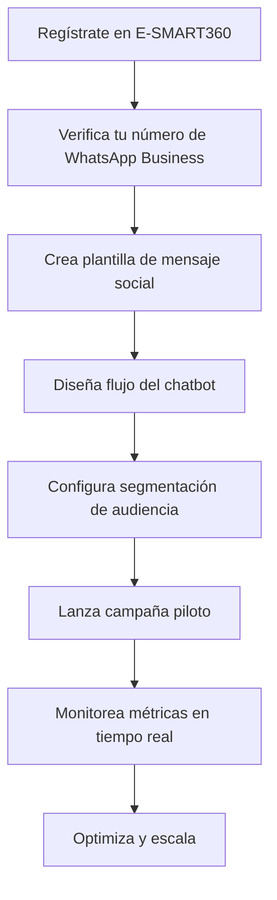

> E-SMART360 prioriza la Responsabilidad Social Corporativa (RSC) en áreas como **Responsabilidad Ambiental, Educación y Desarrollo de Habilidades, Salud y Bienestar, Apoyo Comunitario y Social, Tecnología para el Bien, Cultura Deportiva y Desarrollo Juvenil**, así como **Negocios Éticos y RSC en el Lugar de Trabajo**. Durante la pandemia de COVID-19, pusimos en práctica estos valores destinando un porcentaje significativo de nuestros ingresos a apoyar a las familias más vulnerables, demostrando que el éxito empresarial y la responsabilidad social pueden —y deben— ir de la mano. Esta guía detalla nuestra experiencia, el impacto generado y cómo otras empresas pueden replicar este modelo de solidaridad.

## Resumen Ejecutivo

En los momentos más críticos de la pandemia de COVID-19, E-SMART360 tomó la decisión consciente de destinar recursos para apoyar a quienes más lo necesitaban. A través de una campaña de descuentos del 60% en nuestro software, logramos dos objetivos simultáneamente: hacer nuestras soluciones más accesibles para los clientes en tiempos difíciles y generar fondos para ayudar a familias que habían perdido sus ingresos. Esta experiencia definió nuestro enfoque de responsabilidad social y sentó las bases para programas futuros que continúan hasta el día de hoy.

### 💰 Fase 1: 160 Familias Beneficiadas

Durante la primera fase del programa, 160 familias recibieron asistencia económica directa. Los pagos se entregaron con total discreción y respeto, siguiendo estrictos protocolos sanitarios. Cada familia recibió el dinero necesario para cubrir sus necesidades básicas durante las semanas más críticas del confinamiento. El proceso de selección fue cuidadoso y priorizó a aquellos que más lo necesitaban pero que no se atrevían a pedir ayuda.

### 📈 Fase 2: 50 Familias Adicionales

Al ver el impacto positivo y la retroalimentación de la comunidad, extendimos la ayuda a 50 familias adicionales en una segunda fase. Esto elevó el total a 210 familias beneficiadas, demostrando nuestro compromiso continuo más allá de una asistencia única. Cada familia recibió seguimiento para asegurar que la ayuda llegara efectivamente a cubrir sus necesidades más apremiantes.

## El Contexto: La Crisis que lo Cambió Todo

La pandemia de COVID-19 no fue únicamente una crisis de salud global. Cambió vidas, trastornó economías enteras y reveló las profundas vulnerabilidades de nuestros sistemas socioeconómicos en todo el mundo. En países como Bangladesh, donde E-SMART360 tiene una presencia significativa y un profundo arraigo comunitario, las consecuencias se manifestaron de forma inmediata y devastadora. Millones de personas perdieron sus empleos de la noche a la mañana, las cadenas de suministro se rompieron y los sistemas de protección social resultaron insuficientes para contener la magnitud de la crisis.

> **El impacto económico en cifras:** Innumerables personas perdieron sus fuentes de ingresos de la noche a la mañana. Trabajadores informales, conductores de transporte público, empleadas domésticas, vendedores ambulantes y jornaleros —sectores que representan una porción masiva de la fuerza laboral en economías emergentes— se quedaron sin la capacidad de mantener a sus familias. El confinamiento, aunque necesario desde el punto de vista sanitario, paralizó los medios de subsistencia de millones de personas. Según estimaciones de organismos internacionales, más de 100 millones de personas cayeron en la pobreza extrema durante el primer año de la pandemia a nivel global.

En E-SMART360 comprendimos desde el principio que la innovación por sí sola no era suficiente como empresa de tecnología. Necesitábamos servir a la comunidad que nos había apoyado durante nuestro crecimiento. Para nosotros, la responsabilidad social corporativa no es un añadido opcional en los informes anuales —es la esencia misma de lo que hacemos como organización. Esta convicción nos llevó a actuar con rapidez y determinación cuando la crisis golpeó con mayor fuerza.

### Reconocimiento de la crisis

Identificamos que la pandemia no solo afectaría la salud pública, sino que tendría consecuencias económicas catastróficas para las poblaciones más vulnerables. Decidimos actuar de inmediato, sin esperar a que la situación empeorara aún más. El análisis inicial nos mostró que el impacto sería especialmente severo en los trabajadores informales, que constituyen una gran parte de la fuerza laboral en las economías en desarrollo.

### Diseño de la estrategia

Planeamos una iniciativa de doble propósito: ofrecer descuentos significativos en nuestro software para ayudar a los negocios a mantenerse operativos, y simultáneamente generar fondos de ayuda directa para familias. La estrategia incluyó un análisis detallado de nuestra capacidad financiera, los recursos disponibles y la mejor manera de maximizar el impacto con los recursos que podíamos destinar.

### Comunicación transparente

Compartimos públicamente nuestro plan, informando a cada cliente que parte de su compra durante la campaña se destinaría a apoyar a personas afectadas por la pandemia. Esta transparencia fue fundamental para generar confianza y demostrar que nuestro compromiso social iba más allá de las declaraciones de buenas intenciones.

### Ejecución y distribución

Identificamos a las familias más necesitadas a través de redes comunitarias, verificamos sus situaciones y distribuimos la ayuda directamente en sus hogares. El proceso de distribución fue cuidadosamente planeado para maximizar el alcance y minimizar cualquier riesgo sanitario o de seguridad.

## De Pie Frente a las Luchas Invisibles

La pandemia de COVID-19 no fue únicamente una crisis de salud. Cambió vidas, trastornó economías y reveló las vulnerabilidades de nuestros sistemas socioeconómicos. En Bangladesh, donde E-SMART360 tiene presencia y arraigo comunitario, las consecuencias se manifestaron de inmediato. Innumerables personas perdieron sus fuentes de ingresos y, con ello, la capacidad de mantener a sus familias. Detrás de cada cifra estadística hay una historia real de sacrificio, incertidumbre y esperanza.

En E-SMART360 comprendimos desde el principio que la innovación por sí sola no era suficiente como empresa de tecnología en desarrollo. Necesitábamos servir a la comunidad también. Para nosotros, la responsabilidad social corporativa no es un añadido, sino la esencia misma de lo que hacemos. Esta filosofía no surgió con la pandemia —ha sido parte de nuestro ADN corporativo desde nuestros inicios, guiando nuestras decisiones y nuestra relación con las comunidades donde operamos.

## Unidos en Tiempos de Crisis: El Compromiso de E-SMART360

Cuando la pandemia golpeó, tomamos la decisión deliberada de redirigir parte de nuestros recursos hacia quienes los necesitaban desesperadamente. No fue una decisión fácil desde el punto de vista financiero, pero era la decisión correcta desde el punto de vista humano. Creemos firmemente que las empresas tienen la responsabilidad de ser un pilar de apoyo para sus comunidades, especialmente en los momentos más difíciles.

### Convertimos Nuestros Ingresos en Alivio

Durante marzo y abril, dos de los meses más desafiantes económicamente de la pandemia, hicimos un compromiso público que definió nuestra respuesta como empresa. Este compromiso no fue solo una declaración de intenciones, sino una acción concreta respaldada por recursos tangibles.

**Nuestra promesa fue clara y mensurable:**

- El **5% de todos los ingresos totales** generados por E-SMART360 durante marzo y abril fue destinado íntegramente a programas de ayuda directa para familias afectadas por la crisis.
- Además, lanzamos una **campaña especial con un 60% de descuento** en todo nuestro software vendido a través de nuestro sitio web oficial. El **20% de los ingresos** generados por esta campaña se destinó específicamente a respaldar a personas cuya supervivencia financiera estaba en grave riesgo.

> **Lección aprendida:** La transparencia fue clave en esta iniciativa. Informamos a cada cliente que adquirió software durante esta campaña que parte de su pago se utilizaría para apoyar a personas afectadas por la pandemia. Su confianza nos permitió seguir adelante. Esta lección de transparencia es aplicable a cualquier empresa que quiera implementar programas similares de responsabilidad social. Cuando los clientes entienden el impacto social de sus compras, se convierten en participantes activos de la iniciativa.

Esta iniciativa de doble propósito permitió que nuestros clientes obtuvieran soluciones tecnológicas esenciales a precios más accesibles durante la incertidumbre económica, mientras contribuían simultáneamente a una causa social significativa. Fue un círculo virtuoso donde la tecnología, los negocios y la solidaridad se entrelazaron para crear un impacto mayor que la suma de sus partes individuales.

## Detrás de Cada Lucha Silenciosa Hay una Necesidad Real

Un aspecto distintivo de nuestra iniciativa fue el enfoque en un grupo demográfico particular que rara vez recibe atención en programas de ayuda tradicionales: personas en situación de extrema dificultad económica que no quieren o no pueden buscar ayuda debido al riesgo percibido para su dignidad y posición social. Estas son personas que han trabajado toda su vida, que contribuyen activamente a la economía y la sociedad, pero que en momentos de crisis quedan invisibilizadas porque el orgullo y la vergüenza les impiden tender la mano.

### El Desafío de la Localización

Localizar a estas personas fue todo un desafío que requirió un enfoque innovador y sensible. Implementamos un proceso de varias etapas:

1. **Identificación a través de líderes comunitarios** y redes de confianza que conocían íntimamente las realidades de sus vecindarios.
2. **Verificación discreta** de la situación de cada familia, sin exposición pública ni registros que pudieran comprometer su privacidad.
3. **Priorización de los casos más urgentes** basada en criterios objetivos de necesidad y vulnerabilidad.
4. **Contacto respetuoso y confidencial**, asegurando que cada persona entendiera que la ayuda no era caridad, sino un gesto de solidaridad comunitaria.

Gradualmente, logramos encontrar a muchas personas que encajaban en esta descripción: personas en necesidad urgente que nunca habían pedido ayuda, que sufrían en silencio por vergüenza o por miedo al estigma social. Fue un recordatorio conmovedor de que las crisis económicas no afectan a todos por igual, y que los más vulnerables son a menudo los que menos se quejan.

### Restaurando la Esperanza

Nuestra intención nunca fue ofrecer caridad en el sentido tradicional. Este esfuerzo se centró en restaurar la esperanza y la dignidad de personas que habían sido trabajadoras productivas y que, por circunstancias completamente fuera de su control, se encontraban en una situación desesperada. Para estas personas, la falta de trabajo no se debía a una elección personal o a una falta de esfuerzo. Simplemente habían quedado rezagadas por los mecanismos de protección de la sociedad. Esta restauración, sentimos, debía ofrecerse no como una ayuda paternalista, sino como un deber de responsabilidad compartida entre todos los miembros de la comunidad empresarial y social. El objetivo era recordarles que no estaban solos y que su contribución a la sociedad era valorada y reconocida.

## Entregamos Cada Ayuda con Dignidad y Cuidado

Organizamos cuidadosa y sensiblemente las distribuciones de efectivo a las familias seleccionadas. Cada aspecto de la entrega fue planeado meticulosamente para asegurar que el proceso fuera seguro, respetuoso y eficiente. Seguimos todas las directrices sanitarias recomendadas por las autoridades de salud globales y locales.

> **Nuestros principios fundamentales de entrega:**

- **😷 Protección Sanitaria:** Uso obligatorio de mascarillas, mantenimiento de distancia segura, evitación de aglomeraciones y entrega de la ayuda directamente en las puertas de los beneficiarios. Cada interacción siguió estrictamente los protocolos COVID-19 para proteger tanto a los beneficiarios como a los miembros del equipo. No se permitió ninguna excepción a estas reglas.
- **🔒 Discreción Total:** No publicitamos ni hicimos pública la identidad de los beneficiarios. Era esencial proteger su dignidad social y evitar cualquier tipo de estigmatización. Creemos firmemente que la ayuda más efectiva es aquella que se realiza sin fanfarria ni reconocimiento público.
- **🤝 Cortesía y Respeto:** Ofrecimos nuestra ayuda no como caridad, sino como una compensación justa por una relación laboral interrumpida por circunstancias fuera del control de nadie. Este enfoque permitió que los beneficiarios mantuvieran su dignidad y autoestima intactas.
- **📋 Confidencialidad Absoluta:** Todas las interacciones se manejaron con la máxima privacidad. No se compartió información personal de los beneficiarios con terceros, y no se mantuvieron registros públicos que pudieran identificar a las familias asistidas.
- **✅ Verificación de Impacto:** Realizamos seguimiento posterior para confirmar que la ayuda había llegado efectivamente a cubrir las necesidades más apremiantes de cada familia, y para evaluar si se requería apoyo adicional.

### Resultados de la Fase 1

Durante la primera fase del programa, 160 familias se beneficiaron de pagos directos en efectivo. Cada familia recibió una cantidad suficiente para cubrir sus necesidades básicas durante varias semanas. La selección de estas 160 familias se realizó tras evaluar más de 400 solicitudes potenciales identificadas a través de nuestras redes comunitarias, asegurando que los recursos llegaran a quienes más los necesitaban. La respuesta de la comunidad fue abrumadoramente positiva, no solo por el alivio financiero, sino por el gesto de solidaridad y reconocimiento de su valor como miembros de la sociedad.

### Resultados de la Fase 2

Al ver la retroalimentación positiva y los beneficios continuos para la comunidad, procedimos con una segunda fase que extendió la ayuda a 50 familias adicionales. Esta expansión reflejó nuestro compromiso de no limitarnos a una asistencia única. Había un compromiso genuino de nuestra parte para extender el apoyo mientras fuera necesario, especialmente para aquellas familias que no podían generar ingresos a través del trabajo debido a las restricciones de la pandemia.

> **Dato clave:** El total combinado de 210 familias beneficiadas representa un impacto directo en aproximadamente 1,000 personas, considerando el tamaño promedio de los hogares en las comunidades atendidas (aproximadamente 4.7 personas por hogar). Cada una de estas personas pudo acceder a alimentos, medicinas y necesidades básicas durante las semanas más críticas de la pandemia. El efecto multiplicador de esta ayuda se extendió más allá de las familias directas, ya que muchos beneficiarios compartieron recursos con vecinos y familiares también afectados por la crisis.

## Nuestra Convicción: El Progreso Compartido Requiere Responsabilidad Compartida

En E-SMART360 seguimos una máxima rectora que guía todas nuestras decisiones empresariales y sociales: una sociedad es más fuerte cuando apoya a cada uno de sus contribuyentes, particularmente en tiempos de crisis. Los conductores de rickshaw, las empleadas domésticas, los vendedores ambulantes y los jornaleros que perdieron temporalmente la capacidad de trabajar son miembros fundamentales de la sociedad. Ellos no buscaban limosnas ni favores; se les había dado la oportunidad de trabajar, y simplemente les proporcionamos lo que merecían como compensación por su contribución a la comunidad durante tiempos más prósperos.

> *"El cambio auténtico no proviene de grandes gestos aislados de organizaciones individuales, sino de la combinación de muchas personas y empresas que toman acciones pequeñas pero significativas en el momento adecuado. Nuestra modesta contribución fue un intento de restaurar el equilibrio en una comunidad que nos había apoyado durante nuestro propio crecimiento."*

Reconocemos que la brecha socioeconómica es profunda y que la pandemia la ensanchó aún más. Aunque entendemos lo modesta que fue nuestra contribución frente a una crisis tan abrumadora, nos gusta pensar que el cambio auténtico proviene de la amalgama de diversos individuos y organizaciones que toman acciones pequeñas pero significativas. Nuestra modesta iniciativa fue un intento de restaurar el equilibrio, y esperamos que inspire a otras empresas a hacer lo mismo.

## Cada Contribución Cuenta

La recuperación de una crisis de esta magnitud no puede ser responsabilidad de una sola entidad, ya sea gubernamental, empresarial o comunitaria. Se requiere un esfuerzo coordinado de todos los sectores de la sociedad. Hacemos un llamado a todas las empresas en funcionamiento y a las personas financieramente estables para que hagan su parte:

### 🏢 Para Empresas: Apoyo a Empleados

Ayuda a tus empleados si están pasando por dificultades. Ofrece apoyo financiero directo, flexibilidad laboral, recursos adicionales como alimentos o vales de compra, y programas de bienestar emocional. Cada empresa, sin importar su tamaño, puede marcar la diferencia en la vida de sus colaboradores. Implementa políticas de emergencia que protejan a los trabajadores más vulnerables durante las crisis.

### 🤝 Para Profesionales: Solidaridad en Red

Apoya a un colega que esté pasando por un mal momento. Un gesto de solidaridad dentro de tu red profesional puede tener un impacto significativo en la vida de alguien. Comparte oportunidades laborales, ofrece mentoría, o simplemente brinda apoyo emocional. Las redes profesionales sólidas son redes de seguridad informales que pueden marcar la diferencia entre la supervivencia y la ruina para muchas personas.

### 🌍 Para la Comunidad: Acción Colectiva

Respaldar grupos comunitarios y organizaciones locales. Ninguna acción es demasiado pequeña cuando se suma al esfuerzo colectivo. Las donaciones a bancos de alimentos, fondos de emergencia y redes de apoyo comunitario son formas efectivas de contribuir. El voluntariado, aunque sea unas horas a la semana, también genera un impacto significativo cuando se multiplica a través de la participación de muchas personas.

> **Un llamado permanente a la acción:** Así como nosotros redirigimos recursos durante la pandemia, cada negocio puede encontrar su propia manera de contribuir. No se necesita una crisis global para marcar la diferencia. El apoyo continuo a la comunidad, la transparencia en las operaciones y el compromiso con el bienestar social deberían ser pilares de cualquier empresa responsable, sin importar su sector o tamaño. La responsabilidad social no debería ser reactiva —activada solo por emergencias— sino una práctica constante, planificada y presupuestada como cualquier otra área estratégica del negocio.

## Cómo la Filosofía de E-SMART360 Impulsa el Compromiso Social

Nuestra plataforma de automatización de chatbots y marketing en WhatsApp no solo impulsa negocios, sino que también sirve como vehículo para generar un impacto positivo en la sociedad. Creemos firmemente en la tecnología como herramienta para el bien social, y cada característica de nuestra plataforma está diseñada con esta filosofía en mente. Al ofrecer soluciones accesibles, transparentes y sin márgenes ocultos en los costos de la API de WhatsApp, permitimos que pequeñas y medianas empresas crezcan, creando un efecto multiplicador en sus comunidades.

### Nuestra Plataforma y su Impacto Social

Nuestra plataforma incluye múltiples herramientas que pueden ser utilizadas para fines sociales y comunitarios:

- **API Oficial de WhatsApp Business:** Conexión segura y confiable, sin riesgo de bloqueos por uso no autorizado. Ideal para organizaciones que necesitan comunicarse de manera confiable con sus comunidades.
- **Automatización de Flujos de Trabajo:** Crea workflows automatizados para comunicaciones sociales, como recordatorios de citas médicas, información sobre campañas de vacunación o seguimiento de programas de asistencia.
- **Plantillas de Mensajes Pre-aprobadas:** Usa plantillas oficiales para campañas educativas y de concientización que cumplen con todas las regulaciones de WhatsApp.
- **Segmentación Avanzada de Audiencia:** Llega a las personas correctas con el mensaje adecuado basado en ubicación, intereses, comportamientos previos y datos demográficos. Esto maximiza la relevancia y efectividad de las comunicaciones.
- **Análisis y Reportes en Tiempo Real:** Mide el impacto de tus campañas sociales con métricas precisas de entrega, lectura y respuesta. Genera informes detallados para evaluar la efectividad de tus programas.
- **WhatsApp Flows (Formularios Interactivos):** Recolecta datos para programas de asistencia de manera eficiente y segura, sin que los usuarios tengan que salir de WhatsApp.
- **Integración con Google Sheets y Otras Herramientas:** Automatiza la sincronización de datos entre tu plataforma de gestión social y tus comunicaciones por WhatsApp.
- **Soporte Técnico 24/7:** Nuestro equipo está siempre disponible para ayudar a organizaciones benéficas y sociales a maximizar el uso de la plataforma.

## Los Siete Pilares de Responsabilidad Social Corporativa de E-SMART360

### Pilar 1: 🌱 Responsabilidad Ambiental

Apoyamos iniciativas ecológicas como ciclistas de larga distancia para la concienciación sobre plantación de árboles y reducción de emisiones de carbono. Creemos que las empresas tecnológicas tienen la responsabilidad de compensar su huella ambiental y promover prácticas sostenibles. Hemos participado en rutas de 1,000 km para crear conciencia sobre la desertificación y la importancia de la reforestación. Nuestro compromiso incluye la reducción de nuestro propio impacto ambiental mediante prácticas de eficiencia energética en nuestras operaciones y la promoción de políticas de trabajo remoto que reducen las emisiones asociadas con los desplazamientos.

### Pilar 2: 📚 Educación y Desarrollo de Habilidades

Organizamos ferias de empleo y habilidades para combatir el desempleo. La educación es la herramienta más poderosa para romper el ciclo de la pobreza, y nos comprometemos a facilitar el acceso a oportunidades de aprendizaje y desarrollo profesional. Estas ferias conectan a buscadores de empleo con empresas que necesitan talento, y ofrecen capacitación gratuita en habilidades digitales, CV writing y preparación para entrevistas. También proporcionamos acceso gratuito a nuestra plataforma para instituciones educativas que deseen enseñar automatización de marketing.

### Pilar 3: 🏥 Salud y Bienestar

Nuestra respuesta al COVID-19 forma parte de este pilar fundamental. La salud de las comunidades donde operamos es una prioridad, y destinamos recursos a iniciativas que promueven el bienestar físico y mental. Esto incluye campañas de concientización sobre salud preventiva, apoyo a centros de salud locales con herramientas de comunicación digital, y programas de bienestar emocional para empleados y sus familias.

### Pilar 4: 🤲 Apoyo Comunitario y Social

Asistencia directa a familias y comunidades vulnerables, como la que proporcionamos durante la pandemia de COVID-19. Este pilar incluye programas de ayuda alimentaria, apoyo económico directo y redes de contención social para personas en situación de vulnerabilidad temporal o permanente. Creemos en la importancia de estar presentes para nuestra comunidad no solo en tiempos de crisis, sino también en los momentos cotidianos donde una mano amiga puede marcar la diferencia.

### Pilar 5: 💻 Tecnología para el Bien

Uso de nuestras plataformas tecnológicas para generar impacto social positivo. Esto incluye campañas de concientización sobre salud pública, recaudación de fondos para causas benéficas, comunicación de información crucial a comunidades marginadas y desarrollo de chatbots gratuitos para organizaciones sin fines de lucro. La tecnología debe ser un puente, no una barrera, y trabajamos activamente para que nuestras herramientas sean accesibles para organizaciones con presupuestos limitados.

### Pilar 6: ⚽ Cultura Deportiva y Desarrollo Juvenil

Organizamos torneos deportivos corporativos y locales para fomentar la integración, el trabajo en equipo y el desarrollo de habilidades sociales entre los jóvenes. El deporte es una herramienta poderosa para la educación en valores, la disciplina y la construcción de comunidad. Estos torneos también sirven como plataforma para identificar talentos jóvenes y brindarles oportunidades de desarrollo.

### Pilar 7: ⚖️ Negocios Éticos y RSC Laboral

Transparencia, equidad y responsabilidad en todas nuestras operaciones. Esto incluye prácticas laborales justas, igualdad de oportunidades, salarios dignos, un entorno de trabajo inclusivo y respetuoso, y la aplicación de estos mismos estándares en nuestra cadena de suministro. Creemos que una empresa ética es la base sobre la cual se construye el desarrollo sostenible de la sociedad.

## El Rol de la Tecnología en la Responsabilidad Social

En E-SMART360, entendemos que la tecnología puede ser un poderoso catalizador para el cambio social cuando se utiliza con intención y propósito. Nuestra plataforma está diseñada para optimizar operaciones comerciales, pero también reconocemos su potencial para facilitar iniciativas de impacto social a gran escala.

> **Transparencia de costos como principio social:** Al igual que nuestra iniciativa de ayuda durante el COVID-19 fue transparente en cada paso, nuestra plataforma mantiene el mismo principio de transparencia en sus costos. No aplicamos márgenes ocultos sobre los costos de la API de WhatsApp Cloud, a diferencia de otras plataformas que cobran entre un 20% y 30% adicional por concepto de comisión. Este ahorro significativo permite que las empresas —y especialmente las organizaciones sin fines de lucro— maximicen sus recursos y destinen más fondos a sus causas y comunidades. Es nuestra forma de poner la tecnología al servicio de la sociedad sin barreras económicas innecesarias.

### Cómo las Empresas Pueden Usar E-SMART360 para Apoyar a sus Comunidades

### Guía práctica: 5 formas de generar impacto social con E-SMART360

**1. Campañas de Concientización Social**
Usa nuestra integración con la API de WhatsApp Business para comunicar mensajes de salud pública y bienestar a través de transmisiones masivas. Puedes segmentar tu audiencia por ubicación geográfica, intereses o comportamientos previos para asegurar que el mensaje correcto llegue a las personas adecuadas. Ejemplo: una clínica puede enviar recordatorios de vacunación a pacientes en zonas de alto riesgo, con información sobre dónde y cuándo recibir la vacuna.

**2. Automatización de Recaudación de Fondos**
Configura chatbots que reciban y confirmen donaciones automáticamente. Los usuarios pueden interactuar con el bot para seleccionar el monto, método de pago y destino de su donación, todo sin salir de WhatsApp. El bot puede enviar recibos digitales y actualizaciones sobre el impacto de la donación, aumentando la transparencia y la confianza del donante.

**3. Descuentos Sociales Corporativos**
Crea campañas temporales con descuentos especiales en tus productos o servicios, destinando un porcentaje de las ventas a causas sociales. Este fue exactamente el modelo que implementamos durante el COVID-19, y ha demostrado ser efectivo para generar ingresos y crear conciencia simultáneamente. E-SMART360 te permite configurar estas campañas en minutos y comunicarlas efectivamente a tu base de clientes mediante mensajes automatizados.

**4. Programas de Fidelización con Impacto Social**
Configura un programa donde los clientes acumulen puntos que pueden canjear por donaciones a organizaciones benéficas. Cada compra genera una contribución automática a la causa que el cliente elija. Esto no solo fomenta la lealtad del cliente, sino que también crea un ciclo positivo de consumo responsable con propósito social.

**5. Comunicación Transparente con Grupos de Interés**
Usa nuestras herramientas de mensajería y plantillas para informar a tus clientes, empleados y comunidad sobre el destino social de sus contribuciones. La transparencia genera confianza y fortalece la relación con todos los grupos de interés. Puedes enviar informes periódicos automatizados mostrando exactamente cómo se utilizaron los fondos recaudados y el impacto generado.

## Más de Nuestra Trayectoria de RSC

Nuestro compromiso social no comenzó ni terminó con la pandemia. Estas son otras iniciativas que reflejan nuestra filosofía de empresa responsable y nuestro compromiso continuo con las comunidades donde operamos:

> [Apoyo a Ciclistas por una Ruta de Carbono Neto Cero](https://esmart360.com/recursos/sostenibilidad-ciclistas-carbono)
> En abril de 2025, apoyamos a un grupo de ciclistas que recorrieron 1,000 km por Bangladesh para crear conciencia sobre la plantación de árboles y la reducción de emisiones de carbono. Esta iniciativa combinó deporte, conciencia ambiental y acción comunitaria.

> [Compartiendo Alegría Durante el Eid](https://esmart360.com/recursos/cultura-de-cuidado-eid)
> Durante las celebraciones del Eid, distribuimos alimentos y recursos a familias necesitadas como parte de nuestro programa de apoyo comunitario. Estos gestos, aunque pequeños, reflejan nuestro compromiso de estar presentes para nuestra comunidad en los momentos importantes.

## Lecciones Aprendidas y Mejores Prácticas

Basados en nuestra experiencia durante la crisis del COVID-19, hemos identificado lecciones valiosas que pueden servir a otras empresas que deseen implementar programas similares de responsabilidad social:

### Actúa rápido, pero planifica cuidadosamente

La velocidad es crucial en situaciones de crisis, pero la planificación cuidadosa asegura que los recursos lleguen a quienes más los necesitan. Tómate el tiempo necesario para identificar a los beneficiarios adecuados, verificar sus necesidades y diseñar un proceso de distribución eficiente. Un plan bien pensado maximiza el impacto de cada recurso invertido.

### Prioriza la dignidad sobre la visibilidad

Resiste la tentación de publicitar excesivamente tus esfuerzos de ayuda. La discreción protege la dignidad de los beneficiarios y mantiene el enfoque en el impacto real, no en la imagen corporativa. La mejor ayuda es aquella que se realiza sin fanfarria y sin poner a los beneficiarios en el centro del escenario público.

### Mide el impacto, no solo los insumos

No te limites a contar cuánto dinero donaste o a cuántas personas llegaste. Mide el impacto real: cuántas familias pudieron cubrir sus necesidades básicas, cuántas personas recuperaron su capacidad de generar ingresos, cómo cambió su situación a mediano plazo. Los datos de impacto son más valiosos que las cifras de gasto.

### Construye redes comunitarias de confianza antes de la crisis

Las redes comunitarias existentes son invaluables para identificar necesidades reales y distribuir ayuda de manera efectiva. Invertir tiempo en construir estas relaciones antes de una crisis facilita una respuesta más rápida y efectiva cuando más se necesita. La confianza no se construye en momentos de emergencia; se cultiva a lo largo del tiempo con presencia y autenticidad.

### La transparencia es tu mejor aliada

Comunicar abiertamente el destino de los fondos, los criterios de selección y los resultados obtenidos genera confianza en todos los grupos de interés: clientes, empleados, beneficiarios y la comunidad en general. La transparencia no es una opción — es una responsabilidad fundamental de cualquier programa de RSC.

## Preguntas Frecuentes

### ¿Cuánto dinero donó E-SMART360 durante la pandemia?

En la primera fase, 160 familias recibieron pagos directos en efectivo. En una segunda fase, extendimos la ayuda a 50 familias adicionales, alcanzando un total de 210 familias beneficiadas. Los fondos provinieron del 5% de los ingresos totales de marzo y abril, más el 20% de los ingresos de una campaña especial con descuento del 60% en nuestro software. No revelamos la cifra monetaria exacta por respeto a la privacidad de los beneficiarios y para mantener el enfoque en el impacto humano, no en las cifras. Sin embargo, el impacto fue tangible: aproximadamente 1,000 personas (considerando los núcleos familiares promedio) recibieron apoyo directo durante las semanas más críticas. Cada persona pudo acceder a alimentos, medicinas y necesidades básicas en un momento en que muchas familias no tenían ninguna fuente de ingresos.

### ¿Cómo seleccionaron a las familias beneficiarias?

El proceso fue meticuloso y cuidadoso, diseñado para maximizar el impacto y proteger la dignidad de los beneficiarios. Utilizamos redes comunitarias de confianza para identificar a personas en extrema necesidad económica que no estaban buscando ayuda activamente debido a su dignidad y temor al estigma social. El factor distintivo de nuestra iniciativa fue enfocarnos en personas que, por orgullo o vergüenza, no se habían acercado a pedir asistencia, aunque la necesitaran desesperadamente. El proceso incluyó: identificación a través de líderes comunitarios y redes de confianza; verificación discreta y confidencial de la situación de cada familia; priorización basada en el nivel de necesidad y urgencia; y contacto respetuoso y privado con cada potencial beneficiario. Todo se realizó sin publicidad para proteger su privacidad y evitar cualquier estigmatización social.

### ¿Sigue activo este programa de ayuda directa?

La fase intensiva de ayuda directa por COVID-19 fue temporal, enfocada específicamente en los meses más críticos de la pandemia cuando la necesidad era más urgente y los sistemas de protección social estaban desbordados. Sin embargo, nuestro compromiso con la responsabilidad social corporativa es permanente. Actualmente mantenemos iniciativas activas en cada uno de nuestros siete pilares de RSC: continuamos realizando programas de apoyo comunitario, iniciativas ambientales, actividades de desarrollo juvenil y deportivo, así como programas de educación y desarrollo de habilidades. La naturaleza específica de las iniciativas puede cambiar según las necesidades de la comunidad, pero nuestro compromiso fundamental permanece constante. Invitamos a organizaciones comunitarias a contactarnos si identifican necesidades donde nuestra plataforma o recursos puedan hacer una diferencia.

### ¿E-SMART360 tiene un programa formal de RSC documentado?

Sí. Nuestra Responsabilidad Social Corporativa está formalmente estructurada en siete pilares estratégicos con objetivos, recursos y métricas específicas para cada uno. Estos pilares son: Responsabilidad Ambiental (apoyo a iniciativas ecológicas y reducción de huella de carbono mediante proyectos de reforestación y concienciación); Educación y Desarrollo de Habilidades (ferias de empleo, talleres de capacitación y desarrollo profesional); Salud y Bienestar (iniciativas de salud comunitaria y bienestar emocional); Apoyo Comunitario (asistencia directa a familias vulnerables y programas de ayuda alimentaria); Tecnología para el Bien (uso de nuestra plataforma para campañas de impacto social); Cultura Deportiva (torneos y actividades deportivas juveniles); y Negocios Éticos (transparencia, equidad laboral y prácticas comerciales responsables). Cada año destinamos recursos presupuestarios específicos a estas áreas como parte integral de nuestra operación empresarial.

### ¿Cómo puedo contribuir a causas sociales usando la plataforma de E-SMART360?

La plataforma de E-SMART360 ofrece múltiples herramientas para fines sociales: puedes configurar campañas de mensajería automatizada para recaudar fondos, crear chatbots que difundan información sobre causas benéficas con respuestas condicionales, programar flujos de confirmación de donaciones con notificaciones automáticas, o replicar nuestro modelo de descuento-solidario destinando un porcentaje de tus ventas a organizaciones benéficas. Además, nuestra integración con la API oficial de WhatsApp garantiza que tus comunicaciones cumplan con todas las regulaciones. La plataforma está diseñada para facilitar la comunicación masiva con transparencia total y medición de resultados en tiempo real. Para organizaciones sin fines de lucro, ofrecemos condiciones especiales y asesoría personalizada para maximizar el impacto de sus campañas.

### ¿Qué otras iniciativas de RSC ha realizado E-SMART360 además del COVID-19?

Nuestra trayectoria de RSC incluye múltiples iniciativas significativas. Hemos apoyado a ciclistas de larga distancia en una ruta de 1,000 km a través de Bangladesh para crear conciencia sobre la plantación de árboles y la reducción de emisiones de carbono, combinando deporte, conciencia ambiental y activismo comunitario. También hemos organizado ferias de empleo y desarrollo de habilidades para combatir el desempleo juvenil, ofreciendo capacitación gratuita en habilidades digitales y conectando a buscadores de empleo con empresas locales. Realizamos torneos deportivos corporativos y locales para fomentar la cultura deportiva, la integración social y el desarrollo de habilidades de liderazgo entre los jóvenes. En el ámbito cultural, celebramos eventos como el Eid con programas especiales de distribución de alimentos y recursos a familias necesitadas. Cada iniciativa sigue nuestros principios fundamentales de dignidad, respeto y transparencia, y está alineada con uno o más de nuestros siete pilares de RSC.

### ¿Qué principios guían la filosofía de responsabilidad social en E-SMART360?

Nuestra filosofía de RSC se basa en varios principios fundamentales que guían cada decisión y acción. Primero, la **dignidad sobre la visibilidad**: preferimos hacer el bien sin buscar reconocimiento público, protegiendo la privacidad y el honor de los beneficiarios. Segundo, la **responsabilidad compartida**: creemos que todas las empresas, sin importar su tamaño o sector, tienen la obligación moral de contribuir al bienestar de sus comunidades. Tercero, la **transparencia radical**: tanto en la recaudación como en la distribución de recursos, mantenemos una comunicación abierta y honesta con todas las partes interesadas. Cuarto, el **impacto sostenible**: nuestras iniciativas están diseñadas para crear cambios duraderos, no soluciones temporales que generen dependencia. Quinto, la **tecnología como herramienta social**: nuestras plataformas deben servir no solo a fines comerciales, sino también como vehículos para el cambio social positivo, haciendo que la tecnología sea accesible y útil para todos los sectores de la sociedad.

### ¿Qué lecciones dejó la experiencia del COVID-19 para E-SMART360?

La pandemia nos enseñó lecciones fundamentales que han moldeado nuestra estrategia corporativa. Primero, que las empresas tecnológicas tienen una responsabilidad única: al tener recursos, alcance y capacidad de innovación, pueden y deben actuar como catalizadores de cambio social, no solo como generadores de valor económico. Segundo, que la transparencia genera confianza duradera: al informar honestamente a nuestros clientes sobre el destino de sus pagos, fortalecemos la relación con ellos y creamos una comunidad de clientes comprometidos con causas sociales. Tercero, que la ayuda más efectiva es aquella que preserva la dignidad de las personas: el enfoque en la asistencia discreta y respetuosa tuvo un impacto mucho mayor que cualquier campaña publicitaria bien intencionada pero invasiva. Cuarto, que la preparación es clave: las empresas que tienen programas de RSC establecidos y presupuestados pueden responder más rápida y efectivamente a las crisis cuando estas ocurren, sin tener que improvisar en el momento crítico.

## Ejemplos de Aplicación Práctica

### 🏢 Para Empresas: Réplica del Modelo de Solidaridad

Puedes replicar nuestro modelo de solidaridad utilizando las herramientas de E-SMART360. El proceso es simple pero poderoso:

1. **Crea una campaña en WhatsApp** donde promociones un descuento temporal (por ejemplo, 50% de descuento) en tus productos o servicios.
2. **Configura un mensaje automatizado** usando nuestras plantillas de mensajes para informar a cada cliente que el 20% de su compra se destinará a una fundación local o causa social.
3. **Usa la funcionalidad de broadcasting** para comunicar la iniciativa a tu base de suscriptores, segmentando por ubicación, intereses o historial de compras para maximizar la relevancia.
4. **Implementa un chatbot** que confirme automáticamente las donaciones a cada comprador y proporcione actualizaciones periódicas sobre el impacto generado.
5. **Genera informes de transparencia** que puedas compartir con tus clientes mostrando exactamente cómo se utilizaron los fondos recaudados.

**Ejemplo real:** Una tienda de ropa implementó este modelo y destinó el 15% de sus ventas de una campaña de verano a becas educativas para niños en comunidades rurales. Usando E-SMART360, automatizaron todo el proceso de comunicación y lograron un aumento del 40% en ventas durante la campaña, además de financiar 25 becas completas para estudiantes de primaria.

### 🌱 Para ONGs: Campaña de Concientización y Recaudación

Una organización sin fines de lucro puede aprovechar nuestra plataforma para múltiples propósitos sociales:

1. **Configura un chatbot educativo** en WhatsApp que automáticamente envíe información sobre salud preventiva, nutrición o cualquier tema relevante para tu causa.
2. **Implementa flujos de respuesta condicional** donde los usuarios puedan hacer preguntas y recibir respuestas preprogramadas, creando una experiencia interactiva y educativa accesible desde cualquier teléfono.
3. **Recolecta donaciones** a través de formularios interactivos directamente en WhatsApp (WhatsApp Flows), sin necesidad de redirigir a sitios web externos que pueden ser lentos o difíciles de cargar.
4. **Coordina voluntarios** usando mensajes automatizados para asignar tareas, confirmar disponibilidad y proporcionar instrucciones detalladas para cada actividad.
5. **Segmenta tu audiencia** por nivel de interés, ubicación geográfica o historial de donaciones para personalizar tus comunicaciones y maximizar la efectividad de cada mensaje.

**Ejemplo real:** Una ONG de salud femenina utilizó E-SMART360 para llegar a 15,000 mujeres en zonas rurales con información sobre prevención del cáncer de mama. El chatbot respondió más de 50,000 consultas y la campaña de recaudación asociada financió 300 mamografías gratuitas para mujeres de bajos recursos.

> **¿Quieres implementar un programa de RSC con E-SMART360?** Contáctanos para recibir asesoría personalizada sobre cómo configurar campañas de impacto social, programas de donaciones automatizadas o iniciativas de concientización comunitaria usando nuestra plataforma. Nuestro equipo de soporte está disponible 24/7 para ayudarte a maximizar tu impacto social mientras aprovechas al máximo las capacidades de nuestra plataforma de automatización de WhatsApp.

## Nuestra Plataforma: Tecnología al Servicio de la Comunidad

E-SMART360 es más que una plataforma de automatización de WhatsApp. Es una herramienta diseñada para empoderar a empresas y organizaciones a conectarse con sus audiencias de manera significativa y efectiva. Nuestro compromiso con la transparencia —reflejado en nuestro modelo de cero márgenes sobre la API de WhatsApp— es un reflejo de nuestra filosofía empresarial: el éxito verdadero se mide no solo por los ingresos, sino por el impacto positivo que generamos en el mundo.

> **Características clave de E-SMART360 para iniciativas sociales:**
- **API Oficial de WhatsApp:** Conexión segura y confiable, sin riesgo de bloqueos por uso de métodos no autorizados.
- **Automatización de Flujos de Trabajo:** Crea workflows automatizados para comunicaciones sociales complejas con múltiples pasos y condiciones.
- **Plantillas de Mensajes:** Usa plantillas pre-aprobadas para campañas educativas y de concientización, garantizando el cumplimiento de las políticas de WhatsApp.
- **Segmentación Avanzada de Audiencia:** Llega a las personas correctas con el mensaje adecuado en el momento oportuno.
- **Análisis y Reportes en Tiempo Real:** Mide el impacto de tus campañas sociales con paneles de control intuitivos y métricas accionables.
- **WhatsApp Flows (Formularios Interactivos):** Recolecta datos y donaciones sin que los usuarios tengan que abandonar la aplicación de WhatsApp.
- **Integraciones con Herramientas Externas:** Conecta tu plataforma con Google Sheets, CRMs y otras herramientas para una gestión integral de tus programas sociales.
- **Soporte Técnico Dedicado 24/7:** Nuestro equipo de expertos está siempre disponible para resolver cualquier duda o inconveniente técnico.

> **Actualización: Nuevas Iniciativas de RSC de E-SMART360 (2026-02-03)**
> E-SMART360 continúa expandiendo su programa de Responsabilidad Social Corporativa con nuevas iniciativas. Las más recientes incluyen una alianza estratégica con organizaciones ambientales para proyectos de reforestación urbana en zonas afectadas por la deforestación, y un programa de becas tecnológicas para jóvenes de comunidades vulnerables que deseen formarse en habilidades digitales y automatización de marketing. También estamos desarrollando una línea de chatbots gratuitos para organizaciones benéficas, permitiéndoles automatizar su comunicación sin costo alguno. Consulta nuestra sección de RSC en el sitio web oficial para más información sobre cómo participar en estas iniciativas, proponer nuevas ideas de impacto social o solicitar apoyo tecnológico para tu causa. Creemos que cada contribución, por pequeña que sea, suma para construir una sociedad más justa y solidaria.

## La Importancia de la Transparencia en los Costos de la API de WhatsApp

Un aspecto fundamental de nuestra filosofía de responsabilidad social es la transparencia en los costos. En muchas plataformas de automatización de WhatsApp, los costos de la API de WhatsApp Cloud se incrementan con márgenes ocultos que pueden oscilar entre el 20% y el 30% adicional. En E-SMART360, hemos tomado la decisión consciente de no aplicar estos márgenes, permitiendo que nuestros clientes paguen exactamente lo que cuesta la API, sin recargos ocultos.

> **¿Por qué es importante esta transparencia?** Cuando una empresa ahorra entre un 20% y un 30% en sus costos operativos de mensajería, esos recursos pueden redirigirse a iniciativas de impacto social, contratación de más personal, inversión en mejores productos o, como hicimos nosotros durante la pandemia, a programas de ayuda directa para la comunidad. La transparencia en los costos no es solo una ventaja competitiva — es una decisión ética que permite a nuestros clientes maximizar su propio impacto social.

## Cómo Gestionar Campañas de Ayuda Social con la Plataforma de E-SMART360

### Paso 1: Configura tu cuenta y verifica tu número de WhatsApp Business

Regístrate en E-SMART360 y completa el proceso de verificación de tu número de WhatsApp Business. Este proceso incluye la verificación de tu empresa con Meta y la configuración de tu perfil comercial. Una vez verificado, podrás acceder a todas las funcionalidades de la API oficial de WhatsApp Business.

### Paso 2: Crea tus plantillas de mensajes para la campaña social

Diseña las plantillas de mensajes que utilizarás para comunicar tu iniciativa social. Las plantillas deben ser aprobadas por Meta antes de su uso, por lo que es importante planificarlas con anticipación. E-SMART360 te guía a través del proceso de creación y envío para aprobación.

### Paso 3: Configura tu chatbot con flujos de respuesta condicional

Define los flujos de conversación que guiarán a los usuarios a través del proceso: información sobre la causa, opciones de donación, confirmación de participación o solicitud de más información. Nuestro constructor visual de flujos te permite crear conversaciones complejas sin necesidad de programación.

### Paso 4: Segmenta tu audiencia y lanza la campaña

Utiliza las herramientas de segmentación para dirigir tu mensaje a las personas adecuadas. Puedes segmentar por ubicación, intereses, historial de compras o cualquier otro dato que hayas recolectado. Esto asegura que tu mensaje llegue a quienes tienen más probabilidades de participar y apoyar tu causa.

### Paso 5: Monitorea y optimiza en tiempo real

Utiliza nuestros paneles de análisis en tiempo real para monitorear el rendimiento de tu campaña. Puedes ver métricas como mensajes entregados, leídos, respondidos, conversiones y donaciones realizadas. Ajusta tu estrategia sobre la marcha para maximizar el impacto social.

## Integraciones Clave para Programas de Impacto Social

Nuestra plataforma se integra con múltiples herramientas que facilitan la gestión de programas de responsabilidad social. Estas integraciones permiten automatizar procesos complejos y mantener un registro detallado de todas las actividades.

### 📊 Google Sheets

Sincroniza automáticamente los datos de tus campañas sociales con Google Sheets. Cada donación, cada nuevo suscriptor y cada interacción se registra automáticamente en tu hoja de cálculo, permitiéndote llevar un control detallado sin esfuerzo manual. Ideal para organizaciones que necesitan reportar sus actividades a donantes o organismos reguladores.

### 💳 Pasarelas de Pago

Integra más de 20 métodos de pago incluyendo PayPal, Stripe, Razorpay y billeteras locales. Los beneficiarios pueden donar directamente desde WhatsApp sin salir de la aplicación, lo que reduce la fricción y aumenta las tasas de conversión. Cada transacción queda registrada y confirmada automáticamente.

### 🔗 Webhooks y APIs

Conecta tu plataforma de gestión social con E-SMART360 a través de webhooks y APIs. Cada evento importante (nueva donación, registro de voluntario, solicitud de ayuda) puede disparar acciones en tus sistemas existentes, manteniendo todo sincronizado y actualizado.

## Estrategias Avanzadas para Maximizar el Impacto Social

### Estrategia 1: Campañas de Temporada con Propósito Social

Alinea tus campañas de marketing con fechas significativas y causas sociales relevantes. Por ejemplo, durante el mes de diciembre, puedes lanzar una campaña donde por cada producto vendido, dones una comida a un niño necesitado. Durante el regreso a clases, destina un porcentaje de tus ventas a la compra de útiles escolares para comunidades vulnerables. E-SMART360 te permite automatizar completamente estas campañas, desde la comunicación inicial hasta el reporte final de impacto.

### Estrategia 2: Programas de Membresía Solidaria

Crea un programa de membresía donde los suscriptores paguen una tarifa mensual que se destine íntegramente a causas sociales. A cambio, reciben contenido exclusivo, descuentos especiales o reconocimiento como miembros del círculo solidario. Usa nuestro sistema de segmentación y etiquetado para gestionar diferentes niveles de membresía y automatizar las comunicaciones con cada grupo.

### Estrategia 3: Micro-donaciones Automatizadas

Configura un sistema donde una pequeña fracción de cada transacción se redirija automáticamente a un fondo de ayuda social. Por ejemplo, $0.50 por cada venta realizada a través de WhatsApp. Estas micro-donaciones, aunque individualmente pequeñas, se acumulan rápidamente cuando se multiplican por cientos o miles de transacciones. Los clientes aprecian saber que cada compra contribuye a una causa mayor.

### Estrategia 4: Voluntariado Corporativo Coordinado desde WhatsApp

Usa nuestra plataforma para coordinar programas de voluntariado corporativo. Envía convocatorias, gestiona inscripciones, asigna tareas y envía recordatorios automáticos. Los voluntarios pueden confirmar su participación, reportar su tiempo y compartir fotos de sus actividades directamente desde WhatsApp, creando un sentido de comunidad y propósito compartido.

### Estrategia 5: Encuestas de Impacto y Retroalimentación

Después de implementar tus programas de ayuda social, utiliza las capacidades de encuestas interactivas de E-SMART360 para recolectar retroalimentación de los beneficiarios. Pregunta cómo la ayuda impactó sus vidas, qué necesitan adicionalmente y cómo podemos mejorar. Esta retroalimentación es invaluable para refinar futuras iniciativas y demostrar el impacto a los stakeholders.

## Casos de Éxito: Empresas que Usan E-SMART360 para el Bien Social

### 🥗 Cadena de Restaurantes: Combatiendo el Hambre Infantil

Una cadena de restaurantes con 15 sucursales implementó un programa donde por cada comida vendida a través de pedidos por WhatsApp, donaban una comida equivalente a un niño en situación de calle. Usando E-SMART360, automatizaron completamente el proceso: cada vez que un cliente realizaba un pedido, el sistema registraba automáticamente la donación y enviaba un mensaje de agradecimiento informando que ya habían donado X comidas en lo que iba del mes. En su primer año, donaron más de 50,000 comidas y vieron un aumento del 35% en sus pedidos por WhatsApp, ya que los clientes valoraban saber que su compra tenía un propósito social.

### 🏥 Clínica de Salud: Educación Preventiva a Gran Escala

Una clínica comunitaria utilizó E-SMART360 para implementar un programa de educación preventiva sobre diabetes e hipertensión. Configuraron un chatbot que enviaba información semanal a 8,000 pacientes, incluyendo consejos de alimentación, recordatorios de medicación y alertas de chequeos médicos. El chatbot también respondía preguntas frecuentes y derivaba casos urgentes al personal médico. En seis meses, lograron una reducción del 22% en las visitas de emergencia relacionadas con complicaciones de diabetes, y el 85% de los pacientes reportaron una mejora significativa en su calidad de vida.

## Métricas de Impacto y Reportes

En E-SMART360, creemos en la importancia de medir el impacto social con la misma rigurosidad con que se miden los resultados comerciales. Nuestra plataforma incluye herramientas de análisis que te permiten generar reportes detallados sobre el impacto de tus iniciativas sociales.

> **Métricas clave que puedes rastrear con E-SMART360 para tus programas sociales:**

- **Alcance total:** Número de personas alcanzadas por tus campañas de concientización social.
- **Tasa de engagement:** Porcentaje de personas que interactúan activamente con tus mensajes sociales.
- **Conversiones solidarias:** Número de donaciones recibidas, voluntarios registrados o acciones completadas.
- **Impacto por segmento:** Desglose del impacto por ubicación geográfica, grupo demográfico o tipo de programa.
- **Retorno social de la inversión (SROI):** Estimación del valor social generado por cada unidad monetaria invertida.
- **Satisfacción de beneficiarios:** Resultados de encuestas de satisfacción y retroalimentación cualitativa.

## Testimonios y Voces de la Comunidad

Aunque mantenemos la confidencialidad de nuestros beneficiarios, hemos recibido innumerables mensajes de agradecimiento que nos recuerdan por qué hacemos lo que hacemos. Aquí compartimos algunos testimonios anónimos que reflejan el impacto de nuestra iniciativa:

> *"Cuando perdí mi trabajo durante la pandemia, no sabía cómo iba a alimentar a mis hijos. La ayuda llegó en el momento exacto, sin que yo tuviera que pedirla. No solo nos dio de comer, nos devolvió la esperanza."*

> *"Trabajé como conductor de rickshaw durante 15 años. Cuando comenzó el confinamiento, no tenía ahorros ni a quién recurrir. El apoyo que recibimos fue como un salvavidas en medio del océano. Hoy, con mi negocio propio, dono una parte de mis ingresos a otros que están pasando por lo mismo."*

> *"Lo que más aprecié no fue solo el dinero, sino la forma en que se entregó. Con respeto, con discreción, sin hacerme sentir que estaba recibiendo caridad. Me trataron como una persona que merecía apoyo, no como un caso de beneficencia."*

## Guía de Referencia Rápida: Configura tu Campaña Social en 10 Minutos

#### Configuración Básica

## Conclusión: La Responsabilidad Social Como Camino, No Como Destino

Nuestra experiencia durante la pandemia de COVID-19 nos enseñó que el verdadero valor de una empresa no se mide solo por sus ingresos o su participación en el mercado, sino por el impacto positivo que genera en las vidas de las personas. En E-SMART360, la responsabilidad social corporativa no es un departamento aislado ni una campaña de relaciones públicas — es parte integral de nuestra identidad como organización.

Invitamos a todas las empresas, grandes y pequeñas, a unirse a este camino. No se necesita una pandemia global para marcar la diferencia. Cada día hay oportunidades para apoyar a quienes nos rodean, para ser transparentes en nuestras operaciones y para construir un mundo más justo y solidario.

> **Nuestro compromiso:** E-SMART360 continuará destinando recursos a programas de responsabilidad social, manteniendo la transparencia en todos nuestros costos y operaciones, y utilizando nuestra plataforma tecnológica como herramienta para el bien social. Creemos firmemente que cuando las empresas y las comunidades trabajan juntas, no hay desafío demasiado grande ni crisis demasiado profunda que no pueda superarse.

> **Actualización Continua de Programas de RSC (2026-05-06)**
> E-SMART360 mantiene un programa activo de Responsabilidad Social Corporativa con actualizaciones periódicas. Las iniciativas actuales incluyen: Programa de Alfabetización Digital para comunidades rurales, Campaña de Reforestación Urbana en alianza con organizaciones ambientales, Torneo Deportivo Juvenil anual, y Becas Tecnológicas para jóvenes emprendedores. Para más información sobre cómo participar, ser voluntario o proponer una nueva iniciativa, visita nuestra sección de RSC en el sitio web oficial o contáctanos directamente a través de WhatsApp. Juntos podemos construir una sociedad más fuerte, más justa y más solidaria para todos.

## Solución de Problemas Comunes en Campañas Sociales

Al implementar campañas de impacto social a través de WhatsApp, pueden surgir algunos desafíos técnicos. Aquí presentamos los problemas más comunes y sus soluciones, basados en nuestra experiencia y en la de organizaciones que utilizan nuestra plataforma.

### Problema: Plantillas de mensaje rechazadas por Meta

Las plantillas de mensajes deben cumplir con las políticas de Meta para ser aprobadas. Las razones más comunes de rechazo incluyen: lenguaje que promueve expectativas poco realistas, falta de claridad en el propósito del mensaje, o contenido que no se alinea con las categorías permitidas. Para evitarlo, asegúrate de que tus plantillas sean claras, útiles y transparentes sobre su propósito. Describe exactamente qué recibirá el usuario y por qué. Usa un lenguaje respetuoso y evita cualquier afirmación que pueda considerarse engañosa. E-SMART360 proporciona guías detalladas y revisión previa al envío para aumentar la tasa de aprobación de tus plantillas.

### Problema: Baja tasa de entrega de mensajes

Si tus mensajes no están llegando a los destinatarios, verifica: que los números de teléfono estén en el formato correcto con código de país, que los usuarios hayan dado su consentimiento para recibir comunicaciones, que no hayas excedido los límites de mensajes por conversación, y que las plantillas estén correctamente configuradas. Para campañas sociales de gran escala, recomendamos utilizar el broadcasting de E-SMART360 que gestiona automáticamente los límites de velocidad y optimiza la entrega para maximizar el alcance sin comprometer la calidad del servicio.

### Problema: Dificultad para segmentar la audiencia adecuada

La segmentación efectiva es clave para el éxito de cualquier campaña social. Si tienes dificultades para llegar a la audiencia correcta, utiliza las etiquetas personalizadas de E-SMART360 para categorizar a tus contactos por intereses, ubicación, historial de interacciones o cualquier otro criterio relevante. También puedes importar listas segmentadas desde Google Sheets o tu CRM. Para campañas de ayuda social, recomendamos crear segmentos específicos como "donantes recurrentes", "voluntarios potenciales", "beneficiarios de programas anteriores" y "seguidores interesados en causas ambientales".

### Problema: Dificultad para medir el impacto real de la campaña

Si no estás seguro de cómo medir el impacto de tu iniciativa social, E-SMART360 ofrece paneles de análisis detallados que te permiten rastrear métricas clave como: número de mensajes entregados y leídos, tasa de respuesta, conversiones (donaciones, registros, solicitudes), engagement por segmento, y evolución temporal. Además, puedes configurar informes automatizados que se envíen periódicamente a tu equipo o a tus stakeholders, demostrando el progreso y el impacto de tus iniciativas con datos concretos.

### Problema: Gestión de consentimiento y privacidad de datos

El cumplimiento de las regulaciones de privacidad (GDPR, LGPD, etc.) es fundamental en cualquier campaña social. E-SMART360 incluye herramientas integradas para gestionar el consentimiento de los usuarios: puedes configurar mensajes de opt-in claros, mantener registros de cuándo y cómo cada usuario dio su consentimiento, y proporcionar opciones sencillas para darse de baja. Todas las comunicaciones se realizan a través de la API oficial de WhatsApp, garantizando el cumplimiento de las políticas de Meta y las regulaciones locales de protección de datos.

## Preguntas Frecuentes Adicionales

### ¿Qué tipos de organizaciones pueden beneficiarse de los programas de RSC de E-SMART360?

Cualquier organización, sin importar su tamaño o sector, puede implementar programas de responsabilidad social con el apoyo de E-SMART360. Desde pequeñas empresas locales que quieren apoyar a sus comunidades, hasta grandes corporaciones con programas de RSC establecidos, pasando por organizaciones sin fines de lucro, instituciones educativas, clínicas de salud y grupos comunitarios. Nuestra plataforma es lo suficientemente flexible para adaptarse a las necesidades específicas de cada organización, y nuestro equipo ofrece asesoría personalizada para ayudar a cada cliente a maximizar su impacto social.

### ¿Ofrece E-SMART360 descuentos o planes especiales para organizaciones sin fines de lucro?

Sí. Como parte de nuestro compromiso con la responsabilidad social, ofrecemos condiciones preferenciales para organizaciones benéficas y sin fines de lucro registradas. Creemos que la tecnología no debería ser una barrera para las organizaciones que trabajan por el bien común. Contacta a nuestro equipo de soporte para conocer los detalles de nuestros planes especiales para ONGs, fundaciones y organizaciones comunitarias. Evaluamos cada caso de manera individual para ofrecer la solución más adecuada a las necesidades y presupuesto de cada organización.

### ¿Cómo puedo reportar el impacto social de mis campañas a mis stakeholders?

E-SMART360 incluye herramientas de generación de informes que te permiten crear reportes detallados sobre el impacto de tus campañas sociales. Puedes generar informes que incluyan: número de personas alcanzadas, cantidad de fondos recaudados, desglose por ubicación geográfica, evolución temporal, testimonios anónimos y métricas de engagement. Estos informes se pueden exportar en PDF o compartir directamente desde la plataforma. Además, puedes programar informes automáticos para que se envíen periódicamente a tus stakeholders, inversores o junta directiva, demostrando el valor social generado por tus iniciativas.

### ¿Qué soporte técnico ofrece E-SMART360 para campañas sociales?

Nuestro equipo de soporte técnico está disponible 24 horas al día, 7 días a la semana, para ayudar a todas las organizaciones que utilizan nuestra plataforma, incluyendo aquellas que implementan campañas de impacto social. Ofrecemos asistencia a través de múltiples canales: chat en vivo, correo electrónico, teléfono y WhatsApp. Para organizaciones sin fines de lucro y campañas sociales de gran escala, ofrecemos soporte prioritario con tiempos de respuesta reducidos. Además, mantenemos una base de conocimiento completa con guías, tutoriales en video y documentación detallada sobre todas las funcionalidades de la plataforma.

### ¿E-SMART360 verifica el impacto real de los programas de RSC de sus clientes?

Aunque no realizamos auditorías externas de los programas de RSC de nuestros clientes, proporcionamos todas las herramientas necesarias para que puedan medir, documentar y reportar su impacto de manera precisa y transparente. Nuestros paneles de análisis, sistemas de encuestas integradas y herramientas de generación de informes están diseñados para facilitar la recolección y presentación de datos de impacto. Además, fomentamos una comunidad de clientes comprometidos con la RSC que comparten mejores prácticas, lecciones aprendidas y metodologías de medición de impacto.

### ¿Puedo combinar múltiples campañas sociales simultáneamente?

Sí. E-SMART360 te permite gestionar múltiples campañas sociales de forma simultánea, cada una con sus propios objetivos, segmentos de audiencia, flujos de conversación y métricas. Por ejemplo, puedes tener una campaña activa de recaudación de fondos para un programa de becas, mientras simultáneamente ejecutas una campaña de concientización sobre salud preventiva y coordinas un programa de voluntariado corporativo. Nuestra plataforma está diseñada para manejar múltiples flujos de trabajo complejos sin conflictos, y nuestros paneles de análisis te permiten monitorear todas las campañas desde una vista unificada.

## Consejos Prácticos para tu Primer Programa de RSC con WhatsApp

### 🎯 Empieza con un objetivo claro y medible

Define exactamente qué quieres lograr con tu programa de RSC. ¿Es recaudar fondos para una causa específica? ¿Aumentar la concientización sobre un tema social? ¿Movilizar voluntarios para una actividad comunitaria? Un objetivo claro te permitirá diseñar una campaña más efectiva y medir correctamente el impacto. Ejemplo de objetivo SMART: "Recaudar $10,000 para el programa de becas durante el mes de junio, contactando a 5,000 personas a través de WhatsApp con una tasa de conversión del 4%."

### 📱 Prueba antes de lanzar a gran escala

Antes de lanzar tu campaña social a toda tu base de contactos, realiza pruebas piloto con un grupo pequeño. Verifica que los mensajes se entreguen correctamente, que los flujos del chatbot funcionen como esperas, que las donaciones se procesen sin errores, y que la experiencia del usuario sea fluida y positiva. Las pruebas te permitirán identificar y corregir problemas antes de escalar, ahorrando tiempo, recursos y posibles frustraciones. E-SMART360 ofrece un entorno de pruebas donde puedes simular campañas completas sin afectar a tus contactos reales.

### 📣 Comunica el impacto de forma regular

Mantén a tus stakeholders informados sobre el progreso y los resultados de tus iniciativas sociales. Usa las herramientas de mensajería automatizada de E-SMART360 para enviar actualizaciones periódicas a donantes, voluntarios y beneficiarios. Comparte historias de impacto (con el consentimiento apropiado), cifras clave y logros alcanzados. La comunicación regular del impacto no solo mantiene el engagement de tus apoyos, sino que también atrae a nuevos participantes que quieren ser parte del cambio positivo.

### 🤝 Construye alianzas estratégicas

No tienes que hacerlo solo. Busca alianzas con otras empresas, organizaciones sin fines de lucro, instituciones gubernamentales y líderes comunitarios que compartan tus valores y objetivos. Las alianzas estratégicas pueden multiplicar el alcance y el impacto de tus iniciativas, aportando recursos complementarios, experiencia especializada y credibilidad. E-SMART360 puede ayudarte a gestionar campañas colaborativas donde múltiples organizaciones trabajen juntas hacia un objetivo común de impacto social.

## El Futuro de Nuestro Compromiso Social

En E-SMART360, vemos la responsabilidad social corporativa como un viaje continuo de mejora y expansión. Nuestros planes futuros incluyen:

### Expansión del Programa de Becas Tecnológicas

Planeamos multiplicar por cinco el número de becas tecnológicas ofrecidas anualmente, llegando a más de 100 jóvenes de comunidades vulnerables para 2027. Cada beca incluirá acceso gratuito a nuestra plataforma, mentoría personalizada y certificación en automatización de marketing digital.

### Lanzamiento de Chatbots Gratuitos para ONGs

Estamos desarrollando una línea de chatbots preconfigurados para organizaciones sin fines de lucro, cubriendo casos de uso comunes como recaudación de fondos, gestión de voluntarios, difusión de información y coordinación de eventos. Estos chatbots serán completamente gratuitos para organizaciones benéficas registradas.

### Programa de Voluntariado Corporativo Estructurado

Implementaremos un programa formal de voluntariado corporativo que permita a nuestros empleados dedicar hasta 10 días laborales al año a causas sociales, con el respaldo completo de la empresa en términos de recursos y logística.

### Fondo de Impacto Comunitario

Crearemos un fondo anual de impacto comunitario donde nuestros clientes puedan postular sus propias iniciativas sociales para recibir financiamiento y apoyo técnico de E-SMART360. Este fondo se alimentará de un porcentaje de nuestras ganancias anuales.

> **Únete a nosotros en este viaje.** La responsabilidad social no es un destino, sino un camino que recorremos juntos como comunidad. Cada empresa, cada organización y cada persona tiene el poder de generar un cambio positivo. En E-SMART360, estamos comprometidos a proporcionar las herramientas, el conocimiento y el apoyo necesarios para que ese cambio sea posible. Contáctanos hoy para descubrir cómo podemos ayudarte a iniciar o expandir tu propio programa de impacto social.
