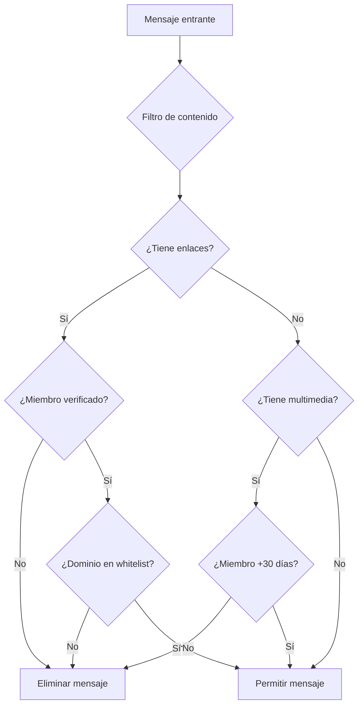
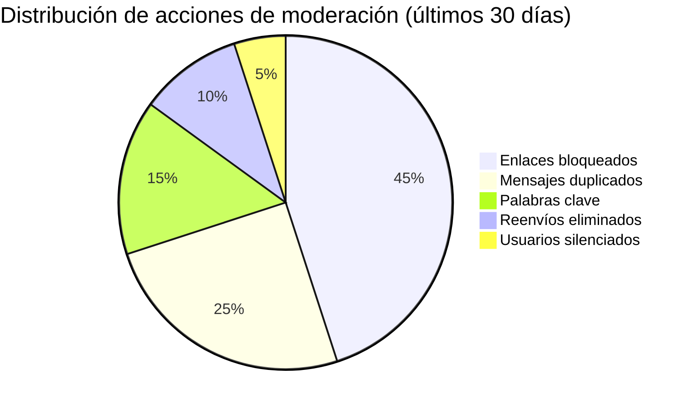

> **Nueva guía antispam para Telegram (2026-05-07)**
> E-SMART360 ha lanzado funcionalidades avanzadas de filtrado y antispam para grupos de Telegram, permitiendo a los administradores mantener comunidades limpias, seguras y comprometidas sin esfuerzo manual. Esta guía cubre todas las herramientas disponibles y cómo configurarlas para diferentes tipos de comunidades.

A medida que Telegram continúa creciendo en popularidad, gestionar una comunidad vibrante y comprometida se vuelve cada vez más desafiante para los administradores de grupos. La llegada constante de mensajes, imágenes y contenido multimedia puede convertir rápidamente un chat en un caos. Además, el spam no deseado puede arruinar la experiencia de los miembros más valiosos.

Afortunadamente, existe una solución poderosa a tu alcance: **E-SMART360**. En esta guía completa exploraremos cómo las funciones avanzadas de filtrado y antispam de E-SMART360 pueden transformar tu comunidad de Telegram en un espacio libre de spam, lleno de interacciones significativas y miembros comprometidos.

## Por qué es importante una comunidad libre de spam

Una comunidad de Telegram libre de spam es crucial para fomentar la participación genuina y promover una experiencia positiva para todos los miembros. La publicidad no solicitada, el contenido irrelevante y los mensajes repetitivos pueden disuadir la participación activa, lo que resulta en una disminución de la satisfacción de los miembros y de la actividad general del grupo.


> Los grupos de Telegram que implementan medidas antispam activas ven hasta un 60% más de retención de miembros y un 45% más de mensajes relevantes por día en comparación con grupos sin protección.

### Problemas comunes causados por el spam en Telegram

| Problema | Impacto en la comunidad | Solución con E-SMART360 |
|:---------|:------------------------|:-------------------------|
| Enlaces maliciosos | Riesgo de seguridad para miembros, posible malware | Filtro automático de enlaces y acortadores |
| Mensajes duplicados | Saturación del chat, dificultad para encontrar información | Límite de mensajes por minuto y detección de duplicados |
| Autopromoción excesiva | Desvío del propósito del grupo, fuga de miembros | Filtros por palabras clave y contenido |
| Bots automatizados | Invasión de publicidad automatizada 24/7 | Protección contra raids y límite de nuevos miembros |
| Contenido multimedia excesivo | Consumo de ancho de banda, distracción | Filtro de stickers, GIFs, imágenes y videos |
| Spam de mensajes reenviados | Contenido fuera de contexto, cadenas molestas | Bloqueo de reenvíos con o sin enlaces |

El spam no solo es molesto, sino que tiene consecuencias medibles. Los grupos que no implementan medidas antispam pierden en promedio el 35% de sus miembros activos en los primeros tres meses. Además, la calidad de las conversaciones se degrada significativamente, ya que los miembros más valiosos tienden a abandonar el grupo cuando sienten que sus interacciones se pierden en un mar de contenido irrelevante.


> **Dato clave**: Según estudios de comunidades digitales, un miembro que recibe 3 o más mensajes de spam en su primer día dentro de un grupo tiene un 78% de probabilidad de abandonarlo silenciosamente sin interactuar nunca.

Para garantizar una comunidad vibrante y valiosa, es esencial mantener a raya el spam y el contenido no deseado desde el primer momento. E-SMART360 te proporciona todas las herramientas necesarias para lograrlo sin esfuerzo manual.

## Filtros inteligentes de E-SMART360

Las capacidades de filtrado de E-SMART360 actúan como una línea de defensa robusta contra el spam y el contenido indeseable. Exploremos las funciones clave que empoderan a los administradores para crear un entorno de Telegram limpio y enfocado.


### Eliminar mensajes con comandos de bot

Los comandos de bot son esenciales para gestionar grupos de Telegram, pero también pueden saturar el chat. E-SMART360 identifica y elimina automáticamente los mensajes que invocan comandos de bot, manteniendo la conversación fluida y ordenada.

    ```mermaid
    flowchart LR
        A[Miembro envía comando /start] --> B{E-SMART360 detecta}
        B --> C[Es comando de bot]
        B --> D[Es mensaje normal]
        C --> E[Elimina automáticamente]
        D --> F[Mantiene en el chat]
        E --> G[Registro en bitácora de moderación]
    ```

    Esta función es especialmente útil en grupos grandes donde los comandos de bot pueden generar mensajes de confirmación que interrumpen el flujo de la conversación. Por ejemplo, comandos como `/help`, `/rules`, `/info` o `/report` generan respuestas automáticas que, aunque útiles para el usuario que los invoca, pueden ser ruido para el resto del grupo.
  
### Eliminar mensajes con imágenes y grabaciones de voz

El contenido visual y de audio puede enriquecer las discusiones, pero un exceso de estos elementos puede abrumar a los miembros. E-SMART360 te permite configurar filtros para eliminar mensajes que contengan imágenes y grabaciones de voz, asegurando un enfoque basado en texto cuando sea necesario.

    
> Puedes aplicar esta regla solo a miembros nuevos durante las primeras 24 horas, permitiendo que los miembros verificados compartan contenido multimedia libremente. Esta estrategia de "periodo de prueba" ayuda a prevenir que cuentas recién creadas inunden el grupo con publicidad visual.
    
Las opciones de configuración incluyen:
    - **Bloquear todas las imágenes**: ideal para grupos estrictamente textuales
    - **Bloquear solo imágenes de no miembros**: permite que administradores compartan contenido
    - **Bloquear grabaciones de voz**: útil en grupos donde se prefiere comunicación escrita
    - **Bloquear videos**: previene consumo excesivo de datos y distracciones
    - **Permitir imágenes bajo aprobación manual**: los archivos multimedia se ponen en cola de revisión
  
### Eliminar mensajes con documentos adjuntos

Gestionar documentos y archivos compartidos en el grupo es fundamental, pero el intercambio redundante puede provocar desorganización. Con E-SMART360, puedes filtrar mensajes que contengan documentos adjuntos, manteniendo un espacio de chat bien organizado.

    Los documentos más comúnmente bloqueados incluyen:
    - Archivos PDF promocionales
    - Archivos APK sospechosos
    - Hojas de cálculo con macros
    - Archivos comprimidos (.zip, .rar) cuyo contenido no puede verificarse
  
### Eliminar stickers, GIFs y dados de miembros

Si bien los stickers y GIFs añaden dinamismo a las conversaciones, un exceso de estos elementos puede desviar la atención. E-SMART360 te permite filtrar stickers, GIFs e incluso los lanzamientos de dados de los miembros, proporcionando una experiencia libre de distracciones.

    
### ¿Por qué bloquear los dados de Telegram?

Aunque parecen inofensivos, los juegos de dados se han convertido en una herramienta común para hacer spam en grupos grandes. Los spammers utilizan macros que lanzan dados automáticamente cada pocos segundos, saturando el chat y haciendo imposible seguir una conversación. Además, algunos grupos de apuestas no regulados utilizan esta función para promocionar sus servicios.
    
### Eliminar mensajes que contengan enlaces

Los enlaces no verificados pueden conducir a contenido inseguro o spam. E-SMART360 identifica y elimina automáticamente los mensajes que contienen enlaces, mejorando la seguridad del grupo.

    

### Enlaces externos

Bloquea enlaces a dominios no autorizados o categorías específicas como sitios de apuestas, redes sociales externas o páginas de ventas. Puedes configurar una lista negra de dominios que se actualiza automáticamente con fuentes de amenazas conocidas.
      
### Acortadores de URLs

Detecta y bloquea enlaces acortados (bit.ly, tinyurl, ow.ly, goo.gl, etc.) que ocultan el destino real del enlace. Los acortadores son el método favorito de los spammers porque permiten evadir los filtros básicos de palabras clave.
      
### Whitelist de dominios

Permite enlaces solo de un conjunto predefinido de dominios confiables, bloqueando todo lo demás automáticamente. Esta es la configuración más segura y se recomienda para grupos empresariales o educativos.
      
### Configuración avanzada de filtros combinados

E-SMART360 permite combinar múltiples filtros en reglas complejas para una protección más inteligente:



## Combatiendo el spam de mensajes reenviados

Los mensajes reenviados pueden ser informativos y útiles, pero también pueden contribuir al desorden si se comparten en exceso. Las funciones antispam de E-SMART360 abordan eficazmente el spam de mensajes reenviados de las siguientes maneras:

### Eliminar mensajes reenviados con multimedia

Para mantener un entorno de chat limpio, E-SMART360 identifica y elimina los mensajes reenviados que incluyen archivos multimedia, permitiendo que tus miembros se concentren en las discusiones relevantes. Esta función es particularmente importante porque los mensajes reenviados con multimedia suelen ser:

- **Cadenas virales** que se propagan sin control entre grupos
- **Contenido con derechos de autor** compartido sin autorización
- **Publicidad encubierta** disfrazada de contenido informativo
- **Desinformación** que se replica sin verificación de fuentes


> **Beneficio comprobado**: Grupos que activan esta función reportan una reducción de hasta el 80% en contenido multimedia duplicado y una mejora del 40% en la capacidad de los miembros para encontrar información relevante usando la búsqueda del grupo.

### Eliminar mensajes reenviados que contengan enlaces

Como medida de seguridad adicional, E-SMART360 filtra los mensajes reenviados que contengan enlaces, garantizando que tu grupo permanezca protegido contra posibles spam o contenido dañino. Los enlaces en mensajes reenviados son particularmente peligrosos porque:

1. El remitente original no está en tu grupo, por lo que no puede ser sancionado
2. El contenido del enlace no ha sido revisado por los administradores
3. Los spammers utilizan esta técnica para evadir los filtros de nuevos miembros

### Eliminar todos los mensajes reenviados

Si prefieres tener un espacio de chat completamente libre de mensajes reenviados, E-SMART360 puede eliminar eficientemente todo el contenido reenviado para una experiencia sin desorden. Esta es la opción más restrictiva y se recomienda para:

- **Grupos de soporte técnico**: donde cada respuesta debe ser personalizada
- **Grupos educativos**: donde se evalúa la comprensión individual del material
- **Comunidades privadas**: donde se valora el contenido original y contextual
- **Grupos de coworking**: donde se comparten recursos propios del equipo


### Cuándo eliminar solo reenvíos con enlaces

Ideal para grupos donde los miembros comparten artículos y noticias relevantes, pero quieres prevenir enlaces maliciosos o publicidad encubierta. También es útil en comunidades académicas donde se comparten papers y recursos educativos mediante reenvíos.
    <br /><br />
    <strong>Ejemplo:</strong> Grupo de desarrolladores donde los miembros comparten artículos de Medium o documentación oficial mediante reenvío.
  
### Cuándo eliminar todos los reenvíos

Perfecto para grupos de soporte técnico, formación académica o comunidades privadas donde todo el contenido debe ser original y contextual. También es la configuración recomendada para grupos que generan contenido propio como valor principal.
    <br /><br />
    <strong>Ejemplo:</strong> Grupo de atención al cliente donde cada interacción debe ser personalizada y los agentes necesitan ver el historial completo de cada usuario.
  
## Vigilancia por palabras clave para una comunidad respetuosa

Crear una comunidad de Telegram respetuosa e inclusiva es vital, y la función de vigilancia por palabras clave de E-SMART360 lo hace posible. Puedes configurar el bot para que elimine automáticamente los mensajes que contengan palabras censurables, promoviendo un espacio seguro y acogedor para todos los miembros.

### Categorías de palabras clave configurables

| Categoría | Ejemplos | Acción recomendada |
|:----------|:---------|:-------------------|
| Lenguaje ofensivo | Groserías, insultos, términos despectivos | Eliminar mensaje + advertencia privada |
| Promoción no autorizada | "compra ahora", "descuento", nombres de competidores | Eliminar mensaje + silencio 1 hora |
| Contenido sensible | Términos violentos, discriminatorios | Eliminar mensaje + expulsión automática |
| Spam comercial | URLs de venta, ofertas no verificadas | Eliminar mensaje + silencio 30 min |
| Información falsa | Términos de desinformación conocidos | Eliminar mensaje + notificación a admins |


### ¿Cómo configuro las palabras clave bloqueadas?

Dirígete al panel de administración de E-SMART360, selecciona la configuración de tu grupo de Telegram y busca la sección "Vigilancia de palabras clave". Allí puedes agregar palabras o frases específicas que deseas bloquear. Las palabras clave pueden configurarse de las siguientes maneras:

  - **Términos completos**: palabras exactas que deben ser bloqueadas. Ejemplo: si bloqueas "descuento", se bloqueará ese término exacto.
  - **Términos parciales**: cualquier mensaje que contenga esa cadena de texto, incluso si está dentro de otra palabra. Ejemplo: si bloqueas "venta", se bloquearán mensajes que contengan "venta", "ventanas", "inventario", etc.
  - **Patrones regex**: expresiones regulares avanzadas para detección precisa. Ejemplo: `\b(comprar|adquirir|obtener)\s+(ahora|hoy|ya)\b` detecta frases de llamado a la acción urgentes.

  El sistema eliminará automáticamente cualquier mensaje que coincida con las reglas configuradas y registrará la incidencia en el panel de moderación para que los administradores puedan revisarla.

  
> Ten cuidado con los términos parciales: bloquear "sexo" también bloquearía palabras como "conexión" o "acceso". Usa coincidencias exactas o regex cuando sea necesario para evitar falsos positivos.
  

### Estrategias avanzadas de vigilancia por palabras clave


### Configurar niveles de severidad

No todas las palabras prohibidas merecen la misma sanción. E-SMART360 te permite asignar niveles de severidad:
    
    - **Nivel 1 (Bajo)**: Eliminar mensaje silenciosamente
    - **Nivel 2 (Medio)**: Eliminar + enviar advertencia privada
    - **Nivel 3 (Alto)**: Eliminar + silenciar por tiempo definido
    - **Nivel 4 (Crítico)**: Eliminar + expulsión automática inmediata
  
### Crear listas blancas de excepciones

Configura palabras o contextos donde las palabras clave bloqueadas están permitidas. Por ejemplo, si bloqueas "venta" pero tienes un canal de ofertas, puedes crear una excepción para mensajes que contengan la etiqueta "#oferta" o que sean publicados por administradores.
  
### Programar horarios de vigilancia

Define horarios específicos en los que los filtros están activos. Por ejemplo:
    - **Horario laboral**: filtros estrictos activos
    - **Horario nocturno**: filtros relajados (solo nivel crítico)
    - **Fines de semana**: modo supervisión (notificar a admins sin eliminar)
  
## Límite de mensajes por miembro

La función antispam de E-SMART360 viene equipada con un poderoso sistema de limitación de mensajes por miembro, diseñado para prevenir la saturación del chat y mantener conversaciones equilibradas. Veamos cómo funciona esta característica en detalle.

### Envío del mismo mensaje será eliminado

Con la limitación de mensajes por miembro, E-SMART360 garantiza que los mensajes repetitivos se eliminen automáticamente. Esto previene la inundación del chat y mantiene la conversación centrada en interacciones significativas. La detección de duplicados funciona comparando el contenido exacto del mensaje, incluyendo texto, formato y archivos adjuntos.

### Envío del mismo mensaje considerado como spam

Al identificar y categorizar mensajes idénticos como spam, E-SMART360 toma medidas proactivas contra el comportamiento de spamming. Cuando los miembros intentan enviar el mismo mensaje múltiples veces, el sistema lo marca como spam, desalentando actividades relacionadas dentro del grupo.


> **Importante**: La configuración predeterminada considera spam si el mismo mensaje se envía más de 3 veces en un período de 5 minutos. Puedes ajustar estos umbrales según las necesidades de tu comunidad. Para grupos muy activos, recomendamos 5 mensajes en 3 minutos; para grupos pequeños, 2 mensajes en 10 minutos.

### El usuario será silenciado por un tiempo específico

Para disuadir a los infractores reincidentes, E-SMART360 puede aplicar automáticamente silencios temporales a los usuarios que violen las reglas de limitación de mensajes. Esto asegura que los usuarios entiendan la importancia de cumplir con las directrices del grupo y fomenta un comportamiento responsable.

El sistema de silencios progresivos funciona de la siguiente manera:

| Infracción | Duración del silencio | Acción adicional |
|:-----------|:---------------------|:-----------------|
| 1ª infracción | 5 minutos | Advertencia privada |
| 2ª infracción | 30 minutos | Advertencia + notificación al admin |
| 3ª infracción | 24 horas | Silencio prolongado + registro permanente |
| 4ª infracción | Expulsión temporal (7 días) | Oportunidad de regreso |
| 5ª infracción | Expulsión permanente | Bloqueo definitivo |

### Control sobre la frecuencia de mensajes

Con la limitación de mensajes por miembro de E-SMART360, los administradores tienen la flexibilidad de controlar con qué frecuencia los usuarios pueden enviar mensajes en períodos de tiempo específicos. Esta función personalizable permite a los administradores encontrar el equilibrio perfecto entre discusiones activas y la prevención de sobrecarga de spam.


### Configurar límite de mensajes en el panel

Accede a la configuración de tu grupo de Telegram en E-SMART360. En la sección "Antispam → Límite de mensajes", puedes definir:
    
    - **Máximo de mensajes permitidos**: establece un número entre 1 y 100
    - **Ventana de tiempo**: define el período en segundos (desde 10 segundos hasta 1 hora)
    - **Acción al exceder**: elige entre eliminar el mensaje, silenciar por N minutos, o expulsar
  
### Personalizar la duración del silencio

Define cuánto tiempo quedará silenciado un miembro después de exceder el límite. Las opciones recomendadas son:
    
    - **Leve (1-2 repeticiones)**: Silencio de 5 minutos — suficiente para que el usuario entienda la advertencia
    - **Moderado (3-5 repeticiones)**: Silencio de 30 minutos — disuasión efectiva sin ser excesiva
    - **Grave (6+ repeticiones)**: Silencio de 24 horas — acción contundente contra spammers persistentes
    - **Reincidencia crónica**: Expulsión automática con opción de apelación
  
### Configurar mensaje de advertencia automática

E-SMART360 puede enviar un mensaje privado al miembro infractor explicando por qué su mensaje fue eliminado y cuánto tiempo durará la restricción. Esto ayuda a educar a los miembros sobre las reglas del grupo sin confrontación pública. El mensaje puede personalizarse completamente:

    ```
    🛡️ Aviso de moderación - [Nombre del Grupo]

    Hola [Nombre del usuario],

    Tu mensaje ha sido eliminado automáticamente porque superaste el límite de mensajes permitidos.

    📊 Detalles:
    • Motivo: Exceso de mensajes repetitivos
    • Medida: Silencio temporal de [X] minutos
    • Vigencia: Desde ahora hasta las [HH:MM]

    Por favor, espera antes de enviar nuevos mensajes.
    Si crees que esto es un error, contacta a un administrador.

    — Equipo de moderación
    ```

    
> Personalizar el mensaje de advertencia con el nombre de tu comunidad y un tono amigable reduce significativamente la fricción con los miembros. Los mensajes genéricos tipo "has sido silenciado" generan más abandonos que los mensajes explicativos.
    
## Bloqueo de usuarios no deseados en WhatsApp

Así como puedes mantener tu grupo de Telegram limpio, E-SMART360 también te permite gestionar el spam en tu canal de WhatsApp. Bloquear usuarios específicos que envían mensajes no deseados es un proceso sencillo pero poderoso que te da control total sobre quién puede contactarte.

### Por qué bloquear usuarios

- **Detener mensajes de spam innecesarios**: elimina la distracción de tener que responder o ignorar mensajes no deseados
- **Prevenir saturación de promociones comerciales**: evita que competidores o vendedores no autorizados te contacten
- **Mantener una comunicación profesional**: asegura que tu bandeja de entrada contenga solo consultas relevantes
- **Filtrar contenido irrelevante**: reduce el ruido y mejora la eficiencia de tu equipo de atención al cliente
- **Proteger a tu equipo**: evita que agentes de soporte reciban mensajes inapropiados o acosadores

### Capacidades de bloqueo


### ¿Qué sucede cuando bloqueas un usuario en E-SMART360?

Al bloquear un usuario en E-SMART360, el sistema aplica las siguientes medidas:

  - **No recibirás mensajes entrantes** de ese contacto. El sistema rechaza silenciosamente cualquier intento de comunicación.
  - **Aún puedes enviar transmisiones** a usuarios bloqueados. Esto es ideal para campañas donde el usuario se suscribió originalmente pero luego comenzó a enviar mensajes no deseados. Mantienes la capacidad de hacer marketing sin recibir molestias.
  - **La comunicación es unidireccional**: tú controlas completamente quién puede contactarte. Esto es especialmente útil en cuentas de alto volumen.
  - **El usuario no recibe notificación** de que fue bloqueado. Para el usuario, sus mensajes simplemente no obtienen respuesta, evitando confrontaciones.
  - **El bloqueo es reversible**: puedes desbloquear al usuario en cualquier momento sin que este se entere del cambio.

### Proceso de bloqueo paso a paso


### Identificar el contacto spam

Revisa el historial de mensajes y reconoce aquellos contactos que envían contenido repetitivo o irrelevante. Los indicadores típicos de un contacto spam incluyen:
    
    - Múltiples mensajes idénticos enviados en corto período
    - Enlaces a sitios no relacionados con tu negocio
    - Solicitudes repetitivas que ya fueron respondidas
    - Promociones no solicitadas de productos o servicios
    - Lenguaje agresivo o inapropiado
    
    Selecciona el contacto específico en tu bandeja de entrada de E-SMART360.
  
### Bloquear mensajes entrantes

Ve a la sección de Bandeja de entrada compartida de E-SMART360, localiza el chat del contacto que deseas bloquear, haz clic en el botón "Bloquear usuario" que aparece en el perfil del contacto y confirma la acción en la pantalla de verificación.
  
### Verificar el bloqueo

Una vez bloqueado, el sistema te mostrará un indicador visual en el perfil del contacto (un escudo o icono de bloqueo). Los mensajes futuros de ese usuario serán rechazados automáticamente y no aparecerán en tu bandeja de entrada. Puedes revisar la lista de usuarios bloqueados en cualquier momento desde el panel de configuración.
  
### Gestión de usuarios bloqueados

| Acción | Cómo hacerlo | Resultado |
|:-------|:-------------|:----------|
| Ver lista de bloqueados | Panel → Configuración → Usuarios bloqueados | Lista completa con fecha de bloqueo y motivo |
| Desbloquear usuario | Seleccionar usuario → Clic en "Desbloquear" | El usuario puede enviar mensajes nuevamente |
| Bloqueo masivo | Importar lista de números desde CSV | Bloquea múltiples usuarios en una sola operación |
| Exportar bloqueados | Exportar lista a Excel/CSV | Para auditoría o migración de datos |


> El bloqueo de usuarios en WhatsApp solo afecta los mensajes entrantes. A diferencia de las herramientas de filtrado de Telegram, en WhatsApp **no se eliminan mensajes automáticamente** por contenido, sino que se bloquea al contacto completo. Úsalo con criterio para no perder clientes potenciales legítimos. Recomendamos agotar primero las opciones de advertencia y silencio antes de recurrir al bloqueo permanente.

## Configuración completa de protección antispam

Para una protección óptima de tu comunidad, te recomendamos la siguiente configuración combinada. Estos valores han sido probados en comunidades de diferentes tamaños y tipos:

| Característica | Configuración recomendada | Nivel de protección |
|:---------------|:--------------------------|:-------------------:|
| Filtro de enlaces | Bloquear todos los enlaces de no miembros | 🟢 Alta |
| Filtro de stickers/GIFs | Permitir solo a miembros verificados (+30 días) | 🟡 Media |
| Límite de mensajes | 10 mensajes cada 60 segundos | 🟢 Alta |
| Eliminar reenvíos | Bloquear reenvíos con enlaces | 🟢 Alta |
| Palabras clave | Lista personalizada por temática del grupo | 🟢 Personalizable |
| Bloqueo de usuarios WhatsApp | Activar para spam recurrente (tras 3 advertencias) | 🟢 Total |
| Protección contra raids | Activar para +5 mensajes idénticos en 1 minuto | 🟢 Alta |
| Bienvenida con reglas | Mensaje automático con normas al ingresar | 🟡 Prevención |


> **¿Qué es un raid de bots?** Es un ataque coordinado donde múltiples cuentas automatizadas ingresan simultáneamente a un grupo y publican contenido spam. Estos ataques suelen ocurrir en oleadas, con decenas o cientos de bots entrando en cuestión de minutos. E-SMART360 detecta estos patrones de ingreso masivo analizando:

  - **Velocidad de ingreso**: más de 10 nuevos miembros en 5 minutos activa la alerta
  - **Patrones de nombres**: nombres con formato similar (ej: "user_12345", "user_12346")
  - **Fotos de perfil genéricas**: imágenes predeterminadas o generadas por IA
  - **Antigüedad de la cuenta**: cuentas creadas en las últimas 24 horas

  Cuando se detecta un raid, E-SMART360 puede activar automáticamente el modo "solo administradores pueden hablar" hasta que el ataque pase.

## Escenarios de configuración por tipo de comunidad


### 🏢 Grupo corporativo / atención al cliente

<strong>Configuración:</strong>
    - Bloquear todos los stickers, GIFs y contenido multimedia
    - Límite: 5 mensajes por minuto por usuario
    - Silencio automático de 10 minutos por exceso
    - Palabras clave: groserías, términos ofensivos, menciones a competidores
    - Reenvíos: eliminar todos
    - Enlaces: solo whitelist de dominios corporativos
    <br/><br/>
    <strong>Resultado:</strong> Chat profesional y limpio, ideal para soporte al cliente
  
### 👨‍💻 Comunidad de tecnología / desarrolladores

<strong>Configuración:</strong>
    - Permitir enlaces de stackoverflow, github, npm, gitlab, medium
    - Bloquear acortadores de URLs
    - Stickers y GIFs permitidos solo para miembros con +30 días de antigüedad
    - Sin límite de mensajes para miembros activos
    - Palabras clave: solo nivel crítico (discriminación, amenazas)
    <br/><br/>
    <strong>Resultado:</strong> Colaboración técnica fluida sin ruido promocional
  
### 🛒 Grupo de ventas / ofertas / ecommerce

<strong>Configuración:</strong>
    - Permitir enlaces de productos propios y afiliados aprobados
    - Bloquear ofertas de competidores y productos no verificados
    - 1 mensaje cada 10 minutos máximo por usuario
    - Aprobación manual para nuevos miembros
    - Palabras clave: monitoreo de términos de oferta y descuento
    <br/><br/>
    <strong>Resultado:</strong> Leads calificados sin ruido promocional no deseado
  
### 🎓 Grupo educativo / académico

<strong>Configuración:</strong>
    - Bloquear todo contenido multimedia excepto PDFs educativos
    - Reenvíos: eliminar todos (fomenta contenido original)
    - Sin límite de mensajes durante horario de clase
    - Palabras clave: términos académicos específicos como excepción
    - Moderación de tareas: solo archivos en formatos permitidos
    <br/><br/>
    <strong>Resultado:</strong> Entorno de aprendizaje enfocado y productivo
  
### 🌐 Comunidad regional / vecinal

<strong>Configuración:</strong>
    - Permitir enlaces de noticias locales verificadas
    - Stickers y GIFs permitidos (comunidad informal)
    - Límite suave: 20 mensajes por minuto
    - Palabras clave: solo contenido ilegal o peligroso
    - Verificación de nuevos miembros con preguntas de seguridad
    <br/><br/>
    <strong>Resultado:</strong> Comunidad activa y amigable con moderación mínima
  
### 🤖 Comunidad de gaming / entretenimiento

<strong>Configuración:</strong>
    - Stickers, GIFs y multimedia sin restricciones
    - Límite: 30 mensajes por minuto (comunidades muy activas)
    - Reenvíos: permitidos si son de canales oficiales del juego
    - Palabras clave: spoilers con advertencia automática
    - Canales separados por tema (spoilers, LFG, trading)
    <br/><br/>
    <strong>Resultado:</strong> Comunidad vibrante con organización temática
  
## Preguntas frecuentes


### ¿Los usuarios bloqueados en WhatsApp pueden ver mis transmisiones (broadcasts)?

Sí. Cuando bloqueas un usuario en WhatsApp a través de E-SMART360, ese usuario aún puede recibir tus transmisiones. Esto es útil cuando deseas mantener a un usuario en tu lista de suscriptores para campañas de marketing, pero no quieres recibir sus mensajes individuales. La comunicación se vuelve unidireccional: tú puedes enviarles contenido, pero ellos no pueden responderte directamente en el chat.

### ¿El bloqueo de usuarios en WhatsApp es permanente?

No, para nada. Puedes desbloquear a un usuario en cualquier momento desde el panel de administración de E-SMART360. El proceso es tan sencillo como el bloqueo: ve al perfil del usuario y selecciona "Desbloquear". El usuario no recibe ninguna notificación ni del bloqueo ni del desbloqueo, lo que te permite gestionar tus contactos de forma discreta y profesional.

### ¿Los usuarios bloqueados saben que están bloqueados?

No. E-SMART360 no envía ninguna notificación al usuario bloqueado. Para el usuario, sus mensajes simplemente no reciben respuesta. Esto evita confrontaciones innecesarias y mantiene una relación comercial profesional. Si el usuario insiste, puede contactar por otros canales (email, formulario web), pero no sabrá que fue específicamente bloqueado en WhatsApp.

### ¿Puedo configurar diferentes niveles de filtrado para diferentes roles en Telegram?

Sí. E-SMART360 permite configurar reglas de filtrado distintas para diferentes roles dentro del grupo:

  - **Administradores**: sin restricciones de filtrado ni límites
  - **Miembros verificados** (+30 días): restricciones suaves (solo enlaces no confiables, sin límite de mensajes)
  - **Miembros recientes** (1-30 días): restricciones medias (filtro de enlaces, límite de 10 msg/min)
  - **Miembros nuevos** (&lt;24 horas): restricciones completas (sin enlaces, sin multimedia, límite de 5 msg/min)
  - **Usuarios no verificados** (sin número de teléfono visible): todas las restricciones aplicadas

  Esta segmentación por roles permite mantener la seguridad sin afectar la experiencia de los miembros de confianza.

### ¿El límite de mensajes aplica también a los administradores?

Por defecto, los administradores del grupo están exentos de los límites de mensajes y filtros de contenido. Sin embargo, en el panel de configuración de E-SMART360 puedes modificar esta configuración si deseas aplicar las mismas reglas a todos los miembros, incluidos los administradores. Esto puede ser útil en grupos donde se quiere dar ejemplo de moderación desde los roles superiores.

### ¿Cómo maneja E-SMART360 los enlaces de afiliados legítimos y el contenido promocional autorizado?

E-SMART360 te permite crear múltiples listas blancas (whitelists) para garantizar que el contenido legítimo no sea filtrado por error:

  - **Whitelist de dominios**: agrega dominios de afiliados aprobados, redes sociales oficiales, o sitios de documentación
  - **Whitelist de miembros**: designa usuarios autorizados para compartir ciertos tipos de contenido
  - **Whitelist de palabras clave**: términos que nunca deben ser bloqueados aunque coincidan parcialmente con la lista de bloqueo
  - **Whitelist por horario**: permite contenido restringido solo en ventanas de tiempo específicas

  Esto garantiza que las promociones legítimas y el contenido aprobado por los administradores no sean bloqueados automáticamente.

### ¿Qué pasa si un miembro envía spam en múltiples grupos que administro?

E-SMART360 cuenta con un sistema de reputación unificada: si bloqueas o sancionas a un usuario en un grupo, esa información está disponible para todos los grupos que administres. Puedes optar por:

  - **Sincronizar sanciones**: aplicar automáticamente las mismas restricciones en todos los grupos
  - **Bloqueo cruzado**: impedir que el usuario se una a cualquiera de tus grupos
  - **Lista negra compartida**: mantener una base de datos de spammers conocidos entre todos tus grupos

  Esta función es particularmente útil para administradores que gestionan múltiples comunidades sobre temas relacionados.

### ¿Cómo puedo ver el historial de acciones de moderación?

E-SMART360 mantiene un registro detallado de todas las acciones de moderación en tu grupo. Puedes acceder a él desde:

  **Panel → Moderación → Historial**

  El historial incluye:
  - Fecha y hora de cada acción
  - Usuario afectado (nombre, ID, número de teléfono si está visible)
  - Tipo de acción (mensaje eliminado, silencio, expulsión, advertencia)
  - Regla específica que se activó
  - Contenido del mensaje infractor (texto completo)
  - Moderador responsable (automático o manual)

  Puedes exportar este historial a CSV para auditorías externas o análisis de tendencias de spam.

### ¿El sistema de filtros afecta el rendimiento del grupo o retrasa los mensajes?

No. E-SMART360 procesa los mensajes en milisegundos sin introducir latencia perceptible en el envío o recepción de mensajes. La arquitectura de procesamiento está diseñada para manejar grupos de hasta 200,000 miembros sin degradación del rendimiento. Los filtros se evalúan en el servidor antes de que el mensaje sea visible para otros miembros, por lo que la experiencia del usuario no se ve afectada.

## Conclusión

Con las potentes funciones de filtrado y antispam de E-SMART360, crear una comunidad de Telegram libre de spam y atractiva nunca ha sido tan fácil. Al seleccionar el contenido y garantizar que solo los mensajes relevantes y valiosos lleguen a tus miembros, puedes fomentar interacciones genuinas y construir una comunidad próspera y vibrante.

La combinación de filtros inteligentes, limitación de mensajes duplicados, vigilancia por palabras clave y bloqueo selectivo de usuarios te brinda el control total sobre la calidad de las interacciones en tu comunidad. Ya sea que administres un grupo de soporte, una comunidad de tecnología o un canal de ventas, E-SMART360 se adapta a tus necesidades específicas.


> **¿Listo para transformar tu comunidad?** Comienza hoy mismo a usar E-SMART360 y descubre el poder de una comunicación limpia, segura y sin spam. Tus miembros te lo agradecerán y tu comunidad crecerá más saludable que nunca.

---

## Checklist de implementación rápida

Si estás comenzando desde cero y quieres proteger tu comunidad en pocos minutos, sigue esta checklist:

- [ ] **Paso 1**: Accede al panel de E-SMART360 y conecta tu bot de Telegram
- [ ] **Paso 2**: Agrega el bot como administrador del grupo con permisos de eliminar mensajes y silenciar usuarios
- [ ] **Paso 3**: Activa el filtro de enlaces (modo: bloquear enlaces de no miembros)
- [ ] **Paso 4**: Configura el límite de mensajes (10 mensajes cada 60 segundos)
- [ ] **Paso 5**: Activa la eliminación de mensajes duplicados
- [ ] **Paso 6**: Configura 5-10 palabras clave relevantes para tu comunidad
- [ ] **Paso 7**: Activa la protección contra raids de bots
- [ ] **Paso 8**: Personaliza el mensaje de bienvenida con las reglas del grupo
- [ ] **Paso 9**: Configura el mensaje de advertencia automática para infractores
- [ ] **Paso 10**: Prueba el sistema enviando un mensaje de prueba desde una cuenta alterna


> Esta configuración inicial toma aproximadamente 10 minutos y ya cubre el 90% de los casos de spam más comunes. Puedes ajustar la granularidad de los filtros a medida que tu comunidad crece.

## Migración desde otras plataformas de moderación

Si ya estás usando otra herramienta de moderación para Telegram y deseas migrar a E-SMART360, el proceso es sencillo:

| Plataforma actual | Datos migrables | Tiempo estimado |
|:------------------|:----------------|:----------------|
| Group Butler | Lista negra, palabras clave, config | 15 minutos |
| Miss Rose | Filtros, bienvenidas, reglas | 20 minutos |
| Combot | Estadísticas, usuarios restringidos | 25 minutos |
| Shieldy | Protección antiraid, captcha | 10 minutos |
| Configuración manual | Todo | 30 minutos |

### Pasos para migrar

1. **Exporta tu configuración actual** desde la plataforma que estés usando (generalmente disponible en formato JSON o CSV)
2. **Importa la configuración en E-SMART360** usando la opción "Importar configuración" en el panel
3. **Retira al bot anterior** como administrador del grupo
4. **Agrega a E-SMART360** como administrador con los mismos permisos
5. **Verifica** que todas las reglas se estén aplicando correctamente
6. **Desactiva la plataforma anterior** una vez confirmado que E-SMART360 funciona correctamente

## Estadísticas y reporting

E-SMART360 proporciona un panel de estadísticas en tiempo real para que puedas medir la efectividad de tus filtros antispam:



### Métricas disponibles

- **Total de acciones de moderación**: mensajes eliminados, usuarios silenciados y expulsados
- **Tasa de spam**: porcentaje de mensajes identificados como spam vs. mensajes totales
- **Usuarios más activos**: ranking de miembros con más contribuciones válidas
- **Tendencias**: evolución del spam a lo largo del tiempo (día, semana, mes)
- **Horas pico de spam**: identifica los momentos del día con mayor actividad de spam
- **Efectividad por filtro**: qué filtros están atrapando más spam y cuáles generan falsos positivos


### ¿Cómo interpretar las estadísticas de moderación?

Las estadísticas te ayudan a ajustar tu estrategia de moderación:

  - **Si el filtro de enlaces atrapa >60% del spam**: tu configuración de whitelist es adecuada
  - **Si hay muchos falsos positivos en palabras clave**: revisa las listas para evitar bloqueos innecesarios
  - **Si el spam aumenta en horarios nocturnos**: considera activar el modo "solo admins" durante la madrugada
  - **Si un mismo usuario es sancionado repetidamente**: probablemente necesitas una acción más contundente (silencio más largo o expulsión)

  Programa revisiones semanales de las estadísticas para mantener tu comunidad optimizada.

### Artículos relacionados

- [10 funciones imprescindibles para la gestión de grupos de Telegram](/recursos/gestion-grupos-telegram-funciones-clave)
- [Configuración de restricciones para nuevos miembros en Telegram](/recursos/restringir-nuevos-miembros-telegram)
- [Cómo filtrar y supervisar tu grupo de Telegram](/recursos/filtros-supervision-grupos-telegram)
- [Integración de bot de Telegram para moderación de grupos](/recursos/integrar-bot-telegram-grupo-moderacion)
- [Bloqueo de usuarios y gestión de spam en WhatsApp](/recursos/bloquear-usuarios-spam-whatsapp)
