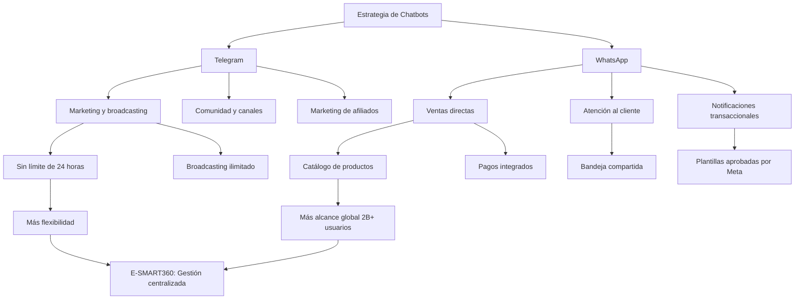

# Diferencias entre Chatbot de Telegram y Chatbot de WhatsApp

Al elegir entre Telegram y WhatsApp para tu negocio, la decisión depende de las características, la seguridad, los precios y los objetivos de marketing. Las funciones de los bots de Telegram ofrecen flexibilidad, libertad de automatización y un sólido soporte para marketing de afiliados y broadcasting sin límites estrictos de mensajería. Por otro lado, las funciones de los chatbots de WhatsApp con IA se centran en la comunicación empresarial estructurada, cuentas verificadas y cumplimiento de seguridad avanzado. Mientras que el precio de los chatbots de WhatsApp se basa en conversaciones, los bots de Telegram son generalmente más rentables. En última instancia, las empresas deben comparar los bots de WhatsApp versus los bots de Telegram en función del alcance de la audiencia, las necesidades de automatización y el presupuesto.

Los chatbots son cada vez más populares día a día para los negocios. A continuación, veamos por qué deberías usar un chatbot para tu negocio.

> **Dato clave:** Según estudios recientes, los chatbots pueden manejar hasta el 80% de las preguntas rutinarias de los clientes, liberando a tu equipo para que se concentre en consultas más complejas y de mayor valor. Las empresas que implementan chatbots reportan una reducción de hasta un 30% en costos de atención al cliente.

---

## ¿Por qué usar un chatbot para tu negocio?

### Ahorra tiempo y dinero en atención al cliente

En la atención al cliente de tu negocio, los chatbots pueden ahorrarte mucho tiempo y dinero. Normalmente, la mayoría de las preguntas de servicio al cliente son preguntas estándar. Y los chatbots pueden responder fácilmente esas preguntas estándar de forma automática con plantillas predefinidas. Por lo tanto, no tienes que responder las preguntas tú mismo — tu tiempo se ahorrará. Y si tienes muchos clientes, no tienes que contratar empleados humanos para responder estas preguntas de los clientes — tu dinero se ahorrará.

En una palabra, si usas un chatbot para tu negocio, puedes ahorrar la mayor parte de tu tiempo y dinero en atención al cliente.

Solo para preguntas personalizadas y particulares necesitarás empleados humanos para responder esas preguntas.

### Disponibilidad 24/7

Cuando estás durmiendo, algunos de tus clientes están despiertos. Si tienen una pregunta sobre tu negocio, productos o servicio, no pueden hacértela porque estás dormido. Y si tienes clientes de diferentes zonas horarias, este problema se presentará con más frecuencia.

En este caso, un chatbot puede acudir al rescate. Como está disponible 24/7, puede responder a las consultas de tus clientes en cualquier momento. Como resultado, un cliente puede hablar con tu negocio cuando quiera. Y tú puedes dormir tranquilo sin preocuparte por responder las consultas de los clientes. La disponibilidad 24/7 de los chatbots es uno de sus principales beneficios.

### Responder en segundos

El chatbot está disponible 24/7 y puede manejar a miles de clientes al mismo tiempo. Además, a diferencia de un ser humano, no se cansa ni se agota. Por lo tanto, un chatbot puede responder a las consultas de los clientes de inmediato.

### Marketing de tu negocio

Un chatbot puede promocionar tus productos y servicios proporcionando información sobre ellos a tus clientes. Es decir, un chatbot puede hacer marketing para tu negocio.

### Vender productos directamente

Además de hacer marketing, un chatbot puede vender directamente tus productos a tus clientes y recibir pagos. Además, un chatbot puede enviar recordatorios de carritos abandonados a clientes potenciales.

### Recopilar leads

Un chatbot puede recopilar leads de clientes muy fácilmente. Y algunos chatbots pueden recopilar leads en tiempo real y auténticos de los clientes de forma conversacional.

### Programar mensajes

Un chatbot puede enviar mensajes programados a tus clientes. Por lo tanto, puede enviar los mensajes correctos a tus clientes en el momento adecuado. Es decir, envía el mensaje a los clientes cuando realmente lo necesitan.

---

## ¿Qué plataforma de mensajería deberías usar para tu chatbot?

Ahora conocemos los beneficios de los chatbots para los negocios. Ahora la pregunta es: ¿en qué plataforma de mensajería lanzar un chatbot? En este artículo, hablaremos tanto del chatbot de WhatsApp como del chatbot de Telegram, qué pueden hacer por tu negocio y descubriremos cuál funciona mejor para tu negocio.

---

## Chatbot de Telegram

Un chatbot de Telegram puede conversar automáticamente con tus clientes en Telegram. En Telegram, normalmente chateas con otra persona. Pero en el caso de un chatbot de Telegram, hablas con un programa informático, en lugar de un ser humano.

### Privacidad y seguridad

Telegram es una aplicación de mensajería instantánea gratuita que da la mayor importancia a la velocidad y la seguridad. Además, la aplicación tiene una gran capacidad de infraestructura y cifrado. Como resultado, Telegram se ha vuelto más protegido y rápido.

Por defecto, Telegram no usa cifrado de extremo a extremo. Pero los usuarios pueden activar fácilmente el cifrado de extremo a extremo habilitando los chats secretos. Después de activar el chat secreto, los datos del usuario están protegidos. Además, pueden obtener todos los beneficios del cifrado de extremo a extremo. Los usuarios pueden evitar que los mensajes sean reenviados.

Mientras los chats secretos están activados, los usuarios pueden poner sus mensajes en modo de autodestrucción. En el modo de autodestrucción, un mensaje o foto desaparecerá después de un período de tiempo específico.

Los usuarios de Telegram tienen un "nombre de usuario" público que garantiza que la privacidad esté protegida. Con el nombre de usuario, la conversación en Telegram es posible — no se requiere el número de teléfono del usuario.

### Base masiva de usuarios

Actualmente, Telegram es una de las aplicaciones de mensajería instantánea más grandes del mundo. Telegram tiene 400 millones de usuarios activos mensuales. Y la aplicación está ganando cada vez más popularidad día a día. Cada día, 1.5 millones de nuevos usuarios se registran en Telegram.

Dado que muchas personas usan Telegram, encontrarás muchos clientes en la plataforma.

### Altamente interactivo

Telegram proporciona una interfaz amigable y segura que permite a los usuarios enviar todo tipo de mensajes, desde imágenes hasta encuestas, para hacer que la interacción con el usuario sea altamente interactiva.

### La regla de las 24 horas no aplica para el chatbot de Telegram

Facebook Messenger, Instagram Messenger y WhatsApp tienen estrictas reglas de 24 horas que no te permiten enviar un mensaje después de 24 horas de la última interacción del suscriptor. Pero esta regla de 24 horas **no aplica para Telegram**. Es decir, un chatbot de Telegram puede enviar mensajes de broadcasting promocional a los suscriptores en cualquier momento. Y creemos que esta es una gran ventaja del chatbot de Telegram.

> **Ventaja clave de Telegram:** Sin límite de 24 horas para broadcasting. Puedes enviar mensajes promocionales a tus suscriptores cuando quieras, sin restricciones de tiempo. Esto lo convierte en una plataforma ideal para campañas de marketing automatizadas y estrategias de nurturing de leads.

### Mensajes de broadcasting promocional

Como la regla de 24 horas no aplica para Telegram, el chatbot de Telegram puede enviar mensajes de broadcasting promocional a los suscriptores en cualquier momento. Y los mensajes de broadcasting promocional pueden enviarse al instante o en un horario programado.

Dado que Telegram es una aplicación de mensajería instantánea, la tasa de apertura de los mensajes de broadcasting promocional es mucho más alta que la del correo electrónico.

### Capacidad de miembros en grupos

Un grupo de Telegram es un grupo de chat de usuarios y bots. Los usuarios y bots del grupo se llaman miembros del grupo. El grupo de Telegram tiene un máximo de 200,000 miembros.

### Capacidad de suscriptores en canales

Además del grupo, Telegram tiene canales. Es un grupo especial que puede tener un número ilimitado de suscriptores. Y esto lo convierte en una gran opción para el chatbot de Telegram para enviar mensajes de broadcasting promocional a un gran número de audiencias.

Pero a diferencia del grupo de Telegram, solo los administradores y bots tienen derecho a publicar mensajes. Todos los demás usuarios solo pueden recibir mensajes — no pueden publicar mensajes.

### Soporte multiplataforma

Telegram está disponible en Android, iOS, Windows Phone, Windows PC, macOS, Linux OS e incluso navegadores. A diferencia de otras aplicaciones de mensajería instantánea, puedes usar la aplicación de Telegram en múltiples dispositivos al mismo tiempo.

### Características

Telegram es el más rico en cuanto a características entre las plataformas de mensajería instantánea. Para crear una experiencia conversacional integrada para los usuarios, Telegram proporciona múltiples elementos de interfaz de usuario enriquecidos.

Un chatbot en Telegram puede enviar mensajes de texto, mensajes de broadcasting promocional, imágenes y GIFs, stickers, videos y documentos, así como otros elementos de interfaz enriquecidos como respuestas rápidas, botones y tarjetas. Además de estas características, los bots de Telegram también soportan comandos y consultas en línea.

### Cómo crear un chatbot de Telegram fácilmente

Crear un chatbot de Telegram es muy sencillo y directo. Solo toma unos pocos pasos.

### Abrir Telegram y buscar BotFather

Para crear un bot de Telegram, primero abre tu aplicación de Telegram. Luego, en la barra de búsqueda de la aplicación, busca con la palabra clave 'BotFather'. Selecciona la cuenta verificada de BotFather.

### Iniciar la conversación

Instantáneamente aparecerá un mensaje con dos enlaces y un botón de inicio llamado START. Haz clic en el botón START.

### Crear un nuevo bot

Sin demora, BotFather enviará otro mensaje con muchas opciones. Haz clic en la opción /newbot para crear un nuevo bot. BotFather te pedirá que elijas un nombre para el bot. Después, te pedirá un nombre de usuario que termine con la palabra 'bot'. Si el nombre de usuario ya está ocupado, BotFather te pedirá otro nombre de usuario.

### Obtener el token y protegerlo

Si el nombre de usuario no está ocupado, BotFather te felicitará y te enviará el token para acceder a la API HTTP. El token es necesario para construir el bot. Cualquiera que tenga el token puede controlar tu bot. Por lo tanto, debes mantener tu token seguro y almacenarlo de forma segura. Copia el token de acceso para construir tu bot de Telegram.

### Crear un bot de Telegram con E-SMART360

Usando E-SMART360, una plataforma gratuita para crear bots de Telegram, puedes desarrollar fácilmente un bot de Telegram arrastrando y soltando. Solo necesitas el token de acceso para conectar tu bot a E-SMART360.

Después de conectar tu bot con E-SMART360, puedes desarrollarlo fácilmente en el constructor de flujos arrastrando y soltando componentes. El constructor visual te permite crear flujos complejos sin escribir una sola línea de código. Puedes agregar respuestas automáticas, condicionales, integraciones con APIs externas y mucho más.

### ¿Por qué usar un chatbot de Telegram?

Hay muchas razones para usar el chatbot de Telegram. La aplicación de Telegram ya tiene una gran base de usuarios y sigue creciendo rápidamente. Por lo tanto, tu negocio encontrará clientes que ya usan Telegram. Un chatbot de Telegram puede tener un número ilimitado de suscriptores. Y puede enviar mensajes de broadcasting promocional a los suscriptores sin limitaciones de tiempo ya que la regla de 24 horas no aplica para Telegram. La tasa de apertura de estos mensajes es mucho más alta que la del correo electrónico.

Telegram tiene características de interfaz enriquecidas como respuestas rápidas, botones y tarjetas. Por lo tanto, el chatbot de Telegram puede enviar mensajes con plantillas a los usuarios.

---

## Chatbot de WhatsApp

Un chatbot de WhatsApp puede conversar automáticamente con tus clientes en WhatsApp. En WhatsApp, normalmente chateas con otra persona. Pero en el caso de un chatbot de WhatsApp, hablas con un programa informático, en lugar de un ser humano.

### Seguridad y privacidad

La seguridad y la privacidad son fundamentales en el ecosistema del chatbot de WhatsApp. WhatsApp está libre de anuncios y spam. Y esta es una de las razones por las que muchas personas usan WhatsApp.

En WhatsApp, el cifrado de extremo a extremo está activado por defecto. Es decir, en WhatsApp, los datos de los usuarios están seguros y el usuario puede beneficiarse de todas las características habituales del cifrado de extremo a extremo.

> **Seguridad en WhatsApp:** El cifrado de extremo a extremo está habilitado por defecto en todas las conversaciones de WhatsApp, lo que significa que ni siquiera WhatsApp puede leer los mensajes. Esto es especialmente importante para industrias reguladas como salud, finanzas y servicios legales. WhatsApp también ofrece verificación empresarial, autenticación de dos factores y políticas de cumplimiento con regulaciones como GDPR y HIPAA.

### Base masiva de usuarios

Más de 2 mil millones de personas en todo el mundo usan WhatsApp en más de 180 países. Con 2 mil millones de usuarios, WhatsApp es sin duda la aplicación de mensajería instantánea número uno en el mercado. WhatsApp envía aproximadamente 100 mil millones de mensajes cada día.

Esta base masiva de usuarios les da a los bots de WhatsApp un acceso fácil a un mercado enorme. Por lo tanto, los dueños de negocios no tienen que pedir a los clientes que instalen una nueva aplicación de mensajería instantánea para iniciar una conversación.

### Características

Un chatbot de WhatsApp puede enviar mensajes de texto, imágenes, GIFs, audio, video y archivos de cualquier tipo. WhatsApp mantiene su interfaz lo más minimalista posible. Por lo tanto, no soporta interfaces enriquecidas como respuestas rápidas, botones y tarjetas en conversaciones regulares, aunque sí las admite a través de plantillas de mensaje aprobadas.

### Soporte multiplataforma

WhatsApp es una aplicación de mensajería instantánea multiplataforma. Está disponible en Android, iOS y web.

### Reglas de mensajería de 24 horas en WhatsApp

Como WhatsApp está libre de anuncios y spam, es imposible enviar cualquier mensaje a cualquier persona en cualquier momento con tu chatbot de WhatsApp. Existen ciertas reglas para el envío de mensajes que debes seguir. Estas reglas existen para que las empresas no puedan enviar spam a todos en WhatsApp.

**Conversación iniciada por el usuario:** Si un usuario inicia una conversación con tu negocio, tu negocio tiene 24 horas para responder a ese mensaje. Si un negocio inicia una conversación con un usuario después de la ventana de 24 horas, no hay problema porque no se rompe ninguna regla.

En el momento en que un usuario envía un mensaje a un bot de WhatsApp, se abre una ventana de 24 horas. Y dentro del marco de esa ventana de 24 horas, tu chatbot puede enviar cualquier mensaje al usuario. Después de la ventana de 24 horas, tu chatbot no puede enviar mensajes de broadcasting promocional.

> **Regla de 24 horas en WhatsApp:** Después de que un cliente te envía un mensaje, tienes 24 horas para responder libremente. Pasado ese tiempo, solo puedes contactarlo usando plantillas de mensaje aprobadas por WhatsApp. Gestionar correctamente esta ventana es crucial para mantener una comunicación fluida con tus clientes y optimizar los costos de conversación.

**Mensajes de broadcasting promocional:** Un chatbot de WhatsApp solo puede enviar mensajes de broadcasting promocional mientras una ventana de 24 horas esté abierta. De lo contrario, no puede enviar mensajes de broadcasting promocional.

### Plantillas de mensaje por categoría

Para enviar mensajes fuera de la ventana de 24 horas, es necesario usar plantillas de mensaje aprobadas por WhatsApp. Estas plantillas pasan por un proceso de revisión y aprobación por parte de Meta antes de poder ser utilizadas. Se clasifican en cuatro categorías:

### Marketing

Promociones, ofertas especiales, anuncios de nuevos productos, invitaciones a eventos y contenido publicitario. Son las conversaciones más costosas. Costo: alto (varía por país).

### Utilidad

Actualizaciones de pedidos, confirmaciones de compra, recordatorios de citas, notificaciones de envío y alertas de facturación. Costo: medio.

### Servicio

Resolución de consultas, seguimiento de casos de soporte, actualizaciones de tickets y encuestas de satisfacción. Costo: bajo.

### Autenticación

Códigos de verificación, OTPs, confirmación de identidad y códigos de acceso. Costo: muy bajo.

### No es fácil lanzar un chatbot de WhatsApp

No es tan sencillo lanzar un bot de WhatsApp como lanzar un bot de Telegram. Lanzar un chatbot de WhatsApp necesita integración con un proveedor de servicios de API de WhatsApp como la Cloud API de Meta.

El proceso de lanzamiento de un chatbot de WhatsApp toma de 3 a 4 semanas, ya que se necesitan múltiples aprobaciones entre tu negocio y Meta.

### ¿Por qué usar un bot de WhatsApp?

El chatbot de WhatsApp no tiene características de interfaz enriquecida como Telegram. Y lanzar un chatbot de WhatsApp es más difícil. Aun así, deberías usar el chatbot de WhatsApp porque WhatsApp tiene una base masiva de usuarios. Es decir, tus clientes ya están usando WhatsApp. Como los usuarios confían en WhatsApp, la aplicación tiene una alta tasa de engagement. Por lo tanto, obtendrás mucha interacción de ida y vuelta con tus clientes usando el chatbot de WhatsApp.

---

## Cómo crear un chatbot de WhatsApp con E-SMART360

A diferencia de Telegram, crear un chatbot de WhatsApp requiere algunos pasos adicionales. Con E-SMART360, el proceso se simplifica enormemente:

### Preparar tu cuenta de negocio

Necesitas una cuenta de Meta Business Manager verificada y un número de teléfono dedicado para WhatsApp Business. Si aún no tienes estos requisitos, puedes crearlos directamente desde el panel de E-SMART360. Es importante que el número de teléfono no esté registrado previamente en WhatsApp.

### Conectar con la API de WhatsApp Cloud

E-SMART360 se integra directamente con la API de WhatsApp Cloud de Meta. Puedes conectar tu número a través del proceso de Embedded Signup integrado en la plataforma, lo que simplifica la autenticación sin necesidad de configurar manualmente una app de Facebook.

### Configurar el chatbot con disparadores por palabras clave

Una vez conectado, puedes crear tu chatbot usando el constructor visual de flujos de E-SMART360. Configura disparadores por palabras clave para que el bot reconozca términos específicos en los mensajes de los clientes y responda automáticamente con la información adecuada.

### Crear y enviar plantillas de mensaje

Las plantillas de mensaje son esenciales para comunicarte con los clientes fuera de la ventana de 24 horas. En E-SMART360 puedes crear, editar y enviar plantillas para aprobación directamente desde la plataforma.

### Automatizar respuestas y flujos

Configura respuestas automáticas para preguntas frecuentes, mensajes de bienvenida, respuestas fuera de horario y flujos de conversación complejos con condicionales. El bot puede derivar conversaciones a agentes humanos cuando sea necesario.

### Ventajas de usar E-SMART360 para tu chatbot de WhatsApp

- **Conexión simplificada:** El proceso de Embedded Signup integrado elimina la configuración manual de apps de Facebook, reduciendo el tiempo de configuración de semanas a minutos
- **Constructor visual de flujos:** Crea conversaciones complejas arrastrando y soltando componentes, sin necesidad de programar
- **Disparadores por palabras clave:** El bot reconoce términos específicos y responde automáticamente con la información adecuada
- **Plantillas aprobadas:** Crea y gestiona plantillas de mensaje directamente desde la plataforma, con envío automático para aprobación de Meta
- **Integración con catálogo:** Muestra tus productos directamente en WhatsApp con el catálogo integrado
- **Bandeja compartida:** Gestiona conversaciones con tu equipo desde un solo lugar, con asignación de agentes y etiquetas
- **Agente de IA:** Entrena un asistente inteligente con FAQs, URLs, archivos, APIs HTTP y Google Sheets
- **Sin markup en costos:** Pagas exactamente lo que cobra Meta por conversación, sin recargos adicionales

---

## Tabla comparativa: Telegram vs WhatsApp

A continuación, una comparación directa de las características más importantes de ambas plataformas:

| Característica | Telegram | WhatsApp |
|---|---|---|
| **Usuarios activos mensuales** | 400+ millones | 2,000+ millones |
| **Cifrado extremo a extremo** | Opcional (chats secretos) | Por defecto en todos los chats |
| **Regla de 24 horas** | No aplica | Sí aplica |
| **Broadcasting promocional** | Ilimitado, sin restricción horaria | Solo dentro de ventana 24h o con plantillas |
| **Capacidad de grupos** | Hasta 200,000 miembros | Hasta 1,024 participantes |
| **Canales** | Ilimitados, suscriptores ilimitados | No disponible |
| **Elementos UI enriquecidos** | Sí (botones, tarjetas, comandos) | Limitado (solo en plantillas aprobadas) |
| **Facilidad de creación** | Muy fácil (4 pasos con BotFather) | Proceso más complejo (aprobaciones) |
| **Modelo de costo** | Gratis o bajo (solo hosting) | Basado en conversaciones por categoría |
| **Dispositivos simultáneos** | Múltiples dispositivos a la vez | Principalmente un teléfono + web |
| **Nombres de usuario** | Sí (sin necesidad de número) | No (requiere número de teléfono) |
| **Verificación empresarial** | No disponible oficialmente | Sí (perfil verificado Business) |
| **Catálogo de productos** | No nativo | Sí, integrado con WhatsApp Business |
| **Pagos integrados** | No | Sí (WhatsApp Pay) |
| **Ideal para** | Comunidades, marketing, broadcasting | Ventas, atención al cliente, e-commerce |

> **Consejo:** Usa E-SMART360 para gestionar ambas plataformas desde un solo panel. Así puedes maximizar tu alcance usando Telegram para marketing y broadcasting, y WhatsApp para ventas y atención al cliente. La plataforma te permite crear, gestionar y monitorear todos tus chatbots desde un único lugar.

## Estrategia de broadcasting: Diferencias clave

### Broadcasting en Telegram

En Telegram, el broadcasting es simple y sin restricciones. Puedes enviar mensajes promocionales a todos tus suscriptores en cualquier momento. Las principales ventajas son:

- **Sin límite de tiempo:** No hay ventana de 24 horas que restrinja cuándo puedes enviar mensajes. Puedes comunicarte con tu audiencia en el momento que consideres más oportuno, ya sea de día o de noche
- **Canales ilimitados:** Puedes crear canales con suscriptores ilimitados para segmentar tu audiencia por intereses, ubicación geográfica o tipo de contenido
- **Mensajes programados:** Programa tus campañas de broadcasting para que se envíen en el momento óptimo, maximizando la tasa de apertura y el engagement
- **Contenido enriquecido:** Los mensajes pueden incluir botones interactivos, imágenes, videos, documentos y otros elementos multimedia
- **Alta tasa de apertura:** Los mensajes de Telegram tienen tasas de apertura significativamente más altas que el correo electrónico, superando frecuentemente el 60%
- **Sin costo por mensaje:** A diferencia de WhatsApp, Telegram no cobra por los mensajes de broadcasting, lo que reduce significativamente los costos operativos

### Broadcasting en WhatsApp

El broadcasting en WhatsApp está más restringido debido a las políticas anti-spam de Meta:

- **Ventana de 24 horas:** Solo puedes enviar mensajes promocionales mientras la ventana de 24 horas esté abierta desde la última interacción del usuario
- **Plantillas aprobadas:** Para mensajes fuera de la ventana, necesitas plantillas previamente aprobadas por Meta, lo que añade tiempo y proceso al lanzamiento de campañas
- **Listas de broadcasting:** Los destinatarios solo ven el mensaje si tienen tu número guardado en sus contactos, lo que limita el alcance
- **Costo por conversación:** Cada conversación de broadcasting tiene un costo que varía según la categoría (marketing, utilidad, servicio, autenticación) y el país de destino
- **Segmentación:** Puedes segmentar tu audiencia usando etiquetas y filtros en plataformas como E-SMART360, permitiendo campañas más dirigidas
- **Mayor alcance global:** A pesar de las restricciones, WhatsApp llega a más de 2 mil millones de usuarios, lo que justifica la inversión en broadcasting

> **Importante:** Las políticas de broadcasting de WhatsApp están diseñadas para proteger a los usuarios del spam. Es fundamental respetar estas reglas para evitar sanciones como la restricción temporal o permanente de tu número de WhatsApp Business. Con E-SMART360, todas las reglas se aplican automáticamente para mantener tu cuenta en cumplimiento.

---

## Casos de uso según el tipo de negocio

### E-commerce y tiendas online

**WhatsApp:** Confirma pedidos, envía actualizaciones de envío, gestiona devoluciones y recomienda productos. El catálogo integrado permite comprar directamente desde el chat. Los recordatorios de carritos abandonados pueden recuperar hasta un 15% de ventas perdidas.
  
**Telegram:** Crea un canal para ofertas exclusivas y lanzamientos. El broadcasting ilimitado permite enviar promociones sin restricciones. Los grupos sirven como comunidad de clientes leales.

### Servicios profesionales

**WhatsApp:** Ideal para industrias reguladas con cifrado de extremo a extremo. Agenda citas, envía recordatorios y comparte documentos de forma segura. La verificación empresarial genera confianza.
  
**Telegram:** Grupos privados para compartir contenido educativo y tips del sector. Comandos personalizados para obtener información específica al instante.

### Agencias de marketing

**WhatsApp:** Gestiona campañas de Click to WhatsApp Ads, califica leads automáticamente y envía reportes automatizados. Integración con CRM para seguimiento detallado.
  
**Telegram:** Canales por cliente o proyecto con actualizaciones en tiempo real. Encuestas interactivas para feedback y broadcasting para promocionar servicios.

### Restaurantes y food service

**WhatsApp:** Pedidos directos, confirmaciones, consulta de menú y reservaciones. El chatbot gestiona pedidos recurrentes y sugiere platillos según preferencias.
  
**Telegram:** Canal para menú del día, promociones y eventos. Notificaciones instantáneas de nuevas ofertas. Encuestas para conocer preferencias.

### Educación y cursos online

**WhatsApp:** Automatiza inscripciones, envía recordatorios de clases y comparte materiales. El chatbot responde preguntas sobre precios, horarios y programas.
  
**Telegram:** Grupos de estudio de hasta 200,000 miembros. Contenido educativo, quizzes interactivos y broadcasting de anuncios importantes.

### Inmobiliarias

**WhatsApp:** Consulta de propiedades, agenda de visitas, fotos y videos de inmuebles. El chatbot califica leads según presupuesto y preferencias.
  
**Telegram:** Canales por zona o tipo de propiedad. Alertas de nuevas propiedades en tiempo real. Tours virtuales y contenido exclusivo para la comunidad.

---

## Estrategia híbrida: Lo mejor de ambos mundos

Muchas empresas optan por usar ambas plataformas de forma complementaria para maximizar su alcance y efectividad.

### WhatsApp para ventas y atención al cliente
- **Atención al cliente:** Resuelve consultas, gestiona pedidos y proporciona soporte post-venta con respuestas rápidas y profesionales
- **Notificaciones transaccionales:** Confirmaciones de pedido, actualizaciones de envío, recordatorios de pago y facturación automatizada
- **Catálogo de productos:** Muestra tus productos y permite comprar directamente desde el chat de WhatsApp
- **Verificación empresarial:** Genera confianza con el perfil verificado de WhatsApp Business
- **Recuperación de carritos:** Envía recordatorios automáticos cuando un cliente abandona el carrito de compras
- **Pagos integrados:** Recibe pagos directamente a través de WhatsApp Pay en mercados seleccionados

### Telegram para marketing y comunidad
- **Broadcasting ilimitado:** Envía promociones y ofertas sin restricción de 24 horas, cuando quieras y a quien quieras
- **Comunidad interactiva:** Crea un canal o grupo para fidelizar a tus clientes más leales y fomentar la participación activa
- **Contenido exclusivo:** Comparte contenido premium, lanzamientos anticipados y anuncios importantes con tu comunidad
- **Encuestas y feedback:** Recoge opiniones de tu audiencia de forma interactiva y en tiempo real
- **Marketing de afiliados:** Comparte enlaces y promociona productos sin restricciones de contenido

Con E-SMART360 puedes gestionar ambas plataformas desde un solo panel, maximizando tu alcance y eficiencia operativa sin necesidad de cambiar entre múltiples herramientas.

---

## Consideraciones de costos

### Costos del chatbot de Telegram

Los bots de Telegram son generalmente más económicos porque Telegram no cobra por conversación. Los costos principales son:

- **Alojamiento:** El bot necesita estar alojado en un servidor que pueda ser gratuito en plataformas como Render, Railway o Heroku
- **Plataforma:** El uso de E-SMART360 para construir y gestionar tu bot de Telegram es completamente gratuito
- **Ancho de banda:** Mínimo, ya que Telegram no cobra por mensaje ni por usuario adicional
- **Dominio y SSL:** Si tu bot usa webhook, necesitarás un dominio con SSL que puede obtenerse de forma gratuita o a bajo costo

### Costos del chatbot de WhatsApp

WhatsApp tiene un modelo de pago por conversación que varía según múltiples factores:

- **Categoría de conversación:** Marketing (más caro), Utilidad, Servicio, Autenticación (más barato). Por ejemplo, en Estados Unidos las conversaciones de marketing cuestan aproximadamente $0.065 por conversación, mientras que las de servicio cuestan alrededor de $0.015
- **País:** Las tarifas varían por región y se actualizan periódicamente
- **Volumen:** Mayores volúmenes de conversaciones pueden obtener mejores tarifas a través de acuerdos comerciales con Meta
- **Ventana de 24 horas:** Las conversaciones de servicio iniciadas por el usuario dentro de la ventana de 24 horas tienen tarifas reducidas

> **¿Vale la pena la inversión?** Aunque WhatsApp tiene costos por conversación, la enorme base de usuarios de más de 2 mil millones y la alta tasa de engagement suelen justificar la inversión. Con E-SMART360 no hay markup en los costos de la API de WhatsApp — pagas exactamente lo que cobra Meta, sin recargos adicionales.

---

## Beneficios adicionales de Telegram para marketing online

Además de las ventajas ya mencionadas, Telegram ofrece beneficios específicos para estrategias de marketing digital:

- **Sin restricciones de contenido:** Puedes compartir enlaces de afiliados, promocionar productos y servicios sin limitaciones de plataforma
- **Automatización avanzada:** Los bots de Telegram pueden ejecutar comandos personalizados, realizar consultas en línea y gestionar interacciones complejas de forma autónoma
- **Segmentación por canales:** Crea canales temáticos para diferentes segmentos de tu audiencia, permitiendo una comunicación más personalizada
- **Integración con herramientas externas:** Conecta tu bot de Telegram con CRMs, herramientas de email marketing, plataformas de pago y más a través de APIs y webhooks
- **Analíticas y seguimiento:** Monitorea el rendimiento de tus campañas con métricas detalladas de interacción, crecimiento de suscriptores y engagement
- **Contenido multimedia sin compresión:** Comparte cualquier tipo de archivo sin las limitaciones de compresión que imponen otras plataformas
- **Encuestas y votaciones en tiempo real:** Realiza sondeos interactivos para conocer la opinión de tu audiencia al instante

---

## Diagrama de flujo: Estrategia multicanal

---

## Preguntas frecuentes

### ¿Cuáles son las principales características de un bot de Telegram para negocios?

Las características principales de un bot de Telegram incluyen respuestas automáticas, broadcasting sin restricciones de 24 horas, integración con grupos y canales, comandos personalizados, consultas en línea y una API flexible. Es ideal para comunidades, automatización de marketing y gestión de grupos. También permite enviar mensajes con botones, tarjetas, imágenes, videos y documentos, y soporta elementos UI enriquecidos que mejoran la experiencia del usuario.

### ¿Cuáles son las características clave de un chatbot de WhatsApp?

Las características clave de un chatbot de WhatsApp incluyen respuestas automáticas, mensajes con plantillas (templates), integración con CRM, perfiles empresariales verificados, uso compartido de medios y comunicación estructurada dentro de las directrices de Meta. También incluye catálogo de productos, formularios nativos (WhatsApp Flows), pagos integrados (WhatsApp Pay), bandeja compartida para equipos y soporte para notificaciones transaccionales.

### ¿Qué características de IA tiene un chatbot de WhatsApp?

Las características de IA de un chatbot de WhatsApp incluyen procesamiento de lenguaje natural (NLP), soporte al cliente automatizado, calificación inteligente de leads, seguimiento de pedidos, reserva de citas y automatización basada en flujos de trabajo. Con E-SMART360 puedes entrenar un agente de IA con tus FAQs, URLs, archivos, APIs HTTP y Google Sheets para que responda preguntas de forma inteligente y contextual.

### ¿Qué características de seguridad ofrece un chatbot de WhatsApp?

Las características de seguridad de un chatbot de WhatsApp incluyen cifrado de extremo a extremo por defecto, autenticación empresarial verificada, políticas de cumplimiento de Meta, autenticación de dos factores y transmisión segura de datos. Esto lo hace adecuado para industrias reguladas como salud, finanzas, servicios legales y cualquier sector que maneje información sensible de clientes.

### ¿Cuál es la diferencia entre un bot de WhatsApp y un bot de Telegram?

Al comparar un bot de WhatsApp con un bot de Telegram, WhatsApp ofrece herramientas empresariales estructuradas, verificación oficial, catálogo de productos integrado y alcance global masivo con más de 2,000 millones de usuarios activos. Telegram proporciona mayor flexibilidad, menos restricciones de mensajería (sin regla de 24 horas), más libertad en la automatización, capacidades superiores para broadcasting y una API más abierta. WhatsApp es mejor para ventas directas y atención al cliente; Telegram es mejor para marketing y comunidades.

### ¿Son los bots de Telegram más baratos que los chatbots de WhatsApp?

En la mayoría de los casos, los bots de Telegram son más económicos porque no cobran por conversación como el modelo de precios de WhatsApp. Telegram es gratuito y los únicos costos son el alojamiento del bot. WhatsApp cobra por conversación según la categoría (marketing, utilidad, servicio o autenticación) y el país. Para empresas con alto volumen de mensajes promocionales, Telegram representa un ahorro significativo.

### ¿Puedo usar un bot de Telegram para marketing de afiliados?

Sí, un bot de Telegram es altamente efectivo para marketing de afiliados. Telegram permite compartir enlaces automáticos, campañas de broadcasting y mensajes ilimitados sin restricciones de tiempo. Los canales de Telegram permiten llegar a un número ilimitado de suscriptores, y los bots pueden automatizar completamente la distribución de enlaces de afiliados, el seguimiento de clics y la generación de报告es.

### ¿Cuánto cuesta típicamente el chatbot de WhatsApp?

El precio del chatbot de WhatsApp se basa en un modelo de conversación. Las empresas pagan por categoría de conversación (marketing, utilidad, autenticación o servicio), y las tarifas varían según el país. Por ejemplo, en Estados Unidos, las conversaciones de marketing pueden costar alrededor de $0.065 por conversación, mientras que las de servicio cuestan aproximadamente $0.015. Con E-SMART360 no hay markup adicional en estos costos.

### ¿Qué pasa si no tengo un número de teléfono dedicado para WhatsApp Business?

Necesitas un número de teléfono dedicado que no esté registrado previamente en WhatsApp para usar la API de WhatsApp Cloud. Este número no puede ser compartido con cuentas personales de WhatsApp. Puedes obtener un número virtual a través de proveedores de telefonía o usar una línea física dedicada. E-SMART360 te guía en el proceso de configuración para asegurar que todo esté correctamente configurado.

### ¿Qué tasa de apertura tienen los mensajes de Telegram vs los de WhatsApp?

Ambas plataformas tienen tasas de apertura excepcionalmente altas en comparación con el correo electrónico. Los mensajes de WhatsApp suelen tener tasas de apertura del 90% o más, mientras que los de Telegram están alrededor del 60-70%. El correo electrónico típicamente tiene tasas de apertura del 20-30%. WhatsApp tiene ventaja en apertura, pero Telegram ofrece mayor flexibilidad para broadcasting sin restricciones de costo por mensaje.

### ¿Puedo gestionar Telegram y WhatsApp desde la misma plataforma?

Sí, con E-SMART360 puedes gestionar ambas plataformas desde un solo panel de control. Puedes crear chatbots para Telegram y WhatsApp, gestionar conversaciones, configurar automatizaciones y monitorizar el rendimiento de todos tus canales desde una única interfaz. Esto simplifica enormemente la gestión multicanal y te permite ofrecer una experiencia consistente a tus clientes en ambas plataformas.

---

## Resumen ejecutivo

Al final del día, la elección entre Telegram y WhatsApp depende de tus objetivos de negocio:

- **WhatsApp** es la mejor opción si tu prioridad es llegar a la mayor cantidad de clientes posible (2,000+ millones de usuarios), vender directamente a través de un catálogo integrado, proporcionar atención al cliente con cifrado de extremo a extremo y aprovechar la confianza que los usuarios tienen en la plataforma. Es ideal para e-commerce, servicios profesionales, salud, finanzas y cualquier negocio que necesite comunicación transaccional verificada.

- **Telegram** es la mejor opción si tu prioridad es la flexibilidad, el broadcasting ilimitado sin restricciones de 24 horas, la construcción de comunidades alrededor de tu marca, el marketing de afiliados y la automatización sin restricciones. Es ideal para creadores de contenido, medios de comunicación, comunidades online y marcas que quieren mantener una comunicación constante y sin limitaciones con su audiencia.

- **Ambas plataformas** es la estrategia ganadora si puedes permitirte gestionar ambos canales. Usa WhatsApp para ventas y atención al cliente, y Telegram para marketing y comunidad. Con E-SMART360 puedes gestionar ambas desde un solo panel, maximizando tu alcance y eficiencia sin duplicar esfuerzos.

> **¿Necesitas ayuda para decidir?** En E-SMART360 te ayudamos a implementar chatbots tanto en WhatsApp como en Telegram. Nuestra plataforma te permite gestionar ambos canales desde un solo lugar, con constructores visuales de flujos, integraciones con las principales herramientas de negocio y soporte dedicado. Contáctanos para una asesoría personalizada y descubre cómo podemos ayudarte a automatizar tu comunicación empresarial.

---

## Cómo elegir la plataforma adecuada para tu negocio: Guía paso a paso

Seleccionar la plataforma correcta para tu chatbot puede ser un desafío. Aquí tienes una guía paso a paso para ayudarte a tomar la mejor decisión:

### Paso 1: Define tus objetivos principales

Antes de elegir una plataforma, pregúntate: ¿cuál es el objetivo principal de tu chatbot?

- **Ventas directas:** Si tu objetivo es vender productos o servicios directamente a través del chat, WhatsApp es la mejor opción gracias a su catálogo de productos integrado, soporte para pagos y alta tasa de conversión
- **Atención al cliente:** Si buscas proporcionar soporte y resolver dudas de clientes, ambas plataformas funcionan bien, pero WhatsApp ofrece ventajas con su bandeja compartida para equipos y perfiles verificados
- **Marketing y broadcasting:** Si tu objetivo es enviar promociones, ofertas y contenido de marketing de forma masiva, Telegram es claramente superior gracias a su broadcasting ilimitado sin restricciones de 24 horas
- **Construcción de comunidad:** Si quieres crear una comunidad alrededor de tu marca, los grupos de hasta 200,000 miembros y los canales ilimitados de Telegram son ideales
- **Generación de leads:** Ambas plataformas son efectivas para capturar leads, pero WhatsApp ofrece mejor integración con formularios nativos y catálogos

### Paso 2: Analiza tu audiencia

Conoce a tus clientes y dónde pasan su tiempo:

- **WhatsApp:** Si tu audiencia es masiva, diversa y global (más de 2 mil millones de usuarios), especialmente en mercados como Latinoamérica, Europa, África y Asia
- **Telegram:** Si tu audiencia es más técnica, joven o está en regiones donde Telegram es popular como Rusia, India, Brasil, Indonesia y países de Europa del Este
- **Ambas:** Si tu audiencia está distribuida en múltiples regiones y demografías, tener presencia en ambas plataformas maximiza tu alcance

### Paso 3: Evalúa tu presupuesto

Considera los costos asociados a cada plataforma:

- **Presupuesto limitado:** Telegram es la opción más económica ya que no cobra por conversación y el hosting puede ser gratuito
- **Presupuesto flexible:** WhatsApp justifica su costo por conversación con un alcance masivo y altas tasas de engagement
- **ROI esperado:** Calcula el retorno de inversión basado en el valor promedio de tus conversiones y el volumen de conversaciones esperado

### Paso 4: Considera los recursos disponibles

Evalúa el tiempo y conocimiento técnico de tu equipo:

- **Equipo no técnico:** Telegram es más fácil de implementar (4 pasos con BotFather), aunque ambas plataformas son accesibles con E-SMART360 gracias a su constructor visual sin código
- **Equipo técnico:** Ambas plataformas ofrecen APIs robustas, pero Telegram proporciona una API más flexible y abierta para integraciones personalizadas
- **Tiempo de implementación:** Telegram puede estar listo en horas; WhatsApp puede tomar de 3 a 4 semanas debido a los procesos de aprobación

### Paso 5: Prueba y optimiza

No tengas miedo de empezar con una plataforma y expandirte a la otra:

- Comienza con la plataforma que mejor se alinee con tu objetivo principal
- Monitorea métricas clave como tasa de respuesta, engagement, conversiones y satisfacción del cliente
- Expande a la segunda plataforma cuando estés listo para escalar
- Usa E-SMART360 para gestionar ambas desde un solo panel y optimizar continuamente

---

## Integraciones clave para potenciar tu chatbot

Tanto si eliges Telegram como WhatsApp, las integraciones con otras herramientas son fundamentales para maximizar el valor de tu chatbot. E-SMART360 ofrece integraciones nativas con las principales plataformas:

### Integraciones de productividad y CRM

- **Google Sheets:** Automatiza el envío de mensajes de WhatsApp y Telegram directamente desde datos de hojas de cálculo. Ideal para campañas masivas basadas en datos actualizados
- **Zapier:** Conecta tu chatbot con más de 3,000 aplicaciones sin necesidad de programación. Automatiza flujos de trabajo complejos entre herramientas
- **Webhook Workflow:** Envía y recibe datos de tu chatbot a través de webhooks y APIs para integraciones personalizadas con cualquier sistema

### Integraciones de comercio electrónico

- **WooCommerce:** Conecta tu tienda WooCommerce para recibir notificaciones de pedidos, gestionar devoluciones y enviar actualizaciones a tus clientes
- **Shopify:** Integración directa con Shopify para notificaciones de pedidos, carritos abandonados y atención al cliente automatizada

### Integraciones de IA y automatización

- **AI Bot Reply:** Integra tecnología de lenguaje natural de OpenAI para interacciones más humanas y contextuales. El asistente IA puede entender preguntas complejas y proporcionar respuestas precisas
- **API HTTP:** Conecta tu chatbot con APIs externas para acceder a datos en tiempo real, procesar pagos, verificar información y mucho más
- **Google Forms / WP Forms:** Conecta formularios para recolectar datos y disparar mensajes automáticos a través de tu chatbot
- **WhatsApp Flows:** Crea formularios interactivos nativos dentro de WhatsApp para recopilar información de clientes de forma estructurada

---

## Consejos prácticos para maximizar el rendimiento de tu chatbot

Independientemente de la plataforma que elijas, estos consejos te ayudarán a obtener los mejores resultados:

### 1. Diseña conversaciones naturales

- Utiliza un tono de voz consistente con tu marca
- Anticipa las preguntas más comunes y prepara respuestas claras y útiles
- Incluye opciones para que los clientes puedan hablar con un humano cuando sea necesario
- Personaliza los mensajes usando el nombre del cliente y datos relevantes

### 2. Segmenta tu audiencia

- Crea listas de segmentación basadas en comportamiento, intereses y datos demográficos
- Envía mensajes relevantes a cada segmento para mejorar la tasa de engagement
- Utiliza etiquetas y filtros en E-SMART360 para organizar tus contactos

### 3. Mide y optimiza continuamente

- Monitorea métricas clave: tasa de apertura, tasa de clics, tasa de conversión y satisfacción del cliente
- Realiza pruebas A/B con diferentes mensajes, horarios y formatos
- Ajusta tu estrategia basándote en los datos recopilados

### 4. Respeta las reglas de cada plataforma

- En WhatsApp, respeta la ventana de 24 horas y utiliza plantillas aprobadas para mensajes fuera de ella
- En Telegram, evita el spam aunque no haya restricciones formales — la calidad del contenido es clave para retener suscriptores
- En ambas plataformas, proporciona una opción clara para que los usuarios puedan darse de baja

### 5. Combina automatización con toque humano

- Automatiza las preguntas frecuentes y los procesos repetitivos
- Deriva a agentes humanos las conversaciones complejas, sensibles o de alto valor
- Utiliza la bandeja compartida de E-SMART360 para que tu equipo pueda gestionar conversaciones manualmente cuando sea necesario

---

## Actualizaciones recientes y novedades 2026

> **WhatsApp amplía capacidad de grupos (Marzo 2026)**
> Meta ha anunciado que los grupos de WhatsApp ahora pueden tener hasta 1,024 participantes, un aumento significativo respecto al límite anterior de 512. Aunque sigue siendo muy inferior a los 200,000 de Telegram, esta mejora facilita la comunicación grupal empresarial en WhatsApp.

> **Nuevas capacidades de IA en E-SMART360 (Febrero 2026)**
> E-SMART360 ha lanzado un agente de IA mejorado que puede entrenarse con FAQs, URLs, archivos, APIs HTTP y Google Sheets. El agente entiende el contexto de la conversación, aprende de interacciones previas y deriva conversaciones complejas a agentes humanos cuando es necesario.

> **Telegram alcanza 400 millones de usuarios activos (Enero 2026)**
> Telegram continúa su crecimiento acelerado, registrando 1.5 millones de nuevos usuarios cada día. La plataforma se consolida como la tercera aplicación de mensajería más grande del mundo, con un crecimiento particularmente fuerte en mercados emergentes.

> **WhatsApp Pay se expande a nuevos mercados (Diciembre 2025)**
> Los pagos integrados de WhatsApp (WhatsApp Pay) ya están disponibles en más de 15 países, permitiendo a las empresas recibir pagos directamente desde las conversaciones de chatbot sin necesidad de redirigir a sitios externos.

---

## Tabla de especificaciones técnicas

| Especificación | Telegram | WhatsApp |
|---|---|---|
| **API disponible** | Sí (pública y gratuita) | Sí (WhatsApp Cloud API) |
| **Límite de mensajes por segundo** | 30 mensajes/segundo (por bot) | 80 mensajes/segundo (por número) |
| **Tamaño máximo de archivo** | 2 GB | 100 MB (documentos), 16 MB (imágenes) |
| **Formatos de medios** | Cualquier formato | Imágenes, video, audio, documentos |
| **Webhooks** | Sí | Sí |
| **Modo poll** | Sí (long polling) | No |
| **Comandos personalizados** | Sí | No |
| **Teclados inline** | Sí | No |
| **Teclados personalizados** | Sí | No |
| **Menciones y etiquetas** | Sí | Sí (limitado) |
| **Bots en grupos** | Sí | No nativamente |
| **Bots en canales** | Sí | No |
| **Web Apps** | Sí (aplicaciones web integradas) | No |
| **WhatsApp Flows** | No | Sí |
| **Catálogo de productos** | No | Sí |
| **Pagos en chat** | No | Sí (WhatsApp Pay) |

---

## Glosario de términos

- **Broadcasting:** Envío masivo de mensajes a múltiples destinatarios simultáneamente
- **Ventana de 24 horas:** Período de 24 horas después de la última interacción del usuario durante el cual las empresas pueden enviar mensajes libremente en WhatsApp
- **Plantilla de mensaje (Template):** Mensaje preaprobado por Meta que puede enviarse fuera de la ventana de 24 horas en WhatsApp
- **Webhook:** Mecanismo que permite a una aplicación proporcionar información en tiempo real a otras aplicaciones
- **API (Application Programming Interface):** Conjunto de reglas que permite la comunicación entre diferentes aplicaciones
- **NLP (Natural Language Processing):** Rama de la inteligencia artificial que permite a las máquinas entender y procesar el lenguaje humano
- **Lead:** Cliente potencial que ha mostrado interés en los productos o servicios de una empresa
- **Engagement:** Nivel de interacción y compromiso de los usuarios con el contenido o la marca
- **Chatbot:** Programa informático que simula una conversación humana para interactuar con usuarios
- **Flujo de conversación:** Secuencia de pasos y respuestas que sigue un chatbot para guiar una conversación

---

## Conclusión final

La decisión entre Telegram y WhatsApp no tiene por qué ser exclusiva. Muchas empresas exitosas utilizan ambas plataformas de forma complementaria para maximizar su alcance y efectividad.

**WhatsApp** es insuperable para ventas directas, atención al cliente transaccional y comunicación verificada con una audiencia masiva global. Su cifrado de extremo a extremo, perfiles verificados y catálogo de productos integrado lo convierten en la plataforma ideal para negocios que priorizan la confianza y las conversiones.

**Telegram** ofrece una flexibilidad inigualable para marketing, broadcasting ilimitado y construcción de comunidades. Su API abierta, canales con suscriptores ilimitados y ausencia de restricciones de 24 horas lo hacen perfecto para estrategias de marketing de contenidos y fidelización de audiencia.

**Ambas plataformas juntas**, gestionadas desde E-SMART360, representan la estrategia más completa y efectiva para cualquier negocio que quiera destacar en la comunicación digital.

> **Comienza hoy con E-SMART360** — la plataforma todo-en-uno para crear y gestionar chatbots en WhatsApp y Telegram. Sin código, sin complicaciones, sin markup en costos. Regístrate gratis y descubre lo fácil que es automatizar tu comunicación empresarial.

---

## Cómo crear un chatbot basado en palabras clave con E-SMART360

Una de las formas más efectivas de crear un chatbot tanto en WhatsApp como en Telegram es mediante el uso de disparadores por palabras clave. Te explicamos cómo funciona este sistema:

### ¿Qué son los disparadores por palabras clave?

Los disparadores por palabras clave son términos o frases específicas que el chatbot reconoce en los mensajes de los clientes. Cuando un cliente escribe una palabra o frase que coincide con un disparador configurado, el chatbot responde automáticamente con el mensaje o flujo asociado.

Por ejemplo:
- Si un cliente escribe "precio" o "cuánto cuesta", el chatbot responde con la lista de precios
- Si escribe "horario", el chatbot comparte el horario de atención
- Si escribe "gracias", el chatbot responde con un mensaje de agradecimiento
- Si escribe "contacto" o "humano", el chatbot deriva la conversación a un agente humano

### Configuración paso a paso

### Acceder al constructor de flujos

Inicia sesión en E-SMART360 y accede al constructor visual de flujos. Aquí podrás diseñar la conversación de tu chatbot de forma visual, arrastrando y soltando componentes.

### Definir las palabras clave

En el panel de configuración del flujo, define las palabras clave o frases que activarán cada respuesta. Puedes configurar múltiples palabras clave para una misma respuesta. Por ejemplo: "precio", "costos", "tarifa" y "cuánto vale" pueden activar la misma respuesta con información de precios.

### Diseñar la respuesta automática

Para cada conjunto de palabras clave, diseña la respuesta que enviará el chatbot. Puedes incluir texto, imágenes, botones, enlaces, documentos y otros elementos multimedia. La respuesta puede ser simple (un mensaje de texto) o compleja (un flujo de varios pasos con preguntas y respuestas).

### Configurar la inteligencia artificial (opcional)

Si lo deseas, puedes conectar el agente de IA de E-SMART360 para que el chatbot pueda entender preguntas más complejas y proporcionar respuestas contextuales. El agente puede entrenarse con FAQs, documentos, URLs y APIs para ofrecer respuestas precisas y relevantes.

### Probar y publicar

Antes de lanzar tu chatbot, realice pruebas exhaustivas para asegurarte de que todas las palabras clave y respuestas funcionan correctamente. E-SMART360 ofrece un entorno de pruebas donde puedes simular conversaciones antes de poner el chatbot en producción.

### Ventajas de los chatbots basados en palabras clave

- **Configuración sencilla:** No se requiere programación ni conocimientos técnicos avanzados
- **Respuestas rápidas:** El chatbot responde al instante cuando detecta una palabra clave, mejorando la experiencia del cliente
- **Personalización:** Puedes adaptar las respuestas al tono y estilo de tu marca
- **Escalabilidad:** A medida que tu negocio crece, puedes agregar más palabras clave y flujos sin límite
- **Integración con IA:** Combina palabras clave con inteligencia artificial para respuestas más inteligentes y contextuales
- **Múltiples canales:** Las mismas palabras clave y flujos pueden funcionar tanto en WhatsApp como en Telegram

---

## Casos de éxito: Empresas que usan ambas plataformas

### Tienda de ropa online "ModaExpress"

**WhatsApp:** ModaExpress implementó un chatbot de WhatsApp para gestionar pedidos, confirmar pagos y enviar actualizaciones de envío. El chatbot maneja más de 5,000 conversaciones al mes, reduciendo el tiempo de respuesta de 4 horas a menos de 30 segundos. Las ventas a través de WhatsApp representan el 35% de sus ingresos totales.

**Telegram:** La tienda creó un canal de Telegram con 25,000 suscriptores donde envía ofertas flash, lanzamientos de colecciones y contenido exclusivo. Las campañas de broadcasting tienen una tasa de apertura del 72% y generan un incremento del 20% en ventas durante los lanzamientos.

**Resultado:** Incremento del 45% en ventas totales y reducción del 60% en costos de atención al cliente en los primeros 6 meses.

### Clínica dental "SonrisaPerfecta"

**WhatsApp:** Los pacientes pueden agendar citas, recibir recordatorios automáticos 24 horas antes y confirmar su asistencia. El chatbot responde preguntas frecuentes sobre horarios, precios, seguros dentales y procedimientos. La tasa de no-show (ausencias) se redujo del 25% al 8%.

**Telegram:** La clínica tiene un grupo privado para pacientes donde comparten tips de salud dental, rutinas de cuidado y responden dudas comunes. El grupo funciona como una comunidad de fidelización con contenido de valor que ha mejorado la retención de pacientes en un 30%.

**Resultado:** Aumento del 40% en nuevas consultas y mejora significativa en la satisfacción del paciente (NPS de 85).

### Agencia de marketing digital "GrowthLab"

**WhatsApp:** La agencia gestiona la atención al cliente de sus campañas, envía reportes semanales automatizados y confirma la aprobación de creatividades. El chatbot califica leads entrantes preguntando presupuesto y objetivos, ahorrando 15 horas semanales al equipo de ventas.

**Telegram:** La agencia tiene un canal con 50,000 suscriptores donde publica casos de estudio, tendencias de marketing y ofertas de servicios. El broadcasting sin límites les permite promocionar sus servicios de forma recurrente. Han generado más de 200 leads calificados a través de Telegram en 3 meses.

**Resultado:** Incremento del 50% en leads calificados y reducción del 40% en el costo de adquisición de clientes.

---

## Preguntas adicionales frecuentes

### ¿Cuánto tiempo se tarda en crear un chatbot en E-SMART360?

El tiempo de creación depende de la complejidad del chatbot. Un chatbot básico con respuestas automáticas y disparadores por palabras clave puede estar listo en menos de 30 minutos. Chatbots más complejos con integraciones, flujos condicionales y agente de IA pueden tomar de 2 a 4 horas. En comparación, desarrollar un chatbot desde cero con código tomaría semanas.

### ¿Puedo migrar mi chatbot de Telegram a WhatsApp o viceversa?

Aunque los flujos y la lógica de conversación pueden ser similares, cada plataforma tiene sus propias características y limitaciones técnicas. Con E-SMART360, puedes reutilizar gran parte de la lógica de tu chatbot y adaptarla a la otra plataforma sin empezar desde cero. La plataforma te permite gestionar ambos canales con configuraciones independientes pero desde el mismo panel.

### ¿Qué soporte técnico ofrece E-SMART360?

E-SMART360 ofrece soporte técnico dedicado a través de múltiples canales: chat en vivo, correo electrónico y base de conocimientos. Los planes empresariales incluyen soporte prioritario con ingenieros asignados. Además, la plataforma cuenta con una comunidad activa de usuarios y documentación completa para resolver dudas de forma autónoma.

### ¿Es seguro usar E-SMART360 para mi chatbot de WhatsApp?

Sí, E-SMART360 sigue estrictos protocolos de seguridad. La plataforma cumple con los requisitos de seguridad de Meta para la API de WhatsApp Cloud, utiliza cifrado en la transmisión de datos y no almacena información sensible de los clientes. Además, los tokens de acceso de Telegram se almacenan de forma segura y encriptada.

### ¿Puedo tener múltiples chatbots en diferentes números de WhatsApp?

Sí, E-SMART360 te permite gestionar múltiples números de WhatsApp Business desde una sola cuenta. Cada número puede tener su propio chatbot con flujos, palabras clave y configuraciones independientes. Esto es ideal para agencias que gestionan múltiples clientes o empresas con varias líneas de negocio.

---

## Optimización de costos en WhatsApp: Estrategias avanzadas

### 1. Aprovecha al máximo la ventana de 24 horas

La ventana de 24 horas es tu oportunidad más económica para comunicarte con los clientes. Durante este período, puedes:

- Responder preguntas y resolver problemas sin costo adicional de plantilla
- Enviar información adicional relevante (guías, instrucciones, documentos)
- Realizar seguimiento de la conversación
- Cruzar ventas y ofrecer productos complementarios
- Solicitar feedback y reseñas

### 2. Utiliza la categoría de servicio siempre que sea posible

Las conversaciones de servicio tienen un costo significativamente menor que las de marketing. Para maximizar el uso de esta categoría:

- Asegúrate de que el cliente haya iniciado la conversación (abre ventana de 24 horas de servicio)
- Responde dentro de la ventana de 24 horas para mantener el costo bajo
- Agrupa múltiples interacciones en una sola conversación de servicio

### 3. Planifica tus campañas de marketing

Las conversaciones de marketing son las más costosas. Para optimizar su uso:

- Segmenta cuidadosamente tu audiencia para enviar mensajes solo a quienes probablemente estén interesados
- Programa las campañas en momentos óptimos para maximizar la tasa de respuesta
- Utiliza llamadas a la acción claras que generen conversiones medibles
- Mide el ROI de cada campaña para identificar las más efectivas

### 4. Automatiza la gestión de conversaciones

Usa E-SMART360 para automatizar la categorización de conversaciones y asegurarte de que cada interacción se facture en la categoría correcta. La plataforma puede detectar automáticamente el tipo de conversación y aplicar la tarifa correspondiente, evitando sobrecostos por categorización incorrecta.

---

## Guía rápida de inicio: Primeros pasos con tu chatbot

Si estás listo para empezar, aquí tienes un plan de acción para los primeros 30 días:

### Semana 1: Configuración básica
1. Regístrate en E-SMART360
2. Elige tu plataforma principal (WhatsApp o Telegram)
3. Conecta tu bot o número de teléfono
4. Crea tu primer flujo de bienvenida
5. Configura 3-5 disparadores por palabras clave básicas

### Semana 2: Expansión de funcionalidades
6. Agrega más palabras clave y respuestas
7. Configura respuestas fuera de horario
8. Integra tu chatbot con Google Sheets o CRM
9. Prueba el flujo de conversación completo
10. Ajusta mensajes basados en pruebas

### Semana 3: Optimización
11. Analiza las métricas de las primeras conversaciones
12. Identifica patrones y preguntas frecuentes no cubiertas
13. Agrega nuevas palabras clave basadas en datos reales
14. Configura el agente de IA si es necesario
15. Prepara plantillas de mensaje para WhatsApp (si aplica)

### Semana 4: Lanzamiento y escalado
16. Realiza una prueba final exhaustiva
17. Lanza el chatbot a tus clientes
18. Monitorea el rendimiento diariamente
19. Recoge feedback de los primeros usuarios
20. Planifica la expansión a la segunda plataforma

---

## Sobre E-SMART360

E-SMART360 es una plataforma todo-en-uno para crear y gestionar chatbots en WhatsApp, Telegram y otros canales de mensajería. Con un constructor visual de flujos sin código, integraciones nativas con las principales herramientas de negocio y un agente de IA entrenable, E-SMART360 facilita la automatización de la comunicación empresarial para negocios de todos los tamaños.

**Características principales:**
- Constructor visual de flujos drag & drop
- Agente de IA entrenable con FAQs, URLs, archivos, APIs y Google Sheets
- Integración con WhatsApp Cloud API y Telegram Bot API
- Bandeja compartida para equipos de atención al cliente
- Catálogo de productos integrado
- Disparadores por palabras clave
- Plantillas de mensaje para WhatsApp
- Analíticas y reportes en tiempo real
- Sin markup en costos de API
- Soporte técnico dedicado

**Última actualización:** Mayo 2026

---

*Este artículo fue creado para ayudarte a elegir la plataforma de chatbot adecuada para tu negocio. Para más información, consulta nuestra documentación o contacta a nuestro equipo de soporte.*
