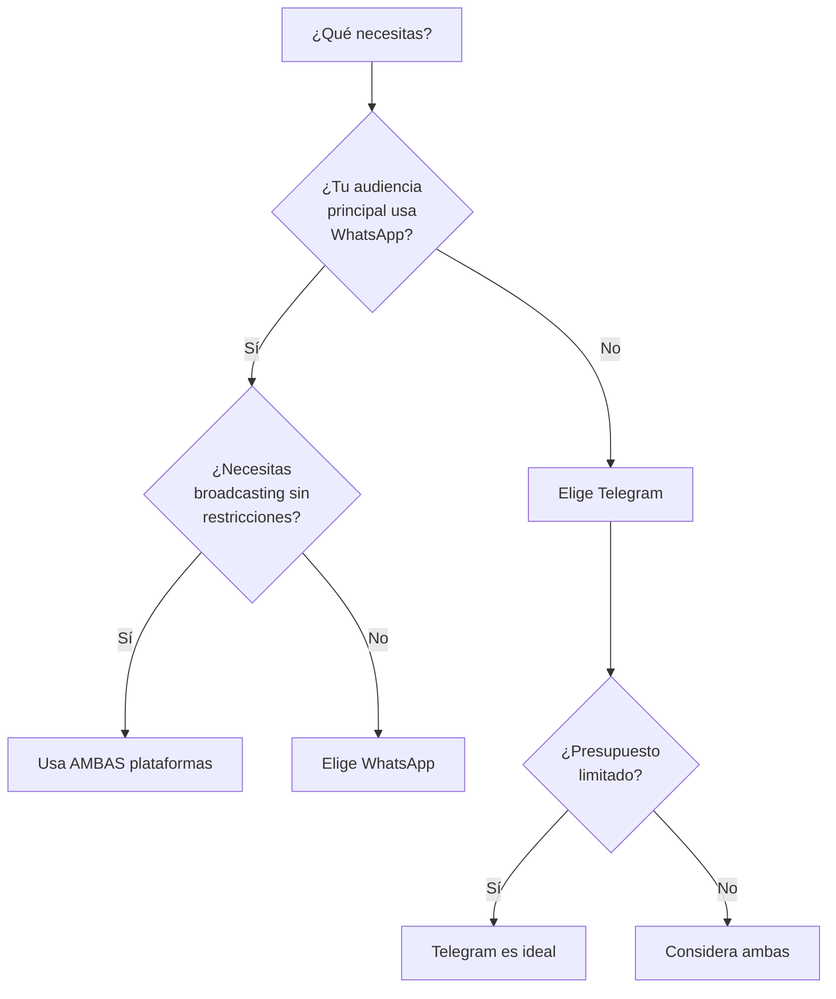

<Update title="Artículo actualizado" date="2026-05-08" />

Los chatbots son cada vez más populares en el mundo empresarial. Elegir la plataforma de mensajería adecuada para tu chatbot es una decisión estratégica que impacta directamente en tus resultados. En esta guía analizamos en profundidad las diferencias entre los chatbots de Telegram y WhatsApp para ayudarte a tomar la mejor decisión para tu negocio.

> **En resumen:** La elección entre Telegram y WhatsApp para tu negocio depende de las características, la seguridad, los precios y los objetivos de marketing. Los bots de Telegram ofrecen flexibilidad, libertad de automatización y un sólido soporte para marketing de afiliados y broadcasting sin límites estrictos de mensajería. Por otro lado, los chatbots de WhatsApp se centran en la comunicación empresarial estructurada, cuentas verificadas y cumplimiento de seguridad avanzado. Mientras que el precio de los chatbots de WhatsApp se basa en conversaciones, los bots de Telegram son generalmente más rentables.

## ¿Por qué usar un chatbot para tu negocio?

Los chatbots están ganando popularidad día a día en el mundo empresarial. Veamos por qué deberías usar un chatbot para tu negocio.

### Ahorra tiempo y dinero en atención al cliente

En el servicio al cliente de tu negocio, los chatbots pueden ahorrarte mucho tiempo y dinero. Normalmente, la mayoría de las preguntas de atención al cliente son preguntas estándar. Los chatbots pueden responder fácilmente esas preguntas estándar de forma automática con plantillas predefinidas. Por lo tanto, no tienes que responder la pregunta tú mismo: tu tiempo se ahorra. Y si tienes muchos clientes, no tienes que contratar empleados humanos para responder estas preguntas de los clientes: tu dinero se ahorra.

> En una sola palabra: si usas un chatbot para tu negocio, puedes ahorrar la mayor parte de tu tiempo y dinero en atención al cliente. Solo para preguntas personalizadas y específicas necesitarás empleados humanos para responder esas preguntas.

### Disponibilidad 24/7

Cuando estás dormido, algunos de tus clientes están despiertos. Si tienen una pregunta sobre tu negocio, productos o servicio, no pueden hacerte la pregunta porque estás dormido. Y si tienes clientes de diferentes zonas horarias, este problema se presentará con más frecuencia.

En este caso, un chatbot puede venir a rescatarte. Como está disponible 24/7, puede responder a las consultas de tus clientes en cualquier momento. Como resultado, un cliente puede hablar con tu negocio cuando quiera. Y tú puedes dormir tranquilamente sin preocuparte por responder las consultas de los clientes.

### Responde en segundos

El chatbot está disponible 24/7 y puede manejar a miles de clientes al mismo tiempo. Además, a diferencia de un ser humano, no se cansa ni se sobrecarga. Por lo tanto, un chatbot puede responder a las consultas de los clientes de inmediato.

### Marketing de tu negocio

Un chatbot puede promocionar tus productos y servicios proporcionando información sobre ellos a tus clientes. Es decir, un chatbot puede hacer marketing para tu negocio.

### Vender productos directamente

Además de hacer marketing de tu negocio, un chatbot puede vender directamente tu producto a tus clientes y recibir pagos de los clientes. Además, un chatbot puede enviar recordatorios de carritos abandonados a clientes potenciales.

### Recopilar leads

Un chatbot puede recopilar leads de clientes muy fácilmente. Algunos chatbots pueden recopilar leads en tiempo real y auténticos de los clientes de una manera conversacional.

### Programar mensajes

Un chatbot puede enviar mensajes programados a tus clientes. Por lo tanto, puede enviar los mensajes correctos a tus clientes en el momento adecuado. Es decir, envía el mensaje a los clientes cuando realmente necesitan el mensaje.

### Beneficios de los chatbots

- Reducción de costes operativos hasta un 30%
- Atención al cliente instantánea 24/7
- Escalabilidad ilimitada
- Automatización de ventas y marketing

### Capacidades clave

- Respuestas automáticas con plantillas
- Venta directa y cobros integrados
- Captura cualificada de leads
- Mensajería programada y secuencias

## ¿Qué aplicación de mensajería deberías usar para tu chatbot?

Ahora conocemos los beneficios de los chatbots para el negocio. Ahora la pregunta es en qué plataforma de mensajería lanzar un chatbot. En este artículo, hablaremos tanto del Chatbot de WhatsApp como del Chatbot de Telegram y lo que pueden hacer por tu negocio, y descubriremos cuál funciona mejor para tu negocio.

> **Dato clave:** E-SMART360 te permite gestionar chatbots tanto en WhatsApp como en Telegram desde una sola plataforma unificada, sin necesidad de herramientas separadas.

## Chatbot de Telegram

Un chatbot de Telegram puede conversar automáticamente con tus clientes en Telegram. En Telegram, normalmente chateas con otra persona en Telegram. Pero en el caso de un chatbot de Telegram, hablas con un programa de computadora, en lugar de un ser humano.

### Privacidad y seguridad

Telegram es una aplicación de mensajería instantánea gratuita que da la máxima importancia a la velocidad y la seguridad. Además, la aplicación tiene una gran capacidad de infraestructura y cifrado. Como resultado, Telegram se ha vuelto más protegido y rápido.

Por defecto, Telegram no usa cifrado de extremo a extremo. Pero los usuarios pueden activar fácilmente el cifrado de extremo a extremo habilitando los chats secretos. Después de habilitar el chat secreto, los datos del usuario están protegidos. Además, pueden obtener todos los beneficios del cifrado de extremo a extremo. Además, los usuarios pueden evitar que los mensajes sean reenviados.

Mientras los chats secretos están activados, los usuarios pueden poner su mensaje en modo de autodestrucción. En el modo de autodestrucción, un mensaje o foto desaparecerá después de un período de tiempo específico.

Asimismo, los usuarios de Telegram tienen un "nombre de usuario" público que garantiza que la privacidad esté protegida. Con el nombre de usuario, la conversación en Telegram es posible — no se requiere el número de teléfono del usuario.

### ¿Cómo activar el cifrado de extremo a extremo en Telegram?

1. Abre la conversación donde deseas activar el chat secreto.
2. Toca el nombre del contacto en la parte superior.
3. Selecciona "Iniciar chat secreto".
4. Confirma la acción. A partir de ese momento, los mensajes estarán cifrados de extremo a extremo.
5. Opcionalmente, activa el temporizador de autodestrucción para que los mensajes desaparezcan después de un tiempo determinado.

### Amplia base de usuarios

Ahora Telegram es una de las aplicaciones de mensajería instantánea más grandes del mundo entero. Telegram tiene 400 millones de usuarios activos mensuales. Y la aplicación está ganando cada vez más popularidad día a día. Cada día, 1.5 millones de nuevos usuarios se registran en Telegram.

Dado que muchas personas usan Telegram, encontrarás muchos clientes en la plataforma.

### Altamente interactivo

Telegram proporciona una interfaz fácil de usar y segura que permite a los usuarios enviar todo tipo de mensajes, desde imágenes hasta encuestas, para hacer que la participación del usuario sea altamente interactiva.

### La regla de las 24 horas no aplica al Chatbot de Telegram

Facebook Messenger, Instagram Messenger y WhatsApp tienen reglas estrictas de 24 horas que no te permiten enviar un mensaje después de 24 horas de la última interacción de los suscriptores. Pero esta regla de 24 horas no aplica a Telegram. Es decir, un Chatbot de Telegram puede enviar mensajes promocionales de broadcasting a los suscriptores en cualquier momento.

> **Ventaja clave de Telegram:** Mientras que en WhatsApp solo puedes enviar mensajes promocionales dentro de la ventana de 24 horas posterior a la interacción del usuario, en Telegram no existe esa restricción. Esto convierte a Telegram en una plataforma ideal para campañas de marketing automatizadas y broadcasting masivo.

### Mensajes promocionales de broadcasting

Dado que la regla de las 24 horas no aplica a Telegram, el Chatbot de Telegram puede enviar mensajes promocionales de broadcasting a los suscriptores en cualquier momento. Y los mensajes promocionales de broadcasting se pueden enviar instantáneamente o en un horario programado.

Dado que Telegram es una aplicación de mensajería instantánea, la tasa de apertura de los mensajes promocionales de broadcasting es mucho más alta que la de los correos electrónicos.

### Crea tu bot en Telegram

Abre la aplicación de Telegram, busca "BotFather" y sigue las instrucciones para crear un nuevo bot. Recibirás un token de acceso único para controlar tu bot.

### Conecta tu bot con E-SMART360

Usa el token de acceso para conectar tu bot de Telegram con la plataforma E-SMART360. Esto te permitirá gestionar tu bot desde un panel visual sin necesidad de programación.

### Configura tu primer flujo de broadcasting

Dentro del constructor visual de E-SMART360, crea un flujo de mensajes con el contenido promocional que deseas enviar. Define horarios, segmentos de audiencia y personalización de variables.

### Lanza tu campaña

Programa el envío o ejecútalo de inmediato. Monitorea las métricas de apertura, clics y conversiones desde el panel de E-SMART360.

### Capacidad de miembros del grupo

Un grupo de Telegram es un grupo de chat de usuarios y bots. Los usuarios y bots del grupo se llaman miembros del grupo. El grupo de Telegram puede tener un máximo de **200,000 miembros**.

### Capacidad de suscriptores del canal

Además del grupo, Telegram tiene canales. Es un grupo especial que puede tener un número **ilimitado de suscriptores**. Y esto lo convierte en una gran opción para el Chatbot de Telegram, enviando mensajes promocionales de broadcasting a una gran cantidad de audiencia.

Pero a diferencia del grupo de Telegram, solo los administradores y los bots tienen derecho a publicar mensajes. Todos los demás usuarios solo pueden recibir mensajes — no pueden publicar mensajes.

### Diferencias entre Grupos y Canales de Telegram

**Grupos de Telegram:**
- Hasta 200,000 miembros
- Todos los miembros pueden enviar mensajes
- Ideal para comunidades interactivas
- Soporta bots moderadores

**Canales de Telegram:**
- Suscriptores ilimitados
- Solo admins y bots pueden publicar
- Ideal para broadcasting y comunicaciones unidireccionales
- Perfecto para newsletters y anuncios masivos

### Soporte multiplataforma

Telegram está disponible en Android, iOS, Windows Phone, Windows PC, macOS, Linux OS e incluso navegadores. A diferencia de otras aplicaciones de mensajería instantánea, puedes usar la aplicación de Telegram en múltiples dispositivos al mismo tiempo.

### Características

Telegram es el más rico en términos de características entre las plataformas de mensajería instantánea. Para crear una experiencia conversacional integrada para los usuarios, Telegram proporciona múltiples elementos de interfaz de usuario enriquecidos.

Un chatbot en Telegram puede enviar mensajes de texto, mensajes promocionales de broadcasting, imágenes y GIFs, stickers, videos y documentos, así como puede enviar otros elementos de interfaz de usuario enriquecidos como respuestas rápidas, botones y tarjetas. Además de estas características, los bots de Telegram también soportan Comandos y Consultas en Línea.

> **Elementos UI que soporta Telegram:**
- Respuestas rápidas (Quick Replies)
- Botones interactivos (Inline Keyboards)
- Tarjetas con formato enriquecido
- Comandos personalizados (/start, /help, etc.)
- Consultas en línea (Inline Queries)
- Encuestas y cuestionarios

WhatsApp, en cambio, mantiene una interfaz más minimalista y no soporta elementos UI tan variados como Telegram.

### Cómo crear un bot de Telegram paso a paso

Crear un bot de Telegram es súper fácil y directo. Solo toma unos sencillos pasos.

Para crear un bot de Telegram, primero abre tu aplicación de Telegram. Luego, en la barra de búsqueda de la aplicación, busca con la palabra clave 'BotFather'. Luego selecciona la cuenta verificada de BotFather.

### Inicia la conversación con BotFather

Busca "BotFather" en Telegram, selecciona la cuenta verificada y presiona el botón "Start" o escribe /start. BotFather te dará la bienvenida y te mostrará una lista de comandos disponibles.

### Crea un nuevo bot

Escribe /newbot para iniciar el proceso de creación. BotFather te pedirá que elijas un nombre para tu bot (el nombre que verán los usuarios).

### Define el nombre de usuario

Después del nombre, BotFather te pedirá un nombre de usuario que termine con la palabra 'bot' (por ejemplo, MiTiendaBot). Si el nombre de usuario ya está tomado, BotFather te pedirá que elijas otro.

### Guarda tu token de acceso

Cuando el nombre de usuario esté disponible, BotFather te felicitará y te enviará un token para acceder a la API HTTP de tu bot. **Este token es la clave de tu bot** — cualquiera que lo tenga puede controlar tu bot. Guárdalo de forma segura.

### Conecta tu bot con E-SMART360

Usa el token de acceso para conectar tu bot con E-SMART360. Desde el panel de control, podrás diseñar flujos de conversación, configurar respuestas automáticas y lanzar campañas de broadcasting — todo mediante arrastrar y soltar, sin escribir código.

### ¿Por qué usar un chatbot de Telegram?

Hay muchas razones para usar el chatbot de Telegram. La aplicación de Telegram ya tiene una enorme base de usuarios y está creciendo rápidamente. Por lo tanto, tu negocio obtendrá clientes que ya están usando Telegram. Un chatbot de Telegram puede tener innumerables suscriptores. Y puede enviar mensajes promocionales de broadcasting a los suscriptores sin limitación de tiempo ya que la regla de las 24 horas no aplica a Telegram. Y la tasa de apertura de los mensajes promocionales de broadcasting es mucho más alta que la de los correos electrónicos.

Telegram tiene características de interfaz de usuario enriquecidas como respuestas rápidas, botones y tarjetas. Por lo tanto, el Chatbot de Telegram puede enviar mensajes con plantillas a los usuarios.

### ¿Qué tipos de negocio se benefician más de Telegram?

**Marketing de afiliados:** Los bots de Telegram son ideales para compartir enlaces de afiliados de forma automatizada, sin restricciones de tiempo.

**Comunidades y grupos:** Los grupos de hasta 200,000 miembros y los canales ilimitados hacen de Telegram la plataforma perfecta para construir comunidades.

**Broadcasting masivo:** Sin límite de 24 horas, puedes enviar campañas promocionales cuando lo necesites.

**Educación y cursos:** Los bots de Telegram pueden gestionar lecciones, quizzes y entregas de tareas de forma automatizada.

## Chatbot de WhatsApp

Un chatbot de WhatsApp puede conversar automáticamente con tus clientes en WhatsApp. En WhatsApp, normalmente chateas con otra persona en WhatsApp. Pero en el caso de un chatbot de WhatsApp, hablas con un programa de computadora, en lugar de un ser humano.

### Seguridad y privacidad

La seguridad y la privacidad son fundamentos principales del ecosistema del Chatbot de WhatsApp. Y WhatsApp está libre de anuncios y spam. Y es una de las razones por las que muchas personas usan WhatsApp.

En WhatsApp, por defecto, el cifrado de extremo a extremo está habilitado. Es decir, en WhatsApp, los datos de los usuarios están seguros y el usuario puede beneficiarse de todas las características habituales del cifrado de extremo a extremo.

> **Cifrado en WhatsApp:** A diferencia de Telegram, WhatsApp tiene el cifrado de extremo a extremo activado por defecto en todos los chats. Esto significa que ni siquiera Meta (la empresa propietaria de WhatsApp) puede leer el contenido de tus mensajes. Esta característica es especialmente importante para negocios en industrias reguladas como salud, finanzas y servicios legales.

### Amplia base de usuarios

Más de **2 mil millones de personas** en todo el mundo usan WhatsApp en más de 180 países. Con 2 mil millones de usuarios, WhatsApp es sin duda la aplicación de mensajería instantánea número uno en el mercado. WhatsApp entrega alrededor de 100 mil millones de mensajes cada día.

Esta enorme base de usuarios da a los bots de WhatsApp fácil acceso a un mercado masivo. Por lo tanto, los dueños de negocios no tienen que pedir a los clientes que instalen una nueva aplicación de mensajería instantánea para iniciar una conversación.

### Características

Un Chatbot de WhatsApp puede enviar mensajes de texto, imágenes, GIFs, audio, video y archivos de cualquier tipo. WhatsApp mantiene su interfaz lo más minimalista posible. Por lo tanto, no soporta interfaz de usuario enriquecida como respuestas rápidas, botones y tarjetas.

> **Novedades en WhatsApp:** Aunque WhatsApp tradicionalmente ha sido más minimalista, con la llegada de los WhatsApp Flows, los mensajes interactivos con botones y las listas dinámicas, ha ampliado sus capacidades. E-SMART360 aprovecha estas funcionalidades para crear experiencias conversacionales completas dentro del ecosistema de WhatsApp.

### Soporte multiplataforma

WhatsApp es una aplicación de mensajería instantánea multiplataforma. Está disponible en Android, iOS y web.

### Reglas de mensajes de 24 horas en WhatsApp

Dado que WhatsApp está libre de anuncios y spam, es imposible enviar cualquier mensaje a cualquier persona en cualquier momento con tu chatbot de WhatsApp. Hay ciertas reglas sobre el envío de mensajes que debes seguir. Las reglas están aquí para que las empresas no puedan enviar spam a todos en WhatsApp.

**Conversación iniciada por el usuario:** Si un usuario inicia una conversación con tu negocio, tu negocio tiene 24 horas para responder a ese mensaje. Si un negocio inicia una conversación con un usuario después de la ventana de 24 horas, no tienes que preocuparte porque no estarás rompiendo ninguna regla.

En el momento en que un usuario envía un mensaje a un bot de WhatsApp, se abre una ventana de 24 horas. Y dentro del marco de una ventana de 24 horas, tu chatbot puede enviar cualquier mensaje al usuario. Y después de la ventana de 24 horas, tu chatbot no puede enviar mensajes promocionales de broadcasting.

### ¿Cómo funciona la ventana de 24 horas en WhatsApp Business API?

La ventana de 24 horas se abre cuando un usuario envía el último mensaje a tu negocio. Durante ese período:

- **Mensajes gratuitos:** Puedes responder con mensajes de servicio (marketing, utilidad, autenticación)
- **Sin plantillas:** Puedes enviar mensajes sin necesidad de plantillas pre-aprobadas
- **Respuestas personalizadas:** Puedes mantener una conversación fluida y natural

Una vez que la ventana de 24 horas expira:
- Solo puedes enviar mensajes usando **plantillas pre-aprobadas por Meta**
- Los mensajes de marketing requieren categoría "marketing"
- Cada plantilla utilizada abre una nueva ventana de conversación de 24 horas

### Mensajes promocionales de broadcasting

Un chatbot de WhatsApp solo puede enviar mensajes promocionales de broadcasting mientras una ventana de 24 horas está abierta. De lo contrario, no puede enviar mensajes promocionales de broadcasting.

### Configura tu WhatsApp Business API

Conecta tu número de WhatsApp Business con la API oficial a través de E-SMART360. Necesitarás una cuenta de Meta Business Manager y verificar tu negocio.

### Crea plantillas de mensajes aprobadas por Meta

Diseña plantillas de mensajes para marketing, utilidad y autenticación. Estas deben ser aprobadas por Meta antes de poder usarlas para broadcasting. El proceso de aprobación puede tomar desde minutos hasta varios días.

### Segmenta tu audiencia

Importa tu lista de contactos a E-SMART360 y segmenta por etiquetas, historial de compras, ubicación o cualquier campo personalizado.

### Programa tu campaña de broadcasting

Selecciona la plantilla aprobada, el segmento de audiencia y programa el envío. E-SMART360 gestionará todo el proceso respetando los límites y reglas de WhatsApp.

### No es fácil lanzar un Chatbot de WhatsApp

No es fácil lanzar un bot de WhatsApp. Lanzar un Chatbot de WhatsApp necesita integración con un proveedor de servicios API de WhatsApp como Twilio o WABA.

El proceso de lanzar un chatbot de WhatsApp toma de **3 a 4 semanas** ya que se necesitan múltiples aprobaciones entre tu negocio y Meta.

> **Con E-SMART360 este proceso se simplifica enormemente.** Nuestra plataforma te guía paso a paso a través de todo el proceso de configuración de WhatsApp Business API, incluyendo Embedded Signup, verificación empresarial y creación de plantillas. Lo que normalmente tomaría semanas, con E-SMART360 puede estar listo en días.

### ¿Por qué usar un bot de WhatsApp?

El Chatbot de WhatsApp no tiene características de interfaz de usuario enriquecidas. Y lanzar un chatbot de WhatsApp es muy difícil. Aun así, deberías usar el chatbot de WhatsApp porque WhatsApp tiene una enorme base de usuarios. Es decir, tus clientes ya están usando WhatsApp. Como los usuarios confían en WhatsApp, la aplicación de mensajería tiene una alta tasa de participación. Por lo tanto, obtendrás mucha interacción de ida y vuelta con tus clientes con el Chatbot de WhatsApp.

### ¿Cuándo elegir WhatsApp?

- Tu audiencia principal está en WhatsApp
- Necesitas cumplimiento normativo estricto (salud, finanzas)
- Quieres usar el catálogo de productos de WhatsApp
- Necesitas integración con Click to WhatsApp Ads
- Priorizas el cifrado de extremo a extremo por defecto

### ¿Cuándo elegir Telegram?

- Necesitas broadcasting sin límite de 24 horas
- Quieres grupos grandes y canales ilimitados
- Buscas interfaces de usuario enriquecidas (botones, tarjetas)
- El presupuesto es una prioridad (sin coste por conversación)
- Necesitas comandos personalizados y consultas en línea

## Tabla comparativa: WhatsApp vs Telegram para Chatbots

| Característica | WhatsApp | Telegram |
|---|---|---|
| Usuarios activos mensuales | 2,000 millones | 400 millones |
| Cifrado extremo a extremo | ✓ Por defecto en todos los chats | ✓ Solo en chats secretos |
| Regla de 24 horas | ✓ Aplica estrictamente | ✗ No aplica |
| Broadcasting promocional | Solo con plantillas y ventana 24h | Ilimitado, sin restricciones |
| Elementos UI enriquecidos | Mínimo (texto, media, botones) | Botones, tarjetas, comandos, encuestas |
| Grupos/Capacidad | 1,024 miembros | 200,000 miembros / Canales ilimitados |
| Coste | Por conversación (modelo de pago por uso) | Generalmente gratuito |
| Proceso de configuración | 3-4 semanas (aprobaciones Meta) | Minutos (vía BotFather) |
| Verificación de negocio | Necesaria (Green Tick disponible) | No requerida |
| Disponibilidad multiplataforma | Android, iOS, Web | Android, iOS, Windows, macOS, Linux, Web |
| mensajes simultáneos | Límite según nivel de calidad | Sin límite práctico |

> **Dato de E-SMART360:** Nuestra plataforma te permite gestionar chatbots tanto en WhatsApp como en Telegram desde un solo panel de control. No necesitas elegir una sola plataforma — puedes estar en ambas y centralizar toda tu estrategia de chatbot marketing.

## Precios y estructura de costes

### WhatsApp Business API

El modelo de precios de WhatsApp se basa en **conversaciones**. Cada conversación se categoriza en uno de estos tipos:

- **Marketing:** Promociones, ofertas, campañas
- **Utilidad:** Confirmaciones de pedidos, notificaciones de envío
- **Servicio:** Respuestas a consultas de clientes (gratuito si se inicia dentro de la ventana de 24h)
- **Autenticación:** Códigos OTP, verificación en dos pasos

Cada categoría tiene un coste por conversación que varía según el país del destinatario.

### Ejemplo de estructura de precios de WhatsApp Business API

Para un negocio que envía 10,000 conversaciones de marketing al mes:
- Marketing: ~$0.025-$0.08 por conversación (dependiendo del país)
- Utilidad: ~$0.01-$0.04 por conversación
- Servicio: Gratuito dentro de ventana 24h

**Ejemplo mensual:**
- 5,000 conversaciones de marketing → ~$125-$400
- 3,000 conversaciones de utilidad → ~$30-$120
- 2,000 conversaciones de servicio → $0 (gratis)

Con E-SMART360 no hay markup adicional sobre estos precios de WhatsApp.

### Telegram Bot API

Los bots de Telegram son **completamente gratuitos** para usar. No hay coste por mensaje, por conversación o por suscriptor. El único coste potencial es la infraestructura donde alojas tu bot (servidores, dominios) si decides no usar una plataforma como E-SMART360.

> **Comparativa de costes:**
- **Telegram:** $0 en costes de API. Ideal para presupuestos ajustados y alto volumen de mensajes.
- **WhatsApp:** Coste variable por conversación. Más caro pero con mayor alcance global (2B usuarios).
- **E-SMART360:** Precio fijo mensual sin markup en APIs. Obtienes ambas plataformas en una sola suscripción.

## Casos de uso específicos por industria

### Marketing de afiliados

**Recomendación: Telegram.** Los bots de Telegram son altamente efectivos para marketing de afiliados ya que permiten compartir enlaces automatizados, campañas de broadcasting sin restricciones temporales y mensajes ilimitados.

### Atención al cliente

**Recomendación: Ambos.** WhatsApp es ideal para atención al cliente transaccional (confirmaciones, seguimiento de pedidos) porque los usuarios ya están familiarizados con la plataforma. Telegram es excelente para comunidades de soporte donde los usuarios se ayudan entre sí.

### E-commerce y ventas

**Recomendación: WhatsApp.** Con 2 mil millones de usuarios, el catálogo de productos integrado y los Click to WhatsApp Ads, WhatsApp es la plataforma más potente para ventas directas. Telegram puede ser un complemento para segmentos de clientes más técnicos.

### Comunidades y grupos

**Recomendación: Telegram.** Los grupos de hasta 200,000 miembros, los canales ilimitados, los bots moderadores y las encuestas hacen de Telegram la plataforma definitiva para construir y gestionar comunidades.

### ¿Se pueden usar ambas plataformas simultáneamente?

¡Absolutamente! De hecho, es la estrategia más recomendada. Con E-SMART360 puedes:
1. Usar **WhatsApp** para ventas, atención al cliente transaccional y campañas con plantillas aprobadas
2. Usar **Telegram** para comunidades, broadcasting sin restricciones y marketing de contenidos
3. Centralizar ambas plataformas en un solo panel para gestionar equipos, métricas y automatizaciones

Esta estrategia multicanal maximiza tu alcance mientras optimiza los costes.

## Preguntas Frecuentes

### ¿Cuáles son las principales características de un bot de Telegram para negocios?

Las características principales de los bots de Telegram incluyen respuestas automáticas, broadcasting sin restricciones de 24 horas, integración con grupos y canales, comandos personalizados para bots y una gran flexibilidad de API. Es ideal para comunidades y automatización de marketing.

### ¿Cuáles son las características clave de un chatbot de WhatsApp?

Las características clave de los chatbots de WhatsApp incluyen respuestas automáticas, mensajería con plantillas, integración con CRM, perfiles de negocio verificados, intercambio de multimedia y comunicación estructurada con clientes siguiendo las directrices de Meta.

### ¿Qué características de IA ofrece un chatbot de WhatsApp?

Los chatbots de WhatsApp con IA ofrecen procesamiento de lenguaje natural, soporte al cliente automatizado, cualificación inteligente de leads, seguimiento de pedidos, reserva de citas y automatización basada en flujos de trabajo para negocios.

### ¿Qué características de seguridad ofrece un chatbot de WhatsApp con IA?

Las características de seguridad de los chatbots de WhatsApp con IA incluyen cifrado de extremo a extremo, autenticación de negocio verificada, políticas de cumplimiento de Meta y transmisión segura de datos, lo que lo hace adecuado para industrias reguladas.

### ¿Cuál es la diferencia entre un bot de WhatsApp y un bot de Telegram?

Al comparar un bot de WhatsApp vs bot de Telegram, WhatsApp ofrece herramientas de negocio estructuradas y alcance global, mientras que Telegram proporciona mayor flexibilidad, menos restricciones de mensajería y más libertad en la automatización. WhatsApp tiene 2B usuarios pero costes por conversación; Telegram tiene 400M usuarios pero es gratuito.

### ¿Cuánto cuesta típicamente un chatbot de WhatsApp?

El precio de los chatbots de WhatsApp se basa en un modelo por conversación. Las empresas pagan por categoría de conversación (marketing, utilidad, autenticación o servicio), y el coste puede variar según el país. Con E-SMART360, no hay markup adicional sobre estos precios estándar de WhatsApp.

### ¿Puedo usar un bot de Telegram para marketing de afiliados?

Sí, un bot de Telegram para marketing de afiliados es altamente efectivo. Telegram permite compartir enlaces automatizados, campañas de broadcasting y mensajes ilimitados sin restricciones de tiempo, lo que lo convierte en la plataforma ideal para estrategias de afiliación.

### ¿Son los bots de Telegram más baratos que los chatbots de WhatsApp?

En la mayoría de los casos, los bots de Telegram son más rentables porque no cobran por conversación como los modelos de precios de los chatbots de WhatsApp. Telegram es gratuito; WhatsApp tiene costes variables por conversación.

### ¿Qué plataforma ofrece mejores características de automatización?

Ambas plataformas ofrecen automatización, pero los bots de Telegram proporcionan más flexibilidad, mientras que los chatbots de WhatsApp con IA se centran en una automatización estructurada, segura y conforme a las normativas empresariales. Con E-SMART360, obtienes lo mejor de ambos mundos.

### ¿Puedo migrar mi chatbot de WhatsApp a Telegram o viceversa?

Sí, E-SMART360 facilita la gestión de chatbots en ambas plataformas simultáneamente. Aunque el contenido y la estructura pueden necesitar adaptación (por las diferencias en elementos UI y reglas de mensajería), la plataforma te permite crear flujos que funcionen en ambas sin tener que aprender sistemas separados.

## Ejemplos prácticos

### Caso 1: Tienda de ropa online

Una tienda de ropa con presencia en España y Latinoamérica implementa:

**WhatsApp:** Catálogo de productos, notificaciones de envío, confirmación de pedidos y atención al cliente post-venta. Usa plantillas de utilidad para seguimiento de pedidos.

**Telegram:** Canal con 50,000 suscriptores para nuevos lanzamientos, ofertas exclusivas y contenido de moda. Usa el bot para encuestas semanales sobre preferencias.

**Resultado:** Aumento del 35% en ventas recurrentes y reducción del 40% en costes de atención al cliente.

### Caso 2: Agencia de marketing digital

Una agencia que gestiona campañas para 20 clientes:

**WhatsApp:** Notificaciones de informes semanales a cada cliente, recordatorios de reuniones y campañas de marketing para los negocios de sus clientes.

**Telegram:** Grupo privado de equipo con 15 miembros para coordinación diaria. Canales temáticos para cada cliente con actualizaciones en tiempo real.

**Resultado:** Mejora del 50% en la comunicación interna y un 25% más de eficiencia en las campañas.

### Guía rápida: Cómo empezar con E-SMART360

1. **Regístrate** en E-SMART360 (prueba gratuita disponible).
2. **Conecta tu WhatsApp Business API** siguiendo el asistente paso a paso (Embedded Signup).
3. **Crea tu bot de Telegram** usando BotFather y conéctalo con el token.
4. **Diseña tus flujos** con el constructor visual de arrastrar y soltar.
5. **Segmenta tu audiencia** importando contactos o conectando Google Sheets.
6. **Lanza tu primera campaña** en WhatsApp, Telegram o ambas simultáneamente.
7. **Monitorea resultados** desde el panel de analytics integrado.

## Configuración del perfil de negocio en WhatsApp Cloud API

Cuando utilizas WhatsApp Business API a través de E-SMART360, tienes control total sobre la configuración de tu perfil de negocio. Esto incluye:

- **Foto de perfil:** El logo de tu empresa que verán los clientes.
- **Descripción:** Una breve descripción de tu negocio (hasta 512 caracteres).
- **Sitio web:** Enlace a tu página web oficial.
- **Dirección:** Ubicación física de tu negocio (opcional).
- **Horario:** Horario de atención al cliente.
- **Correo electrónico:** Email de contacto para soporte.
- **Categoría:** El tipo de negocio que tienes (tienda, servicio, educación, etc.).

> La configuración del perfil de negocio en WhatsApp Cloud API es importante porque los usuarios ven esta información cuando interactúan con tu chatbot. Un perfil completo y profesional genera mayor confianza y mejora las tasas de conversión.

## Categorías de mensajes en WhatsApp Business API

Meta clasifica las conversaciones de WhatsApp en diferentes categorías, cada una con su propio coste y propósito:

### Mensajes de Marketing
Incluyen promociones, ofertas especiales, anuncios de nuevos productos, invitaciones a eventos y cualquier comunicación cuyo objetivo sea generar ventas o engagement. Requieren plantillas pre-aprobadas por Meta y tienen el coste más alto por conversación.

### Mensajes de Utilidad
Son mensajes transaccionales que facilitan una acción acordada entre el negocio y el cliente. Incluyen confirmaciones de pedidos, notificaciones de envío, recordatorios de citas, actualizaciones de facturación y alertas de cuenta. Tienen un coste menor que los mensajes de marketing.

### Mensajes de Servicio
Son las respuestas que das a los clientes cuando ellos inician la conversación. Dentro de la ventana de 24 horas, estos mensajes son gratuitos. Cubren consultas de soporte, preguntas sobre productos, asistencia post-venta y cualquier otra interacción iniciada por el cliente.

### Mensajes de Autenticación
Códigos de verificación, OTP (One-Time Passwords) y confirmaciones de identidad. WhatsApp tiene tarifas especiales para estas conversaciones, generalmente más económicas que las de marketing.

### Ejemplo práctico de categorización de conversaciones

**Escenario:** Un cliente compra un producto en tu tienda online.

1. **El cliente pregunta:** "¿Cuándo llega mi pedido?" → **Servicio** (gratuito dentro de 24h)
2. **Tú respondes:** "Tu pedido #12345 ha sido enviado" → **Utilidad** (coste bajo)
3. **Al día siguiente envías:** "Tenemos 20% de descuento en tu próxima compra" → **Marketing** (coste más alto, requiere plantilla aprobada)
4. **El cliente inicia sesión:** Código OTP "Tu código de verificación es 8842" → **Autenticación** (tarifa especial)

## Límites de mensajería en WhatsApp Business API

WhatsApp establece límites de mensajería basados en la **calidad de tu cuenta** y tu **volumen de conversaciones**. Estos límites determinan cuántos mensajes puedes enviar en un período de 24 horas.

### Niveles de límite de mensajería

| Nivel | Límite de mensajes | Requisitos |
|---|---|---|
| **Nivel 1** | 1,000 conversaciones/día | Conexión inicial |
| **Nivel 2** | 10,000 conversaciones/día | Alta calidad, pocos reportes |
| **Nivel 3** | 100,000 conversaciones/día | Excelente calidad, volumen sostenido |
| **Nivel 4** | Personalizado | Cuentas verificadas con alto volumen |

> La **calidad de tu cuenta** se mide por los reportes de spam que reciben tus mensajes, los bloqueos de usuarios y las tasas de apertura. Si tu calidad baja, tu límite de mensajería se reduce automáticamente. E-SMART360 te proporciona herramientas para monitorizar y mantener tu calidad.

### Cómo mejorar y mantener tu calidad en WhatsApp

1. **Solo envía mensajes a usuarios que hayan optado por recibirlos.**
2. **Segmenta tu audiencia** para enviar contenido relevante.
3. **Evita enviar mensajes frecuentes** a usuarios inactivos.
4. **Incluye siempre una opción para darse de baja** en tus mensajes de marketing.
5. **Monitorea tus métricas** de calidad desde el panel de E-SMART360.

## Capacidades de broadcasting en Telegram

Una de las grandes ventajas de Telegram sobre WhatsApp es la flexibilidad total para broadcasting. Veamos en detalle cómo funciona:

### Tipos de broadcasting en Telegram

- **Broadcasting a canales:** Puedes enviar mensajes a un número ilimitado de suscriptores de canal.
- **Broadcasting a grupos:** Envía mensajes a grupos de hasta 200,000 miembros.
- **Broadcasting directo a usuarios:** Envía mensajes directos a todos los suscriptores de tu bot.

> **Estrategia multicanal recomendada:** Usa los canales de Telegram para comunicación unidireccional (anuncios, promociones) y los bots para conversaciones bidireccionales (atención al cliente, encuestas). Con E-SMART360 puedes gestionar ambos desde un solo panel.

### Formato de mensajes en broadcasting de Telegram

Los mensajes de broadcasting en Telegram pueden incluir:
- Texto formateado (negrita, cursiva, código, enlaces)
- Imágenes y GIFs
- Videos y archivos de audio
- Botones interactivos (Inline Buttons)
- Encuestas y cuestionarios
- Documentos de cualquier tipo
- Stickers animados

## Gestión de contactos y suscriptores

Tanto para WhatsApp como para Telegram, la gestión eficiente de tus contactos es crucial para el éxito de tus campañas.

### Cómo importar contactos

### Prepara tu lista de contactos

Crea un archivo CSV o Google Sheets con las columnas necesarias (nombre, teléfono, email, etiquetas, campos personalizados). Asegúrate de que los números de teléfono estén en formato internacional.

### Sube tus contactos a E-SMART360

Desde el panel de Suscriptores, selecciona "Importar Suscriptores" y sube tu archivo CSV o conecta tu Google Sheet. E-SMART360 mapeará automáticamente las columnas.

### Segmenta por etiquetas

Crea etiquetas personalizadas ("Nuevo Lead", "Interesado en Demo", "Cliente VIP") y asígnalas a tus contactos para segmentar campañas.

### Mantén tu lista limpia

Monitorea contactos inactivos, rebotes y opt-outs. E-SMART360 te ayuda a mantener una lista de contactos saludable para maximizar tu tasa de entrega.

## Automatización avanzada con flujos de chatbot

Tanto en WhatsApp como en Telegram, la automatización de conversaciones puede ser simple o altamente compleja dependiendo de tus necesidades.

### Flujos básicos

- **Respuestas automáticas por palabra clave:** Cuando un usuario escribe "precio", "horario" o "contacto", el chatbot responde con la información correspondiente.
- **Menús interactivos:** Guía al usuario a través de opciones predefinidas para encontrar lo que busca.
- **FAQ automatizado:** Responde preguntas frecuentes sin intervención humana.

### Flujos avanzados

- **Secuencias de ventas:** Guía al cliente desde el primer contacto hasta la compra en una secuencia de varios pasos.
- **Recuperación de carritos abandonados:** Envía recordatorios automáticos a usuarios que dejaron productos en su carrito.
- **Flujos condicionales:** Dependiendo de las respuestas del usuario, el chatbot toma diferentes caminos.
- **Integración con APIs externas:** Consulta información en tiempo real (stock, precios, estado de pedidos) desde tu sistema.
- **User Input Flow:** Para conversaciones complejas donde necesitas recopilar múltiples datos del usuario de forma estructurada.

### Ejemplo: Flujo de ventas automatizado en WhatsApp

**Paso 1:** Usuario envía "Hola" al chatbot.
**Paso 2:** Chatbot responde con un menú: "Elige una opción:\n1. Ver catálogo\n2. Hablar con un asesor\n3. Rastrear mi pedido"
**Paso 3:** Usuario elige "1" y el chatbot muestra los productos destacados con imágenes y precios.
**Paso 4:** Usuario selecciona un producto y el chatbot pregunta por la cantidad y dirección de envío.
**Paso 5:** Chatbot confirma el pedido y envía un enlace de pago.
**Paso 6:** Una vez pagado, el chatbot envía el número de seguimiento.

Todo esto sucede sin intervención humana, 24/7.

## Cómo elegir la plataforma adecuada para tu negocio

Para tomar la decisión correcta, considera estos factores:

### Factores a favor de WhatsApp

1. **Alcance global:** 2 mil millones de usuarios activos.
2. **Confianza del usuario:** Los usuarios confían en WhatsApp para comunicación empresarial.
3. **Click to WhatsApp Ads:** Integración directa con anuncios de Facebook/Instagram.
4. **Catálogo de productos:** Muestra y vende productos directamente en el chat.
5. **Cifrado por defecto:** Ideal para industrias con requisitos de privacidad.
6. **Business API oficial:** Soporte técnico de Meta para cuentas verificadas.

### Factores a favor de Telegram

1. **Sin límite de 24 horas:** Broadcasting ilimitado.
2. **Cero coste de API:** Sin coste por conversación.
3. **Grupos masivos:** Hasta 200,000 miembros.
4. **Canales ilimitados:** Audiencia sin restricciones.
5. **Interfaz rica:** Botones, tarjetas, comandos personalizados.
6. **Configuración instantánea:** Bot listo en minutos.

### Árbol de decisión rápido

## Plantillas de mensajes en WhatsApp Business API

Las plantillas de mensajes son la base del broadcasting en WhatsApp. A diferencia de Telegram, donde puedes enviar cualquier mensaje libremente, en WhatsApp necesitas plantillas pre-aprobadas por Meta para iniciar conversaciones.

### Plantillas de Utilidad

Las plantillas de utilidad están diseñadas para actualizaciones transaccionales, como confirmaciones, cambios o suspensiones relacionadas con una transacción o suscripción específica. Deben ser funcionales y no promocionales. Si una plantilla contiene tanto contenido de utilidad como de marketing, se clasificará como plantilla de marketing.

**Ejemplos de plantillas de utilidad:**

- Confirmación de pedido: "Tu pedido #12345 ha sido confirmado. Recibirás una actualización de seguimiento pronto."
- Recibo de pago: "Tu pago de $50 se ha procesado correctamente. ¡Gracias por tu compra!"
- Recordatorio de cita: "Recordatorio: Tu cita con el Dr. García está programada para el 15 de marzo a las 10 AM. Responde para confirmar."

### Plantillas de Marketing

Las plantillas de marketing ofrecen mayor flexibilidad y se utilizan para mensajes que no se relacionan con una transacción específica. Pueden incluir promociones, ofertas, mensajes de bienvenida, actualizaciones, invitaciones, recomendaciones o solicitudes de participación del cliente.

**Ejemplos de plantillas de marketing:**

- Oferta promocional: "¡Oferta exclusiva! Obtén un 20% de descuento en tu próxima compra. Usa el código AHORRO20 al finalizar."
- Re-engagement: "¡Te extrañamos! Disfruta de envío gratis en tu próximo pedido. Toca abajo para comprar ahora."
- Invitación a evento: "Únete a nuestro próximo webinar sobre tendencias de marketing digital. ¡Regístrate ahora!"

> WhatsApp revisa cada plantilla antes de aprobarla. Las razones más comunes de rechazo incluyen: contenido promocional disfrazado de utilidad, falta de opción para darse de baja, URLs acortadas y lenguaje engañoso. Con E-SMART360, tus plantillas pasan por un proceso de validación automática antes de enviarse a Meta.

## Entendiendo la calidad de tu cuenta en WhatsApp

WhatsApp asigna una calificación de calidad a cada cuenta de negocio. Esta calificación impacta directamente en tus límites de mensajería.

### Factores que afectan tu calidad

1. **Bloqueos de usuarios:** Si los usuarios bloquean tus mensajes, tu calidad baja.
2. **Reportes de spam:** Cada vez que un usuario reporta un mensaje como spam.
3. **Tasa de apertura:** Cuantos más usuarios abran tus mensajes, mejor será tu calidad.
4. **Velocidad de respuesta:** Responder rápidamente dentro de la ventana de 24 horas mejora tu calidad.

### ¿Cómo mejorar tu calidad en WhatsApp?

- Envía mensajes solo a usuarios que hayan dado su consentimiento explícito.
- Segmenta tu audiencia para enviar contenido relevante a cada grupo.
- No envíes mensajes con demasiada frecuencia (respeta el frequency capping de Meta).
- Incluye siempre una opción clara para darse de baja en mensajes de marketing.
- Monitorea tus métricas de calidad desde el panel de E-SMART360.
- Usa el periodo de prueba gratuito para validar tu estrategia antes de escalar.

## Conversaciones gratuitas en WhatsApp: Free Entry Point

Una de las ventajas menos conocidas de WhatsApp Business API son las **conversaciones de punto de entrada gratuito**. Si un cliente llega a través de un Click to WhatsApp Ad o un Call-to-Action de Facebook Page, y respondes dentro de 24 horas, iniciarás una conversación gratuita que dura **72 horas**. Durante este período, puedes enviar cualquier tipo de mensaje al cliente sin coste adicional.

> Esta característica es especialmente valiosa para campañas de publicidad pagada. Con E-SMART360, puedes integrar tus anuncios de Facebook e Instagram directamente con tu chatbot de WhatsApp, maximizando el retorno de tu inversión publicitaria.

## Comparativa de costes totales

| Concepto | WhatsApp Business API | Telegram Bot API |
|---|---|---|
| **Coste de API** | Por conversación (variable por país y categoría) | Gratuito |
| **Coste de plataforma** | Suscripción a E-SMART360 | Suscripción a E-SMART360 |
| **Coste de plantillas** | Incluido en conversaciones | No aplica |
| **Coste por 10,000 envíos marketing** | ~$250-$800 (según país) | $0 |
| **Coste por 10,000 envíos utilidad** | ~$50-$200 | $0 |
| **Conversaciones de servicio** | Gratuitas dentro de ventana 24h | $0 |
| **Conversaciones free entry** | Gratis 72h (desde anuncios) | No aplica |

> **Cálculo de ejemplo para España:**
- 1,000 conversaciones de marketing: ~$45
- 1,000 conversaciones de utilidad: ~$15
- Miles de conversaciones de servicio: $0
Con E-SMART360 no hay markup sobre estos precios de WhatsApp.

## Frequency Capping en WhatsApp

Meta aplica un límite de frecuencia (frequency capping) para proteger a los usuarios de recibir demasiados mensajes de marketing. Esto significa que no puedes enviar mensajes de marketing a un mismo usuario con demasiada frecuencia.

### Detalles del Frequency Capping de WhatsApp

- **Límite estándar:** WhatsApp limita los mensajes de marketing a un máximo de 2-3 por semana por usuario (el límite exacto varía según la región).
- **Propósito:** Evitar la fatiga del usuario y reducir reportes de spam.
- **Gestión:** E-SMART360 gestiona automáticamente el frequency capping, asegurando que tus campañas cumplan con las políticas de Meta sin que tengas que preocuparte por los límites.
- **Impacto:** Un buen frequency capping mejora tu calidad de cuenta y reduce los bloqueos de usuarios.

## ¿Qué plataforma elegir para empezar?

Si estás empezando desde cero, esta guía práctica te ayudará a decidir:

### Empieza con Telegram si...

- Tienes un presupuesto limitado
- Quieres resultados rápidos (minutos, no semanas)
- Tu estrategia se basa en broadcasting y contenido
- Quieres construir una comunidad alrededor de tu marca
- Haces marketing de afiliados o contenido digital

### Empieza con WhatsApp si...

- Tu audiencia objetivo usa principalmente WhatsApp
- Vendes productos o servicios directamente
- Necesitas confirmaciones de pedidos y notificaciones
- Tu mercado principal está en Latinoamérica o Europa
- La confianza y el cifrado son prioritarios para tu industria

> **Mejor opción: empieza con ambas.** Con E-SMART360 puedes configurar tu bot de Telegram en minutos mientras gestionas el proceso de aprobación de WhatsApp en paralelo. Para cuando WhatsApp esté listo, ya tendrás una audiencia activa en Telegram.

## Conclusión

Tanto los chatbots de WhatsApp como los de Telegram ofrecen ventajas significativas para diferentes tipos de negocio. La decisión final depende de:

- **Tu audiencia objetivo:** ¿Dónde pasan más tiempo tus clientes?
- **Tus objetivos de marketing:** ¿Broadcasting masivo o comunicación transaccional?
- **Tu presupuesto:** ¿Coste por conversación o modelo gratuito?
- **Tus necesidades técnicas:** ¿Interfaz rica o cumplimiento normativo?
- **Tu estrategia a largo plazo:** ¿Una plataforma o multicanal?

> **La recomendación de E-SMART360:** No elijas una sola plataforma. Implementa una estrategia multicanal donde WhatsApp maneje las comunicaciones transaccionales y transacciones, mientras Telegram gestiona comunidades, broadcasting y marketing de contenidos. Con E-SMART360, gestionar ambas plataformas desde un solo lugar es sencillo, eficiente y rentable.

Empieza hoy con una prueba gratuita y descubre cómo la automatización de chatbots puede transformar tu negocio.

## Recursos adicionales

- [Guía completa de configuración de WhatsApp Business API](/recursos/configuracion-whatsapp-api)
- [Cómo crear un bot de Telegram paso a paso](/recursos/crear-bot-telegram)
- [Estrategias de broadcasting multicanal](/recursos/broadcasting-multicanal)
- [Segmentación avanzada de audiencia](/recursos/segmentacion-audiencia)
- [Automatización de ventas con chatbots](/recursos/automatizacion-ventas-chatbots)

<Update title="Artículo actualizado con información de 2026" date="2026-05-08" />
