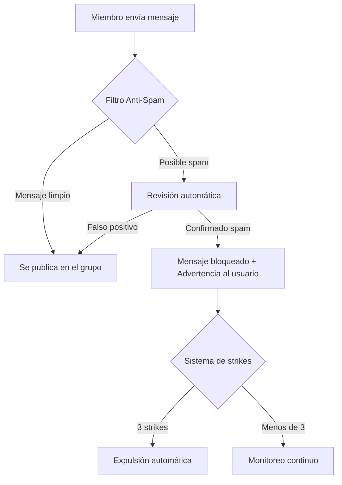

> **Actualización de la guía (2026-05-07)**
> Esta guía ha sido actualizada con la información más reciente sobre las capacidades de marketing multicanal de E-SMART360, incluyendo nuevas funcionalidades para broadcasting inteligente y automatización de ventas.

import { Callout, Steps, Step, Expandable, Columns, Card, Tabs, Tab, CodeGroup, CodeGroupItem } from '@site/src/components';

# Marketing en WhatsApp y Telegram: La Guía Completa

En la era digital actual, las empresas buscan constantemente nuevas formas de conectar con sus clientes y hacer crecer su audiencia. Una de las estrategias más efectivas para lograrlo es a través de los chatbots. Los chatbots son programas impulsados por inteligencia artificial que pueden simular conversaciones con usuarios humanos. Se pueden utilizar para una amplia variedad de propósitos: brindar atención al cliente, responder preguntas frecuentes e incluso concretar ventas.

E-SMART360 es la plataforma integral que te permite gestionar todo tu marketing conversacional desde un solo lugar, combinando lo mejor de WhatsApp y Telegram en una solución unificada.

---

## ¿Qué es E-SMART360?

E-SMART360 es una plataforma diseñada para que las empresas creen y administren chatbots tanto en WhatsApp como en Telegram. Ofrece una amplia gama de funcionalidades que cubren cada aspecto de la comunicación digital:


### Constructor Visual

Creador de chatbots con interfaz de arrastrar y soltar, sin necesidad de escribir una sola línea de código.
  
### Chat en Vivo

Monitoreo de conversaciones, intervención de agentes humanos y soporte en tiempo real.
  
### Broadcasting Inteligente

Envío de mensajes dirigidos a suscriptores de WhatsApp y Telegram con segmentación avanzada.
  
### 1. Constructor de Chatbots Visual (Arrastrar y Soltar)

El constructor visual permite crear flujos conversacionales complejos sin conocimientos técnicos. Puedes diseñar desde simples respuestas automáticas hasta embudos de venta completos con condicionales, variables y conexiones externas.


> **¿Sin experiencia en programación?** No hay problema. El constructor visual de E-SMART360 funciona como armar un diagrama de flujo: conectas bloques, defines condiciones y el chatbot cobra vida automáticamente.

### 2. Chat en Vivo (Live Chat)

El módulo de chat en vivo es fundamental para supervisar las interacciones que ocurren entre los usuarios y los chatbots. Sin esta funcionalidad, resulta difícil revisar o controlar las conversaciones que se están llevando a cabo.

- **Monitoreo de Conversaciones:** Observa en tiempo real cómo los chatbots interactúan con los clientes. Puedes revisar el historial completo de cada conversación para garantizar la calidad del servicio.
- **Intervención de Agentes Humanos:** Cuando el chatbot encuentra dificultades o se requiere una respuesta más personalizada o compleja, un agente humano puede intervenir directamente desde el panel de chat en vivo, tomando el control de la conversación.
- **Soporte en Tiempo Real:** Los clientes reciben asistencia inmediata cuando tienen consultas o necesitan ayuda urgente. Poder conectar con un agente humano garantiza una resolución rápida y efectiva de sus problemas.


> El chat en vivo compartido permite que todo tu equipo de soporte trabaje desde una misma bandeja de entrada unificada, sin importar si el cliente llegó por WhatsApp, Telegram o webchat.

### 3. Broadcasting (Campañas Masivas)

Envía mensajes promocionales a todos tus suscriptores de WhatsApp y Telegram cuando lo necesites. El sistema de broadcasting de E-SMART360 está diseñado para maximizar el alcance sin comprometer la calidad ni la reputación de tu número.


### Broadcasting en WhatsApp

Utiliza plantillas de mensaje aprobadas por Meta para llegar a tus suscriptores en cualquier momento. Segmenta por etiquetas, historial de compras o comportamiento para enviar el mensaje correcto a la persona correcta.
  
### Broadcasting en Telegram

Los bots de Telegram permiten broadcasts ilimitados a todos tus suscriptores sin las restricciones de las plantillas, ideal para newsletters, anuncios y contenido promocional.
  
### 4. Automatización Inteligente

Automatiza tareas repetitivas como responder preguntas frecuentes, calificar leads mediante preguntas y respuestas, y enviar seguimientos automáticos.

- **Respuesta Automática a Preguntas Frecuentes:** Configura tu chatbot para que responda al instante las consultas más comunes, liberando a tu equipo de soporte.
- **Calificación de Leads:** El chatbot puede hacer preguntas clave para identificar el nivel de interés de cada prospecto y clasificarlos automáticamente.
- **Secuencias de Seguimiento:** Programa mensajes de seguimiento automáticos para nurturing de leads sin intervención manual.


> **Ejemplo real:** Un negocio de comercio electrónico redujo en un 73% las consultas repetitivas al implementar un chatbot con preguntas frecuentes automatizadas en E-SMART360, permitiendo que su equipo de soporte se enfocara en casos más complejos.

### 5. Integraciones

Conecta E-SMART360 con otros sistemas como CRM, plataformas de email marketing, herramientas de automatización y más. Puedes recolectar correos electrónicos a través del chatbot y enviarlos directamente a tu proveedor de email marketing.


### Ver lista completa de integraciones disponibles

- **AI Bot Reply:** Integración con tecnología OpenAI para interacciones con lenguaje natural.
- **Catálogo de WhatsApp:** Exhibición y venta de productos directamente desde WhatsApp.
- **Webhook Workflow:** Automatización de flujos de trabajo con webhooks.
- **WhatsApp Flows:** Formularios interactivos dentro de los chats de WhatsApp.
- **Zapier:** Conexión con más de 5000 aplicaciones para automatización de tareas.
- **Outbound Webhook:** Envío de datos del chatbot a aplicaciones de terceros.
- **WooCommerce:** Gestión de pedidos y pagos desde WooCommerce.
- **Shopify:** Notificaciones de pedidos y sincronización con Shopify.
- **Google Sheets:** Disparo de mensajes desde datos de hojas de cálculo.
- **HTTP API:** Comunicación personalizada entre cliente y servidor.
- **Formularios (Google Forms, WP Forms, Elementor):** Captura de datos desde formularios web.
- **Pasarelas de Pago:** Más de 20 métodos de pago incluyendo PayPal, Stripe, Razor Pay.

### 6. Automatización de E-Commerce

E-SMART360 hace que la verificación de pedidos sea sencilla: confirma al instante pedidos de Shopify y WooCommerce a través de WhatsApp, eliminando pedidos falsos y aumentando la confianza del cliente. La configuración es sencilla, los mensajes son personalizables y la automatización agiliza tu flujo de trabajo. Los clientes simplemente hacen clic en un botón para verificar pedidos contra reembolso.


> **¿Sabías que los pedidos falsos pueden costarle a un e-commerce hasta un 15% de sus ingresos?** La verificación automatizada de pedidos contra reembolso elimina este riesgo al confirmar cada pedido directamente por WhatsApp.

### Conecta tu tienda

Vincula tu tienda de Shopify o WooCommerce con E-SMART360 en solo unos clics desde el panel de integraciones.
  
### Configura la verificación

Activa la verificación automática de pedidos contra reembolso. El chatbot enviará un mensaje al cliente preguntando si desea confirmar su pedido.
  
### Personaliza los mensajes

Crea plantillas de mensaje personalizadas para la confirmación, el seguimiento de envío y las notificaciones de entrega.
  
### Automatiza completamente

Una vez configurado, el sistema maneja todo automáticamente: verificación, notificaciones y seguimiento post-venta.
  
### 7. Gestión de Grupos de Telegram

E-SMART360 optimiza la gestión de grupos de Telegram con funcionalidades como:

- **Filtro de spam en tiempo real:** Detecta y bloquea mensajes no deseados automáticamente.
- **Controles granulares de mensajes:** Define reglas específicas sobre qué tipo de contenido se permite.
- **Tareas automatizadas:** Bienvenidas automáticas, respuestas programadas y moderación inteligente.
- **Información sobre la actividad de los usuarios:** Estadísticas detalladas sobre la participación y el comportamiento.
- **Reglas de moderación personalizables:** Adapta la moderación a las necesidades específicas de tu comunidad.


> **¿Administras un grupo grande de Telegram?** Las herramientas de moderación automática de E-SMART360 pueden reducir el tiempo de gestión en hasta un 80%, permitiéndote enfocarte en hacer crecer tu comunidad.

Con E-SMART360 obtienes lo mejor de ambos mundos: comunicación sin esfuerzo y automatización potente. Ahora es tu turno de conquistar tus metas digitales.

---

## Atrae Clientes y Haz Crecer tu Negocio

E-SMART360 ofrece múltiples ventajas para tus esfuerzos de marketing en WhatsApp y Telegram:


### Alcance masivo

WhatsApp y Telegram tienen **miles de millones** de usuarios activos en todo el mundo. Llegar a ellos nunca ha sido tan directo.
  
### Altas tasas de engagement

Los chatbots tienen tasas de interacción significativamente más altas que los canales de marketing tradicionales como el email o los SMS.
  
### Personalización profunda

Los chatbots pueden personalizar la experiencia de cada cliente basándose en su historial, preferencias y comportamiento.
  
### Disponibilidad 24/7

Brinda atención al cliente incluso cuando no estás en línea. Tu chatbot nunca duerme, nunca se toma vacaciones.
  
> **Dato clave:** Las tasas de apertura de mensajes en WhatsApp superan el 98%, comparado con el 20-30% del email marketing. Esto significa que prácticamente todos tus suscriptores verán tus mensajes.

- **Costo-efectividad:** Una forma económica de llegar a una gran audiencia. El costo por lead en WhatsApp suele ser significativamente menor que en otros canales.
- **Relaciones duraderas:** Nutre leads y construye relaciones a lo largo del tiempo mediante comunicaciones automatizadas pero personalizadas.
- **Formatos enriquecidos:** Envía imágenes, videos, GIFs y documentos para mantener a tus clientes enganchados.
- **Segmentación avanzada:** Llega a las personas correctas con el mensaje correcto en el momento correcto.

---

## Cómo Empezar con E-SMART360

Empezar es sencillo. Solo visita el sitio web de E-SMART360 y regístrate para una prueba gratuita. Una vez que hayas creado tu cuenta, puedes comenzar a construir tu chatbot de inmediato.

### Primera Semana: Plan de Acción Rápido


### Día 1: Regístrate y conecta tus canales

Crea tu cuenta en E-SMART360 y conecta tu número de WhatsApp Business API y tu bot de Telegram. El asistente de configuración te guiará paso a paso.
  
### Día 2: Crea tu primer chatbot

Usa el constructor visual para crear un chatbot básico que responda a las 5 preguntas más frecuentes de tus clientes.
  
### Día 3: Configura tu primera campaña de broadcasting

Importa tu lista de contactos, crea una plantilla de mensaje y programa tu primera campaña promocional.
  
### Día 4: Activa el chat en vivo

Configura la bandeja de entrada compartida para que tu equipo de soporte pueda monitorear y responder conversaciones.
  
### Día 5-7: Mide y optimiza

Revisa las estadísticas de tus campañas, analiza las interacciones de los usuarios y ajusta tu estrategia según los resultados.
  

### Guía detallada: Cómo crear un bot de Telegram y conectarlo a E-SMART360

Para comenzar con Telegram, sigue estos pasos:

1. **Crea tu bot en Telegram:** Abre Telegram, busca a `@BotFather` y envía el comando `/newbot`. Sigue las instrucciones para nombrar tu bot y recibirás un token API.
2. **Agrega el bot a E-SMART360:** En el panel de E-SMART360, ve a la sección de canales y selecciona "Telegram". Pega el token API que te proporcionó BotFather.
3. **Configura los comandos:** Define los comandos que tu bot entenderá (por ejemplo, /start, /ayuda, /productos).
4. **Diseña el flujo conversacional:** Usa el constructor visual para crear las respuestas automáticas para cada comando y palabra clave.
5. **Prueba tu bot:** Envía mensajes a tu bot desde Telegram para verificar que todo funciona correctamente.
6. **¡Publica!** Comparte el enlace de tu bot con tus clientes y en tus canales de marketing.

### Guía detallada: Cómo conectar WhatsApp Business API a E-SMART360

Para conectar WhatsApp Business API:

1. **Regístrate en E-SMART360** y accede al panel de control.
2. **Ve a Configuración > Canales > WhatsApp.**
3. **Selecciona "Conectar número nuevo"** y sigue el proceso de Embedded Signup para vincular tu cuenta de Meta Business Manager.
4. **Verifica tu número de teléfono** mediante el código de verificación que recibirás por SMS o llamada.
5. **Configura tu perfil comercial:** Agrega nombre, descripción, sitio web y foto de perfil.
6. **Revisa los límites de mensajería:** Dependiendo de tu nivel de verificación, tendrás diferentes límites de envío.
7. **¡Listo!** Tu número está conectado y puedes empezar a enviar y recibir mensajes.

Hay muchos recursos disponibles, incluyendo tutoriales en video y documentación completa de E-SMART360.

---

## Cómo Enviar Mensajes Masivos en WhatsApp sin Ser Bloqueado

El broadcasting en WhatsApp requiere seguir las reglas de Meta para mantener la salud de tu número y evitar bloqueos. Aquí te presentamos una guía paso a paso basada en las mejores prácticas.

### Prerrequisitos

- WhatsApp Business API conectada a E-SMART360.
- Número de WhatsApp Business API activo.
- Lista de contactos limpia y verificada (sin números inválidos ni usuarios que hayan optado por no recibir mensajes).

### Paso 1: Preparar tu Lista de Suscriptores

1. Asegúrate de tener una lista limpia y lista para importar.
   - Prepara una hoja de cálculo con los datos necesarios (nombre, número de teléfono, etc.).
   - Asegúrate de que la columna de números de teléfono sea precisa y esté formateada correctamente (con código de país).
2. Descarga la hoja de cálculo como archivo CSV (codificación UTF-8).
3. También puedes importar directamente desde Google Sheets.


> **Consejo importante:** Nunca compres listas de contactos. Meta penaliza severamente a las cuentas que envían mensajes a números que no han dado su consentimiento explícito. Siempre obtén permiso antes de agregar a alguien a tu lista.

### Paso 2: Importar Suscriptores

1. Sube tu lista de contactos a E-SMART360:
   - Ve a **Gestor de Suscriptores** en tu panel de E-SMART360.
   - Haz clic en "Opciones" y selecciona "Importar Suscriptores."
2. Sube el archivo CSV o importa directamente desde Google Sheets.
3. Cuando hayas importado tu archivo, mapea los datos para alinear las columnas correctamente.

### Paso 3: Tipos de Plantillas de Mensaje

Existen dos categorías principales de plantillas de mensaje:

- **Plantillas Transaccionales (Utilidad, Autenticación/OTP):** Se usan para enviar mensajes relacionados con transacciones específicas, como confirmaciones de envío o recibos de pago. Estas tienen prioridad en la aprobación de Meta.
- **Plantillas de Marketing:** Se usan para enviar mensajes promocionales sobre productos o servicios. Están sujetas a reglas más estrictas de calidad y frecuencia.


> **¿Cuál es la diferencia clave?** Las plantillas transaccionales suelen aprobarse más rápido y tienen menos restricciones de envío. Las plantillas de marketing requieren una revisión más exhaustiva y tienen límites de frecuencia (frequency capping).

### Paso 4: Cómo Crear una Plantilla de Mensaje

1. Ve a **Gestor de Bots > Plantillas de Mensaje** en tu panel de E-SMART360.
2. Haz clic en **Crear Nueva Plantilla** y selecciona el tipo de plantilla.
3. Completa los detalles requeridos:
   - **Contenido del Mensaje:** Redacta el mensaje incluyendo personalización con campos personalizados y botones de llamada a la acción (CTA) opcionales.
   - **Nombre de la Plantilla:** Usa minúsculas y reemplaza los espacios con guiones bajos (ejemplo: `promocion_junio_2026`).
4. Guarda y envía tu plantilla a Meta para su aprobación (la aprobación puede tardar desde minutos hasta varios días hábiles).


### Consejos para que tus plantillas sean aprobadas más rápido

- **Sé claro y directo:** El propósito del mensaje debe ser evidente desde las primeras palabras.
- **Incluye un identificador de la empresa:** Asegúrate de que el remitente sea claramente identificable.
- **Evita lenguaje promocional excesivo:** Las plantillas de marketing con demasiados signos de exclamación o mayúsculas sostenidas suelen ser rechazadas.
- **Incluye opciones de exclusión voluntaria:** Siempre ofrece una forma sencilla de dejar de recibir mensajes.
- **Prueba antes de enviar:** Verifica que los campos variables se rendericen correctamente en diferentes dispositivos.
- **Respeta los horarios:** No envíes mensajes fuera del horario laboral a menos que sean transaccionales.

### Paso 5: Configurar una Campaña de Broadcasting

1. Navega a **Broadcasting** en tu panel de E-SMART360.
2. Haz clic en **Crear Nueva Campaña**.
3. Nombra tu campaña (por ejemplo, "Campaña de Marketing - Junio 2026").

### Paso 6: Seleccionar Audiencias Objetivo (Segmentos o Etiquetas)

1. Segmenta grupos específicos de suscriptores para personalizar tu campaña:
   - **Ventana de 24 Horas:** Envía mensajes gratuitos a usuarios que interactuaron contigo en las últimas 24 horas.
   - **Mensajería sin Restricción de Tiempo:** Usa una plantilla aprobada para llegar a todos los suscriptores.
2. Filtra tu audiencia usando etiquetas (Label IDs):
   - Incluye o excluye etiquetas específicas (por ejemplo, "Nuevo Lead", "Interesado en Demo", "Prueba Gratuita").
   - Usa el filtro "Suscriptores Agregados Recientemente" para segmentar por rango de fechas.

### Paso 7: Programar o Enviar la Campaña

1. Elige entre enviar la campaña inmediatamente o programarla para una fecha posterior.
   - Ajusta la zona horaria para una entrega óptima.
2. Guarda y ejecuta tu campaña:
   - Nombra tu flujo de bot y guarda la configuración.
   - Una vez guardada, tu campaña se ejecutará y su estado se actualizará en el panel.


> **Mejor práctica:** Programa tus campañas para que lleguen entre las 10:00 y las 18:00 en la zona horaria de tu audiencia. Los mensajes enviados en horario laboral tienen tasas de apertura y respuesta significativamente más altas.

---

## Estrategias Avanzadas de Automatización con Chatbots Basados en Palabras Clave

Una de las formas más efectivas de interactuar con tus clientes es mediante chatbots que responden a palabras clave específicas. Esta funcionalidad permite crear experiencias conversacionales donde el usuario obtiene exactamente lo que busca con solo escribir una palabra.

### Cómo Funciona un Chatbot Basado en Palabras Clave

El sistema escanea cada mensaje entrante en busca de palabras o frases predefinidas. Cuando encuentra una coincidencia, ejecuta la acción asociada: puede responder con un mensaje, mostrar un menú, iniciar un flujo de ventas o transferir a un agente humano.


> **Ejemplo práctico:** Si un usuario escribe "horario", el chatbot responde automáticamente con los horarios de atención. Si escribe "precios", muestra el catálogo de productos con botones interactivos.

### Configuración Paso a Paso


### Define tus palabras clave

Identifica las consultas más frecuentes de tus clientes y crea una lista de palabras clave asociadas. Ejemplos: "horario", "precio", "envío", "devolución", "contacto".
  
### Crea las respuestas

Para cada palabra clave, diseña una respuesta personalizada. Puedes incluir texto, imágenes, botones, listas interactivas o enlaces.
  
### Configura el orden de prioridad

Si un mensaje contiene múltiples palabras clave, define cuál tiene prioridad. Por ejemplo, "quiero devolver un producto caro" podría activar la respuesta de devolución en lugar de la de precios.
  
### Establece la respuesta por defecto

Configura un mensaje genérico para cuando no se encuentra ninguna palabra clave. Este mensaje puede ofrecer opciones al usuario para guiarlo.
  
### Prueba y optimiza

Monitorea las conversaciones para identificar nuevas palabras clave que deberías agregar y ajusta las respuestas según el comportamiento de los usuarios.
  

### Ejemplo de configuración para un e-commerce

**Palabras clave sugeridas para una tienda online:**
- "catálogo" / "productos" → Muestra las categorías principales con imágenes
- "precio" / "cuánto cuesta" → Muestra el rango de precios o productos destacados
- "envío" / "shipping" → Información de costos y tiempos de envío
- "devolución" / "cambio" → Política de devoluciones y pasos a seguir
- "descuento" / "promoción" → Ofertas activas y código promocional
- "talla" / "medidas" → Guía de tallas interactiva

### Ventajas de los Chatbots por Palabras Clave

- **Respuesta inmediata:** El usuario obtiene lo que busca en segundos.
- **Sin fricción:** No requiere navegar por menús complejos.
- **Alta precisión:** Cada palabra clave lleva exactamente a la información relevante.
- **Fácil de mantener:** Agregar nuevas palabras clave es tan simple como crear una nueva regla.

---

## Automatización Avanzada con Secuencias de Ventas

Las secuencias de ventas automáticas son una de las funcionalidades más poderosas para convertir leads en clientes. Consiste en una serie de mensajes programados que se envían automáticamente a tus contactos en función de su comportamiento.


### Secuencia de Bienvenida

Cuando un nuevo suscriptor se une, recibe una serie de 3-4 mensajes de bienvenida durante los primeros días, presentando tu marca, tus productos estrella y una oferta especial.
  
### Secuencia de Re-engagement

Para suscriptores inactivos (más de 30 días sin interacción), envía una secuencia de reenganche con contenido de valor, novedades y un incentivo para volver a interactuar.
  
### Secuencia Post-Compra

Después de una compra, envía una secuencia de seguimiento: confirmación del pedido, guía de uso del producto, solicitud de reseña y oferta de productos complementarios.
  
### Secuencia Carrito Abandonado

Si un cliente agrega productos al carrito pero no completa la compra, recibe una secuencia de recordatorios con incentivos como envío gratuito o descuento por tiempo limitado.
  
### Cómo Configurar una Secuencia de Ventas

1. **Ve a Gestor de Bots > Secuencias** en tu panel de E-SMART360.
2. **Haz clic en "Crear Nueva Secuencia"** y asígnale un nombre descriptivo.
3. **Define el primer mensaje:** Redacta el contenido, elige el tipo (texto, imagen, botón) y configura el retardo (por ejemplo, "enviar 5 minutos después del evento de activación").
4. **Agrega mensajes adicionales:** Cada mensaje puede tener su propio retardo, contenido y condiciones.
5. **Define la condición de activación:** ¿Qué dispara la secuencia? Puede ser la suscripción, una compra, un clic en un botón, o una etiqueta específica.
6. **Establece reglas de salida:** Define cuándo debe detenerse la secuencia (por ejemplo, si el usuario responde o realiza una compra).
7. **Activa y monitorea:** Una vez activada, revisa las estadísticas semanalmente para optimizar el rendimiento.


> **Caso de éxito:** Una tienda de comercio electrónico implementó una secuencia de carrito abandonado de 3 mensajes (a las 1h, 24h y 72h) y recuperó un 23% de las ventas perdidas por abandono de carrito.

---

## Cómo Personalizar Mensajes con Variables y Datos Dinámicos

Una de las funcionalidades más poderosas para aumentar las conversiones es la personalización de mensajes usando variables dinámicas. E-SMART360 te permite insertar datos específicos de cada contacto en tus mensajes, creando experiencias únicas para cada usuario.

### Variables Disponibles

Puedes usar variables como:
- `{{nombre}}` para saludar al cliente por su nombre
- `{{pedido_id}}` para referenciar un número de pedido específico
- `{{monto}}` para mostrar el valor de una compra o deuda
- `{{fecha_envio}}` para informar sobre la fecha estimada de entrega
- `{{producto}}` para mencionar el producto específico que compró


#### Ejemplo de plantilla personalizada

```
¡Hola {{nombre}}! 👋

Tu pedido #{{pedido_id}} por {{monto}} ya está en camino.

📦 Fecha estimada de entrega: {{fecha_envio}}

¿Necesitas ayuda con tu pedido? Responde a este mensaje y te atenderemos al instante.

¡Gracias por confiar en nosotros! 🎉
```

### Beneficios de la Personalización

1. **Aumenta las tasas de apertura:** Los mensajes personalizados se abren hasta un 40% más.
2. **Mejora la experiencia del cliente:** El usuario siente que le hablas directamente a él.
3. **Incrementa las conversiones:** Las ofertas personalizadas convierten hasta 3 veces más.
4. **Reduce las cancelaciones:** Los recordatorios con datos específicos del servicio reducen el abandono.

---

## Medición y Analítica: Cómo Saber si tus Campañas Funcionan

E-SMART360 incluye un panel de analíticas completo para que puedas medir el rendimiento de cada campaña y tomar decisiones basadas en datos.

### Métricas Clave que Debes Monitorear


### Tasa de Entrega

Porcentaje de mensajes que llegaron exitosamente a los destinatarios. Una tasa inferior al 95% indica problemas con la calidad de tu lista de contactos.
  
### Tasa de Apertura

Porcentaje de mensajes que fueron abiertos por los destinatarios. En WhatsApp, esta tasa suele superar el 90%.
  
### Tasa de Clics (CTR)

Porcentaje de usuarios que hicieron clic en los botones de tus mensajes. Un CTR superior al 15% se considera excelente.
  
### Tasa de Conversión

Porcentaje de usuarios que completaron la acción deseada (compra, registro, reserva). Es la métrica más importante para medir el ROI.
  
### Tasa de Respuesta

Porcentaje de usuarios que respondieron a tus mensajes. Una tasa alta indica buen engagement.
  
### Tasa de Bajas

Porcentaje de usuarios que solicitaron no recibir más mensajes. Debe mantenerse por debajo del 1%.
  
### Cómo Interpretar los Datos


> **Regla del 80/20:** El 80% de tus resultados provendrá del 20% de tus campañas. Identifica cuáles son tus campañas estrella y replica su formato. Revisa las campañas con bajo rendimiento y prueba cambios en el contenido, el horario de envío o la segmentación.

### Pruebas A/B

Para optimizar tus campañas, realiza pruebas A/B:

1. Crea dos versiones del mismo mensaje con una variable diferente (el título, el llamado a la acción, la imagen, el horario).
2. Envía cada versión al 50% de tu audiencia (segmentada aleatoriamente).
3. Analiza cuál versión obtiene mejores resultados.
4. Usa la versión ganadora para el resto de tu audiencia.

---

## Gestión de Comunidad en Telegram

Telegram se ha convertido en una plataforma esencial para construir comunidades alrededor de las marcas. E-SMART360 te proporciona herramientas avanzadas para gestionar y hacer crecer tu comunidad en Telegram.

### Funcionalidades Clave de Moderación



- **Filtro Anti-Spam en Tiempo Real:** Detecta y bloquea automáticamente mensajes no deseados, enlaces sospechosos y contenido inapropiado.
- **Bienvenidas Automáticas:** Da la bienvenida a los nuevos miembros con un mensaje personalizado que incluya las reglas del grupo y enlaces útiles.
- **Moderación por Palabras Clave:** Define palabras prohibidas y acciones automáticas (advertencia, eliminación del mensaje, expulsión).
- **Estadísticas de Actividad:** Obtén informes detallados sobre la participación de los miembros, horarios pico y tendencias de contenido.

---

## Buenas Prácticas para el Marketing en WhatsApp y Telegram

### Lo que DEBES Hacer ✅

- **Obtener consentimiento explícito:** Siempre asegúrate de que los contactos hayan optado por recibir tus mensajes.
- **Segmentar tu audiencia:** No envíes el mismo mensaje a todos. Segmenta por intereses, comportamiento y etapa del ciclo de vida.
- **Mantener una frecuencia adecuada:** No más de 2-3 mensajes por semana para campañas de marketing. Los mensajes transaccionales no tienen límite.
- **Ofrecer valor en cada mensaje:** Cada comunicación debe aportar algo útil: información, descuento, entretenimiento o soporte.
- **Incluir opción de baja:** Ofrece siempre una forma sencilla de dejar de recibir mensajes.
- **Respetar los horarios:** Evita enviar mensajes antes de las 9:00 o después de las 20:00.
- **Mantener la lista limpia:** Elimina periódicamente los números inválidos o inactivos.

### Lo que NO DEBES Hacer ❌

- **Comprar listas de contactos:** Meta penaliza severamente esta práctica y puede resultar en la suspensión de tu cuenta.
- **Enviar mensajes repetitivos:** No envíes el mismo mensaje varias veces a los mismos contactos.
- **Usar lenguaje engañoso:** No prometas lo que no puedes cumplir. Los mensajes deben ser transparentes.
- **Ignorar las respuestas: Si un cliente responde a un broadcast, debes atenderlo. Ignorarlo daña tu reputación y calidad de cuenta.
- **Sobrecargar de información:** Los mensajes demasiado largos tienen tasas de lectura más bajas. Sé conciso.
- **Enviar archivos pesados:** WhatsApp tiene límites de tamaño para archivos multimedia. Comparte enlaces en lugar de archivos grandes.

---

## Integración con Flujos de Trabajo mediante Webhooks

Los webhooks te permiten conectar E-SMART360 con prácticamente cualquier aplicación o servicio externo. Cuando ocurre un evento en tu chatbot (un usuario envía un mensaje, hace clic en un botón, completa un formulario), el webhook envía los datos a una URL que tú defines.


> **Casos de uso comunes para webhooks:**
- Enviar datos de leads a tu CRM (Salesforce, HubSpot, Zoho)
- Registrar suscriptores en tu plataforma de email marketing (Mailchimp, ActiveCampaign, ConvertKit)
- Crear tickets de soporte en tu help desk (Zendesk, Freshdesk, Help Scout)
- Actualizar inventario en tu ERP después de una compra
- Enviar notificaciones a Slack, Microsoft Teams o Discord

### Cómo Configurar un Webhook

1. Ve a **Integraciones > Webhook Workflow** en tu panel.
2. Define la URL de destino donde se enviarán los datos.
3. Selecciona el evento que disparará el webhook (nuevo mensaje, clic en botón, formulario completado, etc.).
4. Configura los campos de datos que deseas enviar (nombre, teléfono, email, producto, etc.).
5. Activa el webhook y realiza una prueba para verificar la conexión.
6. Monitorea los registros de actividad para asegurarte de que los datos se están enviando correctamente.

---

## Diferencias Clave entre WhatsApp y Telegram para Marketing

Entender las diferencias entre ambas plataformas te ayudará a diseñar estrategias más efectivas para cada canal.

| Característica | WhatsApp | Telegram |
|---|---|---|
| **Alcance global** | ~2,000 millones de usuarios | ~900 millones de usuarios |
| **Broadcasts masivos** | Requiere plantillas aprobadas por Meta | Sin restricciones de plantillas |
| **Costos de mensajería** | Mensajes gratuitos en ventana de 24h, costo después | Completamente gratuito |
| **Límite de miembros en grupo** | 1,024 miembros | Hasta 200,000 miembros |
| **Formato de mensajes** | Texto, imágenes, video, documentos, botones, listas | Texto, imágenes, video, documentos, botones, encuestas |
| **Moderación de grupos** | Limitada | Avanzada (filtros, palabras clave, bots) |
| **Canales vs Grupos** | Solo grupos | Grupos y canales (broadcast unidireccional) |
| **API para bots** | WhatsApp Business API (requiere aprobación) | Bot API abierta y gratuita |
| **Cifrado** | Extremo a extremo | Extremo a extremo (chats secretos) |


> **Estrategia recomendada:** Usa WhatsApp para comunicación transaccional (notificaciones de pedidos, confirmaciones, soporte) y Telegram para comunidades, contenido educativo y broadcasting masivo sin restricciones.

---

## Preguntas Frecuentes


### ¿Puedo gestionar tanto WhatsApp como Telegram desde un solo lugar?

Sí. E-SMART360 proporciona un panel unificado que te permite crear bots, enviar broadcasts y gestionar suscriptores tanto de WhatsApp como de Telegram simultáneamente. No necesitas cambiar entre plataformas ni mantener múltiples cuentas.

### ¿Cuáles son los beneficios de usar un bot de Telegram para marketing?

Los bots de Telegram permiten broadcasts ilimitados a suscriptores, atención al cliente automatizada, gestión avanzada de comunidades grandes y no requieren plantillas pre-aprobadas como WhatsApp. Además, los grupos de Telegram pueden tener hasta 200,000 miembros, lo que los hace ideales para comunidades masivas.

### ¿E-SMART360 es una plataforma sin código?

Absolutamente. E-SMART360 está diseñado para que profesionales del marketing y dueños de negocios creen flujos de automatización potentes para WhatsApp y Telegram usando una interfaz visual de arrastrar y soltar, sin necesidad de conocimientos de programación.

### ¿Cómo ayuda E-SMART360 a mejorar el engagement con la audiencia?

Con funcionalidades como automatización de campañas, personalización de mensajes, bandeja de entrada compartida y analíticas detalladas, E-SMART360 ayuda a los equipos a enviar mensajes dirigidos que aumentan las tasas de respuesta y conversión. La segmentación por etiquetas y comportamiento permite llegar al público correcto con el contenido adecuado.

### ¿Qué es la regla de las 24 horas de WhatsApp y cómo afecta mis campañas?

La regla de las 24 horas de WhatsApp establece que puedes enviar mensajes gratuitos a un usuario durante las 24 horas posteriores a su último mensaje entrante. Después de ese período, solo puedes enviar mensajes usando plantillas aprobadas (con costo). E-SMART360 gestiona automáticamente esta ventana para que siempre sepas qué tipo de mensaje puedes enviar a cada contacto.

### ¿Puedo recuperar carritos abandonados automáticamente?

Sí. E-SMART360 se integra con Shopify y WooCommerce para detectar automáticamente los carritos abandonados y enviar secuencias de recordatorios personalizadas por WhatsApp. Puedes configurar desde 1 hasta 5 recordatorios con diferentes incentivos (descuentos, envío gratis, ofertas por tiempo limitado).

### ¿Qué pasa si mi plantilla de mensaje es rechazada por Meta?

Revisa los motivos del rechazo en el panel de E-SMART360. Las causas más comunes incluyen: lenguaje promocional excesivo, falta de claridad en el propósito del mensaje, contenido engañoso o formato incorrecto. Corrige los problemas señalados y vuelve a enviar la plantilla para su revisión. Meta suele responder en un plazo de 24 a 72 horas hábiles.

### ¿Cómo manejo múltiples números de WhatsApp?

E-SMART360 soporta la conexión de múltiples números de WhatsApp Business API. Puedes asignar diferentes números a diferentes equipos, productos o regiones. Cada número tendrá sus propias métricas, plantillas y configuración, pero todo se gestiona desde un solo panel.

### ¿Mi chatbot puede transferir la conversación a un agente humano?

Sí. Cuando el chatbot detecta que no puede resolver una consulta o cuando el usuario solicita específicamente hablar con un humano, la conversación se transfiere automáticamente al chat en vivo donde un agente de soporte puede tomar el control y continuar la conversación desde donde quedó.

---

## Resolución de Problemas Comunes


### Mi chatbot no responde a ciertos mensajes

**Causas posibles:** Las palabras clave no están configuradas correctamente, el bot no está activo, o hay un conflicto entre reglas. Revisa la configuración de tu bot, verifica que esté activo y comprueba que no haya reglas duplicadas o contradictorias. También verifica que el mensaje del usuario no esté siendo capturado por otra regla con mayor prioridad.

### Mis mensajes de broadcast no están llegando

**Causas posibles:** La plantilla de mensaje no está aprobada por Meta, los contactos no han dado su consentimiento, o tu cuenta ha excedido los límites de mensajería. Verifica el estado de tus plantillas, revisa la calidad de tu lista de contactos y comprueba los límites de tu cuenta en el panel de E-SMART360.

### El bot responde dos veces al mismo mensaje

Esto suele ocurrir cuando hay múltiples reglas que coinciden con el mismo mensaje, o cuando el bot está conectado dos veces al mismo número. Revisa la configuración de tu bot para eliminar reglas duplicadas y verifica que no haya conexiones duplicadas.

### No puedo importar mis contactos desde Google Sheets

Asegúrate de que la hoja de cálculo sea accesible públicamente o que hayas concedido los permisos necesarios. Verifica que los encabezados de columna coincidan con los campos esperados. Si usas CSV, asegúrate de que la codificación sea UTF-8 y que los números de teléfono incluyan el código de país sin signos + ni espacios.

---

## Ejemplos Prácticos de Casos de Uso


### 🛒 Tienda de Ropa Online

Una tienda de ropa implementó E-SMART360 para:
    
      - Enviar notificaciones de nuevas colecciones a suscriptores segmentados por preferencia de género y talla.
      - Automatizar la verificación de pedidos contra reembolso, reduciendo fraudes en un 40%.
      - Crear una secuencia de bienvenida que aumenta la tasa de primera compra en un 18%.
      - Gestionar un grupo de Telegram VIP con 5,000 miembros donde comparten looks y reciben ofertas exclusivas.
    
  
### 🏥 Clínica Dental

Una clínica dental transformó su comunicación con E-SMART360:
    
      - Recordatorios automáticos de citas 48h y 24h antes, reduciendo las ausencias en un 55%.
      - Chatbot de preguntas frecuentes sobre procedimientos, horarios y seguros disponible 24/7.
      - Secuencia post-consulta con cuidados posteriores y solicitud de reseña.
      - Campañas de marketing estacionales para promociones de blanqueamiento dental.
    
  
### 📚 Academia de Cursos Online

Una academia de formación digital utiliza E-SMART360 para:
    
      - Enviar contenido educativo gratuito por WhatsApp y Telegram para atraer leads calificados.
      - Secuencia de ventas de 7 días con testimonios, casos de éxito y oferta especial.
      - Grupo privado de Telegram para alumnos con moderación automática y contenido exclusivo.
      - Notificaciones de nuevas lecciones, webinars y eventos en vivo.
    
  
### 🍕 Restaurante Local

Un restaurante implementó E-SMART360 para impulsar sus pedidos:
    
      - Chatbot para tomar pedidos directamente por WhatsApp con el menú completo.
      - Campañas de broadcasting los viernes a las 12:00 con el menú del fin de semana.
      - Recordatorios automáticos para reservas y confirmación de mesas.
      - Programa de fidelización con mensajes personalizados en cumpleaños y visitas recurrentes.
    
  
---

## Conclusión

E-SMART360 es una plataforma potente que puede ayudar a empresas de todos los tamaños a mejorar sus esfuerzos de marketing. Los beneficios clave incluyen:


> **Fácil de usar:** Diseñado para quienes no tienen experiencia en programación.  
**Asequible:** Variedad de planes de precios que se ajustan a tu presupuesto.  
**Escalable:** Crece junto con tu negocio sin límites artificiales.  
**Todo en uno:** Gestiona WhatsApp, Telegram y más desde un solo panel.

E-SMART360 es una plataforma consolidada que ya ha ganado una base de usuarios leales. Destacada por su facilidad de uso y funcionalidades potentes, definitivamente vale la pena explorarla si quieres adelantarte a la competencia y llevar tu marketing conversacional al siguiente nivel.

---

## Recursos Adicionales

- [Tutoriales en Video Paso a Paso](/recursos/tutoriales)
- [Documentación Completa de la API](/api-docs)
- [Foro de la Comunidad](/recursos/foro)
- [Programa de Afiliados](/programa-afiliados)
- [Soporte Técnico](/recursos/soporte)
