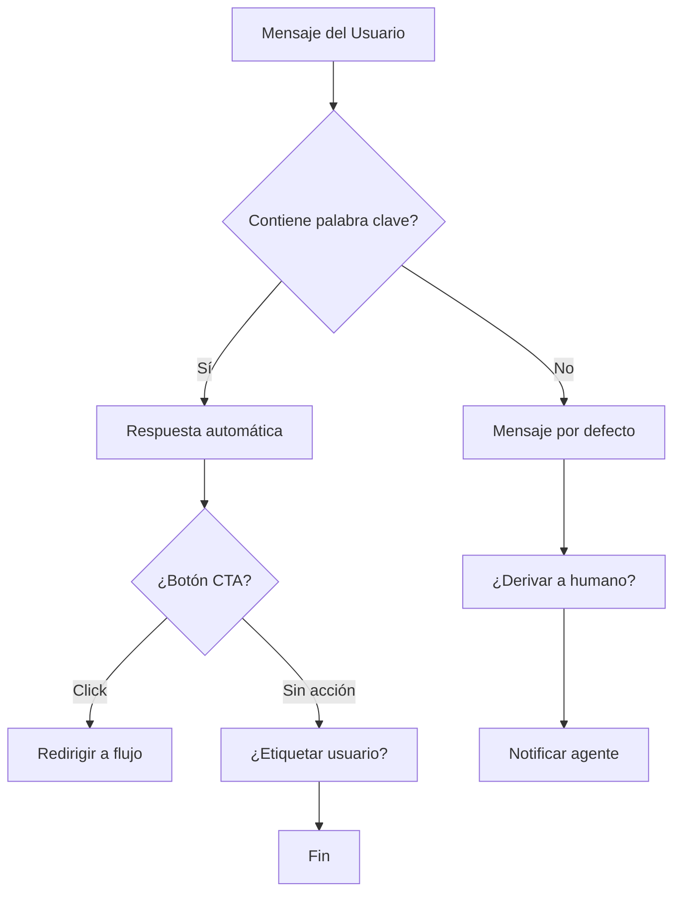

# Marketing en WhatsApp y Telegram: La Guía Completa

> **TL;DR:** E-SMART360 proporciona una plataforma completa para gestionar y automatizar el marketing tanto en WhatsApp como en Telegram. Automatiza campañas, gestiona audiencias y escala tu negocio sin necesidad de configuraciones técnicas complejas.

En la era digital actual, las empresas buscan constantemente nuevas formas de conectar con sus clientes y hacer crecer su audiencia. Una de las herramientas más efectivas para lograrlo son los chatbots: programas impulsados por inteligencia artificial que simulan conversaciones con usuarios reales. Pueden utilizarse para una amplia variedad de propósitos, como brindar atención al cliente, responder preguntas frecuentes e incluso cerrar ventas directamente desde la conversación.

> **Última actualización (29 de marzo de 2026)**
> Contenido revisado y ampliado con nuevas funcionalidades de broadcasting, live chat y gestión de campañas multicanal.

---

## ¿Qué es E-SMART360?

**E-SMART360** es una plataforma integral que ayuda a las empresas a crear y gestionar chatbots para WhatsApp y Telegram. Ofrece un amplio conjunto de funcionalidades diseñadas para cubrir todas las necesidades de comunicación digital:

### **1. Constructor visual de chatbots por arrastrar y soltar**

Crea chatbots potentes sin escribir una sola línea de código. La interfaz visual te permite diseñar flujos de conversación completos conectando bloques con solo arrastrar y soltar. Ideal tanto para principiantes como para expertos en automatización.

### **2. Chat en vivo (Live Chat)**

El chat en vivo es fundamental para supervisar las interacciones entre usuarios y chatbots. Con esta funcionalidad puedes:

- **Monitorear conversaciones:** Observa y supervisa en tiempo real todas las interacciones que ocurren entre los clientes y el bot.
- **Intervención de agentes humanos:** Cuando el chatbot encuentre dificultades o se requiera una respuesta más personalizada, un agente humano puede tomar el control e interactuar directamente con el usuario.
- **Soporte en tiempo real:** Los clientes reciben asistencia inmediata cuando tienen consultas o necesitan ayuda urgente.

### **3. Broadcasting (transmisiones masivas)**

Envía mensajes dirigidos a tus suscriptores de WhatsApp y Telegram cuando necesites comunicar promociones, novedades o cualquier información relevante. Segmenta tu audiencia para maximizar el impacto de cada campaña.

### **4. Automatización inteligente**

Automatiza tareas repetitivas como responder preguntas frecuentes y calificar leads haciendo preguntas y procesando las respuestas automáticamente. Configura flujos de trabajo que funcionen 24/7 sin intervención manual.

### **5. Integraciones con plataformas externas**

Conecta E-SMART360 con otros sistemas como CRM, plataformas de email marketing, Google Sheets, Zapier, sistemas de pago y mucho más. Recopila correos electrónicos a través del chatbot y envíalos directamente a tu proveedor de email marketing.

### **6. Automatización para e-commerce**

Verifica pedidos de Shopify y WooCommerce al instante a través de WhatsApp, eliminando pedidos falsos y aumentando la confianza del cliente. Configura mensajes personalizados y flujos automatizados. Los clientes simplemente presionan un botón para confirmar pedidos contra reembolso, ahorrándote tiempo y dolores de cabeza.

### **7. Gestión de grupos de Telegram**

E-SMART360 optimiza la gestión de grupos de Telegram con funciones como:

- Filtrado de spam en tiempo real
- Controles granulares de mensajes
- Tareas automatizadas de moderación
- Información sobre actividad de usuarios
- Reglas de moderación personalizables
- Atención al cliente receptiva

Esto permite a los administradores crear comunidades bien organizadas y atractivas, convirtiéndolo en una herramienta esencial para cualquiera que gestione grupos activos de Telegram.

Con E-SMART360 obtienes lo mejor de ambos mundos: comunicación sin esfuerzo y automatización potente. Todo desde un solo panel de control unificado.

---

## Atrae Clientes y Haz Crecer tu Negocio

> E-SMART360 ofrece múltiples ventajas para tus esfuerzos de marketing en WhatsApp y Telegram.

- **Alcanza una gran audiencia:** WhatsApp y Telegram suman miles de millones de usuarios activos en todo el mundo.
- **Altas tasas de participación:** Los chatbots generan tasas de interacción significativamente más altas que los canales de marketing tradicionales.
- **Personalización:** Los chatbots pueden adaptar la experiencia de cada cliente según su historial, preferencias y comportamiento.
- **Disponibilidad 24/7:** Brinda atención al cliente incluso cuando no estás disponible. Tu negocio nunca duerme.
- **Costo-efectivo:** Una forma económica de llegar a una audiencia masiva con un presupuesto ajustado.

### 📊 Datos que importan

- El 87% de los usuarios de WhatsApp revisan la app varias veces al día
- Las tasas de apertura en WhatsApp superan el 98%
- Los chatbots pueden manejar hasta el 80% de las consultas rutinarias
- El ROI promedio del marketing conversacional es 3.5x comparado con email marketing

### 🎯 ¿Por qué multicanal?

Gestionar WhatsApp y Telegram desde una plataforma unificada te permite:
- Mantener consistencia en la comunicación
- Centralizar datos de clientes
- Automatizar flujos cruzados entre canales
- Ahorrar tiempo y recursos operativos

---

## Cómo Empezar con E-SMART360

Poner en marcha tu estrategia de marketing conversacional es muy sencillo. Sigue estos pasos para comenzar:

### **1. Regístrate en la plataforma**

Visita el sitio web de E-SMART360 y crea una cuenta gratuita. El registro es rápido y no requiere compromiso. Podrás explorar todas las funcionalidades durante el período de prueba.

### **2. Conecta tus canales**

Vincula tu número de WhatsApp Business API y crea tu bot de Telegram. La plataforma te guiará paso a paso en el proceso de conexión. Para Telegram, asegúrate de crear un bot a través de BotFather y conectar el token correspondiente.

### **3. Diseña tu primer chatbot**

Usa el constructor visual para crear tu flujo de conversación. Comienza con preguntas frecuentes o un asistente de ventas básico. Puedes iterar y mejorar el bot con el tiempo a medida que aprendes qué funciona mejor.

### **4. Configura tu primera campaña de broadcasting**

Prepara tu lista de suscriptores, crea una plantilla de mensaje aprobada por Meta y lanza tu primera campaña. Segmenta tu audiencia para asegurar que el mensaje correcto llegue a las personas correctas.

### **5. Monitorea y optimiza**

Utiliza el panel de análisis para medir el rendimiento de tus campañas. Revisa métricas como tasas de entrega, tasas de apertura y respuestas de los usuarios para refinar tu estrategia continuamente.

> ¿Nuevo en Telegram? Consulta nuestra guía sobre cómo crear un bot de Telegram y conectarlo a E-SMART360. El proceso es simple y está documentado paso a paso en nuestra sección de recursos técnicos.

---

## Broadcasting: Cómo Enviar Mensajes Masivos sin ser Bloqueado

El broadcasting o envío masivo de mensajes es una de las funcionalidades más potentes de E-SMART360. Sin embargo, para evitar sanciones y mantener una alta calidad de entrega, es fundamental seguir las mejores prácticas.

### Prerrequisitos

- La API de WhatsApp Business debe estar conectada a E-SMART360
- Número activo de WhatsApp Business API
- Lista de contactos limpia y actualizada

### Paso 1: Preparar la lista de suscriptores

### **Prepara tu hoja de cálculo**

Asegúrate de tener una lista limpia y lista para importar. Prepara una hoja de cálculo con los datos de contacto necesarios (nombre, número de teléfono, etc.). Verifica que los números de teléfono tengan el formato correcto con código de país incluido.

### **Descarga como CSV**

Exporta tu hoja de cálculo como archivo CSV desde Google Sheets u otra herramienta. Asegúrate de usar codificación UTF-8 para evitar problemas con caracteres especiales. Alternativamente, puedes importar directamente desde Google Sheets.

### **Importa los suscriptores**

Ve al **Gestor de Suscriptores** en tu panel de control de E-SMART360. Haz clic en "Opciones" y selecciona "Importar Suscriptores". Sube el archivo CSV o conecta tu Google Sheet. Cuando hayas importado el archivo, mapea los datos para alinear las columnas correctamente.

### Paso 2: Tipos de plantillas de mensaje

Existen dos categorías principales de plantillas de mensaje para broadcasting:

### 📋 Transaccionales (Utilidad)

Se utilizan para enviar mensajes relacionados con transacciones específicas, como:
- Confirmación de envío
- Recibo de pago
- Códigos de verificación (OTP)
- Actualización de estado de pedido
- Notificaciones de entrega

Estas plantillas tienen tasas de aprobación más altas.

### 📢 Marketing

Se utilizan para promocionar productos o servicios:
- Ofertas y descuentos
- Lanzamiento de nuevos productos
- Invitaciones a eventos
- Contenido promocional
- Campañas estacionales

Requieren cumplir estrictamente con las políticas de Meta.

### Paso 3: Crear una plantilla de mensaje

### **Accede al gestor de plantillas**

Ve a **Gestor de Bots > Plantillas de Mensaje** en tu panel de control.

### **Crea una nueva plantilla**

Haz clic en "Crear Nueva Plantilla" y selecciona el tipo de plantilla que deseas crear (marketing, utilidad, OTP, etc.).

### **Completa los detalles**

Define el **contenido del mensaje** incluyendo campos personalizados con variables como `{{1}}` para nombres, montos, fechas, etc. Añade botones de llamada a la acción (CTA) si es necesario. El **nombre de la plantilla** debe usar minúsculas y guiones bajos en lugar de espacios.

### **Guarda y envía a aprobación**

Una vez completa, guarda la plantilla y envíala a Meta para su aprobación. La aprobación puede tomar desde unos minutos hasta varias horas dependiendo de la carga del sistema y el tipo de plantilla.

### Paso 4: Configurar una campaña de broadcasting

### **Navega a Broadcasting**

Ve a la sección **Broadcasting** en tu panel de E-SMART360 y haz clic en **Crear Nueva Campaña**.

### **Nombra tu campaña**

Asigna un nombre descriptivo a tu campaña (por ejemplo, "Campaña Marketing Verano 2026").

### **Selecciona tu audiencia objetivo**

Elige entre dos opciones:

- **Ventana de 24 horas:** Envía mensajes gratuitos a usuarios que interactuaron contigo en las últimas 24 horas.
- ** Mensajería en cualquier momento:** Usa una plantilla aprobada para llegar a todos tus suscriptores.

Filtra tu audiencia usando etiquetas personalizadas. Puedes incluir o excluir etiquetas específicas (como "Nuevo Lead", "Interesado en Demo", "Prueba Gratuita"). También puedes usar el filtro "Suscriptores Agregados Recientemente" para segmentar por rango de fechas.

### **Programa o envía la campaña**

Elige entre enviar la campaña inmediatamente o programarla para una fecha y hora posterior. Ajusta la zona horaria para una entrega óptima según la ubicación de tu audiencia.

### **Ejecuta la campaña**

Nombra tu flujo de bot, guarda la configuración y ejecuta la campaña. Una vez enviada, el estado se actualizará en el panel para que puedas monitorear su progreso en tiempo real.

> **Importante:** Para mantener una buena reputación con WhatsApp, evita enviar mensajes masivos a usuarios que no han dado su consentimiento explícito. Respeta los límites de broadcasting según tu nivel de calidad y siempre incluye una opción para que los usuarios puedan darse de baja.

### Límites de Broadcasting según el Nivel de Mensajería

WhatsApp asigna a cada negocio un nivel de mensajería (tier) basado en el uso y la calidad de sus comunicaciones. Estos niveles determinan cuántos usuarios únicos puedes contactar por día:

### 📊 Niveles de Mensajería WhatsApp

- **Trial:** Hasta 250 usuarios únicos/día
- **Tier 1:** Hasta 1,000 usuarios únicos/día
- **Tier 2:** Hasta 10,000 usuarios únicos/día
- **Tier 3:** Hasta 100,000 usuarios únicos/día
- **Tier 4:** Usuarios ilimitados/día

### 📈 Requisitos de Progresión

Para subir de nivel necesitas:
- Mantener una calificación de calidad ALTA o MEDIA
- Enviar mensajes al menos al 50% del límite de tu nivel actual
- Tener engagement consistente de usuarios
- Completar los requisitos dentro de 30 días

**Ejemplo de progresión:** Para pasar de Tier 1 a Tier 2, debes enviar mensajes a al menos 500 usuarios únicos. WhatsApp actualiza los niveles automáticamente según el rendimiento de tu cuenta.

> **Consejo profesional:** Céntrate en la calidad del mensaje, evita contenido similar a spam, monitorea las interacciones de los usuarios y mantén una comunicación consistente. Una buena reputación como remitente acelera la progresión a niveles superiores.

---

## Live Chat: Gestión Avanzada de Conversaciones

El módulo de Live Chat de E-SMART360 es una herramienta poderosa para gestionar conversaciones con clientes en WhatsApp. Está dividido en tres secciones principales:

### Lista de Suscriptores

Aquí verás todos tus suscriptores de WhatsApp. Funcionalidades clave:

- **Búsqueda:** Encuentra rápidamente un suscriptor escribiendo su nombre en la barra de búsqueda.
- **Filtros Avanzados:** Filtra por etiquetas, secuencias de mensajes, respuesta reciente del suscriptor o comunicación reciente.
- **Gestión de Chats:** Organiza los chats en las categorías: "Míos" (asignados a un agente), "Todos", "No Leídos", "Archivados", "Bloqueados" y "Resueltos".

### Ventana de Chat

Donde chateas con los clientes:

- **Marcar chats:** Marca como no leído o archiva conversaciones.
- **Recordatorio de seguimiento:** Programa un recordatorio para responder cuando no puedas hacerlo de inmediato.
- **Traducción de mensajes:** Traduce mensajes a tu idioma preferido con un clic.
- **Mensajes de firma:** Antes de unirte a un chat, activa la opción "Enviar Mensaje de Firma" para que el cliente sepa qué agente lo está ayudando.
- **Reescribir con IA:** Corrige la gramática o mejora el texto de tus mensajes con IA.
- **Plantillas y flujos:** Envía plantillas de mensaje preescritas o flujos de bot directamente desde el chat.
- **Respuestas predefinidas:** Usa respuestas rápidas para preguntas frecuentes.
- **Archivos adjuntos:** Comparte imágenes, documentos y otros archivos por arrastrar y soltar.
- **Reproducción multimedia:** Reproduce audio y video directamente en la ventana de chat.

### Acciones del Chat

Gestiona y colabora en las conversaciones:

- **Acciones:** Suscribe o cancela suscripción de clientes, pausa/reanuda respuestas del bot, reinicia flujos de entrada de usuario, limpia el historial del chat o abandona la conversación.
- **Asignar agente:** Asigna un agente específico a un cliente. El agente recibirá una notificación al momento.
- **Etiquetas:** Categoriza clientes con etiquetas personalizadas.
- **Campos personalizados:** Recopila datos relevantes del cliente para ofrecer asistencia más personalizada.
- **Notas internas:** Añade notas visibles solo para tu equipo.
- **Ventana de 24 horas:** Verifica cuánto tiempo queda en la ventana de mensaje gratuito.

---

## Gestión de Suscriptores y Segmentación

Una base de suscriptores bien organizada es la clave del éxito en cualquier campaña de marketing conversacional. E-SMART360 ofrece múltiples herramientas para gestionar y segmentar tu audiencia.

### **Importación de suscriptores**

Puedes importar tus contactos de varias formas:
- **Manual:** Añade suscriptores uno por uno desde el panel
- **CSV:** Sube un archivo CSV con tu lista de contactos
- **Google Sheets:** Conecta tu hoja de cálculo directamente

### **Campos personalizados**

Define campos adicionales para almacenar información relevante de cada suscriptor: ubicación, preferencias de producto, fecha de registro, valor del pedido promedio, etc. Estos campos pueden usarse para personalizar mensajes y segmentar audiencias.

### **Etiquetas y segmentación**

Crea etiquetas para categorizar a tus suscriptores por:
- Interés (Producto A, Producto B)
- Etapa del embudo (Lead, Oportunidad, Cliente)
- Fuente de adquisición (Web, Instagram, Anuncio)
- Comportamiento (Carrito abandonado, Compra recurrente)

---

## Integraciones Clave

E-SMART360 se conecta con las herramientas que ya utilizas para potenciar tu flujo de trabajo:

### 🛒 WooCommerce

Sincroniza pedidos, notifica a clientes sobre cambios de estado y automatiza la recuperación de carritos abandonados directamente desde WhatsApp.

### 🛍️ Shopify

Recibe notificaciones de nuevos pedidos, confirma pagos y envía actualizaciones de envío automáticamente a través del chatbot.

### 📊 Google Sheets

Importa contactos desde tus hojas de cálculo y usa datos de Google Sheets para personalizar las respuestas del chatbot.

### ⚡ Zapier

Conecta E-SMART360 con más de 5000 aplicaciones para automatizar flujos de trabajo complejos sin necesidad de programación.

### 🤖 IA (OpenAI)

Integra respuestas impulsadas por IA para interacciones más naturales y humanas. Entrena tu asistente con FAQ, URLs y archivos.

### 🔗 Webhooks & API

Usa webhooks para enviar datos del chatbot a aplicaciones de terceros y accede a las APIs nativas para integraciones personalizadas.

### Más Integraciones Disponibles

### 📝 WPForms

Conecta tus formularios de WordPress para que los datos capturados activen mensajes automáticos en WhatsApp, creando un flujo continuo entre tu web y la mensajería.

### 🔌 Pabbly Connect

Como alternativa a Zapier, Pabbly Connect te permite automatizar flujos entre E-SMART360 y cientos de aplicaciones populares para sincronización de datos.

### 🔄 N8N

Para usuarios técnicos, N8N ofrece una potente plataforma de automatización de código abierto que permite construir flujos de trabajo personalizados entre E-SMART360 y casi cualquier servicio con API.

### 💳 Pasarelas de Pago

Integra más de 20 métodos de pago incluyendo PayPal, Stripe, Razor Pay y WhatsApp Pay para procesar transacciones directamente desde el chat.

---

## Construcción de Chatbots con Palabras Clave

Una de las formas más efectivas de automatizar respuestas es mediante el uso de chatbots basados en palabras clave. Cuando un usuario envía un mensaje con términos específicos, el bot puede responder de manera inteligente.

### **1. Identifica palabras clave relevantes**

Determina qué palabras o frases usarán tus clientes para cada tipo de consulta: "precio", "horario", "catálogo", "ayuda", "cotización", etc.

### **2. Configura respuestas automáticas**

En el panel de E-SMART360, ve al Gestor de Bots y crea reglas de respuesta que asocien palabras clave con mensajes específicos. Puedes incluir texto, imágenes, botones interactivos y enlaces.

### **3. Define respuestas por defecto**

Configura un mensaje de "no coincidencia" para cuando el usuario envíe un mensaje que no coincida con ninguna palabra clave, y establece la frecuencia máxima de respuestas automáticas para evitar enviar mensajes repetitivos.

### **4. Añade campos de entrada de usuario**

Para consultas más complejas, usa bloques de entrada que soliciten información adicional al usuario (nombre, email, teléfono, producto de interés). Estos datos se almacenan en campos personalizados y se pueden usar para segmentación y seguimiento.

### Ejemplo: Chatbot de Recepción

---

## Automatización de Respuestas con IA

E-SMART360 integra inteligencia artificial para llevar tus conversaciones automatizadas al siguiente nivel. Puedes entrenar tu asistente de IA de las siguientes formas:

1. **FAQ:** Proporciona un documento con preguntas frecuentes y el asistente aprenderá a responderlas.
2. **URLs:** Dale acceso a páginas web de tu negocio para que extraiga información relevante.
3. **Archivos:** Sube documentos PDF, Word o CSV con información de productos, políticas o procedimientos.
4. **APIs HTTP:** Conecta el asistente a tus APIs internas para obtener datos en tiempo real.
5. **Google Sheets:** Enlaza hojas de cálculo para que el asistente pueda consultar catálogos y precios dinámicamente.

> El asistente de IA se puede activar en cualquier flujo de bot. Cuando un usuario hace una pregunta que el flujo predefinido no puede responder, la IA toma el control y genera una respuesta contextual basada en el entrenamiento recibido. Si la IA tampoco puede resolver la consulta, la conversación se escala a un agente humano.

---

---

## Preguntas Frecuentes

### ¿Puedo gestionar marketing en WhatsApp y Telegram desde un solo lugar?

Sí. E-SMART360 proporciona un panel de control unificado desde el cual puedes crear bots, enviar transmisiones masivas y gestionar suscriptores tanto de WhatsApp como de Telegram simultáneamente. No necesitas alternar entre diferentes plataformas.

### ¿Cuáles son los beneficios de usar un bot de Telegram para marketing?

Los bots de Telegram permiten la transmisión ilimitada a suscriptores, atención al cliente automatizada y la capacidad de gestionar comunidades grandes sin las limitaciones estrictas del marketing por SMS tradicional. Además, Telegram ofrece grupos de hasta 200,000 miembros y canales de difusión ilimitados.

### ¿E-SMART360 es una plataforma sin código?

Absolutamente. E-SMART360 está diseñado para profesionales de marketing y dueños de negocio que desean crear potentes flujos de automatización para WhatsApp y Telegram usando una interfaz visual de arrastrar y soltar. No se requieren conocimientos de programación.

### ¿Cómo ayuda E-SMART360 a mejorar la participación de la audiencia?

Con funciones como automatización de campañas, personalización de mensajes usando variables, bandeja compartida para equipos, análisis detallados y segmentación avanzada, E-SMART360 ayuda a los equipos a enviar mensajes dirigidos que aumentan las tasas de respuesta y conversión.

### ¿Qué pasa si mi plantilla de mensaje es rechazada por Meta?

Si tu plantilla es rechazada, revisa el motivo del rechazo, ajusta el contenido para cumplir con las políticas de Meta (evita promesas excesivas, incluye mecanismos de exclusión voluntaria, y asegúrate de que el propósito esté claro) y vuelve a enviarla. E-SMART360 te proporciona las pautas completas para maximizar la probabilidad de aprobación.

### ¿Puedo enviar mensajes sin usar una plantilla aprobada?

Sí, pero solo dentro de la ventana de 24 horas desde la última interacción del usuario. Durante ese período, puedes enviar mensajes libres sin plantilla. Fuera de esa ventana, necesitas usar una plantilla aprobada por Meta para iniciar la conversación.

### ¿Cómo funciona la regla de las 24 horas en WhatsApp?

La regla de 24 horas de WhatsApp establece que las empresas pueden enviar mensajes gratuitos a un usuario dentro de las 24 horas posteriores a su último mensaje. Una vez que la ventana se cierra, solo puedes enviar mensajes usando una plantilla aprobada, lo cual tiene un costo asociado por conversación.

### ¿Qué tipos de archivos multimedia puedo compartir en los mensajes?

WhatsApp Business API soporta imágenes (JPG, PNG), videos (MP4, 3GPP), documentos (PDF, DOC, XLS, PPT), audio (MP3, OGG, AAC, AMR) y stickers. Cada tipo tiene límites de tamaño específicos (generalmente hasta 16MB para la mayoría de formatos, 100MB para videos en algunos casos).

---

## Casos de Uso Prácticos

### 🛒 E-commerce: Recuperación de Carritos Abandonados

**Problema:** Un cliente agregó productos al carrito pero no completó la compra.

**Solución con E-SMART360:**
1. Detecta el abandono mediante integración con WooCommerce/Shopify
2. Envía un mensaje automático por WhatsApp recordando los productos
3. Incluye un botón de CTA para completar la compra
4. Si no hay respuesta en 24h, envía un segundo mensaje con un código de descuento
5. Un agente humano recibe una notificación si el cliente responde con preguntas

**Resultado:** Incremento del 25-40% en recuperación de carritos abandonados.

### 🏨 Hotelería: Confirmación de Reservas

**Probleema:** Los huéspedes llaman para confirmar reservas, lo que satura la recepción.

**Solución con E-SMART360:**
1. Al recibir una reserva online, el chatbot envía un mensaje de confirmación
2. Incluye datos clave: fechas, tipo de habitación, monto
3. Ofrece botones para modificar o cancelar la reserva
4. Envía un recordatorio 24h antes del check-in con instrucciones
5. Después del check-out, envía una encuesta de satisfacción

**Resultado:** Reducción del 60% en llamadas entrantes a recepción.

### 🏦 Servicios Financieros: Atención al Cliente 24/7

**Problema:** Los clientes necesitan información de sus cuentas fuera del horario laboral.

**Solución con E-SMART360:**
1. El chatbot responde preguntas frecuentes sobre saldos, movimientos y sucursales
2. Para consultas sensibles, transfiere al cliente a un agente humano con el contexto completo
3. Envía notificaciones automáticas de pagos y vencimientos
4. Programa recordatorios personalizados para fechas de pago
5. Escala a un agente especializado cuando se detectan palabras clave como "reclamo" o "queja"

**Resultado:** Atención al cliente 24/7 con resolución del 70% de consultas sin intervención humana.

### 🎓 Educación: Automatización de Inscripciones

**Problema:** Los procesos de inscripción requieren múltiples intercambios de información.

**Solución con E-SMART360:**
1. El chatbot califica prospectos preguntando sobre intereses y nivel educativo
2. Envía información personalizada sobre programas y costos
3. Programa visitas al campus o sesiones informativas
4. Envía recordatorios de fechas límite de inscripción
5. Después de la inscripción, da la bienvenida al nuevo estudiante con pasos a seguir

**Resultado:** Incremento del 35% en tasas de conversión de prospecto a inscrito.

---

## Preguntas Frecuentes Adicionales

### ¿Puedo usar E-SMART360 para enviar mensajes a clientes en diferentes zonas horarias?

Sí. E-SMART360 te permite programar campañas de broadcasting con control de zona horaria. Puedes ajustar la hora de envío según la ubicación de tu audiencia para maximizar las tasas de apertura. También puedes crear segmentos de suscriptores por región y programar diferentes horarios para cada segmento.

### ¿Qué sucede si supero el límite de mensajes de mi nivel actual de WhatsApp?

Si intentas enviar mensajes más allá del límite de tu nivel actual, verás un mensaje de error que indica "El tamaño de la audiencia excede la cuota restante". Algunos mensajes pueden fallar al intentar entregarse. Deberás reducir el tamaño de tu audiencia para mantenerte dentro del límite o esperar a que WhatsApp actualice automáticamente tu nivel al cumplir los requisitos de progresión.

### ¿Cuánto tiempo toma obtener la aprobación de una plantilla de mensaje?

El tiempo de aprobación de plantillas por parte de Meta puede variar desde unos pocos minutos hasta varias horas, dependiendo de la carga del sistema y la complejidad de la plantilla. Las plantillas de tipo transaccional (utilidad y OTP) suelen aprobarse más rápido que las de marketing. Si tu plantilla es rechazada, E-SMART360 te proporciona las pautas para corregirla y reenviarla.

### ¿E-SMART360 cobra comisión sobre las tarifas de API de WhatsApp?

No. E-SMART360 no aplica markup (comisión adicional) sobre las tarifas de la API de WhatsApp Business. Pagas únicamente los costos reales que cobra Meta por cada conversación, sin márgenes ocultos. Esto te permite escalar tus campañas de manera predecible y rentable.

### ¿Puedo integrar el chatbot de E-SMART360 en mi sitio web WordPress?

Sí. E-SMART360 ofrece integración con WordPress mediante plugins como WPForms y Elementor. Puedes conectar formularios de tu sitio web para que los datos capturados activen mensajes automáticos en WhatsApp. Además, el webchat de E-SMART360 se puede incrustar directamente en tu sitio web para ofrecer una experiencia omnicanal.

### ¿Cómo gestiono el spam y los mensajes no deseados?

E-SMART360 incluye herramientas para bloquear mensajes de spam directamente desde el panel de Live Chat. Los chats bloqueados se archivan en una sección separada. Además, para Telegram, el sistema ofrece filtrado de spam en tiempo real y controles granulares de moderación. También puedes aplicar límites de frecuencia y políticas de exclusión voluntaria para mantener una comunicación saludable.

---

## Conclusión

E-SMART360 es una plataforma potente que puede ayudar a empresas de todos los tamaños a mejorar sus esfuerzos de marketing conversacional. Estos son los beneficios clave:

<Card title="✅ Fácil de usar" icon="👍">
Diseñada para quienes no tienen experiencia en programación. Crea chatbots complejos con una interfaz visual intuitiva.

<Card title="💰 Asequible" icon="💵">
Variedad de planes de precios que se ajustan a tu presupuesto. Sin costos ocultos ni markup en tarifas de API de WhatsApp.

<Card title="📈 Escalable" icon="🚀">
Crece junto con tu negocio. Desde pequeñas empresas hasta grandes corporaciones con altos volúmenes de mensajes.

> E-SMART360 es una plataforma en constante evolución que ya cuenta con una base de usuarios leales. Reconocida por su facilidad de uso y potentes funcionalidades, definitivamente vale la pena probarla si quieres adelantarte a la competencia y llevar tu negocio al siguiente nivel con marketing conversacional multicanal.
