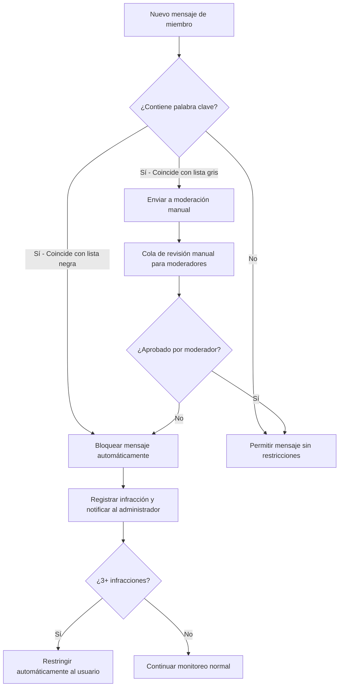

> La automatización de restricciones para nuevos miembros hace que la incorporación a grupos de Telegram sea más fluida, al mismo tiempo que protege a las comunidades del spam y los bots maliciosos. Con E-SMART360 puedes configurar estas restricciones en pocos pasos.

**TL;DR:**

- Automatizar las restricciones de miembros facilita la incorporación a grupos de Telegram y protege a las comunidades del spam.
- Esta guía explica cómo configurar restricciones para nuevos miembros, equilibrando la seguridad con una primera impresión profesional.
- Un proceso de bienvenida estructurado mejora la participación y respalda un entorno comunitario bien gestionado.
- E-SMART360 también ofrece herramientas de bloqueo de spam en WhatsApp para proteger todos tus canales de comunicación.

Última actualización: 30 de marzo de 2026

---

## Introducción

Dar la bienvenida a nuevos miembros a tu comunidad de Telegram es una oportunidad emocionante para expandir el alcance y la participación de tu grupo. Sin embargo, gestionar la afluencia de nuevos integrantes mientras se mantienen las reglas del grupo puede ser un desafío significativo. Los administradores de grupos se enfrentan diariamente a problemas como bots automatizados, spammers, enlaces maliciosos y usuarios que publican contenido inapropiado.

Aquí es donde entra en juego la función de **Restricción de Nuevos Miembros** de **E-SMART360**. En esta guía completa, exploraremos cómo esta función garantiza un proceso de incorporación fluido y sin contratiempos, permitiendo a los administradores de grupos crear una experiencia acogedora y profesional para los recién llegados, mientras mantienen el control sobre la calidad del contenido que se comparte.


> **¿Sabías que...?** Los ataques de bots y spam en grupos de Telegram pueden ocurrir en cuestión de segundos después de publicar el enlace de invitación. Una buena estrategia de restricción de miembros puede prevenir hasta el 95 % del contenido no deseado antes de que aparezca en el chat.

---

## La Importancia de un Proceso de Incorporación Fluido

Una experiencia de incorporación acogedora establece el tono para el recorrido de un nuevo miembro dentro de tu comunidad de Telegram. Cuando los nuevos integrantes se sienten recibidos y guiados, es mucho más probable que se conviertan en miembros activos y valiosos.

### Beneficios de una Buena Incorporación


### 👥 Participación Activa

**Mayor engagement:**
- Los miembros participan más en discusiones
- Comparten contenido relevante con mayor frecuencia
- Se sienten parte de la comunidad desde el día uno
- Responden a encuestas y preguntas
- Recomiendan el grupo a otros usuarios

### 📊 Retención de Miembros

**Menor abandono:**
- Los miembros permanecen más tiempo en el grupo
- La tasa de abandono se reduce hasta un 40 %
- Se crean vínculos más fuertes entre participantes
- Aumenta el sentido de pertenencia
- Se reduce la rotación constante de usuarios

Un proceso de incorporación fluido también garantiza que los nuevos miembros conozcan las reglas y pautas del grupo desde el primer momento, minimizando las posibilidades de spam o comportamientos disruptivos. Cuando un nuevo miembro recibe un mensaje de bienvenida claro y estructurado, entiende inmediatamente qué tipo de comportamiento se espera de él y qué consecuencias tiene infringir las normas.


> Sin un sistema de restricción adecuado, los grupos de Telegram pueden convertirse rápidamente en un blanco fácil para spammers, bots automatizados y usuarios malintencionados que buscan promocionar productos no deseados o compartir enlaces de phishing y malware.

---

## Presentando la Restricción de Nuevos Miembros de E-SMART360

La función de **Restricción de Nuevos Miembros** de E-SMART360 ofrece una solución integral para que los administradores de grupos gestionen las actividades de los nuevos integrantes durante su período inicial en la comunidad. Esta herramienta está diseñada para ser flexible, potente y fácil de configurar, incluso para administradores sin experiencia técnica.

### Características Principales

E-SMART360 proporciona un conjunto completo de herramientas para gestionar la incorporación de nuevos miembros:

1. **Duración configurable** de la restricción (minutos, horas, días o semanas)
2. **Permisos granulares** para controlar acciones específicas
3. **Mensajes de bienvenida** completamente personalizables
4. **Activación automática** para cada nuevo miembro
5. **Excepciones** para miembros verificados o invitados por administradores
6. **Notificaciones** a los administradores cuando un miembro completa el período de restricción

### 1. Configuración de la Duración de la Restricción

Los administradores del grupo pueden definir la duración durante la cual los nuevos miembros estarán bajo restricción. Este período puede variar desde unos minutos hasta un número específico de horas, días o incluso más tiempo. La flexibilidad para elegir la duración de la restricción garantiza que los nuevos miembros tengan tiempo suficiente para familiarizarse con la dinámica y las pautas del grupo.


### Accede a la configuración del bot de Telegram

Inicia sesión en tu panel de E-SMART360 y navega a la sección de configuración de Telegram. Selecciona el grupo donde deseas aplicar las restricciones. Asegúrate de que el bot de E-SMART360 sea administrador del grupo con los permisos necesarios para gestionar miembros.

### Define el período de restricción

En el panel de Restricción de Miembros, elige la duración deseada. Puedes optar por minutos, horas o días según las necesidades de tu comunidad. Por ejemplo, un período de 24 horas es ideal para grupos grandes con alto flujo de nuevos miembros, mientras que 48-72 horas funciona mejor para comunidades más exclusivas.

### Selecciona las acciones restringidas

Marca las acciones que deseas restringir durante el período: enviar mensajes, compartir enlaces, enviar medios, utilizar stickers o GIFs, crear encuestas, mencionar a otros usuarios, y más. Cada opción se activa o desactiva con un simple interruptor.

### Guarda los cambios

Una vez definido el período y las restricciones, guarda la configuración. El bot de E-SMART360 aplicará automáticamente las restricciones a todos los nuevos miembros que se unan al grupo desde ese momento en adelante.


> **Recomendación**: Para la mayoría de los grupos, un período de 24 a 48 horas con restricción de enlaces y medios es el equilibrio perfecto entre seguridad y experiencia de usuario.

### 2. Introducción Gradual a las Actividades del Grupo

Durante el período de restricción, los nuevos miembros pueden ser introducidos gradualmente a las actividades del grupo. Este enfoque por fases permite una adaptación natural y previene comportamientos no deseados.

**Niveles de acceso configurables:**

| Nivel de Acceso | Descripción | Duración Recomendada |
|-----------------|-------------|---------------------|
| Solo lectura | Acceso únicamente para leer mensajes y ver contenido | 0-24 horas |
| Lectura + texto | Pueden enviar mensajes de texto pero no medios ni enlaces | 24-48 horas |
| Participación básica | Permite texto, stickers y GIFs (sin enlaces) | 48-72 horas |
| Participación completa | Todos los permisos excepto mencionar en masa | 72+ horas |
| Miembro de confianza | Acceso completo a todas las funciones | Tras aprobación |

Este enfoque gradual ayuda a prevenir el spam y anima a los nuevos miembros a observar las interacciones del grupo antes de participar activamente. También permite a los administradores identificar posibles spammers antes de que causen problemas, ya que los bots suelen mostrar comportamientos sospechosos incluso en modo de solo lectura, como abandonar el grupo rápidamente al no poder publicar.


> **Dato clave**: Los spammers automatizados suelen abandonar un grupo en los primeros 10-15 minutos si no pueden publicar inmediatamente. La restricción inicial actúa como un filtro natural que elimina a la mayoría de los bots sin intervención manual.

### 3. Reducción de Disrupciones

Al implementar un período de restricción, los administradores del grupo pueden reducir significativamente las posibilidades de comportamientos disruptivos por parte de nuevos miembros. Restringir ciertas acciones durante la fase de incorporación evita el spam potencial o el mal uso de las funciones del grupo, salvaguardando el entorno general de la comunidad.


### Tipos de disrupciones que puedes prevenir con E-SMART360

**Spam masivo de enlaces promocionales:**
Los spammers suelen unirse a grupos y publicar decenas de enlaces en cuestión de segundos. Con la restricción de enlaces, este comportamiento queda bloqueado automáticamente.

**Publicación repetitiva de mensajes idénticos:**
Los bots programados para promocionar productos suelen repetir el mismo mensaje una y otra vez. La restricción de mensajes durante las primeras horas detiene este patrón.

**Suplantación de identidad de administradores:**
Usuarios malintencionados que se cambian el nombre y la foto para hacerse pasar por administradores. Un período de solo lectura impide que puedan enviar mensajes suplantando a otros.

**Compartir contenido NSFW o inapropiado:**
La restricción de medios y archivos evita que nuevos miembros compartan imágenes, videos o documentos no deseados durante el período de adaptación.

**Ataques de bots coordinados:**
Grupos organizados de bots que entran simultáneamente para inundar el chat. Las restricciones automáticas bloquean su capacidad de causar daño.

**Reenvío automático desde otros canales:**
Bots configurados para reenviar automáticamente contenido desde otros grupos o canales. La restricción de reenvío corta esta práctica.

**Publicación de enlaces de phishing o malware:**
Enlaces maliciosos disfrazados de ofertas, regalos o información útil. Al restringir los enlaces para nuevos miembros, eliminas este vector de ataque.

### 4. Mensaje de Bienvenida Personalizable

E-SMART360 permite a los administradores configurar un mensaje de bienvenida personalizado para los nuevos miembros, que se envía automáticamente cuando alguien se une al grupo. Este saludo cálido puede incluir información esencial sobre el grupo, reglas y pautas de la comunidad, enlaces a recursos útiles, instrucciones para completar la verificación y una presentación de los administradores.

El mensaje de bienvenida personalizado hace que los nuevos integrantes se sientan valorados e informados desde el momento en que ingresan a la comunidad, estableciendo expectativas claras desde el principio.


### Ejemplo completo de mensaje de bienvenida personalizado

```
🎉 ¡Bienvenido a [Nombre del Grupo]!

Nos alegra mucho que te hayas unido a nuestra comunidad de [tema del grupo].
Aquí encontrarás [descripción breve del propósito del grupo].

📋 **REGLAS DEL GRUPO:**
1. Sé respetuoso con todos los miembros
2. No compartas contenido spam o promocional
3. Mantén las conversaciones dentro del tema del grupo
4. No compartas información personal de otros miembros
5. Reporta cualquier comportamiento sospechoso a los admins

🔹 **PERÍODO DE ADAPTACIÓN:**
Durante las primeras 24 horas tu participación estará moderada.
Esto nos ayuda a mantener un ambiente seguro para todos.
Durante este tiempo podrás:
✅ Leer todos los mensajes
✅ Ver el contenido compartido
❌ Publicar mensajes (temporalmente)
❌ Compartir enlaces o medios

📚 **RECURSOS ÚTILES:**
• Reglas detalladas: [enlace]
• Preguntas frecuentes: [enlace]
• Canal de anuncios: [enlace]
• Contacto con admins: [enlace]

💡 **¿CÓMO EMPEZAR?**
1. Preséntate en el chat de presentaciones
2. Lee los mensajes fijados del grupo
3. Participa en las encuestas de bienvenida
4. ¡Disfruta de la comunidad!

¡Gracias por ser parte de nuestra comunidad! 🌟
```

> **Consejo profesional**: Incluye un enlace a un documento con las reglas detalladas del grupo en tu mensaje de bienvenida. Esto no solo informa a los nuevos miembros, sino que también sirve como referencia si necesitas recordar las normas a alguien en el futuro.

### 5. Mejora de la Cohesión del Grupo

Con la función de Restricción de Nuevos Miembros de E-SMART360, la comunidad del grupo puede continuar sus discusiones y actividades sin interrupciones causadas por spam o contenido no relacionado. Esto fomenta un entorno cohesivo, permitiendo interacciones significativas entre los miembros existentes mientras los nuevos integrantes se adaptan a las normas del grupo.


### ✅ Comunidad Protegida

- Sin spam durante las horas críticas de discusión
- Debates enfocados y productivos sin interrupciones
- Miembros existentes sin distracciones constantes
- Moderación automatizada que no requiere supervisión 24/7
- Ambiente seguro para todos los participantes
- Reducción de la carga de trabajo de los moderadores
- Mayor calidad en las conversaciones del grupo

### 📈 Crecimiento Sostenible

- Nuevos miembros integrados gradualmente sin fricciones
- Menor rotación de usuarios gracias a una buena primera impresión
- Mayor retención a largo plazo (hasta un 60 % más)
- Comunidad autogestionada con el tiempo
- Reputación positiva que atrae a más miembros de calidad
- Escalabilidad: el grupo puede crecer sin perder calidad
- Menos quejas y reportes por contenido inapropiado

---

## Bloqueo de Mensajes de Spam en WhatsApp con E-SMART360

Además de las restricciones para nuevos miembros en Telegram, E-SMART360 también ofrece potentes herramientas para bloquear mensajes de spam en WhatsApp. Toma el control de tu comunicación bloqueando mensajes no deseados y manteniendo tu bandeja de entrada limpia y enfocada en conversaciones significativas.

### Por qué Bloquear Usuarios en WhatsApp

El bloqueo de usuarios es una herramienta esencial para mantener la calidad de tus comunicaciones empresariales. Los motivos más comunes para bloquear a un contacto incluyen:

- **Spam persistente**: Mensajes repetitivos con publicidad no solicitada
- **Promociones no deseadas**: Ofertas de productos o servicios que no solicitaste
- **Contenido inapropiado**: Material ofensivo o inadecuado para tu negocio
- **Mensajes masivos automatizados**: Bots que envían cientos de mensajes idénticos
- **Acoso o comportamiento abusivo**: Usuarios que cruzan los límites del respeto
- **Suplantación de identidad**: Cuentas falsas que se hacen pasar por tu empresa

### Capacidades de Bloqueo

E-SMART360 te proporciona control total sobre quién puede comunicarse contigo:

- **Bloquear mensajes entrantes** de usuarios específicos de forma selectiva
- **Seguir enviando transmisiones** a usuarios bloqueados (comunicación unidireccional)
- **Mantener el control** sobre tu bandeja de entrada sin perder contactos
- **Desbloquear usuarios** en cualquier momento si la situación cambia
- **Ver historial** de usuarios bloqueados para auditoría

### Proceso de Bloqueo en E-SMART360


### Identifica el contacto de spam

Revisa el historial de mensajes del contacto en tu panel de Chat en Vivo. Reconoce patrones repetitivos o mensajes irrelevantes que indiquen comportamiento de spam. Selecciona el contacto específico que deseas bloquear.

### Bloquea los mensajes entrantes

Ve a la sección de Chat en Vivo de E-SMART360. Dentro de la conversación con el usuario, localiza el botón 'Bloquear Usuario' en el perfil del contacto. Haz clic en él para iniciar el proceso de bloqueo.

### Confirma el bloqueo

Aparecerá una pantalla de confirmación preguntándote si estás seguro de querer bloquear al usuario. Revisa los detalles y confirma la acción. El bloqueo se aplica de forma inmediata.

### Verifica el bloqueo

El usuario bloqueado aparecerá en tu lista de contactos bloqueados, accesible desde el menú de configuración. Podrás revisar esta lista en cualquier momento, ver la fecha de bloqueo y realizar cambios si es necesario.

### ¿Qué Sucede Después del Bloqueo?

**Dinámicas de Comunicación posteriores al bloqueo:**

| Aspecto | Comportamiento |
|---------|---------------|
| Mensajes del usuario bloqueado | No se reciben. Desaparecen sin notificación. |
| Transmisiones salientes | Sí, los bloqueados siguen recibiéndolas. |
| Notificación al bloqueado | No se envía ninguna. El bloqueo es invisible. |
| Reversión del bloqueo | Posible en cualquier momento desde configuración. |
| Historial de conversación | Se mantiene intacto para consulta posterior. |


### Preguntas frecuentes sobre el bloqueo en WhatsApp

**P: ¿Los usuarios bloqueados pueden ver mis transmisiones?**
R: Sí, pueden recibir transmisiones. El bloqueo solo impide que ellos te envíen mensajes a ti, pero tú mantienes la capacidad de enviarles comunicaciones unidireccionales. Esto es útil para negocios que necesitan enviar notificaciones o actualizaciones incluso a contactos bloqueados.

**P: ¿El bloqueo es permanente?**
R: No, puedes desbloquear usuarios en cualquier momento desde la configuración de tu panel de E-SMART360. El proceso de desbloqueo es igual de sencillo que el bloqueo.

**P: ¿Los usuarios bloqueados saben que están bloqueados?**
R: No se envía ninguna notificación al usuario bloqueado. El bloqueo es completamente invisible para ellos. Simplemente dejarán de recibir confirmación de lectura o respuesta a sus mensajes.

**P: ¿Puedo bloquear en masa a varios usuarios?**
R: Sí, E-SMART360 permite seleccionar múltiples contactos y bloquearlos simultáneamente desde la lista de contactos, lo que agiliza la limpieza de tu bandeja de entrada.

**P: ¿Los mensajes bloqueados se guardan en algún lado?**
R: No, los mensajes de usuarios bloqueados no se almacenan ni aparecen en tu bandeja de entrada. Se descartan automáticamente.

---

## Estrategias Avanzadas de Protección Anti-Spam


> Combinar las restricciones de Telegram con las herramientas de bloqueo de WhatsApp de E-SMART360 te brinda una protección integral en múltiples canales de comunicación. Esta estrategia multicanal es especialmente valiosa para empresas que gestionan tanto grupos de Telegram como líneas de WhatsApp Business.

### Configuración de Filtros Automáticos

E-SMART360 permite configurar filtros automáticos que detectan patrones de spam comunes sin intervención manual. Estos filtros se pueden personalizar según las necesidades específicas de tu comunidad y se actualizan constantemente para adaptarse a nuevas amenazas.

**Tipos de filtros disponibles:**

1. **Filtros por palabras clave**: Identifica términos sospechosos como "gana dinero fácil", "haz clic aquí", "oferta limitada", etc. Puedes crear tu propia lista personalizada.
2. **Detección de URLs maliciosas**: Reconoce patrones de enlaces acortados sospechosos o dominios conocidos por distribuir malware.
3. **Análisis de comportamiento**: Identifica bots por su patrón de actividad: velocidad de escritura, horarios de publicación, frecuencia de mensajes.
4. **Límites de frecuencia**: Restringe el número de mensajes que un usuario puede enviar en un período de tiempo determinado.
5. **Filtrado de medios**: Bloquea automáticamente imágenes, videos o documentos que coincidan con patrones sospechosos.

### Moderación por Niveles

Puedes establecer diferentes niveles de moderación según el tiempo que un miembro lleva en el grupo. Este sistema escalonado recompensa la permanencia y el buen comportamiento con más privilegios.

| Nivel | Período | Permisos Concedidos | Restricciones |
|-------|---------|---------------------|---------------|
| Visitante | 0-24 horas | Solo lectura | Sin publicaciones, sin medios, sin enlaces |
| Nuevo | 24-72 horas | Lectura + texto | Sin enlaces, sin medios, sin menciones masivas |
| Regular | 3-7 días | Texto + stickers | Sin enlaces externos, sin reenvíos |
| Activo | 7-30 días | Todos los básicos | Límite de 5 mensajes por minuto |
| Confiable | 30-90 días | Todos los permisos | Supervisión mínima |
| Veterano | +90 días | Permisos completos + moderación | Sin restricciones |


> Revisa periódicamente tu lista de miembros confiables y ajusta los niveles según sea necesario. Un grupo saludable evoluciona constantemente y los permisos deben reflejar esa evolución. Puedes programar revisiones automáticas semanales o mensuales.

### Uso de Palabras Clave y Listas Blancas/Negras

Configura listas de palabras clave que activen acciones automáticas cuando un miembro las utilice. Este sistema de filtrado proactivo es una de las herramientas más efectivas para mantener la calidad del contenido en tu grupo.




### Ejemplos de listas negras y grises para grupos de Telegram

**Lista Negra (bloqueo automático inmediato):**
- "gana dinero rápido", "haz clic aquí para ganar", "inversión garantizada"
- URLs acortadas (bit.ly, tinyurl, etc.) para miembros nuevos
- "curso gratis" + enlace (combinación sospechosa)
- Palabras ofensivas o insultos graves
- Enlaces a competidores directos

**Lista Gris (revisión manual requerida):**
- Enlaces externos de miembros nuevos (se envían a moderación)
- Mensajes con más de 3 menciones (@usuario) en un solo mensaje
- Mensajes que contienen números de teléfono o direcciones de email
- Archivos ejecutables (.exe, .bat, .scr)
- Mensajes repetidos idénticos en menos de 60 segundos

---

## Ejemplos Prácticos de Implementación

A continuación, presentamos casos reales de comunidades que han implementado con éxito las herramientas de E-SMART360 para proteger sus grupos.


### 🛡️ Comunidad Educativa — 5,000+ miembros

**Escenario:**
Un grupo de estudio con más de 5,000 miembros donde los spammers publicaban enlaces a cursos de pago no relacionados con el tema del grupo, afectando la experiencia de aprendizaje de los estudiantes.

**Problema específico:**
Cada día se unían entre 50 y 100 nuevos miembros, de los cuales aproximadamente un 30 % eran bots o spammers. Los moderadores perdían horas revisando y eliminando contenido no deseado.

**Solución implementada con E-SMART360:**
1. Restricción de 48 horas para nuevos miembros con solo lectura
2. Mensaje de bienvenida automatizado con reglas claras
3. Filtro automático para palabras clave como "compra", "descuento", "curso pago"
4. Bloqueo automático tras 3 infracciones detectadas
5. Sistema de verificación por preguntas temáticas

**Resultados obtenidos:**
✅ Reducción del 90 % del spam en la primera semana
✅ Moderadores pasaron de 3 horas diarias a solo 15 minutos
✅ Mayor calidad en las discusiones
✅ Miembros existentes reportaron mayor satisfacción

### 🏢 Grupo Corporativo — 500 miembros

**Escenario:**
Una empresa de tecnología que usa Telegram como canal oficial de comunicación interna y recibe mensajes promocionales de proveedores externos.

**Problema específico:**
Proveedores se unían al grupo y enviaban mensajes promocionales a los empleados, causando confusión en los canales de trabajo.

**Solución implementada con E-SMART360:**
1. Restricción de 7 días con solo lectura para cualquier miembro nuevo
2. Verificación obligatoria mediante código único enviado al email corporativo
3. Mensaje de bienvenida con políticas de comunicación interna
4. Canal específico de anuncios solo para administradores
5. Integración con directorio activo para verificación automática

**Resultados obtenidos:**
✅ Comunicación interna 100 % limpia y profesional
✅ Cero incidentes de spam en los últimos 6 meses
✅ Empleados confían en que los mensajes son legítimos
✅ Reducción de quejas por notificaciones no deseadas

### 🎮 Comunidad de Gaming — 10,000+ miembros

**Escenario:**
Un grupo de jugadores donde bots automatizados publicaban enlaces de phishing disfrazados de "códigos gratuitos" y "regalos exclusivos".

**Problema específico:**
Ataques de phishing durante los fines de semana cuando los moderadores estaban menos activos. Se reportaron miembros que hicieron clic en enlaces maliciosos.

**Solución implementada con E-SMART360:**
1. Restricción de 24 horas para nuevos miembros con solo lectura
2. Prohibición temporal de compartir enlaces para miembros con menos de 7 días
3. Filtro automático para "gratis", "regalo", "hack", "código promocional"
4. Sistema de verificación por captcha obligatorio
5. Moderación por niveles según antigüedad

**Resultados obtenidos:**
✅ Cero incidentes de phishing en 3 meses
✅ Miembros se sienten protegidos y valoran el sistema de seguridad
✅ Moderadores enfocados en contenido positivo
✅ Grupo creció un 20 % más gracias a su reputación segura

### 🏪 Grupo de Ventas — 3,000 miembros

**Escenario:**
Un grupo de compra-venta de productos electrónicos donde competidores se infiltraban para publicar ofertas no autorizadas.

**Problema específico:**
Vendedores no verificados publicaban productos falsos, dañando la reputación del grupo.

**Solución implementada con E-SMART360:**
1. Restricción de 72 horas con solo lectura para todos los nuevos miembros
2. Solo publicaciones aprobadas por moderadores durante la primera semana
3. Lista blanca de vendedores verificados con insignia especial
4. Mensaje automático con normas de publicación
5. Sistema de reputación para calificar vendedores

**Resultados obtenidos:**
✅ Reducción del 100 % de estafas reportadas
✅ Ventas verificadas aumentaron un 35 %
✅ Vendedores legítimos prefieren el grupo por su seguridad
✅ Comunidad es ahora referencia en el sector

---

## Configuración Avanzada del Bot de Telegram en E-SMART360

### Vinculación del Bot con el Grupo

Para que E-SMART360 pueda gestionar las restricciones de tu grupo de Telegram, primero debes vincular el bot correctamente. Sigue estos pasos:


### Agrega el bot de E-SMART360 a tu grupo

Abre tu grupo de Telegram, ve a la configuración del grupo, selecciona "Añadir miembros" y busca el nombre del bot de E-SMART360. Alternativamente, puedes usar el enlace de invitación directo del bot.

### Concede permisos de administrador al bot

Una vez que el bot esté en el grupo, ve a "Administradores" y añade al bot como administrador. Es fundamental que el bot tenga permisos para:
- Eliminar mensajes de otros miembros
- Restringir y banear miembros
- Fijar mensajes
- Gestionar los permisos del grupo

### Configura el bot desde el panel de E-SMART360

Ve al panel de control de E-SMART360, selecciona la sección de Telegram y elige el grupo que acabas de configurar. Aquí podrás definir todas las reglas de restricción, mensajes de bienvenida y filtros.

### Prueba la configuración

Únete al grupo con una cuenta de prueba o pide a un colega que lo haga para verificar que las restricciones se aplican correctamente y que el mensaje de bienvenida se envía como esperabas. Realiza ajustes si es necesario.


> **Importante**: Si el bot no tiene permisos de administrador completos, las funciones de restricción no funcionarán correctamente. Asegúrate de que el bot aparezca en la lista de administradores con todos los permisos necesarios antes de configurar las reglas.

### Monitoreo y Ajuste Continuo

Una vez que tu sistema de restricciones está funcionando, es importante monitorear su efectividad y realizar ajustes periódicos:

- **Revisa semanalmente** los registros de actividad para identificar patrones sospechosos
- **Ajusta las duraciones** según el comportamiento observado de los nuevos miembros
- **Actualiza las listas negras** con nuevas palabras clave que aparezcan
- **Solicita feedback** a los miembros regulares sobre su experiencia de incorporación
- **Analiza las tasas de retención** para asegurarte de que las restricciones no son demasiado agresivas


> Un buen equilibrio es clave: demasiadas restricciones pueden ahuyentar a miembros legítimos, mientras que muy pocas pueden dejar pasar el spam. Monitorea los primeros 30 días después de implementar las restricciones y ajusta según los resultados.

### Gestión de Excepciones y Listas Blancas

No todos los nuevos miembros necesitan las mismas restricciones. E-SMART360 permite crear excepciones para casos especiales:

- **Invitados por administradores**: Pueden saltarse el período de restricción si un administrador los invita directamente
- **Miembros verificados**: Usuarios que han completado un proceso de verificación fuera de Telegram
- **Colaboradores confirmados**: Personas que han sido verificadas por otros medios (email, teléfono, etc.)
- **Enlaces de invitación especiales**: Crea enlaces que no activen las restricciones automáticas

---

## Preguntas Frecuentes


### ¿Cuáles son los beneficios de un proceso de incorporación fluido en Telegram?

Un proceso de incorporación fluido reduce el spam mientras mantiene una experiencia acogedora para los usuarios reales. Permite a los administradores filtrar cuentas automatizadas sin interrumpir a los miembros genuinos que se unen al grupo. Además, mejora la retención de miembros, ya que los nuevos usuarios se sienten guiados y valorados desde el primer momento. Las comunidades con un proceso de bienvenida estructurado reportan hasta un 60 % más de retención a los 30 días.

### ¿Cómo detener automáticamente las incursiones de bots en mi grupo de Telegram?

Puedes usar las restricciones automáticas de miembros de E-SMART360 para silenciar a los nuevos usuarios o evitar que compartan enlaces, medios y otros contenidos hasta que completen un paso de verificación. Esto ayuda a bloquear las incursiones de bots antes de que aparezcan mensajes de spam. Configura filtros de palabras clave y activa la moderación por niveles para una protección adicional. También puedes habilitar un captcha de verificación para nuevos miembros.

### ¿Puedo restringir acciones específicas para los nuevos miembros de Telegram?

Sí. E-SMART360 te permite configurar restricciones inteligentes para limitar acciones como el envío de enlaces, GIFs, stickers, encuestas, medios o la capacidad de mencionar a otros usuarios. Esto brinda a los administradores control granular sobre el acceso de los nuevos miembros durante el período de incorporación. Puedes personalizar cada permiso de forma individual y establecer diferentes niveles según antigüedad en el grupo.

### ¿Los usuarios bloqueados en WhatsApp pueden ver mis mensajes de difusión?

Sí, los usuarios bloqueados aún pueden recibir transmisiones. El bloqueo solo impide que ellos te envíen mensajes a ti, pero tú mantienes la capacidad de comunicarte con ellos de forma unidireccional. Esto es útil para campañas de marketing donde necesitas llegar a todos tus contactos, incluso a aquellos que has bloqueado por inactividad o comportamiento no deseado.

### ¿Cómo sé si un usuario está enviando spam o es un miembro legítimo?

E-SMART360 te proporciona herramientas de análisis que revisan el comportamiento del usuario: frecuencia de mensajes, tipo de contenido compartido, patrones de envío y reputación del número. Los spammers suelen mostrar patrones característicos como mensajes idénticos repetidos, enlaces acortados sospechosos, uniones y salidas frecuentes del grupo, o mensajes fuera del tema de la comunidad.

### ¿Cuánto tiempo debería durar la restricción para nuevos miembros?

La duración recomendada depende del tipo de comunidad. Para grupos grandes y públicos, un período de 24 a 48 horas es suficiente para filtrar a la mayoría de los bots. Para grupos más exclusivos o temáticos, puede ser beneficioso extenderlo a 72 horas o incluso 7 días. Lo importante es encontrar el equilibrio entre seguridad y una experiencia de usuario positiva. Puedes empezar con 24 horas y ajustar según los resultados.

### ¿Puedo personalizar el mensaje de bienvenida con variables como el nombre del usuario?

Sí. E-SMART360 admite variables dinámicas en los mensajes de bienvenida. Puedes incluir el nombre del usuario, la fecha de ingreso, el número de miembros actuales y otros datos relevantes. Esto hace que cada mensaje de bienvenida sea único y personalizado, mejorando significativamente la experiencia del nuevo miembro.

### ¿Qué hago si un miembro legítimo se queja de las restricciones?

Si recibes quejas de miembros legítimos sobre las restricciones, evalúa si el período es demasiado largo para tu tipo de comunidad. Puedes reducir la duración de la restricción o crear un proceso de verificación rápido que permita a los miembros genuinos obtener acceso completo antes. También puedes explicar en el mensaje de bienvenida por qué existen estas restricciones, lo que ayuda a los nuevos miembros a entender su propósito.

---

## Conclusión

La función de Restricción de Nuevos Miembros de E-SMART360 permite a los administradores de grupos facilitar un proceso de incorporación fluido y atractivo para los nuevos miembros. Al configurar duraciones de restricción, introducir gradualmente las actividades del grupo y proporcionar mensajes de bienvenida personalizados, los administradores pueden crear una atmósfera acogedora que anime a los nuevos integrantes a convertirse en participantes activos de la comunidad.

Combinado con las potentes herramientas de bloqueo de spam de WhatsApp, E-SMART360 ofrece una solución integral para mantener tus canales de comunicación limpios, seguros y profesionales en todas las plataformas. Ya sea que gestiones un grupo de Telegram con miles de miembros o una línea de atención al cliente en WhatsApp, E-SMART360 te proporciona las herramientas necesarias para proteger tu comunidad y fomentar un entorno de comunicación positivo.


> ¿Listo para mejorar la experiencia de incorporación de tu grupo de Telegram? Implementa la función de Restricción de Nuevos Miembros de E-SMART360 y emprende un viaje de incorporación fluida y crecimiento comunitario sostenible. Tu comunidad te lo agradecerá.

### Recursos Relacionados

- [Cómo integrar un bot de Telegram en un grupo de Telegram para gestionar y moderar](/recursos/integrar-bot-telegram-grupo-moderacion)
- [Cómo añadir un bot de Telegram a un grupo de Telegram](/recursos/anadir-bot-telegram-grupo)
- [Las 10 funciones imprescindibles para una gestión eficaz de grupos de Telegram](/recursos/funciones-gestion-grupos-telegram)
- [Optimiza tu grupo de Telegram con filtros avanzados y funciones de vigilancia](/recursos/filtros-avanzados-vigilancia-telegram)
- [Cómo enviar mensajes de difusión a suscriptores de Telegram](/recursos/difusion-mensajes-telegram-suscriptores)
- [Guía completa sobre la regla de las 24 horas en WhatsApp](/recursos/regla-24-horas-whatsapp)
- [Cómo configurar un chatbot de bienvenida automática en WhatsApp](/recursos/chatbot-bienvenida-automatica-whatsapp)

---

## Consejos Rápidos para Administradores

### Checklist de Configuración Inicial

Antes de activar las restricciones en tu grupo, asegúrate de haber completado esta lista:

- [ ] El bot de E-SMART360 es administrador del grupo con permisos completos
- [ ] Has definido la duración de la restricción (24-48 horas recomendado)
- [ ] Has seleccionado las acciones restringidas (enlaces, medios, mensajes)
- [ ] Has personalizado el mensaje de bienvenida con las reglas del grupo
- [ ] Has configurado al menos 5 palabras clave en la lista negra
- [ ] Has designado al menos 2 moderadores para la cola de revisión manual
- [ ] Has creado un canal de anuncios separado para comunicaciones oficiales
- [ ] Has probado la configuración con una cuenta de prueba
- [ ] Has informado a los miembros existentes sobre el nuevo sistema
- [ ] Has programado una revisión semanal de efectividad

### Errores Comunes que Debes Evitar


### ❌ No Configurar el Mensaje de Bienvenida

Si no personalizas el mensaje de bienvenida, los nuevos miembros se unirán al grupo sin saber las reglas ni qué esperar. Esto puede generar confusión y aumentar la carga de trabajo de los moderadores.
**Solución**: Dedica 10 minutos a crear un mensaje claro y completo.

### ❌ Periodo de Restricción Demasiado Largo

Un período de restricción de 7 días o más puede ahuyentar a miembros legítimos que quieren participar activamente. El equilibrio es clave.
**Solución**: Empieza con 24 horas y ajusta según los resultados.

### ❌ No Revisar las Listas de Palabras Clave

Los spammers cambian constantemente su vocabulario para evadir los filtros. Si no actualizas tus listas negras, perderán efectividad con el tiempo.
**Solución**: Revisa y actualiza las listas cada 15 días.

### ❌ No Comunicar las Reglas a los Miembros

Si los miembros no saben que existen restricciones, pueden sentirse frustrados al no poder publicar. La comunicación transparente es fundamental.
**Solución**: Explica el propósito de las restricciones en el mensaje de bienvenida y en los mensajes fijados del grupo.

---


> **Actualización reciente (2026-03-30)**
> Se agregó la integración con las herramientas de bloqueo de spam en WhatsApp, permitiendo una protección multicanal completa desde E-SMART360.

> **Nueva funcionalidad (2026-02-15)**
> Se incorporaron filtros avanzados de comportamiento para detectar bots automatizados mediante análisis de patrones de actividad.
